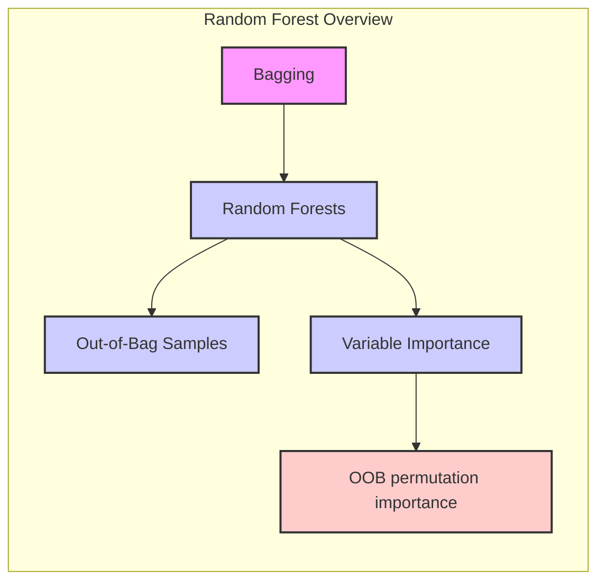
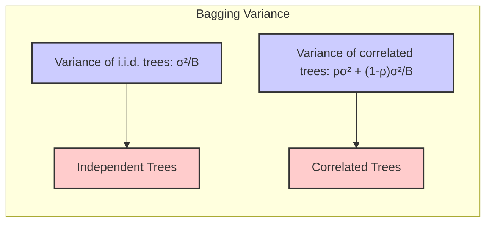
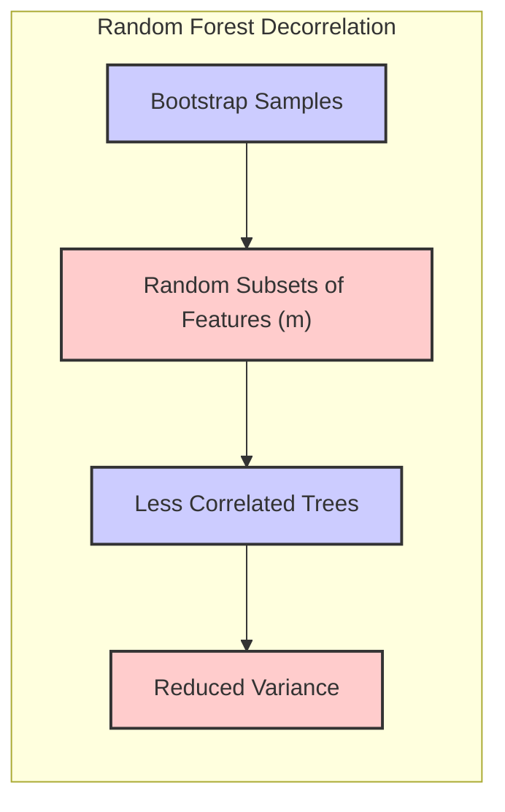
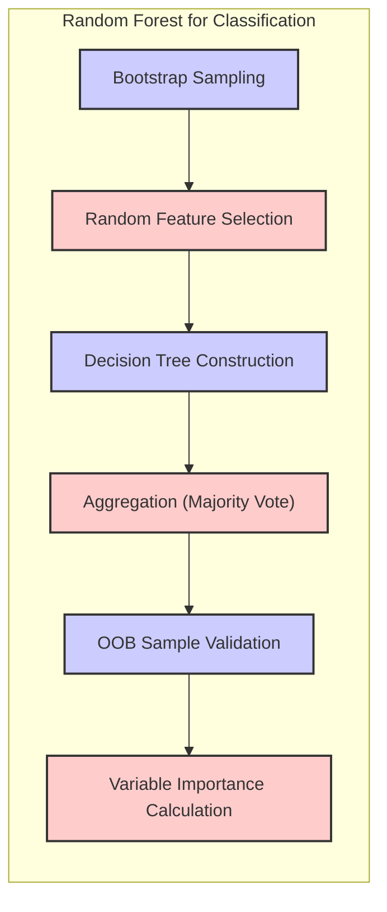
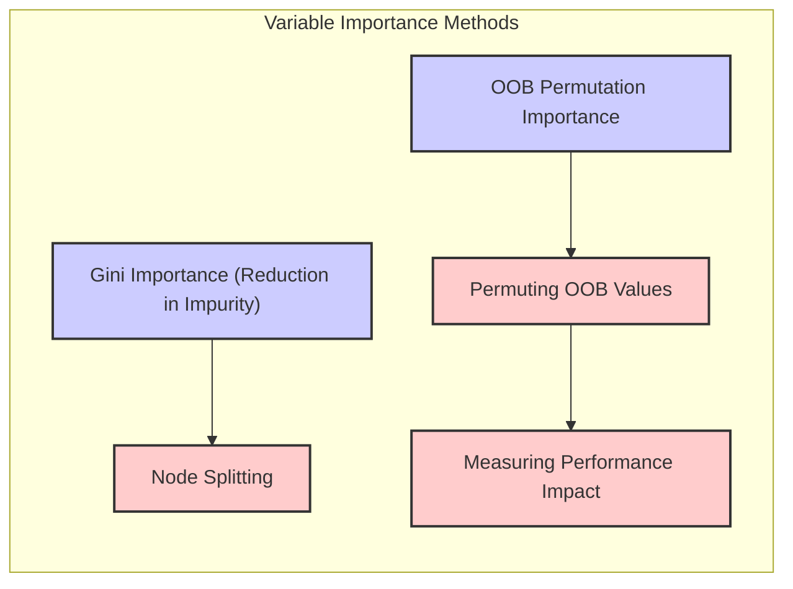
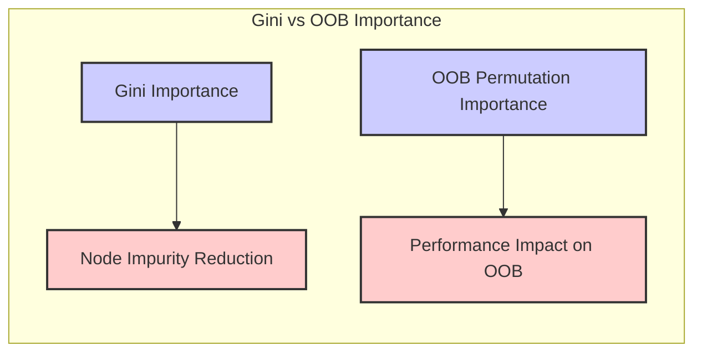

## Random Forests: OOB Permutation Importance and Beyond

### Introdução
Os **Random Forests** são um método poderoso de aprendizado de máquina, amplamente utilizado tanto para classificação quanto para regressão, como apresentado em [^15.1]. Sua popularidade decorre de sua capacidade de construir modelos complexos com relativamente pouco ajuste, através da combinação de árvores de decisão descorrelacionadas [^15.1]. O princípio fundamental por trás do Random Forest é a **agregação bootstrap**, ou *bagging* [^15.1], uma técnica que visa reduzir a variância de estimativas combinando várias árvores ajustadas a diferentes amostras dos dados. No entanto, o Random Forest aprimora o bagging introduzindo um elemento adicional de aleatoriedade durante a construção das árvores, especificamente na seleção de variáveis candidatas a cada divisão [^15.2]. A **OOB (Out-of-Bag) permutation importance** emerge como uma ferramenta crucial para entender a importância relativa das variáveis no modelo, sem a necessidade de validação cruzada adicional [^15.3.1]. Este capítulo aprofundará esses conceitos, focando especialmente na OOB permutation importance e como ela complementa outros métodos de avaliação de importância variável.

### Conceitos Fundamentais
**Conceito 1: Bagging e o Problema de Variância**
O **bagging** é uma técnica que visa reduzir a variância de modelos, como árvores de decisão, que são suscetíveis a *overfitting* [^15.1]. Ele opera criando várias amostras de bootstrap a partir dos dados de treinamento e, em seguida, ajustando um modelo a cada uma dessas amostras [^15.1]. A previsão final é obtida agregando as previsões de todos os modelos, como por exemplo, por meio de uma média para regressão ou votação majoritária para classificação [^15.1]. Essa abordagem é especialmente útil para modelos com baixo viés e alta variância [^15.1]. A variância da média de variáveis aleatórias i.i.d (independentes e identicamente distribuídas) é dada por $\frac{\sigma^2}{B}$ onde $\sigma^2$ é a variância individual, e $B$ o número de amostras [^15.2]. No entanto, quando as variáveis são apenas identicamente distribuídas e têm correlação positiva $ \rho$, essa variância é dada por $\rho \sigma^2 + \frac{1 - \rho}{B} \sigma^2$ [^15.2], mostrando que a correlação entre os modelos limita o benefício da média, portanto, reduzir essa correlação é essencial [^15.2].

> 💡 **Exemplo Numérico:** Suponha que temos árvores de decisão com variância $\sigma^2 = 4$. Se as árvores forem i.i.d e usarmos $B=100$ árvores no bagging, a variância da média será $\frac{4}{100} = 0.04$. No entanto, se as árvores tiverem uma correlação de $\rho = 0.5$, a variância da média será $0.5 \cdot 4 + \frac{1 - 0.5}{100} \cdot 4 = 2 + 0.02 = 2.02$. Isso ilustra como a correlação aumenta a variância, demonstrando a necessidade de técnicas para descorrelacionar as árvores, como no Random Forest.
**Lemma 1:** *A expectativa da média de árvores de decisão geradas por bagging é igual à expectativa de uma única árvore*. Isso ocorre porque as árvores são i.d., garantindo que a redução da variância seja o único mecanismo de melhoria do modelo, conforme apresentado em [^15.2].

**Conceito 2: Random Forests e a Descorrelação de Árvores**
Os **Random Forests** levam a ideia de bagging um passo adiante, introduzindo aleatoriedade na construção das árvores [^15.2]. Além de usar amostras de bootstrap, o Random Forest também seleciona um subconjunto aleatório de variáveis como candidatos para cada divisão em cada árvore [^15.2]. Essa aleatoriedade tem como objetivo descorrelacionar as árvores, o que, por sua vez, reduz a variância da média do conjunto [^15.2]. O número de variáveis selecionadas aleatoriamente, $m$, é um hiperparâmetro crucial para ajustar o modelo [^15.2]. Tipicamente, $m$ é $\sqrt{p}$ para classificação e $\frac{p}{3}$ para regressão, onde $p$ é o número total de variáveis [^15.3].
> 💡 **Exemplo Numérico:** Se tivermos um dataset com $p=16$ variáveis, um valor comum para $m$ em um problema de classificação seria $\sqrt{16} = 4$. Isso significa que para cada divisão em cada árvore, apenas 4 variáveis aleatórias serão consideradas como possíveis candidatas. Para um problema de regressão com $p=15$, $m$ seria tipicamente $\frac{15}{3} = 5$.
**Corolário 1:** Reduzir o número de variáveis $m$ resulta em árvores mais descorrelacionadas, o que, por sua vez, diminui a variância da média do conjunto, de acordo com [^15.2] e a fórmula (15.1).

**Conceito 3: OOB Samples e sua Utilidade**
Uma das características notáveis dos Random Forests é a utilização de amostras **Out-of-Bag (OOB)** [^15.3.1]. Durante o processo de bootstrap, algumas observações não são incluídas em cada amostra e essas são as amostras OOB [^15.3.1]. Essas amostras podem ser usadas para avaliar o desempenho do modelo sem a necessidade de validação cruzada [^15.3.1]. Cada observação tem um preditor de floresta aleatória construído a partir das árvores em que essa observação não foi usada [^15.3.1]. Essa abordagem fornece uma estimativa de erro quase idêntica à validação cruzada N-fold, mas sem custo computacional adicional, como mencionado em [^15.3.1].
> ⚠️ **Nota Importante:** O erro OOB é uma estimativa de desempenho do modelo muito confiável, comparável à validação cruzada, e é calculada internamente no processo de treinamento.
> 💡 **Exemplo Numérico:** Imagine que temos 100 amostras de dados. Ao criar amostras de bootstrap para 100 árvores, cada amostra terá, aproximadamente, 63.2% das amostras originais (devido à amostragem com reposição). As amostras restantes, cerca de 36.8%, são as amostras OOB para cada árvore. Para cada observação, podemos calcular sua predição usando apenas as árvores para as quais ela estava fora da amostra.

### Regressão Linear e Mínimos Quadrados para Classificação

A regressão linear tradicionalmente não é usada diretamente para classificação, mas é importante entender como o Random Forest contorna essa limitação, utilizando os princípios de bagging e aleatorização na construção de árvores de decisão. As árvores de decisão, por sua vez, são capazes de capturar interações complexas entre as variáveis e, quando combinadas em um Random Forest, tornam-se um preditor eficiente para problemas de classificação [^15.2].

Ao contrário dos métodos lineares que estimam coeficientes diretamente a partir de todos os dados de treinamento, o Random Forest usa amostras bootstrap e subconjuntos de variáveis para construir cada árvore, o que é um desvio fundamental da abordagem linear clássica [^15.2]. Isso permite que o modelo capture relações não-lineares e reduza o risco de *overfitting* [^15.2]. Em cada nó de uma árvore, a escolha da variável de divisão ideal é realizada através de critérios que medem a redução da impureza, como o índice de Gini [^15.3.2]. No entanto, ao utilizar apenas um subconjunto de variáveis candidatas, o Random Forest garante que nenhuma variável domine a estrutura da árvore, promovendo maior diversidade no conjunto [^15.2].
**Lemma 2:** *A variância da média de árvores geradas por bagging é sempre menor ou igual à variância de uma única árvore*. Essa desigualdade é estrita se houver correlação entre as árvores [^15.2], demonstrando a importância de descorrelacionar as árvores com Random Forests.

**Corolário 2:** *A escolha aleatória de variáveis em Random Forests reduz a correlação entre as árvores*. Isso leva a uma redução maior da variância quando comparado com bagging tradicional, conforme em [^15.2] e na equação (15.1).

> ❗ **Ponto de Atenção:** Embora a regressão linear não seja diretamente usada em Random Forests para classificação, entender seus princípios ajuda a contrastar os mecanismos de cada método.

### Métodos de Seleção de Variáveis e Regularização em Classificação

A seleção de variáveis em Random Forests não é feita através de métodos de regularização, como em regressão logística ou SVM, mas sim através da seleção aleatória de variáveis candidatas em cada divisão e através do uso de métricas de importância de variável, incluindo a **OOB permutation importance** [^15.2]. Esta última mede a importância de uma variável avaliando o quanto a performance do modelo diminui quando os valores dessa variável são permutados nas amostras OOB [^15.3.2]. Esta abordagem é diferente da penalização L1 ou L2 usada em modelos lineares, pois ela avalia diretamente o impacto preditivo de cada variável e não apenas o valor dos seus coeficientes [^15.2]. A seleção aleatória de variáveis em cada nó da árvore e o uso de amostras OOB, atuam como métodos de regularização implícitos dentro do Random Forest, controlando *overfitting* e evitando que uma única variável domine a árvore [^15.2].

O cálculo da OOB permutation importance envolve as seguintes etapas: para cada árvore, a precisão preditiva é avaliada nas amostras OOB. Em seguida, para cada variável, os valores dessa variável nas amostras OOB são permutados aleatoriamente e a precisão preditiva é reavaliada. A diminuição na precisão (geralmente medida como erro ou acurácia), quando a variável é permutada, é usada como uma medida de importância da variável [^15.3.2].
> 💡 **Exemplo Numérico:** Considere um Random Forest com 100 árvores ajustado a um conjunto de dados. Para uma variável específica, digamos 'idade', e para uma árvore específica,  calculamos a precisão da árvore em suas amostras OOB. Vamos supor que a precisão seja 0.85. Em seguida, permutamos aleatoriamente os valores de 'idade' nas amostras OOB e recalculamos a precisão, que agora é 0.78. A diminuição da precisão, 0.85 - 0.78 = 0.07, é a medida de importância para esta árvore e esta variável. Fazemos isso para todas as árvores e variáveis, calculando a média das diminuições na acurácia para obter a importância final de cada variável.

**Lemma 3:** *A permutação aleatória de valores de uma variável em amostras OOB invalida a contribuição dessa variável para a predição*. Portanto, a diminuição da acurácia na predição reflete a importância dessa variável no modelo, conforme apresentado em [^15.3.2].
**Prova do Lemma 3:** Dado que o Random Forest é construído para aprender as relações entre variáveis preditoras e a variável resposta, ao embaralharmos uma variável em particular, nós quebramos a relação aprendida pelo modelo para essa variável específica. Se esta variável for importante para a predição, a performance do modelo será reduzida, já que agora os padrões aprendidos para essa variável são inválidos. $\blacksquare$
**Corolário 3:** Variáveis mais importantes resultam em uma maior diminuição da acurácia quando seus valores são permutados aleatoriamente nas amostras OOB. Isso permite comparar a importância de diferentes variáveis no mesmo modelo, conforme discutido em [^15.3.2].
> 💡 **Exemplo Numérico:** Suponha que, após o processo de permutação OOB, obtivemos as seguintes reduções médias de acurácia para três variáveis: 'renda' = 0.15, 'idade' = 0.05 e 'educação' = 0.02. Isso sugere que 'renda' é a variável mais importante para o modelo, seguida por 'idade', e 'educação' tem a menor importância entre as três.

### Separating Hyperplanes e Perceptrons
A abordagem dos **Separating Hyperplanes** e Perceptrons é fundamentalmente diferente do Random Forest. Métodos como SVM (Support Vector Machines) buscam encontrar um hiperplano que maximize a margem de separação entre diferentes classes [^15.2]. O Random Forest, por outro lado, não se baseia na busca por hiperplanos, mas sim na construção de múltiplas árvores de decisão, que são agregadas para formar uma previsão final. Enquanto os métodos de hiperplano se focam na geometria dos dados, Random Forest foca na construção de modelos que capturam a complexidade das relações entre variáveis por meio de divisões sucessivas em árvores [^15.1].
Os perceptrons, uma forma simples de redes neurais, buscam aprender um separador linear através de um processo de atualização iterativo dos pesos. Embora sejam capazes de separar dados linearmente separáveis, perceptrons não conseguem lidar com problemas complexos. Por outro lado, Random Forests, com sua capacidade de modelar relações não-lineares, são geralmente mais adequados para problemas de classificação e regressão do mundo real [^15.2].

> ✔️ **Destaque**: Random Forests não buscam hiperplanos separadores, mas constroem várias árvores de decisão agregadas. Métodos de hiperplanos buscam a melhor separação geométrica entre as classes.

### Pergunta Teórica Avançada:
#### Qual a relação entre a OOB permutation importance e a importância de variáveis calculada usando o índice de Gini em Random Forests?
**Resposta:**
A importância das variáveis calculada pelo índice de Gini é baseada em avaliar a redução da impureza de um nó em cada árvore quando uma determinada variável é usada para a divisão [^15.3.2]. A importância é então acumulada sobre todas as árvores [^15.3.2]. Já a OOB permutation importance avalia a importância das variáveis diretamente através da sua influência na performance do modelo [^15.3.2]. Ao embaralhar os valores de uma variável nas amostras OOB e recalcular o erro, a importância é diretamente medida pelo quanto essa variável contribui para o poder preditivo do modelo. A importância do Gini é intrínseca à construção da árvore, enquanto a OOB permutation importance avalia o efeito da variável no resultado final do modelo [^15.3.2].
**Lemma 4:** A importância do Gini mede o quão bem uma variável separa as classes dentro de uma árvore, enquanto a OOB permutation importance mede diretamente o impacto de uma variável na acurácia do modelo.
**Corolário 4:** Variáveis com alta importância Gini podem não ter necessariamente alta OOB permutation importance, e vice-versa, pois as duas medidas estão avaliando aspectos diferentes da contribuição de uma variável no modelo.
> 💡 **Exemplo Numérico:** Uma variável 'X' pode ter uma alta importância Gini porque ela causa uma redução significativa na impureza dos nós onde ela é utilizada para divisão em várias árvores. No entanto, sua OOB permutation importance pode ser baixa se, globalmente, embaralhar os valores dessa variável não impacta muito a acurácia do modelo em amostras OOB. Isso pode acontecer se essa variável estiver correlacionada com outras variáveis e a informação que ela carrega é redundante. Por outro lado, outra variável 'Y' pode ter baixa importância Gini, mas uma alta OOB permutation importance, indicando que, apesar de não ser frequentemente utilizada em divisões, ela é crucial para a acurácia do modelo quando a informação que ela fornece é perturbada por embaralhamento.

### Conclusão
O Random Forest é uma técnica poderosa que utiliza princípios de bagging e aleatorização para construir um modelo robusto e com alta capacidade preditiva, como indicado em [^15.1] e [^15.2]. O uso de amostras OOB e a técnica de OOB permutation importance são recursos importantes que permitem avaliar o desempenho e a importância das variáveis sem a necessidade de validação cruzada adicional [^15.3.1] e [^15.3.2]. Este capítulo aprofundou os conceitos fundamentais do Random Forest, destacando as diferenças entre essa abordagem e métodos lineares ou baseados em hiperplanos. A análise da OOB permutation importance e sua comparação com o índice de Gini fornece uma visão mais completa do comportamento do Random Forest, e ajuda a entender as nuances de seus mecanismos de funcionamento, complementando a análise fornecida no contexto e apresentando uma base sólida para futuros estudos e aplicações.
<!-- END DOCUMENT -->
### Footnotes
[^15.1]: *“Bagging or bootstrap aggregation (section 8.7) is a technique for reducing the variance of an estimated prediction function. Bagging seems to work especially well for high-variance, low-bias procedures, such as trees. For regression, we simply fit the same regression tree many times to bootstrap-sampled versions of the training data, and average the result. For classifi- cation, a committee of trees each cast a vote for the predicted class. Random forests (Breiman, 2001) is a substantial modification of bagging that builds a large collection of de-correlated trees, and then averages them.”* (Trecho de *Random Forests*)
[^15.2]: *“The essential idea in bagging (Section 8.7) is to average many noisy but approximately unbiased models, and hence reduce the variance. Trees are ideal candidates for bagging, since they can capture complex interaction structures in the data, and if grown sufficiently deep, have relatively low bias. Since trees are notoriously noisy, they benefit greatly from the averaging. Moreover, since each tree generated in bagging is identically distributed (i.d.), the expectation of an average of B such trees is the same as the ex- pectation of any one of them. This means the bias of bagged trees is the same as that of the individual trees, and the only hope of improvement is through variance reduction.”* (Trecho de *Random Forests*)
[^15.3]: *“Typically values for m are √p or even as low as 1. After B such trees {T(x; Θ₁)}f are grown, the random forest (regression) predictor is f_rf(x) = (1/B) Σ T(x; Θ_b). As in Section 10.9 (page 356), Θ_b characterizes the bth random forest tree in terms of split variables, cutpoints at each node, and terminal-node values. Intuitively, reducing m will reduce the correlation between any pair of trees in the ensemble, and hence by (15.1) reduce the variance of the average.”* (Trecho de *Random Forests*)
[^15.3.1]: *“For each observation zi = (xi, Yi), construct its random forest predictor by averaging only those trees corresponding to bootstrap samples in which zi did not appear. An oob error estimate is almost identical to that obtained by N-fold cross- validation; see Exercise 15.2. Hence unlike many other nonlinear estimators, random forests can be fit in one sequence, with cross-validation being per- formed along the way. Once the OOB error stabilizes, the training can be terminated.”* (Trecho de *Random Forests*)
[^15.3.2]: *“At each split in each tree, the improvement in the split-criterion is the importance measure attributed to the splitting variable, and is accumulated over all the trees in the forest separately for each variable. Random forests also use the OOB samples to construct a different variable- importance measure, apparently to measure the prediction strength of each variable. When the bth tree is grown, the OOB samples are passed down the tree, and the prediction accuracy is recorded. Then the values for the jth variable are randomly permuted in the OOB samples, and the accuracy is again computed. The decrease in accuracy as a result of this permuting is averaged over all trees, and is used as a measure of the importance of variable j in the random forest.”* (Trecho de *Random Forests*)
