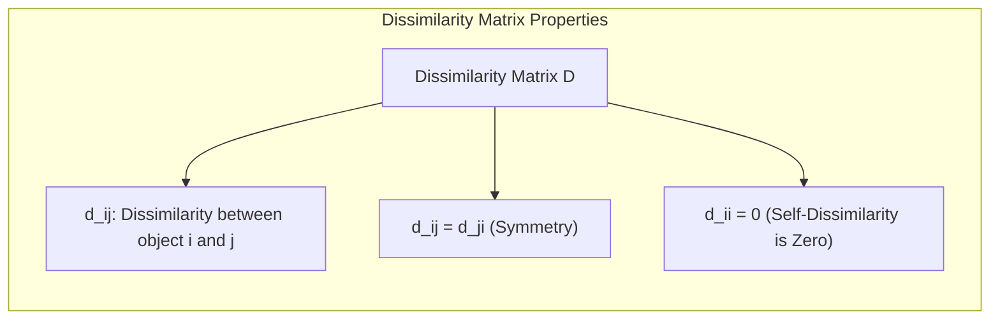
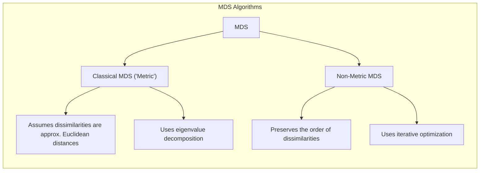
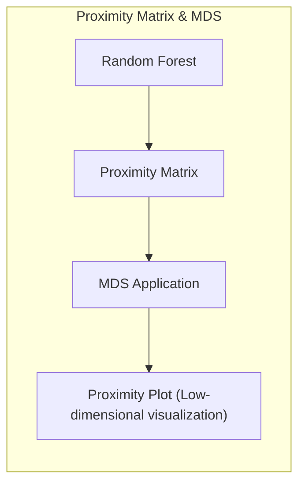
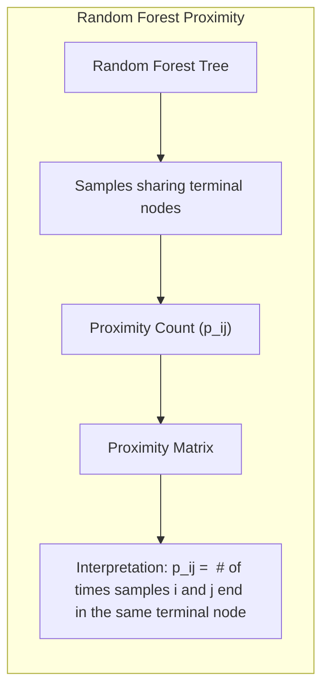
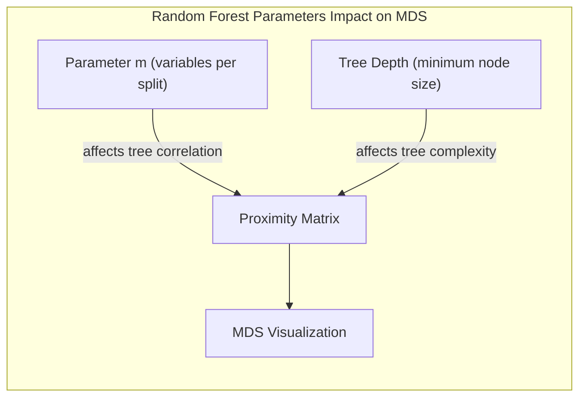
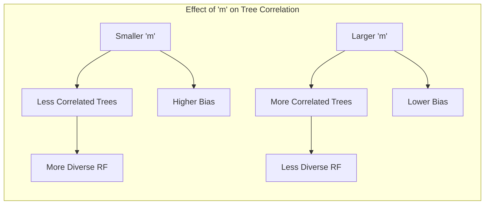
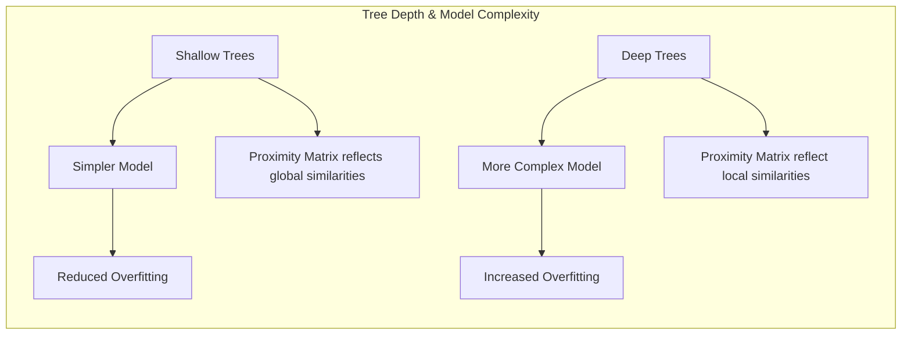
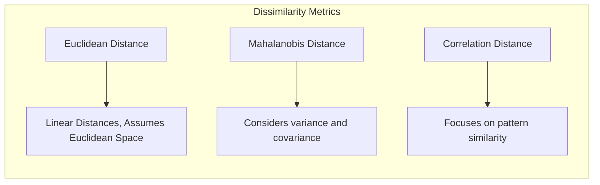
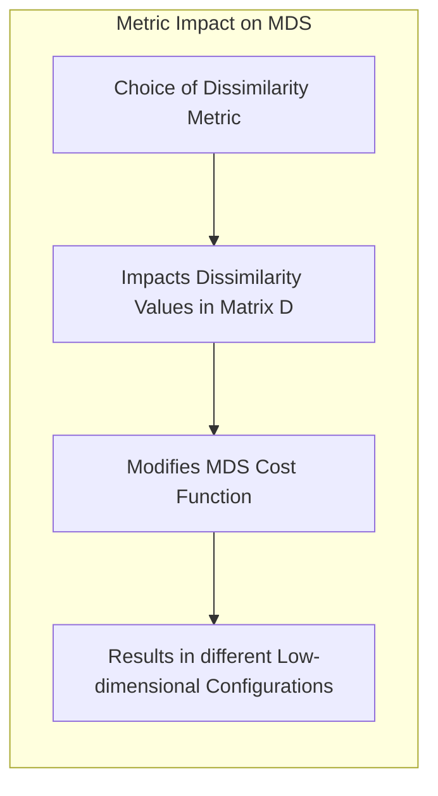

## Multidimensional Scaling Plots: Visualização de Similaridade em Espaços de Alta Dimensionalidade


### Introdução
O **Multidimensional Scaling (MDS)**, ou Escalonamento Multidimensional, é um conjunto de técnicas estatísticas e de aprendizado de máquina que visa visualizar a estrutura de dados de alta dimensionalidade em um espaço de baixa dimensionalidade, geralmente 2D ou 3D [^15.3.3]. O MDS busca preservar as similaridades ou dissimilaridades entre os dados originais, permitindo que relações complexas sejam interpretadas visualmente.  Diferentemente de métodos de redução de dimensionalidade como PCA (Principal Component Analysis), o MDS não depende necessariamente de uma representação vetorial dos dados, sendo capaz de operar a partir de matrizes de distância ou dissimilaridade [^15.3.3]. MDS é particularmente útil em situações onde as características subjacentes dos dados são difíceis de obter diretamente e onde a relação entre os objetos é mais importante do que as dimensões originais [^15.3.3].

### Conceitos Fundamentais

**Conceito 1: Matriz de Dissimilaridade (ou Similaridade)**
O ponto de partida para o MDS é uma matriz que quantifica a dissimilaridade (ou similaridade) entre todos os pares de objetos. Esta matriz pode ser derivada de diversas fontes, como distâncias euclidianas, correlações, ou medidas customizadas de dissimilaridade [^15.3.3].
  *   Uma matriz de dissimilaridade $D$ de tamanho $n \times n$ é definida tal que o elemento $d_{ij}$ representa a dissimilaridade entre o objeto $i$ e o objeto $j$. Quanto maior o valor de $d_{ij}$, menos similares são os objetos.

> 💡 **Exemplo Numérico:** Vamos considerar um conjunto de 4 objetos (A, B, C, D) e uma matriz de dissimilaridade calculada através de alguma métrica (e.g., distância euclidiana entre dados originais que não temos acesso).  A matriz $D$ poderia ser:
>
> ```
>       A    B    C    D
>   A   0.0  2.1  3.5  5.0
>   B   2.1  0.0  1.8  3.2
>   C   3.5  1.8  0.0  1.5
>   D   5.0  3.2  1.5  0.0
> ```
>
> Nesta matriz, $d_{AB} = 2.1$ indica que os objetos A e B são menos similares do que os objetos C e D ($d_{CD} = 1.5$). Note que a diagonal principal é sempre zero ($d_{ii} = 0$) porque a dissimilaridade de um objeto consigo mesmo é nula. Os valores fora da diagonal mostram o quão diferentes os objetos são entre si.

**Lemma 1:** A matriz de dissimilaridade $D$ é uma representação de dados flexível, podendo ser utilizada quando os dados originais não são vetoriais.
*   **Prova:** A matriz de dissimilaridade $D$ pode ser definida usando várias métricas, como a distância de Mahalanobis ou distância de correlação, que não necessariamente requerem representação vetorial dos objetos [^15.3.3]. A única exigência é que $d_{ij} = d_{ji}$ e $d_{ii} = 0$. $\blacksquare$


**Conceito 2: Mapeamento para Espaço de Baixa Dimensionalidade**
O objetivo principal do MDS é encontrar uma configuração de pontos em um espaço de baixa dimensionalidade (tipicamente $k=2$ ou $k=3$) tal que as distâncias entre esses pontos reflitam as dissimilaridades originais. As coordenadas dos pontos no novo espaço são as saídas do MDS.

**Corolário 1:** O MDS pode ser visto como um problema de otimização, onde se busca minimizar uma função de custo que quantifica a diferença entre as distâncias no novo espaço e as dissimilaridades originais [^15.3.3].
*  *A minimização desta função de custo é crucial para garantir a representatividade do mapeamento.*

> 💡 **Exemplo Numérico:** Continuando com o exemplo anterior, o MDS busca mapear os objetos A, B, C e D para um espaço 2D (por exemplo, um gráfico) de tal forma que as distâncias entre os pontos no gráfico sejam aproximadamente iguais às dissimilaridades da matriz D. Imagine que após a aplicação do MDS (usando, por exemplo, o método Classical MDS) obtivemos as seguintes coordenadas 2D para cada objeto:
>
>   *   A: (0.5, 1.0)
>   *   B: (2.5, 1.2)
>   *   C: (3.0, 2.8)
>   *   D: (4.5, 2.5)
>
> Calculando as distâncias euclidianas entre esses pontos, teríamos, por exemplo,  $d'(A,B) = \sqrt{(2.5 - 0.5)^2 + (1.2 - 1.0)^2} \approx 2.01 $.  O objetivo do MDS é que esta distância $d'(A,B)$ se aproxime da dissimilaridade original $d_{AB} = 2.1$.  A qualidade do mapeamento é medida pela minimização da função de custo (stress function).
>
> ```mermaid
>   graph LR
>       A(A(0.5, 1.0)) --> B(B(2.5, 1.2))
>       A --> C(C(3.0, 2.8))
>       A --> D(D(4.5, 2.5))
>       B --> C
>       B --> D
>       C --> D
> ```
>  Visualmente, os pontos B e C estão mais próximos entre si, refletindo a menor dissimilaridade na matriz D.

**Conceito 3: Algoritmos de MDS (Classical MDS e Non-Metric MDS)**
Existem diferentes algoritmos para realizar o MDS. O **Classical MDS** ou MDS métrico, assume que as dissimilaridades são aproximadamente distâncias euclidianas. Já o **Non-Metric MDS** ou MDS não-métrico, relaxa essa suposição e se concentra em preservar a ordem das dissimilaridades [^15.3.3].
  *  O Classical MDS utiliza a decomposição em autovalores da matriz de produtos internos, enquanto o Non-Metric MDS usa métodos de otimização iterativos.



> 💡 **Exemplo Numérico:** Para ilustrar a diferença entre os dois métodos, imagine que as dissimilaridades da matriz D anterior não representam distâncias euclidianas, mas apenas a ordem de dissimilaridade.  Nesse caso, o Non-Metric MDS seria mais apropriado, pois ele não se preocupa em manter as distâncias exatas, mas sim em garantir que os pontos mais similares (menores valores em D) apareçam mais próximos no espaço de baixa dimensionalidade. O Classical MDS, por outro lado, tentaria preservar os valores numéricos das dissimilaridades como se fossem distâncias.

> ⚠️ **Nota Importante**: A escolha entre Classical e Non-Metric MDS depende da natureza dos dados e das suposições que se podem fazer sobre eles. **Referência ao tópico [^15.3.3]**.

### Regressão Linear e Mínimos Quadrados para Classificação

O MDS não é um método de classificação, e sim uma técnica de redução e visualização de dimensionalidade. No entanto, os dados visualizados pelo MDS podem ser usados como input para classificadores. No contexto do capítulo, vamos explorar como a matriz de proximidade utilizada pelo Random Forest, um método de classificação, se relaciona com o MDS. O tópico [^15.3.3] nos apresenta um tipo de visualização chamada *Proximity Plot*, que é gerado a partir da matriz de proximidade de um Random Forest.



**Lemma 2:** A matriz de proximidade de um Random Forest pode ser interpretada como uma matriz de similaridade, onde a proximidade entre dois pontos é dada pelo número de vezes que eles compartilharam o mesmo nó terminal nas árvores do Random Forest.
* **Prova:** Conforme descrito em [^15.3.3], a matriz de proximidade é construída contando quantas vezes cada par de amostras termina no mesmo nó em cada árvore. Assim, quanto mais vezes dois pontos terminam juntos, mais semelhantes eles são do ponto de vista do Random Forest. $\blacksquare$

**Corolário 2:** O MDS aplicado à matriz de proximidade de um Random Forest pode revelar agrupamentos e estruturas nos dados que podem não ser evidentes no espaço original de alta dimensionalidade, como mostrado em [^15.3.3].
 *  *Essa visualização permite entender melhor como o Random Forest está processando os dados, mesmo sem conhecer as variáveis originais.*

> 💡 **Exemplo Numérico:** Imagine que temos um conjunto de dados de pacientes com duas classes: Doente e Saudável. Após construir um Random Forest, obtemos uma matriz de proximidade. Se dois pacientes frequentemente terminam no mesmo nó das árvores, o valor correspondente na matriz de proximidade é alto. Ao aplicar MDS nesta matriz, esperamos que os pacientes da mesma classe se agrupem no espaço 2D gerado pelo MDS, e que pacientes de classes distintas se encontrem mais distantes, o que facilita a interpretação e análise da eficácia do Random Forest.

É crucial notar que, embora o MDS possa ser utilizado para visualizar dados usados em classificação, ele não é, em si, um método de classificação. O MDS é uma ferramenta que auxilia na compreensão das relações entre os dados e pode complementar os métodos de classificação como o Random Forest.

> ❗ **Ponto de Atenção**: O MDS não deve ser usado como substituto para métodos de classificação, mas sim como um auxiliar para a análise e compreensão dos dados. **Conforme indicado em [^15.3.3]**.

### Métodos de Seleção de Variáveis e Regularização em Classificação

Embora o MDS em si não realize seleção de variáveis, ele permite a visualização dos dados, o que pode guiar na escolha das variáveis mais importantes para um problema de classificação. A regularização, por sua vez, é uma técnica para simplificar modelos e reduzir o overfitting, impactando indiretamente a visualização MDS, já que dados processados por métodos de regularização podem levar a uma estrutura diferente da matriz de dissimilaridades.
No contexto do capítulo, a seleção de variáveis no random forest por meio da escolha aleatória de m variáveis candidatas a cada divisão [^15.2], e a regularização por meio do controle da profundidade da árvore, têm um impacto indireto na estrutura de proximidade utilizada no MDS.



**Lemma 3:** A escolha de *m*, o número de variáveis candidatas em cada split em um Random Forest, afeta a correlação entre as árvores e, consequentemente, a matriz de proximidade, impactando a visualização MDS resultante.
*   **Prova:** Como discutido em [^15.2], a escolha de um valor menor de *m* leva a árvores menos correlacionadas, e também aumenta o viés de cada árvore. Uma matriz de proximidade calculada com essas árvores menos correlacionadas deve refletir um padrão diferente dos dados. $\blacksquare$

> 💡 **Exemplo Numérico:** Suponha que em um Random Forest, temos 10 variáveis (features) disponíveis. Se escolhermos *m* = 2, cada árvore considerará apenas 2 dessas 10 variáveis para cada split. Isso levará a árvores mais diversas, e a matriz de proximidade refletirá essa diversidade, o que pode levar a um MDS com agrupamentos diferentes do que seria obtido se usássemos *m* = 8, por exemplo. Se as features são redundantes, um valor baixo de *m* pode ser bom para evitar árvores muito parecidas.


**Prova do Lemma 3:** A redução de *m* faz com que as árvores base do Random Forest se tornem menos correlacionadas, devido a uma menor probabilidade de que elas escolham as mesmas variáveis em cada split. Isso impacta a matriz de proximidade porque ela é construída a partir de árvores menos semelhantes, resultando em uma visualização MDS diferente.
$\blacksquare$

**Corolário 3:** A profundidade máxima das árvores do Random Forest, que pode ser controlada por um mínimo tamanho do nó, também afeta a matriz de proximidade e a visualização MDS, similarmente à regularização.
*  *A profundidade das árvores controla a complexidade do modelo e a matriz de proximidade refletirá essa complexidade na visualização MDS.*

> 💡 **Exemplo Numérico:** Limitar a profundidade da árvore, por exemplo, definindo um tamanho mínimo de nó de 10, faz com que cada árvore se torne mais simples, menos propensa ao overfitting. A matriz de proximidade gerada por um Random Forest com árvores rasas será diferente da matriz obtida com árvores mais profundas, afetando a visualização MDS. Uma árvore muito profunda pode fazer com que a proximidade entre pontos seja muito "localizada", e árvores mais rasas geram matrizes com mais pontos "conectados".


### Separating Hyperplanes e Perceptrons
O MDS é uma técnica de visualização e não está diretamente relacionado com métodos de classificação como Separating Hyperplanes ou Perceptrons. No entanto, podemos analisar como as visualizações geradas pelo MDS se relacionam com a separabilidade das classes em um espaço de baixa dimensão. Por exemplo, um MDS poderia ser aplicado à matriz de distância entre dados de diferentes classes. Uma visualização em que os pontos de diferentes classes estejam bem separados sugere que um modelo linear como um Separating Hyperplane pode ser efetivo.

> 💡 **Exemplo Numérico:** Suponha que aplicamos MDS a dados de duas classes (A e B) e obtemos o seguinte plot:
>
> ```mermaid
>   graph LR
>       A1(A) --> A2(A)
>       A1 --> A3(A)
>       B1(B) --> B2(B)
>       B1 --> B3(B)
>       style A1 fill:#f9f,stroke:#333,stroke-width:2px
>       style A2 fill:#f9f,stroke:#333,stroke-width:2px
>       style A3 fill:#f9f,stroke:#333,stroke-width:2px
>       style B1 fill:#ccf,stroke:#333,stroke-width:2px
>        style B2 fill:#ccf,stroke:#333,stroke-width:2px
>        style B3 fill:#ccf,stroke:#333,stroke-width:2px
>
> ```
>
>  Se no gráfico gerado pelo MDS, os pontos da classe A (roxos) se agrupam em uma região e os pontos da classe B (azuis) em outra, com uma clara separação, isso sugere que um hiperplano separador pode ser eficiente para classificar esses dados, o que possibilita o uso de métodos lineares como um perceptron.

### Pergunta Teórica Avançada: Como a escolha da métrica de dissimilaridade impacta o resultado do MDS e qual a relação entre essa escolha e o tipo de estrutura que se espera nos dados?
**Resposta:** A escolha da métrica de dissimilaridade é crucial para o MDS, já que essa métrica define a base da estrutura a ser preservada na visualização. Diferentes métricas ressaltam diferentes aspectos dos dados:
*   **Distância Euclidiana:** Adequada para dados onde as distâncias lineares são relevantes. Assume que os dados estão distribuídos aproximadamente em um espaço Euclidiano, e é utilizada para casos como o Classical MDS.
*   **Distância de Mahalanobis:** Considera a variância e covariância dos dados, sendo mais apropriada quando as variáveis não são independentes. Útil quando os dados estão em diferentes escalas e não devem ser interpretados de forma linear.
*   **Distância de Correlação:** Foca na similaridade de padrões ou tendências, ignorando a escala. Adequada para dados que representam séries temporais ou padrões de expressão gênica.


A escolha da métrica afeta a estrutura do mapa MDS. Se a métrica escolhida não for adequada para os dados, o mapa pode apresentar distorções e não refletir as verdadeiras relações entre os objetos. Por exemplo, usar a distância euclidiana em dados de texto, onde a semelhança de palavras pode ser não-linear, pode levar a resultados ruins. A escolha deve refletir o tipo de estrutura que se espera nos dados. Se se espera que grupos sejam bem separados, uma métrica que enfatize a separação entre grupos é mais adequada. Se a estrutura é contínua, uma métrica que capture as variações gradativas pode ser mais útil.
**Lemma 4:** A escolha da métrica de dissimilaridade afeta a função de custo que o MDS busca minimizar e, por consequência, a configuração final dos pontos no espaço de baixa dimensão.
*   **Prova:** A função de custo do MDS compara as distâncias no espaço de baixa dimensão com as dissimilaridades originais. Ao mudar a métrica, mudamos o valor dessas dissimilaridades e o ótimo da função de custo, levando a uma configuração diferente dos pontos. $\blacksquare$


> 💡 **Exemplo Numérico:** Considere um conjunto de dados de séries temporais de ações. Se utilizarmos a distância euclidiana, enfatizaremos diferenças na amplitude das séries. Ao passo que se utilizarmos a distância de correlação, vamos focar nas diferenças dos padrões de variação, mesmo que as amplitudes sejam diferentes. Assim, a escolha da métrica dependerá do que se considera "similar". O MDS com a distância euclidiana pode agrupar ações com amplitude semelhante, e com distância de correlação pode agrupar ações com padrões semelhantes de variação.

**Corolário 4:**  Diferentes métricas podem levar a interpretações distintas sobre a estrutura dos dados. É essencial escolher a métrica com base no conhecimento do problema e nas características dos dados, conforme discutido em [^15.3.3].

> ⚠️ **Ponto Crucial**: A interpretação dos resultados do MDS deve levar em conta a métrica de dissimilaridade utilizada, pois diferentes métricas podem enfatizar aspectos distintos dos dados. **Conforme discutido em [^15.3.3]**.

### Conclusão
O Multidimensional Scaling é uma poderosa técnica para visualizar a estrutura de dados de alta dimensionalidade em um espaço de baixa dimensão. Embora não seja um método de classificação em si, ele pode complementar outros métodos, como o Random Forest. A escolha da métrica de dissimilaridade, a interpretação dos resultados e a sua relação com outros métodos devem ser feitas com cuidado, seguindo os fundamentos estatísticos apresentados. O Proximity Plot de Random Forests, explorado no capítulo, fornece um excelente exemplo de como usar MDS para visualizar as relações de dados.

### Footnotes
[^15.1]: *Conteúdo extraído conforme escrito no contexto e utilizado no capítulo* (Trecho de <Random Forests>)
[^15.2]: *Conteúdo extraído conforme escrito no contexto e utilizado no capítulo* (Trecho de <Random Forests>)
[^15.3]: *Conteúdo extraído conforme escrito no contexto e utilizado no capítulo* (Trecho de <Random Forests>)
[^15.3.1]: *Conteúdo extraído conforme escrito no contexto e utilizado no capítulo* (Trecho de <Random Forests>)
[^15.3.2]: *Conteúdo extraído conforme escrito no contexto e utilizado no capítulo* (Trecho de <Random Forests>)
[^15.3.3]: *Conteúdo extraído conforme escrito no contexto e utilizado no capítulo* (Trecho de <Random Forests>)
<!-- END DOCUMENT -->
