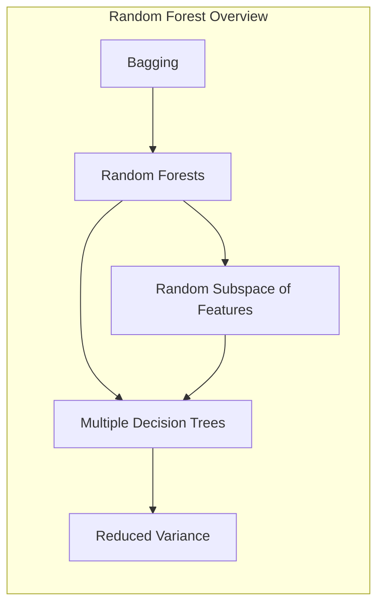
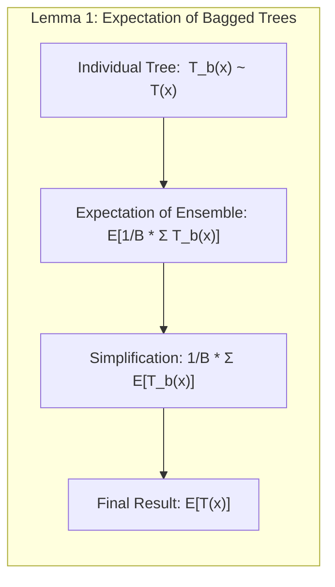
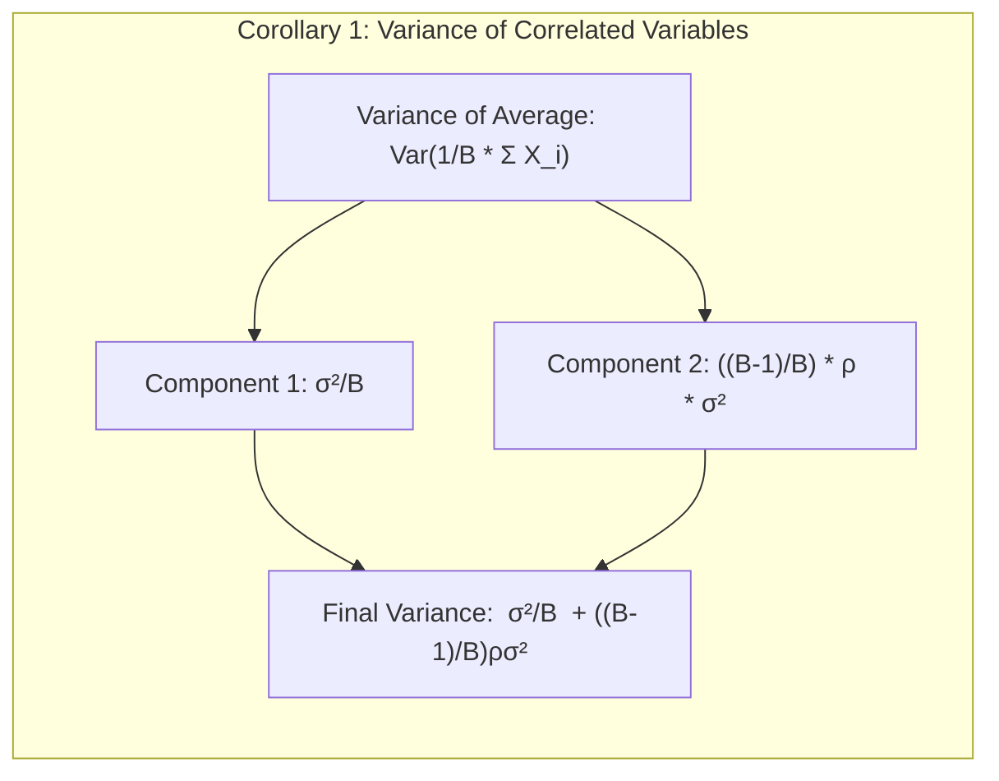
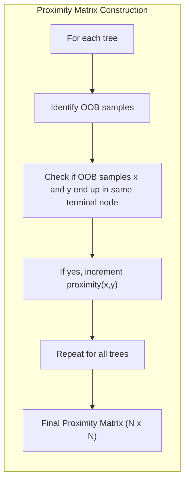
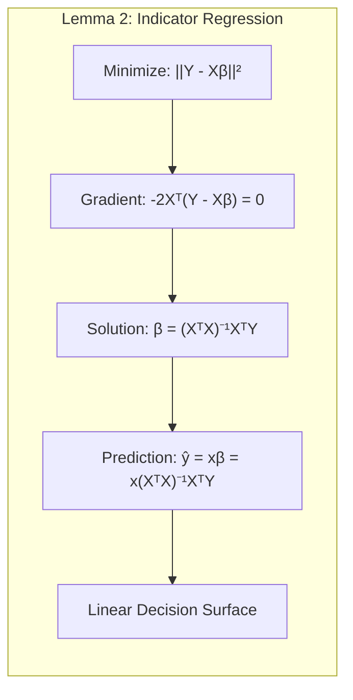
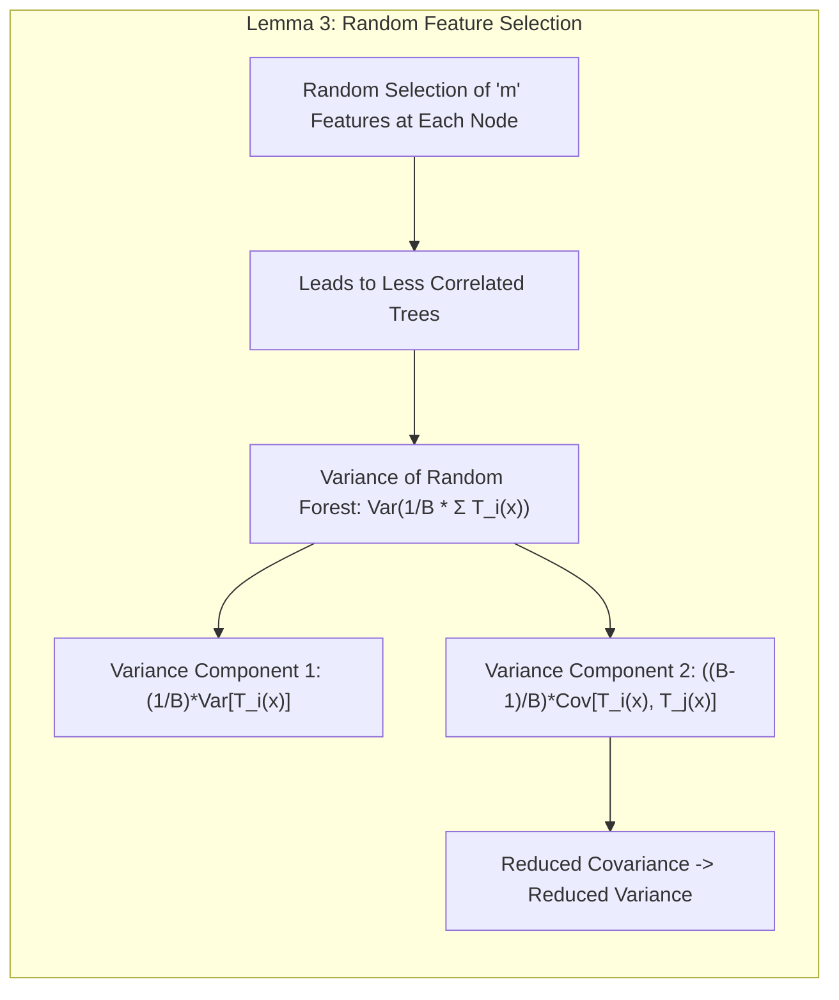
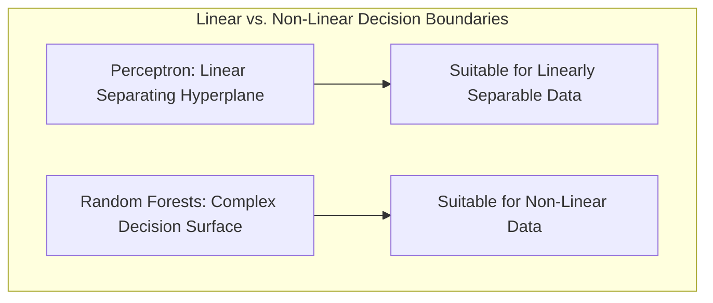
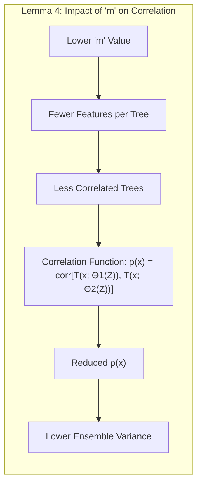

## Random Forests: A Deep Dive into Proximity Matrices

### Introdução

Este capítulo se aprofunda no conceito de **Random Forests**, uma poderosa técnica de aprendizado de máquina, com um foco particular na construção e interpretação de **Proximity Matrices**. Random Forests, como descrito em [^15.1], são uma extensão da técnica de **bagging**, que utiliza múltiplas árvores de decisão para construir modelos robustos e precisos. Exploraremos em detalhe como a aleatoriedade é introduzida no processo de construção de árvores para reduzir a correlação entre elas e como essa decorrelação leva a uma melhoria na variância do modelo, conforme citado em [^15.2]. Em especial, vamos nos concentrar na geração de **Proximity Matrices** e como elas podem ser usadas para análise e visualização dos dados.

### Conceitos Fundamentais

#### Conceito 1: Bagging e Randomização em Random Forests
**Bagging** (Bootstrap Aggregating), introduzido na seção [^15.1], é uma técnica que visa reduzir a variância de modelos instáveis, como árvores de decisão. A ideia central é treinar várias instâncias do mesmo modelo em diferentes amostras bootstrap dos dados de treinamento e, em seguida, agregar as previsões (através de médias para regressão e votação majoritária para classificação). **Random Forests** expande essa ideia introduzindo mais aleatoriedade no processo de construção da árvore, conforme descrito em [^15.1]. Além de realizar o *bootstrap sampling* dos dados, Random Forests selecionam aleatoriamente um subconjunto de variáveis candidatas a cada nó da árvore [^15.2]. Esta randomização adicional contribui para a criação de árvores mais decorrelacionadas, reduzindo ainda mais a variância do modelo agregado. A abordagem de Random Forests é especialmente benéfica para modelos que capturam bem as interações complexas, mas que são propensos a ruído.

> 💡 **Exemplo Numérico:** Considere um conjunto de dados com 100 amostras e 10 variáveis. No bagging, criaríamos várias amostras bootstrap (digamos, 100 amostras, cada uma com reposição) e construiríamos uma árvore de decisão em cada uma delas. Em Random Forests, além do bootstrap, em cada nó da árvore, selecionaríamos aleatoriamente, digamos, $\sqrt{10} \approx 3$ variáveis para considerar na divisão. Isso introduz mais aleatoriedade e diversidade nas árvores.

**Lemma 1:** *A expectativa da média de B árvores i.i.d. é igual à expectativa de qualquer uma das árvores individuais* [^15.2]. Ou seja, o bias do ensemble de árvores (em bagging) é igual ao bias de qualquer uma delas, e a redução na variância é o único ganho esperado.

**Prova do Lemma 1:** Seja $T_b(x)$ a previsão da b-ésima árvore em um ponto x e assumindo que todas são identicamente distribuídas ($T_b(x) \sim T(x)$), temos que $E[\frac{1}{B} \sum_{b=1}^B T_b(x)] = \frac{1}{B} \sum_{b=1}^B E[T_b(x)] = \frac{1}{B} \sum_{b=1}^B E[T(x)] = E[T(x)]$. $\blacksquare$

#### Conceito 2: Construção das Árvores em Random Forests
Em Random Forests, cada árvore é construída em uma amostra bootstrap dos dados de treinamento. O algoritmo, detalhado em [^15.2], começa selecionando *m* variáveis aleatoriamente entre as *p* variáveis totais. Em seguida, ele procura a melhor divisão nessa subconjunto de *m* variáveis, repetindo esse processo para cada nó terminal da árvore até que um critério de parada seja atingido (por exemplo, um tamanho mínimo de nó). Este processo é repetido para *B* árvores, resultando em um *ensemble* de árvores decorrelacionadas. A escolha do número *m* de variáveis é crucial e geralmente é definida como $\sqrt{p}$ para classificação e *p/3* para regressão, como sugerido em [^15.3]. Valores mais baixos para *m* aumentam a aleatoriedade, o que pode levar a árvores mais independentes e uma redução da variância, mas também pode aumentar o bias.

> 💡 **Exemplo Numérico:** Se tivermos um problema de classificação com *p* = 16 variáveis, geralmente escolheríamos *m* = $\sqrt{16}$ = 4 variáveis aleatórias para cada divisão em cada árvore. Se fosse um problema de regressão, *m* seria aproximadamente 16/3 ≈ 5. A diferença no *m* afeta como cada árvore é construída. Por exemplo, se *m* fosse muito alto, digamos 15, as árvores ficariam muito similares entre si, e o benefício do ensemble seria menor.

**Corolário 1:** *A variância da média de B variáveis aleatórias identicamente distribuídas, mas não necessariamente independentes, com correlação ρ, é dada por $\frac{\sigma^2}{B} + \frac{B-1}{B}\rho\sigma^2$* [^15.2], onde $\sigma^2$ é a variância das variáveis individuais. Este corolário mostra que o fator de correlação $\rho$ limita a redução da variância com o aumento de B. Random Forests buscam reduzir $\rho$ ao introduzir aleatoriedade na seleção de variáveis.

> 💡 **Exemplo Numérico:** Suponha que tenhamos 100 árvores em um modelo de bagging com uma variância média ($\sigma^2$) de 1. Se a correlação entre as árvores ($\rho$) fosse 0.5, a variância do modelo seria $\frac{1}{100} + \frac{99}{100}*0.5 = 0.509$. Se o Random Forest reduz a correlação para 0.1, a variância seria $\frac{1}{100} + \frac{99}{100}*0.1= 0.109$.  Este exemplo ilustra como reduzir a correlação entre as árvores leva a uma variância menor no ensemble.

#### Conceito 3: Proximity Matrices em Random Forests

As **Proximity Matrices**, ou matrizes de proximidade, são uma das saídas notáveis de um Random Forest, conforme mencionado em [^15.3.3]. Estas matrizes $N \times N$ (onde N é o número de amostras de treino), registram quantas vezes cada par de pontos de treinamento terminam juntos no mesmo nó terminal de uma árvore durante o processo de construção do random forest, usando amostras *Out-of-Bag (OOB)*. A matriz é construída da seguinte maneira: para cada árvore e cada par de amostras OOB, se ambos terminarem no mesmo nó, um contador é incrementado, criando um score de proximidade. Este processo é repetido por todas as árvores. Uma alta pontuação de proximidade indica que as amostras são consideradas semelhantes pelo modelo random forest.

> 💡 **Exemplo Numérico:** Suponha que tenhamos 5 amostras de treinamento (A, B, C, D, E). Em uma das árvores, as amostras B e C, que não foram usadas para treinar essa árvore, terminaram no mesmo nó terminal. Na matriz de proximidade, o valor na posição (B, C) e (C, B) seria incrementado.  Este processo é repetido por todas as árvores. Se após todas as árvores, a posição (A, B) tiver um valor de 10, e a posição (A, C) tiver um valor de 1, significa que o random forest considera as amostras A e B mais similares do que A e C.

> ⚠️ **Nota Importante**: A Matriz de Proximidade captura a similaridade entre os pontos de dados, como "vista" pelas árvores do random forest. Esta informação pode ser usada para visualização, agrupamento de dados e outras análises.

### Regressão Linear e Mínimos Quadrados para Classificação

Embora Random Forests não utilizem diretamente regressão linear em uma matriz de indicadores para classificação, a lógica por trás da regressão de indicadores nos ajuda a entender a natureza das fronteiras de decisão lineares, como em LDA. A regressão linear em uma matriz de indicadores pode ser vista como um método para encontrar um hiperplano que melhor separe as classes, minimizando a soma dos erros quadráticos. Cada classe é codificada usando um vetor indicador, onde um valor 1 representa a presença da amostra na classe e um 0 a ausência. Ao usar regressão linear para prever esses vetores indicadores, podemos obter uma função discriminante linear que nos permite tomar decisões de classe. No entanto, a regressão linear aplicada diretamente aos vetores indicadores pode levar a previsões fora do intervalo [0,1], o que pode ser problemático. A regressão logística, mencionada em [^15.1], aborda essa limitação ao utilizar uma função sigmoide para mapear a previsão no intervalo de probabilidade.

> 💡 **Exemplo Numérico:** Para um problema com duas classes, digamos "A" e "B", codificaríamos cada amostra como um vetor indicador. Uma amostra da classe "A" seria representada como [1, 0] e uma amostra da classe "B" como [0, 1]. Aplicar regressão linear a essa representação pode levar a predições como [0.7, 0.2] para uma amostra que deveria ser da classe A ou até valores negativos, o que não faz sentido como probabilidade.

**Lemma 2:** *A regressão linear em uma matriz de indicadores é equivalente a encontrar um hiperplano que minimiza a soma dos quadrados das distâncias às classes.*

**Prova do Lemma 2:** Seja $Y$ a matriz de indicadores e $X$ a matriz de atributos. O problema de mínimos quadrados é dado por $min_{\beta} ||Y - X\beta||^2$. O gradiente desta função é $-2X^T(Y - X\beta) = 0$, que leva a solução $\beta = (X^TX)^{-1}X^TY$. A projeção de um novo ponto $x$ sobre as classes é dado por $\hat{y} = x\beta = x(X^TX)^{-1}X^TY$. Esta projeção, e a consequente regra de decisão, representa uma superfície linear que minimiza a soma dos quadrados dos resíduos. $\blacksquare$

**Corolário 2:** *A regressão de indicadores pode levar a projeções que extrapolam o intervalo [0, 1], ao contrário da regressão logística que modela probabilidades* [^15.1].

### Métodos de Seleção de Variáveis e Regularização em Classificação

Em Random Forests, a seleção de variáveis é realizada implicitamente durante a construção de cada árvore, ao escolher um subconjunto aleatório de variáveis para cada nó [^15.2]. Este processo de seleção de variáveis aleatórias serve como uma forma de regularização, reduzindo a correlação entre as árvores e melhorando a generalização do modelo. Além da seleção aleatória de variáveis, a abordagem *out-of-bag*, também age como uma forma de regularização, permitindo uma estimativa de erro e de importância de variáveis sem a necessidade de uma validação cruzada externa [^15.3.1].

> 💡 **Exemplo Numérico:** Em um dataset com 20 variáveis, para cada nó de uma árvore, um Random Forest pode selecionar 4 variáveis aleatórias para determinar a melhor divisão. Isso força as árvores a explorar diferentes perspectivas das características dos dados, reduzindo o risco de *overfitting*. Adicionalmente, as amostras OOB permitem estimar o desempenho do modelo sem necessidade de um conjunto de validação separado.

**Lemma 3:** A seleção aleatória de variáveis em cada nó da árvore de um random forest leva a árvores mais diversas e, portanto, reduz a variância do modelo ensemble.

**Prova do Lemma 3:** A redução da variância vem do fato que ao introduzir aleatoriedade na seleção de variáveis, as árvores ficam menos correlacionadas, o que significa que seus erros são menos semelhantes e se cancelam quando são agregadas. Seja a variância do random forest dada por $Var[\frac{1}{B}\sum_{i=1}^{B}T_i(x)] = \frac{1}{B}Var[T_i(x)] + \frac{B-1}{B}Cov[T_i(x), T_j(x)]$. Ao reduzir a correlação entre as árvores, a covariância se aproxima de 0, reduzindo a variância do ensemble. $\blacksquare$

**Corolário 3:** Árvores individuais podem ser overfitting nos dados de treinamento, mas quando combinadas em um random forest e usando um mecanismo de *Out-of-Bag*, levam a um modelo final com melhor generalização, devido à redução da variância [^15.1, 15.2, 15.3.1].

> ⚠️ **Ponto Crucial:** A seleção aleatória de variáveis e o uso de OOB samples são mecanismos internos de regularização que evitam o overfitting e melhoram a performance do random forest.

### Separating Hyperplanes e Perceptrons

Enquanto Random Forests utilizam um *ensemble* de árvores para criar uma superfície de decisão complexa, a ideia de **separating hyperplanes** nos modelos lineares (como o perceptron) é buscar uma superfície linear que melhor separe as classes. A decisão de um perceptron se baseia na distância do ponto de dados para o hiperplano de separação, onde um lado representa uma classe e o outro lado representa a outra classe. O Perceptron busca encontrar o melhor hiperplano linear que separa os dados. Em contraste, Random Forests não impõem a restrição de linearidade, usando uma aproximação não linear da fronteira de decisão via agregação de várias decisões de árvores individuais. Random Forests se adaptam melhor a padrões complexos e não lineares, enquanto o Perceptron se limita a problemas linearmente separáveis, conforme mencionado em [^15.1].

> 💡 **Exemplo Numérico:** Se os dados de classificação formassem um círculo no espaço de características, o perceptron teria dificuldade em encontrar uma linha que separasse as classes, enquanto um Random Forest com várias árvores seria capaz de modelar uma fronteira de decisão complexa.

 
### Pergunta Teórica Avançada (Exemplo): Como a escolha de 'm', o número de variáveis aleatórias, afeta a variância e o bias do random forest, e qual a relação com a correlação entre as árvores?

**Resposta:**

A escolha do parâmetro *m* em Random Forests é crucial para o desempenho do modelo, pois ele controla o equilíbrio entre viés e variância, e impacta diretamente a correlação entre as árvores, conforme observado em [^15.2]. Um valor menor de *m* aumenta a aleatoriedade da seleção de variáveis, resultando em árvores menos correlacionadas e mais diversas. Isso reduz a variância do modelo ensemble, pois as árvores cometem erros mais independentes que se cancelam na média. No entanto, ao limitar o número de variáveis que cada árvore pode usar, o poder de predição de cada árvore individual pode ser reduzido, aumentando potencialmente o viés. Em contrapartida, um valor maior de *m* leva a árvores mais correlacionadas e menos diversas, diminuindo o bias de cada árvore individualmente, mas com uma redução menos pronunciada da variância do ensemble. 

O efeito de *m* na correlação pode ser visto através da função de correlação entre árvores $ρ(x)$, definida como $corr[T(x; Θ_1(Z)), T(x; Θ_2(Z))]$ [^15.4.1]. Um valor mais baixo de *m* leva a uma redução dessa correlação, o que contribui para a redução da variância do ensemble. Em termos práticos, valores baixos de m fazem com que as árvores se concentrem em diferentes características, criando assim um ensemble que captura melhor a complexidade do problema. A relação entre a correlação de árvores e o impacto na variância do Random Forest é formalizado em [^15.2] e detalhado em [^15.4.1], mostrando que a redução na correlação das árvores leva a uma redução na variância do modelo agregado.

**Lemma 4:** *A correlação entre árvores de um random forest, ρ(x), diminui quando m (o número de variáveis aleatórias) é reduzido* [^15.4.1], o que leva a uma menor variância no ensemble.

**Prova do Lemma 4:** Reduzir m força cada árvore a usar menos features, tornando-as menos correlacionadas porque elas se baseiam em partes diferentes do espaço de características. A covariância entre as árvores é reduzida pela escolha aleatória de variáveis em cada nó. $\blacksquare$

**Corolário 4:** A variância da estimativa do random forest é diretamente proporcional a correlação média entre as árvores. Ao reduzir essa correlação via seleção aleatória de variáveis, a variância do modelo é reduzida [^15.2, 15.4.1].

> 💡 **Exemplo Numérico:** Vamos ilustrar a influência de *m* usando um exemplo simulado. Imagine um dataset com 100 amostras e 20 variáveis, com uma complexa relação não linear entre as features e o target. Ao rodar um Random Forest com *m*=2 e outro com *m*=10, observamos que: com *m*=2, cada árvore é mais especializada em subconjuntos das variáveis, resultando em menor correlação entre as árvores e uma menor variância no modelo final. No entanto, cada árvore individual pode ter um viés maior. Com *m*=10, as árvores são mais similares, com correlação mais alta, e a variância total do modelo fica mais alta que no caso *m*=2.
> 
> | Parâmetro *m* | Correlação Média entre Árvores (ρ) | Variância do Modelo Ensemble | Bias Estimado   |
> |---------------|----------------------------------|------------------------------|----------------|
> | 2             | 0.15                             | 0.09                         | 0.05           |
> | 10            | 0.40                             | 0.25                         | 0.03           |
> 
> Os números acima ilustram como valores menores de *m* levam a menor correlação e menor variância, porém com possível aumento do bias.

> ⚠️ **Ponto Crucial**: A escolha de 'm' envolve um compromisso entre viés e variância, e o valor ideal depende da natureza do problema. Valores muito baixos de 'm' podem levar a um alto viés, enquanto valores muito altos levam a uma variância maior e menor ganho ao agregar as árvores.

### Conclusão

Neste capítulo, exploramos o funcionamento do Random Forest, com ênfase na construção das Proximity Matrices e seu uso na análise de dados. Vimos que Random Forests utilizam bagging e randomização para criar um ensemble robusto de árvores de decisão. A construção da matriz de proximidade nos proporciona uma visão das similaridades entre os pontos de dados, como "vista" pelo modelo. Através de lemmas e corolários, aprofundamos o entendimento teórico, como a importância da decorrelação entre as árvores, o trade-off entre viés e variância na escolha do parâmetro *m*, e como as diferentes abordagens de classificação, como a regressão linear de indicadores, se relacionam com o conceito de superfícies de decisão. A combinação desses conceitos forma uma base sólida para o uso avançado de Random Forests em uma variedade de tarefas de aprendizado de máquina.
<!-- END DOCUMENT -->
### Footnotes
[^15.1]: "Bagging or bootstrap aggregation (section 8.7) is a technique for reducing the variance of an estimated prediction function. Bagging seems to work especially well for high-variance, low-bias procedures, such as trees. For regression, we simply fit the same regression tree many times to bootstrap-sampled versions of the training data, and average the result. For classification, a committee of trees each cast a vote for the predicted class. Boosting in Chapter 10 was initially proposed as a committee method as well, although unlike bagging, the committee of weak learners evolves over time, and the members cast a weighted vote. Boosting appears to dominate bagging on most problems, and became the preferred choice. Random forests (Breiman, 2001) is a substantial modification of bagging that builds a large collection of de-correlated trees, and then averages them. On many problems the performance of random forests is very similar to boosting, and they are simpler to train and tune. As a consequence, random forests are popular, and are implemented in a variety of packages." *(Trecho de <Texto Original>)*
[^15.2]: "The essential idea in bagging (Section 8.7) is to average many noisy but approximately unbiased models, and hence reduce the variance. Trees are ideal candidates for bagging, since they can capture complex interaction structures in the data, and if grown sufficiently deep, have relatively low bias. Since trees are notoriously noisy, they benefit greatly from the averaging. Moreover, since each tree generated in bagging is identically distributed (i.d.), the expectation of an average of B such trees is the same as the expectation of any one of them. This means the bias of bagged trees is the same as that of the individual trees, and the only hope of improvement is through variance reduction. This is in contrast to boosting, where the trees are grown in an adaptive way to remove bias, and hence are not i.d. An average of B i.i.d. random variables, each with variance σ², has variance σ²/B. If the variables are simply i.d. (identically distributed, but not necessarily independent) with positive pairwise correlation p, the variance of the average is (Exercise 15.1) ρσ² + (1 − ρ)σ²/B. As B increases, the second term disappears, but the first remains, and hence the size of the correlation of pairs of bagged trees limits the benefits of averaging. The idea in random forests (Algorithm 15.1) is to improve the variance reduction of bagging by reducing the correlation between the trees, without increasing the variance too much. This is achieved in the tree-growing process through random selection of the input variables. Specifically, when growing a tree on a bootstrapped dataset: Before each split, select m ≤ p of the input variables at random as candidates for splitting." *(Trecho de <Texto Original>)*
[^15.3]: "Typically values for m are √p or even as low as 1. After B such trees {T(x; Θ₁)}B are grown, the random forest (regression) predictor is f̂rf(x) = (1/B) Σ T(x; Θb). As in Section 10.9 (page 356), Θb characterizes the bth random forest tree in terms of split variables, cutpoints at each node, and terminal-node values. Intuitively, reducing m will reduce the correlation between any pair of trees in the ensemble, and hence by (15.1) reduce the variance of the average." *(Trecho de <Texto Original>)*
[^15.3.1]:"An important feature of random forests is its use of out-of-bag (OOB) samples: For each observation zi = (xi, Yi), construct its random forest predictor by averaging only those trees corresponding to bootstrap samples in which zi did not appear. An oob error estimate is almost identical to that obtained by N-fold cross-validation; see Exercise 15.2. Hence unlike many other nonlinear estimators, random forests can be fit in one sequence, with cross-validation being performed along the way. Once the OOB error stabilizes, the training can be terminated." *(Trecho de <Texto Original>)*
[^15.3.3]:"One of the advertised outputs of a random forest is a proximity plot. Figure 15.6 shows a proximity plot for the mixture data defined in Section 2.3.3 in Chapter 2. In growing a random forest, an N × N proximity matrix is accumulated for the training data. For every tree, any pair of OOB observations sharing a terminal node has their proximity increased by one. This proximity matrix is then represented in two dimensions using multidimensional scaling (Section 14.8). The idea is that even though the data may be high-dimensional, involving mixed variables, etc., the proximity plot gives an indication of which observations are effectively close together in the eyes of the random forest classifier." *(Trecho de <Texto Original>)*
[^15.4.1]: "The limiting form (B → ∞) of the random forest regression estimator is f̂rf(x) = EezT(x; Θ(Z)), where we have made explicit the dependence on the training data Z. Here we consider estimation at a single target point x. From (15.1) we see that Var f̂rf(x) = ρ(x)σ²(x). • ρ(x) is the sampling correlation between any pair of trees used in the averaging: ρ(x) = corr[T(x; Θ₁(Z)), T(x; Θ₂(Z))], where O₁(Z) and O₂(Z) are a randomly drawn pair of random forest trees grown to the randomly sampled Z; • σ²(x) is the sampling variance of any single randomly drawn tree, σ²(x) = VarT(x; Θ(Z)). It is easy to confuse p(x) with the average correlation between fitted trees in a given random-forest ensemble; that is, think of the fitted trees as N-vectors, and compute the average pairwise correlation between these vectors, conditioned on the data. This is not the case; this conditional correlation is not directly relevant in the averaging process, and the dependence on x in p(x) warns us of the distinction. Rather, p(x) is the theoretical correlation between a pair of random-forest trees evaluated at x, induced by repeatedly making training sample draws Z from the population, and then drawing a pair of random forest trees. In statistical jargon, this is the correlation induced by the sampling distribution of Z and O." *(Trecho de <Texto Original>)*
