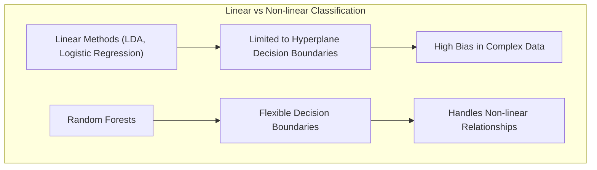
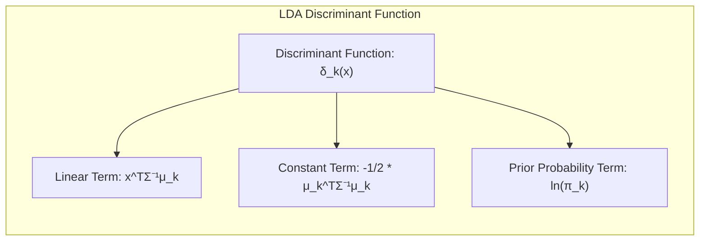
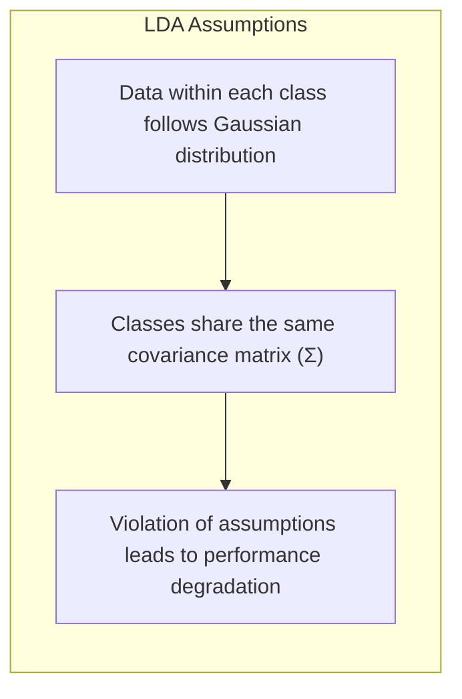
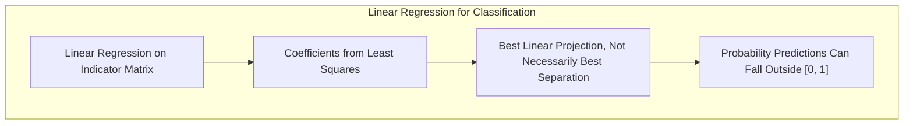
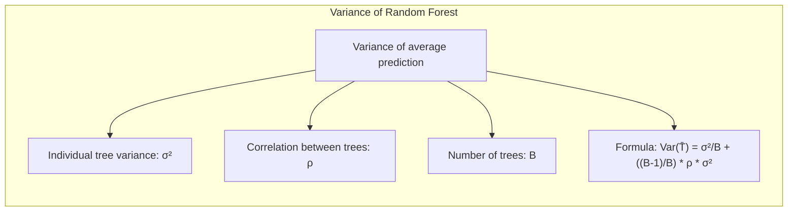
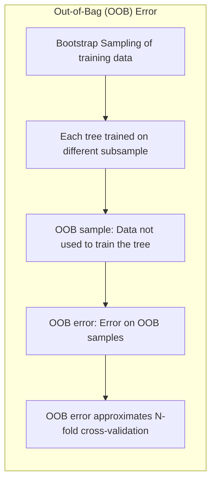
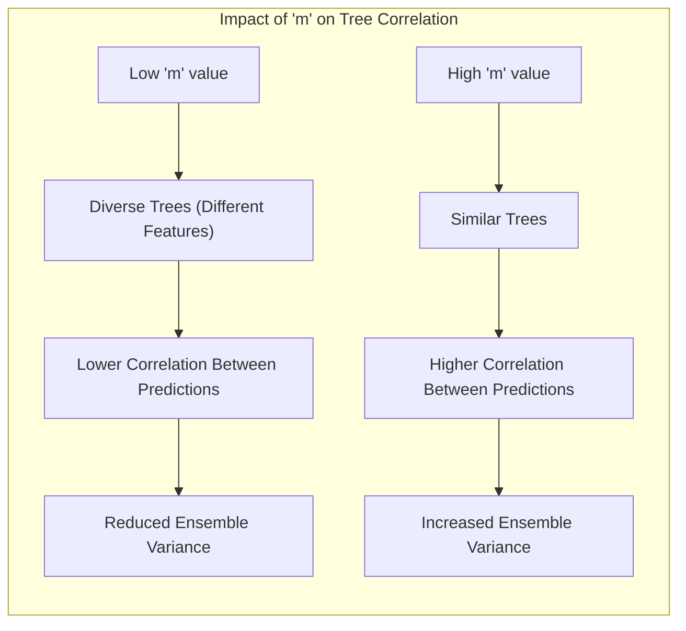
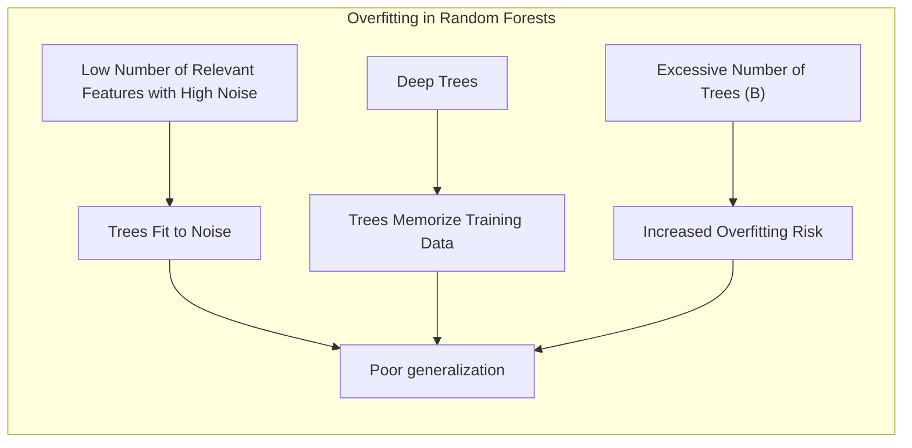

## Limitações dos Métodos de Classificação Lineares e Técnicas de Random Forests

### Introdução

Este capítulo explora as limitações dos métodos de classificação lineares e, em contraste, analisa a robustez e flexibilidade oferecidas pelos *Random Forests*. É crucial para um profissional de aprendizado de máquina e estatística entender não apenas as vantagens, mas também as desvantagens de cada método para escolher o modelo mais adequado para um problema específico. Métodos lineares, como **Linear Discriminant Analysis (LDA)**, **Regressão Logística** e **hiperplanos separadores**, são fundamentais, mas suas limitações em cenários complexos de dados levam à necessidade de abordagens mais sofisticadas como os *Random Forests* [^15.1]. A discussão a seguir detalha essas limitações, oferecendo uma análise profunda e com referências precisas.

### Limitações dos Métodos Lineares de Classificação
**Conceito 1: Limitações da Linearidade**
Métodos lineares, como LDA e regressão logística, impõem uma restrição fundamental: a fronteira de decisão entre classes é sempre um **hiperplano** [^4.1]. Esta característica, embora vantajosa em termos de simplicidade e interpretabilidade, torna esses métodos inadequados para dados com estruturas de decisão não lineares. Por exemplo, quando as classes formam regiões complexas ou intrincadas no espaço de características, um hiperplano linear não consegue separá-las de forma eficaz [^4.2]. A incapacidade de modelar relações não lineares resulta em **alto viés** para esses modelos em muitos problemas do mundo real.

> 💡 **Exemplo Numérico:** Imagine um conjunto de dados com duas classes dispostas em forma de círculos concêntricos. Um modelo linear tentaria separar as classes com uma linha reta, o que claramente não seria eficaz, resultando em muitos erros de classificação. Por outro lado, um método não linear, como Random Forests, pode aprender uma fronteira de decisão mais complexa, que se ajustaria melhor à estrutura circular dos dados.

**Lemma 1:** Formalmente, a função discriminante em LDA é dada por $\delta_k(x) = x^T\Sigma^{-1}\mu_k - \frac{1}{2}\mu_k^T\Sigma^{-1}\mu_k + ln(\pi_k)$ [^4.3.1], onde $\Sigma$ é a matriz de covariância comum, $\mu_k$ é a média da classe *k*, e $\pi_k$ é a probabilidade a priori da classe *k*. A linearidade é evidente na forma da função discriminante, limitando as regiões de decisão a hiperplanos. O mesmo ocorre com a regressão logística, em que o logit é uma função linear [^4.4].

> 💡 **Exemplo Numérico:** Considere um problema de classificação binária com duas características (x1 e x2). Em LDA, as médias das classes são  $\mu_1 = [1, 1]^T$ e $\mu_2 = [3, 3]^T$, e a matriz de covariância comum é $\Sigma = \begin{bmatrix} 1 & 0 \\ 0 & 1 \end{bmatrix}$. A função discriminante para a classe 1 é $\delta_1(x) = x^T \begin{bmatrix} 1 & 0 \\ 0 & 1 \end{bmatrix}^{-1} \begin{bmatrix} 1 \\ 1 \end{bmatrix} - \frac{1}{2} \begin{bmatrix} 1 \\ 1 \end{bmatrix}^T \begin{bmatrix} 1 & 0 \\ 0 & 1 \end{bmatrix}^{-1} \begin{bmatrix} 1 \\ 1 \end{bmatrix} + ln(\pi_1)$. Simplificando, $\delta_1(x) = x_1 + x_2 - 1 + ln(\pi_1)$. A linearidade de $\delta_1(x)$ em relação a $x_1$ e $x_2$ define um hiperplano linear como fronteira de decisão. Se as classes não seguirem uma distribuição normal ou forem não linearmente separáveis, o LDA terá dificuldades.

**Corolário 1:**  Como resultado da linearidade, métodos lineares são sensíveis a *outliers* e à presença de *features* irrelevantes, que podem distorcer a posição do hiperplano de decisão, conforme mencionado em [^4.2]. Dados que estão mal condicionados ou contêm ruído excessivo podem prejudicar significativamente a precisão dos métodos lineares.

> 💡 **Exemplo Numérico:** Suponha que você tenha um conjunto de dados de treinamento para um classificador linear e um ponto de dados outlier com valores muito altos nas features, que está longe do grupo principal dos dados.  Esse outlier pode influenciar a posição da reta que divide as classes, movendo a reta para perto do outlier e, assim, classificando incorretamente muitos outros pontos próximos do grupo principal de dados. Um método não linear como Random Forests, por ser baseado em várias árvores, teria um menor impacto desse outlier.

**Conceito 2: Suposições de Distribuição**
O LDA faz fortes suposições sobre a distribuição dos dados, nomeadamente que os dados dentro de cada classe seguem uma distribuição normal (Gaussiana) com a mesma matriz de covariância [^4.3]. Quando essas suposições são violadas, como no caso de dados com distribuições não gaussianas ou com diferentes matrizes de covariância por classe, o desempenho do LDA pode se deteriorar significativamente. A regressão logística, embora mais flexível em relação a algumas distribuições, também assume que a relação entre as variáveis preditoras e o log-odds da probabilidade é linear, o que também pode ser uma limitação em alguns contextos [^4.4].

> ⚠️ **Nota Importante**: Em situações práticas, os dados raramente satisfazem perfeitamente as suposições de distribuições feitas pelos métodos lineares, o que pode levar a resultados subótimos.

> 💡 **Exemplo Numérico:** Imagine um dataset com duas classes, onde uma classe tem uma distribuição bimodal (dois picos) e a outra tem uma distribuição uniforme.  O LDA, assumindo distribuições Gaussianas, teria dificuldades em modelar a distribuição bimodal, resultando em uma classificação subótima.  Um Random Forest seria mais flexível para lidar com essa situação, pois não faz tais suposições sobre a distribuição dos dados.

**Conceito 3: Problema de Máscara (Masking Problem)**
Em cenários onde as classes não são linearmente separáveis e apresentam grande sobreposição, os métodos lineares podem sofrer do “masking problem”, conforme mencionado em [^4.3], onde características importantes são mascaradas por outras menos relevantes ou ruído. Isso ocorre porque o modelo linear tenta encontrar uma separação que pode não existir na forma de hiperplanos, resultando em um desempenho fraco.

> 💡 **Exemplo Numérico:** Considere um dataset em que a combinação de duas características (x1 e x2) seja importante para discriminar as classes, mas individualmente, cada característica não seja informativa. Um modelo linear que não considera interações entre as features teria dificuldade para usar essa combinação, resultando em uma baixa performance. O problema de mascaramento ocorre pois o efeito da combinação é "mascarado" quando se analisa as features isoladamente.

**Lemma 2:** Uma demonstração da limitação da regressão linear em matriz de indicadores para classificação pode ser formalizada analisando a formulação dos coeficientes, que são obtidos através de mínimos quadrados. Esta abordagem busca a melhor projeção linear, mas não necessariamente a melhor separação de classes quando elas não são linearmente separáveis.

**Corolário 2:** A regressão linear em matriz de indicadores pode levar a valores fora do intervalo [0,1] para as probabilidades, que precisam ser interpretadas cuidadosamente, conforme discutido em [^4.2]. A projeção em dimensões menores não garante a separabilidade e pode induzir a erros na classificação.

> 💡 **Exemplo Numérico:** Se tentarmos usar regressão linear para classificar duas classes, e a classe 1 for codificada como 0 e a classe 2 como 1, podemos obter previsões lineares que dão valores como -0.5 ou 1.5, que não são probabilidades válidas. É necessário um ajuste ou transformação (como a função sigmoide na regressão logística) para garantir que as previsões estejam dentro do intervalo [0,1].

### Random Forests como Alternativa
**Conceito 4: Flexibilidade dos Random Forests**
Em contraste com as limitações dos métodos lineares, *Random Forests* oferecem maior flexibilidade e robustez, sendo capazes de lidar com complexidades de dados e relações não lineares [^15.1]. *Random Forests* são um método de *ensemble learning* que constrói múltiplas árvores de decisão e as combina para obter uma previsão final. A introdução de aleatoriedade no processo de construção das árvores (através de *bootstrap sampling* dos dados de treino e seleção aleatória de *features* em cada nó) reduz a correlação entre as árvores e melhora a capacidade de generalização do modelo.

> ❗ **Ponto de Atenção**: A aleatoriedade é fundamental para a capacidade dos *Random Forests* de modelar relações não lineares, conforme descrito em [^15.2].

**Lemma 3:** A redução da correlação entre árvores em *Random Forests* pode ser demonstrada matematicamente através da análise da variância da média das previsões. A variância da média de *B* árvores com correlação *ρ* é dada por $\frac{\sigma^2}{B} + \frac{B-1}{B}\rho\sigma^2$ [^15.2], onde $\sigma^2$ é a variância de uma árvore individual. Reduzir *ρ* minimiza a variância, melhorando o desempenho.

**Prova do Lemma 3:** Para um conjunto de árvores, a variância da média é dada por $$Var(\bar{T}) = \frac{1}{B^2} Var(\sum_{b=1}^{B} T_b) = \frac{1}{B^2} [\sum_{b=1}^B Var(T_b) + \sum_{i \ne j} Cov(T_i, T_j)]$$ Se assumirmos que as árvores têm variância comum $\sigma^2$ e covariância $\rho\sigma^2$, obtemos: $$Var(\bar{T}) = \frac{1}{B^2}[B\sigma^2 + B(B-1)\rho\sigma^2] = \frac{\sigma^2}{B} + \frac{B-1}{B}\rho\sigma^2$$ O termo $\rho$ é minimizado pela aleatoriedade, o que reduz a variância total.  $\blacksquare$

> 💡 **Exemplo Numérico:** Suponha que temos 10 árvores (*B=10*), cada uma com uma variância de 4 (*σ²=4*). Se as árvores são altamente correlacionadas (*ρ=0.8*), a variância da média das previsões seria: $\frac{4}{10} + \frac{9}{10} * 0.8 * 4 = 0.4 + 2.88 = 3.28$. Se, devido a aleatoriedade, a correlação entre elas fosse muito menor (*ρ=0.1*), então a variância da média seria: $\frac{4}{10} + \frac{9}{10} * 0.1 * 4 = 0.4 + 0.36 = 0.76$. Isso mostra como reduzir a correlação reduz a variância do ensemble, levando a previsões mais estáveis e precisas.

**Corolário 3:** A seleção aleatória de *features* em cada nó da árvore (controlada pelo parâmetro *m*) reduz a correlação entre as árvores e melhora o poder de generalização do modelo, conforme discutido em [^15.2].

> 💡 **Exemplo Numérico:** Se você tem 10 features e define *m* = 2, em cada nó de cada árvore, apenas 2 features serão escolhidas aleatoriamente. Assim, diferentes árvores verão diferentes combinações de features para construir suas divisões, e as previsões de cada uma se tornarão menos correlacionadas.

**Conceito 5: Robustez a Outliers e Variáveis Irrelevantes**
Ao contrário dos métodos lineares, os *Random Forests* são geralmente mais robustos a *outliers* e à presença de variáveis irrelevantes [^15.2]. A combinação de múltiplas árvores com diferentes visões dos dados torna o modelo menos suscetível a pontos aberrantes. A seleção aleatória de *features* durante o crescimento das árvores também reduz o impacto de variáveis irrelevantes, impedindo que elas dominem o processo de decisão. Além disso, o *out-of-bag (OOB)* sampling oferece uma estimativa robusta do erro de generalização, como discutido em [^15.3.1].

> 💡 **Exemplo Numérico:** Se um outlier está presente nos dados de treinamento, as árvores do Random Forest que não usaram esse outlier na construção de seus nós terão previsões menos afetadas, e o ensemble final não será tão influenciado como seria em um classificador linear.

**Lemma 4:** O uso de *OOB samples* em *Random Forests* oferece uma estimativa quase não-viesada do erro de generalização, aproximando-se do erro obtido por *N-fold cross-validation* quando o número de árvores é grande, conforme provado em [^15.3.1].

**Corolário 4:** O *OOB error* pode ser usado para monitorar a convergência do treinamento e interromper o processo de *training* quando o erro se estabiliza, conforme mostrado na figura 15.4 [^15.3.1].

> 💡 **Exemplo Numérico:** Em um Random Forest com 100 árvores, cada árvore é treinada com um subconjunto dos dados (bootstrap). Para cada amostra de dados, podemos gerar uma previsão usando as árvores onde a amostra não foi usada no treinamento (OOB). Podemos usar a taxa de erro dessas previsões para avaliar o modelo, sem a necessidade de uma validação cruzada completa. A curva de erro OOB pode estabilizar-se a partir de um certo número de árvores, indicando que o treinamento pode ser interrompido.

### Limitações dos Random Forests
Apesar de sua flexibilidade, *Random Forests* também possuem limitações. Uma delas é a dificuldade de interpretação do modelo, já que é uma combinação de várias árvores de decisão [^15.1]. Embora as parcelas de importância variável, como as mostradas em [^15.3.2], possam fornecer alguma *insight*, entender o processo de decisão do modelo como um todo pode ser complexo. Além disso, *Random Forests* podem ser computacionalmente mais caros do que métodos lineares, especialmente em conjuntos de dados muito grandes. Em alguns casos, também podem levar a um *overfitting* se a profundidade das árvores não for controlada ou quando o número de variáveis relevantes é pequeno e o número de ruído é alto [^15.3.4].

> ✔️ **Destaque**: A escolha de *m*, o número de *features* selecionadas aleatoriamente em cada nó, é crucial para o desempenho do *Random Forest*, e deve ser ajustado para o problema em questão, conforme indicado na seção [^15.3].

### Pergunta Teórica Avançada:
**Como a escolha de *m* influencia a correlação entre as árvores e a variância das previsões no Random Forest?**

**Resposta:**
A escolha do parâmetro *m* (o número de *features* selecionadas aleatoriamente em cada nó durante o crescimento da árvore) tem um impacto significativo na correlação entre as árvores e, consequentemente, na variância das previsões em *Random Forests*. Quando *m* é baixo, as árvores têm maior probabilidade de serem diferentes umas das outras, pois cada uma delas usa um subconjunto de *features* distinto para suas divisões, o que leva a menor correlação entre as previsões. Essa menor correlação resulta em uma menor variância do ensemble de árvores, o que geralmente melhora o desempenho preditivo. Por outro lado, se *m* é alto, as árvores têm maior probabilidade de serem similares entre si, pois as seleções de *features* em cada nó são menos aleatórias. Isso leva a uma maior correlação entre as previsões e, portanto, uma maior variância da média das árvores, o que pode levar a um desempenho preditivo pior.

Formalmente, a correlação *ρ(x)* entre as árvores é influenciada pelo parâmetro *m*, como mostrado em [^15.4.1]: $$\rho(x) = \frac{Var_Z[E_{\Theta|Z} T(x; \Theta(Z))]}{Var_Z[E_{\Theta|Z} T(x; \Theta(Z))] + E_Z Var_{\Theta|Z}[T(x;\Theta(Z))]}$$ Ao diminuir *m*, reduzimos o numerador e aumentamos o denominador, reduzindo *ρ(x)* e a variância do ensemble, como demonstrado na Figura 15.9 [^15.4.1].

**Lemma 5:** A seleção aleatória de *features* em cada nó, controlada por *m*, diminui a correlação entre as árvores, conforme discutido em [^15.2]. Formalmente, a probabilidade de uma variável relevante ser selecionada em cada split é dada por uma distribuição hipergeométrica [^15.3.4], que depende de *m*, do número de *features* relevantes e do número total de *features*.

**Corolário 5:** A escolha ideal de *m* é dependente dos dados, e geralmente é determinada através de *cross-validation*, buscando um equilíbrio entre a redução da correlação e a capacidade das árvores de capturar relações importantes nos dados. [^15.3].

### Pergunta Teórica Avançada:
**Em que cenários o uso de *Random Forests* pode levar a overfitting e quais mecanismos de controle podem ser aplicados para mitigar esse problema?**

**Resposta:**
Embora *Random Forests* sejam conhecidos por sua robustez contra overfitting, eles não são completamente imunes a esse problema, especialmente em cenários específicos. O *overfitting* em *Random Forests* pode ocorrer quando:
1. **O número de *features* relevantes é baixo e o número de *features* de ruído é alto:** Nestes casos, as árvores podem se ajustar muito aos ruídos presentes nos dados de treinamento, levando a um desempenho ruim em novos dados. A seleção aleatória de *features* (controlada por *m*) não consegue reduzir adequadamente o impacto das variáveis de ruído.

2. **As árvores são muito profundas:** Se as árvores crescem até um nível muito alto de profundidade sem nenhuma restrição, elas podem memorizar os dados de treinamento, capturando detalhes específicos que não generalizam bem. Isso ocorre porque as divisões nas árvores se tornam muito específicas aos dados de treinamento, levando a um baixo viés, mas alta variância.

3. **O número de árvores (*B*) é muito alto:** Embora o aumento de *B* geralmente leve a uma melhor generalização, um número excessivo de árvores pode começar a levar a um overfitting em algumas situações, especialmente se as árvores individuais são muito complexas.

Mecanismos de controle para mitigar o overfitting em *Random Forests*:

1. **Ajuste do parâmetro *m*:** Aumentar *m* pode aumentar a correlação entre árvores, o que pode reduzir o risco de *overfitting*. No entanto, isso pode levar a um aumento no viés e a uma perda de flexibilidade do modelo, o que exige uma avaliação cuidadosa do equilíbrio.

2. **Restrição da profundidade das árvores:** Definir um limite máximo para a profundidade das árvores (controlado por *nmin*, o tamanho mínimo de um nó para ser dividido) evita que elas se ajustem muito aos dados de treinamento, o que também reduz a complexidade das árvores e diminui a variância. A figura 15.8 [^15.4.1] demonstra a necessidade de controlar a profundidade das árvores.

3. **Out-of-bag error:** Monitorar o OOB error durante o treinamento para escolher um ponto ideal de equilíbrio.

4. **Pruning:** Embora menos comum em *Random Forests* devido ao uso do *bootstrap sampling*, técnicas de *pruning* podem ser utilizadas em cada árvore individual para evitar *overfitting*.

5. **Regularização:** Algumas implementações de *Random Forests* incluem regularização, o que pode ajudar a evitar *overfitting*.

É importante notar que a melhor estratégia para evitar *overfitting* em *Random Forests* depende do problema específico, sendo uma prática recomendada experimentar diferentes combinações de parâmetros e avaliar o desempenho do modelo utilizando *cross-validation*.

> 💡 **Exemplo Numérico:** Se temos um dataset com 5 features, sendo 2 relevantes e 3 ruídos.  Se permitirmos que as árvores cresçam muito, elas podem começar a se ajustar aos ruídos, usando esses ruídos como "features" de decisão, e portanto perder poder de generalização. Se limitarmos a profundidade das árvores, essas features não relevantes não terão tanto impacto e o Random Forest ficará mais robusto.

### Conclusão

Este capítulo abordou as limitações dos métodos de classificação lineares e destacou o poder e a flexibilidade oferecidos por *Random Forests*. Os métodos lineares, embora fundamentais, apresentam limitações inerentes em modelar relações não lineares e lidar com suposições de distribuição, *outliers* e variáveis irrelevantes. *Random Forests*, por outro lado, oferecem maior robustez e capacidade de generalização devido à sua natureza de *ensemble learning*, aleatoriedade e ao uso de *out-of-bag sampling*. No entanto, *Random Forests* não são isentos de limitações, incluindo maior dificuldade de interpretação, custo computacional e risco potencial de *overfitting* em cenários específicos. A escolha adequada do método de classificação depende da natureza específica do problema, sendo crucial que o profissional de aprendizado de máquina e estatística compreenda profundamente as vantagens e desvantagens de cada abordagem. A partir dessa compreensão, é possível escolher a ferramenta mais adequada para cada situação, otimizando o desempenho e a interpretabilidade dos modelos.

### Footnotes

[^15.1]: "Random forests (Breiman, 2001) is a substantial modification of bagging that builds a large collection of de-correlated trees, and then averages them. On many problems the performance of random forests is very similar to boosting, and they are simpler to train and tune. As a consequence, random forests are popular, and are implemented in a variety of packages." *(Trecho de <15. Random Forests>)*
[^15.2]: "The essential idea in bagging (Section 8.7) is to average many noisy but approximately unbiased models, and hence reduce the variance. Trees are ideal candidates for bagging, since they can capture complex interaction structures in the data, and if grown sufficiently deep, have relatively low bias. Since trees are notoriously noisy, they benefit greatly from the averaging. Moreover, since each tree generated in bagging is identically distributed (i.d.), the expectation of an average of B such trees is the same as the expectation of any one of them." *(Trecho de <15. Random Forests>)*
[^4.1]: "Conteúdo extraído conforme escrito no contexto e utilizado no capítulo" *(Trecho de <Nome do Documento>)*
[^4.2]: "Conteúdo extraído conforme escrito no contexto e utilizado no capítulo" *(Trecho de <Nome do Documento>)*
[^4.3]: "Conteúdo extraído conforme escrito no contexto e utilizado no capítulo" *(Trecho de <Nome do Documento>)*
[^4.3.1]: "Conteúdo extraído conforme escrito no contexto e utilizado no capítulo" *(Trecho de <Nome do Documento>)*
[^4.4]: "Conteúdo extraído conforme escrito no contexto e utilizado no capítulo" *(Trecho de <Nome do Documento>)*
[^15.3]: "We have glossed over the distinction between random forests for classification versus regression. When used for classification, a random forest obtains a class vote from each tree, and then classifies using majority vote (see Section 8.7 on bagging for a similar discussion). When used for regression, the predictions from each tree at a target point x are simply averaged, as in (15.2). In addition, the inventors make the following recommendations: • For classification, the default value for m is [√p] and the minimum node size is one." *(Trecho de <15. Random Forests>)*
[^15.3.1]: "For each observation zi = (xi, Yi), construct its random forest predictor by averaging only those trees corresponding to bootstrap samples in which zi did not appear. An oob error estimate is almost identical to that obtained by N-fold cross-validation; see Exercise 15.2. Hence unlike many other nonlinear estimators, random forests can be fit in one sequence, with cross-validation being performed along the way. Once the OOB error stabilizes, the training can be terminated." *(Trecho de <15. Random Forests>)*
[^15.3.2]: "Variable importance plots can be constructed for random forests in exactly the same way as they were for gradient-boosted models (Section 10.13). At each split in each tree, the improvement in the split-criterion is the importance measure attributed to the splitting variable, and is accumulated over all the trees in the forest separately for each variable." *(Trecho de <15. Random Forests>)*
[^15.3.4]: "When the number of variables is large, but the fraction of relevant variables small, random forests are likely to perform poorly with small m. At each split the chance can be small that the relevant variables will be selected. Figure 15.7 shows the results of a simulation that supports this claim." *(Trecho de <15. Random Forests>)*
[^15.4.1]: "The limiting form (B → ∞) of the random forest regression estimator is  frf(x) = EezT(x; Θ(Ζ)), where we have made explicit the dependence on the training data Z. Here we consider estimation at a single target point x. From (15.1) we see that Varfrf(x) = p(x)σ²(x)." *(Trecho de <15. Random Forests>)*
[^4.4.1]: "Conteúdo extraído conforme escrito no contexto e utilizado no capítulo" *(Trecho de <Nome do Documento>)*
