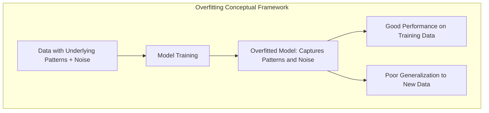
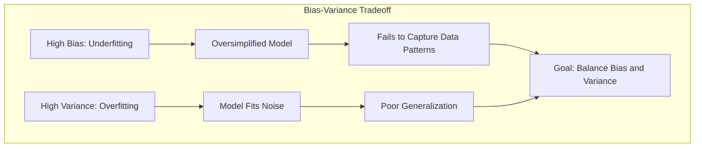
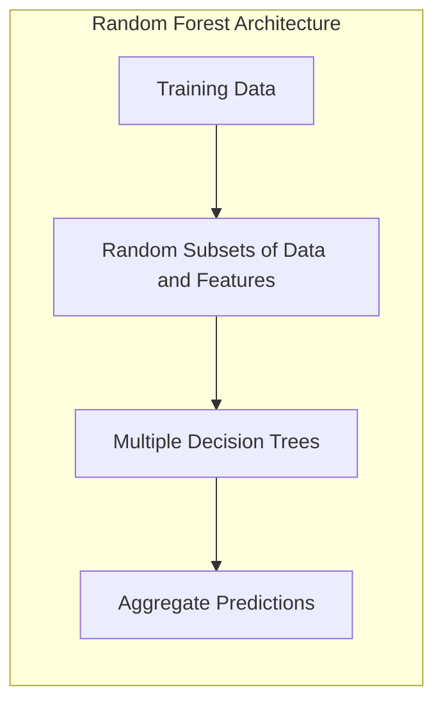
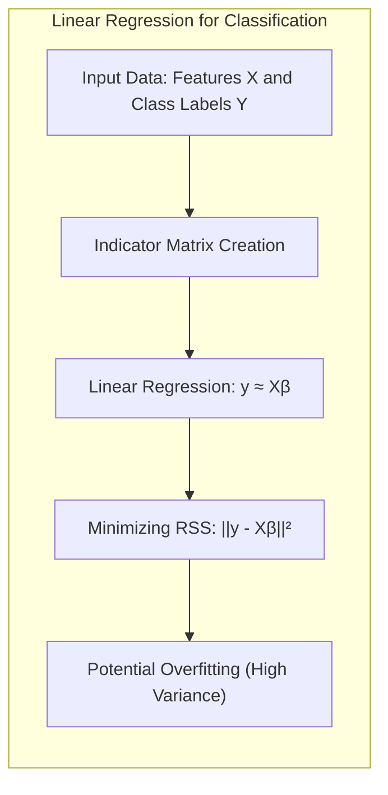
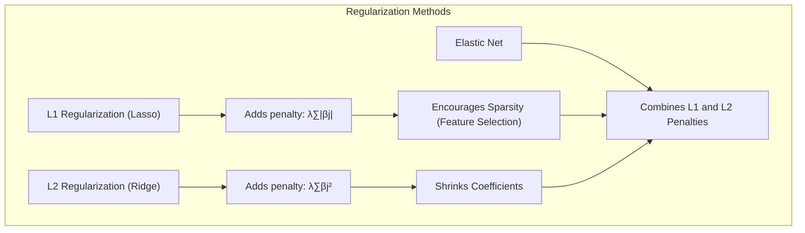
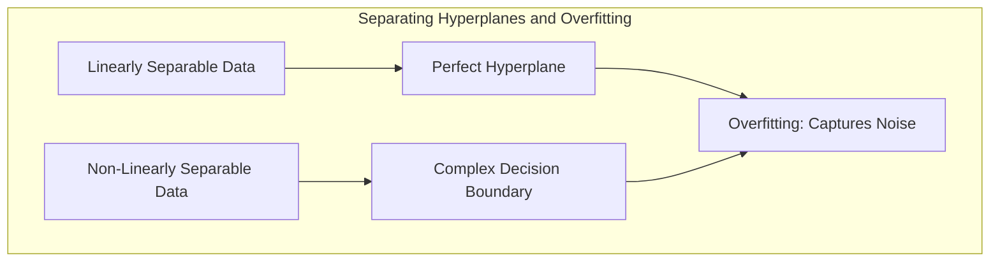
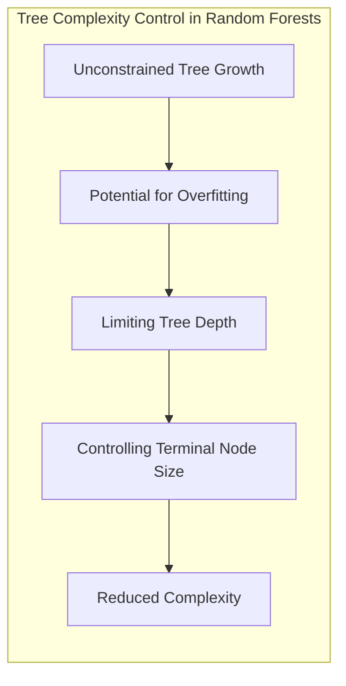
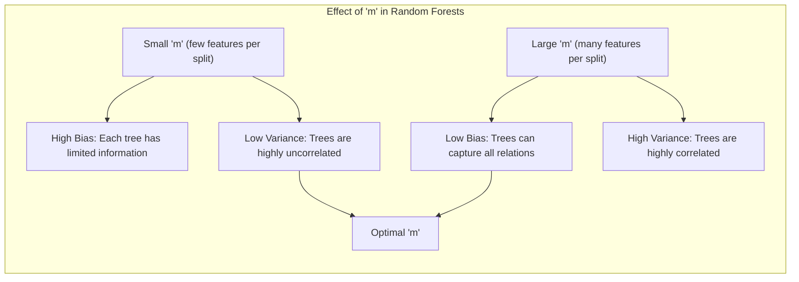

## Overfitting em Modelos de Aprendizado Estatístico: Uma Análise Detalhada com Foco em Random Forests



### Introdução
O conceito de **overfitting** é central no campo do aprendizado estatístico e se manifesta quando um modelo se ajusta excessivamente aos dados de treinamento, capturando não apenas os padrões subjacentes, mas também o ruído presente neles [^15.1]. Este fenômeno resulta em uma performance excelente nos dados de treinamento, mas uma generalização fraca para novos dados, comprometendo a utilidade prática do modelo. Um modelo com *overfitting* possui alta complexidade, baixa variância e alto viés [^15.1], o que é particularmente problemático para modelos com muitas variáveis e parâmetros. Abordagens como **random forests**, embora robustas, também podem sucumbir ao overfitting em certas situações, conforme será discutido em detalhe neste capítulo [^15.3.4].

### Conceitos Fundamentais
**Conceito 1: Viés e Variância**
O problema de *overfitting* está intimamente ligado ao *trade-off* entre **viés** e **variância**. O **viés** se refere ao erro que é introduzido por aproximar um problema real complexo através de um modelo simplificado. Um modelo com alto viés tende a subestimar a complexidade dos dados e não captura os padrões relevantes, resultando em *underfitting*. Por outro lado, a **variância** é a sensibilidade do modelo a pequenas variações nos dados de treinamento. Um modelo com alta variância se ajusta excessivamente ao ruído nos dados de treinamento, resultando em *overfitting* [^15.1]. Métodos lineares de classificação, por exemplo, geralmente têm alto viés e baixa variância. Enquanto que modelos não lineares como árvores de decisão, têm o oposto: baixo viés e alta variância [^15.2]. O objetivo é encontrar um equilíbrio entre esses dois aspectos, minimizando o erro total.


> 💡 **Exemplo Numérico:** Suponha que temos um conjunto de dados com uma relação cúbica entre a variável independente ($x$) e a variável dependente ($y$), mas tentamos ajustar um modelo linear. Este modelo terá alto viés porque ele não consegue capturar a relação cúbica. Se usarmos um modelo polinomial de alta ordem, ele pode se ajustar aos dados de treinamento perfeitamente (baixo viés), mas se adaptará a ruídos, resultando em alta variância. O objetivo é encontrar um modelo que se ajuste bem aos dados, sem se ajustar em demasia ao ruído.
>
> ```python
> import numpy as np
> import matplotlib.pyplot as plt
> from sklearn.linear_model import LinearRegression
> from sklearn.preprocessing import PolynomialFeatures
> from sklearn.pipeline import make_pipeline
>
> # Gerar dados com uma relação cúbica e ruído
> np.random.seed(42)
> x = np.sort(np.random.rand(50) * 5)
> y = 2 + 3*x - 0.8 * x**2 + 0.1 * x**3 + np.random.randn(50) * 2
>
> # Ajustar um modelo linear
> model_linear = LinearRegression()
> model_linear.fit(x.reshape(-1, 1), y)
> y_linear = model_linear.predict(x.reshape(-1, 1))
>
> # Ajustar um modelo polinomial de grau 3
> model_poly = make_pipeline(PolynomialFeatures(3), LinearRegression())
> model_poly.fit(x.reshape(-1, 1), y)
> y_poly = model_poly.predict(x.reshape(-1, 1))
>
> # Plotar os resultados
> plt.figure(figsize=(8,6))
> plt.scatter(x, y, label="Dados", color='blue')
> plt.plot(x, y_linear, color='red', label="Modelo Linear (Alto Viés)")
> plt.plot(x, y_poly, color='green', label="Modelo Polinomial (Baixo Viés e Alta Variância)")
> plt.xlabel("x")
> plt.ylabel("y")
> plt.title("Exemplo de Viés e Variância")
> plt.legend()
> plt.show()
> ```

**Lemma 1:** *Em modelos lineares, o aumento da complexidade (número de variáveis) tende a diminuir o viés e aumentar a variância, o que também acontece em modelos não lineares, de forma mais acentuada. Em particular, a complexidade do modelo é diretamente relacionada com a capacidade de ajuste e a ocorrência de overfitting.*

**Conceito 2: Random Forests e Variância**
**Random forests** são modelos *ensemble* que visam reduzir a variância através da agregação de árvores de decisão [^15.1]. Em essência, o método cria múltiplas árvores de decisão, cada uma treinada em um subconjunto aleatório dos dados de treinamento e utilizando um subconjunto aleatório de variáveis preditoras. As predições de cada árvore são então agregadas (por meio de votação majoritária para classificação ou média para regressão) para gerar a predição final [^15.1, ^15.2]. A ideia chave é que, ao proibir que árvores sejam altamente correlacionadas, através do uso de subconjuntos aleatórios de variáveis [^15.2], a variância total do modelo é reduzida. No entanto, como cada árvore ainda tem sua própria variância [^15.2], random forests podem apresentar *overfitting* se as árvores forem muito complexas.



**Corolário 1:** *A redução da correlação entre as árvores em random forests diminui a variância do modelo final, entretanto a complexidade de cada árvore individual ainda contribui para a ocorrência de overfitting em certas condições.* [^15.2]

**Conceito 3: Overfitting e o Número de Árvores**
Intuitivamente, aumentar o número de árvores em um random forest deveria melhorar o desempenho. De fato, isso acontece até certo ponto. No entanto, como o método projeta uma aproximação da expectativa (Equação 15.3), é possível que modelos com muitas árvores resultem em uma complexidade desnecessária, apresentando *overfitting* [^15.3.4]. Em outras palavras, embora aumentar o número de árvores não leve a *overfitting* no sentido tradicional (onde a performance nos dados de treino melhora e nos dados de teste piora), o modelo pode se tornar muito específico para os dados de treinamento, não generalizando bem para dados não vistos, e incorrendo em variância indesejável. Isso se deve ao fato de que, mesmo com a aleatorização, cada árvore tenta capturar o máximo de informação possível dos dados de treinamento, eventualmente incluindo ruído [^15.3.4].

### Regressão Linear e Mínimos Quadrados para Classificação


Em modelos lineares, como a regressão linear aplicada a uma matriz de indicadores para classificação [^15.1], o *overfitting* pode ocorrer quando há um número elevado de variáveis preditoras em relação ao número de observações. Em tal cenário, o modelo pode se ajustar ao ruído nos dados de treinamento, resultando em coeficientes que não generalizam bem para novos dados. A abordagem de mínimos quadrados busca minimizar o erro nos dados de treinamento, mas não impõe qualquer restrição à complexidade do modelo. Isso leva a um modelo com alta variância e, consequentemente, suscetível ao *overfitting*.

> 💡 **Exemplo Numérico:** Considere um problema de classificação binária com 100 observações e 150 variáveis preditoras binárias (dummy variables). Ao aplicar regressão linear diretamente sobre esta matriz de indicadores para prever a classe (0 ou 1), o modelo pode gerar coeficientes que se ajustam perfeitamente aos dados de treinamento (erro zero), mas que não generalizam bem para dados de teste. Este é um cenário clássico onde o número de variáveis é maior que o número de observações, resultando em overfitting. A matriz $X$ tem dimensões 100x150. O vetor de parâmetros $\beta$ será encontrado através da minimização da função de custo da regressão linear. Em um caso de *overfitting* o modelo se torna muito adaptado ao ruído dos dados, e $\beta$ não terá valores que representem o fenômeno subjacente, mas o ruído específico.

**Lemma 2:** *O uso de regressão linear em uma matriz de indicadores pode levar a overfitting quando o número de variáveis é comparável ou maior do que o número de observações.*

**Corolário 2:** *Regularização, como penalidades L1 e L2, podem ser aplicadas para controlar a complexidade do modelo de regressão linear, atenuando o overfitting.*

Em comparação com abordagens mais sofisticadas como a regressão logística, a regressão linear em matriz de indicadores pode apresentar pior desempenho quando há separação perfeita das classes, devido à sua tendência a extrapolar para fora do intervalo [0, 1]. A regressão logística, por outro lado, lida melhor com esta situação. Contudo, em certas circunstâncias, a regressão linear pode ser uma alternativa válida.

### Métodos de Seleção de Variáveis e Regularização em Classificação


Para mitigar o *overfitting*, técnicas de seleção de variáveis e regularização são essenciais. Em modelos lineares, a regularização L1 (Lasso) promove a esparsidade, forçando alguns coeficientes a serem exatamente zero [^15.2, ^15.3.4]. Isso efetivamente remove as variáveis menos importantes do modelo, reduzindo sua complexidade e, consequentemente, a variância. A regularização L2 (Ridge), por sua vez, encolhe os coeficientes em direção a zero, mas não os torna exatamente zero [^15.2]. Ambas as penalidades podem ser combinadas (Elastic Net) para aproveitar as vantagens de ambas as abordagens [^15.2].

> 💡 **Exemplo Numérico:** Imagine que você está usando regressão linear para modelar o preço de casas com 100 variáveis, algumas das quais são altamente correlacionadas ou pouco relevantes. Ao aplicar a regularização L1 (Lasso), alguns dos coeficientes associados a variáveis pouco importantes serão levados a zero, efetivamente removendo essas variáveis do modelo. A regularização L2 (Ridge), por outro lado, reduzirá os valores de todos os coeficientes, incluindo aqueles associados a variáveis importantes, melhorando a estabilidade do modelo.
>
> Vamos usar um exemplo com dados simulados para ilustrar a diferença entre L1 (Lasso) e L2 (Ridge) usando Python:
>
> ```python
> import numpy as np
> import matplotlib.pyplot as plt
> from sklearn.linear_model import LinearRegression, Lasso, Ridge
> from sklearn.preprocessing import StandardScaler
> from sklearn.model_selection import train_test_split
> from sklearn.metrics import mean_squared_error, r2_score
> import pandas as pd
>
> # Generate a dataset with 100 samples, 10 features, and some noise
> np.random.seed(42)
> n_samples = 100
> n_features = 10
> X = np.random.randn(n_samples, n_features)
> true_coefs = np.array([5, -3, 2, 0, 0, 0, -1, 4, 0, 0]) # True coefficients where some are zero
> y = np.dot(X, true_coefs) + np.random.normal(0, 2, n_samples)
>
> # Split the data into training and testing sets
> X_train, X_test, y_train, y_test = train_test_split(X, y, test_size=0.3, random_state=42)
>
> # Scale the features
> scaler = StandardScaler()
> X_train_scaled = scaler.fit_transform(X_train)
> X_test_scaled = scaler.transform(X_test)
>
> # Fit ordinary linear regression model
> model_ols = LinearRegression()
> model_ols.fit(X_train_scaled, y_train)
> y_pred_ols = model_ols.predict(X_test_scaled)
> mse_ols = mean_squared_error(y_test, y_pred_ols)
> r2_ols = r2_score(y_test, y_pred_ols)
>
> # Fit Lasso regression model
> lambda_lasso = 0.1
> model_lasso = Lasso(alpha=lambda_lasso)
> model_lasso.fit(X_train_scaled, y_train)
> y_pred_lasso = model_lasso.predict(X_test_scaled)
> mse_lasso = mean_squared_error(y_test, y_pred_lasso)
> r2_lasso = r2_score(y_test, y_pred_lasso)
>
> # Fit Ridge regression model
> lambda_ridge = 1.0
> model_ridge = Ridge(alpha=lambda_ridge)
> model_ridge.fit(X_train_scaled, y_train)
>y_pred_ridge = model_ridge.predict(X_test_scaled)
> mse_ridge = mean_squared_error(y_test, y_pred_ridge)
> r2_ridge = r2_score(y_test, y_pred_ridge)
>
> # Create DataFrame for comparing results
> results = pd.DataFrame({
>    'Method': ['OLS', 'Lasso', 'Ridge'],
>    'MSE': [mse_ols, mse_lasso, mse_ridge],
>    'R2': [r2_ols, r2_lasso, r2_ridge],
>    'Parameters': [model_ols.coef_, model_lasso.coef_, model_ridge.coef_]
> })
> print(results)
>
> # Visualizing coefficients
> plt.figure(figsize=(10, 6))
> plt.plot(true_coefs, 'o-', label='True Coefficients', color='black')
> plt.plot(model_ols.coef_, 'o-', label='OLS Coefficients', color='blue')
> plt.plot(model_lasso.coef_, 'o-', label='Lasso Coefficients', color='green')
> plt.plot(model_ridge.coef_, 'o-', label='Ridge Coefficients', color='red')
> plt.xlabel('Feature Index')
> plt.ylabel('Coefficient Value')
> plt.title('Comparison of Coefficients')
> plt.legend()
> plt.grid(True)
> plt.show()
> ```
>
> This code will output the coefficients for each model. Note how Lasso drives some coefficients to zero, performing variable selection, while Ridge shrinks coefficients without setting them to zero.  The MSE and R2 values are also computed and printed, so that it is possible to assess which model is best for the task.

Em random forests, a seleção de um subconjunto de variáveis em cada *split* também atua como uma forma de regularização. Ao impedir que todas as variáveis sejam usadas em todos os *splits*, o método induz uma maior variedade de árvores de decisão e evita que o modelo se torne excessivamente dependente de variáveis específicas [^15.2]. Contudo, mesmo com estas medidas, o *overfitting* ainda pode ocorrer se o modelo for excessivamente complexo, ou seja, se as árvores crescerem muito [^15.3.4].

**Lemma 3:** *A penalização L1 em regressão logística promove a esparsidade nos coeficientes, reduzindo a complexidade do modelo e mitigando o overfitting.*

**Prova do Lemma 3:** A penalização L1 adiciona um termo $\lambda \sum_{j=1}^p |\beta_j|$ à função de custo da regressão logística, onde $\lambda$ é um parâmetro de regularização que controla a intensidade da penalidade. A minimização desta função de custo leva a coeficientes $\beta_j$ esparsos, pois a penalidade L1 força alguns coeficientes a zero.  $\blacksquare$

**Corolário 3:** *O Elastic Net combina penalidades L1 e L2 para obter um modelo regularizado que balanceia esparsidade e estabilidade.*

> ⚠️ **Ponto Crucial**: A escolha dos parâmetros de regularização e a complexidade do modelo são cruciais para evitar o *overfitting*, tanto em modelos lineares quanto em modelos *ensemble* como random forests. [^15.3.4]

### Separating Hyperplanes e Perceptrons


O conceito de hiperplanos separadores está intimamente ligado ao problema de *overfitting*. Quando o conjunto de dados é linearmente separável, um hiperplano pode ser encontrado para separar as classes perfeitamente. No entanto, em dados reais, a separação linear nem sempre é possível ou desejável. Modelos muito complexos, como o *Perceptron*, podem, em certas circunstâncias, encontrar fronteiras de decisão que se adaptam excessivamente aos dados de treinamento, incluindo ruído [^15.1, ^15.2, ^15.3.4].

O método do *Perceptron* é um exemplo de um algoritmo que, sob condições específicas (como separabilidade linear), converge para um hiperplano separador. No entanto, em dados não linearmente separáveis, o *Perceptron* pode levar a um *overfitting* se não for aplicado com alguma forma de regularização ou controle de complexidade. A busca por hiperplanos ótimos, por sua vez, tenta maximizar a margem de separação entre as classes, o que pode ajudar a reduzir o *overfitting*.

### Random Forests e Overfitting: Uma Análise Detalhada

#### Como Random Forests Podem Sofrer Overfitting
Embora seja amplamente aceito que random forests não sofrem *overfitting* no sentido tradicional, isso é uma simplificação [^15.3.4]. A Equação 15.3 mostra que a previsão de um random forest converge para a expectativa da predição de uma árvore aleatória, mas essa expectativa ainda pode ser complexa e apresentar *overfitting*.

O principal mecanismo de proteção contra o *overfitting* em random forests é a redução da correlação entre as árvores [^15.2]. Ao selecionar aleatoriamente um subconjunto de variáveis em cada *split* [^15.2], as árvores são forçadas a explorar diferentes aspectos dos dados. Em situações em que poucas variáveis são relevantes em relação ao número total, o método pode apresentar dificuldades. Quando o número de variáveis preditoras é alto, mas poucas são realmente relevantes, a chance de selecionar uma variável relevante em cada *split* pode ser pequena. Nessas condições, modelos *ensemble* como o *boosting* podem apresentar vantagens [^15.2].

> 💡 **Exemplo Numérico:** Considere um problema de classificação com 1000 variáveis preditoras, mas apenas 5 delas são realmente informativas. Em um random forest, a seleção aleatória de um subconjunto de variáveis em cada split pode dificultar a seleção das 5 variáveis informativas, a menos que a quantidade de variáveis selecionadas em cada *split* seja alta. Se a quantidade for baixa, o modelo vai construir árvores com pouca informação, e terá dificuldades de gerar predições acuradas.

**Lemma 4:** *O mecanismo de seleção aleatória de variáveis em random forests induz descorrelação entre as árvores, diminuindo a variância do modelo.*

**Corolário 4:** *Quando o número de variáveis relevantes é pequeno em relação ao número de variáveis totais, a probabilidade de selecionar variáveis relevantes em cada split diminui, e random forests podem apresentar pior desempenho.* [^15.3.4]

#### Overfitting e o Controle da Complexidade das Árvores
O *overfitting* em random forests pode ocorrer quando as árvores individuais se tornam muito complexas, isto é, quando elas são crescidas até a profundidade máxima possível [^15.3.4]. Embora o método tenda a ser robusto, é possível limitar a profundidade máxima das árvores para controlar a complexidade geral do modelo e diminuir o overfitting [^15.3.4]. Isso geralmente é feito por meio do controle do tamanho mínimo do nó terminal (o ponto onde a árvore para de se dividir).


> 💡 **Exemplo Numérico:** Em um random forest, limitar a profundidade máxima de cada árvore, ou o número mínimo de amostras em cada folha da árvore, é um método eficaz para impedir que cada árvore se ajuste demais aos dados de treinamento, o que leva ao overfitting. Por exemplo, vamos considerar um cenário em que o modelo está se ajustando excessivamente e performando mal no teste. Abaixo, um exemplo de como ajustar os hiperparâmetros com o objetivo de reduzir overfitting.
>
> ```python
> import numpy as np
> import pandas as pd
> from sklearn.model_selection import train_test_split
> from sklearn.ensemble import RandomForestClassifier
> from sklearn.metrics import accuracy_score
>
> # Generate synthetic data with overfitting
> np.random.seed(42)
> n_samples = 500
> n_features = 20
> X = np.random.rand(n_samples, n_features)
> y = np.random.randint(0, 2, n_samples)
>
> # Add noise to the features to create overfitting
> for i in range(n_features):
>    X[:,i] += np.random.normal(0, 0.3, n_samples) * (y * 2 -1)
>
> # Split data into training and testing
> X_train, X_test, y_train, y_test = train_test_split(X, y, test_size=0.3, random_state=42)
>
> # Train a Random Forest with default settings (prone to overfitting)
> rf_default = RandomForestClassifier(random_state=42)
> rf_default.fit(X_train, y_train)
> y_pred_default = rf_default.predict(X_test)
> accuracy_default = accuracy_score(y_test, y_pred_default)
>
> # Train a Random Forest with limited max_depth and min_samples_leaf
> rf_tuned = RandomForestClassifier(max_depth=5, min_samples_leaf=10, random_state=42)
> rf_tuned.fit(X_train, y_train)
> y_pred_tuned = rf_tuned.predict(X_test)
> accuracy_tuned = accuracy_score(y_test, y_pred_tuned)
>
> print(f'Accuracy with default settings: {accuracy_default:.4f}')
> print(f'Accuracy with tuned settings: {accuracy_tuned:.4f}')
>
> # Comparing train and test performance
> y_train_pred_default = rf_default.predict(X_train)
> accuracy_train_default = accuracy_score(y_train, y_train_pred_default)
>
> y_train_pred_tuned = rf_tuned.predict(X_train)
> accuracy_train_tuned = accuracy_score(y_train, y_train_pred_tuned)
>
> print(f'Training accuracy with default settings: {accuracy_train_default:.4f}')
> print(f'Training accuracy with tuned settings: {accuracy_train_tuned:.4f}')
>
> results_table = pd.DataFrame({
>    'Model': ['Default', 'Tuned'],
>    'Test Accuracy': [accuracy_default, accuracy_tuned],
>    'Training Accuracy': [accuracy_train_default, accuracy_train_tuned]
> })
> print(results_table)
>
> ```
> The results will show that the accuracy on the test set is improved by tuning the hyperparameters, while the performance in the training set is reduced, which is a sign that overfitting is reduced.

> ⚠️ **Nota Importante**: Na prática, random forests geralmente não necessitam de ajuste cuidadoso do tamanho das árvores, pois o método é bastante robusto. Contudo, em situações onde há grande disparidade entre o número de variáveis preditoras e o número de variáveis relevantes, esta pode ser uma opção para se levar em consideração. [^15.3.4]

### Pergunta Teórica Avançada: Como a escolha de "m" (número de variáveis selecionadas aleatoriamente) afeta a variância e o viés em random forests?
**Resposta:** A escolha de *m*, o número de variáveis selecionadas aleatoriamente em cada *split*, é um parâmetro crítico que afeta diretamente o desempenho de um random forest. Conforme mostrado na Figura 15.7, quando *m* é muito pequeno, a probabilidade de uma variável relevante ser selecionada em um *split* diminui, o que pode levar a um maior viés e, paradoxalmente, à redução da variância devido à alta descorrelação entre as árvores. Por outro lado, quando *m* é muito grande, a correlação entre as árvores aumenta, reduzindo os benefícios da agregação e aumentando a variância [^15.2]. Idealmente, *m* deve ser escolhido para balancear essas duas forças, sendo uma opção o uso de validação cruzada para escolher o valor ideal.
* A redução de m resulta em árvores com maior viés individual.
* O aumento de m resulta em árvores mais correlacionadas, o que aumenta a variância do modelo.
* O ideal é encontrar um valor de m que balanceie estes dois efeitos.



### Conclusão
O *overfitting* é um problema omnipresente no aprendizado estatístico. Modelos como random forests, embora robustos e versáteis, não são imunes a esse problema. O segredo para um bom desempenho reside no entendimento dos mecanismos subjacentes que contribuem para o *overfitting*, o que inclui a complexidade do modelo, a correlação entre as árvores, e a influência de fatores como o número de variáveis preditoras relevantes. Através de uma combinação cuidadosa de seleção de variáveis, regularização e otimização de parâmetros, é possível mitigar o *overfitting* e construir modelos preditivos que generalizem bem para dados não vistos.

[^15.1]: "Bagging or bootstrap aggregation (section 8.7) is a technique for reducing the variance of an estimated prediction function. Bagging seems to work especially well for high-variance, low-bias procedures, such as trees." *(Trecho do documento)*
[^15.2]: "The essential idea in bagging (Section 8.7) is to average many noisy but approximately unbiased models, and hence reduce the variance." *(Trecho do documento)*
[^15.3.4]: "When the number of variables is large, but the fraction of relevant variables small, random forests are likely to perform poorly with small m. At each split the chance can be small that the relevant variables will be selected." *(Trecho do documento)*
<!-- END DOCUMENT -->
