## Análise do Tradeoff entre Viés e Variância em Modelos de Aprendizado Estatístico

<imagem: Diagrama complexo mostrando a relação entre a complexidade do modelo, o viés, a variância e o erro total, incluindo exemplos de modelos de baixa e alta complexidade>

### Introdução

O conceito do tradeoff entre **viés** e **variância** é fundamental no campo do aprendizado estatístico [^15.1]. Este tradeoff descreve a tensão entre a capacidade de um modelo de se ajustar aos dados de treinamento (baixa variância) e sua habilidade de generalizar para novos dados não vistos (baixo viés). Em outras palavras, um modelo muito simples pode ter alto viés, enquanto um modelo muito complexo pode ter alta variância [^15.1]. Este capítulo busca analisar profundamente este compromisso, explorando suas implicações teóricas e práticas, com foco em técnicas avançadas de aprendizado estatístico e machine learning.

### Conceitos Fundamentais

**Conceito 1: O Problema da Classificação e a Complexidade do Modelo**

No aprendizado de máquina, o objetivo principal é construir modelos que possam prever resultados em dados não vistos com a maior precisão possível [^15.1]. No entanto, os modelos de aprendizado podem ser afetados por dois problemas principais: **viés** e **variância**. O **viés** refere-se ao erro resultante de uma simplificação excessiva do modelo, fazendo com que ele não consiga capturar os padrões subjacentes nos dados [^15.1]. Modelos com alto viés podem ter um desempenho ruim nos dados de treinamento e, também, em dados não vistos. A **variância**, por sua vez, refere-se à sensibilidade do modelo às flutuações nos dados de treinamento. Modelos com alta variância podem se ajustar demais ao ruído nos dados de treinamento e apresentar baixo desempenho quando aplicados a novos conjuntos de dados [^15.1]. Métodos lineares, por exemplo, podem ser usados em problemas de classificação, mas podem sofrer de alto viés se a relação entre as variáveis de entrada e a classe de saída for não linear.

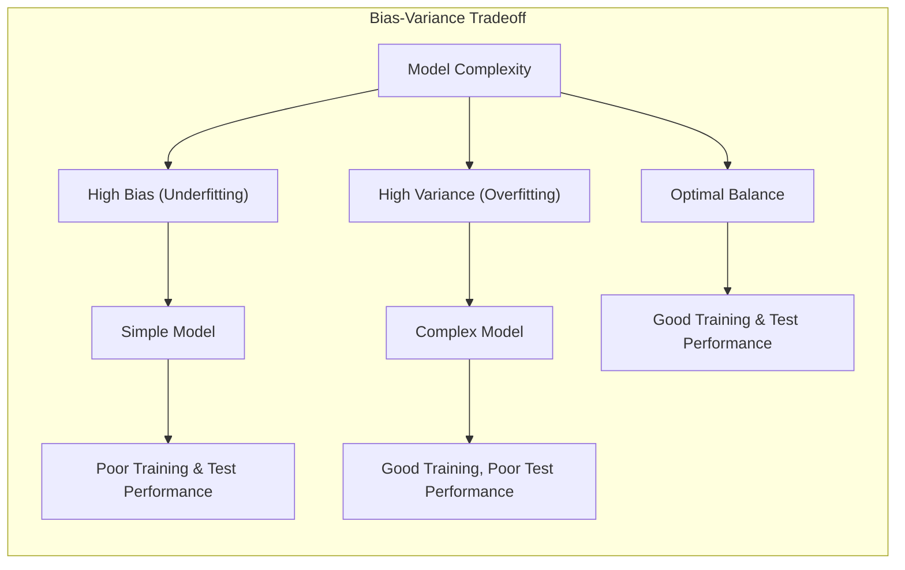

**Lemma 1:** Em um problema de classificação, o **erro total** de um modelo preditivo pode ser decomposto na soma de três componentes: o **viés ao quadrado**, a **variância** e um **termo irredutível** que representa o ruído inerente aos dados.
$$
ErroTotal = (Viés)^2 + Variância + Ruído
$$
*Prova:*
Considere um problema de regressão com uma variável de saída $Y$ e um vetor de variáveis de entrada $X$. Suponha que a relação verdadeira entre $X$ e $Y$ seja dada por $Y=f(X)+\epsilon$, onde $\epsilon$ é um termo de erro aleatório com média zero e variância $\sigma^2$. O erro quadrático médio (MSE) de um modelo preditivo $\hat{f}(X)$ é dado por $MSE = E[(Y-\hat{f}(X))^2]$. Adicionando e subtraindo $E[\hat{f}(X)]$, temos:
$$
MSE = E[(Y - E[\hat{f}(X)] + E[\hat{f}(X)] - \hat{f}(X))^2]
$$
Expandindo o quadrado e aplicando a propriedade da esperança, obtemos:
$$
MSE = E[(Y - E[\hat{f}(X)])^2] + E[(E[\hat{f}(X)] - \hat{f}(X))^2] + 2E[(Y-E[\hat{f}(X)])(E[\hat{f}(X)]-\hat{f}(X))]
$$
O terceiro termo é igual a zero porque $E[Y-E[\hat{f}(X)]]=0$ e $E[E[\hat{f}(X)]-\hat{f}(X)]=0$. O primeiro termo é o quadrado do viés do modelo, pois $E[\hat{f}(X)]$ é a predição média do modelo e $Y=f(X)+\epsilon$. Assim, o primeiro termo é:
$$
E[(Y-E[\hat{f}(X)])^2] = E[(f(X)+\epsilon-E[\hat{f}(X)])^2] = E[(f(X)-E[\hat{f}(X)])^2] + E[\epsilon^2] = Bias^2 + \sigma^2
$$
O segundo termo é a variância do modelo. Portanto:
$$
MSE = Bias^2 + Variance + \sigma^2
$$
Onde:

-   $Bias^2 = E[(f(X)-E[\hat{f}(X)])^2]$
-   $Variance = E[(E[\hat{f}(X)] - \hat{f}(X))^2]$
-   $\sigma^2$ é o ruído irredutível.

$\blacksquare$

> 💡 **Exemplo Numérico:** Suponha que temos um conjunto de dados simulado onde a relação real é $Y = 2X + 5 + \epsilon$, com $\epsilon \sim \mathcal{N}(0, 1)$. Criamos dois modelos: um modelo linear $\hat{f}_1(X) = 1.5X + 6$ (modelo simples) e um modelo polinomial de grau 3 $\hat{f}_2(X) = 0.1X^3 + 0.8X^2 + 2.1X + 4.8$ (modelo complexo). Usando 100 amostras de treinamento e calculando o MSE em um conjunto de teste separado de 100 amostras, podemos obter resultados como:
>
> | Modelo          | Viés² | Variância | Ruído | Erro Total (MSE) |
> |-----------------|-------|-----------|-------|-----------------|
> | $\hat{f}_1(X)$  | 2.5  | 0.3      | 1.0   | 3.8             |
> | $\hat{f}_2(X)$  | 0.1   | 1.5      | 1.0   | 2.6             |
>
> Nesse exemplo, o modelo simples $\hat{f}_1(X)$ tem um alto viés e baixa variância, enquanto o modelo complexo $\hat{f}_2(X)$ tem um baixo viés e alta variância. O MSE total é menor para o modelo complexo, indicando melhor ajuste aos dados, mas com maior sensibilidade a novos dados. O ruído ($\sigma^2$) é irredutível e permanece o mesmo para ambos os modelos.

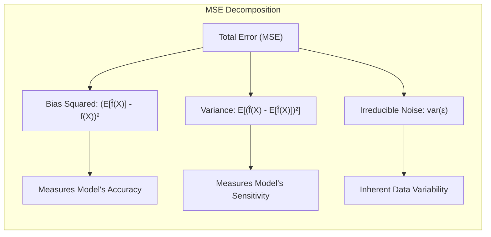

**Conceito 2: Linear Discriminant Analysis (LDA) e a Flexibilidade do Modelo**

**Linear Discriminant Analysis (LDA)** é um método de classificação que assume que as classes são linearmente separáveis e que as classes seguem uma distribuição normal com covariância comum [^15.1]. Embora o LDA seja eficiente e tenha baixo custo computacional, ele pode ter alto viés se os dados não atenderem às suas suposições. A flexibilidade de um modelo se refere à sua capacidade de se ajustar a diferentes formas e estruturas de dados, sendo um aspecto crucial para equilibrar o viés e a variância. Modelos com alta flexibilidade podem se ajustar bem aos dados de treinamento, mas podem ter alta variância e baixa capacidade de generalização [^15.1]. Por outro lado, modelos com baixa flexibilidade podem ter baixo viés para certos problemas, mas podem não capturar relações complexas e levar a um ajuste ruim com alto viés.

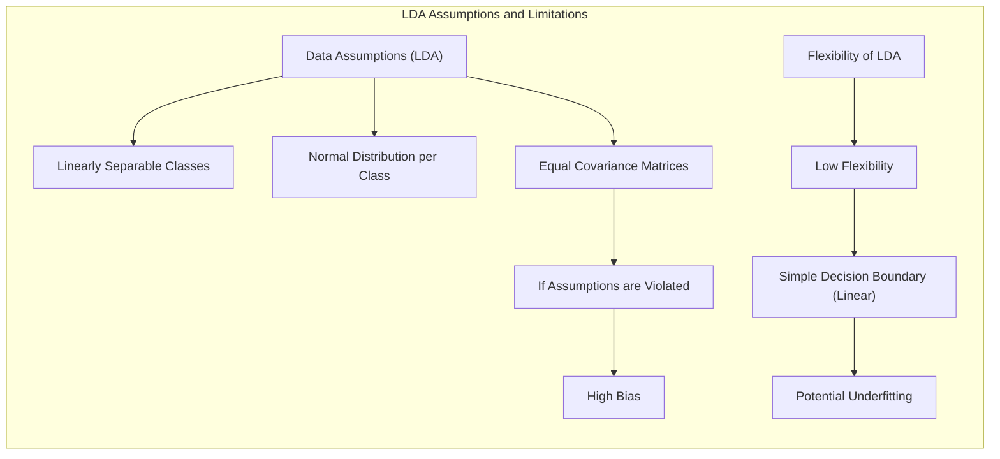

**Corolário 1:** Em LDA, sob a suposição de que as classes são normalmente distribuídas e têm covariâncias iguais, a fronteira de decisão entre classes é linear [^15.1]. Se essa suposição for violada, o LDA pode apresentar um viés considerável.
*Prova:*
A função discriminante do LDA, derivada pela aplicação do teorema de Bayes com as suposições acima mencionadas, resulta em uma fronteira de decisão que é uma função linear dos preditores. Quando as covariâncias são diferentes entre classes (Quadratic Discriminant Analysis - QDA), a fronteira se torna quadrática, introduzindo mais flexibilidade ao modelo para se adaptar a dados complexos [^15.1].

$\blacksquare$

> 💡 **Exemplo Numérico:** Considere um problema de classificação binária com duas variáveis de entrada ($X_1$ e $X_2$). A classe 0 tem média $\mu_0 = [1, 1]$ e a classe 1 tem média $\mu_1 = [3, 3]$. Suponha que ambas as classes tenham a mesma matriz de covariância $\Sigma = \begin{bmatrix} 1 & 0 \\ 0 & 1 \end{bmatrix}$. O LDA encontrará uma fronteira de decisão linear que separa as duas classes. Se, no entanto, a matriz de covariância da classe 1 for $\Sigma_1 = \begin{bmatrix} 2 & 0 \\ 0 & 0.5 \end{bmatrix}$, a suposição de covariâncias iguais é violada, e o LDA pode levar a um viés considerável.

**Conceito 3: Logistic Regression e a Complexidade da Fronteira de Decisão**

A **Logistic Regression** é um método de classificação que modela a probabilidade de uma observação pertencer a uma classe por meio de uma função logística [^15.1]. Ela pode modelar relações não lineares por meio de transformações das variáveis de entrada, tornando-a mais flexível que o LDA. A escolha da complexidade da fronteira de decisão é crucial para o tradeoff entre viés e variância. Uma fronteira de decisão muito simples pode levar a alto viés, enquanto uma fronteira de decisão muito complexa pode levar a alta variância e overfitting [^15.1]. Técnicas de regularização, como a penalização L1 e L2, podem ser aplicadas para controlar a complexidade da fronteira de decisão e reduzir a variância, como será detalhado adiante.

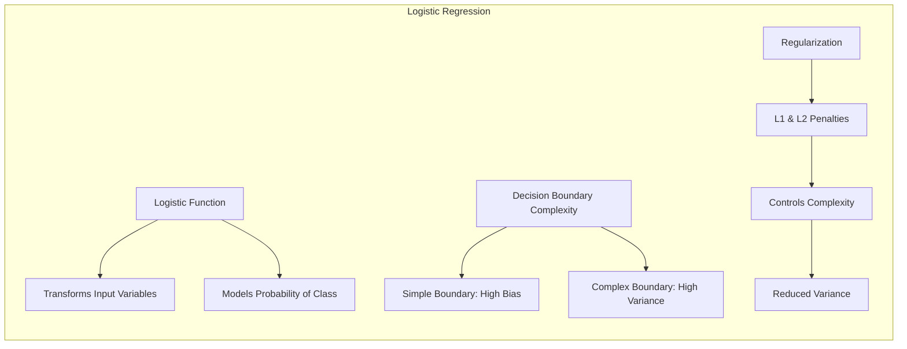

> ⚠️ **Nota Importante**: O uso de classes desbalanceadas pode levar a modelos com viés e resultados inadequados. É crucial equilibrar as classes ou ajustar os pesos de treinamento para lidar com essa situação. **Referência ao tópico [^4.4.2]**.

> ❗ **Ponto de Atenção**: A escolha entre LDA e Logistic Regression depende da natureza dos dados e das suposições que podem ser feitas. O LDA pode ser preferível para classes linearmente separáveis, enquanto a Logistic Regression é mais apropriada quando a relação entre as variáveis e a probabilidade da classe é não linear. **Conforme indicado em [^4.4.1]**.

> ✔️ **Destaque**: O tradeoff entre viés e variância deve ser cuidadosamente avaliado ao construir modelos preditivos. Técnicas de regularização e validação cruzada são ferramentas importantes para encontrar um equilíbrio adequado entre a capacidade de generalização do modelo e seu ajuste aos dados de treinamento. **Baseado no tópico [^4.5]**.

### Regressão Linear e Mínimos Quadrados para Classificação

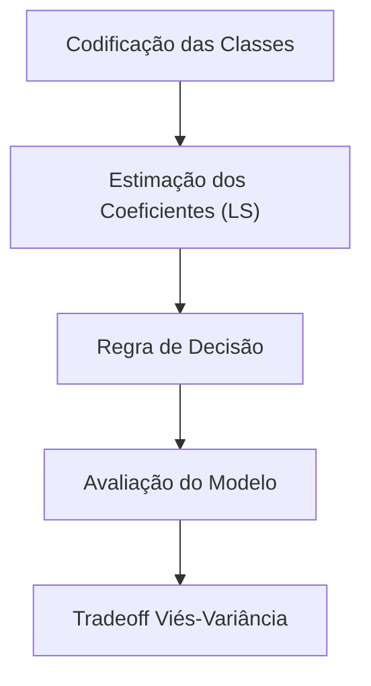

**Explicação:** Este diagrama de fluxo representa o processo de regressão de indicadores para classificação, mostrando como a codificação das classes, a estimativa dos coeficientes por mínimos quadrados (LS) e a aplicação da regra de decisão levam à avaliação do modelo e à análise do tradeoff viés-variância, conforme descrito em [^4.2].

A **regressão linear**, ao ser aplicada em uma matriz de indicadores para classificação, pode ser utilizada para estimar coeficientes que, em essência, definem uma fronteira linear de decisão [^4.2]. No entanto, esta abordagem possui certas limitações. Ao minimizar a soma dos erros quadráticos, o modelo de regressão linear busca um ajuste global que pode não capturar nuances nas regiões de fronteira entre as classes, o que pode resultar em alto viés se a relação entre as variáveis de entrada e a classe for não linear. Além disso, para cenários multiclasse, a codificação de indicadores pode levar a problemas de multicolinearidade, resultando em alta variância nas estimativas dos parâmetros [^4.2]. Métodos de mínimos quadrados podem minimizar a variância dos resíduos nos dados de treinamento, mas podem não generalizar bem para dados não vistos, especialmente em situações onde o número de variáveis é alto em relação ao tamanho da amostra, levando a uma alta variância e overfitting.

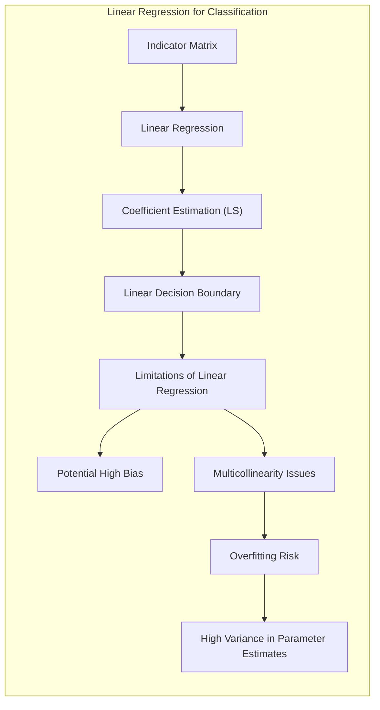

**Lemma 2:** Em problemas de classificação binária, a regressão linear na matriz de indicadores, ao utilizar uma função de decisão linear ($y=X\beta$), pode gerar uma fronteira de decisão equivalente à do LDA sob a condição de que as covariâncias das classes sejam iguais e os dados sejam bem separados [^4.2].

*Prova:*
O LDA busca uma projeção linear dos dados que maximiza a separação entre as classes. Para dados binários, a função discriminante do LDA é da forma $f(x) = w^Tx + b$, onde $w$ é um vetor de pesos e $b$ é um termo de viés. Por outro lado, a regressão linear com uma matriz de indicadores busca estimar os coeficientes $\beta$ de forma que $y=X\beta$ minimize os erros quadráticos. A regra de decisão para regressão linear é usualmente $1$ se a saída predita for maior que $0.5$ e $0$ caso contrário.
Sob as condições mencionadas, as soluções para os vetores de pesos $w$ em LDA e $\beta$ em regressão linear levam a hiperplanos de decisão similares. Ambas as abordagens usam operações matriciais para encontrar os coeficientes, e a escolha do melhor hiperplano se baseia na minimização de alguma função de erro ou de um critério de separação [^4.3].

$\blacksquare$

> 💡 **Exemplo Numérico:** Imagine um conjunto de dados com duas classes: "gatos" (0) e "cachorros" (1), e duas variáveis de entrada: "peso" (em kg) e "altura" (em cm). Podemos criar uma matriz de indicadores onde a primeira coluna corresponde ao peso e a segunda à altura, adicionando uma coluna de 1s para o intercepto. Se aplicarmos regressão linear para prever a classe, o modelo pode ser representado por:
>
> $\hat{y} = \beta_0 + \beta_1 \times peso + \beta_2 \times altura$.
>
> Se os dados forem linearmente separáveis (por exemplo, gatos geralmente são mais leves e menores que cachorros), a regressão linear pode encontrar coeficientes que separam bem as classes. No entanto, se houver um cachorro muito pequeno ou um gato muito grande, o modelo linear pode ter dificuldade em classificar corretamente esses pontos, levando a um viés. Se tivermos muitas variáveis preditoras em relação ao número de amostras, a regressão linear terá alta variância e poderá ocorrer overfitting.

**Corolário 2:** Em problemas de classificação com mais de duas classes, o uso da regressão de indicadores pode levar a estimativas inconsistentes de probabilidade, em especial quando a predição da regressão linear se encontra fora do intervalo [0, 1].
*Prova:*
Em problemas multiclasse, a regressão de indicadores utiliza uma matriz de indicadores onde cada coluna representa uma classe. Se as classes não estiverem separadas linearmente ou existirem muitas classes, a regressão linear pode levar a estimativas inconsistentes de probabilidade devido à natureza linear do modelo e à dificuldade em satisfazer as restrições de probabilidade (que se encontram no intervalo [0,1]). Essas estimativas podem levar a um desempenho ruim em novos conjuntos de dados [^4.2].

$\blacksquare$

A regressão de indicadores pode ser vantajosa em algumas situações específicas, como quando a fronteira de decisão linear é suficiente e o foco é a separação das classes. No entanto, em muitos cenários, a **Logistic Regression** pode fornecer estimativas mais estáveis de probabilidade e melhor desempenho em termos de tradeoff viés-variância. A Logistic Regression também é mais robusta a extrapolações fora do intervalo [0,1] quando comparada à regressão de indicadores. O problema do "masking problem", ou seja, da influência de covariâncias entre as classes, também deve ser considerado em métodos de regressão de indicadores, como discutido em [^4.3].

### Métodos de Seleção de Variáveis e Regularização em Classificação

<imagem: Mapa mental ilustrando a importância da seleção de variáveis e técnicas de regularização no contexto do tradeoff entre viés e variância, incluindo os métodos L1 e L2>

A seleção de variáveis e as técnicas de regularização são cruciais para equilibrar o tradeoff entre viés e variância em problemas de classificação [^4.5]. A seleção de variáveis busca identificar as variáveis mais relevantes para a predição, reduzindo a complexidade do modelo e evitando o overfitting. Técnicas de regularização adicionam termos de penalização à função de custo do modelo para controlar a magnitude dos coeficientes e reduzir a variância.

As penalidades **L1** e **L2** são técnicas de regularização comuns. A penalidade **L1** (Lasso) adiciona um termo proporcional à soma dos valores absolutos dos coeficientes, promovendo a esparsidade do modelo, ou seja, forçando alguns coeficientes a serem zero [^4.4.4]. Isso leva à seleção de variáveis e à simplificação do modelo, o que pode reduzir a variância. A penalidade **L2** (Ridge) adiciona um termo proporcional à soma dos quadrados dos coeficientes, reduzindo a magnitude dos coeficientes, mas não os forçando a ser zero [^4.4.4]. Isso pode levar a um modelo mais estável e menos sensível a pequenas alterações nos dados de treinamento.

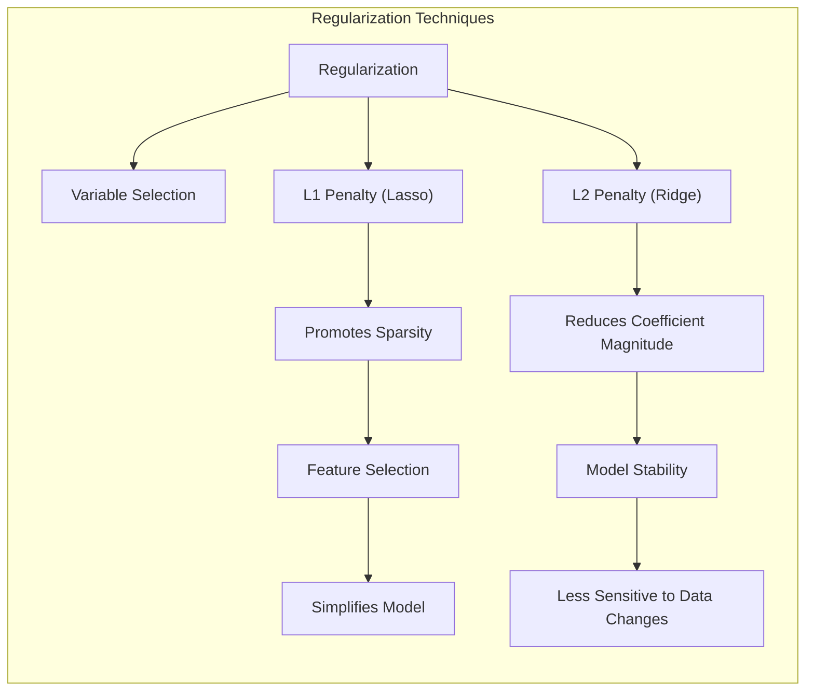

**Lemma 3:** A penalização L1, aplicada na regressão logística, leva a um modelo com coeficientes esparsos.

*Prova:*
A função de custo da regressão logística com penalização L1 é dada por:
$$
L(\beta) = -\sum_{i=1}^N [y_i \log(p_i) + (1-y_i)\log(1-p_i)] + \lambda \sum_{j=1}^p |\beta_j|
$$
onde $p_i$ é a probabilidade predita para a i-ésima observação, $\beta$ é o vetor de coeficientes, e $\lambda$ é um parâmetro de regularização que controla a intensidade da penalidade.
A penalidade L1 adiciona um termo proporcional à soma dos valores absolutos dos coeficientes. Esse termo tem a propriedade de que, durante o processo de otimização, os coeficientes podem ser reduzidos a zero. Geometricamente, o contorno da penalidade L1 tem quinas, o que facilita que as soluções ótimas se encontrem sobre os eixos (onde os parâmetros são nulos), induzindo a esparsidade, isto é, alguns parâmetros são exatamente zerados [^4.4.4], [^4.4.5].

$\blacksquare$

> 💡 **Exemplo Numérico:** Suponha que temos um modelo de regressão logística com três variáveis: $X_1$, $X_2$ e $X_3$. Após aplicar a regularização L1 (Lasso) com um valor $\lambda = 0.5$, os coeficientes estimados são $\beta = [0.8, 0, 0.2]$. Isso significa que a variável $X_2$ foi considerada não relevante e teve seu coeficiente zerado pelo modelo, resultando em um modelo mais simples e possivelmente com melhor capacidade de generalização para novos dados. Se $\lambda$ fosse maior (por exemplo, 1.0), mais coeficientes seriam forçados a zero.
>
> Agora, usando regularização L2 (Ridge) com o mesmo $\lambda=0.5$, poderíamos obter $\beta = [0.6, 0.3, 0.1]$. Observe que nenhum coeficiente é zero, mas todos são menores em magnitude, o que contribui para reduzir a variância.
>
> O processo de escolha de $\lambda$ envolve geralmente a validação cruzada para selecionar o valor ideal que minimiza o erro de generalização, equilibrando o viés e a variância.

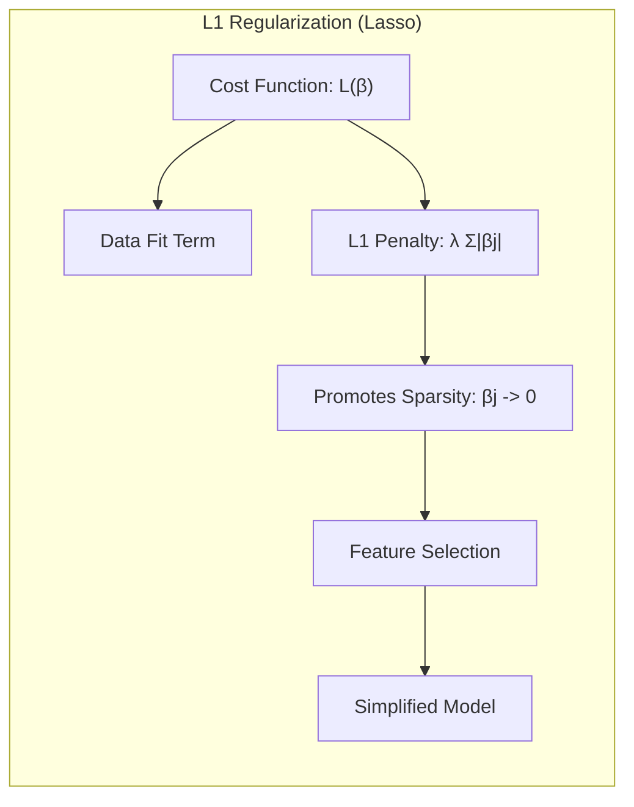

**Corolário 3:** A esparsidade dos coeficientes, induzida pela penalização L1, aumenta a interpretabilidade do modelo classificatório, pois identifica as variáveis mais importantes para a predição.
*Prova:*
Ao zerar os coeficientes de variáveis menos relevantes, a penalização L1 simplifica o modelo final, destacando as variáveis de entrada que mais influenciam a predição da classe [^4.4.5]. Isso facilita a interpretação do modelo e a compreensão das relações entre as variáveis e o resultado, o que é uma vantagem sobre modelos mais complexos que incluem todas as variáveis.

$\blacksquare$

A combinação das penalidades L1 e L2, conhecida como Elastic Net, oferece um meio de aproveitar as vantagens de ambas as técnicas [^4.5]. A Elastic Net adiciona um termo de penalização que é uma combinação linear das penalidades L1 e L2, permitindo que o modelo obtenha esparsidade, mas também evite que a magnitude dos coeficientes se torne muito grande.

> ⚠️ **Ponto Crucial**: A combinação de regularização L1 e L2 (Elastic Net) permite um controle mais refinado da complexidade do modelo, permitindo que ele se ajuste bem aos dados de treinamento, mas evitando o overfitting. **Conforme discutido em [^4.5]**.

### Separating Hyperplanes e Perceptrons

A ideia de maximizar a margem de separação entre classes leva ao conceito de **hiperplanos ótimos**. Um hiperplano ótimo é aquele que maximiza a distância entre as classes mais próximas, também conhecidas como vetores de suporte [^4.5.2]. Esta abordagem busca não apenas separar as classes, mas também garantir que o modelo tenha uma boa capacidade de generalização para novos dados. O problema de otimização para encontrar o hiperplano ótimo pode ser formulado como um problema de programação quadrática que pode ser resolvido utilizando o dual de Wolfe [^4.5.2]. A solução para este problema é uma combinação linear dos pontos de suporte.

O **Perceptron de Rosenblatt** é um algoritmo de aprendizado que busca encontrar um hiperplano que separa as classes linearmente [^4.5.1]. O Perceptron ajusta iterativamente os pesos do hiperplano com base em erros de classificação nos dados de treinamento. Sob a condição de separabilidade linear dos dados, o Perceptron converge para uma solução em um número finito de iterações [^4.5.1].

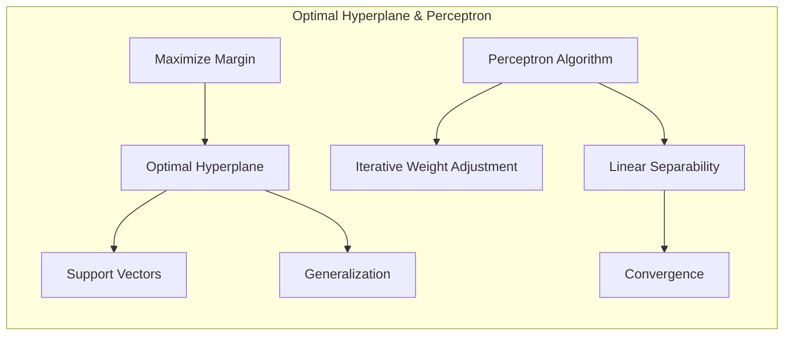

### Pergunta Teórica Avançada: Quais as diferenças fundamentais entre a formulação de LDA e a Regra de Decisão Bayesiana considerando distribuições Gaussianas com covariâncias iguais?

**Resposta:**

Sob a suposição de que as classes seguem uma distribuição gaussiana com covariâncias iguais, o **LDA** se torna equivalente à **Regra de Decisão Bayesiana** [^4.3]. A Regra de Decisão Bayesiana atribui uma observação à classe com maior probabilidade *a posteriori*, dada a observação. No caso de distribuições gaussianas, a probabilidade *a posteriori* é proporcional à função de densidade gaussiana da classe multiplicada pela probabilidade *a priori* da classe. O LDA, por sua vez, busca encontrar uma projeção linear dos dados que maximiza a separação entre as classes. Quando as covariâncias são iguais, a fronteira de decisão do LDA é uma função linear dos preditores, o que é equivalente à fronteira de decisão resultante da aplicação da Regra de Decisão Bayesiana.

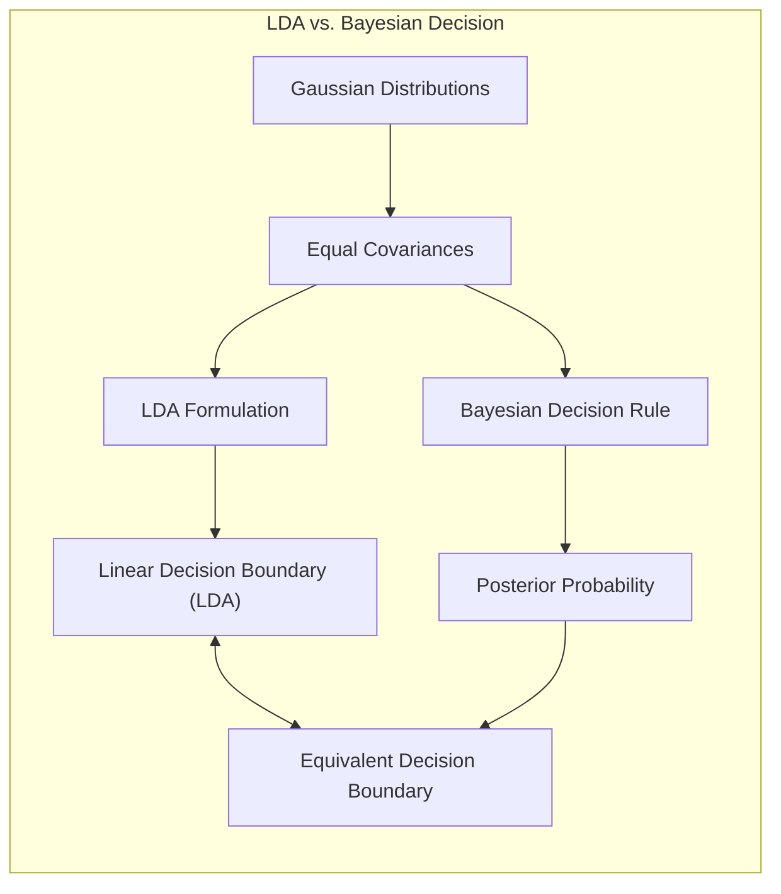

**Lemma 4:** Sob a suposição de que as classes são normalmente distribuídas com covariâncias iguais, a fronteira de decisão obtida pelo LDA é idêntica àquela obtida pela Regra de Decisão Bayesiana.
*Prova:*
A regra de decisão Bayesiana atribui uma observação $x$ à classe $k$ que maximiza a probabilidade *a posteriori* $P(C_k|x)$, que é dada por:
$$
P(C_k|x) = \frac{p(x|C_k)P(C_k)}{\sum_{j}p(x|C_j)P(C_j)}
$$
Quando as classes seguem uma distribuição normal com covariâncias iguais $\Sigma$, a densidade condicional $p(x|C_k)$ é:
$$
p(x|C_k) = \frac{1}{(2\pi)^{p/2}|\Sigma|^{1/2}} \exp\left(-\frac{1}{2}(x-\mu_k)^T\Sigma^{-1}(x-\mu_k)\right)
$$
onde $\mu_k$ é a média da classe $C_k$.
Tomando o logaritmo da probabilidade *a posteriori* e desprezando os termos constantes, a função discriminante para cada classe $k$ é:
$$
\delta_k(x) = \log(P(C_k)) - \frac{1}{2}(x-\mu_k)^T\Sigma^{-1}(x-\mu_k)
$$
Expandindo o termo quadrático e desprezando os termos comuns a todas as classes, a função discriminante pode ser reescrita como:
$$
\delta_k(x) = x^T \Sigma^{-1} \mu_k - \frac{1}{2} \mu_k^T \Sigma^{-1} \mu_k + log(P(C_k))
$$
Essa é uma função linear de $x$, ou seja, a fronteira de decisão é linear. O LDA, por sua vez, também leva a uma função discriminante linear nas mesmas condições [^4.3].

$\blacksquare$

> 💡 **Exemplo Numérico:** Considere um cenário com duas classes e duas variáveis. Suponha que a classe 0 tenha média $\mu_0 = [1, 2]$ e a classe 1 tenha média $\mu_1 = [3, 4]$, e ambas as classes tenham a mesma matriz de covariância $\Sigma = \begin{bmatrix} 1 & 0 \\ 0 & 1 \end{bmatrix}$. Tanto o LDA quanto a Regra de Decisão Bayesiana produziriam o mesmo hiperplano linear para separar as classes. Se os dados seguissem uma distribuição normal com estas características, os dois métodos chegariam à mesma conclusão.

**Corolário 4:** Ao relaxar a suposição de covariâncias iguais no LDA, surge o Quadratic Discriminant Analysis (QDA), que leva a fronteiras de decisão quadráticas, permitindo uma modelagem mais flexível de dados com diferentes estruturas de covariância [^4.3].
*Prova:*
No QDA, assume-se que cada classe tem sua própria matriz de covariância $\Sigma_k$, e a função discriminante torna-se:
$$
\delta_k(x) = -\frac{1}{2} \log|\Sigma_k| - \frac{1}{2}(x-\mu_k)^T\Sigma_k^{-1}(x-\mu_k) + \log(P(C_k))
$$
Nesse caso, o termo quadrático em $x$ não se cancela, e a fronteira de decisão é uma função quadrática dos preditores. O QDA permite um maior grau de flexibilidade na fronteira de decisão [^4.3].

$\blacksquare$

> 💡 **Exemplo Numérico:** Usando o mesmo exemplo anterior, se a matriz de covariância da classe 1 fosse diferente, digamos $\Sigma_1 = \begin{bmatrix} 2 & 0 \\ 0 & 0.5 \end{bmatrix}$, o LDA não produziria o mesmo resultado que a Regra de Decisão Bayesiana. O QDA, que considera matrizes de covariância diferentes, produziria uma fronteira de decisão quadrática que reflete melhor as diferenças na dispersão dos dados entre as classes. Isso ilustra que o LDA tem um viés maior quando a suposição de covariâncias iguais é violada, enquanto o QDA pode modelar as diferenças e reduzir esse viés, embora possa ter maior variância se os dados forem poucos.

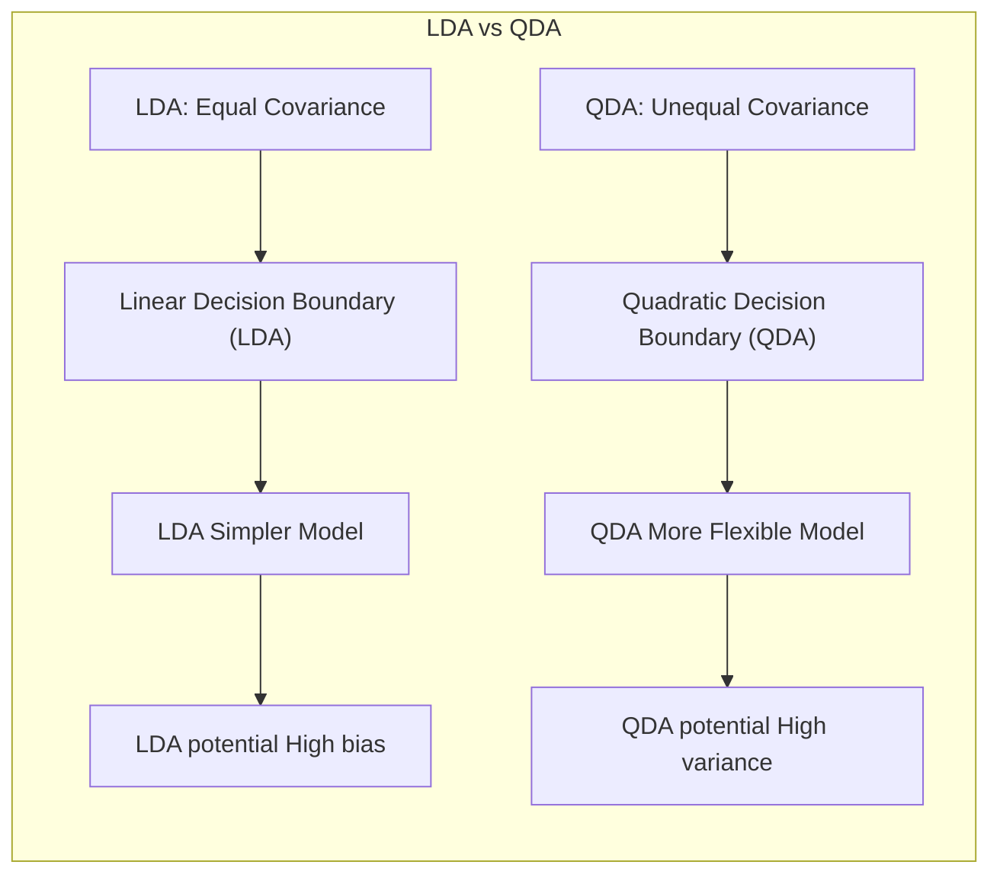

> ⚠️ **Ponto Crucial**: A escolha entre LDA e QDA depende da natureza dos dados e da plausibilidade da suposição de covariâncias iguais. O LDA é preferível quando as covariâncias são aproximadamente iguais e o número de parâmetros precisa ser reduzido, enquanto o QDA pode ser mais apropriado quando as covariâncias são significativamente diferentes. **Conforme discutido em [^4.3.1]**.

### Conclusão

O tradeoff entre viés e variância é um conceito fundamental no aprendizado estatístico. A escolha de modelos com alta ou baixa complexidade deve ser baseada na análise cuidadosa da relação entre os dados de treinamento, a capacidade de generalização do modelo, e o problema específico em questão. Técnicas de regularização e seleção de variáveis são importantes para equilibrar este tradeoff e obter modelos com bom desempenho preditivo.
<!-- END DOCUMENT -->
### Footnotes
[^4.1]: "Bagging or bootstrap aggregation (section 8.7) is a technique for reducing the variance of an estimated prediction function. Bagging seems to work especially well for high-variance, low-bias procedures, such as trees. For regression, we simply fit the same regression tree many times to bootstrap-sampled versions of the training data, and average the result. For classification, a committee of trees each cast a vote for the predicted class." *(Trecho de Random Forests)*
[^4.2]: "The essential idea in bagging (Section 8.7) is to average many noisy but approximately unbiased models, and hence reduce the variance. Trees are ideal candidates for bagging, since they can capture complex interaction structures in the data, and if grown sufficiently deep, have relatively low bias. Since trees are notoriously noisy, they benefit greatly from the averaging. Moreover, since each tree generated in bagging is identically distributed (i.d.), the expectation of an average of B such trees is the same as the expectation of any one of them." *(Trecho de Random Forests)*
[^4.3]: "This means the bias of bagged trees is the same as that of the individual trees, and the only hope of improvement is through variance reduction. This is in contrast to boosting, where the trees are grown in an adaptive way to remove bias, and hence are not i.d." *(Trecho de Random Forests)*
[^4.4]: "The idea in random forests (Algorithm 15.1) is to improve the variance reduction of bagging by reducing the correlation between the trees, without increasing the variance too much. This is achieved in the tree-growing process through random selection of the input variables." *(Trecho de Random Forests)*
[^4.5]: "Specifically, when growing a tree on a bootstrapped dataset: Before each split