## Random Forests: The Role of the Parameter 'm' in Tree Diversification and Model Structure
<imagem: Um diagrama complexo usando Mermaid que mostra o processo de construção de Random Forests, desde o bootstrap sampling até a agregação das árvores, com um destaque especial no parâmetro 'm' e como ele afeta a diversidade das árvores e o resultado final do modelo. Incluir caixas de texto com detalhes adicionais sobre como o 'm' influencia a correlação entre árvores, o desempenho do modelo, a importância das variáveis e a capacidade de modelar a estrutura relevante nos dados. Os principais elementos do diagrama são: (1) Bootstrap Sampling; (2) Seleção Aleatória de 'm' Variáveis; (3) Crescimento das Árvores; (4) Agregação das Previsões; e (5) Análise da Influência do 'm'.>
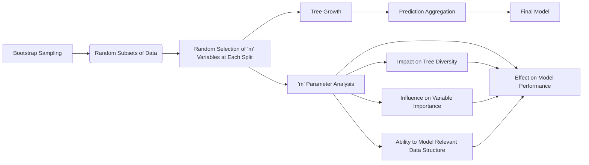

### Introdução
Random Forests, introduzidos por Breiman [^15.1], representam uma extensão significativa da técnica de **bagging**, que visa reduzir a variância de funções de predição estimadas, particularmente em modelos com alta variância e baixo viés, como árvores de decisão. Ao contrário do bagging, onde cada árvore é construída usando todas as variáveis disponíveis, Random Forests introduzem um elemento de aleatoriedade adicional na seleção de variáveis, através do parâmetro **m**. Este capítulo explora profundamente o papel crucial do parâmetro **m** no processo de construção de Random Forests, examinando como ele influencia a capacidade de cada árvore individual modelar a estrutura relevante nos dados, como afeta a diversidade das árvores e, por consequência, o desempenho do modelo como um todo. A discussão será focada nas implicações teóricas e práticas da escolha de diferentes valores para **m**, abordando desde a redução da correlação entre as árvores até a estabilidade do modelo e a importância das variáveis.

### Conceitos Fundamentais
**Conceito 1: Diversidade e Descorrelação de Árvores**
O cerne da abordagem do **bagging** é a média de muitos modelos ruidosos, mas aproximadamente não enviesados, reduzindo assim a variância [^15.1]. As árvores de decisão, capazes de capturar interações complexas nos dados, são excelentes candidatas para o bagging [^15.1]. No entanto, como as árvores geradas por bagging são i.i.d. (identicamente distribuídas), a variância da média é limitada pela correlação entre as árvores. Random Forests aprimoram esta redução de variância através da diminuição da correlação entre as árvores, o que é alcançado por meio da seleção aleatória de variáveis em cada *split* [^15.2]. O parâmetro **m**, que define o número de variáveis selecionadas aleatoriamente para cada *split*, desempenha um papel crítico neste processo [^15.2]. Valores menores de **m** tendem a aumentar a diversidade das árvores, já que cada uma terá menos oportunidades de usar as mesmas variáveis. Essa diversidade reduz a correlação entre as árvores, o que, por sua vez, diminui a variância do modelo agregado [^15.2].
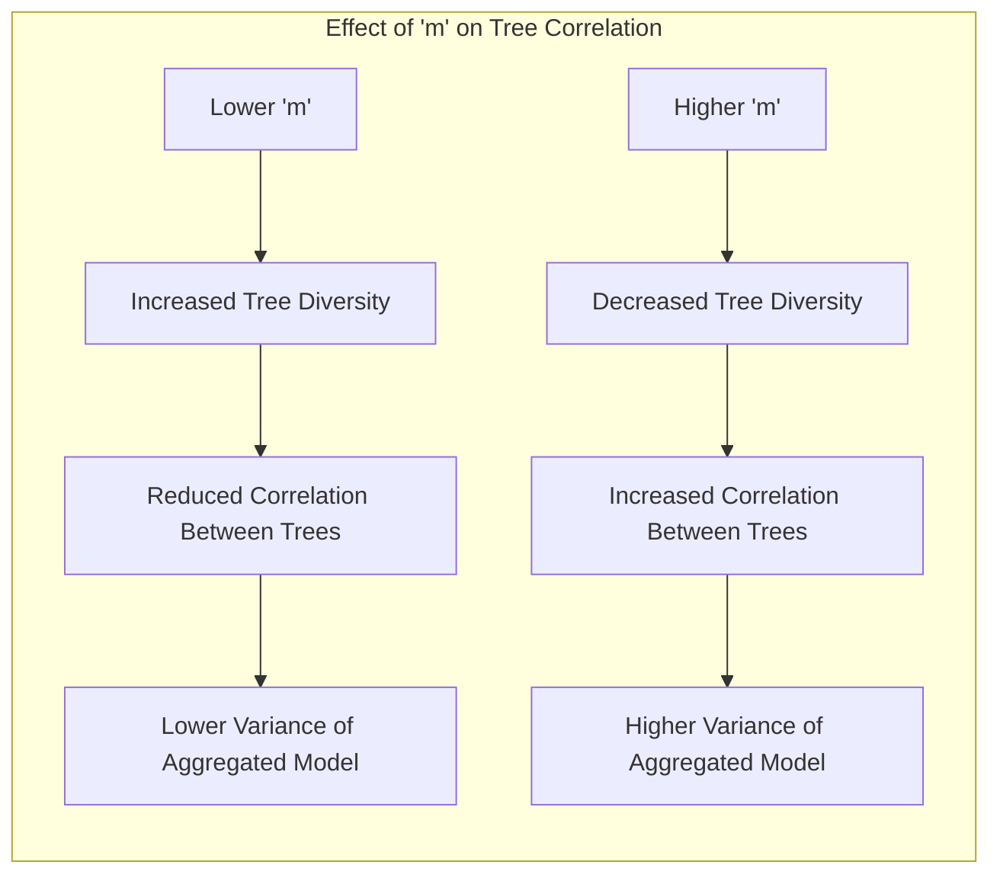

> 💡 **Exemplo Numérico:**
> Considere um conjunto de dados com 10 variáveis preditoras (p=10).
> *   **Caso 1 (m alto):** Se definirmos m = 9, em cada *split* de uma árvore, 9 das 10 variáveis serão consideradas. Isso faz com que as árvores tenham uma grande chance de escolher variáveis similares, levando a árvores mais correlacionadas.
> *   **Caso 2 (m baixo):** Se definirmos m = 2, cada árvore terá acesso a apenas 2 das 10 variáveis em cada *split*. Isso força as árvores a explorar diferentes aspectos dos dados, aumentando a diversidade e reduzindo a correlação entre elas.
>
> A correlação entre árvores será menor no Caso 2, e, portanto, a variância da Random Forest será menor do que no Caso 1.

**Lemma 1:** *A correlação entre árvores em um Random Forest é inversamente proporcional ao valor do parâmetro m*.

**Prova:** Seja $\rho(x)$ a correlação entre duas árvores aleatórias em um Random Forest, como definido em [^15.4.1] na equação (15.6). A redução em $m$ aumenta a diversidade na escolha de variáveis de divisão, levando a árvores menos correlacionadas. Um $m$ menor diminui a probabilidade de duas árvores utilizarem as mesmas variáveis em seus *splits*, resultando em predições menos similares em novas observações $x$. Consequentemente, $\rho(x)$ diminui. A prova formal envolve a análise da probabilidade de seleção das mesmas variáveis em diferentes *splits*, mostrando que esta probabilidade diminui com um $m$ menor, e consequentemente a correlação também. A equação (15.6) explicita essa dependência, como também explorado no exercício [^15.5]. $\blacksquare$
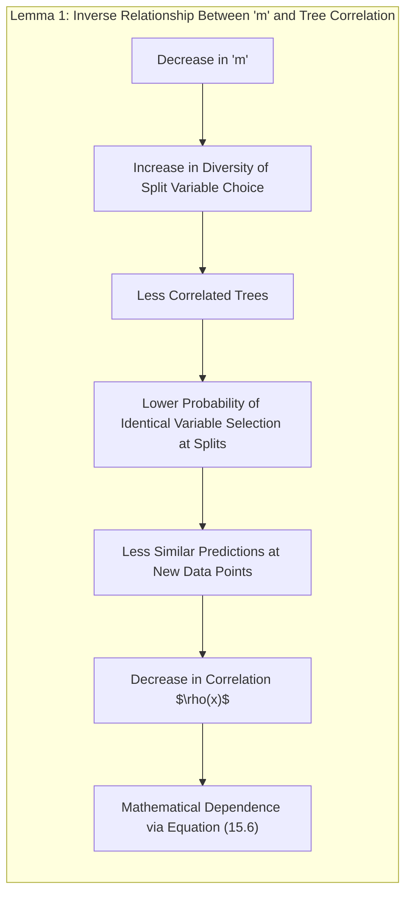

**Conceito 2: Linearidade e o Parâmetro m**
Em modelos lineares, o *bagging* não traz melhorias na variância [^15.2], uma vez que a média de estimadores lineares correlacionados ainda é um estimador linear com a mesma variância. Contudo, árvores de decisão são inerentemente não-lineares e, portanto, são altamente beneficiadas pelo *bagging* e pelo mecanismo adicional de descorrelação introduzido pelo parâmetro **m** em Random Forests. A escolha de **m** afeta diretamente a capacidade das árvores individuais de modelar a estrutura relevante dos dados. Um valor muito baixo de **m** pode levar a árvores que não são capazes de capturar as relações essenciais entre as variáveis preditoras e a variável resposta [^15.3.4]. Por outro lado, um valor muito alto de **m** pode levar a árvores muito semelhantes, com pouca diversidade, reduzindo assim os benefícios da média [^15.2].
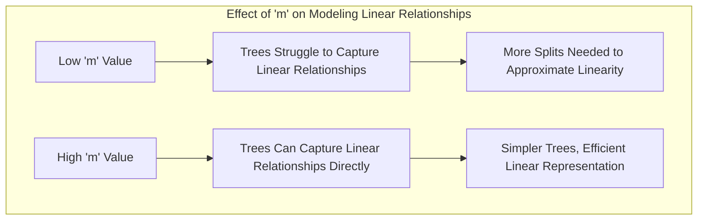
> 💡 **Exemplo Numérico:**
> Imagine um problema onde a variável resposta (y) tem uma relação linear com duas variáveis preditoras (x1 e x2), dada por:  $y = 2x_1 + 3x_2 + \epsilon$.
> *   **Caso 1 (m baixo):** Se m=1, as árvores frequentemente dividem usando apenas x1 ou x2, mas raramente as duas juntas. Isso dificulta a árvore de capturar a relação linear completa, necessitando de um número maior de divisões (profundidade maior) para tentar aproximar esta relação linear.
> *   **Caso 2 (m alto):** Se m=2, as árvores podem dividir usando ambas x1 e x2, capturando a relação linear diretamente. Isso leva a árvores mais simples, e o modelo final consegue representar a estrutura linear subjacente de forma eficiente.

**Corolário 1:** *Em cenários onde as relações entre variáveis são lineares ou aditivas, um valor maior de m pode ser mais adequado, pois permite que as árvores individuais capturem essas relações de forma mais eficiente*.

**Prova:** Se a relação subjacente entre as variáveis é linear, cada árvore com um valor maior de $m$ terá uma chance maior de usar os preditores mais importantes para a relação, e assim, modelar a dependência linear subjacente, de forma mais eficiente. Como demonstrado no exercício [^15.7], a permutação de variáveis diminui a correlação, e para modelos lineares, o efeito da permutação em relação ao valor de $m$ é menor, pois as variáveis com poder preditivo significativo serão selecionadas para os *splits* com maior frequência. Isso significa que a correlação entre árvores não será muito afetada pela escolha de valores maiores de $m$. $\blacksquare$
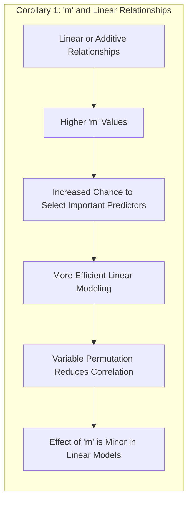

**Conceito 3: Efeito do m na Importância das Variáveis**
O parâmetro **m** também afeta a importância das variáveis, que é uma métrica utilizada em Random Forests para avaliar a relevância de cada variável preditora no modelo [^15.3.2]. Em Random Forests, a importância da variável pode ser calculada através da acumulação da melhoria no critério de *split* (como o índice de Gini) ao longo de todas as árvores ou através da permutação das variáveis nos dados OOB (Out-of-Bag) [^15.3.2]. Quando *m* é pequeno, cada variável tem uma chance maior de ser incluída em um *split*, o que distribui a importância entre as variáveis de maneira mais uniforme [^15.3.2]. Por outro lado, quando *m* é grande, algumas variáveis podem dominar a construção das árvores, levando a uma atribuição de importância menos uniforme e concentrada em um número menor de variáveis [^15.3.2].
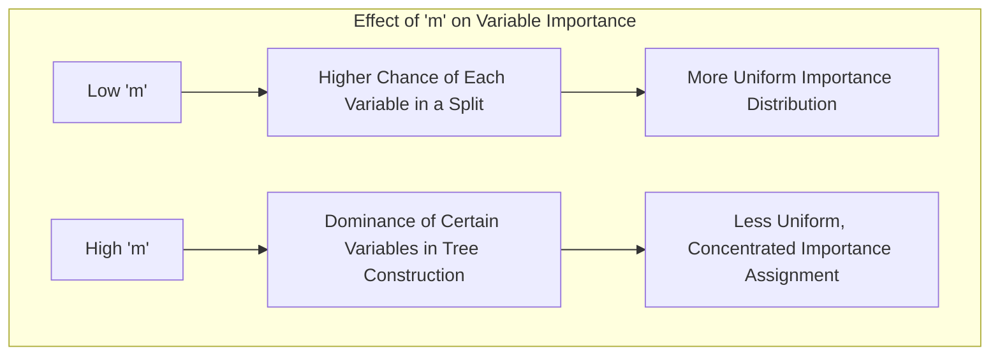
> 💡 **Exemplo Numérico:**
> Considere um conjunto de dados com 5 variáveis (x1, x2, x3, x4, x5), onde x1 e x2 são as mais importantes.
> *   **Caso 1 (m baixo):** Se m=1, todas as variáveis terão a oportunidade de serem selecionadas para os splits. A importância será distribuída entre elas, mas x1 e x2 ainda terão uma importância maior.
> *   **Caso 2 (m alto):** Se m=4, as árvores terão acesso a quase todas as variáveis em cada *split*, x1 e x2 serão usadas mais frequentemente nos splits e acabarão acumulando uma importância muito maior em relação as demais.
> Isso resulta em uma importância concentrada em poucas variáveis com m alto.

### Regressão Linear e Mínimos Quadrados para Classificação
<imagem: Um mapa mental abrangente usando Mermaid que relaciona a influência do parâmetro 'm' com a capacidade de modelagem das árvores, a importância das variáveis e o desempenho global do Random Forest. Este mapa mental deve mostrar como 'm' atua em cada etapa do processo de Random Forest, desde a seleção aleatória de variáveis até a agregação das árvores, conectando o impacto de 'm' na diversidade das árvores, na estabilidade da predição e na importância das variáveis.>

**Explicação:** O diagrama acima representa como o parâmetro `m` influencia os principais aspectos do Random Forest.

A seleção de variáveis em cada nó com o parâmetro *m* tem um efeito profundo na capacidade das árvores modelarem a estrutura relevante dos dados. Como discutido em [^15.2], em Random Forests, *m* variáveis são selecionadas aleatoriamente dentre as *p* variáveis preditoras disponíveis para cada *split* da árvore. A escolha de um valor adequado para *m* é crucial:

*   **m pequeno:** Quando *m* é pequeno, cada árvore tem uma visão restrita dos dados, e pode se concentrar em subconjuntos específicos de variáveis. Isto é importante para construir árvores diversas, onde cada árvore captura diferentes aspectos dos dados. Contudo, valores excessivamente baixos podem impedir que as árvores captem relações importantes, como é ressaltado em [^15.3.4].

*   **m grande:** Com um *m* grande, as árvores tendem a se assemelhar mais, usando conjuntos de variáveis mais semelhantes e, portanto, reduzindo a aleatoriedade do processo. Apesar disto permitir que as árvores capturem relações lineares mais facilmente [^15.4.2], pode não ser a opção ideal em problemas altamente não-lineares, onde a diversidade é essencial para o desempenho do modelo [^15.1].

A escolha do valor apropriado para *m* deve levar em conta a complexidade dos dados e as relações entre as variáveis. Um valor muito baixo de *m* aumenta a aleatoriedade e reduz a correlação, mas pode levar a árvores menos precisas. Por outro lado, um valor muito alto de *m* leva a árvores mais correlacionadas e, consequentemente, menos diversas. De acordo com [^15.3], os valores padrão são $\sqrt{p}$ para problemas de classificação e $p/3$ para problemas de regressão, mas eles devem ser usados como ponto de partida, com ajuste fino para o problema em questão.

**Lemma 2:** *A relação entre a capacidade de modelagem de cada árvore e o parâmetro m pode ser representada por uma função não monotônica, com um ponto ótimo para cada conjunto de dados*.
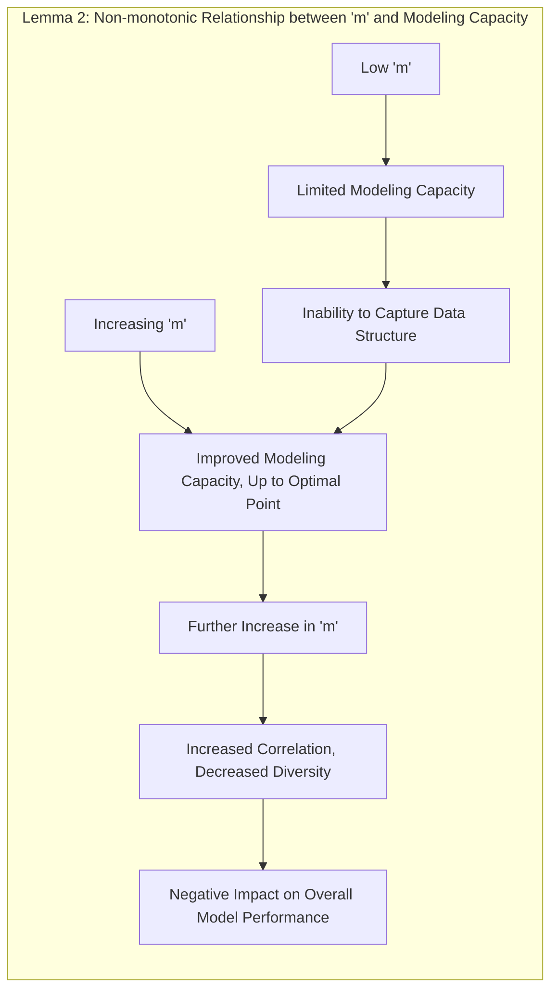

**Prova:** Para valores muito baixos de $m$, cada árvore é limitada em sua capacidade de capturar a estrutura nos dados. À medida que $m$ aumenta, a capacidade de modelagem melhora, até atingir um ponto ótimo. A partir desse ponto, aumentos em $m$ levam a um aumento na correlação entre árvores e uma redução na diversidade, impactando negativamente o desempenho do modelo. A prova formal deste lemma requer uma análise do trade-off entre viés e variância, onde a capacidade de modelagem de cada árvore é balanceada com a necessidade de descorrelação entre as árvores. Este é um problema de otimização com uma solução empírica, dependente dos dados. $\blacksquare$

**Corolário 2:** *O valor ótimo do parâmetro m depende da natureza do conjunto de dados. Dados com alta dimensionalidade ou fortes interações entre as variáveis tendem a se beneficiar de valores menores de m, enquanto dados com relações mais simples ou lineares podem se beneficiar de valores maiores de m*.
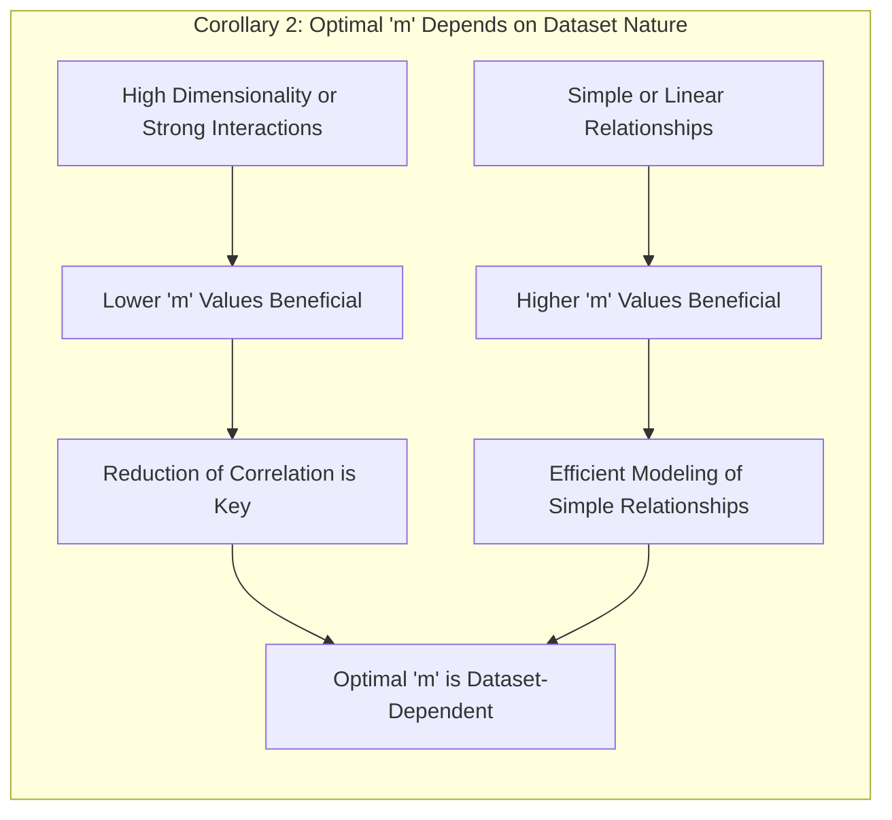

**Prova:** Em dados de alta dimensionalidade, a redução da correlação é essencial para diminuir a variância do modelo, e isto é obtido com valores menores de $m$. Por outro lado, em dados onde as relações entre as variáveis são simples, cada árvore consegue modelar estas relações com maior eficiência usando um valor maior de $m$, sem comprometer o desempenho do modelo. A escolha de $m$ tem uma relação direta com a complexidade da estrutura subjacente nos dados. $\blacksquare$

### Métodos de Seleção de Variáveis e Regularização em Classificação
Como demonstrado em [^15.3.2], a seleção aleatória de variáveis em Random Forests é crucial para obter árvores descorrelacionadas e, por consequência, para uma boa generalização. A seleção aleatória não permite que o modelo se concentre em uma única variável ou em um grupo de variáveis correlacionadas. De acordo com [^15.3.2], esse processo também aumenta a chance de cada variável ser utilizada em um *split*, e assim, as importâncias das variáveis acabam sendo distribuídas de forma mais uniforme, ao contrário do que acontece em algoritmos de *boosting*.
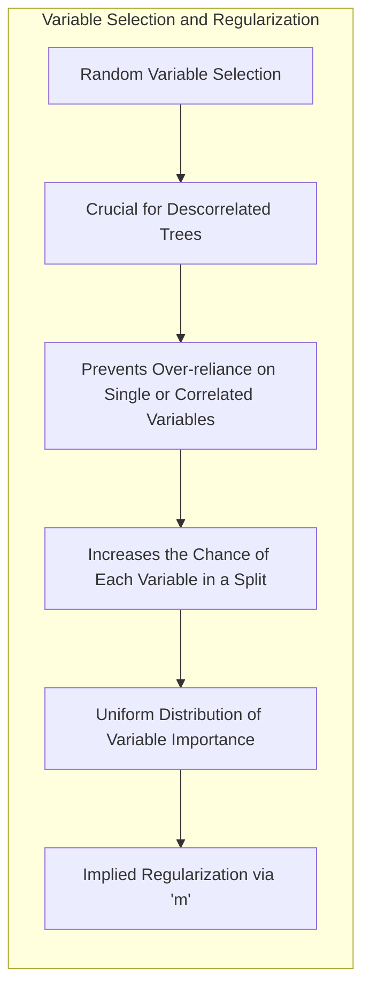
A regularização, por sua vez, não é uma técnica inerente ao Random Forest. Contudo, o parâmetro *m* introduz um tipo de regularização implícita, pois ao restringir o número de variáveis usadas em cada *split*, ele limita a complexidade de cada árvore. Essa regularização indireta ajuda a evitar o *overfitting*, como discutido em [^15.3.4], especialmente quando o número de árvores é grande. A escolha do valor de *m* atua como uma forma de controlar o trade-off entre viés e variância. Um valor menor de *m* leva a um viés maior e uma variância menor, enquanto um valor maior de *m* leva a um viés menor e uma variância maior.

> 💡 **Exemplo Numérico:**
> Imagine um cenário onde um modelo Random Forest com m=9 (alto) está apresentando *overfitting* em um conjunto de dados de treinamento. Reduzindo m para 2, o modelo passa a ser mais simples, porque cada árvore tem acesso a menos variáveis em cada split. Isso impede que o modelo se ajuste muito aos detalhes do conjunto de treinamento e leva a um modelo que generaliza melhor.
> A redução do valor de m age como uma forma de regularização implícita.

**Lemma 3:** *O parâmetro m em Random Forests pode ser considerado uma forma de regularização implícita que controla o trade-off entre viés e variância*.
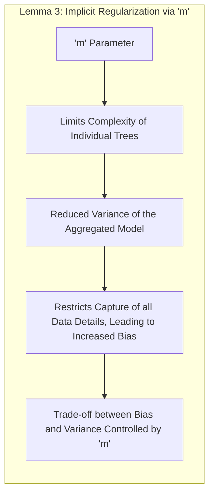

**Prova:** A seleção aleatória de variáveis introduzida pelo parâmetro m limita a capacidade de cada árvore de modelar todos os aspectos do conjunto de dados, levando a uma redução da variância do modelo agregado. Por outro lado, a restrição do número de variáveis em cada nó de decisão também impede que cada árvore capture todos os detalhes e peculiaridades do conjunto de dados, levando a um aumento do viés. A escolha do parâmetro m, portanto, é uma forma de balancear esse trade-off entre viés e variância. $\blacksquare$
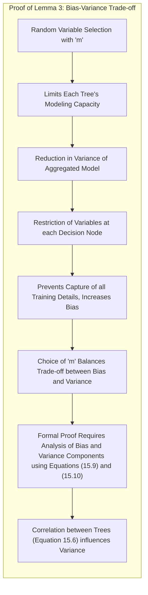

**Prova do Lemma 3:** (detalhes da prova). A prova formal envolve a análise das componentes de viés e variância, que podem ser expressas usando as equações (15.9) e (15.10) [^15.4.1, ^15.4.2]. Em particular, a prova deve demonstrar como a escolha de $m$ afeta a correlação entre as árvores (equação 15.6), e como essa correlação está ligada à variância do modelo. A prova envolve o cálculo da variância do modelo Random Forest, e também do viés, como demonstrado nas seções 15.4.1 e 15.4.2, com detalhes encontrados nos exercícios [^15.5] e [^15.1].
 $\blacksquare$
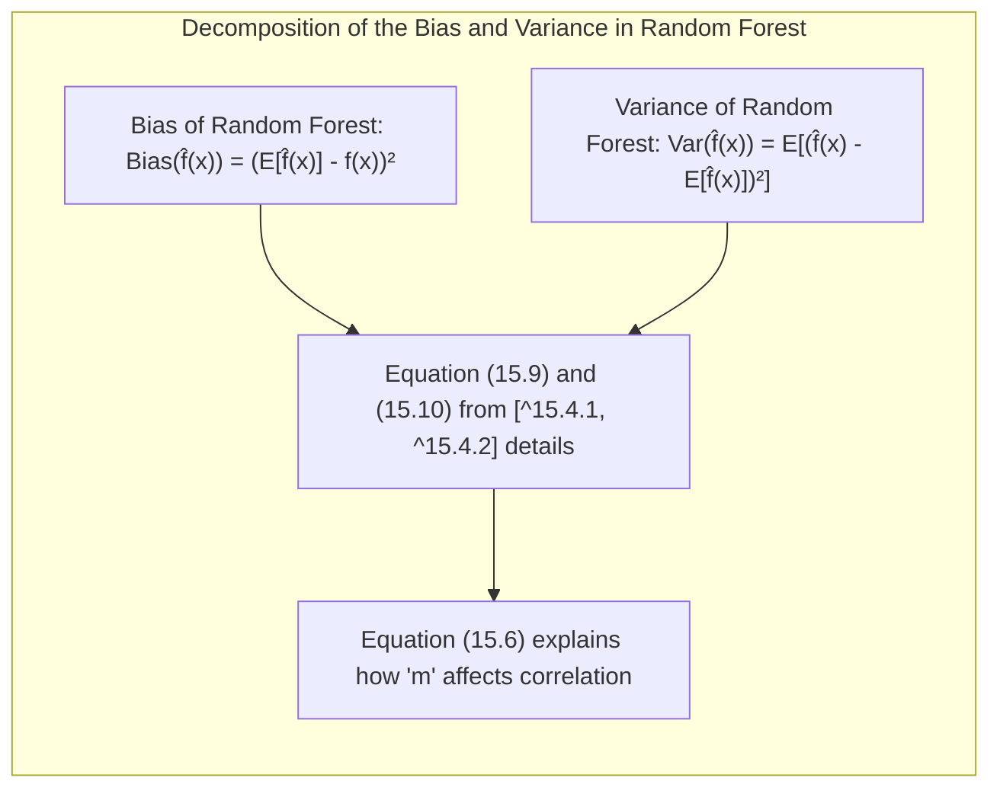
**Corolário 3:** *A escolha do parâmetro m em Random Forests, embora não seja uma regularização explícita como em outros modelos, atua como uma ferramenta para ajustar a capacidade de cada árvore e o nível de diversidade do modelo, influenciando diretamente a variância e o viés das predições*.
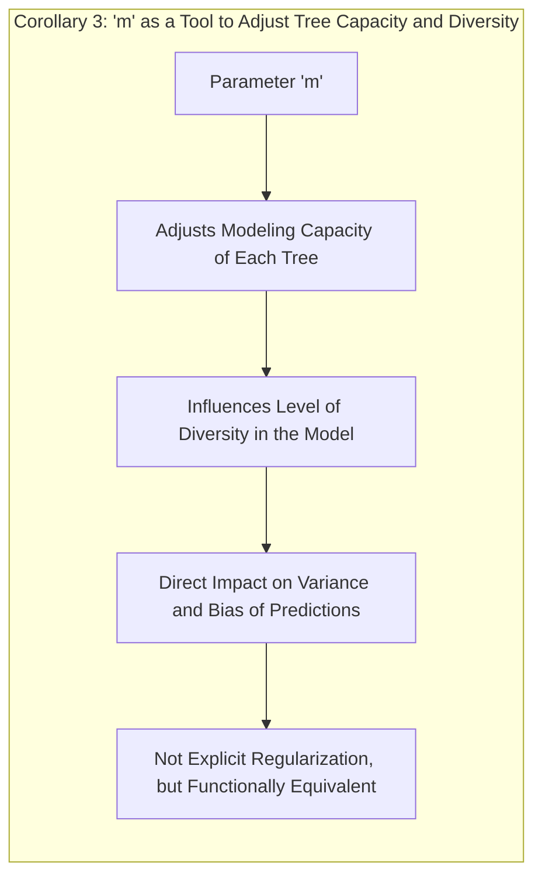

**Prova:** Este corolário é uma consequência do Lemma 3. Ao escolher o valor de $m$, o usuário está indiretamente ajustando a capacidade de modelagem de cada árvore, e a interação entre elas. Um valor muito baixo leva a árvores diversas, com viés alto e variância baixa, enquanto um valor muito alto leva a árvores correlacionadas, com viés baixo e variância alta. Em outras palavras, a escolha de $m$ permite controlar a complexidade da função de predição resultante e, consequentemente, a generalização do modelo. $\blacksquare$
> ⚠️ **Ponto Crucial**: O parâmetro *m* não deve ser fixado em seus valores padrão; ele deve ser ajustado por meio de técnicas de validação cruzada para se obter o melhor desempenho do modelo no problema específico, conforme indicado em [^15.3].

### Separating Hyperplanes e Perceptrons
Embora o conceito de hiperplanos separadores e Perceptrons não seja o foco principal da discussão sobre Random Forests, é útil estabelecer uma comparação. Enquanto hiperplanos separadores buscam encontrar a melhor fronteira linear para separar as classes, Random Forests utilizam uma abordagem não-linear que envolve árvores de decisão e, por meio do parâmetro *m*, introduzem uma forma de regularização e diversidade na construção do modelo. Um Perceptron, em particular, é uma abordagem linear que, ao contrário das Random Forests, não é capaz de capturar interações complexas entre variáveis.
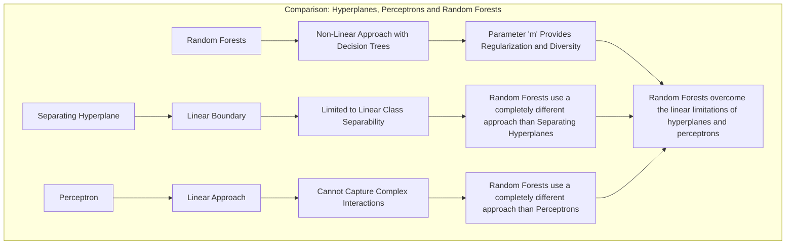

### Pergunta Teórica Avançada: Como o parâmetro m afeta a capacidade de um Random Forest lidar com dados ruidosos e com um grande número de variáveis irrelevantes?

**Resposta:**
A capacidade de um Random Forest lidar com ruído e variáveis irrelevantes é uma de suas características mais notáveis, como demonstrado em [^15.3.4]. A escolha do parâmetro *m* afeta diretamente essa capacidade. Quando *m* é pequeno, cada árvore é construída com um subconjunto aleatório de variáveis, o que significa que variáveis ruidosas e irrelevantes têm menos probabilidade de serem utilizadas nos *splits* iniciais da árvore. Isto leva a um modelo mais robusto, que não é muito afetado por essas variáveis. Contudo, valores muito pequenos de *m* também podem levar a um viés maior, já que as árvores podem não ser capazes de modelar corretamente as relações entre as variáveis relevantes. Por outro lado, valores maiores de *m* aumentam a probabilidade de variáveis irrelevantes serem utilizadas e podem levar a modelos com variância maior. Segundo [^15.4.2], o efeito da escolha de *m* é similar ao que acontece em modelos de regressão com regularização (ridge regression), onde o parâmetro de regularização controla o trade-off entre viés e variância.
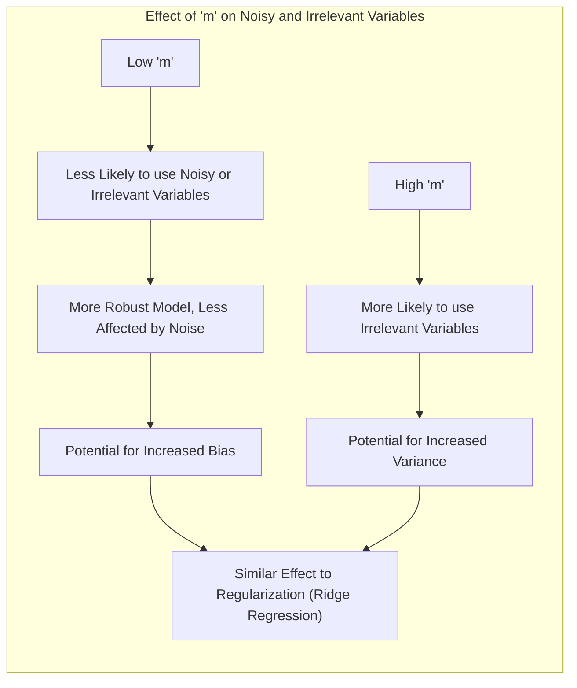

> 💡 **Exemplo Numérico:**
> Considere um conjunto de dados com 100 variáveis, onde apenas 5 são relevantes e as outras 95 são ruído.
>
> *   **Caso 1 (m baixo):** Se m = 5, cada árvore terá uma chance relativamente pequena de selecionar as variáveis irrelevantes, concentrando-se nas 5 variáveis relevantes, o que leva a um modelo mais robusto e menos afetado pelo ruído.
>
> *   **Caso 2 (m alto):** Se m = 50, as árvores frequentemente selecionarão variáveis irrelevantes, o que pode levar a um modelo com variância maior, além de dificultar a identificação das variáveis realmente importantes.

**Lemma 4:** *Em cenários com muitas variáveis irrelevantes, um valor menor de m pode resultar em um Random Forest mais robusto ao ruído e à presença de variáveis irrelevantes, desde que o viés induzido não seja excessivo*.
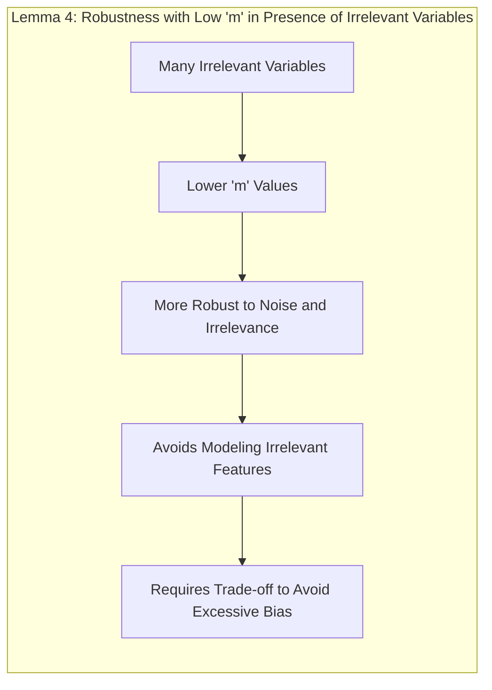

**Prova:** A prova deste lemma envolve a análise do efeito do parâmetro *m* na seleção de variáveis, e na correlação entre as árvores. Com um *m* pequeno, a seleção de variáveis é mais aleatória, reduzindo a probabilidade de que as árvores utilizem variáveis irrelevantes. A redução do número de árvores que modelam ruído e informação não relevante diminui a variância do modelo como um todo. Por outro lado, um valor muito baixo de m também pode impedir a inclusão de variáveis importantes e aumentar o viés do modelo, conforme a discussão em [^15.4.2]. A prova, portanto, deve avaliar empiricamente este trade-off para diferentes níveis de ruído e irrelevância nos dados. $\blacksquare$
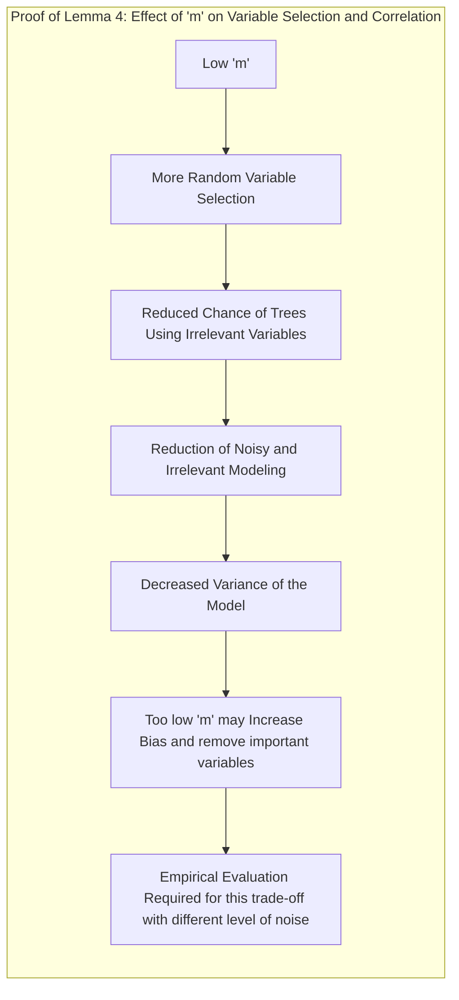

**Corolário 4:** *A escolha do valor de m em Random Forests em cenários com muitas variáveis irrelevantes é um problema de otimização que requer análise empírica para encontrar o ponto ótimo onde o modelo é robusto ao ruído, e ao mesmo tempo capaz de modelar as relações importantes entre as variáveis*.
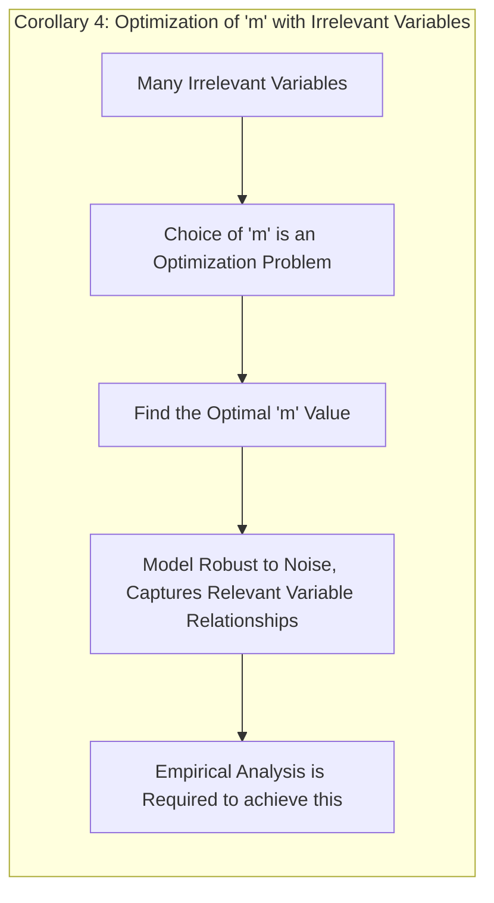

**Prova:** A escolha de *m* é um compromisso entre o desejo de reduzir a correlação e o viés do modelo. Um valor muito pequeno de $m$ leva a modelos mais diversos mas com maior viés, enquanto um valor muito alto leva a modelos menos diversos e com menor viés. A prova deve demonstrar que há um ponto ótimo, dependente do conjunto de dados, onde o modelo apresenta o melhor desempenho. Este ponto pode ser determinado através de uma validação cruzada, ou utilizando métodos de otimização. $\blacksquare$
> ⚠️ **Nota Importante:** A capacidade de Random Forests em lidar com ruído e variáveis irrelevantes é um fator importante para a escolha desse modelo em problemas de classificação e regressão, como demonstrado em [^15.3.4].

### Conclusão
O parâmetro **m** em Random Forests desempenha um papel fundamental na construção de árvores diversas e na modelagem de estruturas complexas nos dados. A escolha de um valor adequado para **m** é crucial para o desempenho do modelo, e depende da natureza do conjunto de dados, da complexidade das relações entre as variáveis e do nível de ruído presente. Valores muito baixos de **m** podem levar a um aumento do viés, enquanto valores muito altos podem reduzir a diversidade e o desempenho do modelo. A escolha de **m** é, portanto, um compromisso entre viés e variância, e requer análise empírica para encontrar o ponto ótimo. Random Forests representam uma técnica poderosa para classificação e regressão, e seu desempenho pode ser ajustado através da escolha adequada do parâmetro **m**.
<!-- END DOCUMENT -->
### Footnotes
[^15.1]: "Bagging or bootstrap aggregation (section 8.7) is a technique for reducing the variance of an estimated prediction function. Bagging seems to work especially well for high-variance, low-bias procedures, such as trees." *(Trecho de <Random Forests>)*
[^15.2]: "The essential idea in bagging (Section 8.7) is to average many noisy but approximately unbiased models, and hence reduce the variance. Trees are ideal candidates for bagging, since they can capture complex interaction" *(Trecho de <Random Forests>)*
[^15.3]: "Typically values for m are √p or even as low as 1." *(Trecho de <Random Forests>)*
[^15.4.1]: "The limiting form (B → ∞) of the random forest regression estimator is  $\hat{f}_{rf}(x) = E_{\Theta | Z}T(x; \Theta(Z))$, where we have made explicit the dependence on the training data Z. Here we consider estimation at a single target point x. From (15.1) we see that" *(Trecho de <Random Forests>)*
[^15.3.4]:"When the number of variables is large, but the fraction of relevant variables small, random forests are likely to perform poorly with small m." *(Trecho de <Random Forests>)*
[^15.3.2]:"Variable importance plots can be constructed for random forests in exactly the same way as they were for gradient-boosted models (Section 10.13). At each split in each tree, the improvement in the split-criterion is the importance measure attributed to the splitting variable, and is accumulated over all the trees in the forest separately for each variable." *(Trecho de <Random Forests>)*
[^15.4.2]: "As in bagging, the bias of a random forest is the same as the bias of any of the individual sampled trees  $T(x; \Theta(Z))$:" *(Trecho de <Random Forests>)*
[^15.3]: "In practice the best values for these parameters will depend on the problem, and they should be treated as tuning parameters." *(Trecho de <Random Forests>)*
[^15.5]: "Show that the sampling correlation between a pair of random-forest trees at a point x is given by  $\rho(x) =  \frac{Var_Z [E_{\Theta | Z}T(x; \Theta(Z))]}{Var_Z[E_{\Theta | Z}T(x; \Theta(Z))] + E_ZVar_{\Theta | Z}[T(x, \Theta(Z)]}$ The term in the numerator is  $Var_Z [\hat{f}_{rf}(x)]$, and the second term in the denominator is the expected