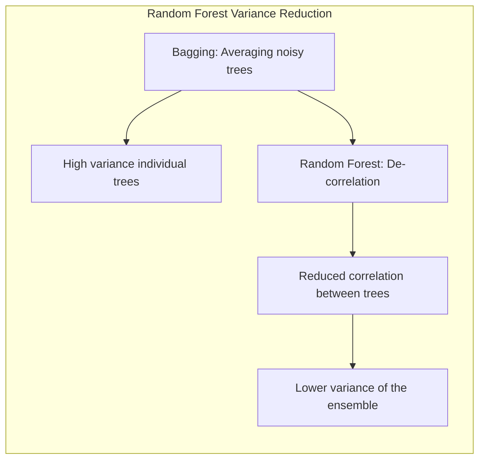
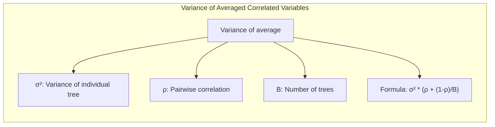
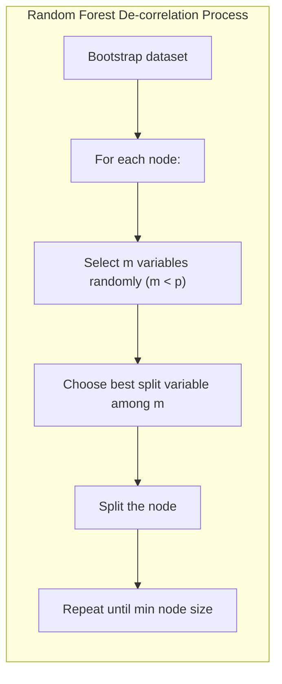
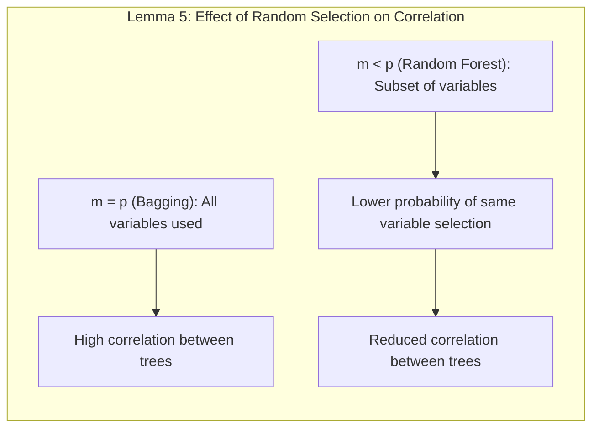
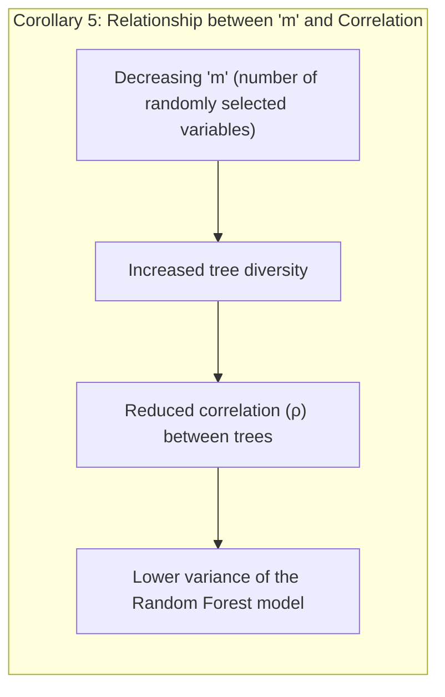
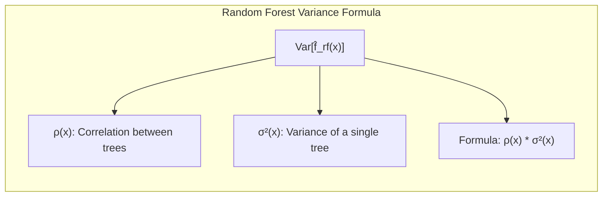
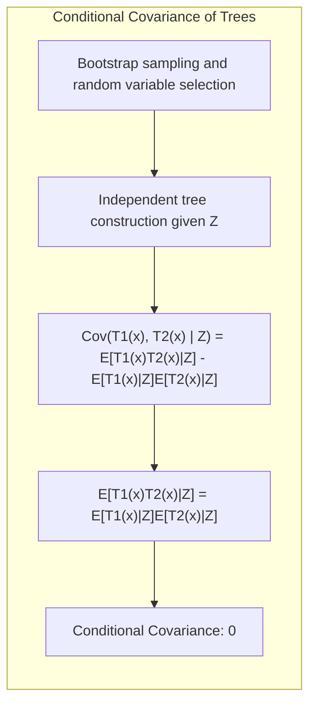
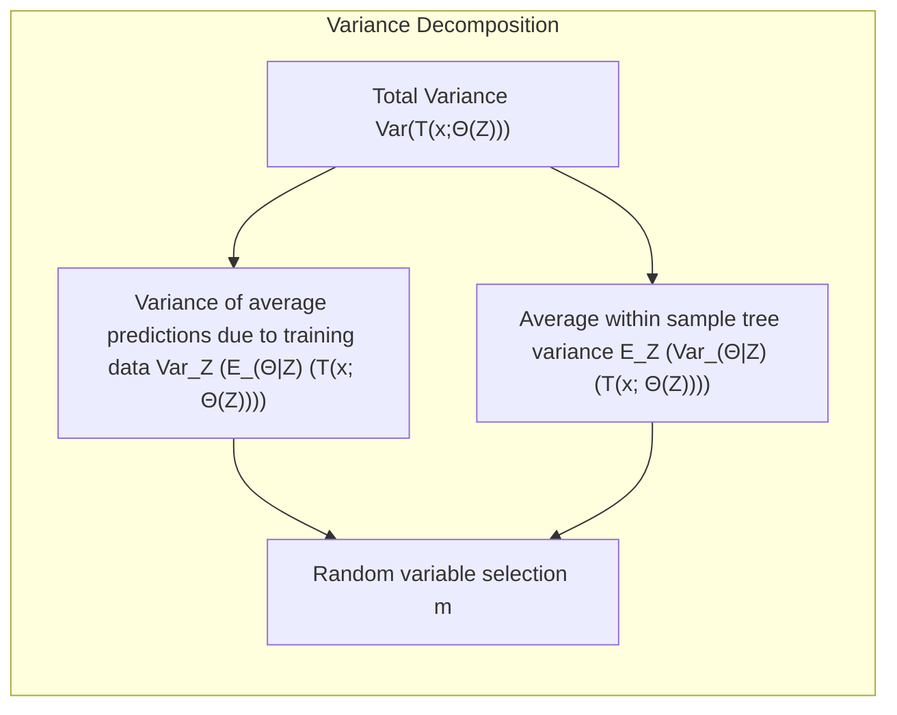
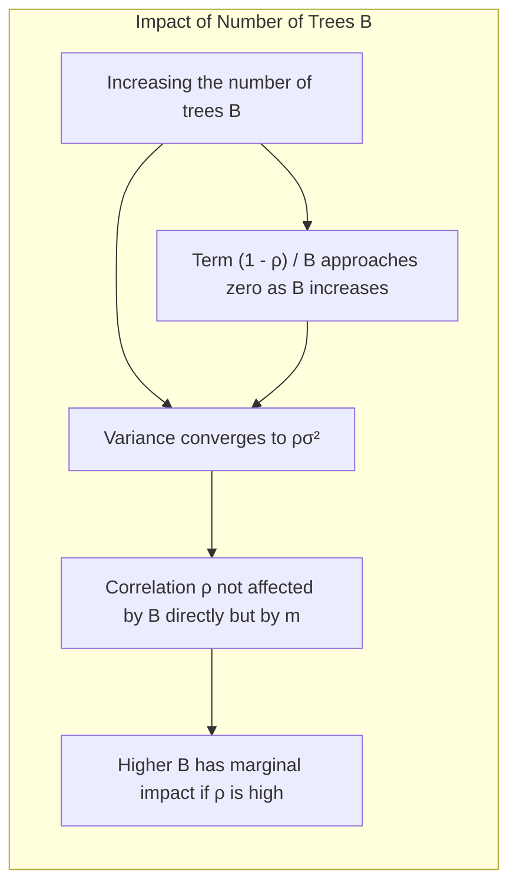

## Variance and the De-Correlation Effect in Random Forests

### Introdução

A ideia central por trás do **bagging** é reduzir a variância de um modelo estatístico pela média de múltiplas versões ruidosas, mas aproximadamente não viesadas, do mesmo modelo [^15.1]. Árvores de decisão, devido à sua capacidade de modelar interações complexas e baixa tendência, são candidatas ideais para o processo de *bagging*. No entanto, a variância das árvores individuais é notavelmente alta, e o *bagging* se beneficia significativamente da média. Conforme discutido em [^15.1], um modelo de *Random Forests* surge como uma extensão substancial do *bagging*, buscando reduzir ainda mais a correlação entre as árvores, sem aumentar significativamente a variância das mesmas. Esta seção explora em detalhes o efeito de *de-correlação* e como ele impacta a variância do *Random Forest*.

### Entendendo a Variância em *Random Forests*

Para compreender o mecanismo de *de-correlação* dentro de *Random Forests*, devemos examinar como a variância de um conjunto de árvores é afetada. Conforme apresentado no contexto, a variância de uma média de *B* variáveis aleatórias i.i.d., cada uma com variância $\sigma^2$, é dada por $\sigma^2/B$. No entanto, em *bagging* e *Random Forests*, as árvores não são independentes. Se as variáveis são apenas i.d. (identicamente distribuídas, mas não necessariamente independentes), com uma correlação *pairwise* positiva *ρ*, a variância da média é dada por [^15.2]:
$$ \sigma^2 \left( \rho + \frac{1-\rho}{B} \right) $$ [^15.2]

> 💡 **Exemplo Numérico:** Suponha que temos um conjunto de árvores onde cada árvore tem uma variância $\sigma^2 = 4$. Vamos considerar dois cenários: um com alta correlação entre as árvores, $\rho = 0.8$, e outro com baixa correlação, $\rho = 0.2$. Se usarmos $B = 10$ árvores, a variância da média das árvores em cada cenário é:
>
> *   **Cenário 1 (Alta Correlação):** $\text{Variância} = 4 \times (0.8 + \frac{1 - 0.8}{10}) = 4 \times (0.8 + 0.02) = 4 \times 0.82 = 3.28$
> *   **Cenário 2 (Baixa Correlação):** $\text{Variância} = 4 \times (0.2 + \frac{1 - 0.2}{10}) = 4 \times (0.2 + 0.08) = 4 \times 0.28 = 1.12$
>
> Este exemplo mostra que a variância da média das árvores é significativamente menor quando a correlação entre as árvores é baixa.

Conforme *B* aumenta, o segundo termo desaparece, mas o primeiro termo persiste, indicando que a correlação entre as árvores limita o benefício da média. A chave para o *Random Forest* é reduzir a correlação entre as árvores para diminuir a variância, e isso é alcançado através da seleção aleatória de variáveis no processo de crescimento da árvore [^15.2].

### Mecanismo de *De-Correlação*

O *Random Forest* emprega um método específico para reduzir a correlação entre as árvores. Ao construir uma árvore em um conjunto de dados *bootstrap*, ao invés de usar todas as variáveis de entrada para cada nó, apenas um subconjunto aleatório de tamanho *m ≤ p* das variáveis é considerado como candidatos para a divisão. Este processo é repetido recursivamente até que o tamanho mínimo do nó seja atingido [^15.2].

O algoritmo, conforme resumido em [^15.2] *Algorithm 15.1*, demonstra este procedimento de seleção aleatória de variáveis. Para cada árvore *b* de 1 a *B*:

1. Uma amostra *bootstrap* $Z^*$ de tamanho *N* é obtida dos dados de treinamento.
2. A árvore $T_b$ é crescida nos dados de *bootstrap*, onde em cada nó:
   i. Um subconjunto de *m* variáveis é selecionado aleatoriamente de um total de *p* variáveis.
   ii. A melhor variável e ponto de divisão são escolhidos dentro deste subconjunto de *m*.
   iii. O nó é dividido em dois nós filhos.

Este processo continua até o tamanho mínimo do nó, *$n_{min}$*, ser alcançado. A previsão em um novo ponto *x* é obtida através da média das predições das *B* árvores (para regressão) ou através do voto da maioria (para classificação) [^15.2].

#### Lemma 5: Impacto da Seleção Aleatória na Correlação das Árvores

**Declaração:** A seleção aleatória de *m* variáveis em cada nó durante o crescimento da árvore *Random Forest* reduz a correlação entre as árvores em comparação com um cenário sem seleção aleatória, onde todas as *p* variáveis são consideradas.
**Prova:** Consideremos duas árvores, $T_1$ e $T_2$, construídas usando *bootstrap* e seleção de variável. Se *m=p*, as árvores são equivalentes ao cenário de *bagging*, onde as divisões são feitas considerando todas as variáveis, levando a uma maior correlação. No entanto, com *m<p*, a probabilidade de duas árvores selecionarem as mesmas variáveis para divisão em nós análogos diminui, o que induz uma menor correlação.

> 💡 **Exemplo Numérico:** Suponha que temos um dataset com $p=10$ variáveis.
>
> *   **Caso 1: Bagging (m=p=10):** Se usarmos bagging, onde $m=10$, cada árvore tem acesso a todas as 10 variáveis em cada nó. Isso resulta em árvores muito semelhantes, com alta correlação entre elas.
> *   **Caso 2: Random Forest (m=3):** Agora, se usarmos random forest com $m=3$, cada árvore seleciona aleatoriamente 3 das 10 variáveis para cada divisão. Isso introduz diversidade e reduz a correlação. Por exemplo, na primeira divisão, a árvore $T_1$ pode usar as variáveis 1, 3 e 7 enquanto a árvore $T_2$ usa as variáveis 2, 5 e 9.
>
> A chance de $T_1$ e $T_2$ selecionarem as mesmas variáveis para divisão é menor do que se tivessem acesso a todas as 10 variáveis, diminuindo a correlação entre elas.

A probabilidade de uma variável relevante ser selecionada em um dado nó é *m/p*. Com *m* significativamente menor que *p*, a correlação entre as árvores é reduzida, pois nem todas as árvores são construídas usando as mesmas variáveis para decisão. A redução desta correlação diminui a variância do *Random Forest* final. $\blacksquare$

#### Corolário 5: Relação entre 'm' e a Correlação das Árvores

**Declaração:** Conforme *m* (o número de variáveis selecionadas aleatoriamente) diminui, a correlação entre as árvores no *Random Forest* também diminui, resultando em menor variância do modelo.
**Prova:** A prova decorre diretamente do Lemma 5. Reduzir o número de variáveis *m* que são consideradas para divisão aumenta a diversidade entre as árvores, diminuindo a probabilidade de que árvores distintas sigam os mesmos caminhos de decisão. Essa diversidade reduz a correlação entre as árvores, o que se traduz em uma variância reduzida da média das árvores (o resultado do modelo *Random Forest*). A equação da variância do resultado médio de *B* árvores mostra claramente que quanto menor a correlação *ρ*, menor a variância final [^15.2]. $\blacksquare$

> 💡 **Exemplo Numérico:** Vamos analisar a variância com diferentes valores de *m* usando a fórmula da variância com correlação. Suponha $\sigma^2 = 4$, $B=100$, e que a correlação $\rho$ seja uma função de *m*, $\rho = m/p$. Vamos considerar um problema com $p=10$.
>
> *   **m = 1:** $\rho = 1/10 = 0.1$. $\text{Variância} = 4 \times (0.1 + \frac{1 - 0.1}{100}) \approx 4 \times 0.109 = 0.436$
> *   **m = 5:** $\rho = 5/10 = 0.5$. $\text{Variância} = 4 \times (0.5 + \frac{1 - 0.5}{100}) \approx 4 \times 0.505 = 2.02$
> *   **m = 10 (Bagging):** $\rho = 10/10 = 1$. $\text{Variância} = 4 \times (1 + \frac{1 - 1}{100}) = 4 \times 1 = 4$
>
> Este exemplo ilustra como a redução de *m* diminui a correlação entre as árvores, levando a uma menor variância do modelo final. Quando $m=p$ (Bagging), a variância da média se aproxima da variância das árvores individuais.

### Fórmula da Variância e Limite de Erro

A forma limite (quando B → ∞) do estimador de regressão *Random Forest* é dada por [^15.4]:
$$ \hat{f}_{rf}(x) = E_{\Theta | Z} [T(x; \Theta(Z))]$$
onde *Z* representa os dados de treinamento e *Θ* representa os parâmetros da árvore. A variância do estimador *Random Forest*, conforme apresentado no contexto, é dada por [^15.5]:
$$Var[\hat{f}_{rf}(x)] = \rho(x) \sigma^2(x)$$
onde *ρ(x)* é a correlação amostral entre qualquer par de árvores e *σ²(x)* é a variância amostral de qualquer árvore sorteada aleatoriamente [^15.8]. Essa formulação demonstra como a variância do modelo *Random Forest* é diretamente proporcional à correlação entre as árvores. Reduzindo *ρ*, diminuímos a variância.

> 💡 **Exemplo Numérico:** Suponha que a variância de uma árvore individual em um certo ponto *x* seja $\sigma^2(x) = 2$ e que a correlação entre as árvores nesse ponto seja $\rho(x) = 0.3$. A variância do Random Forest nesse ponto seria:
>
> $$Var[\hat{f}_{rf}(x)] = 0.3 \times 2 = 0.6$$
>
> Se, por outro lado, a correlação entre as árvores fosse menor, por exemplo, $\rho(x) = 0.1$, a variância do Random Forest seria:
>
> $$Var[\hat{f}_{rf}(x)] = 0.1 \times 2 = 0.2$$
>
> Isso demonstra claramente como a redução da correlação leva a uma menor variância do modelo.

### A Importância de 'm'

A escolha de *m* é crucial. Tipicamente, os valores para *m* são $\sqrt{p}$ para classificação e *p/3* para regressão, ou mesmo valores tão baixos quanto 1 [^15.2], [^15.3]. Reduzir *m* diminui a correlação entre as árvores e, portanto, diminui a variância, conforme discutido em [^15.3]. Entretanto, se *m* for muito pequeno, cada árvore individual pode se tornar muito instável, resultando em um aumento na variância individual das árvores e no erro generalizado.

>⚠️ **Nota Importante**: A escolha ideal de *m* depende do problema específico, necessitando ser considerada como um parâmetro de *tuning* [^15.3].

### Análise Teórica Avançada

#### Pergunta Teórica Avançada: Como a amostragem *bootstrap* e a seleção aleatória de variáveis afetam a covariância condicional entre as árvores no *Random Forest* e por que essa covariância é zero?

**Resposta:** A amostragem *bootstrap* e a seleção aleatória de variáveis são mecanismos essenciais para introduzir aleatoriedade e diversidade na construção das árvores em um *Random Forest*. A amostragem *bootstrap* envolve o sorteio aleatório de amostras com reposição a partir do conjunto de dados original. Isso significa que cada árvore é construída em um subconjunto ligeiramente diferente dos dados, o que já começa a gerar árvores menos correlacionadas entre si. A seleção aleatória de variáveis durante a divisão de cada nó, como descrito anteriormente, adiciona uma outra camada de diversidade.

Formalmente, a amostragem *bootstrap* e a seleção de variáveis são independentes e identicamente distribuídas para cada árvore. Portanto, a covariância condicional entre duas árvores avaliadas em um mesmo ponto *x*, dada uma amostra de treino *Z*, é:

$$ Cov(T_1(x), T_2(x) | Z) = 0$$
onde *T1(x)* e *T2(x)* representam as previsões das duas árvores e *Z* os dados de treino.

Este resultado pode ser demonstrado através da seguinte expansão:

$$Cov(T_1(x), T_2(x) | Z) = E[T_1(x)T_2(x)|Z] - E[T_1(x)|Z]E[T_2(x)|Z]$$

Se as árvores são construídas independentemente, a média condicional do produto é igual ao produto das médias condicionais. Ou seja, como a amostragem e a seleção de variáveis são i.i.d., podemos escrever:

$$ E[T_1(x)T_2(x)|Z] = E[T_1(x)|Z]E[T_2(x)|Z]$$

Logo, a covariância é zero. Isso significa que, dada uma amostra *Z* fixa, as previsões das diferentes árvores podem ser consideradas como independentes, o que é crucial para a redução da variância. Essa independência condicional não deve ser confundida com a independência não condicional entre as árvores.

#### Pergunta Teórica Avançada: Decomponha a variância total do estimador do *Random Forest* em termos da variância da média das árvores e da variância dentro das amostras *bootstrap*. Quais os efeitos da seleção aleatória de variáveis nesta decomposição?

**Resposta:** A variância total do estimador *Random Forest*, denotada por *Var(T(x;Θ(Z)))*, pode ser decomposta em duas partes [^15.9]:

$$Var(T(x; \Theta(Z))) = Var_Z (E_{\Theta|Z} (T(x; \Theta(Z)))) + E_Z (Var_{\Theta|Z} (T(x; \Theta(Z))))$$

O primeiro termo, *VarZ(EΘ|Z(T(x; Θ(Z))))*, representa a variância da média das predições do *Random Forest* devido à variabilidade dos dados de treino (*Z*). É a variância que buscamos reduzir com o uso do *Random Forest*. O segundo termo, *EZ(VarΘ|Z(T(x; Θ(Z))))*, representa a média das variâncias condicionais das árvores individuais, dado um conjunto de dados de treino fixo. Essa variância vem da aleatoriedade introduzida pela seleção de *bootstrap* e pela seleção aleatória de variáveis.

A seleção aleatória de variáveis (*m<p*) afeta significativamente ambos os termos. Ao diminuir *m*, aumentamos a diversidade entre as árvores, o que reduz a correlação entre elas. Isso reduz a variância da média das predições (*VarZ(EΘ|Z(T(x; Θ(Z))))*), permitindo que o modelo *Random Forest* se beneficie mais da média. Por outro lado, reduzir *m* também aumenta a variância das árvores individuais (*VarΘ|Z(T(x; Θ(Z))))*, mas como o primeiro termo domina na variância do estimador do *Random Forest*, o efeito geral é de uma redução da variância.

> 💡 **Exemplo Numérico:** Vamos ilustrar essa decomposição com valores hipotéticos. Suponha que a variância total do modelo Random Forest seja *Var(T(x;Θ(Z))) = 1.5*. Suponha também que:
> * A variância da média das predições devido aos dados de treino é *VarZ(EΘ|Z(T(x; Θ(Z)))) = 0.8*
> * A média das variâncias condicionais das árvores individuais é *EZ(VarΘ|Z(T(x; Θ(Z)))) = 0.7*
>
> Então, *1.5 = 0.8 + 0.7*. Reduzir *m* pode diminuir a variância da média para, por exemplo, *0.5*, e aumentar a variância das árvores individuais para *1.0*. O resultado total seria uma redução da variância do Random Forest para *1.5 = 0.5 + 1.0*.

#### Pergunta Teórica Avançada: Como o aumento do número de árvores *B* impacta o termo de correlação *ρ* e a variância do *Random Forest*?

**Resposta:** O aumento do número de árvores *B* em um *Random Forest* influencia a variância do modelo, principalmente através da sua interação com a correlação *ρ*. Conforme apresentado na equação da variância do estimador *Random Forest* [^15.2]:
$$ \sigma^2 \left( \rho + \frac{1-\rho}{B} \right) $$
à medida que *B* tende ao infinito, o termo *(1 - ρ) / B* tende a zero. Isso indica que o aumento de *B* reduz o impacto da parte da variância que depende da correlação das árvores. No entanto, a correlação *ρ* não é afetada diretamente pelo número de árvores *B*, mas sim pela seleção aleatória de variáveis (*m*). A convergência da variância é dada por:
$$Var[\hat{f}_{rf}(x)] = \rho(x) \sigma^2(x)$$

A redução da variância com o aumento de *B* é, portanto, um processo assintótico, que implica que, mesmo com um número muito grande de árvores, a variância não será zero a menos que *ρ* também seja zero (ou pelo menos tenda a zero). Em outras palavras, adicionar mais árvores leva a uma diminuição da variância, mas a redução máxima é limitada pelo nível de *de-correlação* entre as árvores, que é controlado pela escolha de *m*. Se *ρ* é alto, o aumento de *B* trará um benefício marginal, e é por isso que o método de escolha de *m* e a seleção aleatória de variáveis são tão importantes para o sucesso de um *Random Forest*.

> 💡 **Exemplo Numérico:** Suponha que tenhamos árvores com $\sigma^2=4$ e $\rho = 0.6$.
> *   **B = 10:** $\text{Variância} = 4 \times (0.6 + \frac{1 - 0.6}{10}) = 4 \times (0.6 + 0.04) = 2.56$
> *   **B = 100:** $\text{Variância} = 4 \times (0.6 + \frac{1 - 0.6}{100}) = 4 \times (0.6 + 0.004) = 2.416$
> *   **B = 1000:** $\text{Variância} = 4 \times (0.6 + \frac{1 - 0.6}{1000}) = 4 \times (0.6 + 0.0004) = 2.4016$
>
> Observe que o aumento de *B* reduz a variância, mas a redução é limitada pela correlação *ρ*. Mesmo com B=1000, a variância ainda está próxima de $4 \times 0.6 = 2.4$, que é o limite quando B tende ao infinito.

### Conclusão

A técnica de *Random Forests* é uma extensão poderosa do *bagging*, que reduz a correlação entre as árvores através da seleção aleatória de variáveis. A variância do estimador *Random Forest* é diretamente afetada pela correlação das árvores e pelo tamanho *m* do subconjunto de variáveis selecionado. Ao entender esses mecanismos, podemos ajustar os parâmetros para otimizar o desempenho do modelo em diferentes contextos. A combinação da amostragem *bootstrap* e da seleção aleatória de variáveis resulta em um método robusto com alta capacidade de generalização e uma variância reduzida quando comparado com o *bagging* e árvores de decisão individuais. O equilíbrio entre o viés e a variância é otimizado, e a correlação residual entre as árvores, embora não seja zero, é substancialmente reduzida para uma melhor performance do modelo.

### Footnotes
[^15.1]: "Bagging or bootstrap aggregation (section 8.7) is a technique for reducing the variance of an estimated prediction function. Bagging seems to work especially well for high-variance, low-bias procedures, such as trees." *(Trecho de <Random Forests>)*
[^15.2]: "The essential idea in bagging (Section 8.7) is to average many noisy but approximately unbiased models, and hence reduce the variance... The idea in random forests (Algorithm 15.1) is to improve the variance reduction of bagging by reducing the correlation between the trees, without increasing the variance too much." *(Trecho de <Random Forests>)*
[^15.3]: "Typically values for m are √p or even as low as 1... In practice the best values for these parameters will depend on the problem, and they should be treated as tuning parameters." *(Trecho de <Random Forests>)*
[^15.4]: "The limiting form (B → ∞) of the random forest regression estimator is frf(x) = EezT(x; Θ(Z)), where we have made explicit the dependence on the training data Z." *(Trecho de <Random Forests>)*
[^15.5]:  "Varfrf(x) = p(x)σ²(x)." *(Trecho de <Random Forests>)*
[^15.8]: "• p(x) is the sampling correlation between any pair of trees used in the averaging: p(x) = corr[T(x; Θ₁(Ζ)), T(x; Θ2(Ζ))], where O₁(Z) and O2(Z) are a randomly drawn pair of random forest trees grown to the randomly sampled Z; • σ²(x) is the sampling variance of any single randomly drawn tree, σ²(x) = VarT(x; Θ(Ζ))." *(Trecho de <Random Forests>)*
[^15.9]: "Vare,zT(x; (Z)) = VarzEojzT(x; Θ(Ζ)) + EzVare\zT(x; Θ(Ζ)). The second term is the within-Z variance a result of the randomization." *(Trecho de <Random Forests>)*
<!-- END DOCUMENT -->
