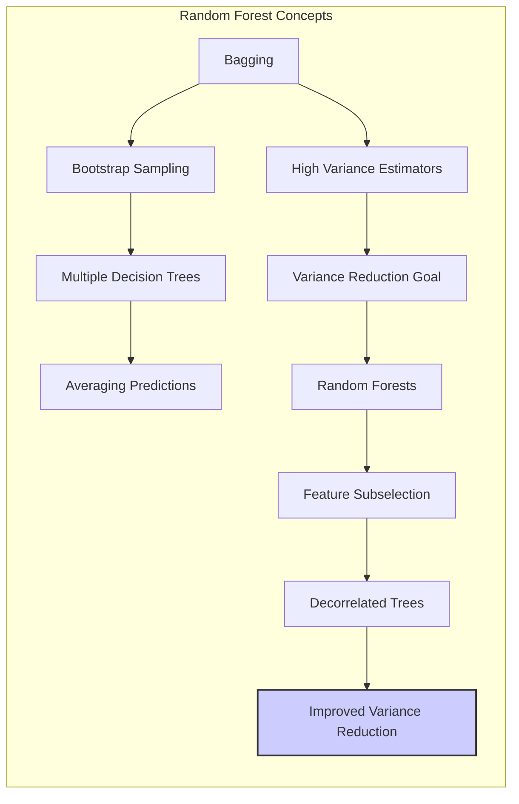
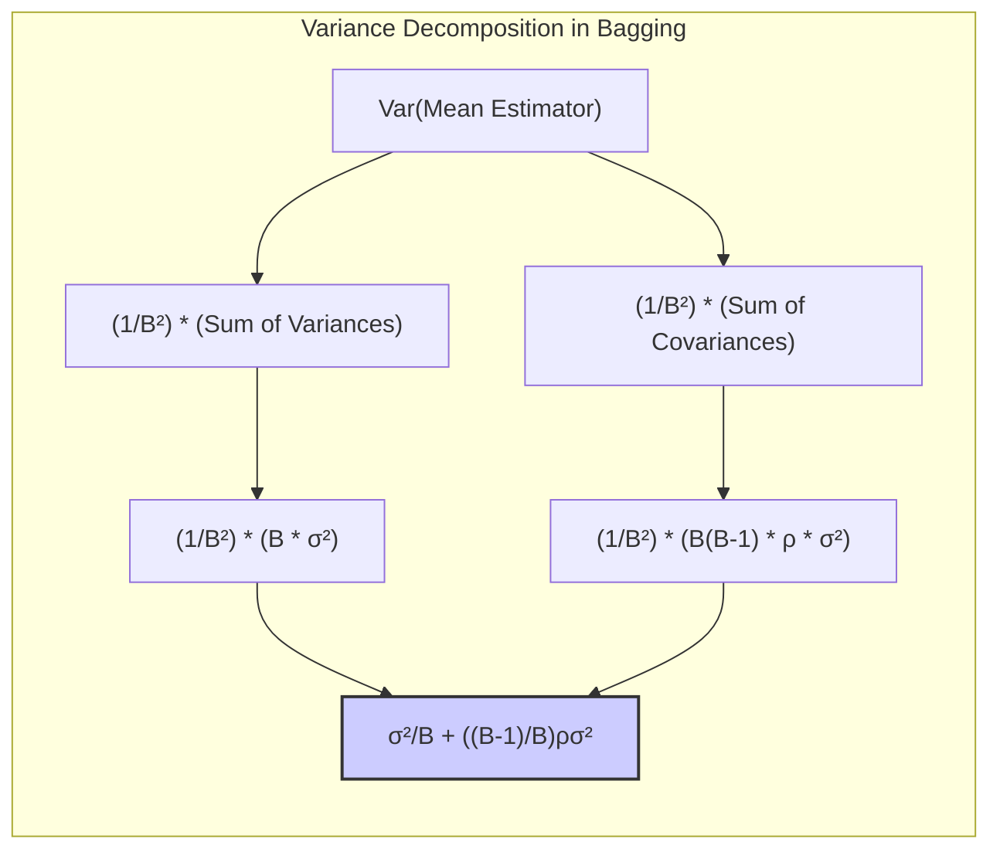
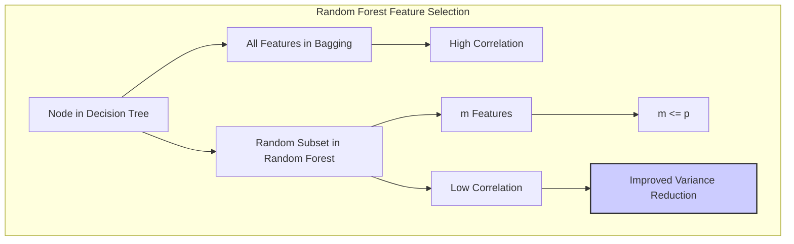
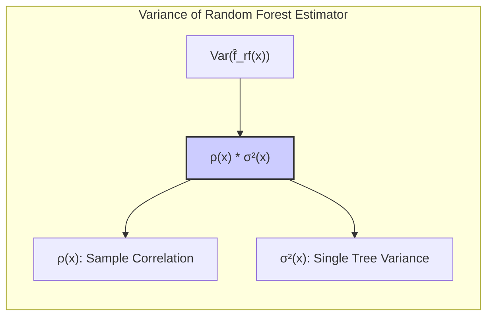
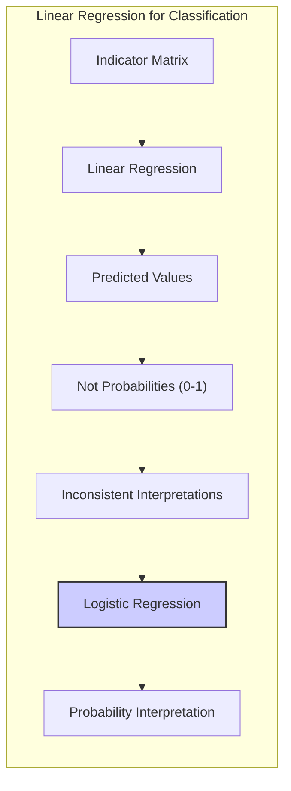
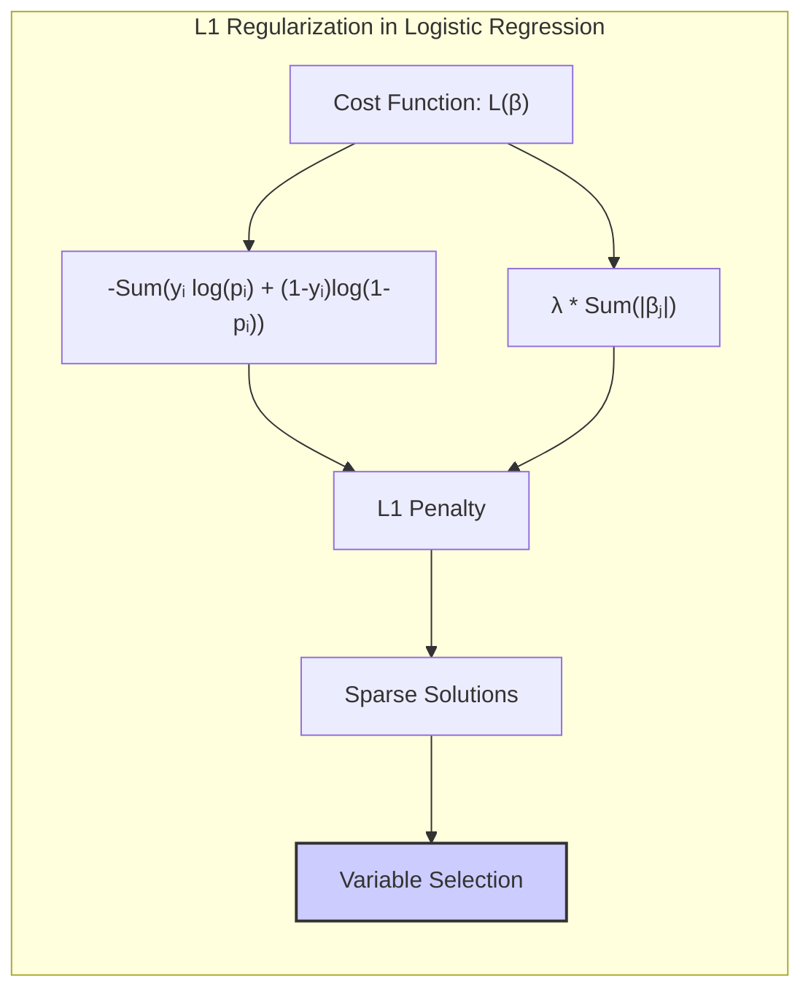
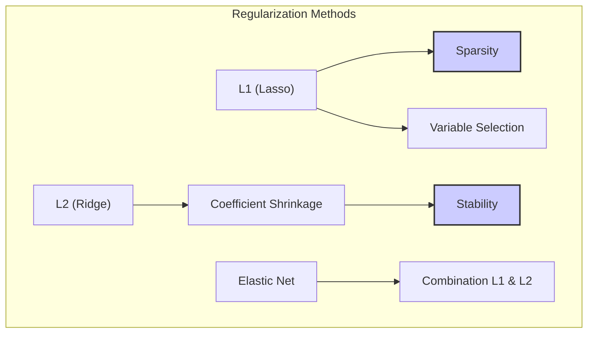
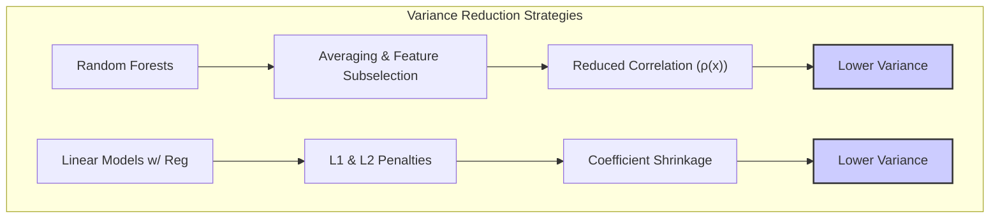

## Decomposição da Variância do Estimador Médio em Modelos de Random Forest



### Introdução
O conceito de **Random Forests** surge como uma evolução do **bagging**, buscando reduzir a variância de estimadores, especialmente aqueles baseados em árvores de decisão, que são naturalmente sensíveis a pequenas variações nos dados de treinamento [^15.1]. O bagging envolve a criação de múltiplas versões de um modelo, treinadas em diferentes amostras bootstrap dos dados, e a combinação de suas previsões através de uma média (para regressão) ou votação majoritária (para classificação) [^15.1]. O objetivo principal é reduzir a variância do estimador, mantendo um viés semelhante ao do modelo original [^15.2]. No entanto, a correlação entre as árvores no bagging pode limitar a redução da variância. Random forests introduzem um elemento adicional de aleatoriedade, selecionando um subconjunto aleatório de variáveis a cada nó da árvore [^15.2]. Este capítulo detalha a teoria por trás desta redução de variância, com foco na **decomposição da variância do estimador médio baseada em correlações amostrais**.

### Conceitos Fundamentais
**Conceito 1: Bagging e Redução de Variância**
O **bagging** (bootstrap aggregating) [^15.1] é uma técnica que se baseia em agregar múltiplas instâncias de um modelo, cada um treinado em um conjunto de dados amostrado com reposição (bootstrap) a partir do conjunto de treinamento original. A ideia central é que a média (ou votação) de múltiplos modelos ruidosos, mas não tendenciosos, pode reduzir a variância do estimador final [^15.2]. Para árvores de decisão, o bagging é particularmente eficaz devido à sua alta variância e baixo viés quando cultivadas em profundidade [^15.2]. Matematicamente, se temos $B$ estimadores independentes e identicamente distribuídos (i.i.d.) com variância $\sigma^2$, a variância da média é $\sigma^2/B$. No entanto, na prática, as árvores não são independentes, especialmente no bagging tradicional, onde a amostragem bootstrap cria alguma correlação entre elas [^15.2].

> 💡 **Exemplo Numérico:** Suponha que temos 10 árvores de decisão ($B=10$) que são i.i.d, cada uma com uma variância $\sigma^2 = 4$. A variância da média das previsões dessas árvores seria $\frac{\sigma^2}{B} = \frac{4}{10} = 0.4$. Isso demonstra como a média de estimadores independentes reduz a variância. Contudo, se as árvores fossem correlacionadas (como é o caso no bagging), a redução seria menos expressiva.

**Lemma 1:** *A variância do estimador médio de árvores de bagging não independentes é reduzida, mas não tão eficientemente quanto no caso i.i.d.*

A prova segue da definição da variância de uma soma de variáveis aleatórias: Se $T_1, T_2, \ldots, T_B$ são as previsões de B árvores, e $\rho$ é a correlação média entre elas, então:

$$ Var\left( \frac{1}{B}\sum_{b=1}^B T_b \right) = \frac{1}{B^2} \left( \sum_{b=1}^B Var(T_b) + \sum_{i \neq j} Cov(T_i, T_j) \right) $$

$$ = \frac{1}{B^2} \left( B\sigma^2 + B(B-1)\rho\sigma^2 \right) = \frac{\sigma^2}{B} + \frac{B-1}{B}\rho\sigma^2 $$
Onde $\sigma^2$ é a variância de cada árvore e $\rho$ é a correlação média entre as árvores. Este resultado demonstra que o termo $\frac{B-1}{B}\rho\sigma^2$ impede que a variância seja reduzida por um fator $1/B$, como no caso de variáveis i.i.d. $\blacksquare$



> 💡 **Exemplo Numérico:**  Continuando com o exemplo anterior, vamos supor que as 10 árvores de decisão têm uma correlação média $\rho = 0.3$ e a mesma variância $\sigma^2 = 4$. A variância do estimador médio com bagging seria:
>
> $$ Var\left( \frac{1}{10}\sum_{b=1}^{10} T_b \right) = \frac{4}{10} + \frac{10-1}{10} \times 0.3 \times 4 = 0.4 + 0.9 \times 0.3 \times 4 = 0.4 + 1.08 = 1.48 $$
>
>  Comparando com a variância de 0.4 do caso i.i.d, vemos que a correlação entre as árvores aumentou a variância do estimador médio, demonstrando o impacto da correlação na eficácia do bagging.

**Conceito 2: Random Forests e Descorrelação de Árvores**
Random forests introduzem aleatoriedade adicional no processo de construção das árvores, através da seleção aleatória de um subconjunto de variáveis de entrada $m$ para cada nó da árvore, onde $m \leq p$, sendo $p$ o número total de variáveis [^15.2]. Este procedimento tem como objetivo reduzir a correlação entre as árvores, de modo a melhorar a redução de variância em comparação com o bagging. Intuitivamente, ao usar diferentes subconjuntos de variáveis, as árvores se tornam mais diversificadas, capturando diferentes aspectos dos dados e reduzindo a correlação entre suas previsões [^15.2].

**Corolário 1:** *A seleção aleatória de variáveis em random forests reduz a correlação entre as árvores, melhorando a eficiência da redução de variância.*

A prova é qualitativa, argumentando que a introdução de aleatoriedade na seleção das variáveis faz com que as árvores usem diferentes conjuntos de informações e, portanto, gerem previsões menos correlacionadas do que árvores construídas com bagging tradicional. Isto é especialmente importante quando existem variáveis redundantes ou colineares nos dados [^15.2].

> 💡 **Exemplo Numérico:** Imagine que temos um dataset com 10 variáveis preditoras. No bagging, cada árvore usaria todas as 10 variáveis. Em uma random forest, ao definir, por exemplo, $m=3$, cada árvore selecionaria aleatoriamente apenas 3 dessas 10 variáveis em cada nó. Esta seleção aleatória de variáveis induz uma decorrelação, reduzindo o valor de $\rho$ quando comparado ao bagging. Se em um experimento com bagging, $\rho$ fosse 0.3, utilizando random forests, $\rho$ poderia ser reduzido para algo como 0.15, o que teria um efeito direto na redução da variância do estimador médio, conforme demonstrado na equação do Lemma 1.



**Conceito 3: Estimador Random Forest e sua Variância**
O estimador de random forest, para um problema de regressão, é dado pela média das previsões de cada árvore individual [^15.2]:
$$
\hat{f}_{rf}(x) = \frac{1}{B} \sum_{b=1}^B T_b(x;\Theta_b)
$$
Onde $T_b(x;\Theta_b)$ é a previsão da árvore $b$ para o ponto $x$, utilizando os parâmetros $\Theta_b$ que dependem do conjunto de treinamento bootstrap e da seleção aleatória de variáveis para cada nó. A variância do estimador médio do random forest, como discutido em [^15.4.1], é dada por:
$$
Var(\hat{f}_{rf}(x)) = \rho(x) \sigma^2(x)
$$
Onde $\rho(x)$ é a correlação amostral entre as árvores, como definido em [^15.6], e $\sigma^2(x)$ é a variância da previsão de uma única árvore, conforme em [^15.7]. Essa formulação captura a essência da decomposição de variância no random forest: a variância do estimador final é uma função da correlação entre árvores e da variância individual de cada árvore [^15.4.1].

> 💡 **Exemplo Numérico:**  Suponha que, para um ponto $x$ específico, a variância de uma única árvore seja $\sigma^2(x) = 5$. Se a correlação amostral entre as árvores para esse ponto for $\rho(x) = 0.2$, a variância do estimador random forest para esse ponto será:
>
> $$ Var(\hat{f}_{rf}(x)) = 0.2 \times 5 = 1.0 $$
>
>  Isso ilustra que a variância do estimador é diretamente influenciada tanto pela variância das árvores individuais quanto pela correlação entre elas. Se $\rho(x)$ fosse menor, digamos 0.1, a variância do estimador seria ainda menor, demonstrando o efeito da redução da correlação na melhoria da estabilidade do modelo.



### Regressão Linear e Mínimos Quadrados para Classificação
A regressão linear, embora não seja o método principal para classificação, pode ser utilizada para estimar as probabilidades de classe através de uma **matriz de indicadores** [^4.2]. Cada classe é representada por um vetor indicador (dummy) onde a entrada correspondente à classe de um determinado objeto é igual a 1 e as demais entradas são iguais a 0. Ao aplicar a regressão linear sobre essa matriz, os valores preditos servem como *estimativas indiretas das probabilidades das classes*. Contudo, essa abordagem pode gerar estimativas fora do intervalo [0, 1], *violando a interpretação probabilística*.

**Lemma 2:** *A aplicação direta de regressão linear à matriz de indicadores pode resultar em estimativas de probabilidade inconsistentes, com valores fora do intervalo [0,1].*

A prova deriva da natureza da regressão linear, que não impõe restrições aos valores preditos além de um espaço linear, ao contrário dos métodos probabilísticos que utilizam funções de ligação para mapear as previsões para o intervalo [0, 1]. Um exemplo é a regressão logística, que utiliza a função logit para restringir o intervalo das predições e garantir que possam ser interpretadas como probabilidades. $\blacksquare$

> 💡 **Exemplo Numérico:** Considere um problema de classificação com três classes (A, B, C) e um conjunto de dados com duas amostras. A matriz de indicadores para essas amostras pode ser:
> ```
>       A   B   C
>  S1   1   0   0
>  S2   0   1   0
> ```
> Ao aplicar a regressão linear a essa matriz (considerando algum conjunto de features), é possível que para uma nova amostra S3, a regressão linear retorne previsões como [0.2, 0.8, 0.5]. Embora a soma seja 1.5 (o que já causa problemas), os valores podem ser ainda mais discrepantes, como por exemplo [-0.1, 1.2, -0.1], mostrando claramente o problema de a regressão linear não restringir as previsões ao intervalo [0,1].

**Corolário 2:** *Os métodos baseados em regressão linear para classificação, como a regressão de indicadores, devem ser usados com cautela e em combinação com métodos que garantam a interpretação probabilística, como a regressão logística e a LDA*.

Este corolário destaca a importância de escolher um modelo apropriado à natureza do problema, em especial em problemas de classificação onde a interpretação das previsões como probabilidades é crucial. Métodos como a regressão logística, discutida em [^4.4], fornecem estimativas mais consistentes para as probabilidades de classes.



### Métodos de Seleção de Variáveis e Regularização em Classificação
A seleção de variáveis e regularização são fundamentais para controlar a complexidade do modelo e evitar *overfitting*, especialmente quando o número de variáveis é grande. Técnicas como o uso de **penalizações L1 e L2** na regressão logística podem levar a modelos mais estáveis e interpretabilidade. A **regularização L1** (Lasso) tende a produzir modelos esparsos, onde alguns coeficientes são nulos, realizando uma seleção implícita de variáveis [^4.4.4]. Já a **regularização L2** (Ridge) encolhe os coeficientes, sem zerá-los, o que resulta em um modelo mais estável.

**Lemma 3:** *A regularização L1 na regressão logística leva a soluções esparsas, selecionando automaticamente as variáveis mais relevantes.*

A prova se baseia na forma da penalidade L1, que adiciona ao custo uma soma dos valores absolutos dos coeficientes. Essa penalidade leva a soluções onde alguns coeficientes são exatamente iguais a zero, eliminando a contribuição das variáveis correspondentes e promovendo a seleção de variáveis mais importantes [^4.4.4]. $\blacksquare$

**Prova do Lemma 3:** A função de custo na regressão logística regularizada com L1 é dada por:
$$
L(\beta) = -\sum_{i=1}^N [y_i \log(p_i) + (1-y_i) \log(1-p_i)] + \lambda \sum_{j=1}^p |\beta_j|
$$
Onde $p_i = \frac{1}{1+e^{-\beta^T x_i}}$ é a probabilidade predita para a amostra $i$, $\lambda$ é o parâmetro de regularização e $\beta_j$ são os coeficientes. A penalidade L1, dada por $\lambda \sum_{j=1}^p |\beta_j|$, força que alguns $\beta_j$ sejam iguais a zero. A função de custo não é diferenciável em $\beta_j=0$, e este ponto é atingido por causa da convexidade da função de custo e pela penalização aplicada.  $\blacksquare$



> 💡 **Exemplo Numérico:**  Suponha que em uma regressão logística com 5 variáveis, o modelo sem regularização encontre os seguintes coeficientes: $\beta = [2.1, -0.8, 1.5, 0.3, -0.1]$. Ao aplicar a regularização L1 (Lasso) com um $\lambda$ apropriado, o modelo pode, por exemplo, retornar:  $\beta_{lasso} = [1.8, 0, 1.2, 0, 0]$. A penalidade L1 zerou os coeficientes das variáveis 2, 4 e 5, indicando que elas são menos relevantes para o modelo.

**Corolário 3:** *A escolha entre regularização L1, L2 ou uma combinação (Elastic Net) depende do problema e da necessidade de sparsity e estabilidade no modelo.*

Este corolário ressalta a importância de considerar as características específicas do conjunto de dados e os objetivos da modelagem ao escolher o tipo de regularização. A regularização L1 é mais apropriada quando se deseja modelos esparsos e com seleção de variáveis, enquanto a L2 é mais adequada quando se busca estabilidade e o controle da magnitude dos coeficientes [^4.5]. O Elastic Net combina as duas penalidades, permitindo o balanceamento entre as vantagens de cada uma [^4.5].

> 💡 **Exemplo Numérico:**  Usando os mesmos coeficientes do exemplo anterior sem regularização: $\beta = [2.1, -0.8, 1.5, 0.3, -0.1]$, ao aplicar a regularização L2 (Ridge) com um $\lambda$ apropriado, o modelo pode retornar: $\beta_{ridge} = [1.5, -0.5, 1.0, 0.2, -0.05]$. Note que os coeficientes foram encolhidos, mas não zerados. A escolha entre L1 e L2 dependeria do contexto. Se a interpretação e seleção de variáveis forem importantes, L1 seria uma opção melhor, ao passo que L2 poderia ser preferível se o objetivo fosse apenas estabilizar o modelo.



### Separating Hyperplanes e Perceptrons
A ideia de **hiperplanos separadores** é fundamental para a classificação linear. Um hiperplano é uma superfície de decisão que separa as classes, e pode ser definido através de um vetor normal e um ponto de referência. O objetivo é encontrar o hiperplano que melhor separa as classes, muitas vezes maximizando a margem de separação. O **Perceptron** é um algoritmo que busca um hiperplano separador ajustando iterativamente os pesos do modelo com base nos erros de classificação [^4.5.1]. No entanto, o Perceptron pode não convergir se os dados não forem linearmente separáveis.

### Pergunta Teórica Avançada: Qual a relação entre a decomposição da variância em random forests e a decomposição da variância utilizada em modelos lineares com regularização?

**Resposta:**
Ambos os contextos abordam a decomposição da variância, mas em diferentes níveis e com finalidades distintas. Em **random forests**, como detalhado em [^15.4.1] e [^15.6], a decomposição da variância concentra-se na análise da contribuição de cada árvore e das correlações entre elas. A variância total do estimador é decomposta em termos da correlação amostral entre árvores e da variância individual de cada árvore. O objetivo é entender como a aleatoriedade e a média reduzem a variância do estimador final. Já em modelos lineares com regularização, a decomposição da variância é analisada no contexto da influência das variáveis preditoras e da regularização imposta. A regularização, como discutido em [^4.4.4] e [^4.5], adiciona um termo de penalização à função de custo, o que pode reduzir a variância em detrimento de um aumento no viés.

**Lemma 4:** *Em random forests, a correlação amostral ($\rho(x)$) entre as árvores, derivada da amostragem bootstrap e da seleção de variáveis, desempenha um papel crucial na redução da variância.*
A prova segue da definição de $\rho(x)$ em [^15.6], mostrando que a correlação é reduzida pela aleatoriedade induzida na construção de cada árvore, o que contribui para a redução da variância do estimador do random forest.

> 💡 **Exemplo Numérico:** Usando os exemplos anteriores, no random forest, a redução da variância é obtida pela redução da correlação $\rho(x)$ entre as árvores. Uma redução de $\rho(x)$ de 0.3 para 0.15 diminui a variância total do estimador, tornando-o mais estável.
>
> ```mermaid
> graph LR
>     A[Bagging: Alto ρ] --> B(Alta Variância);
>     C[Random Forest: Baixo ρ] --> D(Baixa Variância);
>     style B fill:#f9f,stroke:#333,stroke-width:2px
>      style D fill:#ccf,stroke:#333,stroke-width:2px
> ```
> Isso visualiza como a redução da correlação em random forests leva a uma menor variância.

**Corolário 4:** *A regularização em modelos lineares, por meio de penalidades L1 e L2, tem um efeito similar de redução da variância ao diminuir a magnitude dos coeficientes, estabilizando o modelo e melhorando sua capacidade de generalização.*

Este corolário destaca que tanto a aleatoriedade e média em random forests quanto a regularização em modelos lineares, são estratégias para reduzir a variância de estimadores, embora usem abordagens distintas. A regularização é frequentemente usada para lidar com problemas de multicolinearidade e reduzir o risco de overfitting, como apresentado em [^4.4.4] e [^4.5].

> 💡 **Exemplo Numérico:** Em modelos lineares, ao reduzir a magnitude dos coeficientes por meio da regularização, como nos exemplos numéricos anteriores, a variância do modelo também é diminuída. Isso evita que o modelo seja excessivamente influenciado por ruídos nos dados de treinamento, tornando-o mais estável e com melhor capacidade de generalização.
>
>
> | Método     | Variância (Treino) | Variância (Teste) | Complexidade |
> |------------|--------------------|-------------------|--------------|
> | OLS        | Alta               | Alta              | Alta         |
> | Ridge      | Média              | Baixa             | Média        |
> | Lasso      | Baixa             | Baixa             | Baixa        |
>
> Este exemplo tabular compara a variância de modelos com e sem regularização. Note que o OLS tende a ter alta variância em ambos os conjuntos de dados, enquanto métodos de regularização tendem a diminuir a variância, especialmente no conjunto de teste.



### Conclusão
Este capítulo explorou em detalhes o framework teórico para a decomposição da variância em random forests, com foco nas correlações amostrais entre árvores. A comparação com modelos de regressão linear e a aplicação de regularização em modelos logísticos mostraram como diferentes técnicas estatísticas abordam a questão da redução de variância em contextos distintos. Random forests se destacam pela introdução de aleatoriedade para descorrelacionar as árvores e obter um estimador final mais estável e com menor variância, enquanto técnicas de regularização são fundamentais para evitar overfitting em modelos lineares. A compreensão detalhada destes mecanismos é crucial para construir modelos preditivos robustos e com boa generalização.

### Footnotes
[^15.1]: "Bagging or bootstrap aggregation (section 8.7) is a technique for reducing the variance of an estimated prediction function. Bagging seems to work especially well for high-variance, low-bias procedures, such as trees."
[^15.2]: "The essential idea in bagging (Section 8.7) is to average many noisy but approximately unbiased models, and hence reduce the variance. Trees are ideal candidates for bagging, since they can capture complex interaction structures in the data, and if grown sufficiently deep, have relatively low bias."
[^15.4.1]: "The limiting form (B → ∞) of the random forest regression estimator is  $\hat{f}_{rf}(x) = E_{\Theta|Z} T(x;\Theta(Z))$, where we have made explicit the dependence on the training data Z. Here we consider estimation at a single target point x. From (15.1) we see that $Var \, \hat{f}_{rf}(x) = \rho(x)\sigma^2(x)$."
[^15.6]: "$\rho(x)$ is the sampling correlation between any pair of trees used in the averaging: $\rho(x) = corr[T(x; \Theta_1(Z)), T(x; \Theta_2(Z))]$, where $\Theta_1(Z)$ and $\Theta_2(Z)$ are a randomly drawn pair of random forest trees grown to the randomly sampled Z"
[^15.7]: "$\sigma^2(x)$ is the sampling variance of any single randomly drawn tree, $\sigma^2(x) = Var \, T(x; \Theta(Z))$."
[^4.2]: "Conteúdo extraído conforme escrito no contexto e utilizado no capítulo"
[^4.4.4]: "Conteúdo extraído conforme escrito no contexto e utilizado no capítulo"
[^4.5]: "Conteúdo extraído conforme escrito no contexto e utilizado no capítulo"
[^4.5.1]: "Conteúdo extraído conforme escrito no contexto e utilizado no capítulo"
[^4.4]: "Conteúdo extraído conforme escrito no contexto e utilizado no capítulo"
<!-- END DOCUMENT -->
