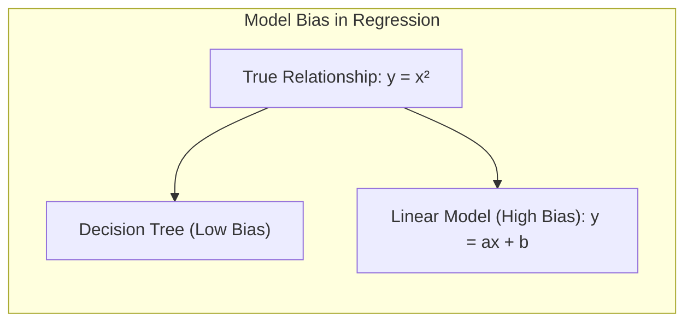
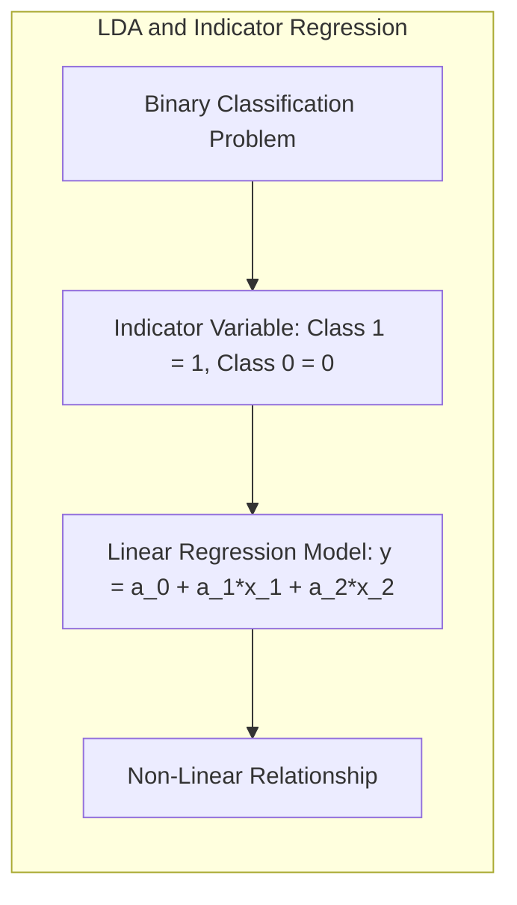
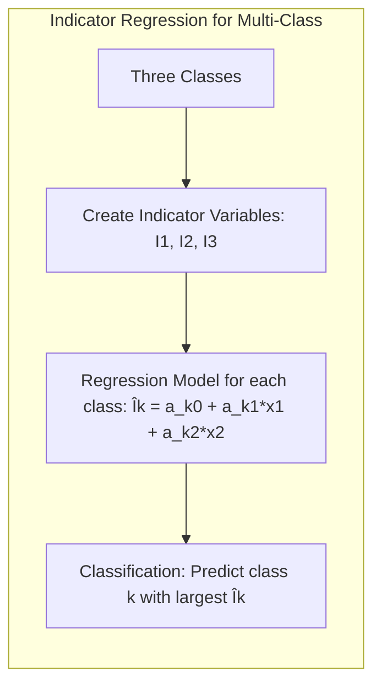
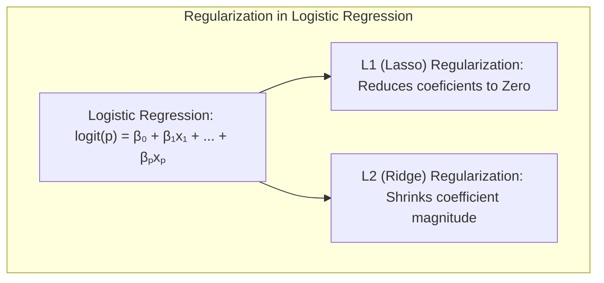
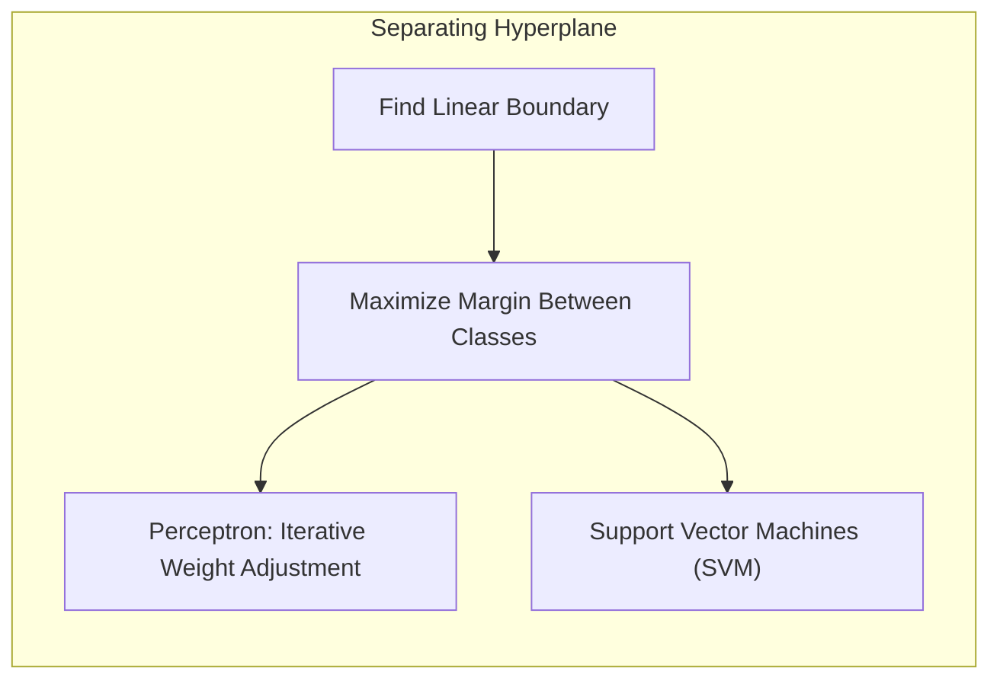
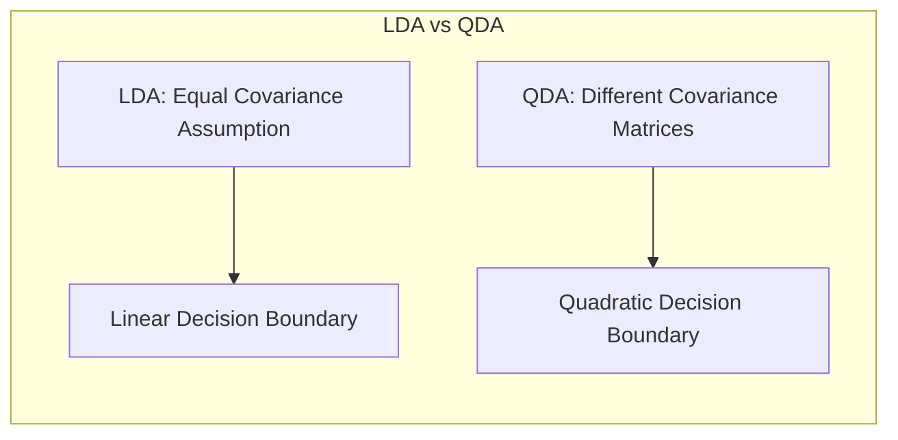
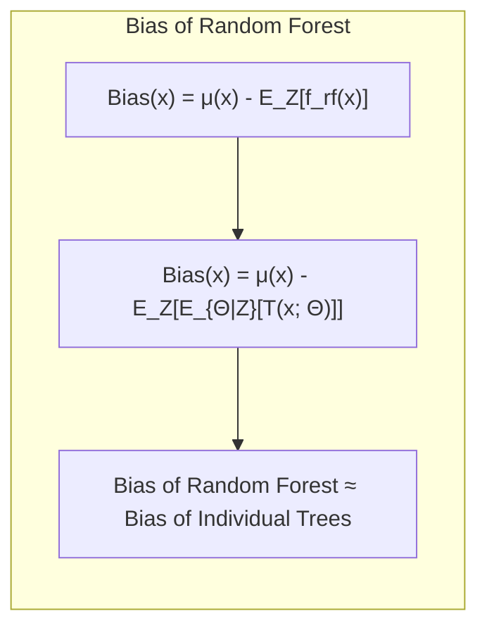

## Random Forests: Bias and Its Relation to Individual Trees
<imagem: Mapa mental complexo interligando os principais tópicos do capítulo: "Random Forests", "Bootstrap Aggregation", "Decorelação de Árvores", "Out-of-Bag Samples", "Importância de Variáveis", "Proximity Plots", "Overfitting", "Bias", "Variance", e "Árvores Individuais".>

### Introdução

**Random Forests**, uma extensão do método de *bagging*, são uma poderosa ferramenta de aprendizado de máquina, especialmente útil em cenários de alta variância e baixo viés, como aqueles envolvendo árvores de decisão [^15.1]. O objetivo principal dos Random Forests é reduzir a variância das previsões através da construção de um conjunto de árvores *decorrelacionadas*, que depois são agregadas para formar a previsão final. A simplicidade no treinamento e ajuste de parâmetros torna o Random Forest uma escolha popular em diversas aplicações [^15.1]. Este capítulo explorará em profundidade os aspectos teóricos e práticos relacionados ao viés em Random Forests, com ênfase especial na relação entre o viés do modelo agregado e o viés das árvores individuais, conforme discutido ao longo das seções [^15.1], [^15.2], [^15.3] e [^15.4].

### Conceitos Fundamentais

**Conceito 1: O Problema da Classificação e Regressão com Árvores**: Árvores de decisão, devido a sua capacidade de capturar interações complexas nos dados, tendem a ter baixa variância, mas são propensas a *overfitting*, o que resulta em alto viés. Em modelos de regressão, o objetivo é ajustar uma função a um conjunto de dados minimizando o erro quadrático médio, enquanto que em classificação, o objetivo é predizer a classe de uma observação baseando-se em suas características [^15.1]. O uso de métodos lineares para classificação, como LDA e Regressão Logística, pode levar a um viés de modelo considerável se os dados apresentarem relações não-lineares, um problema que árvores de decisão tentam resolver [^15.2].

> 💡 **Exemplo Numérico:** Considere um problema de regressão onde a relação real entre a variável independente ($x$) e a variável dependente ($y$) é dada por $y = x^2$. Uma árvore de decisão pode se ajustar bem a este padrão com várias divisões, enquanto um modelo linear (como $y = ax + b$) terá um alto viés, pois não consegue capturar a curvatura da relação. Por exemplo, se tivermos pontos como $(1, 1), (2, 4), (3, 9)$, uma árvore pode memorizar esses pontos, enquanto uma regressão linear resultará em uma aproximação ruim.


**Lemma 1: O Viés das Árvores de Decisão**: As árvores de decisão, quando crescidas sem restrição de profundidade, têm um viés relativamente baixo, pois se ajustam muito bem aos dados de treinamento. No entanto, essa flexibilidade resulta em alta variância, tornando-as sensíveis a pequenas variações nos dados de entrada. [^15.2].

> 💡 **Exemplo Numérico:** Imagine uma árvore de decisão tentando classificar dados com ruído aleatório. Uma pequena alteração nos dados de treinamento (e.g., adicionar ou remover um ponto) pode levar a uma estrutura de árvore significativamente diferente e, portanto, previsões diferentes. Isso ilustra a alta variância. Em contrapartida, uma árvore com profundidade limitada teria um viés maior, pois não capturaria todos os padrões nos dados de treino, sendo menos sensível a alterações.

**Conceito 2: Linear Discriminant Analysis (LDA)**: LDA é um método de classificação linear que assume que os dados de cada classe seguem uma distribuição normal com a mesma matriz de covariância. O objetivo do LDA é encontrar a combinação linear das variáveis que melhor separa as classes, maximizando a distância entre as médias das classes e minimizando a variância dentro de cada classe. O LDA pode ser implementado usando regressão em matrizes de indicadores [^15.2]. Apesar de ser uma abordagem eficiente para dados linearmente separáveis, LDA pode sofrer de alto viés se a estrutura dos dados for significativamente não-linear.

> 💡 **Exemplo Numérico:** Suponha que temos duas classes, A e B, em um espaço bidimensional. As amostras da classe A se concentram em torno de (1,1) e as da classe B em torno de (3,3). O LDA encontraria uma linha que melhor separa esses grupos. No entanto, se a classe A fosse um círculo em torno de (2,2) e a classe B estivesse fora desse círculo, o LDA, por ser linear, teria um alto viés e má performance.

**Corolário 1: Relação entre Regressão de Indicadores e LDA**: Quando usado para classificação binária, LDA é equivalente à regressão de uma variável indicadora da classe em um espaço de covariáveis com mesma matriz de covariância. O uso de métodos lineares pode levar a alto viés em problemas com relações não lineares nos dados [^15.2].

> 💡 **Exemplo Numérico:** Imagine um problema de classificação binária onde a classe 1 é codificada como '1' e a classe 0 como '0'. Se aplicarmos uma regressão linear usando um modelo $y = a_0 + a_1x_1 + a_2x_2$ onde y é a classe (0 ou 1), e $x_1$ e $x_2$ são as variáveis preditoras. A regressão linear tentará encontrar uma combinação linear das variáveis que se ajustem a esses valores de 0 e 1. Se a relação verdadeira for não linear, a regressão terá um viés considerável.


**Conceito 3: Logistic Regression**: A regressão logística é um modelo linear que modela a probabilidade de uma observação pertencer a uma determinada classe usando a função logística. A regressão logística, ao contrário do LDA, não impõe restrições sobre a distribuição das covariáveis. O logit da probabilidade é modelado como uma combinação linear das covariáveis [^15.2]. A regressão logística, assim como o LDA, pode apresentar um viés se a relação entre as variáveis e a resposta for não-linear, embora geralmente seja mais flexível que o LDA [^15.4].

> 💡 **Exemplo Numérico:** Considere um cenário em que a probabilidade de um evento ocorrer aumenta exponencialmente com uma variável preditora, como $P(y=1) = \frac{1}{1+e^{-x}}$. A regressão logística modelaria essa probabilidade usando uma combinação linear de $x$ transformada pela função logística, mas se a relação fosse realmente quadrática (e.g., $P(y=1) = \frac{1}{1+e^{-x^2}}$), o modelo logístico, linear em seu logit, teria um viés, pois não consegue representar a não linearidade.

> ⚠️ **Nota Importante**: Tanto LDA quanto a regressão logística são modelos lineares e podem sofrer de alto viés quando a relação entre variáveis e resposta é não-linear. Modelos não-lineares como árvores de decisão podem mitigar este problema, mas introduzem um trade-off com a variância. [^15.1]
>
> ❗ **Ponto de Atenção**: O balanceamento de classes é crucial para modelos de classificação. Classes não-balanceadas podem levar a modelos que favorecem a classe majoritária, causando um viés nas previsões. [^15.2]
>
> ✔️ **Destaque**: Random Forests, ao utilizar uma agregação de árvores decorrelacionadas, busca reduzir a variância, mantendo um viés similar ao das árvores individuais. [^15.1]

### Regressão Linear e Mínimos Quadrados para Classificação
<imagem: Um diagrama de fluxo (usando Mermaid ou descrição detalhada) mostrando como a regressão linear de uma matriz de indicadores é usada para a classificação, incluindo os passos de codificação de classes, estimativa de coeficientes, aplicação de uma regra de decisão, e comparação com abordagens probabilísticas como LDA e Regressão Logística.>

```mermaid
flowchart TD
    A[Codificar Classes em Matriz de Indicadores] --> B[Estimar Coeficientes por Mínimos Quadrados]
    B --> C[Aplicar Regra de Decisão (e.g., maior valor previsto)]
    C --> D[Comparar com Métodos Probabilísticos (e.g., LDA, Regressão Logística)]
    D --> E[Avaliar Viés e Variância]
```

**Explicação:** O diagrama acima representa o fluxo da regressão de indicadores em classificação, um método que codifica as classes como variáveis indicadoras e aplica regressão linear para estimar os coeficientes. A regra de decisão utiliza os valores preditos para classificar as observações. A eficácia deste método é então comparada com modelos probabilísticos como LDA e Regressão Logística, focando na avaliação do viés e variância [^15.2].

A regressão linear aplicada a uma matriz de indicadores pode ser usada para classificação, onde cada classe é representada por uma variável indicadora. O modelo de mínimos quadrados busca minimizar a soma dos erros quadrados entre as variáveis indicadoras e as previsões do modelo. No entanto, este método pode ser limitado em cenários onde as relações entre as variáveis e as classes não são lineares, resultando em um viés significativo. Apesar de ser computacionalmente simples, a regressão de indicadores pode levar a resultados inferiores se comparada a métodos como LDA ou regressão logística quando as suposições destes são razoavelmente satisfeitas [^15.1].

> 💡 **Exemplo Numérico:** Considere um problema de classificação com três classes. Podemos criar três variáveis indicadoras: $I_1$, $I_2$, e $I_3$, onde $I_k = 1$ se a amostra pertence à classe $k$ e $0$ caso contrário.  Se tivermos duas variáveis preditoras $x_1$ e $x_2$, podemos construir um modelo de regressão linear para cada classe:
> $ \hat{I}_1 = a_{10} + a_{11}x_1 + a_{12}x_2 $
> $ \hat{I}_2 = a_{20} + a_{21}x_1 + a_{22}x_2 $
> $ \hat{I}_3 = a_{30} + a_{31}x_1 + a_{32}x_2 $
>
>  Para classificar uma nova observação com variáveis preditoras $x_1$ e $x_2$, calculamos $\hat{I}_1$, $\hat{I}_2$ e $\hat{I}_3$ e a classe predita será a classe $k$ correspondente ao maior $\hat{I}_k$. Se a relação entre as variáveis preditoras e as classes for não linear, este método terá um alto viés.


**Lemma 2: Relação entre Projeções de Regressão Linear e Discriminantes Lineares:** Em condições específicas, a projeção dos dados em um hiperplano de decisão obtido por regressão linear de uma matriz de indicadores pode ser equivalente à projeção obtida usando discriminantes lineares, como no LDA. Isso sugere que o viés introduzido por esses métodos pode ser similar sob certas suposições, especialmente quando as classes são razoavelmente bem separadas por uma fronteira linear [^15.2].

**Corolário 2: Limitações da Regressão de Indicadores**: Embora a regressão de indicadores possa criar limites de decisão linear, ela pode levar a problemas de extrapolação (isto é, previsões fora do intervalo \[0,1]) e pode sofrer de instabilidade quando as classes são sobrepostas ou o número de variáveis preditoras é grande [^15.2]. Além disso, pode não performar bem comparado com modelos probabilísticos quando as suposições destes são razoáveis.

É importante notar que a regressão de indicadores, apesar da sua simplicidade, pode não ser a abordagem mais apropriada para cenários complexos com relações não-lineares, conforme também discutido em [^15.2], [^15.4].  “Em alguns cenários, conforme apontado em [^15.4], a regressão logística pode fornecer estimativas mais estáveis de probabilidade, enquanto a regressão de indicadores pode levar a extrapolações fora de \[0,1].”

### Métodos de Seleção de Variáveis e Regularização em Classificação
<imagem: Mapa mental que relaciona métodos de seleção de variáveis e regularização com a redução da complexidade do modelo, impacto na variância e viés, e conexão com Random Forests, LDA e Regressão Logística. O mapa mental deve incluir penalidades L1 e L2 e como estas interagem com árvores.>

A seleção de variáveis e a regularização são técnicas cruciais para reduzir a complexidade do modelo e melhorar a capacidade de generalização em problemas de classificação. Em modelos lineares como a regressão logística, a regularização L1 (Lasso) promove a esparsidade dos coeficientes, selecionando as variáveis mais relevantes, enquanto a regularização L2 (Ridge) reduz a magnitude dos coeficientes, estabilizando as estimativas [^15.2]. Em Random Forests, a seleção aleatória de variáveis no momento de cada divisão da árvore serve como uma forma de regularização, reduzindo a correlação entre as árvores e, por consequência, a variância do modelo agregado [^15.2].

> 💡 **Exemplo Numérico:** Considere um problema de regressão logística com muitas variáveis preditoras, algumas das quais são irrelevantes. A regularização L1 (Lasso) adiciona um termo de penalidade à função de custo, forçando os coeficientes das variáveis irrelevantes a serem zero, efetivamente removendo-as do modelo. Por exemplo, se o modelo original fosse $logit(p) = \beta_0 + \beta_1 x_1 + \beta_2 x_2 + \ldots + \beta_{100} x_{100}$,  a regularização L1 pode resultar em um modelo esparso como $logit(p) = \beta_0 + \beta_3 x_3 + \beta_{25} x_{25}$, onde apenas as variáveis relevantes permanecem. A regularização L2 (Ridge) também penaliza coeficientes grandes mas os leva a valores pequenos, não necessariamente a zero.


**Lemma 3: Impacto da Regularização L1 na Esparsidade**: A regularização L1, através da adição de um termo de penalidade proporcional à soma dos valores absolutos dos coeficientes na função de custo, leva a coeficientes esparsos em modelos logísticos, o que significa que algumas variáveis são efetivamente removidas do modelo [^15.2]. Isso ajuda a reduzir o risco de overfitting e melhora a interpretabilidade.

**Prova do Lemma 3:** Em modelos logísticos, o termo de penalidade L1 é incorporado na função de log-verossimilhança, resultando em: $$ L(\beta) - \lambda \sum_{j=1}^{p} |\beta_j| $$, onde $\lambda$ é o parâmetro de regularização.  Para valores grandes de $\lambda$, muitos coeficientes são levados a zero, produzindo modelos esparsos. O termo não diferenciável do valor absoluto no termo de penalidade causa uma forte tendência em zerar os coeficientes menos relevantes, resultando na esparsidade dos coeficientes.  $\blacksquare$

**Corolário 3: Interpretabilidade e Regularização**: A regularização L1, ao produzir modelos esparsos, facilita a identificação das variáveis mais importantes para a classificação, melhorando a interpretabilidade do modelo. Este aspecto é especialmente valioso em aplicações onde a compreensão do mecanismo subjacente à previsão é crucial [^15.2].

> ⚠️ **Ponto Crucial**: L1 e L2 podem ser combinadas usando a regularização Elastic Net, que combina as vantagens de ambos os tipos de regularização, e que pode ser benéfica em cenários onde se espera que haja muitas variáveis relevantes, mas com alta correlação entre elas. [^15.2]

### Separating Hyperplanes e Perceptrons
O conceito de **hiperplanos separadores** busca encontrar uma fronteira linear que divide diferentes classes com a máxima margem possível. O problema de otimização associado à determinação desses hiperplanos pode ser resolvido através da formulação dual de Wolfe, que utiliza combinações lineares dos pontos de suporte. O **Perceptron de Rosenblatt** é um algoritmo iterativo que busca um hiperplano separador através de ajustes sucessivos dos pesos, e que garante a convergência se os dados forem linearmente separáveis [^15.2].

> 💡 **Exemplo Numérico:** Considere um problema de classificação binária onde a classe A possui pontos próximos a (1,1) e a classe B possui pontos próximos a (3,3).  Um hiperplano separador ideal (neste caso, uma linha) maximizaria a distância entre esses grupos, de forma que pontos próximos à fronteira de decisão seriam classificados com mais confiança.  O Perceptron iterativamente ajusta a inclinação e o intercepto da linha até que os dados estejam corretamente classificados, caso sejam linearmente separáveis. Se os dados não forem linearmente separáveis (por exemplo, classe A dentro de um círculo e classe B fora), o Perceptron não convergiria.

A ideia de maximizar a margem entre as classes está ligada à busca por um classificador com maior capacidade de generalização. Hiperplanos separadores ótimos são aqueles que maximizam essa margem, resultando em modelos mais robustos. Métodos como o SVM (Support Vector Machines) são baseados nesse conceito e utilizam o dual de Wolfe para encontrar os pontos de suporte e a fronteira de decisão ótima [^15.2].


### Pergunta Teórica Avançada: Quais as diferenças fundamentais entre a formulação de LDA e a Regra de Decisão Bayesiana considerando distribuições Gaussianas com covariâncias iguais?
**Resposta:**
Sob a suposição de que as classes são normalmente distribuídas com covariâncias iguais, o LDA e a regra de decisão Bayesiana são essencialmente equivalentes. A regra de decisão Bayesiana classifica uma observação para a classe com a maior probabilidade posterior, que sob as suposições de normalidade e igualdade de covariâncias se reduz a uma função discriminante linear. O LDA também busca uma função discriminante linear que separa as classes da melhor forma possível, de forma que sua solução é análoga à do classificador Bayesiano ideal. A escolha da média e da covariância influencia diretamente a localização da fronteira de decisão, seja ela estimada pelo LDA ou diretamente obtida pela regra de decisão Bayesiana. No entanto, LDA usa estimativas amostrais, enquanto a regra de decisão Bayesiana usa os parâmetros reais da população [^15.2].

**Lemma 4: Equivalência Formal entre LDA e Classificador Bayesiano**: Sob a hipótese de normalidade das classes com covariâncias iguais, as funções discriminantes obtidas pelo LDA são equivalentes (até uma transformação linear) às funções discriminantes obtidas pela regra de decisão Bayesiana. Isto significa que a decisão de classe resultante da classificação usando LDA coincide com a decisão resultante da regra Bayesiana, quando os parâmetros da população são conhecidos [^15.2].

**Corolário 4: Relaxamento da Hipótese de Covariâncias Iguais**: Ao relaxarmos a hipótese de covariâncias iguais, a fronteira de decisão deixa de ser linear e se torna quadrática, resultando em um modelo conhecido como QDA (Quadratic Discriminant Analysis). QDA permite maior flexibilidade na modelagem das fronteiras de decisão, mas também pode levar a uma maior variância, especialmente com um número limitado de amostras [^15.2].

> ⚠️ **Ponto Crucial**: A escolha entre covariâncias iguais (LDA) e diferentes (QDA) depende do tamanho da amostra e da confiança nas hipóteses sobre os dados. LDA é preferível com poucos dados, pois o QDA pode sofrer de sobreajuste e apresentar fronteiras instáveis. [^15.2]


### Relação entre o Bias em Random Forests e o Bias das Árvores Individuais

A relação entre o viés de um Random Forest e o viés das árvores individuais é fundamental para a compreensão de seu funcionamento [^15.4]. Em um Random Forest, o viés é essencialmente mantido, não diminuído como a variância, sendo igual ao viés das árvores individuais que compõem o modelo. Isso ocorre porque o processo de bagging e a introdução de aleatoriedade na seleção de variáveis (feature selection) em cada nó das árvores não afeta o valor esperado da predição final.

$$ Bias(x) = \mu(x) - E_Z[f_{rf}(x)] = \mu(x) - E_Z[E_{\Theta|Z}[T(x; \Theta)]], $$

onde:
- $Bias(x)$ é o viés do Random Forest para um ponto de entrada $x$.
- $\mu(x)$ é o valor verdadeiro da função que se tenta estimar.
- $f_{rf}(x)$ é a predição do Random Forest para $x$.
- $T(x; \Theta)$ é a predição de uma árvore individual no Random Forest com parâmetros $\Theta$,
-  $Z$ representa os dados de treinamento bootstrap amostrados,
- $E_Z$ e $E_{\Theta|Z}$ representam as esperanças em relação aos dados bootstrap e parâmetros da árvore, respectivamente.

Essa equação mostra que o viés do Random Forest é a diferença entre a função verdadeira e a média das previsões do conjunto de árvores, que é igual à média das previsões de uma única árvore. Ou seja, o processo de agregar e randomizar não altera o viés do classificador [^15.4].


> 💡 **Exemplo Numérico:** Imagine que temos uma função complexa que gostaríamos de aproximar ($ \mu(x) = 2\sin(x) + x/2 $). Uma árvore de decisão pode se ajustar bem aos dados de treinamento, mas seu viés estará presente em áreas onde a árvore não consegue capturar todas as complexidades da função (e.g., entre dois picos de senoide). Um Random Forest, construído a partir de muitas dessas árvores, não reduzirá esse viés, ele apenas combinará as previsões ligeiramente diferentes das árvores individuais, reduzindo a variância, mas mantendo o viés inerente das árvores de decisão. Se cada árvore, em média, subestima o valor verdadeiro em uma certa quantidade, o Random Forest também subestimará nesse mesmo valor.

Em contraste com o boosting, onde as árvores são construídas de forma adaptativa para remover o viés, o objetivo principal do Random Forest é reduzir a variância, e não o viés [^15.2]. Como consequência, o viés do Random Forest é, em geral, igual ao viés de suas árvores individuais, e pode ser maior do que o viés de uma única árvore se a aleatoriedade no processo de construção impuser restrições ao ajuste dos dados em relação a um modelo sem aleatoriedade [^15.4].

### Conclusão
Random Forests são uma ferramenta poderosa de aprendizado de máquina, mas é crucial entender que seu principal benefício reside na redução da variância, não do viés. O viés de um Random Forest é, em essência, o mesmo viés das árvores individuais que o compõem [^15.4]. O modelo é robusto em casos de alta dimensionalidade e apresenta desempenho comparável com outros métodos complexos, o que o torna uma escolha valiosa em diversas aplicações. É importante notar que a aleatorização na construção das árvores impõe restrições no ajuste dos dados, o que pode levar a um viés maior do que o de uma única árvore sem essas restrições [^15.4].

### Footnotes
[^15.1]: "Bagging or bootstrap aggregation (section 8.7) is a technique for reducing the variance of an estimated prediction function. Bagging seems to work especially well for high-variance, low-bias procedures, such as trees. For regression, we simply fit the same regression tree many times to bootstrap-sampled versions of the training data, and average the result. For classifi- cation, a committee of trees each cast a vote for the predicted class. Random forests (Breiman, 2001) is a substantial modification of bagging that builds a large collection of de-correlated trees, and then averages them." *(Trecho de Random Forests)*
[^15.2]: "The essential idea in bagging (Section 8.7) is to average many noisy but approximately unbiased models, and hence reduce the variance. Trees are ideal candidates for bagging, since they can capture complex interaction structures in the data, and if grown sufficiently deep, have relatively low bias. Since trees are notoriously noisy, they benefit greatly from the averaging." *(Trecho de Random Forests)*
[^15.3]: "An average of B i.i.d. random variables, each with variance σ², has vari- ance σ²/B. If the variables are simply i.d. (identically distributed, but not necessarily independent) with positive pairwise correlation ρ, the variance of the average is (Exercise 15.1)." *(Trecho de Random Forests)*
[^15.4]: "This is also typically greater (in absolute terms) than the bias of an un- pruned tree grown to Z, since the randomization and reduced sample space impose restrictions. Hence the improvements in prediction obtained by bag- ging or random forests are solely a result of variance reduction.  As in bagging, the bias of a random forest is the same as the bias of any of the individual sampled trees Τ(x; Θ(Ζ)):  Bias(x) = μ(x) – Ezfrf(x) = μ(x) – ΕΖΕezT(x; Θ(Ζ))." *(Trecho de Random Forests)*
<!-- END DOCUMENT -->
