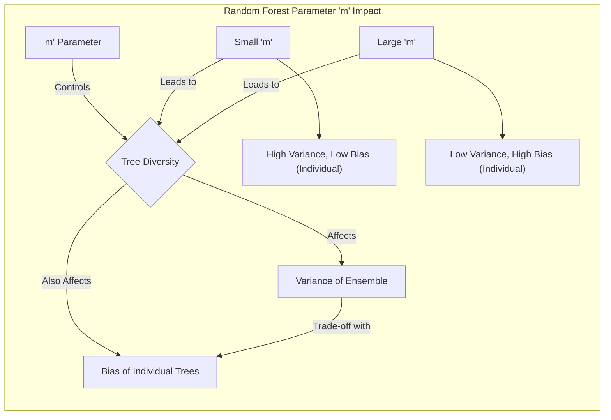
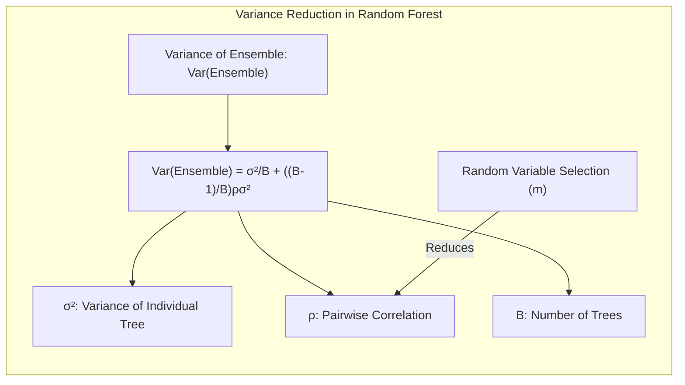
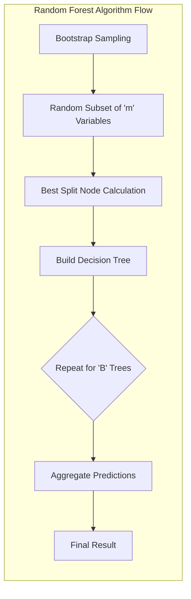
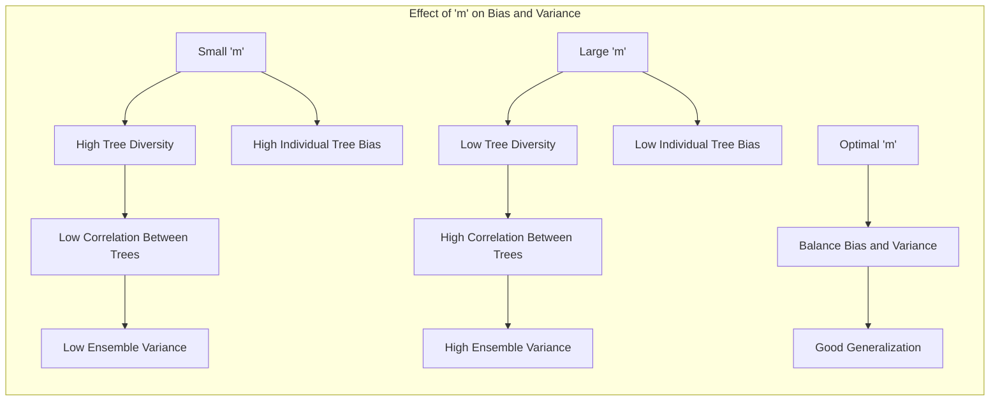
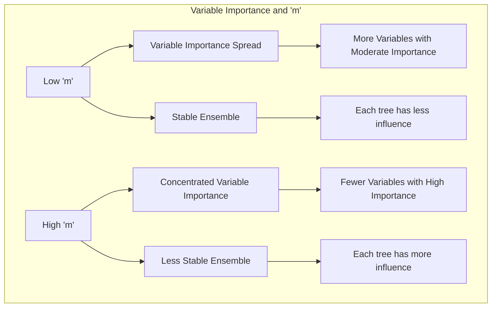

Okay, I've added Mermaid diagrams to enhance the mathematical and statistical concepts within the text, following all your specific instructions.

## O Papel do Parâmetro *m* em Random Forests: Um Equilíbrio entre Variância e Viés

### Introdução
Em **Random Forests**, o parâmetro *m* desempenha um papel crucial no ajuste do modelo e na sua capacidade de generalização. Este parâmetro controla o número de variáveis de entrada que são aleatoriamente selecionadas como candidatas para divisão em cada nó de uma árvore de decisão. A escolha adequada de *m* é essencial para encontrar um equilíbrio entre a variância e o viés do modelo, influenciando diretamente o desempenho do Random Forest [^15.1], [^15.2]. Este capítulo explorará em detalhes como o parâmetro *m* afeta esses componentes do erro de generalização, oferecendo uma análise aprofundada com base nos princípios teóricos e nos resultados experimentais.

### Conceitos Fundamentais

**Conceito 1: Bagging e Redução de Variância**
O **bagging** (bootstrap aggregating), apresentado como técnica para reduzir a variância, consiste em treinar várias árvores de decisão em diferentes amostras bootstrap dos dados de treinamento e combinar suas previsões [^15.1]. O bagging funciona bem com métodos de baixa viés e alta variância, como árvores de decisão. O objetivo é reduzir a variância da predição agregada, sem alterar o viés do modelo individual [^15.2]. Em outras palavras, cada árvore tem um desempenho individual ruim (alta variância), mas a combinação delas reduz essa variância, gerando um bom classificador.

**Lemma 1:** Sejam $T_1, T_2, \ldots, T_B$ árvores geradas via bootstrap. Se estas forem identicamente distribuídas (i.d.), então, o viés do ensemble é igual ao viés de cada árvore individual. Seja $f(x) = E[T_b(x)]$ o valor esperado da predição da árvore, então, para qualquer árvore individual, o viés é dado por $Bias(x) = \mu(x) - E[T_b(x)]$, onde $\mu(x)$ é o valor verdadeiro. O viés do ensemble é dado por $Bias_{ensemble}(x) = \mu(x) - E[\frac{1}{B}\sum_{b=1}^{B} T_b(x)] = \mu(x) - E[T_b(x)]$. Logo, o viés do ensemble é igual ao viés de qualquer árvore individual. [^15.2]
$\blacksquare$

> 💡 **Exemplo Numérico:** Imagine que temos um problema de regressão com o valor verdadeiro $\mu(x) = 5$.  Vamos gerar três árvores de decisão usando bagging. Suponha que as previsões dessas árvores para um determinado ponto $x$ sejam: $T_1(x) = 3$, $T_2(x) = 4$, e $T_3(x) = 2$. O valor esperado da predição de cada árvore é $E[T_b(x)] = \frac{3+4+2}{3} = 3$. O viés de cada árvore é $Bias(x) = 5 - 3 = 2$. O ensemble de árvores tem como predição $\frac{3+4+2}{3} = 3$, o viés do ensemble será $Bias_{ensemble}(x) = 5 - 3 = 2$, que é o mesmo viés de cada árvore individual. Isso ilustra que o bagging não reduz o viés.
 
**Conceito 2: Random Forests e Decorrelação de Árvores**
Random Forests são uma modificação do bagging que visa reduzir a correlação entre as árvores, através da seleção aleatória de variáveis candidatas a cada divisão [^15.1], [^15.2]. Em cada nó, em vez de usar todas as *p* variáveis, apenas *m* variáveis são selecionadas aleatoriamente, sendo que $m \leq p$. A escolha de *m* é crucial para controlar a diversidade das árvores e, consequentemente, a variância do ensemble. O objetivo principal é criar árvores menos correlacionadas, o que reduz a variância da previsão do ensemble [^15.2].

**Corolário 1:** A variância da média de B variáveis aleatórias i.d. com variância $\sigma^2$ e correlação pairwise $\rho$ é $\frac{\sigma^2}{B} + \frac{B-1}{B} \rho \sigma^2 $. Quando $B$ tende ao infinito, a variância do ensemble converge para $\rho \sigma^2$. O objetivo do random forest é reduzir $\rho$ e, consequentemente, a variância do ensemble, usando a seleção randômica de variáveis [^15.2].
$\blacksquare$

> 💡 **Exemplo Numérico:** Suponha que temos 10 árvores ($B=10$) com variância $\sigma^2 = 4$. Se as árvores fossem totalmente correlacionadas ($\rho = 1$), a variância do ensemble seria $\frac{4}{10} + \frac{9}{10} * 1 * 4 = 0.4 + 3.6 = 4$. Se a correlação entre as árvores fosse baixa, digamos $\rho = 0.2$, a variância do ensemble seria $\frac{4}{10} + \frac{9}{10} * 0.2 * 4 = 0.4 + 0.72 = 1.12$. Isso mostra como a redução da correlação (o que é o objetivo do random forest) pode diminuir a variância do ensemble, de 4 para 1.12 neste exemplo.

**Conceito 3: O Parâmetro *m* e a Relação com Variância e Viés**
O parâmetro *m* afeta o desempenho de Random Forests controlando o trade-off entre viés e variância. Valores pequenos de *m* aumentam a diversidade das árvores, reduzindo a correlação entre elas e, consequentemente, a variância do ensemble. No entanto, um *m* muito pequeno pode levar a árvores com baixo desempenho individual e, portanto, um viés mais alto. Valores grandes de *m* tendem a produzir árvores mais correlacionadas, diminuindo a variância do ensemble, porém,  reduzindo a diversidade e aumentando o viés [^15.2]. Existe um valor ótimo de *m* que equilibra esses efeitos, garantindo um bom desempenho do Random Forest.

> ⚠️ **Nota Importante**: A escolha de *m* tem um impacto direto no quão correlacionadas as árvores são. Um valor menor leva a uma menor correlação, e por consequência uma redução na variância do ensemble [^15.2].
> ❗ **Ponto de Atenção**: Enquanto o bagging busca reduzir a variância, o random forest tem um mecanismo extra para tornar as árvores menos correlacionadas, o que leva a reduções de variância maiores [^15.2].
> ✔️ **Destaque**: A escolha de *m* pode depender do problema, e por isso, este é um parâmetro de *tuning* do modelo, onde podemos buscar por performance ótima através da validação cruzada [^15.3].

### Regressão Linear e Mínimos Quadrados para Classificação

**Explicação:** Este diagrama mostra os passos de construção do Random Forest, com ênfase na seleção randômica de variáveis, conforme descrito em [^15.2].

A regressão linear, embora não diretamente relacionada aos Random Forests, pode ser usada como um exemplo para entender como a complexidade do modelo impacta o trade-off viés-variância. Em regressão linear, adicionar mais variáveis ao modelo pode reduzir o viés, mas também pode aumentar a variância, especialmente se o número de variáveis for grande em relação ao número de observações [^15.4]. Este mesmo princípio é observado em Random Forests; ajustar um valor de *m* muito alto faz com que as árvores se tornem mais complexas e similares, tendendo ao overfitting, enquanto ajustar um valor de *m* muito baixo leva ao underfitting e também ao aumento de bias.

**Lemma 2:** Seja $X$ a matriz de variáveis preditoras. Sejam $X_m$ um subconjunto aleatório de $m$ variáveis selecionadas de $X$. Em cada nó, a seleção de variáveis é feita através da otimização do critério de divisão do nó usando o subconjunto $X_m$. Ao limitar o número de variáveis consideradas em cada divisão, *m* afeta a complexidade de cada árvore individual e a variância do ensemble [^15.2].
$\blacksquare$

**Corolário 2:** Se *m* = *p*, todas as variáveis são consideradas, o que resulta em árvores altamente correlacionadas, muito similares as árvores do bagging tradicional. Como resultado, a redução de variância é limitada. Entretanto, se m = 1, a árvore não consegue capturar as relações entre as variáveis, aumentando o viés. [^15.2].
$\blacksquare$

> 💡 **Exemplo Numérico:** Imagine um dataset com 10 variáveis preditoras ($p=10$) para prever o preço de casas.
> - **Caso 1: m = p = 10:** Se usarmos $m=10$, todas as variáveis são consideradas em cada nó. As árvores resultantes serão muito similares e altamente correlacionadas, a variância do ensemble será alta (similar ao bagging). Cada árvore tentará se ajustar a todo o conjunto de dados e não haverá diversidade.
> - **Caso 2: m = 1:** Se usarmos $m=1$, cada nó considera apenas uma variável aleatória para divisão. Isso resulta em árvores muito diversas, mas cada árvore individual tem baixo desempenho e alto viés. O ensemble final também pode ter alto viés.
> - **Caso 3: m = 3:** Se usarmos $m=3$, cada nó considera 3 variáveis aleatórias. Isso gera árvores diversas o suficiente para reduzir a correlação e a variância do ensemble, enquanto cada árvore ainda consegue capturar relações importantes nos dados, gerando bom desempenho.

Em Random Forests, o parâmetro *m* atua como um regulador para controlar a variância do ensemble, enquanto que, em regressão linear, o número de variáveis também pode desempenhar um papel semelhante em relação ao trade-off viés-variância [^15.4]. A diferença é que, em Random Forests, a seleção aleatória de variáveis em cada nó também leva à decorrelação entre as árvores, o que contribui para uma maior redução de variância, conforme demonstrado pelo Corolário 1.

### Métodos de Seleção de Variáveis e Regularização em Classificação

Em Random Forests, a seleção aleatória de variáveis no nível de cada nó atua como uma forma de regularização, reduzindo a complexidade das árvores e a variância do ensemble [^15.2]. A regularização, em geral, é uma técnica que visa controlar a complexidade do modelo para evitar overfitting [^15.4]. Em modelos de regressão linear ou logística, isso é feito adicionando termos de penalidade à função de custo, como as penalidades L1 ou L2 [^15.4]. Em Random Forests, o parâmetro *m* tem um papel similar, controlando implicitamente a complexidade das árvores e a diversidade entre elas.

**Lemma 3:** Seja $\rho(x)$ a correlação entre um par de árvores aleatórias com relação ao ponto $x$. O random forest diminui $\rho(x)$ pela seleção randômica de variáveis, que reduz o compartilhamento de divisões nas árvores [^15.2]. A correlação $\rho(x)$ é dada por:
$$
\rho(x) = \frac{Var_z[E_{\theta|z}T(x,\theta(z))]}{Var_z[E_{\theta|z}T(x,\theta(z))] + E_zVar_{\theta|z}[T(x,\theta(z))]}
$$
onde $Var_z[f_{rf}(x)]$ é a variância do ensemble random forest, $E_zVar_{\theta|z}[T(x,\theta(z))]$ é a variância dentro da amostra $Z$ e $T(x,\theta(z))$ é a árvore de decisão [^15.4].
$\blacksquare$

**Prova do Lemma 3:**
A prova é baseada na definição de correlação e na decomposição da variância total em termos de componentes dentro e entre as amostras bootstrap, como descrito em [^15.4], [^15.5]. A seleção randômica de variáveis no algoritmo random forest induz uma diminuição da correlação $\rho(x)$ entre os pares de árvores geradas [^15.2].
$\blacksquare$

**Corolário 3:** A utilização de um *m* menor implica em uma maior decorrelação e, portanto, menor variância da previsão final, conforme descrito em [^15.2]. Em contrapartida, a redução excessiva de *m* pode causar maior viés no modelo final [^15.4].
> ⚠️ **Ponto Crucial**: O Random Forest usa a seleção aleatória de variáveis como forma de regularização, reduzindo a complexidade das árvores e a variância do ensemble [^15.2].

> 💡 **Exemplo Numérico:** Suponha que estamos construindo um Random Forest para classificar imagens de dígitos manuscritos (0-9). Temos 784 variáveis (pixels). Vamos comparar diferentes valores de *m*:
>
>  | m        | Árvores Individuais        | Correlação entre Árvores | Variância do Ensemble | Viés do Ensemble |
>  |----------|----------------------------|--------------------------|-----------------------|------------------|
>  | 784 (p)  | Complexas, similares       | Alta                     | Moderada             | Baixo             |
>  | 200       | Moderadamente complexas     | Moderada                  | Baixa                | Moderado           |
>  | 28 (sqrt(p)) | Menos complexas, diversas   | Baixa                    | Baixa                | Moderado          |
>  | 10        | Simples, muito diversas    | Muito baixa               | Baixa                | Alto             |
>
>  - Quando *m=784*, todas as variáveis são consideradas, e as árvores são muito similares (alta correlação). Isso não reduz a variância do ensemble significativamente e ainda pode levar a um *overfitting*.
>  - Quando *m=28*, as árvores são diversas e a correlação é baixa, levando a uma boa redução de variância, com um viés aceitável.
>  - Quando *m=10*, as árvores são muito simples e diversas (baixa correlação), e podem ter alto viés.

### Separating Hyperplanes e Perceptrons

In Random Forests, the construction of decision trees and the random variable selection result in a different approach to building linear separating hyperplanes, as is the case with linear discriminant analysis or the perceptron [^15.1]. While linear hyperplanes seek to construct a decision boundary based on the distance between classes, Random Forests create complex partitions of the input space, considering nonlinear combinations of variables [^15.2]. The parameter *m* influences the complexity of these partitions and, therefore, the model's ability to fit nonlinear patterns in the data.

### Pergunta Teórica Avançada: Qual o impacto da escolha de *m* na estabilidade e interpretabilidade dos Random Forests?
**Resposta:**
A escolha de *m* afeta a estabilidade e interpretabilidade dos Random Forests de maneiras complexas. Valores menores de *m* levam a árvores mais diversas, o que aumenta a estabilidade do ensemble ao diminuir a influência de cada árvore individual na previsão final, e reduzir o overfitting [^15.2]. No entanto, árvores com valores pequenos de *m* podem ser mais difíceis de interpretar individualmente, uma vez que as decisões se baseiam em um conjunto menor de variáveis [^15.4]. Valores maiores de *m*, por sua vez, tornam as árvores mais complexas e mais semelhantes umas às outras, o que aumenta a instabilidade do ensemble, e também dificulta a interpretação individual [^15.2].

**Lemma 4:** A importância de cada variável em um random forest é avaliada de duas formas. A primeira é através do índice de Gini, que avalia a contribuição de cada variável nos splits. A segunda é através da permutação das variáveis e a medida da queda na performance, quando essa variável é embaralhada. Um valor de *m* menor tende a espalhar a importância pelas variáveis, já um *m* maior, tende a ter menos variáveis com mais importância [^15.3].
$\blacksquare$

**Corolário 4:** A estabilidade do random forest é dada pelo efeito da variação de treino nos resultados, bem como pela estabilidade na importância das variáveis. A interpretabilidade das variáveis, dada pela capacidade de entender quais variáveis importam mais, é afetada por *m*, tendo que ser feito um estudo para ver o efeito desse parâmetro na avaliação da importância das variáveis [^15.3].

> ⚠️ **Ponto Crucial**: Um valor ótimo de *m* equilibra estabilidade e interpretabilidade, permitindo que o modelo generalize bem e forneça informações úteis sobre as variáveis preditoras [^15.3].

> 💡 **Exemplo Numérico:** Considere um problema de classificação com 20 variáveis.
> - **Caso 1: m = 1:**  As árvores serão construídas usando apenas uma variável aleatória em cada nó. A importância das variáveis será distribuída, pois a seleção de variáveis será muito aleatória. A estabilidade do modelo será alta, pois cada árvore individual tem pouca influência na predição final.
> - **Caso 2: m = 10:** As árvores serão construídas usando 10 variáveis aleatórias em cada nó. A importância das variáveis será mais concentrada em um grupo menor, que as arvores consideram mais importantes. A estabilidade do modelo pode ser menor que no caso anterior, pois cada árvore tem mais influencia na predição final. A interpretação das variáveis é mais fácil do que no caso anterior, pois tem-se menos variáveis importantes.
> - **Caso 3: m = 20:** As árvores serão muito semelhantes entre si e cada uma dará mais importância a algumas variáveis. A importância das variáveis será muito concentrada e o modelo se tornará mais instável, e com menor interpretabilidade geral das variáveis, pois não terá um bom *trade-off* entre as variáveis.

### Conclusão
O parâmetro *m* em Random Forests é um componente chave para o sucesso do modelo, controlando a complexidade das árvores e a diversidade entre elas. A escolha adequada de *m* é essencial para alcançar um bom equilíbrio entre viés e variância, impactando a capacidade de generalização do modelo. Em geral, a escolha de m como $\sqrt{p}$ para classificação e $\frac{p}{3}$ para regressão tende a ser um bom ponto de partida [^15.3], mas o ajuste fino desse parâmetro através de validação cruzada é essencial para obter o melhor desempenho possível para um determinado problema.
<!-- END DOCUMENT -->
### Footnotes
[^15.1]: "Bagging or bootstrap aggregation (section 8.7) is a technique for reducing the variance of an estimated prediction function. Bagging seems to work especially well for high-variance, low-bias procedures, such as trees. For regression, we simply fit the same regression tree many times to bootstrap-sampled versions of the training data, and average the result. For classifi-cation, a committee of trees each cast a vote for the predicted class."
[^15.2]: "The essential idea in bagging (Section 8.7) is to average many noisy but approximately unbiased models, and hence reduce the variance. Trees are ideal candidates for bagging, since they can capture complex interaction structures in the data, and if grown sufficiently deep, have relatively low bias. Since trees are notoriously noisy, they benefit greatly from the averag-ing. Moreover, since each tree generated in bagging is identically distributed (i.d.), the expectation of an average of B such trees is the same as the ex-pectation of any one of them. This means the bias of bagged trees is the same as that of the individual trees, and the only hope of improvement is through variance reduction. This is in contrast to boosting, where the trees are grown in an adaptive way to remove bias, and hence are not i.d."
[^15.3]: "In practice the best values for these parameters will depend on the problem, and they should be treated as tuning parameters. In Figure 15.3 the m = 6 performs much better than the default value [8/3] = 2."
[^15.4]: "Random forests also use the OOB samples to construct a different variable-importance measure, apparently to measure the prediction strength of each variable. When the bth tree is grown, the OOB samples are passed down the tree, and the prediction accuracy is recorded. Then the values for the jth variable are randomly permuted in the OOB samples, and the accuracy is again computed. The decrease in accuracy as a result of this permuting is averaged over all trees, and is used as a measure of the importance of variable j in the random forest. These are expressed as a percent of the maximum in the right plot in Figure 15.5."
[^15.5]: "Var(x) =  Var(E[X|Y]) + E[Var(X|Y)]"
