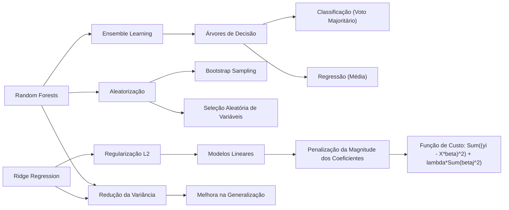
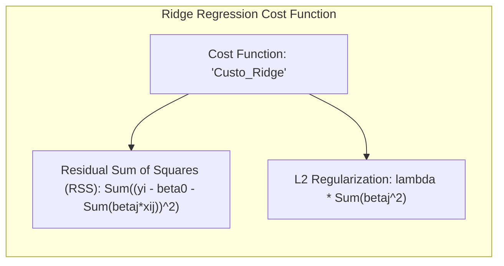
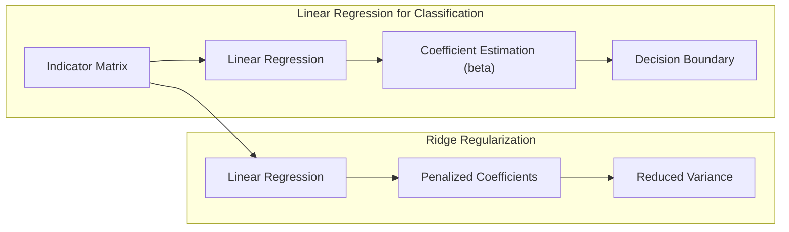
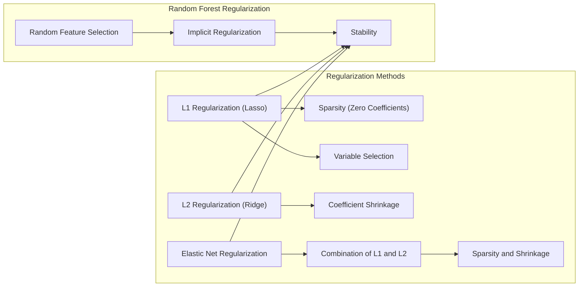
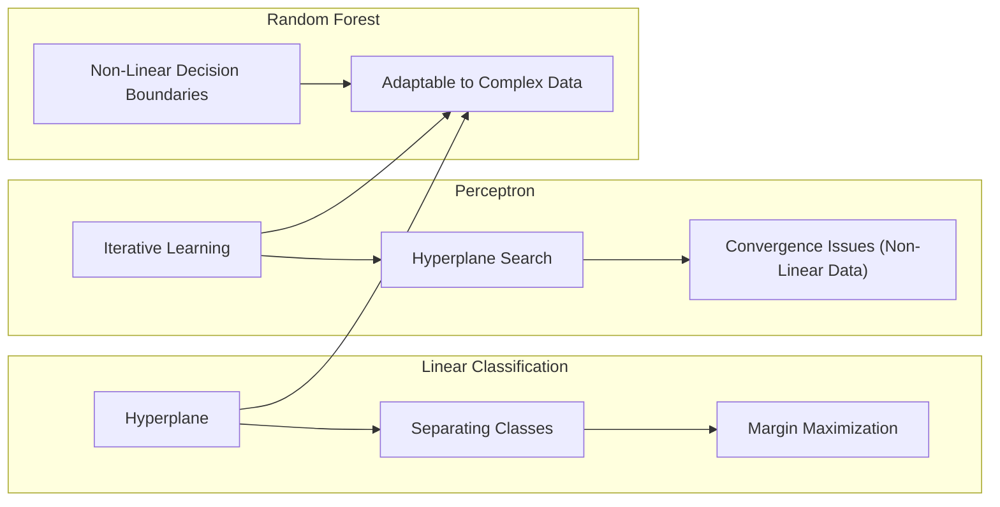
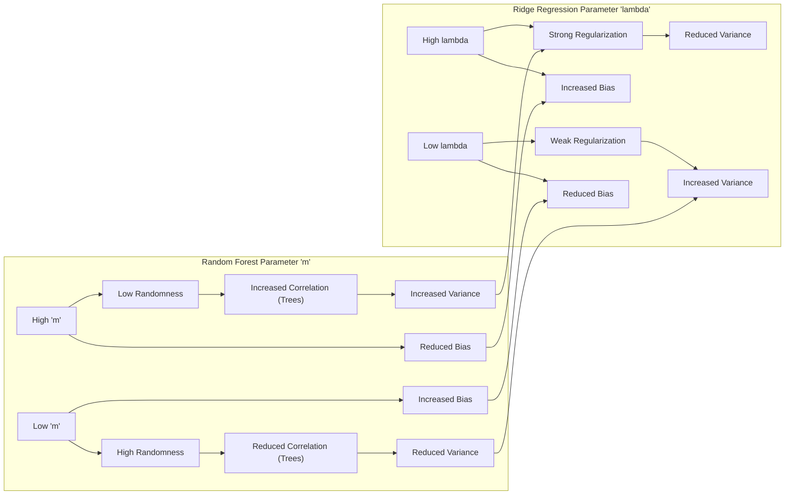

## Random Forests e Ridge Regression: Uma Análise Comparativa no Contexto de Classificação e Regressão

### Introdução
Os métodos de aprendizado estatístico, como **Random Forests** e **Ridge Regression**, são ferramentas poderosas para problemas de classificação e regressão. Embora ambos possam ser utilizados para tarefas similares, eles operam com mecanismos internos bastante distintos. O presente capítulo tem como objetivo analisar comparativamente esses métodos, especialmente no contexto em que Random Forests, através da sua aleatorização e agregação, exibem características similares a métodos de regularização, como a Ridge Regression. Utilizaremos os conceitos e resultados apresentados no contexto [^15.1], [^15.2], [^15.3], [^15.4] para aprofundar essa discussão.

### Conceitos Fundamentais
**Conceito 1:** O **Random Forest** é um método de *ensemble learning* que utiliza árvores de decisão para construir um modelo preditivo robusto [^15.1]. A aleatorização durante o processo de construção de cada árvore (através do *bootstrap sampling* e da seleção aleatória de variáveis) reduz a correlação entre as árvores, o que diminui a variância do modelo final [^15.2]. Em problemas de classificação, a predição final é obtida através do voto majoritário das árvores; para regressão, através da média das predições [^15.2].

**Lemma 1:** A expectativa de uma média de *B* árvores i.i.d. (identicamente distribuídas) é igual à expectativa de qualquer uma delas, ou seja, $E[\frac{1}{B}\sum_{b=1}^B T_b(x)] = E[T(x)]$. Isso implica que o viés das árvores agregadas é o mesmo que o de uma árvore individual [^15.2].

> 💡 **Exemplo Numérico:** Suponha que temos um conjunto de dados onde a predição de uma única árvore de decisão $T(x)$ tem um viés de 0.2 e uma variância de 0.5. Se construirmos um Random Forest com $B=100$ árvores, o viés do Random Forest será também de 0.2 (mantido pelo Lemma 1). No entanto, a variância do Random Forest será aproximadamente $\frac{0.5}{100} = 0.005$, o que demonstra a redução da variância através da agregação.

**Conceito 2:** A **Ridge Regression**, por outro lado, é um método de regularização para modelos lineares [^15.4]. A regularização L2 (ou *Ridge*) adiciona um termo de penalização à função de custo, que penaliza os coeficientes de grande magnitude. Matematicamente, a função de custo minimizada na Ridge Regression é dada por:

$$
\text{Custo}_{\text{Ridge}} = \sum_{i=1}^N (y_i - \beta_0 - \sum_{j=1}^p \beta_j x_{ij})^2 + \lambda \sum_{j=1}^p \beta_j^2,
$$

onde $\lambda$ é o parâmetro de regularização, $y_i$ são os valores observados, $x_{ij}$ são os valores das variáveis preditoras e $\beta_j$ são os coeficientes a serem estimados. O termo de penalização $\lambda \sum_{j=1}^p \beta_j^2$ força os coeficientes a serem menores, reduzindo o risco de overfitting e diminuindo a variância do modelo [^15.4].

> 💡 **Exemplo Numérico:** Considere um problema de regressão com duas variáveis preditoras, $x_1$ e $x_2$, e um vetor de respostas $y$. Suponha que, sem regularização ($\lambda=0$), os coeficientes estimados sejam $\beta_1 = 5$ e $\beta_2 = -8$. Se aplicarmos a Ridge Regression com $\lambda = 0.5$, os coeficientes podem se tornar $\beta_1 = 3$ e $\beta_2 = -4$. A magnitude dos coeficientes diminui, reduzindo a complexidade do modelo e o risco de overfitting.

**Corolário 1:** O termo de regularização na Ridge Regression encolhe os coeficientes para zero, e coeficientes de variáveis correlacionadas são encolhidos juntos [^15.4]. Isso reduz a variância e aumenta o viés, levando a uma solução de compromisso (trade-off) para a minimização do erro.

> 💡 **Exemplo Numérico:** Se $x_1$ e $x_2$ forem fortemente correlacionadas, em uma regressão linear comum, seus coeficientes podem ter valores grandes e opostos em sinal para cancelar a correlação. Na Ridge Regression, com um $\lambda$ apropriado, ambos os coeficientes seriam encolhidos em direção a zero de forma similar. Por exemplo, sem regularização, podemos ter $\beta_1 = 10$ e $\beta_2 = -9$ e, com $\lambda = 1$,  $\beta_1 = 2$ e $\beta_2 = -1$.

**Conceito 3:** Embora Random Forests e Ridge Regression sejam métodos distintos (um *ensemble* de árvores e uma regressão linear regularizada), eles compartilham um objetivo comum: **reduzir a variância do modelo e aumentar a capacidade de generalização**. A aleatorização no Random Forest desempenha um papel similar ao da regularização na Ridge Regression, embora de maneiras diferentes [^15.4].

### Regressão Linear e Mínimos Quadrados para Classificação

**Explicação:** Este diagrama mostra como a regressão linear em uma matriz de indicadores pode ser utilizada para problemas de classificação, e como a Ridge Regression pode ser usada para regularizar este processo.

Em problemas de classificação, uma forma simples de utilizar modelos lineares é realizar uma regressão linear sobre uma matriz de indicadores, onde cada coluna da matriz representa uma classe [^15.1]. No entanto, esse método pode sofrer de alta variância, especialmente quando há um grande número de variáveis preditoras. A aplicação da Ridge Regression neste contexto, com a adição do termo de penalização, pode ser uma forma eficaz de reduzir a variância e melhorar a capacidade de generalização.

**Lemma 2:** A regressão linear aplicada a uma matriz de indicadores pode ser expressa como um problema de mínimos quadrados, onde o objetivo é minimizar a soma dos erros quadráticos entre os valores preditos e os valores observados [^15.1]. Matematicamente, podemos expressar esse problema como:

$$
\underset{\beta}{\text{min}} \sum_{i=1}^N || y_i - X_i \beta ||^2
$$
onde $y_i$ são os vetores indicadores de classe, $X_i$ são as observações das variáveis preditoras, e $\beta$ é a matriz de coeficientes.

> 💡 **Exemplo Numérico:** Suponha um problema de classificação binária (0 ou 1) com 3 instâncias e 2 features. A matriz de indicadores seria a representação dos labels em formato numérico. Considere os dados:
>
>   *   Instância 1: $x_1 = [1, 2]$, $y_1 = 0$
>   *   Instância 2: $x_2 = [2, 1]$, $y_2 = 1$
>   *   Instância 3: $x_3 = [3, 3]$, $y_3 = 1$
>
> A matriz de design $X$ e o vetor $y$ seriam:
>
>   $X = \begin{bmatrix} 1 & 2 \\ 2 & 1 \\ 3 & 3 \end{bmatrix}$, $y = \begin{bmatrix} 0 \\ 1 \\ 1 \end{bmatrix}$
>
>  O problema de mínimos quadrados seria minimizar $\sum_{i=1}^3 || y_i - X_i \beta ||^2$, onde $\beta = [\beta_1, \beta_2]$.
>
> Utilizando a solução de mínimos quadrados $\hat{\beta} = (X^T X)^{-1} X^T Y$:
>
> $X^T = \begin{bmatrix} 1 & 2 & 3 \\ 2 & 1 & 3 \end{bmatrix}$
>
> $X^T X = \begin{bmatrix} 1 & 2 & 3 \\ 2 & 1 & 3 \end{bmatrix} \begin{bmatrix} 1 & 2 \\ 2 & 1 \\ 3 & 3 \end{bmatrix} = \begin{bmatrix} 14 & 13 \\ 13 & 14 \end{bmatrix}$
>
> $(X^T X)^{-1} = \frac{1}{14^2-13^2} \begin{bmatrix} 14 & -13 \\ -13 & 14 \end{bmatrix} = \frac{1}{27} \begin{bmatrix} 14 & -13 \\ -13 & 14 \end{bmatrix}$
>
> $X^T Y = \begin{bmatrix} 1 & 2 & 3 \\ 2 & 1 & 3 \end{bmatrix} \begin{bmatrix} 0 \\ 1 \\ 1 \end{bmatrix} = \begin{bmatrix} 5 \\ 4 \end{bmatrix}$
>
> $\hat{\beta} = (X^T X)^{-1} X^T Y = \frac{1}{27} \begin{bmatrix} 14 & -13 \\ -13 & 14 \end{bmatrix} \begin{bmatrix} 5 \\ 4 \end{bmatrix} = \frac{1}{27} \begin{bmatrix} 18 \\ -9 \end{bmatrix} = \begin{bmatrix} 2/3 \\ -1/3 \end{bmatrix}$
>
> Portanto, os coeficientes estimados são $\beta_1 = \frac{2}{3}$ e $\beta_2 = -\frac{1}{3}$.

**Corolário 2:** A solução para esse problema de mínimos quadrados é dada por $\hat{\beta} = (X^T X)^{-1} X^T Y$, mas pode ser instável quando $X^T X$ é quase singular ou quando o número de variáveis é alto. A introdução do termo de penalização da Ridge Regression  na função de custo, como descrito no **Conceito 2**,  resolve essa instabilidade.

> 💡 **Exemplo Numérico:**  Usando os mesmos dados do exemplo anterior, vamos aplicar a Ridge Regression com $\lambda = 0.1$.
> A função custo é:
>
> $ \text{Custo}_{\text{Ridge}} = \sum_{i=1}^3 (y_i - \beta_1 x_{i1} - \beta_2 x_{i2})^2 + 0.1 (\beta_1^2 + \beta_2^2) $
>
> A solução para a Ridge Regression é $\hat{\beta}_{\text{ridge}} = (X^T X + \lambda I)^{-1} X^T Y$.
>
> $X^T X + \lambda I = \begin{bmatrix} 14 & 13 \\ 13 & 14 \end{bmatrix} + 0.1 \begin{bmatrix} 1 & 0 \\ 0 & 1 \end{bmatrix} = \begin{bmatrix} 14.1 & 13 \\ 13 & 14.1 \end{bmatrix}$
>
> $(X^T X + \lambda I)^{-1} = \frac{1}{14.1^2 - 13^2} \begin{bmatrix} 14.1 & -13 \\ -13 & 14.1 \end{bmatrix} = \frac{1}{29.21} \begin{bmatrix} 14.1 & -13 \\ -13 & 14.1 \end{bmatrix}$
>
> $\hat{\beta}_{\text{ridge}} = \frac{1}{29.21} \begin{bmatrix} 14.1 & -13 \\ -13 & 14.1 \end{bmatrix} \begin{bmatrix} 5 \\ 4 \end{bmatrix} = \frac{1}{29.21} \begin{bmatrix} 19.5 \\ -12.9 \end{bmatrix} = \begin{bmatrix} 0.667 \\ -0.441 \end{bmatrix}$
>
>  Observe que os coeficientes da Ridge Regression ($\beta_1 = 0.667, \beta_2=-0.441$) são menores em magnitude do que os coeficientes da regressão linear ($\beta_1 = \frac{2}{3} \approx 0.667, \beta_2 = -\frac{1}{3} \approx -0.333$), mostrando o efeito de "encolhimento" da regularização.

Em suma, a regressão linear na matriz de indicadores, apesar de sua simplicidade, pode ser melhorada através da aplicação de técnicas de regularização, como a Ridge Regression, para mitigar a alta variância e o overfitting.

### Métodos de Seleção de Variáveis e Regularização em Classificação

Na construção de modelos, a seleção de variáveis e a regularização são etapas cruciais para evitar o overfitting e melhorar a capacidade de generalização. Em Random Forests, a seleção aleatória de variáveis em cada nó da árvore já impõe algum nível de regularização, reduzindo a influência de variáveis individuais e aumentando a estabilidade do modelo [^15.2]. A Ridge Regression, por sua vez, utiliza a regularização L2 para controlar a magnitude dos coeficientes, encolhendo-os em direção a zero [^15.4].
Outras formas de regularização incluem a penalização L1 (*Lasso*), que leva a modelos esparsos (com muitos coeficientes iguais a zero), e o *Elastic Net*, que combina as penalidades L1 e L2 para aproveitar as vantagens de ambos os métodos [^15.4].
$$
\text{Custo}_{\text{Elastic Net}} = \sum_{i=1}^N (y_i - \beta_0 - \sum_{j=1}^p \beta_j x_{ij})^2 + \lambda_1 \sum_{j=1}^p |\beta_j| + \lambda_2 \sum_{j=1}^p \beta_j^2,
$$
onde $\lambda_1$ e $\lambda_2$ são os parâmetros de regularização para L1 e L2, respectivamente.

> 💡 **Exemplo Numérico:**  Suponha que, em um problema de regressão com 5 variáveis, a regressão linear resultou em coeficientes: $\beta = [2, 0.5, 0, -3, 1.2]$. Após aplicar regularização L1 (Lasso) com um valor adequado de $\lambda_1$, o vetor de coeficientes poderia se tornar $\beta_{\text{Lasso}} = [1.5, 0, 0, -2.1, 0]$. O Lasso zerou os coeficientes de algumas variáveis, indicando que elas são menos relevantes para o modelo. Se aplicássemos o Elastic Net, poderíamos ter algo como $\beta_{\text{ElasticNet}} = [1.2, 0.2, 0, -2.5, 0.8]$, onde a combinação de L1 e L2 promove esparsidade e encolhimento dos coeficientes.

**Lemma 3:** A regularização L1, devido ao seu termo de penalização na forma de soma dos valores absolutos dos coeficientes, tende a zerar alguns coeficientes, levando a modelos mais esparsos e selecionando implicitamente as variáveis mais relevantes [^15.4].

**Prova do Lemma 3:** A penalização L1 introduz um termo não diferenciável em $\beta=0$, o que pode levar alguns coeficientes a zero durante a minimização do custo. Esse efeito de *shrinkage* induz esparsidade, pois coeficientes irrelevantes tendem a ser eliminados. $\blacksquare$

**Corolário 3:** A penalização L1, ao levar a modelos esparsos, facilita a interpretação do modelo e a identificação das variáveis mais relevantes para a predição. No entanto, pode ser mais difícil de otimizar em comparação com a regularização L2, que é diferenciável em todos os pontos [^15.4].

### Separating Hyperplanes e Perceptrons

A ideia de **hiperplanos separadores** está intimamente ligada à classificação linear e pode ser vista como um caso especial da regressão linear sobre a matriz de indicadores. O objetivo é encontrar um hiperplano que separe as classes o máximo possível, maximizando a margem de separação [^15.4]. Métodos como o **Perceptron** de Rosenblatt visam encontrar um hiperplano de decisão através de um processo iterativo, mas não garantem a convergência para dados não linearmente separáveis [^15.4].

O Random Forest, por sua natureza não linear, pode criar fronteiras de decisão mais complexas e adaptadas aos dados, ao contrário de hiperplanos que se restringem a separações lineares [^15.2]. No entanto, em alguns casos, as regiões de decisão criadas por Random Forests podem ser aproximadas por hiperplanos lineares, particularmente em regiões de decisão suave.

### Pergunta Teórica Avançada: Como a escolha do parâmetro *m* (número de variáveis aleatórias selecionadas para cada nó) afeta o desempenho do Random Forest e como isso se compara à escolha do parâmetro $\lambda$ em Ridge Regression?

**Resposta:**
A escolha do parâmetro *m* no Random Forest tem um impacto significativo no viés e na variância do modelo [^15.2]. Valores menores de *m* aumentam a aleatoriedade, o que diminui a correlação entre as árvores e reduz a variância, mas também pode levar a um aumento do viés, já que algumas variáveis relevantes podem ser ignoradas. Por outro lado, valores maiores de *m* diminuem a aleatoriedade, o que aumenta a correlação entre as árvores e a variância, mas pode reduzir o viés, já que mais variáveis relevantes têm a chance de serem selecionadas.
A escolha do parâmetro $\lambda$ em Ridge Regression também afeta o compromisso entre viés e variância [^15.4]. Valores maiores de $\lambda$ aumentam a regularização, reduzindo a variância (encolhendo os coeficientes em direção a zero) e aumentando o viés. Valores menores de $\lambda$ diminuem a regularização, o que pode aumentar a variância e diminuir o viés.
Portanto, tanto *m* no Random Forest quanto $\lambda$ na Ridge Regression atuam como parâmetros de *tuning* que devem ser ajustados para otimizar o desempenho do modelo para um problema específico [^15.4]. A melhor escolha para cada parâmetro depende da natureza dos dados e do problema em questão.

> 💡 **Exemplo Numérico:** Para um dataset com 10 variáveis, ao usar um Random Forest com *m* = 1 (apenas uma variável aleatória é considerada em cada divisão), haverá muita aleatoriedade e um modelo com alta variância (mas potencialmente baixo viés). Se usarmos *m* = 9, as árvores terão muita similaridade, resultando em um modelo final com baixa variância, mas potencialmente alto viés. Similarmente, em um problema de regressão, com Ridge Regression, se tivermos um $\lambda$ muito grande (e.g., 10), os coeficientes serão fortemente encolhidos, criando um modelo com alto viés. Se usarmos um $\lambda$ pequeno (e.g., 0.01), o modelo terá menos viés, mas poderá sofrer de alta variância.

**Lemma 4:** O viés de um modelo Random Forest é o mesmo que o de uma árvore individual, dada uma amostra de treinamento específica, mas, ao variar os subconjuntos de treinamento, o viés médio tende a aumentar quando *m* diminui devido ao processo de aleatorização.

**Corolário 4:**  Um valor menor de *m* no random forest pode reduzir a variância, mas corre o risco de gerar viés na estimativa, já que pode ignorar variáveis relevantes em cada partição, enquanto uma penalidade menor em $\lambda$ na Ridge Regression pode reduzir o viés, mas corre o risco de ter alta variância devido ao overfitting, especialmente quando o número de variáveis é alto.

> ⚠️ **Ponto Crucial:**  Tanto *m* quanto $\lambda$ são parâmetros que precisam ser otimizados via validação cruzada para encontrar um compromisso ideal entre viés e variância. [^15.3], [^15.4].

> 💡 **Exemplo Numérico:**  Usando validação cruzada para otimizar *m* e $\lambda$,  poderíamos obter os seguintes resultados para um conjunto de dados específico:
>
> | Método        | Parâmetro Ótimo | MSE (Validação) | R² (Validação) |
> |---------------|-----------------|-----------------|---------------|
> | Random Forest | m = 3           | 0.05            | 0.85          |
> | Ridge Regression| $\lambda$ = 0.1| 0.07            | 0.80          |
>
>  Este exemplo ilustra que para o problema específico, um Random Forest com um *m* de 3 resultou em um erro médio quadrático (MSE) menor e um R² maior que a Ridge Regression com um $\lambda$ de 0.1, indicando que o Random Forest teve um desempenho melhor.

### Conclusão
Random Forests e Ridge Regression são abordagens distintas, mas compartilham um objetivo comum de melhorar a capacidade de generalização dos modelos através do controle da variância. Enquanto Random Forests usam aleatorização e agregação de árvores, Ridge Regression emprega regularização L2 para controlar os coeficientes dos modelos lineares.
Ambos os métodos têm parâmetros de ajuste (*m* e $\lambda$) que impactam o compromisso entre viés e variância, e sua escolha ideal depende da natureza do problema e dos dados disponíveis.

### Footnotes
[^15.1]: "Bagging or bootstrap aggregation (section 8.7) is a technique for reducing the variance of an estimated prediction function. Bagging seems to work especially well for high-variance, low-bias procedures, such as trees." *(Trecho de <Random Forests>)*
[^15.2]: "The essential idea in bagging (Section 8.7) is to average many noisy but approximately unbiased models, and hence reduce the variance. Trees are ideal candidates for bagging, since they can capture complex interaction structures in the data..." *(Trecho de <Random Forests>)*
[^15.3]: "In practice the best values for these parameters will depend on the problem, and they should be treated as tuning parameters." *(Trecho de <Random Forests>)*
[^15.4]: "These patterns suggest a similarity with ridge regression (Section 3.4.1). Ridge regression is useful (in linear models) when one has a large number of variables with similarly sized coefficients; ridge shrinks their coefficients toward zero, and those of strongly correlated variables toward each other." *(Trecho de <Random Forests>)*
<!-- END DOCUMENT -->
