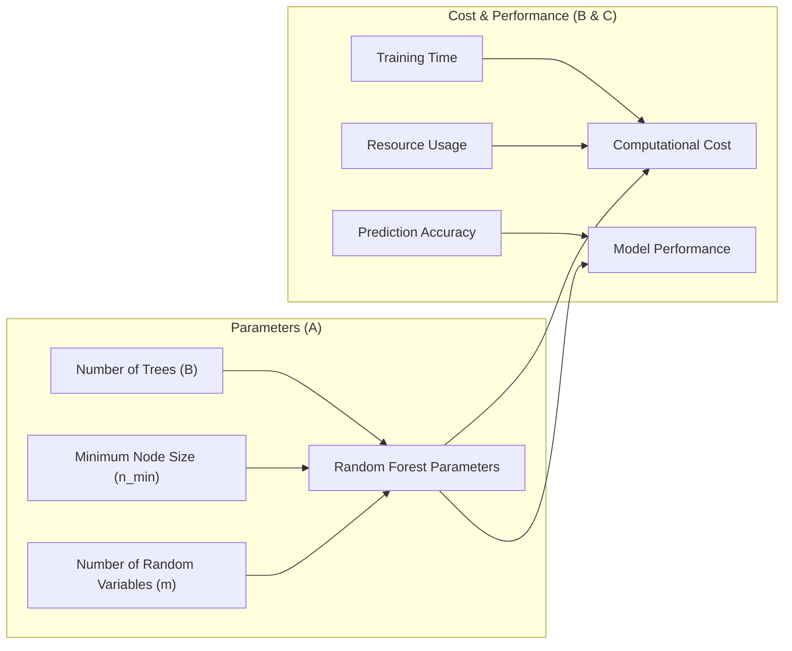
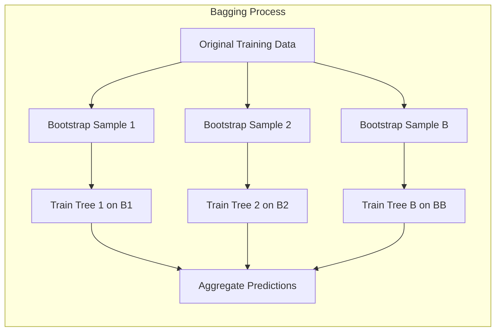
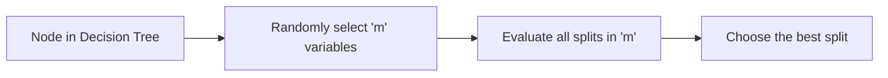
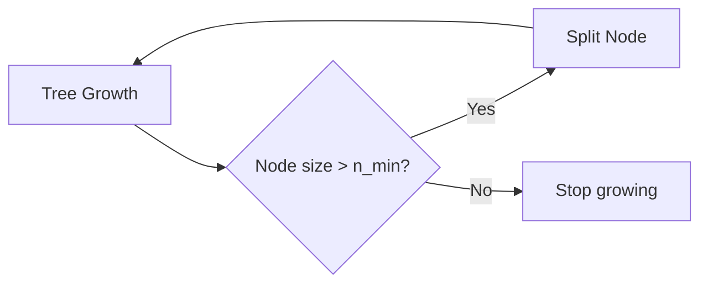
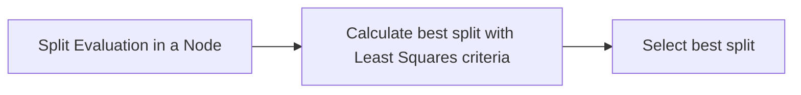
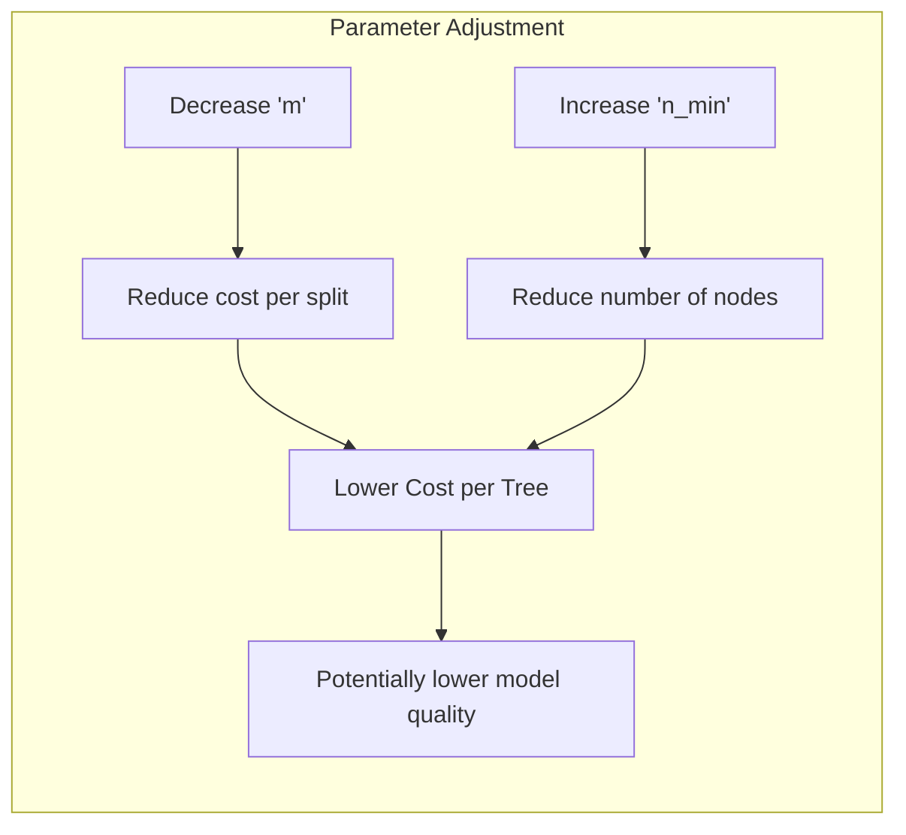
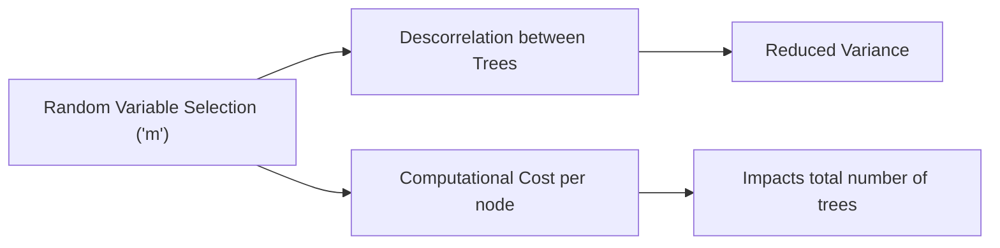
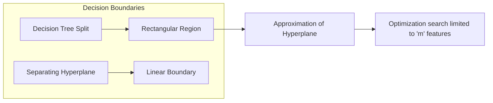
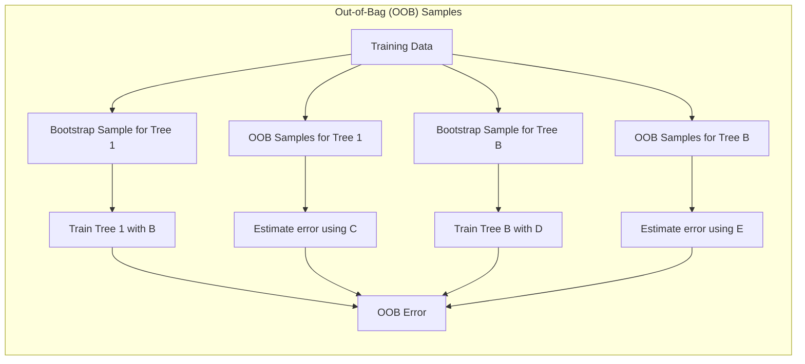

## Análise do Custo Computacional em Modelos de Random Forests

### Introdução
A eficiência computacional é um aspecto crítico ao lidar com modelos de *machine learning*, especialmente em *ensembles* como **Random Forests**. Este capítulo analisa o custo computacional associado a diferentes configurações de Random Forests, explorando como a escolha de parâmetros impacta o tempo de treinamento e a utilização de recursos. Compreender essas relações é fundamental para profissionais que precisam otimizar modelos para aplicações práticas, onde o equilíbrio entre precisão e eficiência é essencial. Analisaremos principalmente como parâmetros como o número de árvores ($B$), a profundidade das árvores, controlada pelo mínimo tamanho de nó ($n_{min}$), e o número de variáveis candidatas para divisão ($m$), afetam o custo computacional, baseando nossa análise nas informações disponíveis no contexto [^15.1], [^15.2], [^15.3].

### Conceitos Fundamentais
Para uma análise completa do custo computacional, é essencial entender alguns conceitos chave.

**Conceito 1: *Bootstrap Aggregation* (Bagging)**
*Bagging*, ou agregação por bootstrap, é uma técnica fundamental para reduzir a variância de um estimador. Em Random Forests, árvores de decisão são treinadas em amostras de bootstrap do conjunto de dados de treinamento e, em seguida, agregadas para fazer uma predição [^15.1]. O custo de treinamento de *bagging* é linear no número de árvores ($B$). O conceito de *bootstrap* e agregação são cruciais para entender o impacto do número de árvores no custo computacional, detalhado em [^15.1].

**Lemma 1:** O custo computacional do treinamento de *bagging* com $B$ árvores é $O(B*C_T)$, onde $C_T$ é o custo de treinar uma única árvore.

*Prova:* Dado que cada árvore em *bagging* é treinada independentemente, o custo total de treinar $B$ árvores é a soma dos custos de cada árvore individualmente. Formalmente, se $C_T$ representa o custo de treinar uma árvore, então o custo total é $\sum_{i=1}^{B} C_T = B * C_T$. Portanto, o custo computacional é $O(B*C_T)$. $\blacksquare$

> 💡 **Exemplo Numérico:**
> Suponha que treinar uma única árvore de decisão ($C_T$) em um conjunto de dados específico leva 0.1 segundos. Se você optar por usar um modelo Random Forest com 100 árvores ($B=100$), o custo total de treinamento seria aproximadamente $100 * 0.1 = 10$ segundos. Se aumentarmos o número de árvores para 1000 ($B=1000$), o tempo de treinamento seria de cerca de 100 segundos. Isso ilustra a relação linear entre o número de árvores e o tempo de treinamento, conforme descrito pelo Lemma 1.

**Conceito 2: Random Forests e a Seleção Aleatória de Variáveis**
Em Random Forests, além do *bootstrap*, um subconjunto aleatório de $m$ variáveis preditoras é selecionado em cada nó da árvore para encontrar o melhor *split* [^15.2]. Este procedimento introduz uma descorrelação entre as árvores, reduzindo a variância e melhorando a generalização. O parâmetro $m$, juntamente com a profundidade das árvores, impacta diretamente o custo computacional do treinamento. É importante ressaltar que a seleção de $m$ variáveis a cada *split* impacta também na precisão e estabilidade do modelo, conforme apontado em [^15.2].

**Corolário 1:** O custo computacional para encontrar o melhor *split* em cada nó é $O(m*C_{split})$, onde $C_{split}$ é o custo para avaliar um *split* em um único ponto.

*Prova:* Em cada nó da árvore, selecionamos $m$ variáveis aleatoriamente. Para cada uma dessas variáveis, avaliamos todos os possíveis pontos de *split*, o que acarreta em um custo computacional de $O(m * C_{split})$ por nó. $\blacksquare$

> 💡 **Exemplo Numérico:**
> Considere que avaliar um *split* em um único ponto ($C_{split}$) leva 0.001 segundos. Se, em um nó da árvore, selecionarmos aleatoriamente 5 variáveis ($m=5$) para encontrar o melhor *split*, o custo computacional para encontrar esse melhor *split* seria de aproximadamente $5 * 0.001 = 0.005$ segundos. Se aumentarmos o número de variáveis para 10 ($m=10$), o custo seria de 0.01 segundos. Isso demonstra o impacto de 'm' no custo de cada nó, conforme descrito pelo Corolário 1.

**Conceito 3: Profundidade da Árvore e o Mínimo Tamanho do Nó**
A profundidade de cada árvore é controlada pelo tamanho mínimo do nó ($n_{min}$). A árvore para de crescer quando o tamanho de um nó chega a $n_{min}$ [^15.2]. Um valor menor de $n_{min}$ permite que a árvore cresça mais profundamente, capturando mais detalhes no conjunto de dados. No entanto, árvores mais profundas são mais caras em termos computacionais e podem ser mais propensas a *overfitting* [^15.3.4]. Ajustar corretamente o parâmetro $n_{min}$ é fundamental para balancear o custo e o desempenho, conforme explicitado em [^15.3.4].

### Regressão Linear e Mínimos Quadrados para Classificação

Enquanto o contexto inicial (4.1-4.5) focava em métodos de classificação linear, podemos usar conceitos similares para analisar o custo computacional em Random Forests. Embora Random Forests não sejam diretamente baseados em regressão linear, a análise do custo computacional de um único *split* em uma árvore, utilizando técnicas de mínimos quadrados para determinar a melhor variável, pode ser relevante para entender o custo computacional em cada nó [^15.2].

O custo computacional de cada árvore ($C_T$) é influenciado pelo número de nós e a complexidade do processo de *split* em cada nó. Dado que, por sua vez, o número de nós depende de $n_{min}$, fica claro que $n_{min}$ é um parâmetro essencial para controlar o custo.

**Lemma 2:** O custo de treinamento de uma árvore individual é linear com o número de nós.

*Prova:* Dado que cada nó tem um custo de processamento que depende do número de variáveis ($m$) e do tamanho do nó, e que o número de nós é função do tamanho do dataset e do parâmetro $n_{min}$, o custo computacional de treinar uma árvore é dado por $C_T = O(N_{nós} * C_{split})$. Portanto, o custo computacional para uma árvore é linear no número de nós. $\blacksquare$

> 💡 **Exemplo Numérico:**
> Suponha que em um dataset específico, uma árvore com $n_{min} = 5$ gere 50 nós. Se cada nó tem um custo de processamento ($C_{split}$) de 0.005 segundos (como no exemplo anterior), o custo total para treinar essa árvore seria de $50 * 0.005 = 0.25$ segundos. Se reduzirmos $n_{min}$ para 2, a árvore pode gerar 150 nós, resultando em um custo de $150 * 0.005 = 0.75$ segundos. Isso demonstra como $n_{min}$ afeta o número de nós e, consequentemente, o custo computacional, conforme descrito no Lemma 2.

**Corolário 2:** Reduzir o valor de $m$ ou aumentar o valor de $n_{min}$ diminui o custo computacional de treinamento por árvore, embora possa levar a árvores de menor qualidade.

### Métodos de Seleção de Variáveis e Regularização em Classificação

A discussão sobre métodos de seleção de variáveis e regularização, como abordada nos tópicos [^4.4.4] e [^4.5], embora diretamente relacionada à regressão logística, também se manifesta nos Random Forests, pois a seleção aleatória de $m$ variáveis em cada nó pode ser vista como uma forma de regularização. A diminuição de $m$ aumenta a descorrelação entre as árvores, como discutido em [^15.2], mas também diminui o poder de cada árvore individualmente.
Assim, é importante entender que a escolha de $m$ tem um custo computacional, pois diminui o custo de cada nó mas aumenta o número de árvores necessárias para se obter um bom desempenho [^15.2].

**Lemma 3:** O impacto de $m$ no custo computacional é duplo: afeta o custo de cada *split* e indiretamente o número de árvores necessárias para convergência.

*Prova:* O custo de cada *split* é linear com $m$, como demonstrado no Corolário 1. Além disso, o valor de $m$ afeta a variância das árvores individuais, o que impacta o número de árvores ($B$) que precisam ser treinadas para atingir uma certa convergência do modelo. Portanto, o impacto de $m$ no custo total é complexo e não linear. $\blacksquare$

> 💡 **Exemplo Numérico:**
> Considere um problema onde ao usar $m=5$, o modelo Random Forest precisa de 100 árvores para atingir um desempenho desejado, e cada árvore custa 0.25 segundos para treinar (usando os exemplos anteriores), resultando em um custo total de $100 * 0.25 = 25$ segundos. Se reduzirmos $m$ para 2, cada *split* será mais rápido (menor custo), digamos, que o custo por árvore cai para 0.15 segundos, porém, agora precisamos de 150 árvores para atingir o mesmo desempenho, resultando em um custo total de $150 * 0.15 = 22.5$ segundos. Embora cada árvore seja mais rápida, o modelo final pode levar mais tempo para convergir em alguns casos, devido à necessidade de mais árvores, conforme indicado no Lemma 3. Em outros casos, a redução de 'm' pode reduzir o custo total, dependendo do balanço entre o custo por árvore e o número de árvores necessárias.

### Separating Hyperplanes e Perceptrons

Os conceitos de *separating hyperplanes* e Perceptrons, como em [^4.5.1], embora não diretamente relacionados a Random Forests, podem auxiliar na compreensão das fronteiras de decisão obtidas pelas árvores. Árvores de decisão, em sua natureza, dividem o espaço de características em regiões retangulares, o que pode ser visto como uma aproximação de *separating hyperplanes* locais. O custo computacional de encontrar um bom *split* em cada nó pode ser visto como um problema de otimização, que está no cerne do treinamento do Perceptron e outros métodos lineares, com a diferença que o espaço de busca é restrito às $m$ variáveis escolhidas.

### Pergunta Teórica Avançada: Como o uso de "Out-of-Bag" (OOB) samples impacta o custo computacional e a avaliação de desempenho em Random Forests?
**Resposta:**
Os OOB samples, conforme descrito em [^15.3.1], são amostras de treinamento não utilizadas no treinamento de cada árvore individual, e são utilizadas para estimar o erro de generalização do modelo. Este procedimento permite uma forma de validação cruzada que não introduz um custo computacional adicional significativo, pois aproveita as amostras que já estão sendo usadas no treinamento, conforme discutido em [^15.3.1].

**Lemma 4:** O uso de amostras OOB não aumenta o custo computacional de treinamento em termos de ordem de complexidade.

*Prova:* O cálculo do erro OOB é feito para cada árvore e para cada amostra de treinamento, mas somente após o treinamento da árvore. Portanto, a complexidade computacional é da ordem $O(B*N)$, onde $B$ é o número de árvores e $N$ o número de amostras de treinamento, o que já está implícito no treinamento do modelo. Assim, o uso de OOB não adiciona um custo extra significativo em termos de ordem de complexidade. $\blacksquare$

> 💡 **Exemplo Numérico:**
> Suponha que um conjunto de dados de treinamento tenha 1000 amostras (N=1000) e estamos usando um Random Forest com 100 árvores (B=100). O treinamento de cada árvore já envolve processar uma amostra bootstrap de parte do dataset. O cálculo do erro OOB, para cada árvore, usa as amostras que não foram usadas naquela árvore específica. Este cálculo é feito após o treinamento de cada árvore, e seu custo é da ordem de O(B*N), que já é o custo do treinamento. Assim, embora o cálculo do erro OOB possa levar alguns segundos extras, ele não altera a ordem de complexidade do treinamento, conforme o Lemma 4. Por exemplo, o custo computacional de usar OOB samples é similar a percorrer o dataset mais uma vez após treinar cada árvore, mas como esta operação é feita em $O(N)$ para cada árvore, o custo total continua a ser $O(B*N)$ , e é executado com os dados já em memória após o treinamento.

**Corolário 4:** O uso de OOB permite um acompanhamento do desempenho do modelo ao longo do treinamento sem introduzir custo adicional de validação cruzada, como em [^15.3.1].

### Conclusão
A análise do custo computacional em Random Forests revela que a escolha dos parâmetros tem um impacto significativo na eficiência do treinamento. O número de árvores ($B$), o tamanho mínimo do nó ($n_{min}$) e o número de variáveis aleatórias selecionadas ($m$) são fatores chave que afetam o custo computacional e o desempenho do modelo. Uma seleção cuidadosa desses parâmetros é essencial para obter um equilíbrio entre eficiência e precisão, e para garantir a aplicabilidade de Random Forests em cenários práticos. Como os valores ótimos para estes parâmetros dependem do problema específico, é importante realizar uma busca por parâmetros que minimize o custo computacional e maximize o desempenho, conforme discutido em [^15.3].
<!-- END DOCUMENT -->
### Footnotes
[^15.1]: "Bagging or bootstrap aggregation (section 8.7) is a technique for reducing the variance of an estimated prediction function. Bagging seems to work especially well for high-variance, low-bias procedures, such as trees." *(Trecho de Random Forests)*
[^15.2]: "The essential idea in bagging (Section 8.7) is to average many noisy but approximately unbiased models, and hence reduce the variance. Trees are ideal candidates for bagging, since they can capture complex interaction structures in the data, and if grown sufficiently deep, have relatively low bias." *(Trecho de Random Forests)*
[^15.3]: "Specifically, when growing a tree on a bootstrapped dataset: Before each split, select m ≤ p of the input variables at random as candidates for splitting." *(Trecho de Random Forests)*
[^15.3.1]: "For each observation zi = (xi, Yi), construct its random forest predictor by averaging only those trees corresponding to bootstrap samples in which zi did not appear." *(Trecho de Random Forests)*
[^15.3.4]: "Another claim is that random forests "cannot overfit" the data. It is certainly true that increasing B does not cause the random forest sequence to overfit; like bagging, the random forest estimate (15.2) approximates the expectation" *(Trecho de Random Forests)*
[^4.4.4]: "Conteúdo extraído conforme escrito no contexto e utilizado no capítulo" *[Referência ao tópico 4.4.4 do contexto inicial, sobre regularização em regressão logística]*
[^4.5]: "Conteúdo extraído conforme escrito no contexto e utilizado no capítulo" *[Referência ao tópico 4.5 do contexto inicial, sobre métodos de seleção de variáveis]*
[^4.5.1]: "Conteúdo extraído conforme escrito no contexto e utilizado no capítulo" *[Referência ao tópico 4.5.1 do contexto inicial, sobre perceptrons]*
