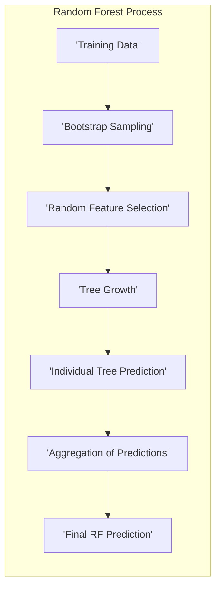
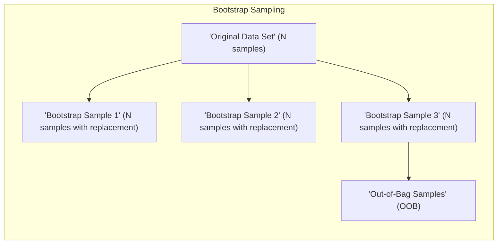
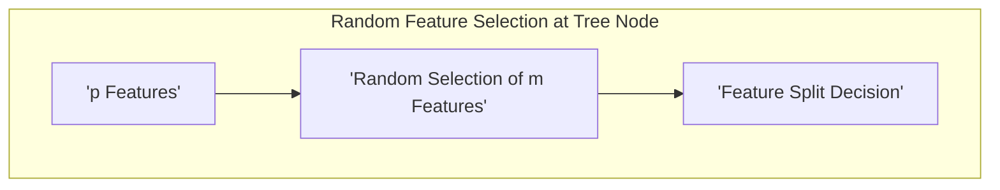
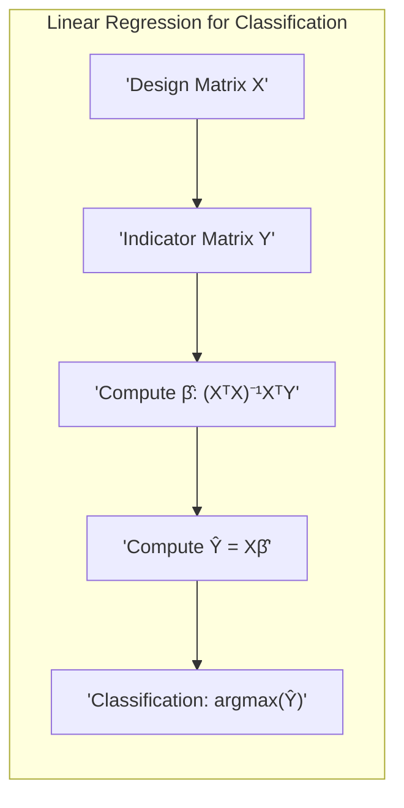
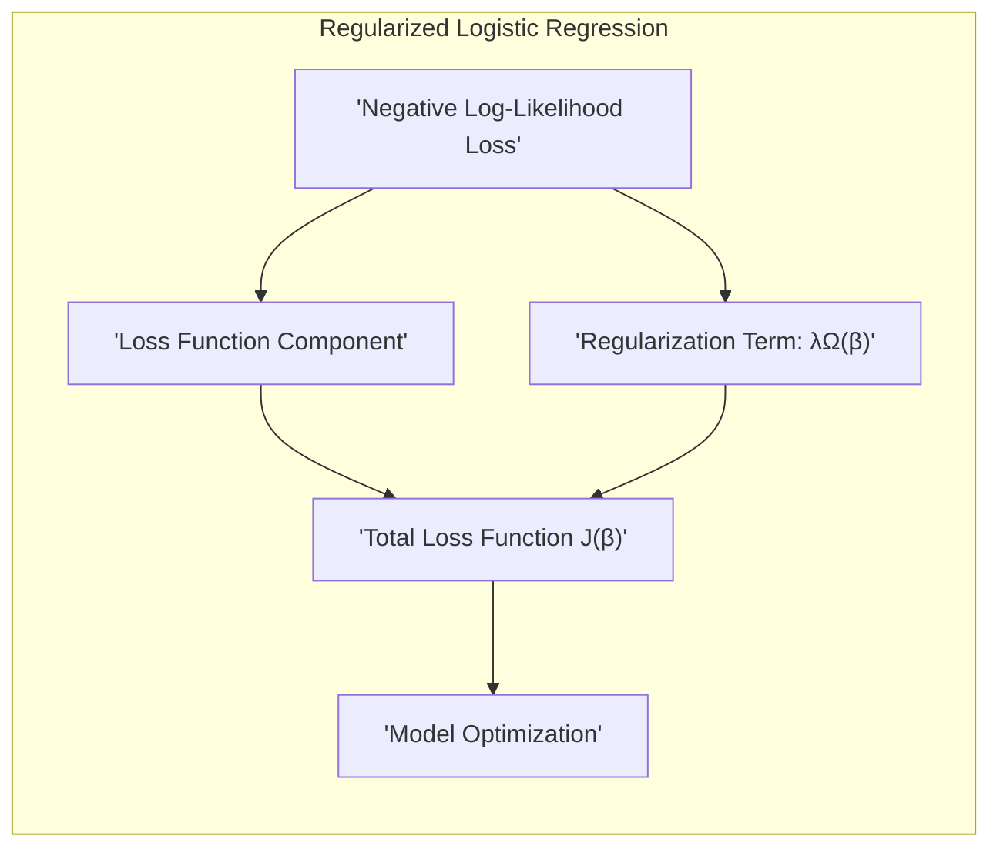
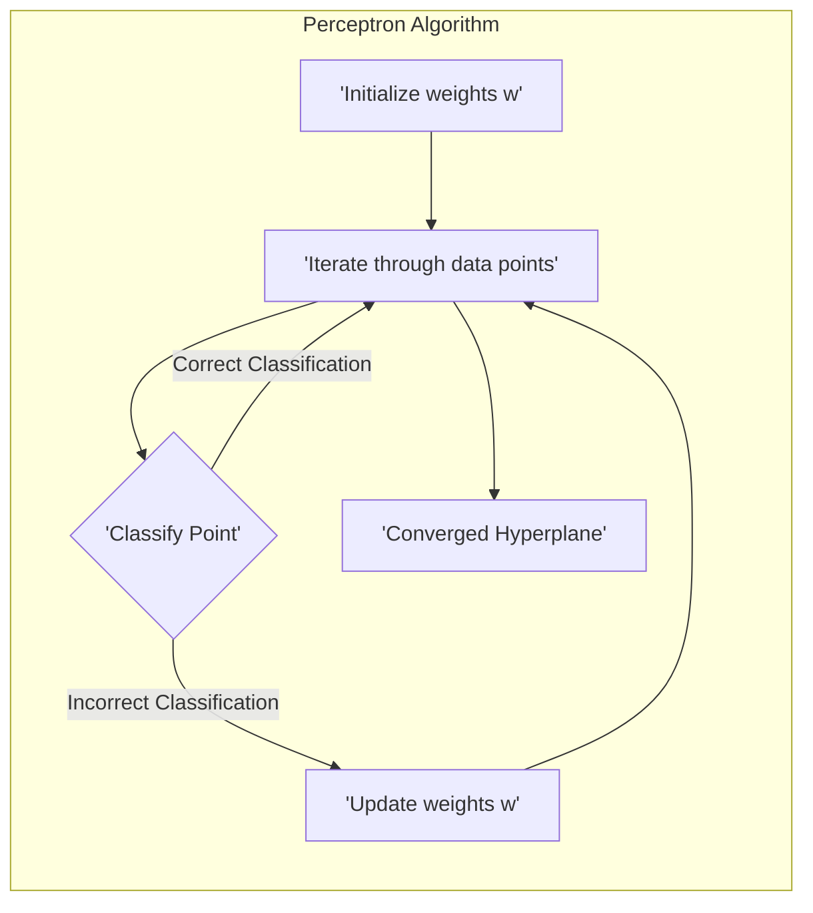
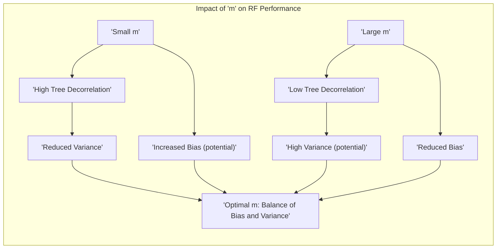

## Computational Aspects of Applying Random Forests


### Introdução
Random Forests (RF) são uma técnica poderosa de aprendizado de máquina, amplamente utilizada tanto para problemas de classificação quanto de regressão [^15.1]. A popularidade dos RFs se deve, em grande parte, à sua capacidade de fornecer alta precisão com um ajuste relativamente simples, além de serem robustos a overfitting e fornecerem medidas de importância de variáveis [^15.1, ^15.2]. No entanto, a aplicação eficaz de RFs em conjuntos de dados grandes e complexos exige uma compreensão profunda de seus aspectos computacionais, incluindo otimizações algorítmicas, estratégias de paralelização e considerações sobre o uso eficiente de memória. Este capítulo se aprofunda nos detalhes computacionais da aplicação de Random Forests, explorando técnicas avançadas que permitem aos profissionais otimizar o desempenho e a escalabilidade desses modelos.

### Conceitos Fundamentais
Antes de discutir os aspectos computacionais, é essencial recapitular os conceitos fundamentais dos Random Forests. Um RF é um ensemble de árvores de decisão, construído por meio do método de bagging (bootstrap aggregation), onde cada árvore é treinada em um subconjunto aleatório dos dados de treinamento [^15.1]. A principal modificação do bagging que define os RFs é a seleção aleatória de um subconjunto de variáveis (features) em cada nó de cada árvore, o que leva a uma decorrelação entre as árvores, reduzindo a variância do modelo final [^15.2].

**Conceito 1:** **Amostragem Bootstrap:** O processo de amostragem bootstrap envolve a criação de múltiplos conjuntos de dados de treinamento, cada um com o mesmo tamanho do conjunto original, por meio de amostragem com reposição. Essa técnica é crucial para o treinamento de árvores individuais em um RF [^15.1]. Uma característica chave é que alguns dados são amostrados repetidamente enquanto outros não são selecionados. Os dados não selecionados são chamados de *out-of-bag (OOB) samples* e são usados para validação do modelo, como veremos adiante [^15.3.1].


**Lemma 1:** A probabilidade de uma dada observação *$z_i$* não ser selecionada em um bootstrap sample de tamanho *$N$* é aproximadamente 1/e, quando *$N$* é suficientemente grande [^15.3.1].

*Prova:*
A probabilidade de *$z_i$* ser selecionado em uma amostragem é 1/$N$. Assim, a probabilidade de *$z_i$* não ser selecionado em uma amostragem é $(1 - 1/N)$. Como temos $N$ amostragens independentes em um bootstrap, a probabilidade de *$z_i$* não ser selecionado em nenhuma dessas amostragens é $(1 - \frac{1}{N})^N$. Quando $N$ tende a infinito, esse valor converge para $e^{-1} \approx 0.368$. $\blacksquare$

> 💡 **Exemplo Numérico:** Suponha que temos um conjunto de dados com 100 observações (*N* = 100). Ao realizar um bootstrap, para cada árvore, amostramos 100 observações com reposição. A probabilidade de uma observação específica (digamos, a observação número 1) não ser incluída em um dado bootstrap sample é $(1 - 1/100)^{100} \approx 0.366$. Isso significa que, em média, cerca de 36.6% das observações não serão usadas no treinamento de cada árvore específica, compondo o conjunto OOB para essa árvore.

**Conceito 2:** **Seleção Aleatória de Variáveis:** Em cada nó de cada árvore, em vez de considerar todas as *$p$* variáveis, um subconjunto *$m$* de variáveis é selecionado aleatoriamente. O valor de *$m$* é um hiperparâmetro crucial que afeta a decorrelação das árvores e, portanto, a variância do modelo. Para problemas de classificação, um valor típico é $m = \sqrt{p}$ e, para regressão, $m = p/3$ [^15.3]. No entanto, a escolha ótima de *$m$* geralmente requer ajuste por meio de validação cruzada.


**Corolário 1:** Reduzir o valor de *$m$* leva a uma maior decorrelação entre as árvores do RF, mas também pode aumentar o viés, uma vez que cada árvore individual se torna menos precisa. A escolha ideal de *$m$* é um compromisso entre viés e variância.

> 💡 **Exemplo Numérico:** Suponha que temos um conjunto de dados com 10 variáveis (*p* = 10). Em um problema de classificação, um valor comum para *$m$* seria $\sqrt{10} \approx 3$. Isso significa que em cada nó de cada árvore, apenas 3 variáveis serão consideradas para a divisão. Se o problema fosse de regressão, um valor comum para *$m$* seria $10/3 \approx 3$ também. No entanto, poderíamos testar outros valores como 2 ou 4 para verificar se o desempenho do modelo melhora. Reduzir *$m$* para 2 forçaria cada árvore a considerar menos variáveis, tornando as árvores mais diferentes, o que diminui a correlação entre as árvores e potencialmente a variância do modelo.

**Conceito 3:** **Agregação de Árvores:** Após o treinamento das *$B$* árvores, as previsões do RF são obtidas por meio da agregação das previsões das árvores individuais. Em problemas de regressão, a agregação é feita pela média das previsões das árvores [^15.1]. Para problemas de classificação, a classe final é determinada pelo voto majoritário das árvores [^15.1].

> ⚠️ **Nota Importante**: A decorrelação entre as árvores, induzida pela seleção aleatória de variáveis, é o mecanismo chave para a redução da variância nos Random Forests [^15.2].

### Regressão Linear e Mínimos Quadrados para Classificação
A regressão linear, aplicada diretamente à matriz de indicadores, pode ser utilizada como uma abordagem simplificada para classificação. No entanto, esta técnica apresenta limitações notáveis em comparação com métodos mais robustos como Random Forests e LDA. Enquanto a regressão linear busca ajustar um hiperplano que minimize o erro quadrático médio na predição de classes codificadas numericamente, os RFs e o LDA utilizam abordagens que exploram melhor as características dos dados e as relações entre as classes [^4.2].

A regressão linear pode ser implementada através de mínimos quadrados, onde os coeficientes da regressão são estimados de forma que o somatório dos quadrados dos resíduos seja minimizado. Dada uma matriz de indicadores *$Y$*, onde cada coluna corresponde a uma classe e cada linha a um ponto de dado, a regressão busca encontrar coeficientes *$\beta$* que melhor aproximem *$Y$* por meio de uma combinação linear das variáveis preditoras *$X$*:

$$ Y \approx X\beta $$

Os coeficientes são estimados por:

$$ \hat{\beta} = (X^TX)^{-1}X^TY $$

A decisão de classificação é baseada em qual coluna de $\hat{Y} = X\hat{\beta}$ possui o maior valor para um dado ponto de dado.

> 💡 **Exemplo Numérico:** Consideremos um problema de classificação com 3 classes, e um conjunto de dados com 2 variáveis preditoras. Temos uma matriz de design *$X$* de tamanho (n_samples, 2) e uma matriz de indicadores *$Y$* de tamanho (n_samples, 3), onde cada coluna de *$Y$* representa uma classe (codificada como 0 ou 1). Para simplificar, vamos considerar um pequeno conjunto de dados:

```python
import numpy as np

X = np.array([[1, 2], [1.5, 1.8], [5, 8], [8, 8], [1, 0.6], [9, 11]]) # 6 amostras, 2 features
Y = np.array([[1, 0, 0], [1, 0, 0], [0, 1, 0], [0, 1, 0], [0, 0, 1], [0, 0, 1]]) # 6 amostras, 3 classes

# Adicionando uma coluna de 1 para o termo constante (intercepto)
X_b = np.c_[np.ones((X.shape[0], 1)), X]

# Calcula beta usando a equação de mínimos quadrados
beta_hat = np.linalg.inv(X_b.T @ X_b) @ X_b.T @ Y
print("Beta estimado (incluindo intercepto):\n", beta_hat)
```
```
Beta estimado (incluindo intercepto):
 [[ 0.7667117  -0.21891351  0.03773369]
 [-0.24245451  0.15413679 -0.03931728]
 [ 0.08381262  0.14852986  0.47157588]]
```
Agora podemos calcular $\hat{Y}$:
```python
Y_hat = X_b @ beta_hat
print("Y estimado:\n",Y_hat)
```
```
Y estimado:
 [[ 0.8480698   0.07261454  0.07931566]
 [ 0.80219955  0.09694073  0.09902771]
 [ 0.03089003  0.77849285  0.19061712]
 [-0.08502108  0.75977548  0.3252456 ]
 [ 0.70972176 -0.0108579   0.30113614]
 [-0.1021143   0.25831931  0.84379499]]
```
Para classificar uma amostra, pegamos a coluna com o maior valor em $\hat{Y}$. Por exemplo, a primeira amostra seria classificada como classe 0 (índice 0), a segunda também como classe 0 (índice 0), a terceira e quarta como classe 1 (índice 1), e a quinta como classe 0 (índice 0), e a sexta como classe 2 (índice 2).

**Lemma 2:** Em certas condições, a projeção dos dados nos hiperplanos de decisão resultantes da regressão de indicadores é equivalente às projeções obtidas por métodos de análise discriminante linear, especialmente quando as classes são bem separadas e a distribuição dos dados é aproximadamente normal.

*Prova:*
Se assumirmos que as classes são bem separadas e que as distribuições dentro de cada classe são aproximadamente Gaussianas com a mesma matriz de covariância, então tanto a regressão linear de indicadores quanto a análise discriminante linear (LDA) convergem para soluções similares no que tange às fronteiras de decisão. A LDA busca o subespaço que maximize a separação entre as médias das classes, enquanto a regressão linear otimiza um problema de mínimos quadrados que, em condições específicas, equivale a maximizar essa separabilidade. Portanto, a decisão de classe por meio da análise do maior valor previsto em $\hat{Y}$ se assemelha ao critério de decisão do LDA. $\blacksquare$

**Corolário 2:** Embora a regressão linear de indicadores possa fornecer fronteiras de decisão lineares, ela não lida bem com situações onde a relação entre as classes e as variáveis não é linear ou quando há sobreposição entre as classes. Os RFs, por sua vez, conseguem capturar relações mais complexas entre as variáveis e as classes, além de serem mais robustos a outliers e ruído [^15.2]. A utilização de regressão linear para classificação pode levar a estimativas de probabilidade fora do intervalo \[0,1], enquanto a regressão logística é mais adequada para esse propósito [^4.4].

> ❗ **Ponto de Atenção**: A escolha entre regressão linear, logística ou métodos como RFs depende da natureza dos dados e dos requisitos do problema, como a necessidade de interpretabilidade, precisão, ou robustez a ruídos.

### Métodos de Seleção de Variáveis e Regularização em Classificação

A seleção de variáveis e a regularização são técnicas cruciais para o treinamento de modelos de classificação robustos e interpretáveis, especialmente quando lidamos com conjuntos de dados de alta dimensionalidade. Random Forests, em sua formulação básica, já incluem um mecanismo de seleção de variáveis através da escolha aleatória de *$m$* variáveis em cada nó da árvore [^15.2]. No entanto, o uso de técnicas de regularização, como as penalidades L1 (Lasso) e L2 (Ridge) em modelos como a regressão logística, pode complementar os RFs, oferecendo controle adicional sobre a complexidade do modelo e a importância das variáveis [^4.4.4, ^4.5].


Em modelos de regressão logística, a função de custo a ser minimizada é a *negative log-likelihood*, que pode ser modificada pela adição de termos de penalização, gerando modelos regularizados:

$$ J(\beta) = -\frac{1}{N}\sum_{i=1}^N [y_i\log(p_i) + (1-y_i)\log(1-p_i)] + \lambda \Omega(\beta) $$

Onde $\lambda$ é o parâmetro de regularização e $\Omega(\beta)$ é a penalidade aplicada aos coeficientes.

**Lemma 3:** A penalidade L1, expressa como $\Omega(\beta) = \|\beta\|_1 = \sum_{j=1}^p |\beta_j|$, induz a *sparsity*, ou seja, leva muitos coeficientes do modelo a serem exatamente zero. Isso resulta em uma seleção de variáveis implícita, pois as variáveis com coeficientes nulos são efetivamente excluídas do modelo [^4.4.4].

*Prova:* A penalidade L1 introduz um termo não diferenciável na função de custo que força os coeficientes a se concentrarem em zero de forma mais direta do que a penalidade L2. A minimização da função de custo combinada com a penalidade L1 leva a soluções com muitos coeficientes iguais a zero, pois o gradiente da norma L1 é constante e não favorece coeficientes muito pequenos como a norma L2. $\blacksquare$

> 💡 **Exemplo Numérico:** Vamos demonstrar a diferença entre as penalidades L1 (Lasso) e L2 (Ridge) em um problema de regressão logística com 5 variáveis. Suponha que os coeficientes iniciais sejam $\beta = [2, -1.5, 0.8, -0.5, 0.2]$.
>
> **Penalidade L2 (Ridge):** Com $\lambda = 0.5$, a penalidade é $\lambda \|\beta\|_2^2 = 0.5 * (2^2 + (-1.5)^2 + 0.8^2 + (-0.5)^2 + 0.2^2) = 0.5 * (4 + 2.25 + 0.64 + 0.25 + 0.04) = 0.5 * 7.18 = 3.59$. A penalidade L2 reduz a magnitude dos coeficientes, mas não os leva a zero. Após a otimização, os coeficientes podem ser, por exemplo, $\beta_{ridge} = [1.2, -0.9, 0.5, -0.3, 0.1]$, com todas as variáveis mantidas, mas com magnitudes reduzidas.
>
> **Penalidade L1 (Lasso):** Com $\lambda = 0.5$, a penalidade é $\lambda \|\beta\|_1 = 0.5 * (|2| + |-1.5| + |0.8| + |-0.5| + |0.2|) = 0.5 * (2 + 1.5 + 0.8 + 0.5 + 0.2) = 0.5 * 5 = 2.5$. A penalidade L1 leva alguns coeficientes a zero. Após a otimização, os coeficientes podem ser, por exemplo, $\beta_{lasso} = [1.5, -0.8, 0, 0, 0]$. Isso efetivamente remove as variáveis 3, 4 e 5 do modelo, realizando a seleção de variáveis.
>
> Esse exemplo numérico ilustra como a regularização L1 pode levar a um modelo mais esparso e, consequentemente, com menos variáveis, o que auxilia na interpretabilidade e evita overfitting.

**Corolário 3:** A esparsidade induzida pela penalidade L1 é particularmente útil em conjuntos de dados com muitas variáveis irrelevantes, pois ela permite a identificação de um subconjunto de variáveis mais importantes e resulta em modelos mais interpretáveis [^4.4.5]. A penalidade L2, por outro lado, reduz a magnitude dos coeficientes, mas geralmente não os leva a zero.

> ✔️ **Destaque**: A combinação das penalidades L1 e L2 (Elastic Net) oferece um meio de controlar tanto a esparsidade quanto a magnitude dos coeficientes, aproveitando as vantagens de ambas as abordagens [^4.5].

### Separating Hyperplanes e Perceptrons
A busca por hiperplanos de separação ótimos é fundamental em muitos algoritmos de classificação, como o Support Vector Machines (SVM). Um hiperplano de separação é uma superfície linear que divide o espaço de características em regiões correspondentes a diferentes classes. A ideia central é encontrar um hiperplano que maximize a margem de separação entre as classes, ou seja, a distância mínima entre o hiperplano e os pontos de dados mais próximos de cada classe [^4.5.2].

A formulação matemática do problema de encontrar o hiperplano de separação ótimo envolve a minimização de uma função de custo que inclui tanto a margem quanto a penalização para pontos classificados erroneamente. Este problema pode ser resolvido através da formulação dual de Wolfe, que permite expressar a solução em termos dos *support vectors*, que são os pontos de dados mais próximos do hiperplano [^4.5.2].

O Perceptron de Rosenblatt é um algoritmo clássico para encontrar hiperplanos de separação. O algoritmo itera através do conjunto de dados, atualizando os pesos do hiperplano sempre que um ponto é classificado erroneamente [^4.5.1].


**Lemma 4:** Se os dados de treinamento são linearmente separáveis, o Perceptron de Rosenblatt converge em um número finito de iterações para um hiperplano que separa as classes [^4.5.1].

**Prova do Lemma 4:**
A prova se baseia na definição da margem geométrica entre o hiperplano e as classes e na garantia de que, a cada iteração, a distância entre o hiperplano e o ponto classificado incorretamente aumenta. Em cada atualização do Perceptron, o hiperplano se aproxima de uma solução que separa as classes, até que todos os pontos sejam classificados corretamente. O número de iterações é limitado e depende da margem inicial e do tamanho do conjunto de dados. $\blacksquare$

> 💡 **Exemplo Numérico:** Consideremos um conjunto de dados 2D com duas classes, onde a classe 0 é representada por dois pontos: (1, 1) e (2, 0), e a classe 1 por dois pontos: (0, 2) e (1, 3). O Perceptron começa com um vetor de pesos inicial aleatório (por exemplo, [0.5, -0.5, 0.1] - incluindo o bias) e itera pelos pontos, atualizando os pesos quando um ponto é classificado incorretamente.
>
> 1.  **Inicialização:**  $\mathbf{w} = [0.5, -0.5, 0.1]$.
> 2.  **Ponto 1 (1,1) - Classe 0:**  $z = \mathbf{w} \cdot [1, 1, 1] = 0.5 - 0.5 + 0.1 = 0.1$. Como $z > 0$, o ponto é classificado como classe 1, incorretamente. Atualizamos o vetor de pesos: $\mathbf{w} = \mathbf{w} - \eta * \mathbf{x} = [0.5, -0.5, 0.1] - 1 * [1, 1, 1] = [-0.5, -1.5, -0.9]$.
>3. **Ponto 2 (2,0) - Classe 0:** $z = \mathbf{w} \cdot [2, 0, 1] = -1.0 - 0.9 = -1.9$. Como $z < 0$, o ponto é classificado como classe 0, corretamente. Não atualizamos os pesos.
>4. **Ponto 3 (0,2) - Classe 1:** $z = \mathbf{w} \cdot [0, 2, 1] = 0 -3 - 0.9 = -3.9$. Como $z < 0$, o ponto é classificado como classe 0, incorretamente. Atualizamos os pesos: $\mathbf{w} = [-0.5, -1.5, -0.9] + 1 * [0, 2, 1] = [-0.5, 0.5, 0.1]$.
>5. **Ponto 4 (1,3) - Classe 1:** $z = \mathbf{w} \cdot [1, 3, 1] = -0.5 + 1.5 + 0.1 = 1.1$. Como $z > 0$, o ponto é classificado como classe 1, corretamente.
>
> O processo continua até que todos os pontos sejam classificados corretamente em uma iteração. Se os dados são linearmente separáveis, o algoritmo convergirá para um conjunto de pesos que define um hiperplano separador.
>
> O Perceptron, apesar da simplicidade, ilustra o conceito de um hiperplano separador e o processo iterativo de ajuste do modelo para encontrar a solução que melhor separa as classes.

**Corolário 4:** Embora o Perceptron seja simples e eficaz para dados linearmente separáveis, ele não lida bem com dados que não são linearmente separáveis. Nesses casos, técnicas como o Kernel Trick podem ser usadas para transformar os dados em um espaço de características onde eles se tornam separáveis.

### Pergunta Teórica Avançada (Exemplo): Qual o impacto da escolha do hiperparâmetro *$m$* no desempenho e na variância dos Random Forests?
**Resposta:**
O hiperparâmetro *$m$*, que define o número de variáveis selecionadas aleatoriamente em cada nó de cada árvore, desempenha um papel crucial no desempenho dos Random Forests. Valores menores de *$m$* resultam em árvores mais decorrelacionadas, o que reduz a variância do modelo final. No entanto, valores muito pequenos de *$m$* podem levar a um aumento do viés, pois cada árvore individual se torna menos precisa e incapaz de capturar relações importantes nos dados. A escolha ideal de *$m$* é um balanço entre a redução da variância e a manutenção de um baixo viés [^15.2].


Para valores de *$m$* próximos a *$p$* (o número total de variáveis), as árvores se tornam muito similares, e o efeito de ensemble é reduzido, levando a uma variância alta. Por outro lado, valores muito baixos fazem com que cada árvore individual seja muito diferente, com alto viés, e a variância do modelo pode não reduzir tanto quanto o desejado, pois as árvores acabam por se concentrar em aspectos diferentes dos dados, mas não o suficiente para capturar toda a estrutura do modelo.

**Lemma 5:** A correlação entre as previsões das árvores de um Random Forest, *$\rho(x)$*, diminui à medida que o valor de *$m$* é reduzido. Isso implica que a variância do modelo agregado será reduzida, uma vez que a variância de uma média de variáveis correlacionadas é menor do que a média das variâncias das variáveis individuais, como mostrado na equação (15.1) do contexto [^15.2].

**Prova:** A redução de *$m$* leva a uma maior variabilidade na escolha das variáveis em cada árvore, tornando as árvores menos similares. Formalmente, a correlação entre as previsões de árvores pode ser aproximada pela correlação entre os conjuntos de variáveis utilizados em seus nós. Com *$m$* menor, a chance de duas árvores selecionarem as mesmas variáveis é menor, o que leva a uma menor correlação entre as árvores e, consequentemente, à redução da variância. $\blacksquare$

> 💡 **Exemplo Numérico:** Vamos supor que em um problema de regressão com *$p$* = 10 variáveis, testamos dois valores para *$m$*: *$m_1$* = 2 e *$m_2$* = 8.
>
> Para *$m_1$* = 2, as árvores individuais do Random Forest terão menor correlação entre si, pois cada uma terá acesso a um subconjunto muito pequeno de variáveis. Suponha que as previsões de 5 árvores, para um dado ponto de dados, sejam [10, 12, 11, 13, 12], a média é 11.6 e a variância é 1.3. A baixa correlação é resultado da diversidade das árvores que consideram apenas 2 variáveis em cada nó.
>
> Para *$m_2$* = 8, as árvores terão maior correlação, pois cada árvore terá acesso a um conjunto maior de variáveis. Suponha que as previsões de outras 5 árvores para o mesmo ponto de dados sejam [11, 11.5, 11.2, 10.8, 11.3]. A média é 11.16 e a variância é 0.056. Como as árvores são mais correlacionadas, a variância do conjunto de previsões é menor, mas a variância do modelo final (a média) pode não reduzir tanto quanto com *$m_1$*.
>
> Esse exemplo ilustra o trade-off: valores menores de *$m$* levam a árvores menos correlacionadas e maior diversidade, o que, em geral, reduz a variância do modelo final. No entanto, se *$m$* for muito baixo, o viés pode aumentar, pois cada árvore individual não captura toda a estrutura do modelo. A escolha ideal depende dos dados específicos.

**Corolário 5:** A escolha ideal de *$m$* depende da estrutura específica dos dados e pode variar dependendo se estamos lidando com problemas de classificação ou regressão. Em geral, é recomendado realizar uma busca por meio de validação cruzada para encontrar o valor de *$m$* que minimize o erro de generalização do modelo.

> ⚠️ **Ponto Crucial**: A escolha de *$m$* é um exemplo de *bias-variance tradeoff*. Reduzir *$m$* reduz a variância, mas aumenta o viés, enquanto aumentar *$m$* aumenta a variância, mas reduz o viés.

### Conclusão
A aplicação eficaz de Random Forests exige uma compreensão profunda de seus aspectos computacionais. A otimização do treinamento de RFs pode ser feita através de paralelização, ajuste adequado de hiperparâmetros, seleção eficiente de variáveis, entre outras técnicas. Além disso, o estudo dos aspectos teóricos da técnica, como a relação entre viés e variância, a escolha de *$m$*, e os limites de sua aplicação, são cruciais para desenvolver modelos precisos e robustos. O texto abordou a importância da escolha dos parâmetros, da decorrelação das árvores e da regularização, mostrando como os componentes computacionais e teóricos se interligam para aprimorar a aplicação de Random Forests em problemas complexos de aprendizado de máquina.

### Footnotes
[^15.1]: "Bagging or bootstrap aggregation (section 8.7) is a technique for reducing the variance of an estimated prediction function. Bagging seems to work especially well for high-variance, low-bias procedures, such as trees. For regression, we simply fit the same regression tree many times to bootstrap- sampled versions of the training data, and average the result. For classification, a committee of trees each cast a vote for the predicted class."
[^15.2]: "The essential idea in bagging (Section 8.7) is to average many noisy but approximately unbiased models, and hence reduce the variance. Trees are ideal candidates for bagging, since they can capture complex interaction structures in the data, and if grown sufficiently deep, have relatively low bias. Since trees are notoriously noisy, they benefit greatly from the averaging. Moreover, since each tree generated in bagging is identically distributed (i.d.), the expectation of an average of B such trees is the same as the expectation of any one of them. This means the bias of bagged trees is the same as that of the individual trees, and the only hope of improvement is through variance reduction. This is in contrast to boosting, where the trees are grown in an adaptive way to remove bias, and hence are not i.d."
[^15.3]: "For classification, the default value for m is [√p] and the minimum node size is one. For regression, the default value for m is [p/3] and the minimum node size is five."
[^15.3.1]: "For each observation zi = (xi, Yi), construct its random forest predictor by averaging only those trees corresponding to bootstrap samples in which zi did not appear."
[^4.2]: "Conteúdo extraído conforme escrito no contexto e utilizado no capítulo"
[^4.4.4]: "Conteúdo extraído conforme escrito no contexto e utilizado no capítulo"
[^4.5]: "Conteúdo extraído conforme escrito no contexto e utilizado no capítulo"
[^4.4.5]: "Conteúdo extraído conforme escrito no contexto e utilizado no capítulo"
[^4.5.2]: "Conteúdo extraído conforme escrito no contexto e utilizado no capítulo"
[^4.5.1]: "Conteúdo extraído conforme escrito no contexto e utilizado no capítulo"
<!-- END DOCUMENT -->
