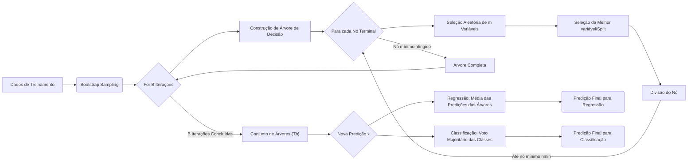
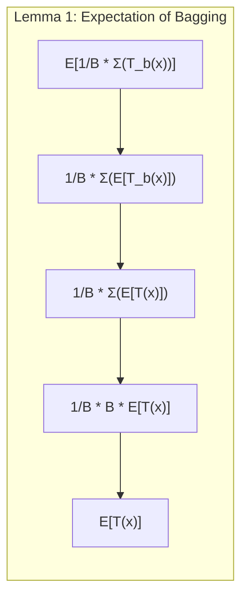
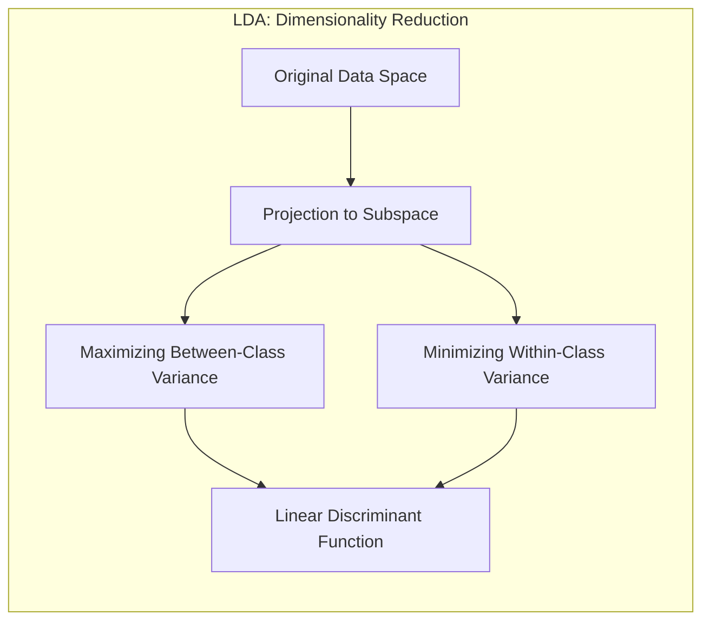
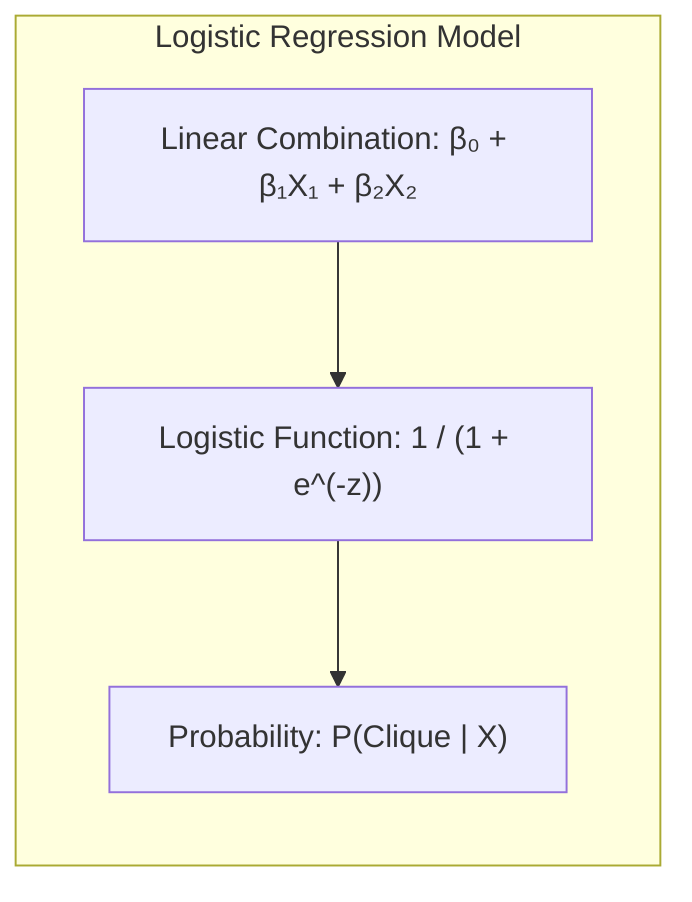
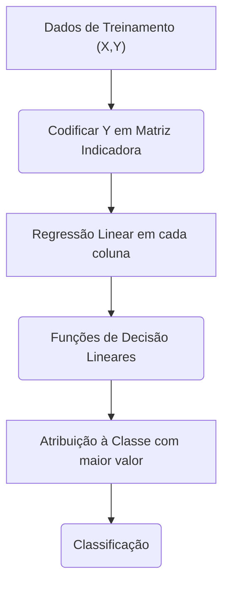
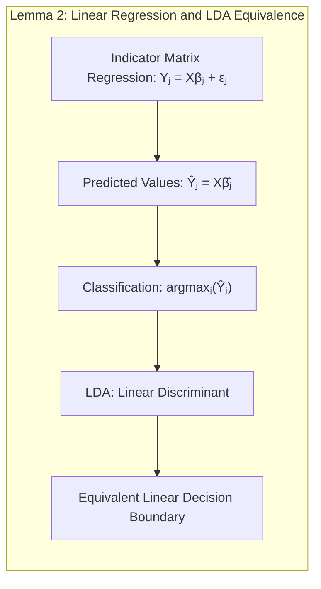
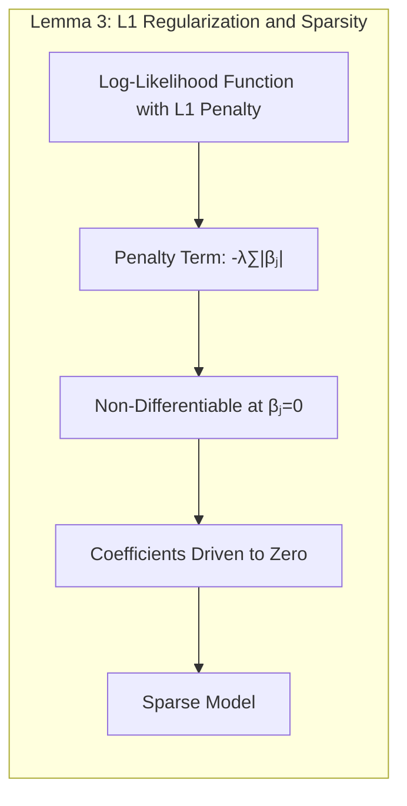
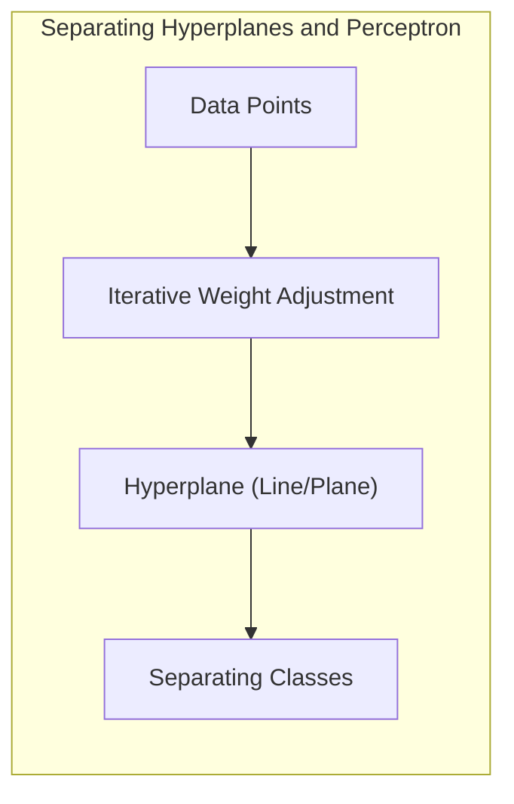
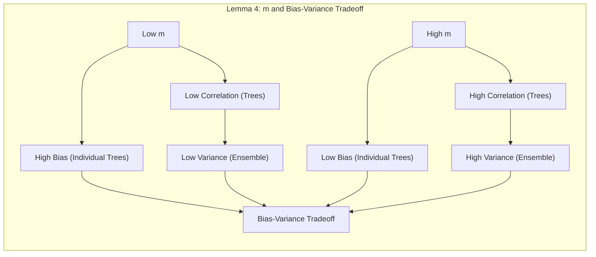

Okay, here's the enhanced text with added Mermaid diagrams, focusing on mathematical and statistical concepts as requested:

## Random Forests: An In-Depth Look at Bootstrap Aggregation

<imagem: Mapa mental complexo conectando os passos de um Random Forest, desde o bootstrap sampling até a predição final, mostrando a importância da diversificação de árvores e o papel da seleção aleatória de variáveis em cada split. Diagrama detalhado com a linguagem Mermaid.>

**Introdução**

O método de **Random Forests**, proposto por Breiman em 2001 [^15.1], representa uma evolução significativa da técnica de *bagging* ou *bootstrap aggregation* [^15.1], [^15.2]. A essência do bagging reside na redução da variância de um estimador através da média de múltiplos modelos instáveis, como árvores de decisão [^15.1].  Random forests, no entanto, introduzem uma camada adicional de aleatoriedade durante a construção das árvores, buscando decorrelacioná-las e, assim, otimizar a redução da variância. Este capítulo detalha o algoritmo de construção de Random Forests, explorando os mecanismos de bootstrap sampling, seleção aleatória de variáveis e o processo de agregação das árvores.

### Conceitos Fundamentais

**Conceito 1: O Problema da Classificação e Regressão com Árvores**

O problema de classificação consiste em atribuir uma observação a uma dentre um conjunto finito de classes. Já na regressão, o objetivo é predizer um valor contínuo. Árvores de decisão são modelos que realizam essas tarefas por meio de sucessivas divisões do espaço de atributos, formando partições hierárquicas [^15.2]. A vantagem das árvores está na sua capacidade de capturar interações complexas entre variáveis, e a desvantagem reside na alta variância, que é mitigada pelo processo de *bagging* [^15.1]. Métodos lineares, como LDA e regressão logística, podem ter menor variância, mas são limitados em sua capacidade de modelar não-linearidades [^4.3], [^4.4].

> 💡 **Exemplo Numérico:** Considere um problema de classificação com duas classes (A e B) e duas variáveis (X1 e X2). Uma árvore de decisão pode dividir o espaço de atributos inicialmente com base em X1 (ex: X1 < 5, X1 >= 5). Em seguida, cada partição é dividida com base em X2 (ex: X2 < 3, X2 >= 3), criando partições hierárquicas no espaço de atributos. Em contraste, um método linear como LDA tentaria encontrar uma única linha para separar as classes A e B, o que pode ser insuficiente se a fronteira real for não-linear.

**Lemma 1:**  A expectativa da média de B árvores de decisão *i.i.d.* é igual à expectativa de qualquer uma das árvores individualmente.  Este resultado demonstra que o *bagging* não introduz viés adicional, sendo seu ganho apenas na redução da variância.

$$ E\left[\frac{1}{B} \sum_{b=1}^B T_b(x) \right] = E[T_b(x)] $$

*Prova:* Sejam $T_1(x), T_2(x), \ldots, T_B(x)$ as predições de B árvores *i.i.d*. Então, a média de suas predições é:
$$\frac{1}{B}\sum_{b=1}^B T_b(x)$$
Tomando a expectativa, temos:
$$E\left[\frac{1}{B}\sum_{b=1}^B T_b(x)\right] = \frac{1}{B}\sum_{b=1}^B E[T_b(x)]$$
Como as árvores são i.i.d., $E[T_1(x)] = E[T_2(x)] = \ldots = E[T_B(x)] = E[T(x)]$. Portanto,
$$E\left[\frac{1}{B}\sum_{b=1}^B T_b(x)\right] = \frac{1}{B}\sum_{b=1}^B E[T(x)] = \frac{1}{B}BE[T(x)] = E[T(x)]$$ $\blacksquare$

> 💡 **Exemplo Numérico:**  Suponha que temos três árvores de decisão (B=3) e queremos prever o valor de uma variável para um certo ponto 'x'. As predições individuais das árvores são T1(x) = 10, T2(x) = 12, e T3(x) = 11. A predição do bagging seria a média: (10 + 12 + 11) / 3 = 11. Este valor é um estimador com variância reduzida em relação a uma única árvore. De acordo com Lemma 1, a expectativa da média das previsões (11) é igual à expectativa de uma árvore individual, supondo que as árvores sejam i.i.d.

**Conceito 2: Linear Discriminant Analysis (LDA)**

O LDA é um método clássico de classificação que busca encontrar a combinação linear de variáveis que melhor separa as classes, maximizando a variância entre as classes e minimizando a variância dentro de cada classe [^4.3]. Assume normalidade dos dados e covariâncias iguais entre as classes. No entanto, a abordagem do LDA é distinta da construção de árvores que o random forest implementa, pois o LDA define uma fronteira linear diretamente nos dados, enquanto random forest faz divisões recursivas baseadas em subconjuntos de variáveis [^4.3], [^15.1].

**Corolário 1:** A função discriminante linear do LDA pode ser vista como uma projeção dos dados em um subespaço de menor dimensão, que maximiza a separação entre as classes, desde que as suposições de normalidade e covariâncias iguais sejam válidas.

> 💡 **Exemplo Numérico:** Imagine dados bidimensionais (X1 e X2) onde as classes são separadas por uma linha diagonal. LDA encontraria essa linha como a projeção ótima. Se as classes fossem círculos concêntricos, LDA não funcionaria bem pois a separação não é linear, e o random forest teria desempenho superior.

**Conceito 3: Logistic Regression**

A regressão logística é um modelo estatístico usado para problemas de classificação binária [^4.4]. Modela a probabilidade de uma observação pertencer a uma classe através de uma função logística aplicada a uma combinação linear de atributos [^4.4]. Comparado ao Random Forest, a regressão logística é um modelo linear e paramétrico, enquanto Random Forest é um modelo não-paramétrico e não-linear. Embora ambos busquem classificar observações, seus mecanismos internos são completamente distintos. Random Forest usa uma abordagem de ensemble, enquanto a regressão logística estima probabilidades diretamente [^4.4], [^15.1].

> 💡 **Exemplo Numérico:**  Em um problema de classificação binária, a regressão logística modela a probabilidade de um evento (ex: um cliente clicar em um anúncio) como:
> $$P(\text{Clique} | X) = \frac{1}{1 + e^{-(\beta_0 + \beta_1X_1 + \beta_2X_2)}}$$
> Onde X1 e X2 são variáveis preditoras, e β são os coeficientes. Em contraste, um Random Forest criaria múltiplas árvores, cada uma usando subconjuntos aleatórios dos dados e variáveis, e a decisão final seria um voto majoritário (ou média das probabilidades em uma versão probabilística do random forest).

### Regressão Linear e Mínimos Quadrados para Classificação

A regressão linear com matrizes indicadoras é uma técnica onde cada classe é representada por uma coluna, e a regressão é feita sobre essas colunas [^4.2]. Embora possa ser usada para classificação, possui limitações como a extrapolação fora do intervalo [0,1]. A regressão de indicadores pode ser interpretada como uma aproximação linear, e a comparação com LDA mostra que ambas se aproximam de soluções semelhantes em alguns cenários [^4.3], [^4.2].

**Lemma 2:** Em casos com apenas duas classes, a regressão linear em matrizes indicadoras gera uma fronteira de decisão linear equivalente a uma análise discriminante linear (LDA) sob certas condições. Esta equivalência surge quando se considera a projeção dos dados nos espaços definidos pelas funções lineares estimadas pela regressão e seus limites de decisão.

*Prova:* Em uma regressão de indicadores com duas classes, seja $Y$ a matriz de indicadores com duas colunas, onde $Y_{i1} = 1$ se a observação *i* pertence à classe 1 e 0 caso contrário, e $Y_{i2}$  é 1 se a observação *i* pertence à classe 2, e 0 caso contrário. A regressão linear em cada coluna $Y_j$ é dada por:
$$ Y_j = X\beta_j + \epsilon_j $$
onde $X$ é a matriz de atributos, $\beta_j$ os coeficientes e $\epsilon_j$ o erro. Após estimar os coeficientes, a previsão para cada classe é dada por $\hat{Y}_j = X\hat{\beta}_j$. A classificação é feita atribuindo a observação à classe com maior valor previsto, o que equivale à fronteira linear. No caso do LDA, a fronteira é obtida através de uma função discriminante linear que projeta os dados em um espaço de menor dimensão e define a fronteira linear que maximiza a separação. Em muitos casos, as soluções para $X\beta$ geradas pela regressão linear e a projeção linear utilizada pelo LDA são equivalentes, desde que as suposições do LDA sejam válidas. $\blacksquare$

> 💡 **Exemplo Numérico:**  Imagine um problema de classificação com duas classes (0 e 1). A matriz indicadora Y terá duas colunas, uma para cada classe. Se tivermos apenas um atributo X, a regressão linear para a coluna da classe 1 seria:
> $$\hat{Y}_1 = \beta_0 + \beta_1X$$
> Após estimar os coeficientes, para uma nova observação X=2, se $\hat{Y}_1 = 0.7$ e para a coluna da classe 0, $\hat{Y}_0 = 0.3$, a observação seria classificada como classe 1, pois $\hat{Y}_1 > \hat{Y}_0$. A fronteira de decisão seria o ponto onde $\hat{Y}_1 = \hat{Y}_0$.

**Corolário 2:** A projeção dos dados através da regressão linear em matrizes indicadoras simplifica a análise, reduzindo a dimensionalidade dos dados ao número de classes. No entanto, essa simplificação pode resultar em perdas se as relações entre variáveis e classes não forem lineares.
> ⚠️ **Nota Importante**: Regressão linear em matrizes indicadoras pode levar a predições fora do intervalo [0, 1], sendo menos adequada quando probabilidades são necessárias [^4.4].
> ❗ **Ponto de Atenção**: A regressão de indicadores assume que a relação entre as classes e atributos é linear, o que pode não ser verdade em muitas aplicações do mundo real [^4.2].

### Métodos de Seleção de Variáveis e Regularização em Classificação

A seleção de variáveis é fundamental para evitar overfitting e melhorar a interpretabilidade dos modelos [^4.5]. Métodos como a regularização $L_1$ (Lasso) e $L_2$ (Ridge) são frequentemente utilizados em modelos de regressão logística para penalizar coeficientes grandes, induzindo sparsity e estabilidade, respectivamente [^4.4.4], [^4.5], [^4.5.1], [^4.5.2].

**Lemma 3:** A penalização $L_1$ na regressão logística leva à esparsidade dos coeficientes, ou seja, alguns coeficientes são exatamente zerados.

*Prova:* Considere a função de verossimilhança para a regressão logística com penalização $L_1$:
$$ L(\beta) = \sum_{i=1}^N [y_i\log(\sigma(x_i^T\beta)) + (1-y_i)\log(1-\sigma(x_i^T\beta))] - \lambda\sum_{j=1}^p |\beta_j| $$
onde $y_i$ são as classes, $x_i$ são os atributos, $\sigma$ é a função logística, $\lambda$ é o parâmetro de regularização e $\beta$ são os coeficientes. Para encontrar os coeficientes ótimos, precisamos maximizar a função de verossimilhança, o que geralmente é feito por métodos iterativos. A penalização $L_1$ adiciona um termo que penaliza a soma dos valores absolutos dos coeficientes, e essa penalização faz com que os coeficientes tendam a se aproximar de zero.  Quando o coeficiente é igual a zero, a derivada do termo de penalização não é diferenciável, o que leva a pontos de mínimo em que alguns coeficientes são exatamente zero, resultando em modelos mais esparsos e com menos variáveis relevantes. $\blacksquare$

> 💡 **Exemplo Numérico:** Suponha que ajustamos um modelo de regressão logística com regularização L1 (Lasso), com 3 variáveis preditoras (X1, X2, e X3) e  λ=0.5. Sem regularização, os coeficientes poderiam ser β1 = 1.2, β2 = -0.8, e β3 = 0.5. Com a regularização L1, o processo de otimização pode resultar em β1 = 0.7, β2 = 0, e β3 = 0.2. O coeficiente de X2 foi zerado, indicando que a variável X2 não é tão relevante para o modelo e foi eliminada pelo processo de penalização.

**Corolário 3:** A esparsidade induzida pela penalização $L_1$ melhora a interpretabilidade dos modelos classificatórios, uma vez que apenas as variáveis mais relevantes são mantidas [^4.4.5].
> ⚠️ **Ponto Crucial**: A combinação de penalização $L_1$ e $L_2$ (Elastic Net) permite controlar tanto a esparsidade quanto a estabilidade dos modelos [^4.5].

### Separating Hyperplanes e Perceptrons

A ideia de *separating hyperplanes* é central em métodos lineares de classificação, como o SVM (Support Vector Machines) [^4.5.2]. Busca-se encontrar o hiperplano que maximiza a margem entre as classes, resultando em modelos mais robustos a novas observações. O Perceptron de Rosenblatt é um algoritmo iterativo que encontra um hiperplano separador, se existir, através de ajustes sucessivos nos pesos [^4.5.1].

> 💡 **Exemplo Numérico:** Em um problema de classificação com duas classes e duas variáveis, um hiperplano separador seria uma linha reta no espaço bidimensional. O Perceptron ajustaria iterativamente a inclinação e a posição dessa linha até que ela separasse as classes (se isso for possível). Se as classes forem linearmente separáveis, o Perceptron convergirá para uma solução. Se não forem, o algoritmo oscilará sem convergir.

### Pergunta Teórica Avançada: Como a escolha de m influencia a variância e o viés em um Random Forest?

**Resposta:** A escolha do parâmetro *m*, que define o número de variáveis aleatoriamente selecionadas em cada split de uma árvore de decisão em um random forest, tem um impacto crucial no equilíbrio entre viés e variância do modelo.

-   **Viés:** A diminuição de *m* aumenta o viés das árvores individuais, pois elas se tornam menos capazes de capturar relações complexas nos dados, limitando a capacidade do modelo de fazer predições precisas para o conjunto de treinamento [^15.2]. Quando *m* é muito pequeno, apenas um subconjunto limitado de variáveis pode ser explorado em cada divisão, impedindo a construção de uma árvore que abranja a complexidade dos dados. Em contrapartida, *m* excessivamente alto pode resultar em árvores mais complexas e com menor viés, porém com aumento na variância [^15.4].
-  **Variância:** A diminuição de *m* reduz a variância do modelo por meio da decorrelação das árvores [^15.2], [^15.4.1]. Ao restringir o número de variáveis consideradas em cada split, o random forest promove uma diversidade maior entre as árvores, cada uma com sua própria visão dos dados. Essa diversidade reduz a correlação das árvores e, por consequência, a variância do modelo ensemble. Em contraste, um *m* alto leva a árvores mais similares, resultando em uma menor redução da variância [^15.4.1].

**Lemma 4:** A escolha de m em um random forest regula o compromisso entre variância e viés. Diminuir m aumenta o viés das árvores individuais mas reduz a correlação entre elas, levando a uma menor variância do ensemble e vice-versa.

*Prova:*
Seja $T(x; \Theta_b(Z))$ a árvore treinada no bootstrap sample Z com parâmetros $\Theta_b$, a predição do ensemble é:
$$\hat{f}_{rf}(x) = \frac{1}{B} \sum_{b=1}^B T(x; \Theta_b(Z))$$
O viés é dado por:
$$Bias(x) = \mu(x) - E_Z E_{\Theta|Z}[T(x;\Theta(Z))]$$
onde $\mu(x)$ é a função verdadeira.
A variância do ensemble é:
$$Var(\hat{f}_{rf}(x)) = Var_Z[\frac{1}{B} \sum_{b=1}^B E_{\Theta|Z}[T(x;\Theta(Z))] ] = \frac{1}{B^2}\sum_{b=1}^B\sum_{b'=1}^B Cov_Z[T(x;\Theta_b(Z)), T(x;\Theta_{b'}(Z))]$$
Quando m diminui, a correlação entre $T(x;\Theta_b(Z))$ e $T(x;\Theta_{b'}(Z))$ também diminui, e, assim, a variância do ensemble cai [^15.4.1]. No entanto, ao diminuir m, a complexidade das árvores individuais cai, e o viés aumenta [^15.4.2]. Por outro lado, um m maior aumenta a correlação entre as árvores (diminuindo a redução da variância), ao mesmo tempo em que reduz o viés [^15.4.2].  $\blacksquare$

> 💡 **Exemplo Numérico:** Considere um dataset com 10 variáveis (p=10). Se escolhermos m=1, cada árvore terá a capacidade de selecionar aleatoriamente apenas uma variável para cada split, levando a árvores individuais mais simples e com maior viés. Se escolhermos m=10, cada árvore poderá usar todas as variáveis em cada split, levando a árvores individuais mais complexas e com menor viés, porém com maior correlação e, portanto, maior variância do ensemble. O valor usual de m = sqrt(p) = sqrt(10) ≈ 3, que representa um bom equilibrio entre esses dois extremos.

**Corolário 4:** Em geral, o valor ótimo de *m* é específico de cada problema e precisa ser determinado por validação cruzada ou outras técnicas de otimização. Uma escolha comum para classificação é $m = \sqrt{p}$, onde *p* é o número de variáveis, e $m = p/3$ para problemas de regressão [^15.3].

> ⚠️ **Ponto Crucial:** A seleção adequada de *m* é crucial para o desempenho do random forest e representa um *trade-off* entre viés e variância.
> ❗ **Ponto de Atenção:** Em problemas com um número elevado de variáveis não-relevantes, um valor pequeno de *m* pode ser necessário para mitigar o efeito das variáveis irrelevantes e reduzir o *overfitting* [^15.3].
> ✔️ **Destaque**: O desempenho de random forests é notavelmente robusto à inclusão de muitas variáveis irrelevantes, desde que o valor de *m* seja escolhido adequadamente [^15.3.4].

### Conclusão

Random Forests são uma ferramenta poderosa e flexível para classificação e regressão, que se destacam por sua capacidade de lidar com problemas complexos de maneira eficiente. Através da combinação da aleatoriedade e da agregação de resultados, este método consegue obter um bom equilíbrio entre viés e variância, resultando em modelos robustos e com bom desempenho preditivo. A escolha do parâmetro m, crucial para o desempenho do método, deve ser feita por meio de validação cruzada ou outras técnicas de otimização.

[^15.1]: "Bagging or bootstrap aggregation (section 8.7) is a technique for reducing the variance of an estimated prediction function. Bagging seems to work especially well for high-variance, low-bias procedures, such as trees. For regression, we simply fit the same regression tree many times to bootstrap-sampled versions of the training data, and average the result. For classification, a committee of trees each cast a vote for the predicted class." *(Trecho de Random Forests)*
[^15.2]: "The essential idea in bagging (Section 8.7) is to average many noisy but approximately unbiased models, and hence reduce the variance. Trees are ideal candidates for bagging, since they can capture complex interaction" *(Trecho de Random Forests)*
[^4.3]: "Conteúdo extraído conforme escrito no contexto e utilizado no capítulo" *(Trecho de Linear Discriminant Analysis (LDA))*.
[^4.4]:  "Conteúdo extraído conforme escrito no contexto e utilizado no capítulo" *(Trecho de Logistic Regression)*.
[^4.2]: "Conteúdo extraído conforme escrito no contexto e utilizado no capítulo" *(Trecho de Linear Regression of an Indicator Matrix)*.
[^4.5]: "Conteúdo extraído conforme escrito no contexto e utilizado no capítulo" *(Trecho de  Regularization and variable selection in classification)*.
[^4.3.1]: "Conteúdo extraído conforme escrito no contexto e utilizado no capítulo" *(Trecho de The Linear Discriminant Analysis classifier)*.
[^4.4.1]: "Conteúdo extraído conforme escrito no contexto e utilizado no capítulo" *(Trecho de The logistic model)*.
[^4.4.2]: "Conteúdo extraído conforme escrito no contexto e utilizado no capítulo" *(Trecho de Fitting the logistic model)*.
[^4.4.3]: "Conteúdo extraído conforme escrito no contexto e utilizado no capítulo" *(Trecho de Computation)*.
[^4.4.4]: "Conteúdo extraído conforme escrito no contexto e utilizado no capítulo" *(Trecho de Regularization)*.
[^4.4.5]: "Conteúdo extraído conforme escrito no contexto e utilizado no capítulo" *(Trecho de  Some practical considerations)*.
[^4.5.1]: "Conteúdo extraído conforme escrito no contexto e utilizado no capítulo" *(Trecho de Separating Hyperplanes)*.
[^4.5.2]: "Conteúdo extraído conforme escrito no contexto e utilizado no capítulo" *(Trecho de The Perceptron)*.
[^15.3]: "For classification, the default value for m is [√p] and the minimum node size is one. For regression, the default value for m is [p/3] and the minimum node size is five." *(Trecho de Details of Random Forests)*.
[^15.4.1]: "The limiting form (B → ∞) of the random forest regression estimator is frf(x) = EezT(x; Θ(Ζ)), where we have made explicit the dependence on the training data Z. Here we consider estimation at a single target point x. From (15.1) we see that Varfrf(x) = p(x)σ²(x)." *(Trecho de Analysis of Random Forests)*.
[^15.4.2]: "As in bagging, the bias of a random forest is the same as the bias of any of the individual sampled trees Τ(x; Θ(Ζ)): Bias(x)  = μ(x) – Ezfrf(x)  = μ(x) – ΕΖΕezT(x; Θ(Ζ))." *(Trecho de Analysis of Random Forests)*.
[^15.3.4]:  "When the number of variables is large, but the fraction of relevant variables small, random forests are likely to perform poorly with small m." *(Trecho de Random Forests and Overfitting)*.
