## Avaliação e Seleção de Modelos: Uma Análise Detalhada de Funções de Perda e Métodos de Validação
<imagem: Um mapa mental complexo conectando a função de perda, viés, variância, complexidade do modelo, métodos de seleção de modelos (AIC, BIC, MDL, SRM), validação cruzada e bootstrap>

### Introdução
A capacidade de um método de aprendizado generalizar, ou seja, prever com precisão em dados de teste independentes, é um aspecto fundamental da modelagem estatística e de *machine learning*. A avaliação dessa capacidade é crucial, pois orienta a escolha do método ou modelo de aprendizado e fornece uma medida da qualidade da solução final [^7.1]. Neste capítulo, exploraremos os principais métodos para avaliação de desempenho e como eles são utilizados na seleção de modelos. Iniciamos com uma análise da interação entre viés, variância e complexidade do modelo [^7.1].

### Conceitos Fundamentais

**Conceito 1: Generalização e Funções de Perda**

O objetivo central em *machine learning* é construir modelos que generalizem bem para novos dados não vistos durante o treinamento. Para isso, é crucial o conceito de **função de perda** (loss function), uma métrica que quantifica o erro entre as previsões do modelo e os valores reais [^7.2].  Quando o objetivo é prever uma variável quantitativa ou de escala intervalar, as funções de perda típicas são o **erro quadrático** ($L(Y, f(X)) = (Y-f(X))^2$) e o **erro absoluto** ($L(Y, f(X)) = |Y-f(X)|$).
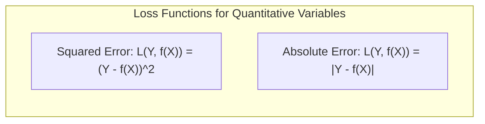

> 💡 **Exemplo Numérico:** Imagine que estamos tentando prever o preço de uma casa ($Y$) usando seu tamanho em metros quadrados ($X$). Se o preço real de uma casa for R\\$500.000 e nosso modelo prever R\\$480.000, o erro quadrático seria $(500000 - 480000)^2 = 20000^2 = 400.000.000$. O erro absoluto seria $|500000 - 480000| = 20000$.

Em essência, o problema de classificação busca mapear dados de entrada para classes discretas. Modelos lineares são frequentemente utilizados como primeiras abordagens devido à sua simplicidade e interpretabilidade. No entanto, o uso de modelos lineares pode introduzir um viés, que pode ser mitigado com modelos mais complexos, embora, aumente também a variância [^7.1]. É preciso, portanto, encontrar um equilíbrio para uma boa generalização.
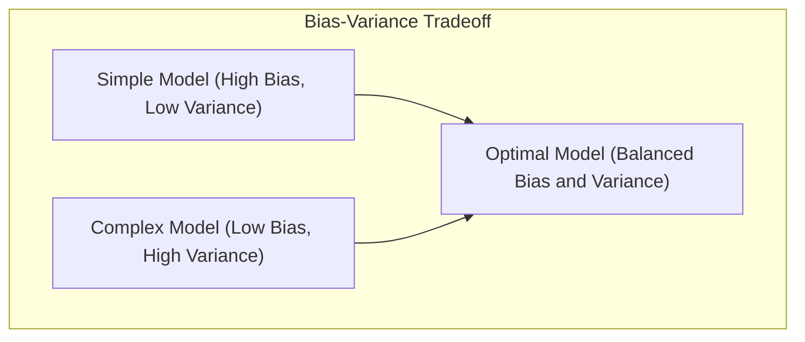
**Lemma 1:** Decomposição da Perda Esperada
A perda esperada para uma previsão $\hat{y}$ em relação a um valor verdadeiro $y$ pode ser expressa como:
$$E[(y-\hat{y})^2] = [E(\hat{y})-y]^2 + E[(\hat{y}-E(\hat{y}))^2]$$
Onde o primeiro termo corresponde ao quadrado do **viés** e o segundo à **variância** da previsão. Uma função discriminante linear $f(x) = w^Tx + b$ busca minimizar o erro de classificação, encontrando o hiperplano que melhor separa as classes. [^7.3] Este lemma ilustra que a minimização do erro esperado envolve encontrar um compromisso entre viés e variância. $\blacksquare$
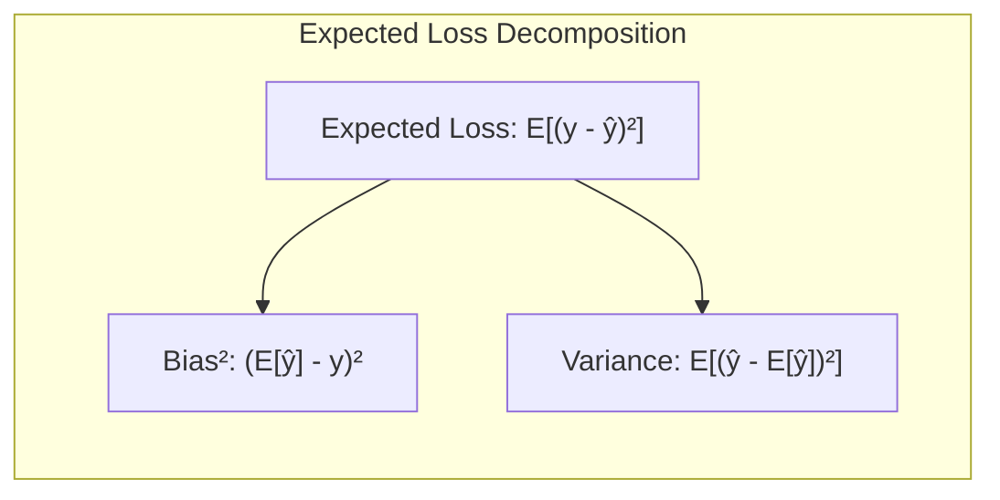

> 💡 **Exemplo Numérico:** Suponha que temos um modelo que prevê a probabilidade de um cliente clicar em um anúncio. Após várias execuções em diferentes conjuntos de dados, percebemos que a previsão média ($\hat{y}$) para um determinado cliente é de 0.6, mas a probabilidade real ($y$) para esse cliente é de 0.8. O viés seria $(0.6 - 0.8)^2 = 0.04$. Se as previsões individuais variarem bastante entre as execuções (por exemplo, em uma execução 0.5, em outra 0.7), a variância seria alta. Este exemplo ilustra como um modelo pode ter um viés mesmo que a sua variância seja alta.

**Conceito 2: Linear Discriminant Analysis (LDA)**

A **Linear Discriminant Analysis (LDA)** é um método de classificação que assume que os dados de cada classe seguem uma distribuição gaussiana com a mesma matriz de covariância [^7.3]. A decisão de classe é baseada na projeção dos dados em um subespaço que maximiza a separação entre as médias das classes, enquanto minimiza a variância intra-classe [^7.3.1].
Sob a suposição de que as classes seguem distribuições gaussianas com mesma covariância, o **LDA** gera uma fronteira de decisão linear [^7.3.2]. A função discriminante para a classe $k$ pode ser expressa como $\delta_k(x) = x^T\Sigma^{-1}\mu_k - \frac{1}{2}\mu_k^T\Sigma^{-1}\mu_k + \log(\pi_k)$, onde $\mu_k$ é a média, $\Sigma$ é a matriz de covariância comum, e $\pi_k$ é a probabilidade a priori da classe $k$ [^7.3.3].
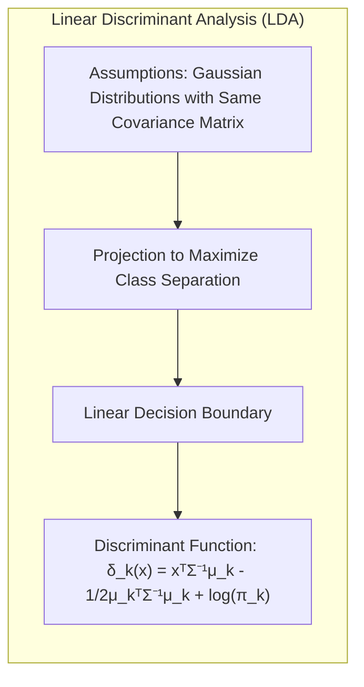

> 💡 **Exemplo Numérico:** Considere um problema de classificação com duas classes (A e B) onde os dados de cada classe são bidimensionais. Suponha que a classe A tenha média $\mu_A = [1, 1]$ e a classe B tenha média $\mu_B = [3, 3]$. A matriz de covariância comum seja $\Sigma = \begin{bmatrix} 1 & 0 \\ 0 & 1 \end{bmatrix}$. A função discriminante do LDA projetará os pontos de dados de forma a maximizar a separação entre as médias projetadas, enquanto minimiza a variância de cada classe projetada. Um novo ponto, $x = [2, 2]$, será classificado na classe que apresentar o maior valor de $\delta_k(x)$.
> $\delta_A(x) = [2, 2]^T \begin{bmatrix} 1 & 0 \\ 0 & 1 \end{bmatrix}^{-1} [1, 1] - \frac{1}{2} [1, 1]^T \begin{bmatrix} 1 & 0 \\ 0 & 1 \end{bmatrix}^{-1} [1, 1] + log(\pi_A)$
> $\delta_A(x) = [2, 2] [1, 1] - \frac{1}{2} [1, 1] [1, 1] + log(\pi_A) = 4 - 1 + log(\pi_A) = 3 + log(\pi_A)$
> $\delta_B(x) = [2, 2]^T \begin{bmatrix} 1 & 0 \\ 0 & 1 \end{bmatrix}^{-1} [3, 3] - \frac{1}{2} [3, 3]^T \begin{bmatrix} 1 & 0 \\ 0 & 1 \end{bmatrix}^{-1} [3, 3] + log(\pi_B)$
> $\delta_B(x) = [2, 2] [3, 3] - \frac{1}{2} [3, 3] [3, 3] + log(\pi_B) = 12 - 9/2 + log(\pi_B) = 7.5 + log(\pi_B)$
>  Se $\pi_A = \pi_B$, então, $\delta_B(x) > \delta_A(x)$ e o ponto x é classificado como classe B.

**Corolário 1:** Projeção em Subespaço
A projeção dos dados em um subespaço linear de dimensão $L < p$, em LDA,  minimiza a variância intra-classe e maximiza a separação entre as médias das classes, de acordo com a função discriminante linear [^7.3.1]. O número de projeções significativas é limitado pelo número de classes menos 1, $L \leq K-1$, conforme o teorema de Fisher.
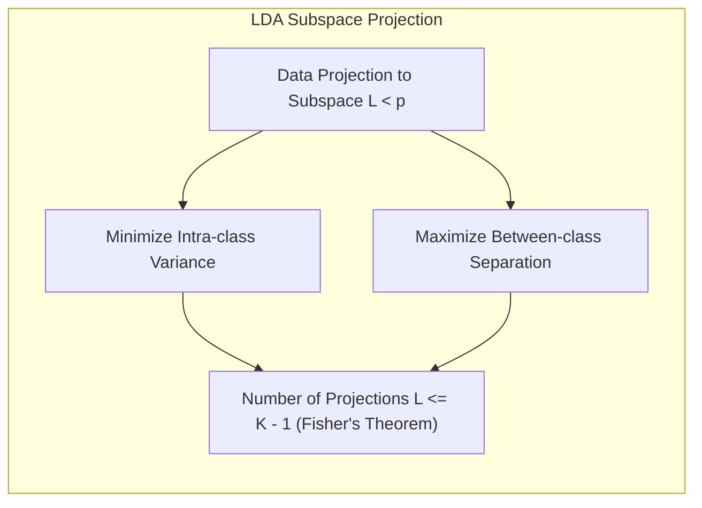

**Conceito 3: Regressão Logística**

A **Regressão Logística** é um modelo de classificação que modela a probabilidade de uma variável categórica binária (ou multinomial) em função de variáveis preditoras [^7.4]. A probabilidade de um evento é modelada utilizando a função logística (sigmoid), cujo inverso, o **logit**, é uma função linear nos preditores [^7.4.1].  
O modelo da Regressão Logística busca encontrar os parâmetros $\beta$ que maximizam a verossimilhança dos dados observados [^7.4.2]. A função de verossimilhança (likelihood) é dada por $L(\beta) = \prod_{i=1}^{N} p(x_i)^{y_i}(1-p(x_i))^{1-y_i}$, onde $p(x_i)$ é a probabilidade modelada pelo logit, $y_i$ é a resposta binária e $N$ é o número de observações [^7.4.3]. A função de perda utilizada para encontrar os parâmetros é a entropia cruzada (cross-entropy), que é equivalente a maximizar a log-verossimilhança [^7.4.4]. A regressão logística, quando comparada à LDA, não assume normalidade dos preditores, e tem como vantagem modelar as probabilidades de forma mais estável [^7.4.5].
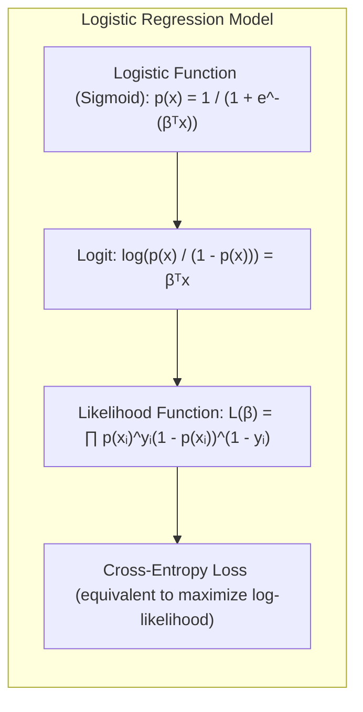

> 💡 **Exemplo Numérico:**  Suponha que estamos tentando prever se um cliente comprará um produto (variável binária: 1 = compra, 0 = não compra) com base em sua idade ($x$). O modelo de regressão logística pode ser expresso como:
> $p(x) = \frac{1}{1 + e^{-(\beta_0 + \beta_1x)}}$
> Digamos que, após o treinamento, encontramos $\beta_0 = -5$ e $\beta_1 = 0.1$. Para um cliente de 30 anos ($x = 30$), temos:
> $p(30) = \frac{1}{1 + e^{-(-5 + 0.1*30)}} = \frac{1}{1 + e^{-(-2)}} = \frac{1}{1 + e^2} \approx \frac{1}{1 + 7.389} \approx 0.119$
> Isso significa que a probabilidade estimada de um cliente de 30 anos comprar o produto é de aproximadamente 11.9%.
> A função de log-verossimilhança para um único ponto $(x_i, y_i)$ é $log(p(x_i)^{y_i}(1-p(x_i))^{1-y_i}) = y_i log(p(x_i)) + (1-y_i)log(1-p(x_i))$. O objetivo é encontrar os $\beta_0$ e $\beta_1$ que maximizam a soma das log-verossimilhanças para todo conjunto de dados.

> ⚠️ **Nota Importante**: É fundamental entender a diferença entre perda, erro, e as métricas de avaliação de modelo. As funções de perda são otimizadas durante o treino e usadas para guiar o aprendizado, enquanto as métricas de avaliação medem o desempenho do modelo [^7.4.1].

> ❗ **Ponto de Atenção**: Em problemas de classificação com classes desbalanceadas, métricas como acurácia podem ser enganosas. Métricas como precisão, recall, e F1-score são mais adequadas nesses casos [^7.4.2].

> ✔️ **Destaque**: Tanto em LDA quanto na regressão logística, o objetivo é encontrar um conjunto de parâmetros que defina uma fronteira de decisão linear, embora os métodos de estimativa dos parâmetros sejam diferentes [^7.5].

### Regressão Linear e Mínimos Quadrados para Classificação
<imagem: Um diagrama de fluxo mostrando o processo de regressão de indicadores para classificação, desde a codificação das classes até a aplicação da regra de decisão e comparação com modelos probabilísticos>

A regressão linear, aplicada a uma **matriz de indicadores**, pode ser utilizada como um método de classificação, onde cada classe é codificada como uma coluna de "dummy variables" [^7.2]. Os coeficientes são estimados via mínimos quadrados, buscando minimizar a soma dos quadrados dos erros. A decisão de classe é então determinada pelo maior valor entre as projeções em cada classe [^7.2].
Apesar de sua simplicidade, a regressão linear em matriz de indicadores tem algumas limitações: ela pode gerar probabilidades fora do intervalo [0,1], além de ser sensível a outliers e a covariância entre as classes. Apesar disso, em certas condições e quando o foco é a fronteira de decisão linear, essa abordagem pode ser suficiente [^7.2].
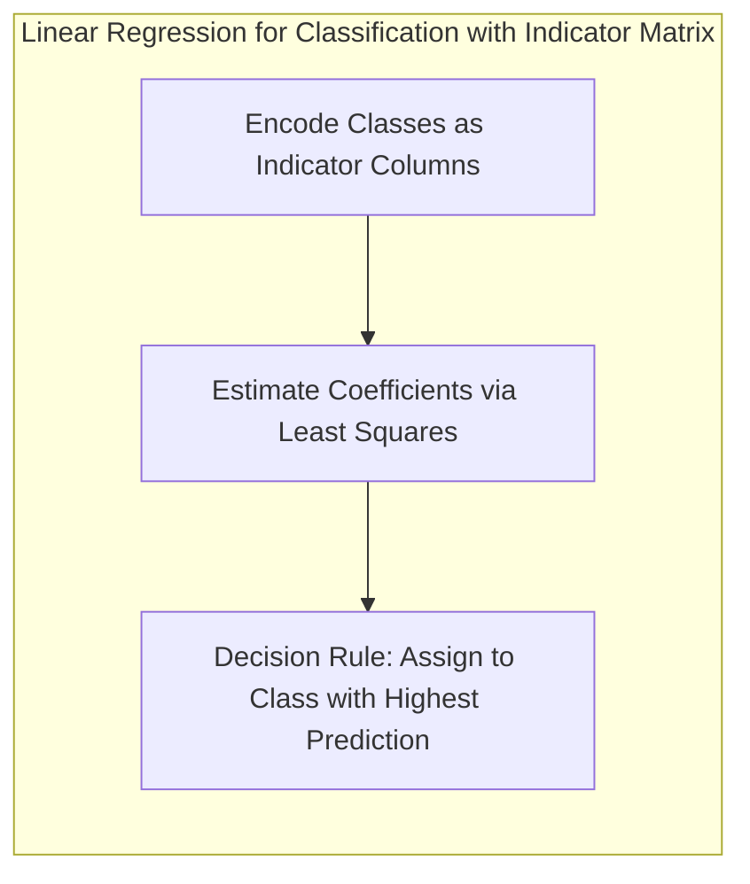

> 💡 **Exemplo Numérico:** Suponha que temos um problema de classificação com três classes (A, B e C). Criamos uma matriz de indicadores onde cada linha representa uma observação e cada coluna representa uma classe. Por exemplo, para uma observação da classe B, teríamos o vetor [0, 1, 0]. Após ajustar um modelo de regressão linear com essas variáveis indicadoras como preditoras, obtemos previsões para cada classe. Suponha que, para uma nova observação, as previsões sejam: classe A = 0.2, classe B = 0.7, classe C = 0.1. A classificação final seria a classe B, pois apresenta a maior previsão. É importante ressaltar que esses valores, diferentemente das probabilidades de modelos probabilísticos, não precisam somar 1 e podem, em alguns casos, ser valores negativos.

**Lemma 2:** Equivalência em Condições Específicas
Em certas condições, as projeções nos hiperplanos de decisão gerados pela regressão linear de indicadores e as projeções geradas pelas funções discriminantes lineares são equivalentes [^7.2]. Essa equivalência ocorre quando o objetivo principal é a obtenção de uma fronteira linear e as suposições de normalidade de LDA são quase satisfeitas.
A regressão de indicadores ajusta um modelo linear para cada classe, e a predição é feita com base na classe com o maior valor ajustado. $\blacksquare$
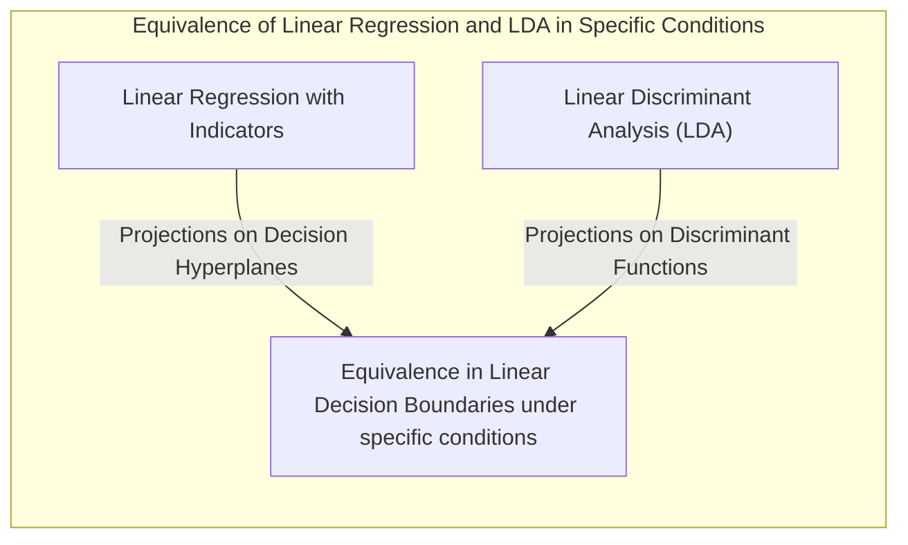

**Corolário 2:** Simplificação da Análise
A equivalência estabelecida no Lemma 2 demonstra que, em certos casos, a análise da fronteira de decisão através de regressão linear pode ser simplificada através de técnicas de análise discriminante, como LDA [^7.3]. Isso reduz a complexidade do problema e permite utilizar os conceitos e técnicas de LDA para melhor compreensão do problema.

Em cenários onde as probabilidades de classe são importantes, a regressão logística fornece estimativas mais estáveis, enquanto a regressão de indicadores pode extrapolar valores fora do intervalo [0,1]. No entanto, quando o foco está na fronteira de decisão, a regressão de indicadores pode ser vantajosa devido à sua simplicidade [^7.2].

### Métodos de Seleção de Variáveis e Regularização em Classificação
<imagem: Um mapa mental interconectando métodos de seleção de variáveis, regularização L1 e L2, modelos lineares, LDA, logistic regression e hyperplanes>

A seleção de variáveis e a **regularização** são técnicas essenciais para lidar com modelos de classificação que possuem um grande número de preditores [^7.5]. A regularização visa adicionar um termo de penalidade à função de perda para evitar *overfitting* e melhorar a generalização do modelo. As técnicas de regularização L1 (Lasso) e L2 (Ridge) são comumente utilizadas em modelos logísticos para controlar a complexidade e a estabilidade dos parâmetros [^7.4.4].
A penalização L1, comumente usada no LASSO, força alguns coeficientes a serem exatamente zero, resultando em modelos mais esparsos e facilitando a interpretação. Por outro lado, a penalização L2, utilizada no Ridge, reduz o tamanho dos coeficientes, evitando que o modelo se torne muito sensível a pequenos ruídos nos dados de treino [^7.4.4].
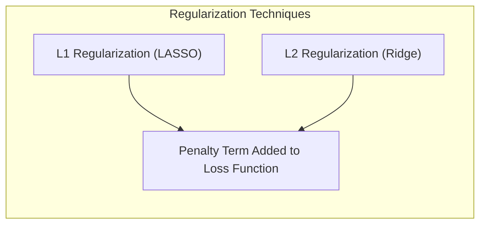

> 💡 **Exemplo Numérico:** Imagine um modelo de regressão logística para prever se um cliente vai cancelar um serviço. Temos 100 preditores, incluindo informações demográficas, histórico de uso, etc. Aplicando o LASSO com $\lambda = 0.1$, alguns dos coeficientes (digamos, 30) serão exatamente zero, indicando que esses preditores não são importantes para o modelo. Se usarmos Ridge com $\lambda = 0.1$, todos os coeficientes serão reduzidos, porém nenhum será exatamente zero. Um valor de $\lambda$ mais alto em ambos os casos resultaria em coeficientes ainda mais próximos de zero.

**Lemma 3:** Penalização L1 e Sparsidade
A penalização L1 em classificação logística promove soluções esparsas, ou seja, leva a que muitos coeficientes do modelo sejam exatamente iguais a zero [^7.4.4]. Este resultado é uma consequência da forma da função de penalização L1 e a forma como ela interage com a função de perda de verossimilhança.
O termo de penalidade L1 é da forma $\lambda \sum_{j=1}^p |\beta_j|$, onde $\lambda$ é o parâmetro de regularização. A otimização desta função com a função de perda de classificação leva a coeficientes exatamente zero em alguns casos. $\blacksquare$
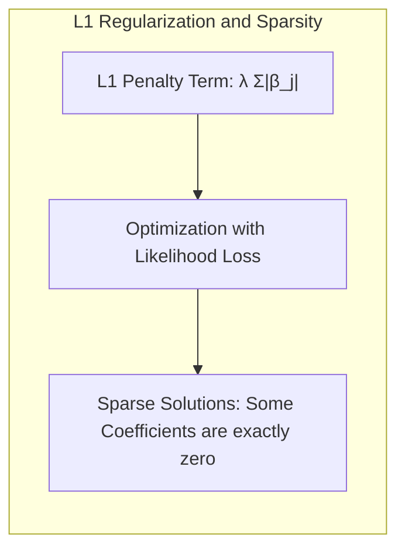

**Prova do Lemma 3:** A penalidade L1 tem uma descontinuidade na origem. Esta propriedade faz com que alguns coeficientes $\beta_j$ sejam forçados a zero durante a otimização por subgradiente e outros métodos de otimização relacionados [^7.4.3]. Essa característica contrasta com a penalidade L2, que apenas aproxima os parâmetros de zero. $\blacksquare$

**Corolário 3:** Interpretabilidade do Modelo
A propriedade de esparsidade induzida pela penalização L1 leva a modelos mais interpretáveis, pois somente os preditores mais relevantes (com coeficientes não nulos) são mantidos [^7.4.5]. Esta propriedade é vantajosa em aplicações onde se busca entender quais variáveis têm maior impacto na classificação.
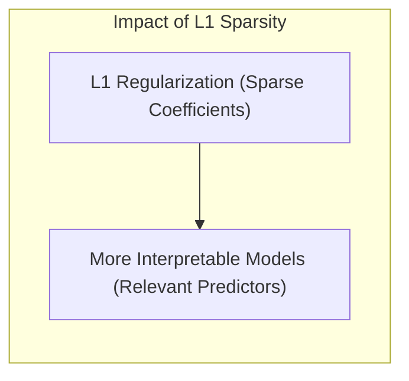

> ⚠️ **Ponto Crucial**: A combinação das penalidades L1 e L2 (Elastic Net) permite aproveitar as vantagens de ambas, combinando a seleção de variáveis da L1 com a estabilidade da L2 [^7.5].

### Separating Hyperplanes e Perceptrons
A ideia de maximizar a margem de separação entre classes leva ao conceito de **hiperplanos ótimos** [^7.5.2]. O objetivo é encontrar o hiperplano que melhor separa as classes, maximizando a distância entre este e as amostras mais próximas de cada classe (pontos de suporte). O problema de encontrar este hiperplano é geralmente formulado através da dualidade de Wolfe [^7.5.2]. A solução para esse problema envolve a combinação linear dos pontos de suporte.
O **Perceptron** de Rosenblatt é um algoritmo de aprendizado iterativo que busca encontrar um hiperplano que separe corretamente duas classes [^7.5.1]. O algoritmo ajusta os pesos do hiperplano com base nos erros de classificação, convergindo sob certas condições de separabilidade linear dos dados [^7.5.1].
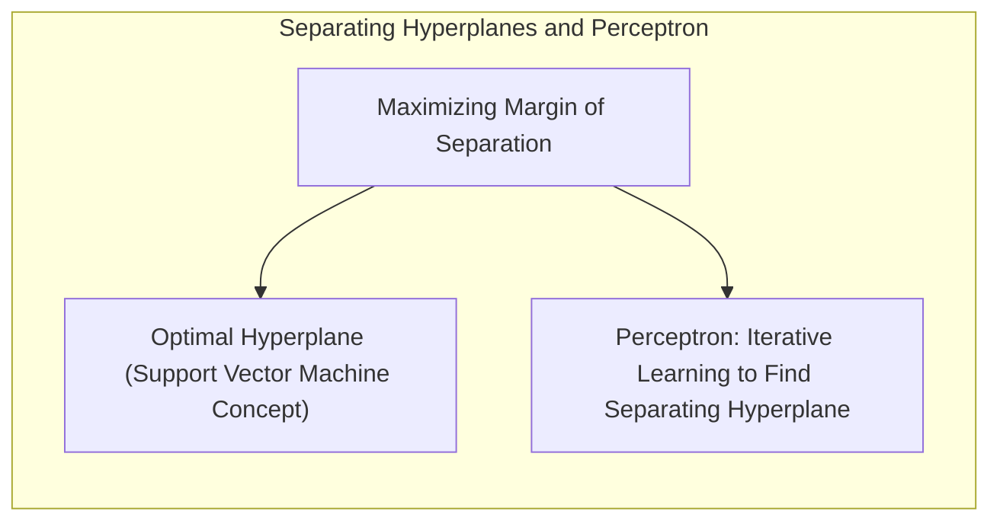

> 💡 **Exemplo Numérico:** Vamos considerar um conjunto de dados bidimensional onde temos duas classes (A e B) linearmente separáveis. O Perceptron começaria com um hiperplano (uma linha neste caso) aleatório. Se um ponto da classe A estiver do lado "errado" do hiperplano, o Perceptron ajusta os pesos para "empurrar" o hiperplano de forma que ele classifique o ponto corretamente. Ele itera esse processo para todos os pontos do conjunto de dados até encontrar um hiperplano que separe todas as amostras corretamente. O hiperplano ótimo seria aquele que maximiza a margem entre as classes.

### Pergunta Teórica Avançada: Quais as diferenças fundamentais entre a formulação de LDA e a Regra de Decisão Bayesiana considerando distribuições Gaussianas com covariâncias iguais?

**Resposta:**
Tanto o LDA quanto a Regra de Decisão Bayesiana podem ser usadas para problemas de classificação, especialmente quando as distribuições dos dados em cada classe são aproximadamente Gaussianas. Sob a suposição de que as classes possuem distribuições gaussianas com a mesma matriz de covariância, o LDA torna-se uma forma de aplicar a regra de decisão Bayesiana.
A regra de decisão Bayesiana atribui uma observação à classe que maximiza a probabilidade a posteriori $P(G=k|X=x)$, onde $G$ representa a classe e $X$ são os preditores. Sob a suposição de normalidade com covariâncias iguais, essa probabilidade é equivalente a comparar as funções discriminantes lineares que também são usadas no LDA.
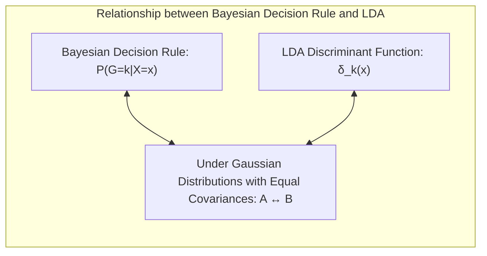
**Lemma 4:** Equivalência Formal
Sob a suposição de que as distribuições de cada classe são gaussianas com a mesma matriz de covariância, a decisão de classe baseada na regra de Bayes e o LDA são formalmente equivalentes [^7.3], [^7.3.3]. Essa equivalência surge porque ambas as abordagens buscam encontrar a fronteira de decisão que maximiza a separação entre as classes, que é linear nesse caso.

**Corolário 4:** Fronteiras Quadráticas
Ao relaxar a suposição de covariâncias iguais, surge uma forma mais geral da função discriminante que leva a fronteiras de decisão quadráticas, como no caso do Quadratic Discriminant Analysis (QDA) [^7.3]. Esta generalização permite lidar com casos onde as formas das distribuições de cada classe são diferentes.
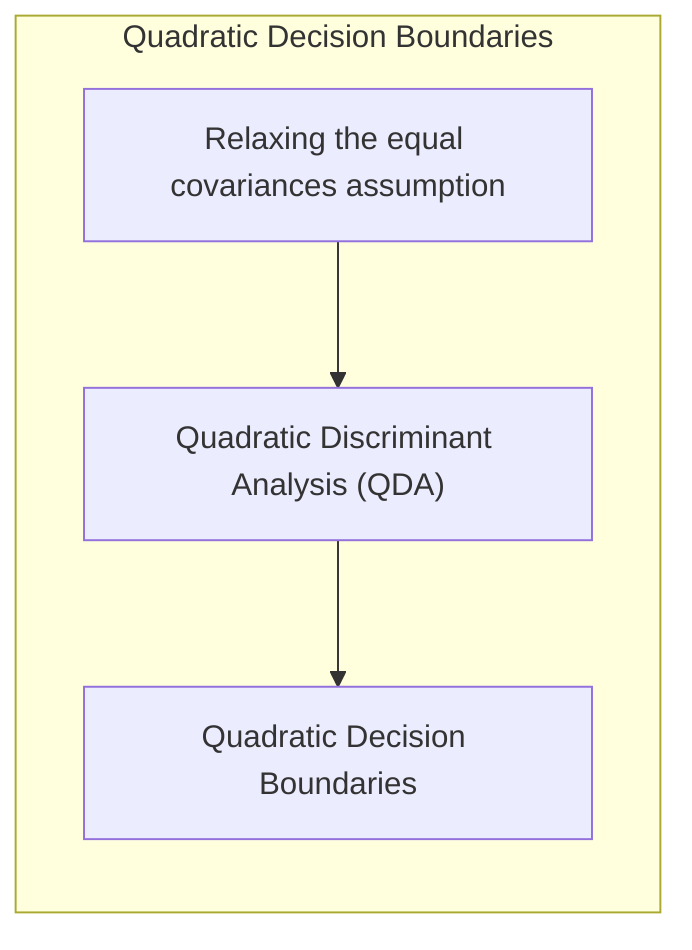

> ⚠️ **Ponto Crucial**: A escolha de considerar ou não covariâncias iguais impacta diretamente no tipo de fronteira de decisão (linear versus quadrática). A suposição de covariâncias iguais simplifica o problema, mas pode não ser adequada quando essa suposição não se sustenta [^7.3.1].

As perguntas devem ser altamente relevantes, **avaliar a compreensão profunda de conceitos teóricos-chave**, podem envolver derivações matemáticas e provas, e focar em análises teóricas.

### Conclusão
A seleção e avaliação de modelos são etapas cruciais no processo de *machine learning* e estatística. A escolha correta da função de perda, a compreensão do equilíbrio entre viés e variância, a utilização de métodos de regularização adequados, e a correta aplicação de técnicas de validação como a validação cruzada e o bootstrap são essenciais para construir modelos que generalizem bem para novos dados. A análise detalhada e comparação entre LDA, Regressão Logística, Separating Hyperplanes, e Perceptrons, quando aplicada de forma cuidadosa e teórica, permite construir modelos mais robustos e confiáveis.

<!-- END DOCUMENT -->
### Footnotes
[^7.1]: "The generalization performance of a learning method relates to its prediction capability on independent test data. Assessment of this performance is extremely important in practice, since it guides the choice of learning method or model, and gives us a measure of the quality of the ultimately chosen model." *(Trecho de <Model Assessment and Selection>)*
[^7.2]: "Figure 7.1 illustrates the important issue in assessing the ability of a learning method to generalize. Consider first the case of a quantitative or interval scale response. We have a target variable Y, a vector of inputs X, and a prediction model f(X) that has been estimated from a training set T." *(Trecho de <Model Assessment and Selection>)*
[^7.3]: "The story is similar for a qualitative or categorical response G taking one of K values in a set G, labeled for convenience as 1, 2, ..., K. Typically we model the probabilities pk(X) = Pr(G = k|X) (or some monotone transformations f(X)), and then Ĝ(X) = arg maxk f(X). In some cases, such as 1-nearest neighbor classification (Chapters 2 and 13) we produce G(X) directly." *(Trecho de <Model Assessment and Selection>)*
[^7.3.1]: "Test error, also referred to as generalization error, is the prediction error over an independent test sample" *(Trecho de <Model Assessment and Selection>)*
[^7.3.2]: "Test error, also referred to as generalization error, is the prediction error over an independent test sample" *(Trecho de <Model Assessment and Selection>)*
[^7.3.3]: "Test error, also referred to as generalization error, is the prediction error over an independent test sample" *(Trecho de <Model Assessment and Selection>)*
[^7.4]: "Training error is the average loss over the training sample" *(Trecho de <Model Assessment and Selection>)*
[^7.4.1]: "In this chapter we describe a number of methods for estimating the expected test error for a model. Typically our model will have a tuning parameter or parameters a and so we can write our predictions as fa(x)." *(Trecho de <Model Assessment and Selection>)*
[^7.4.2]: "The methods in this chapter are designed for situations where there is insufficient data to split it into three parts. Again it is too difficult to give a general rule on how much training data is enough; among other things, this depends on the signal-to-noise ratio of the underlying function, and the complexity of the models being fit to the data." *(Trecho de <Model Assessment and Selection>)*
[^7.4.3]: "We would like to know the expected test error of our estimated model f. As the model becomes more and more complex, it uses the training data more and is able to adapt to more complicated underlying structures." *(Trecho de <Model Assessment and Selection>)*
[^7.4.4]: "For a linear model family such as ridge regression, we can break down the bias more finely. Let β denote the parameters of the best-fitting linear approximation to f" *(Trecho de <Model Assessment and Selection>)*
[^7.4.5]: "For linear models fit by ordinary least squares, the estimation bias is zero. For restricted fits, such as ridge regression, it is positive, and we trade it off with the benefits of a reduced variance." *(Trecho de <Model Assessment and Selection>)*
[^7.5]: "Here we assume for simplicity that training inputs xi are fixed, and the randomness arises from the yi. The number of neighbors k is inversely related to the model complexity. For small k, the estimate f(x) can potentially adapt itself better to the underlying f(x)" *(Trecho de <Model Assessment and Selection>)*
[^7.5.1]: "For a linear model fit f(x) = xTß, where the parameter vector ẞ with p components is fit by least squares, we have" *(Trecho de <Model Assessment and Selection>)*
[^7.5.2]: "The methods of this chapter approximate the validation step either analytically (AIC, BIC, MDL, SRM) or by efficient sample re-use (cross-validation and the bootstrap)." *(Trecho de <Model Assessment and Selection>)*
