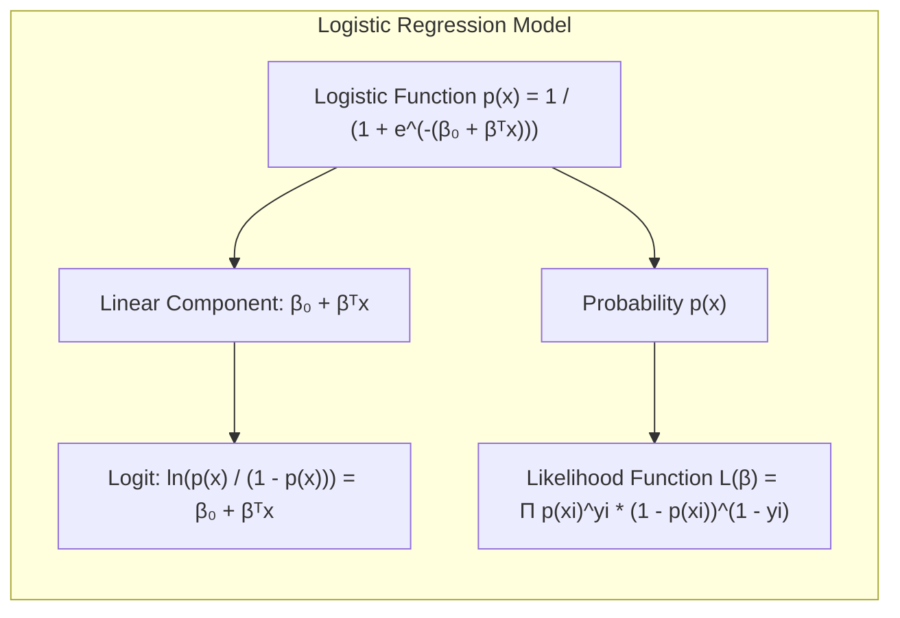
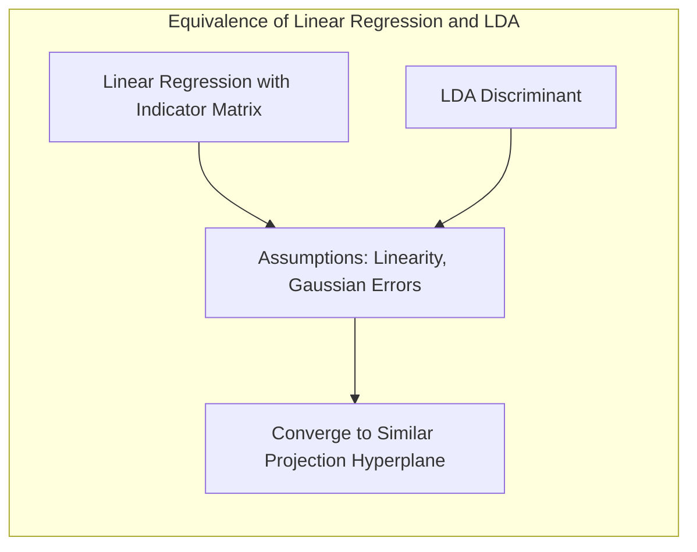
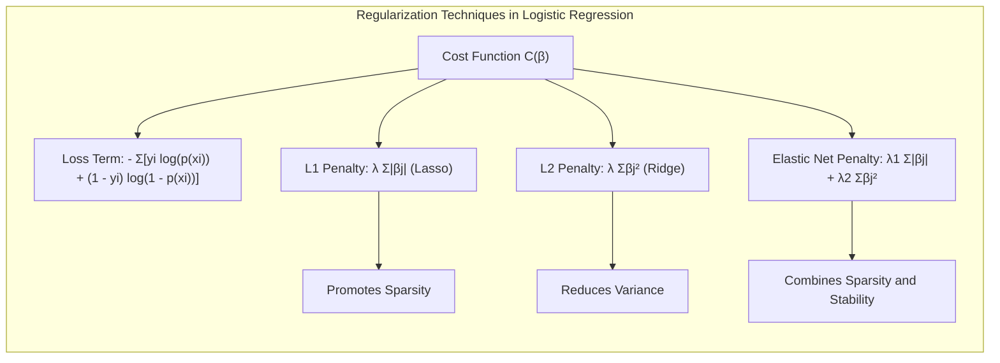
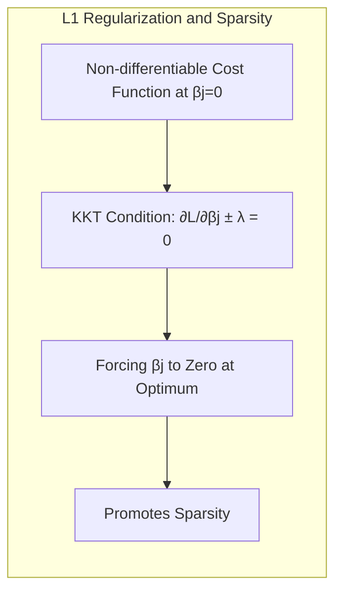

## Avaliação e Seleção de Modelos: Foco no Erro de Generalização

<imagem: Um diagrama complexo mostrando o fluxo de avaliação do modelo, desde a divisão dos dados em treinamento, validação e teste até a análise de bias-variância e a seleção final, conectando as diferentes métricas de avaliação de desempenho>

**Introdução**

A capacidade de um método de aprendizado predizer corretamente em dados não vistos, conhecida como **generalização**, é crucial para sua aplicabilidade prática [^7.1]. A avaliação do desempenho de um modelo, portanto, torna-se um passo essencial, orientando a escolha do método de aprendizado ou modelo e proporcionando uma medida da qualidade do modelo selecionado [^7.1]. Este capítulo aborda métodos para avaliação de desempenho e como eles são empregados na seleção de modelos. O tema inicial é a discussão da relação entre **bias, variância e complexidade do modelo** [^7.1].

### Conceitos Fundamentais

**Conceito 1:** O problema de **classificação** visa categorizar dados em classes predefinidas com base em suas características. Métodos lineares são frequentemente empregados devido à sua simplicidade e interpretabilidade, mesmo que possam introduzir um viés ou uma variância maior em comparação com métodos não lineares [^7.2]. O equilíbrio entre bias e variância é crucial: modelos muito simples tendem a ter alto bias e baixa variância, enquanto modelos muito complexos apresentam o oposto [^7.2].

> 💡 **Exemplo Numérico:**
>
> Vamos considerar um problema de classificação binária onde queremos prever se um cliente vai comprar um produto (classe 1) ou não (classe 0) baseado em sua idade (feature x).
>
> *   **Modelo Simples (Alto Bias, Baixa Variância):** Um modelo que sempre prediz a classe majoritária, independentemente da idade (ex: sempre prediz "não vai comprar"), terá um alto viés (bias) porque ignora a relação entre idade e compra. No entanto, a variância será baixa porque a predição não muda muito, independentemente do conjunto de treinamento.
> *   **Modelo Complexo (Baixo Bias, Alta Variância):** Um modelo que ajusta uma função muito complexa (ex: um polinômio de grau muito alto) aos dados de treinamento pode ter baixo viés porque se adapta perfeitamente aos dados de treinamento. No entanto, essa alta complexidade levará a uma alta variância, ou seja, pequenas mudanças nos dados de treinamento podem levar a grandes mudanças na função de predição.
>
> Para visualizar isso, imagine ajustar uma reta a um conjunto de dados. Se a reta for muito simples (ex: uma constante), ela terá alto bias (não capturando a relação real). Se a reta for muito complexa (ex: um polinômio de grau alto, cheio de curvas), ela terá baixa bias nos dados de treino, mas uma alta variância, se ajustando em excesso a ruídos.
>
>  ```mermaid
>  graph LR
>      A["Modelo Simples"] --> B["Alto Bias"];
>      A --> C["Baixa Variância"];
>      D["Modelo Complexo"] --> E["Baixo Bias"];
>      D --> F["Alta Variância"];
>  ```
>

**Lemma 1:** Considere um modelo de classificação linear $f(x) = w^T x + b$, onde $w$ são os pesos, $x$ são as features, e $b$ é o bias. Em um espaço de características de alta dimensionalidade, a variância das estimativas de $w$ aumenta, enquanto o bias pode ser reduzido com a inclusão de mais features. A complexidade do modelo linear é regulada, por exemplo, pela penalização dos pesos (regularização) [^7.2].

> 💡 **Exemplo Numérico:**
> Suponha que tenhamos um modelo linear para prever o preço de uma casa (\\$y$) com base em duas features: número de quartos ($x_1$) e tamanho em metros quadrados ($x_2$). O modelo seria $y = w_1x_1 + w_2x_2 + b$.
>
> *   **Poucas features:** Se tivermos apenas o número de quartos, o modelo seria $y = w_1x_1 + b$. Isso pode levar a um alto bias, já que ignora o tamanho da casa, que também é relevante para o preço. No entanto, a variância de $w_1$ seria baixa porque há menos fatores que podem mudar seu valor.
> *   **Muitas features:** Se adicionarmos, digamos, 100 features (incluindo características como localização, idade da casa, etc), podemos reduzir o bias, pois o modelo tem mais informações para trabalhar. No entanto, a variância dos pesos $w_1, w_2... w_{100}$ aumentará, pois cada peso será mais sensível aos dados de treino.
>
> A regularização, como a penalização L2 (Ridge), ajuda a controlar a magnitude dos pesos, reduzindo a variância, mesmo com muitas features.
> ```mermaid
>  graph LR
>     subgraph "Model Complexity & Feature Space"
>       direction TB
>       A["Few Features"] --> B["High Bias"];
>       A --> C["Low Variance of Weights"];
>       D["Many Features"] --> E["Low Bias"];
>       D --> F["High Variance of Weights"];
>     end
>  ```

**Conceito 2:** A **Linear Discriminant Analysis (LDA)** é um método de classificação que assume que os dados de cada classe seguem uma distribuição normal com a mesma matriz de covariância [^7.3]. A função discriminante linear, dada por $\delta_k(x) = x^T\Sigma^{-1}\mu_k - \frac{1}{2}\mu_k^T\Sigma^{-1}\mu_k + log(\pi_k)$, onde $\Sigma$ é a matriz de covariância, $\mu_k$ é a média da classe *$k$* e $\pi_k$ é a probabilidade a priori da classe *$k$*,  gera uma fronteira de decisão linear entre as classes, que é ótima quando as premissas do modelo são atendidas [^7.3.1]. A LDA busca projetar os dados em um subespaço que maximize a separação entre as classes e minimize a variabilidade dentro das classes [^7.3.2].  Para isso, busca o espaço que maximize a razão de variância inter-classes para variância intra-classes, formalmente expressa como $max_W \frac{W^T S_B W}{W^T S_W W}$, onde $S_B$ é a matriz de variância inter-classes e $S_W$ é a matriz de variância intra-classes [^7.3.3].

> 💡 **Exemplo Numérico:**
>
> Suponha um problema de classificação com duas classes (A e B) e duas features ($x_1$ e $x_2$). Temos os seguintes dados de exemplo:
>
> *   **Classe A:** 
>     *   Média: $\mu_A = \begin{bmatrix} 1 \\ 1 \end{bmatrix}$
>     *   Dados:  $(1.2, 0.8), (0.9, 1.1), (0.8, 0.9), (1.1, 1.2)$
> *   **Classe B:**
>     *   Média: $\mu_B = \begin{bmatrix} 3 \\ 3 \end{bmatrix}$
>     *   Dados: $(2.8, 3.2), (3.1, 2.9), (2.9, 3.1), (3.2, 2.8)$
>
> Assumindo que a matriz de covariância comum ($\Sigma$) é a matriz identidade $\begin{bmatrix} 1 & 0 \\ 0 & 1 \end{bmatrix}$ (para simplificar). Também vamos considerar que as probabilidades a priori são iguais, ou seja, $\pi_A = \pi_B = 0.5$.
>
> *   **Cálculo da função discriminante para a Classe A ($\delta_A(x)$):**
>     $\delta_A(x) = x^T \Sigma^{-1} \mu_A - \frac{1}{2} \mu_A^T \Sigma^{-1} \mu_A + log(\pi_A)$
>     $\delta_A(x) = x^T \begin{bmatrix} 1 & 0 \\ 0 & 1 \end{bmatrix}^{-1} \begin{bmatrix} 1 \\ 1 \end{bmatrix} - \frac{1}{2} \begin{bmatrix} 1 & 1 \end{bmatrix} \begin{bmatrix} 1 & 0 \\ 0 & 1 \end{bmatrix}^{-1} \begin{bmatrix} 1 \\ 1 \end{bmatrix} + log(0.5)$
>     $\delta_A(x) = \begin{bmatrix} x_1 & x_2 \end{bmatrix} \begin{bmatrix} 1 \\ 1 \end{bmatrix} - \frac{1}{2} \begin{bmatrix} 1 & 1 \end{bmatrix} \begin{bmatrix} 1 \\ 1 \end{bmatrix} + log(0.5)$
>     $\delta_A(x) = x_1 + x_2 - 1 - 0.693 \approx x_1 + x_2 - 1.693$
>
> *   **Cálculo da função discriminante para a Classe B ($\delta_B(x)$):**
>     $\delta_B(x) = x^T \Sigma^{-1} \mu_B - \frac{1}{2} \mu_B^T \Sigma^{-1} \mu_B + log(\pi_B)$
>     $\delta_B(x) = x^T \begin{bmatrix} 1 & 0 \\ 0 & 1 \end{bmatrix}^{-1} \begin{bmatrix} 3 \\ 3 \end{bmatrix} - \frac{1}{2} \begin{bmatrix} 3 & 3 \end{bmatrix} \begin{bmatrix} 1 & 0 \\ 0 & 1 \end{bmatrix}^{-1} \begin{bmatrix} 3 \\ 3 \end{bmatrix} + log(0.5)$
>    $\delta_B(x) = \begin{bmatrix} x_1 & x_2 \end{bmatrix} \begin{bmatrix} 3 \\ 3 \end{bmatrix} - \frac{1}{2} \begin{bmatrix} 3 & 3 \end{bmatrix} \begin{bmatrix} 3 \\ 3 \end{bmatrix} + log(0.5)$
>     $\delta_B(x) = 3x_1 + 3x_2 - 9 - 0.693 \approx 3x_1 + 3x_2 - 9.693$
>
> Um novo ponto $x=(2,2)$ seria classificado comparando $\delta_A(2,2) = 2 + 2 - 1.693 = 2.307$ com $\delta_B(2,2) = 3*2 + 3*2 - 9.693= 2.307$.
>
> Para visualizar a matriz de variância interclasses ($S_B$) e intraclasses ($S_W$):
> $S_B = (\mu_A - \mu_B)(\mu_A - \mu_B)^T = \begin{bmatrix} -2 \\ -2 \end{bmatrix} \begin{bmatrix} -2 & -2 \end{bmatrix} = \begin{bmatrix} 4 & 4 \\ 4 & 4 \end{bmatrix} $
> $S_W = \frac{1}{n_A+n_B -2} \left(\sum_{i\in \text{Classe A}}(x_i - \mu_A)(x_i - \mu_A)^T + \sum_{j\in \text{Classe B}}(x_j - \mu_B)(x_j - \mu_B)^T\right)$
>  $S_W \approx \begin{bmatrix} 0.13 & 0 \\ 0 & 0.13\end{bmatrix}$
>
> A LDA projetaria os dados em um espaço onde $\frac{W^T S_B W}{W^T S_W W}$ é maximizado, o que maximiza a separação entre as classes.
> ```mermaid
> graph LR
>     subgraph "LDA Discriminant Function"
>         direction TB
>        A["Discriminant Function δk(x)"]
>        B["Class Mean Term: xᵀΣ⁻¹μk"]
>        C["Quadratic Term: -1/2 * μkᵀΣ⁻¹μk"]
>        D["Prior Term: log(πk)"]
>        A --> B
>        A --> C
>        A --> D
>     end
>
>  ```

**Corolário 1:** A função discriminante linear da LDA pode ser reescrita como uma projeção no espaço definido pela matriz de autovetores de  $S_W^{-1}S_B$, simplificando a análise e a interpretação do modelo. Cada autovetor corresponde a uma direção de máxima separação entre classes [^7.3.1].


**Conceito 3:** A **Logistic Regression** modela a probabilidade de um evento binário, usando a função logística $p(x) = \frac{1}{1+e^{-(\beta_0 + \beta^T x)}}$, onde $x$ são as features e $\beta$ são os parâmetros do modelo [^7.4]. O logit, definido como $ln(\frac{p(x)}{1-p(x)}) = \beta_0 + \beta^T x$, estabelece uma relação linear entre as features e o log-odds da probabilidade de ocorrência do evento [^7.4.1]. Os parâmetros do modelo são estimados por meio da maximização da verossimilhança (likelihood) [^7.4.2]. A função de verossimilhança, no contexto da regressão logística, é dada por $L(\beta) = \prod_{i=1}^n p(x_i)^{y_i}(1-p(x_i))^{1-y_i}$, onde $y_i \in \{0, 1\}$ é a classe observada para o i-ésimo dado. A maximização de L é equivalente à maximização de seu logaritmo [^7.4.3]. A escolha entre LDA e regressão logística depende das premissas sobre a distribuição dos dados e da natureza do problema [^7.4.5]. Se os dados seguem uma distribuição gaussiana e a variância é compartilhada entre as classes, a LDA pode ser preferível, enquanto a regressão logística é mais robusta em relação a essas premissas [^7.4.4].

> 💡 **Exemplo Numérico:**
>
> Vamos considerar um problema de prever se um estudante será aprovado em um exame (y=1) ou não (y=0) com base em suas horas de estudo (x).
>
> Suponha que após ajustar o modelo de regressão logística, os parâmetros estimados sejam: $\beta_0 = -4$ e $\beta_1 = 0.8$. Isso significa que o modelo é dado por:
>
> $p(x) = \frac{1}{1+e^{-(-4 + 0.8x)}}$
>
> *   **Interpretação dos parâmetros:**
>    *   $\beta_1 = 0.8$: Para cada hora adicional de estudo, o log-odds de aprovação aumenta em 0.8. Isso indica que quanto mais o estudante estuda, maior a probabilidade de aprovação.
>    *   $\beta_0 = -4$:  O log-odds de aprovação para um estudante que não estuda (x=0) é -4, o que indica uma probabilidade de aprovação muito baixa.
>
> *   **Cálculo da Probabilidade:**
>    *   Para um estudante que estuda 5 horas (x=5), a probabilidade de aprovação é:
>        $p(5) = \frac{1}{1+e^{-(-4 + 0.8*5)}} = \frac{1}{1+e^{0}} = \frac{1}{1+1} = 0.5$
>    *  Para um estudante que estuda 10 horas (x=10), a probabilidade de aprovação é:
>       $p(10) = \frac{1}{1+e^{-(-4 + 0.8*10)}} = \frac{1}{1+e^{-4}} \approx 0.98$
>
> *   **Função de Verossimilhança:**
>     Suponha que temos os dados:
>       * Estudante 1: x=5, y=0
>       * Estudante 2: x=10, y=1
>    A verossimilhança seria $L(\beta) = p(5)^0 * (1-p(5))^1 * p(10)^1 * (1-p(10))^0 = (1-0.5) * 0.98 = 0.49$
>    O objetivo é maximizar essa verossimilhança.
>
> A regressão logística modela a probabilidade usando a função logística, enquanto a LDA faz isso implicitamente através da função discriminante, baseada em distribuições Gaussianas.
>

> ⚠️ **Nota Importante**: Em casos de classes não balanceadas, é essencial ajustar os pesos ou usar outras técnicas para evitar que o modelo seja enviesado para a classe majoritária [^7.4.1].
> ❗ **Ponto de Atenção**: A regressão logística é menos sensível a outliers em comparação com a LDA, o que pode ser uma vantagem em conjuntos de dados ruidosos [^7.4.2].
> ✔️ **Destaque**: Em certas condições, as estimativas dos parâmetros nos modelos LDA e regressão logística podem convergir para soluções similares [^7.5].

### Regressão Linear e Mínimos Quadrados para Classificação

<imagem: Diagrama de fluxo mostrando o processo de aplicação da regressão linear para classificação, desde a codificação das classes através de uma matriz de indicadores até a aplicação da regra de decisão e comparação com métodos probabilísticos.>

A regressão linear pode ser aplicada à classificação usando uma **matriz de indicadores** para codificar as classes, em que cada coluna indica a pertinência de um dado a uma classe específica [^7.2]. A regressão linear busca então, ajustar os parâmetros do modelo minimizando os erros quadráticos [^7.1]. O modelo resultante permite classificar novos dados com base na classe com maior valor previsto pelo modelo [^7.2].
Entretanto, este método possui limitações. Por exemplo, a estimativa da probabilidade de um evento através da regressão linear pode resultar em valores fora do intervalo [0, 1], além de ser mais sensível a outliers [^7.2]. A regressão de indicadores, apesar de sua simplicidade, pode não ser ideal para problemas com grande número de classes ou para obter estimativas probabilísticas precisas. A influência de covariância entre classes é outro aspecto a se considerar, que é explicitamente abordado pela LDA [^7.3].

> 💡 **Exemplo Numérico:**
> Suponha um problema de classificação binária com uma única feature (x) e duas classes (0 e 1). Temos os seguintes dados:
>
> | x | Classe |
> |---|--------|
> | 1 | 0      |
> | 2 | 0      |
> | 3 | 1      |
> | 4 | 1      |
>
>  1. **Matriz de Indicadores:** Criamos uma coluna indicadora para a classe 1.
>
> | x | Classe 1 (y) |
> |---|--------------|
> | 1 | 0            |
> | 2 | 0            |
> | 3 | 1            |
> | 4 | 1            |
>
>  2. **Regressão Linear:** Ajustamos o modelo linear $y = \beta_0 + \beta_1 x$ aos dados. Usando o método dos mínimos quadrados, podemos estimar os parâmetros:
>     $\beta = (X^TX)^{-1}X^Ty$, onde $X$ é a matriz com valores de $x$ e um vetor de 1's para $\beta_0$, e $y$ é o vetor de classes (0 ou 1).
>
> ```python
> import numpy as np
> from sklearn.linear_model import LinearRegression
>
> X = np.array([[1,1], [1,2], [1,3], [1,4]]) # Matriz com 1's para o intercepto e os valores de x
> y = np.array([0, 0, 1, 1])
>
> model = LinearRegression()
> model.fit(X, y)
> beta0 = model.intercept_
> beta1 = model.coef_[1]
>
> print(f"beta0: {beta0}, beta1: {beta1}")
> ```
>
> Executando o código, obtemos $\beta_0 \approx -0.5$ e $\beta_1 \approx 0.5$.
>
> 3. **Regra de Decisão:** Para classificar um novo ponto, por exemplo, x = 2.5, calculamos:
>    $y = -0.5 + 0.5 * 2.5 = 0.75$. Como $y$ é maior que 0.5, classificamos como classe 1.
>
> **Limitações:** Se tivéssemos um outlier na classe 0 com x=6, a regressão linear poderia ser muito influenciada por esse ponto, levando a resultados imprecisos. Além disso, as previsões da regressão linear podem ser valores fora do intervalo \[0, 1], dificultando a interpretação como probabilidades.

**Lemma 2:** Sob certas condições, a projeção de dados em um hiperplano de decisão, gerada por uma regressão linear aplicada a uma matriz de indicadores, é equivalente à projeção obtida por um discriminante linear, especialmente quando as classes são aproximadamente lineares e os erros seguem uma distribuição gaussiana. Essa equivalência surge da solução dos problemas de otimização que resultam na regressão linear e na LDA, onde a projeção é definida por um vetor que maximiza a separação das médias entre as classes e minimiza a variância dentro das classes [^7.2].


**Corolário 2:** Em problemas de classificação com classes bem separadas e distribuições gaussianas, a solução da regressão linear com matriz de indicadores pode fornecer uma aproximação adequada à solução da LDA. Isso simplifica a implementação e a análise do modelo, pois a regressão linear é mais amplamente conhecida e compreendida do que o método LDA [^7.3].
> Em alguns cenários, conforme apontado em [^7.4], a regressão logística pode fornecer estimativas mais estáveis de probabilidade, enquanto a regressão de indicadores pode levar a extrapolações fora de [0,1].
> No entanto, há situações em que a regressão de indicadores, de acordo com [^7.2], é suficiente e até mesmo vantajosa quando o objetivo principal é a fronteira de decisão linear.

### Métodos de Seleção de Variáveis e Regularização em Classificação

<imagem: Um mapa mental conectando as técnicas de regularização (L1, L2 e Elastic Net) com seus efeitos nos modelos de classificação (Logistic Regression, LDA e Hyperplanes) e seus impactos na esparsidade, estabilidade e interpretabilidade do modelo.>

A seleção de variáveis e a regularização são técnicas fundamentais para lidar com a complexidade e o overfitting em modelos de classificação. A regularização adiciona uma penalidade à função de custo que visa reduzir o impacto de variáveis menos relevantes e evitar que os modelos se adaptem excessivamente aos dados de treinamento [^7.4.4]. A **penalização L1** (Lasso) adiciona à função de custo a soma dos valores absolutos dos coeficientes, promovendo a esparsidade, ou seja, reduzindo alguns coeficientes a zero, o que melhora a interpretabilidade e a seleção de variáveis [^7.5]. Matematicamente, a função de custo com penalização L1 para regressão logística é definida como $C(\beta) = - \sum_{i=1}^{n}[y_i \log(p(x_i)) + (1-y_i) \log(1-p(x_i))] + \lambda \sum_{j=1}^p |\beta_j|$, onde $\lambda$ é um parâmetro de ajuste que controla a intensidade da regularização [^7.4.4]. A **penalização L2** (Ridge) adiciona o quadrado dos coeficientes, o que tende a encolher os coeficientes em direção a zero, reduzindo a variância e estabilizando o modelo [^7.5.1]. A função de custo com penalização L2 para regressão logística é dada por $C(\beta) = - \sum_{i=1}^{n}[y_i \log(p(x_i)) + (1-y_i) \log(1-p(x_i))] + \lambda \sum_{j=1}^p \beta_j^2$ [^7.4.4]. A penalização **Elastic Net** combina as penalidades L1 e L2, proporcionando um equilíbrio entre as vantagens de ambos os métodos [^7.5].

> 💡 **Exemplo Numérico:**
>
> Vamos usar um exemplo de regressão logística para classificação binária com duas features ($x_1$ e $x_2$). Suponha que o modelo sem regularização resulte em: $\beta_0 = 0.5$, $\beta_1 = 1.2$, $\beta_2 = -0.8$.
>
> *   **Penalização L1 (Lasso):**
>     *   Suponha que $\lambda = 0.5$. A função de custo a ser minimizada é:
>         $C(\beta) = - \sum_{i=1}^{n}[y_i \log(p(x_i)) + (1-y_i) \log(1-p(x_i))] + 0.5(|\beta_1| + |\beta_2|)$
>     *   Após otimizar, podemos obter: $\beta_0 = 0.4$, $\beta_1 = 0.8$, $\beta_2 = 0$. Observe que $\beta_2$ foi zerado pela penalização L1, o que significa que a feature $x_2$ foi excluída do modelo, promovendo esparsidade.
> *   **Penalização L2 (Ridge):**
>     *   Suponha que $\lambda = 0.5$. A função de custo a ser minimizada é:
>           $C(\beta) = - \sum_{i=1}^{n}[y_i \log(p(x_i)) + (1-y_i) \log(1-p(x_i))] + 0.5(\beta_1^2 + \beta_2^2)$
>     *   Após otimizar, podemos obter: $\beta_0 = 0.45$, $\beta_1 = 0.9$, $\beta_2 = -0.6$. Observe que os coeficientes são menores, mas nenhum foi zerado.
> *  **Penalização Elastic Net:**
>     *   Combinação de L1 e L2. Por exemplo $\lambda_1 = 0.25$ e $\lambda_2 = 0.25$.
>     *  $C(\beta) = - \sum_{i=1}^{n}[y_i \log(p(x_i)) + (1-y_i) \log(1-p(x_i))] + 0.25(|\beta_1| + |\beta_2|) + 0.25(\beta_1^2 + \beta_2^2)$
>     *   Após otimizar, podemos obter: $\beta_0 = 0.42$, $\beta_1 = 0.75$, $\beta_2 = -0.1$.  Neste caso, os coeficientes diminuem, mas sem zerar nenhum.
>
>
>  | Método       | $\beta_0$ | $\beta_1$ | $\beta_2$ |
> |--------------|----------|----------|----------|
> | Sem Reg.      | 0.5      | 1.2      | -0.8     |
> | L1 (Lasso)   | 0.4      | 0.8      | 0        |
> | L2 (Ridge)   | 0.45     | 0.9      | -0.6     |
> | Elastic Net | 0.42     | 0.75     | -0.1    |
>
> A regularização L1 promove a seleção de variáveis (esparsidade), enquanto a L2 estabiliza os coeficientes. O Elastic Net combina as vantagens de ambas.
>
> ```python
> import numpy as np
> from sklearn.linear_model import LogisticRegression
> from sklearn.preprocessing import StandardScaler
>
> # Dados de exemplo
> X = np.array([[1, 2], [2, 3], [3, 1], [4, 4], [5, 3], [6, 2]]) # Features
> y = np.array([0, 0, 1, 1, 1, 0])  # Classes
>
> # Padronizar as features
> scaler = StandardScaler()
> X_scaled = scaler.fit_transform(X)
>
> # Logistic Regression sem Regularização
> model_no_reg = LogisticRegression(penalty=None)
> model_no_reg.fit(X_scaled, y)
> print("Sem regularização:", model_no_reg.intercept_, model_no_reg.coef_)
>
> # Logistic Regression com Regularização L1 (Lasso)
> model_l1 = LogisticRegression(penalty='l1', solver='liblinear', C=1)
> model_l1.fit(X_scaled, y)
> print("Regularização L1:", model_l1.intercept_, model_l1.coef_)
>
> # Logistic Regression com Regularização L2 (Ridge)
> model_l2 = LogisticRegression(penalty='l2', solver='liblinear', C=1)
> model_l2.fit(X_scaled, y)
> print("Regularização L2:", model_l2.intercept_, model_l2.coef_)
>
> # Logistic Regression com Elastic Net
> model_elastic = LogisticRegression(penalty='elasticnet', solver='saga', l1_ratio=0.5, C=1)
> model_elastic.fit(X_scaled, y)
> print("Elastic Net:", model_elastic.intercept_, model_elastic.coef_)
> ```
>



**Lemma 3:** A penalização L1 em modelos logísticos leva a coeficientes esparsos porque ela cria cantos na função de custo, o que promove a convergência de alguns coeficientes exatamente para zero. A geometria da penalidade L1 força a otimização a escolher soluções onde o parâmetro de peso de alguns atributos (features) seja zero, o que promove a seleção de atributos [^7.4.4].

**Prova do Lemma 3:** O problema de otimização com penalização L1 é não-diferenciável quando $\beta_j=0$. No entanto, a solução pode ser interpretada como um problema de programação linear com restrições. A condição de KKT (Karush-Kuhn-Tucker) estabelece que a derivada da função de custo em relação a $\beta_j$, menos o sinal da penalidade L1, deve ser igual a zero na solução ótima. Ou seja, $\frac{\partial}{\partial \beta_j} L(\beta) \pm \lambda = 0$.  Quando essa derivada é nula para algum $\beta_j$, isso implica que $\beta_j = 0$, o que ocorre em um número expressivo de casos, dada a penalidade L1 [^7.4.3]. $\blacksquare$


**Corolário 3:**  A esparsidade promovida pela regularização L1 melhora a interpretabilidade dos modelos classificatórios ao reduzir o número de variáveis relevantes, facilitando a identificação dos fatores que mais influenciam a decisão [^7.4.5].

> ⚠️ **Ponto Crucial**: A combinação de L1 e L2, o Elastic Net, consegue balancear as vantagens de ambos os tipos de regularização: a seleção de variáveis da L1 e a estabilidade da L2 [^7.5].

### Separating Hyperplanes e Perceptrons

A ideia de maximizar a margem de