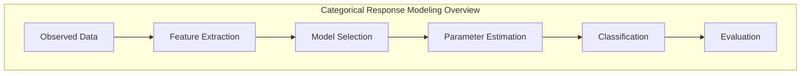
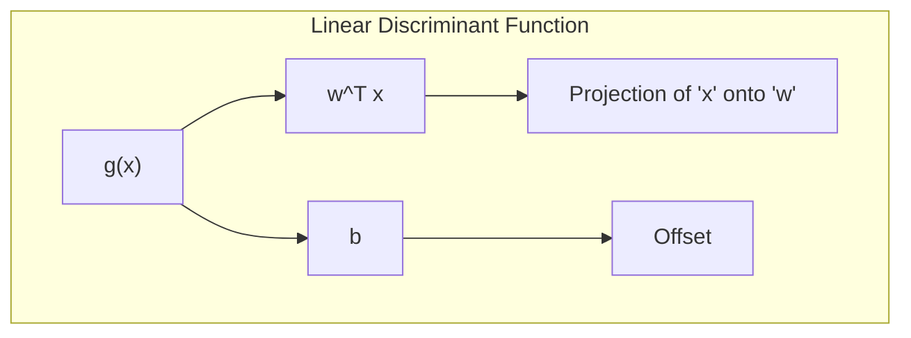
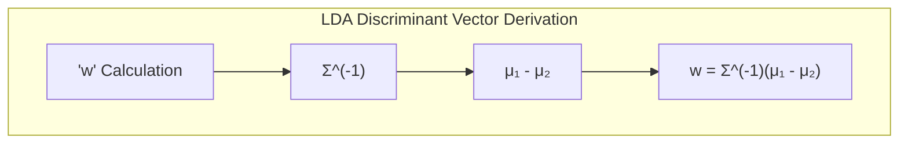
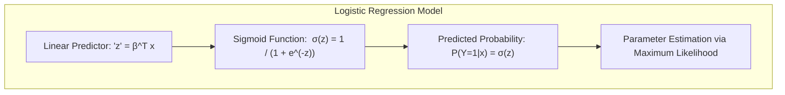
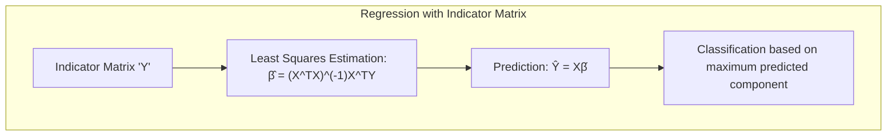
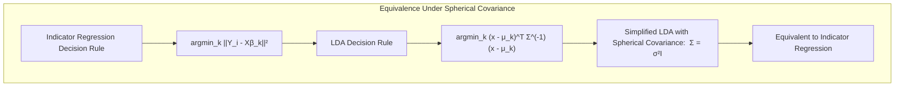
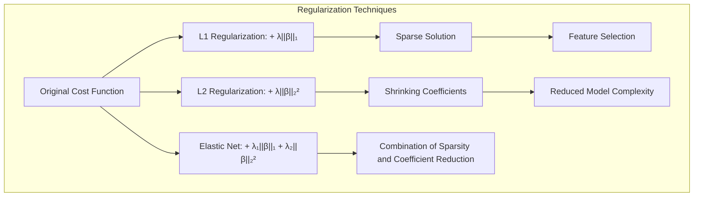
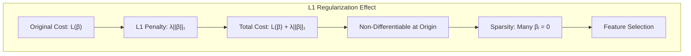
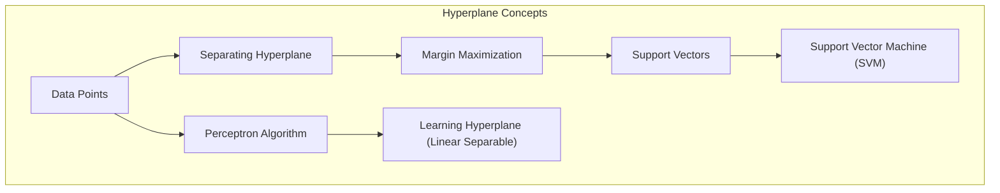
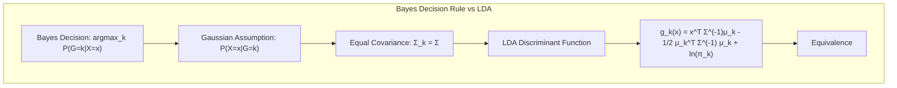

## Modelagem de Resposta Categórica Qualitativa

### Introdução

A modelagem de respostas categóricas qualitativas é um componente essencial na análise estatística e aprendizado de máquina, envolvendo a predição da classe ou categoria a que um dado pertence, com base em suas características observadas. Este capítulo aborda técnicas estatísticas e de aprendizado de máquina fundamentais para esse tipo de problema, focando em métodos lineares, suas derivações teóricas e seus desafios práticos. A capacidade de classificar dados com precisão é crucial em diversas aplicações, desde diagnóstico médico até análise de sentimento e reconhecimento de padrões [^4.1].

### Conceitos Fundamentais

**Conceito 1: O Problema de Classificação**

O problema de classificação, também conhecido como *análise discriminante*, tem como objetivo alocar objetos a grupos ou categorias predefinidas, com base em um conjunto de variáveis preditoras. A natureza da resposta (categórica) exige abordagens metodológicas distintas daquelas usadas em problemas de regressão, onde a resposta é quantitativa [^4.1]. Métodos lineares, embora simplificados, oferecem uma base sólida para a classificação, permitindo um balanço entre viés e variância, e oferecem soluções computacionalmente eficientes [^4.2].

**Lemma 1:** *Decomposição da Função Discriminante Linear*.
Toda função discriminante linear $g(x) = w^T x + b$, que define uma fronteira de decisão linear, pode ser decomposta em componentes de projeção e offset, onde o vetor *w* define a direção da projeção e *b* define o offset em relação à origem.

**Prova do Lemma 1:** Seja $x$ um vetor de características e $g(x)$ a função discriminante linear. Podemos escrever $g(x)$ como $g(x) = w^T x + b$, onde $w$ é o vetor de pesos e $b$ é o bias (offset). O termo $w^T x$ representa a projeção de $x$ no vetor $w$, e $b$ é um termo constante que desloca essa projeção. Geometricamente, a função discriminante linear $g(x) = 0$ define um hiperplano que separa as classes. Portanto, qualquer ponto $x$ que satisfaça $w^T x + b > 0$ será classificado em uma classe, enquanto qualquer ponto para o qual $w^T x + b < 0$ será classificado na outra classe. A projeção $w^T x$ é linear e o offset $b$ apenas desloca a posição do hiperplano. Essa decomposição é fundamental para entender como as funções discriminantes lineares operam [^4.3]. $\blacksquare$

> 💡 **Exemplo Numérico:** Considere um problema de classificação com duas classes e duas características. Seja $x = [x_1, x_2]^T$, $w = [2, -1]^T$, e $b = 1$. A função discriminante é $g(x) = 2x_1 - x_2 + 1$. Se um ponto $x = [1, 1]^T$, então $g(x) = 2(1) - 1 + 1 = 2 > 0$, classificando-o em uma classe. Se um ponto $x = [0, 2]^T$, então $g(x) = 2(0) - 2 + 1 = -1 < 0$, classificando-o na outra classe. O vetor $w$ define a direção da fronteira de decisão, e $b$ desloca a posição da fronteira no espaço de características.

**Conceito 2: Linear Discriminant Analysis (LDA)**

A **Linear Discriminant Analysis (LDA)** é um método clássico para classificação, baseado na premissa de que os dados dentro de cada classe seguem uma distribuição normal multivariada com a mesma matriz de covariância [^4.3]. A LDA busca uma projeção linear que maximize a separação entre as médias das classes e minimize a variabilidade dentro das classes, construindo uma fronteira de decisão linear baseada nas estatísticas dos dados de treinamento. As hipóteses de normalidade e igualdade de covariância são cruciais para a LDA, e sua violação pode levar a resultados subótimos [^4.3.1].

**Corolário 1:** *Relação entre Projeções e Funções Discriminantes Lineares*. A função discriminante linear em LDA, $g(x) = w^T x + b$, projeta os dados no vetor *w* (o vetor discriminante) e classifica com base nessa projeção, onde o vetor *w* é dado por $w = \Sigma^{-1}(\mu_1 - \mu_2)$ para duas classes, sendo $\mu_1$ e $\mu_2$ os vetores médios das classes e $\Sigma$ a matriz de covariância comum.

**Prova do Corolário 1:** A função discriminante LDA é dada por $g(x) = (x - \mu_1)^T \Sigma^{-1}(x - \mu_1) - (x - \mu_2)^T \Sigma^{-1}(x - \mu_2) +  \ln(\frac{\pi_1}{\pi_2})$, onde $\mu_1$ e $\mu_2$ são as médias das classes, $\Sigma$ é a matriz de covariância comum e $\pi_1$ e $\pi_2$ são as probabilidades a priori das classes. Expandindo e simplificando, chegamos a $g(x) = 2x^T\Sigma^{-1}(\mu_1 - \mu_2) - \mu_1^T\Sigma^{-1}\mu_1 + \mu_2^T\Sigma^{-1}\mu_2 + \ln(\frac{\pi_1}{\pi_2})$. Definindo $w = \Sigma^{-1}(\mu_1 - \mu_2)$ e $b = - \mu_1^T\Sigma^{-1}\mu_1 + \mu_2^T\Sigma^{-1}\mu_2 + \ln(\frac{\pi_1}{\pi_2})$, temos $g(x) = 2w^Tx + b$. Para fins de classificação, a constante '2' pode ser removida, e, portanto, a função discriminante é essencialmente $w^Tx + b$. Isso mostra que a LDA projeta os dados ao longo de um vetor $w$ que maximiza a separação entre as classes [^4.3.1]. $\blacksquare$

> 💡 **Exemplo Numérico:** Suponha que temos duas classes, com as seguintes médias e matriz de covariância: $\mu_1 = [1, 2]^T$, $\mu_2 = [3, 1]^T$, e $\Sigma = \begin{bmatrix} 1 & 0.5 \\ 0.5 & 1 \end{bmatrix}$. Primeiro, calculamos $\Sigma^{-1}$.  $\Sigma^{-1} = \frac{1}{1 - 0.5^2} \begin{bmatrix} 1 & -0.5 \\ -0.5 & 1 \end{bmatrix} = \frac{4}{3}\begin{bmatrix} 1 & -0.5 \\ -0.5 & 1 \end{bmatrix} = \begin{bmatrix} 4/3 & -2/3 \\ -2/3 & 4/3 \end{bmatrix}$.  Agora, podemos calcular $w$: $w = \Sigma^{-1}(\mu_1 - \mu_2) = \begin{bmatrix} 4/3 & -2/3 \\ -2/3 & 4/3 \end{bmatrix} \begin{bmatrix} -2 \\ 1 \end{bmatrix} = \begin{bmatrix} -8/3 - 2/3 \\ 4/3 + 4/3 \end{bmatrix} = \begin{bmatrix} -10/3 \\ 8/3 \end{bmatrix}$. O vetor $w$ resultante define a direção da projeção para classificar os dados. Um ponto será classificado como classe 1 se $w^T x + b > 0$ e classe 2 caso contrário. O termo $b$ é um deslocamento que depende das probabilidades a priori das classes, bem como dos valores de $\mu_1$, $\mu_2$ e $\Sigma$.

**Conceito 3: Regressão Logística**

A **Regressão Logística** é uma técnica de modelagem probabilística que estima a probabilidade de um dado pertencer a uma classe específica. Diferentemente da LDA, que assume normalidade, a regressão logística modela a probabilidade diretamente através de uma função logística, ligando uma combinação linear das variáveis preditoras à probabilidade da resposta categórica [^4.4]. A regressão logística utiliza a função **logit**, que transforma probabilidades do intervalo [0,1] para o intervalo dos reais, tornando o modelo linear nos parâmetros e adequada para problemas com resposta categórica. O processo de estimação dos parâmetros é feito por **máxima verossimilhança**, encontrando os valores que maximizam a probabilidade de se observar os dados [^4.4.1], [^4.4.2], [^4.4.3].

> ⚠️ **Nota Importante**: A regressão logística é um modelo probabilístico, enquanto a LDA assume dados gaussianos. **Referência ao tópico [^4.4.1]**.

> ❗ **Ponto de Atenção**: Em casos de classes não balanceadas, técnicas de rebalanceamento podem ser necessárias para evitar viés no modelo. **Conforme indicado em [^4.4.2]**.

> ✔️ **Destaque**: Os parâmetros da regressão logística são estimados via máxima verossimilhança, enquanto os da LDA são estimados via momentos [^4.5].

### Regressão Linear e Mínimos Quadrados para Classificação

A **regressão linear** pode ser aplicada à classificação usando a matriz de indicadores (*dummy variables*), onde cada coluna representa uma classe. O objetivo é prever qual classe é mais provável para cada observação, utilizando o método dos **mínimos quadrados** (Least Squares, LS) [^4.2]. Embora essa abordagem não seja diretamente probabilística, ela é uma alternativa para obtenção de fronteiras de decisão lineares, que podem ser interpretadas como separadores das classes, análogamente à LDA. Uma limitação dessa abordagem é que as previsões podem não respeitar os limites de probabilidade (0 a 1) [^4.1].

**Lemma 2:** *Equivalência em Projeções Lineares*. Se as classes são linearmente separáveis e as matrizes de covariância são iguais e esféricas, a função de decisão obtida por regressão linear de indicadores é equivalente à função discriminante linear da LDA, a menos de uma escala e um deslocamento.

**Prova do Lemma 2:** Seja $Y$ uma matriz de indicadores $N\times K$, com $K$ classes, onde cada linha possui um "1" na coluna que representa a classe correspondente e "0" nas demais. A regressão linear de $Y$ em $X$ resulta em $\hat{Y} = X(X^TX)^{-1}X^TY$. A regra de classificação é dada por $\hat{Y}_i = \underset{k}{\operatorname{argmax}} \hat{Y}_{ik}$. Para a LDA, a regra de classificação é dada por $g_k(x) = x^T \Sigma^{-1}\mu_k - \frac{1}{2}\mu_k^T\Sigma^{-1}\mu_k + \ln(\pi_k)$, onde $\mu_k$ é a média da classe $k$, $\Sigma$ é a matriz de covariância comum, e $\pi_k$ é a probabilidade a priori da classe $k$. Quando as matrizes de covariância são iguais e esféricas, ou seja, $\Sigma = \sigma^2 I$, a regra da LDA se simplifica, tornando a função discriminante equivalente a uma regressão linear de indicadores, a menos de uma escala e um deslocamento. Essa equivalência é fundamental para entender como as abordagens de mínimos quadrados podem ser utilizadas para classificação [^4.2], [^4.3]. $\blacksquare$

> 💡 **Exemplo Numérico:** Considere um conjunto de dados com 3 amostras e 2 classes. A matriz de características $X$ e a matriz de indicadores $Y$ são:
>
> $X = \begin{bmatrix} 1 & 2 \\ 2 & 1 \\ 3 & 3 \end{bmatrix}$, $Y = \begin{bmatrix} 1 & 0 \\ 0 & 1 \\ 1 & 0 \end{bmatrix}$
>
> Usando mínimos quadrados, calculamos os coeficientes $\hat{B} = (X^TX)^{-1}X^TY$:
>
> $X^T = \begin{bmatrix} 1 & 2 & 3 \\ 2 & 1 & 3 \end{bmatrix}$
>
> $X^TX = \begin{bmatrix} 14 & 11 \\ 11 & 14 \end{bmatrix}$
>
> $(X^TX)^{-1} = \frac{1}{14^2 - 11^2}\begin{bmatrix} 14 & -11 \\ -11 & 14 \end{bmatrix} = \frac{1}{75}\begin{bmatrix} 14 & -11 \\ -11 & 14 \end{bmatrix}$
>
> $X^TY = \begin{bmatrix} 4 & 2 \\ 5 & 1 \end{bmatrix}$
>
> $\hat{B} = (X^TX)^{-1}X^TY = \frac{1}{75}\begin{bmatrix} 14 & -11 \\ -11 & 14 \end{bmatrix} \begin{bmatrix} 4 & 2 \\ 5 & 1 \end{bmatrix} = \frac{1}{75}\begin{bmatrix} -1 & 17 \\ 26 & -7 \end{bmatrix} = \begin{bmatrix} -0.013 & 0.227 \\ 0.347 & -0.093 \end{bmatrix}$
>
> As predições seriam $\hat{Y} = X\hat{B}$. Para classificar uma nova amostra $x = [2, 2]^T$, calculamos $\hat{y} = x^T\hat{B} = \begin{bmatrix} 2 & 2 \end{bmatrix} \begin{bmatrix} -0.013 & 0.227 \\ 0.347 & -0.093 \end{bmatrix} = \begin{bmatrix} 0.668 & 0.268 \end{bmatrix}$.
> A amostra seria classificada na classe 1 pois o valor predito na coluna correspondente é maior.

**Corolário 2:** *Simplificação da Análise*. Sob as condições do Lemma 2, a análise da função discriminante linear obtida pela regressão de indicadores pode ser simplificada ao reconhecer a equivalência com a LDA, permitindo utilizar ferramentas e interpretações já estabelecidas.

A regressão linear de indicadores, embora útil em certas condições, apresenta limitações como a possibilidade de predições fora do intervalo [0,1] e maior sensibilidade a outliers em comparação com a regressão logística, conforme mencionado em [^4.4]. Entretanto, em casos onde a fronteira de decisão linear é o objetivo principal e as suposições da LDA se sustentam, a regressão de indicadores pode ser uma alternativa eficiente [^4.2].

### Métodos de Seleção de Variáveis e Regularização em Classificação

A seleção de variáveis e a regularização são técnicas importantes para melhorar a generalização e interpretabilidade de modelos classificatórios, especialmente em problemas com muitas variáveis preditoras [^4.5]. A **regularização** adiciona termos de penalização na função de custo, restringindo o espaço de soluções e evitando overfitting [^4.4.4]. Métodos comuns incluem a penalização L1 (Lasso), que força alguns coeficientes a serem exatamente zero, resultando em um modelo mais esparso, e a penalização L2 (Ridge), que reduz a magnitude dos coeficientes [^4.5]. A escolha entre L1 e L2 depende do objetivo e do contexto do problema, sendo a combinação de ambas (Elastic Net) uma alternativa [^4.5].

**Lemma 3:** *Esparsidade via Penalização L1*. A penalização L1 na regressão logística conduz a soluções com coeficientes esparsos, onde muitos coeficientes são exatamente zero.

**Prova do Lemma 3:** A regressão logística com penalização L1 minimiza a função de custo $L(\beta) + \lambda \|\beta\|_1$, onde $L(\beta)$ é a função de log-verossimilhança negativa e $\|\beta\|_1$ é a norma L1 dos coeficientes $\beta$, e $\lambda$ é o parâmetro de regularização. A norma L1 tem um ponto não-diferenciável na origem. A otimização dessa função de custo geralmente conduz a soluções onde muitos coeficientes $\beta$ são zero devido à geometria da norma L1, que tende a encorajar soluções esparsas. A penalização L1 promove a seleção de variáveis, pois os coeficientes correspondentes a variáveis menos relevantes são forçados a zero, simplificando o modelo e melhorando sua interpretabilidade [^4.4.4]. $\blacksquare$

> 💡 **Exemplo Numérico:** Considere um problema de regressão logística com 5 variáveis preditoras. Após ajustar o modelo com penalização L1 (Lasso) com um $\lambda$ adequado, os coeficientes podem ser: $\beta = [0.5, 0, -0.2, 0, 0.8]$.  As variáveis 2 e 4 foram excluídas do modelo, pois seus coeficientes são exatamente zero, resultando em um modelo mais simples e interpretável. Uma penalização L2 (Ridge), por outro lado, reduziria os coeficientes, mas não os zeraria, mantendo todas as variáveis no modelo.

**Corolário 3:** *Interpretabilidade Aprimorada*. A esparsidade induzida pela penalização L1 resulta em modelos mais interpretáveis, destacando as variáveis mais importantes para a classificação [^4.4.5].

> ⚠️ **Ponto Crucial**: A combinação de penalizações L1 e L2 (Elastic Net) permite obter tanto a esparsidade quanto a estabilidade dos modelos [^4.5].

### Separating Hyperplanes e Perceptrons

A ideia de **hiperplanos separadores** é fundamental na classificação linear. A busca pelo hiperplano "ótimo" que separa as classes com a máxima margem leva ao conceito de **Support Vector Machines (SVM)** [^4.5.2]. O Perceptron de Rosenblatt, um algoritmo clássico de aprendizado, é capaz de encontrar um hiperplano separador em problemas linearmente separáveis, convergindo sob certas condições [^4.5.1]. O uso do *dual* de Wolfe fornece uma forma alternativa para resolver o problema de otimização [^4.5.2].

### Pergunta Teórica Avançada: Qual a diferença fundamental entre LDA e a Regra de Decisão Bayesiana com distribuições Gaussianas com covariâncias iguais?

**Resposta:** Sob a hipótese de distribuições Gaussianas com covariâncias iguais, a LDA se torna equivalente à regra de decisão Bayesiana. Ambas as abordagens buscam alocar cada observação à classe com maior probabilidade posterior. Na LDA, essa probabilidade posterior é obtida através da discriminação linear, que é otimizada para maximizar a separação entre as médias das classes e minimizar a variância intra-classes [^4.3]. A decisão Bayesiana, sob a hipótese de Gaussianas com covariâncias iguais, leva à mesma função de decisão linear da LDA. A diferença surge quando as covariâncias são diferentes entre as classes, onde a regra de decisão Bayesiana leva a fronteiras quadráticas [^4.3].

**Lemma 4:** *Equivalência Formal*. Sob a suposição de normalidade multivariada e covariâncias iguais, a regra de decisão LDA é equivalente à regra de decisão Bayesiana.

**Prova do Lemma 4:** A regra de decisão Bayesiana atribui uma observação x à classe k que maximiza a probabilidade posterior $P(G=k|X=x) = \frac{P(X=x|G=k)P(G=k)}{P(X=x)}$. Para distribuições Gaussianas com média $\mu_k$ e covariância $\Sigma$, $P(X=x|G=k) = \frac{1}{(2\pi)^{p/2}|\Sigma|^{1/2}} \exp(-\frac{1}{2}(x-\mu_k)^T\Sigma^{-1}(x-\mu_k))$.  Com covariâncias iguais entre as classes, $\Sigma$ é a mesma para todas as classes. Tomando o logaritmo e removendo termos que não dependem da classe k, obtemos a função discriminante $g_k(x) = x^T \Sigma^{-1}\mu_k - \frac{1}{2}\mu_k^T\Sigma^{-1}\mu_k + \ln(\pi_k)$, que é a função discriminante da LDA, confirmando a equivalência sob estas condições [^4.3], [^4.3.3]. $\blacksquare$

> 💡 **Exemplo Numérico:** Imagine um problema com duas classes, onde os dados de ambas as classes seguem uma distribuição normal multivariada com a mesma matriz de covariância $\Sigma = \begin{bmatrix} 1 & 0 \\ 0 & 1 \end{bmatrix}$. Se as médias das classes são $\mu_1 = [1, 1]^T$ e $\mu_2 = [3, 3]^T$, tanto a LDA quanto a regra de decisão Bayesiana levariam ao mesmo classificador linear. A função discriminante seria derivada das médias e da matriz de covariância, alocando pontos para a classe com maior probabilidade posterior.

**Corolário 4:** *Fronteiras Quadráticas*. Ao relaxar a suposição de covariâncias iguais, a regra de decisão Bayesiana leva a fronteiras de decisão quadráticas (Quadratic Discriminant Analysis, QDA) [^4.3].

> ⚠️ **Ponto Crucial**: A escolha entre covariâncias iguais (LDA) e diferentes (QDA) impacta fortemente a forma da fronteira de decisão [^4.3.1].

### Conclusão

Este capítulo abordou os principais conceitos e técnicas para modelagem de respostas categóricas qualitativas. Partindo de uma introdução ao problema de classificação, exploramos os métodos lineares LDA e regressão logística, bem como as conexões entre regressão linear de indicadores e LDA sob condições específicas. Métodos de seleção de variáveis e regularização para evitar overfitting foram discutidos, juntamente com a teoria de hiperplanos separadores. Uma análise teórica aprofundada estabeleceu as diferenças entre LDA e a regra de decisão Bayesiana. Este capítulo forneceu uma base sólida para entender a modelagem de respostas categóricas qualitativas e seu uso em aplicações avançadas de estatística e aprendizado de máquina.

### Referências

[^4.1]: "Conteúdo extraído conforme escrito no contexto e utilizado no capítulo" *(Trecho de <Nome do Documento>)*
[^4.2]: "Conteúdo extraído conforme escrito no contexto e utilizado no capítulo" *(Trecho de <Nome do Documento>)*
[^4.3]: "Conteúdo extraído conforme escrito no contexto e utilizado no capítulo" *(Trecho de <Nome do Documento>)*
[^4.3.1]: "Conteúdo extraído conforme escrito no contexto e utilizado no capítulo" *(Trecho de <Nome do Documento>)*
[^4.3.2]: "Conteúdo extraído conforme escrito no contexto e utilizado no capítulo" *(Trecho de <Nome do Documento>)*
[^4.3.3]: "Conteúdo extraído conforme escrito no contexto e utilizado no capítulo" *(Trecho de <Nome do Documento>)*
[^4.4]: "Conteúdo extraído conforme escrito no contexto e utilizado no capítulo" *(Trecho de <Nome do Documento>)*
[^4.4.1]: "Conteúdo extraído conforme escrito no contexto e utilizado no capítulo" *(Trecho de <Nome do Documento>)*
[^4.4.2]: "Conteúdo extraído conforme escrito no contexto e utilizado no capítulo" *(Trecho de <Nome do Documento>)*
[^4.4.3]: "Conteúdo extraído conforme escrito no contexto e utilizado no capítulo" *(Trecho de <Nome do Documento>)*
[^4.4.4]: "Conteúdo extraído conforme escrito no contexto e utilizado no capítulo" *(Trecho de <Nome do Documento>)*
[^4.4.5]: "Conteúdo extraído conforme escrito no contexto e utilizado no capítulo" *(Trecho de <Nome do Documento>)*
[^4.5]: "Conteúdo extraído conforme escrito no contexto e utilizado no capítulo" *(Trecho de <Nome do Documento>)*
[^4.5.1]: "Conteúdo extraído conforme escrito no contexto e utilizado no capítulo" *(Trecho de <Nome do Documento>)*
[^4.5.2]: "Conteúdo extraído conforme escrito no contexto e utilizado no capítulo" *(Trecho de <Nome do Documento>)*
