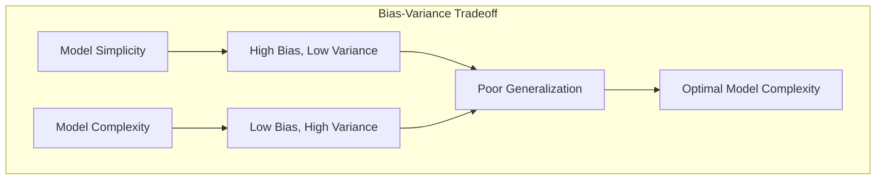
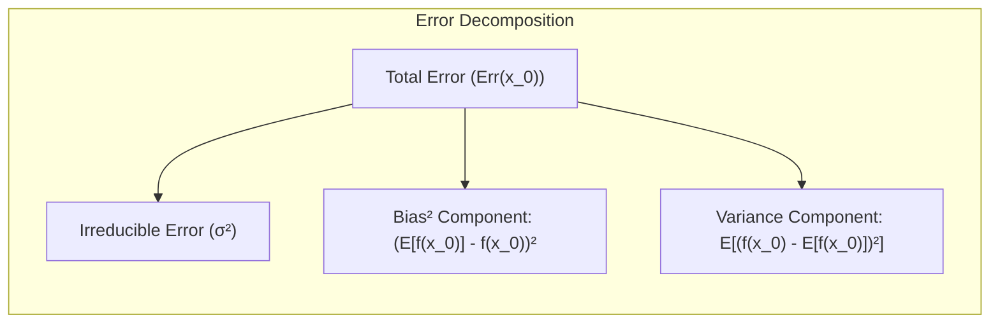
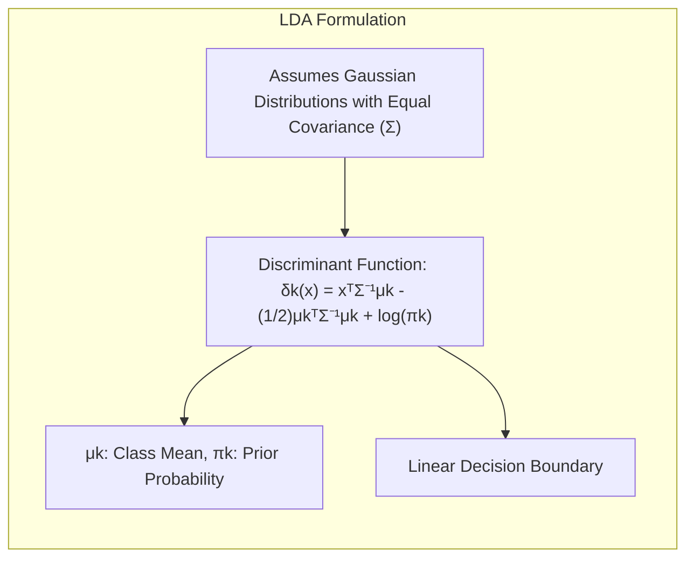
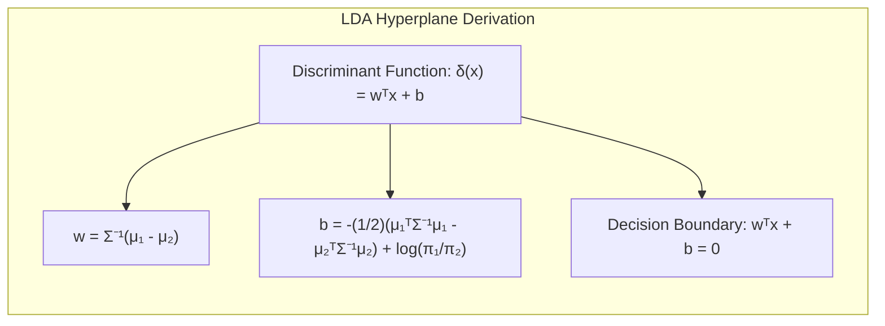
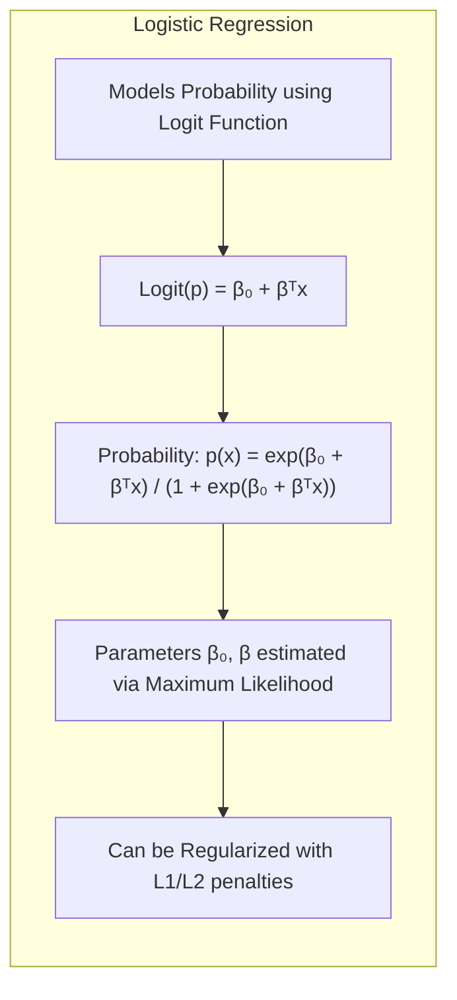
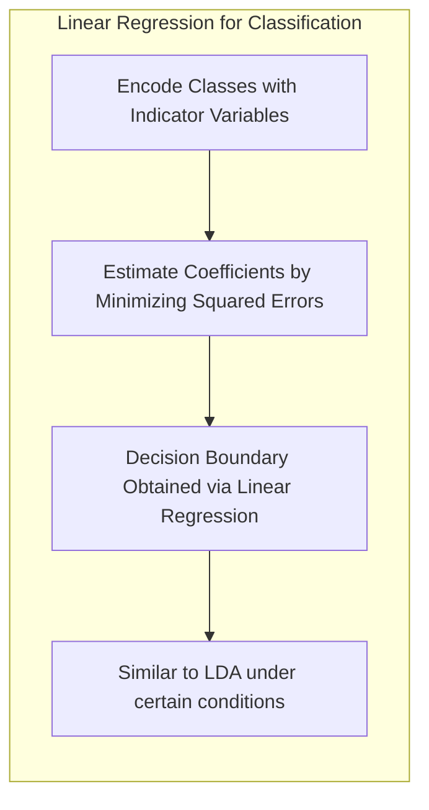
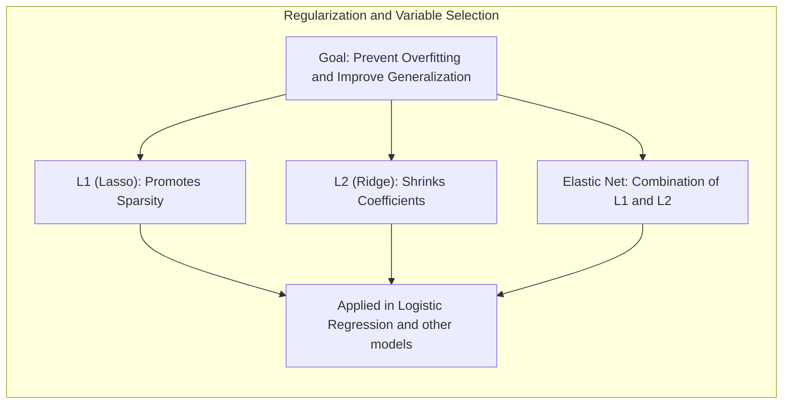
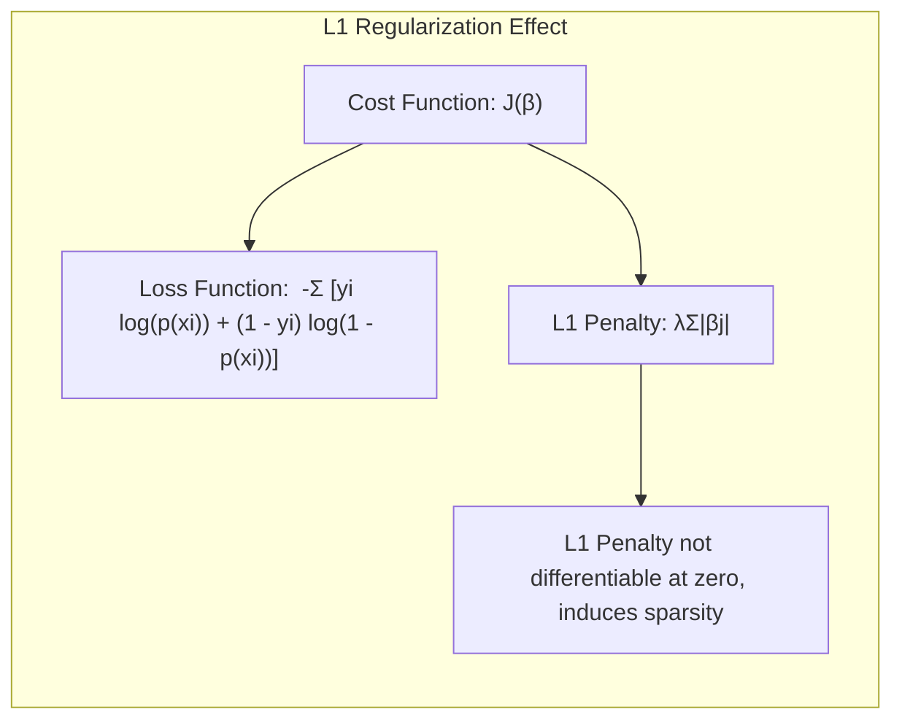
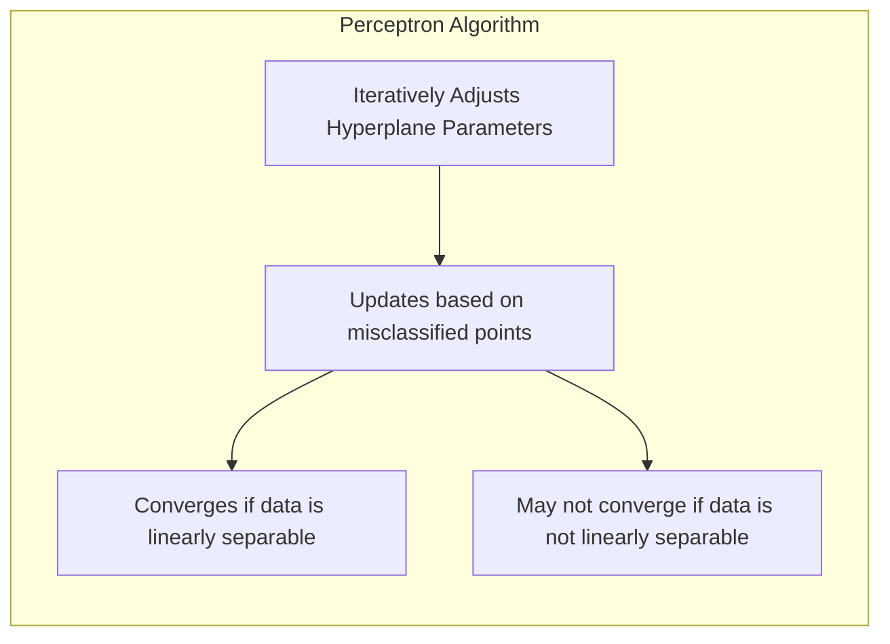

## Avaliação e Seleção de Modelos
<imagem: Mapa mental abrangente conectando bias-variance, treinamento, validação, métodos de avaliação, otimismo do erro de treinamento, e técnicas como cross-validation e bootstrap.>

### Introdução
A avaliação da performance de generalização de um método de aprendizado é crucial na prática, pois direciona a escolha do método ou modelo de aprendizado e oferece uma medida da qualidade do modelo escolhido [^7.1]. A performance de generalização se refere à capacidade de um modelo de prever corretamente em dados de teste independentes [^7.1]. Este capítulo aborda os principais métodos para avaliação de performance e como eles são usados para selecionar modelos, iniciando com uma discussão sobre a interação entre **viés**, **variância** e **complexidade do modelo** [^7.1].

### Conceitos Fundamentais

**Conceito 1:** O **problema de classificação** (e também de regressão) visa encontrar uma função $f(X)$ que mapeie entradas $X$ para saídas $Y$ (quantitativas ou categóricas). Modelos lineares são frequentemente utilizados, mas o equilíbrio entre **viés** e **variância** é essencial [^7.2]. Um modelo muito simples (alta viés) pode não capturar a complexidade dos dados, enquanto um modelo muito complexo (alta variância) pode se ajustar ao ruído dos dados de treinamento e generalizar mal para dados novos [^7.2].


**Lemma 1:** *A perda esperada de um modelo pode ser decomposta em termos de viés e variância.* A função de perda $L(Y, f(X))$ quantifica os erros entre as previsões $f(X)$ e os valores reais $Y$ [^7.2]. Uma escolha comum é o erro quadrático, dado por $L(Y, f(X)) = (Y - f(X))^2$ [^7.2]. Ao considerar o erro esperado em um ponto $x_0$, dado por $Err(x_0) = E[(Y - f(x_0))^2 | X = x_0]$, podemos demonstrar que:

$$Err(x_0) = \sigma^2 + [Ef(x_0) - f(x_0)]^2 + E[f(x_0) - Ef(x_0)]^2$$

onde:
- $\sigma^2$ é o erro irredutível.
- $[Ef(x_0) - f(x_0)]^2$ é o **viés quadrático**.
- $E[f(x_0) - Ef(x_0)]^2$ é a **variância**.

A prova desta decomposição [^7.3] surge da manipulação algébrica da expressão do erro esperado, adicionando e subtraindo $Ef(x_0)$, onde $Ef(x_0)$ representa o valor esperado da predição em $x_0$. Esta decomposição mostra que o erro esperado é a soma do erro irredutível, do viés quadrático e da variância. $\blacksquare$



> 💡 **Exemplo Numérico:** Imagine que estamos tentando modelar a relação entre o número de horas estudadas ($X$) e a nota em uma prova ($Y$). Suponha que a verdadeira relação seja $Y = 2X + \epsilon$, onde $\epsilon$ é um erro aleatório com $\sigma^2 = 1$. Vamos considerar dois modelos:
>
> 1.  **Modelo Simples (Alta Viés):**  $f_1(X) = 0.5X$. Este modelo é muito simplista e não captura a relação verdadeira, portanto, terá alto viés.
> 2.  **Modelo Complexo (Alta Variância):** $f_2(X) = \hat{\beta}_0 + \hat{\beta}_1 X + \hat{\beta}_2 X^2 + \hat{\beta}_3 X^3$. Este modelo, ao ser treinado com dados limitados, pode se ajustar demais aos ruídos, resultando em alta variância.
>
> Para um ponto específico, digamos $x_0 = 3$, e supondo que  $Ef_1(x_0) = 1.5$ e $f(x_0) = 2*3 = 6$. O viés quadrático para o modelo 1 será $(1.5 - 6)^2 = 20.25$. Se $f_2(x_0)$  variar muito entre diferentes datasets de treinamento com média igual a 6, a variância para o modelo 2 será alta. No nosso exemplo hipotético, digamos que a variância seja 4, e  o erro irredutível é 1. Para o modelo 1 (simples) $Err(x_0)=1 + 20.25 +0 = 21.25$ e para o modelo 2 (complexo) $Err(x_0) = 1 + 0 + 4 = 5$.
>
> Vamos supor que ao treinarmos nosso modelo complexo $f_2$ em 10 conjuntos de dados diferentes com $x_0 = 3$, as predições sejam: [6.5, 5.8, 7.2, 5.5, 6.3, 4.9, 6.1, 7.0, 5.2, 6.5]. A média dessas predições é 6.0, e a variância $E[f_2(x_0) - Ef_2(x_0)]^2=0.69$, ou seja, os valores flutuam em torno do valor verdadeiro. Enquanto isso, as previsões do modelo simples (f1) são sempre as mesmas e bem longe do valor esperado.
>
> Este exemplo demonstra como modelos simples podem ter alto viés (erro sistemático) e baixa variância, enquanto modelos complexos podem ter baixo viés e alta variância (sensibilidade aos dados de treinamento). O ideal é encontrar um equilíbrio que minimize o erro total.

**Conceito 2:** A **Linear Discriminant Analysis (LDA)** é um método de classificação que assume que as classes seguem distribuições Gaussianas com a mesma matriz de covariância [^7.3]. A fronteira de decisão da LDA é linear, definida pela projeção dos dados em um subespaço que maximiza a separação entre as classes [^7.3.1]. A suposição de igualdade de covariância simplifica a análise, mas pode ser inadequada em alguns cenários [^7.3.1]. A LDA visa encontrar uma combinação linear das features que melhor separa as classes, onde a função discriminante para uma observação $x$ é dada por $\delta_k(x) = x^T\Sigma^{-1}\mu_k - \frac{1}{2}\mu_k^T\Sigma^{-1}\mu_k + \log\pi_k$ [^7.3.2], onde $\mu_k$ e $\pi_k$ são a média e a probabilidade a priori da classe $k$, respectivamente, e $\Sigma$ é a matriz de covariância comum a todas as classes. A LDA é baseada em uma abordagem Bayesiana [^7.7], o que implica que, ao assumir as classes como gaussianas e com covariâncias iguais, o problema de classificação pode ser abordado via análise discriminante [^7.3.3].



**Corolário 1:** *Sob a suposição de covariâncias iguais, a função discriminante linear de LDA leva à obtenção de um hiperplano de decisão.*  A função discriminante da LDA é linear e pode ser expressa como $\delta(x) = w^Tx + b$ , onde $w = \Sigma^{-1}(\mu_1 - \mu_2)$ e $b =  -\frac{1}{2}(\mu_1^T\Sigma^{-1}\mu_1 - \mu_2^T\Sigma^{-1}\mu_2) + log(\pi_1/\pi_2)$. Portanto, a fronteira de decisão é um hiperplano definido por $w^Tx + b = 0$ [^7.3.1].


> 💡 **Exemplo Numérico:** Suponha que temos duas classes, com as seguintes médias e covariância:
>  - Classe 1: $\mu_1 = [2, 2]^T$
>  - Classe 2: $\mu_2 = [4, 4]^T$
>  - Matriz de covariância comum: $\Sigma = \begin{bmatrix} 1 & 0.5 \\ 0.5 & 1 \end{bmatrix}$
>
> Assumindo probabilidades a priori iguais, $\pi_1 = \pi_2 = 0.5$. Calculando $w$ e $b$:
>
> 1.  $\Sigma^{-1} = \frac{1}{0.75} \begin{bmatrix} 1 & -0.5 \\ -0.5 & 1 \end{bmatrix} = \begin{bmatrix} 1.33 & -0.67 \\ -0.67 & 1.33 \end{bmatrix}$
> 2.  $w = \Sigma^{-1}(\mu_1 - \mu_2) = \begin{bmatrix} 1.33 & -0.67 \\ -0.67 & 1.33 \end{bmatrix} \begin{bmatrix} -2 \\ -2 \end{bmatrix} = \begin{bmatrix} -1.33 \\ -1.33\end{bmatrix}$
> 3.  $b = -\frac{1}{2}(\begin{bmatrix}2 & 2\end{bmatrix} \begin{bmatrix} 1.33 & -0.67 \\ -0.67 & 1.33 \end{bmatrix} \begin{bmatrix}2 \\ 2\end{bmatrix} - \begin{bmatrix}4 & 4\end{bmatrix} \begin{bmatrix} 1.33 & -0.67 \\ -0.67 & 1.33 \end{bmatrix} \begin{bmatrix}4 \\ 4\end{bmatrix}) = -\frac{1}{2}(5.33-21.33) = 8$
>
>
> A função discriminante é então $\delta(x) = -1.33x_1 -1.33x_2 + 8$. A fronteira de decisão é o hiperplano $-1.33x_1 -1.33x_2 + 8 = 0$ ou $x_1 + x_2 = 6$, que é uma linha no espaço 2D. Pontos acima desta linha são classificados como classe 2, e pontos abaixo como classe 1.
>
> ```mermaid
>  graph LR
>      A(2,2) -- Classe 1 --> B
>      C(4,4) -- Classe 2 --> B
>      B[x1 + x2 = 6]
>  style B fill:#f9f,stroke:#333,stroke-width:2px
> ```

**Conceito 3:** A **Logistic Regression** modela a probabilidade de uma observação pertencer a uma classe utilizando a função *logit* e um modelo linear [^7.4]. Ao contrário da LDA, que assume distribuições Gaussianas, a Logistic Regression não faz tais suposições [^7.4]. A *logit* transforma probabilidades de $[0,1]$ para $[-\infty, +\infty]$, o que permite usar um modelo linear para modelar a probabilidade de uma classe [^7.4.1]. A probabilidade de uma observação $x$ pertencer à classe 1, é dada por $p(x) = \frac{e^{\beta_0 + \beta^T x}}{1 + e^{\beta_0 + \beta^T x}}$ [^7.4.2], onde $\beta_0$ e $\beta$ são os parâmetros do modelo, estimados através da maximização da verossimilhança [^7.4.3]. A Logistic Regression é frequentemente usada em problemas de classificação binária, e pode ser generalizada para problemas multiclasse através do uso de funções *softmax* [^7.4.4]. A Logistic Regression pode ser regularizada para evitar overfitting e melhorar a estabilidade das estimativas [^7.4.5], comumente usando penalizações L1 e L2, conforme discutido mais adiante.



> 💡 **Exemplo Numérico:** Suponha que estamos usando regressão logística para prever se um cliente vai comprar um produto (classe 1) ou não (classe 0) com base em sua idade ($x$). Após treinar o modelo, obtemos os seguintes coeficientes: $\beta_0 = -5$ e $\beta_1 = 0.1$. Assim, a probabilidade de um cliente de idade $x$ comprar o produto é dada por $p(x) = \frac{e^{-5 + 0.1x}}{1 + e^{-5 + 0.1x}}$.
>
> Vamos analisar alguns casos:
> - Cliente com 20 anos: $p(20) = \frac{e^{-5 + 0.1 * 20}}{1 + e^{-5 + 0.1 * 20}} = \frac{e^{-3}}{1 + e^{-3}} \approx \frac{0.05}{1 + 0.05} \approx 0.048$. Uma baixa probabilidade de comprar o produto.
> - Cliente com 50 anos: $p(50) = \frac{e^{-5 + 0.1 * 50}}{1 + e^{-5 + 0.1 * 50}} = \frac{e^{0}}{1 + e^{0}} = \frac{1}{2} = 0.5$. Uma probabilidade de 50% de comprar o produto.
> - Cliente com 70 anos: $p(70) = \frac{e^{-5 + 0.1 * 70}}{1 + e^{-5 + 0.1 * 70}} = \frac{e^{2}}{1 + e^{2}} \approx \frac{7.38}{1 + 7.38} \approx 0.88$. Uma alta probabilidade de comprar o produto.
>
> Este exemplo ilustra como a regressão logística modela a probabilidade de um evento ocorrer, e como esta probabilidade varia conforme a idade do cliente. Note que as probabilidades sempre estão entre 0 e 1, garantindo uma interpretação probabilística.

> ⚠️ **Nota Importante**: Tanto a LDA quanto a Logistic Regression são modelos lineares que buscam encontrar um hiperplano que separa as classes, embora com abordagens diferentes. A escolha entre elas depende das suposições sobre os dados.

> ❗ **Ponto de Atenção**: Em cenários de classes não-balanceadas, a Logistic Regression pode ser mais robusta devido à sua abordagem probabilística, enquanto a LDA pode ser afetada pela predominância de uma das classes.

> ✔️ **Destaque**: Em problemas de classificação binária, os parâmetros da LDA e da Logistic Regression podem estar altamente relacionados, especialmente quando as classes são bem separadas. Ambas buscam encontrar o melhor hiperplano de decisão sob diferentes abordagens. [^7.5]

### Regressão Linear e Mínimos Quadrados para Classificação
<imagem: Diagrama mostrando o processo de regressão de indicadores para classificação, desde a codificação das classes até a aplicação da regra de decisão, e a comparação com métodos probabilísticos.>
```mermaid
flowchart TD
  subgraph "Regressão de Indicadores"
    A[Codificar Classes em Matriz de Indicadores] --> B[Estimar Coeficientes via Mínimos Quadrados]
    B --> C[Aplicar Regra de Decisão (e.g., classe com maior valor previsto)]
    C --> D[Comparar com Métodos Probabilísticos (e.g., Logistic Regression)]
  end
```
A regressão linear, aplicada diretamente sobre uma matriz de indicadores, pode ser utilizada para problemas de classificação [^7.2]. A ideia central é codificar as classes por meio de variáveis indicadoras (dummies), por exemplo, para um problema de classificação binária, a classe 1 pode ser codificada como 1 e a classe 0 como 0. A regressão linear é então realizada sobre esta matriz de indicadores, e os coeficientes obtidos podem ser usados para prever a classe de novas observações. No entanto, essa abordagem tem limitações, principalmente quando aplicada a problemas multiclasse, uma vez que os resultados podem gerar valores fora do intervalo [0,1] [^7.2]. A regressão de indicadores é mais apropriada para problemas com duas classes, mas pode ser extendida para multiclasses com algumas adaptações [^7.2].
Uma das limitações da regressão de indicadores é que a mesma minimiza a soma dos erros quadrados, e não uma função relacionada à probabilidade da classe, diferente da Logistic Regression [^7.2]. Assim, a regressão de indicadores pode levar a extrapolações fora do intervalo [0,1], o que dificulta a interpretação como probabilidade, no entanto, ela pode ser suficiente se o objetivo principal é obter a fronteira de decisão linear, conforme indicado em [^7.2].

**Lemma 2:** *A aplicação da regressão linear sobre uma matriz de indicadores para classificação binária pode ser vista como uma forma de obter uma fronteira linear de decisão.* Sob certas condições, a regressão linear em uma matriz de indicadores e a LDA fornecem hiperplanos de decisão equivalentes [^7.3]. A regressão linear busca minimizar a soma dos erros quadráticos [^7.2], enquanto a LDA busca maximizar a separação entre as classes, mas ambas geram fronteiras lineares que podem ser idênticas dependendo dos dados. $\blacksquare$



> 💡 **Exemplo Numérico:** Considere um problema de classificação binária com duas classes (0 e 1) e um único preditor $X$. Temos os seguintes dados de treinamento:
>
> ```
> X   | Classe (Y)
> ----|-----------
> 1   | 0
> 2   | 0
> 3   | 1
> 4   | 1
> 5   | 1
> ```
>
> Podemos codificar a classe 0 como 0 e a classe 1 como 1 e usar regressão linear para ajustar um modelo:
>
> $Y = \beta_0 + \beta_1 X$
>
> Usando a fórmula de mínimos quadrados:
>
> $\beta = (X^T X)^{-1} X^T Y$
>
> ```python
> import numpy as np
>
> X = np.array([[1], [2], [3], [4], [5]])
> Y = np.array([0, 0, 1, 1, 1])
>
> # Adicionando coluna de 1s para o intercepto
> X = np.concatenate((np.ones((X.shape[0], 1)), X), axis=1)
>
> # Calculando coeficientes usando a fórmula
> X_transpose = X.T
> beta = np.linalg.inv(X_transpose @ X) @ X_transpose @ Y
>
> print(f"Beta_0: {beta[0]:.2f}, Beta_1: {beta[1]:.2f}")
> ```
>
> Resultados: $\beta_0 = -0.6$, $\beta_1 = 0.4$.  O modelo de regressão é $Y = -0.6 + 0.4X$.  Para classificar um novo ponto $x$, usamos a regra: se $Y > 0.5$  classificamos como classe 1, caso contrário, classe 0. Por exemplo, com $x=2.5$ temos $Y = 0.4$, classificado como 0. Com $x=4$, temos $Y=1$, classificado como 1. Note que os valores de $Y$ podem extrapolar fora de [0,1].

**Corolário 2:** *A similaridade entre a regressão de indicadores e a LDA é especialmente notável quando a covariância entre as classes é baixa*. Nestas situações, a regressão linear e a LDA podem gerar fronteiras de decisão muito próximas ou idênticas [^7.3]. A equivalência entre a regressão de indicadores e a LDA se dá quando se assume igualdade de covariância e normalidade das classes, tornando a projeção obtida pela regressão equivalente à direção discriminante da LDA.

"Em alguns cenários, conforme apontado em [^7.4], a regressão logística pode fornecer estimativas mais estáveis de probabilidade, enquanto a regressão de indicadores pode levar a extrapolações fora de [0,1]."
"No entanto, há situações em que a regressão de indicadores, de acordo com [^7.2], é suficiente e até mesmo vantajosa quando o objetivo principal é a fronteira de decisão linear."

### Métodos de Seleção de Variáveis e Regularização em Classificação
<imagem: Mapa mental conectando seleção de variáveis e regularização com LDA, Logistic Regression, penalizações L1 e L2 e Elastic Net.>

Na modelagem, a seleção de variáveis e regularização são cruciais para evitar *overfitting* e melhorar a generalização do modelo [^7.4.4]. Modelos com muitos preditores podem se ajustar ao ruído nos dados de treinamento, levando a uma performance pobre em dados novos. Métodos de regularização, como a penalização $L_1$ (Lasso) e a penalização $L_2$ (Ridge), adicionam termos de penalidade à função de custo, que são proporcionais à magnitude dos coeficientes, o que restringe a magnitude dos mesmos e evita *overfitting* [^7.4.4], [^7.5]. A penalização $L_1$, dada por $\lambda \sum_{j=1}^{p}|\beta_j|$, promove soluções esparsas, isto é, zera os coeficientes de algumas variáveis, realizando automaticamente a seleção de variáveis [^7.4.4]. Já a penalização $L_2$, dada por $\lambda \sum_{j=1}^{p}\beta_j^2$, reduz a magnitude dos coeficientes, mas não os zera. A escolha entre $L_1$ e $L_2$ ou uma combinação delas (Elastic Net), depende do problema e do objetivo do modelo [^7.5].

**Lemma 3:** *A penalização $L_1$ na regressão logística leva a coeficientes esparsos.* A penalização $L_1$ adiciona um termo proporcional à soma dos valores absolutos dos coeficientes à função de custo, induzindo a que alguns coeficientes se tornem exatamente zero [^7.4.4]. Isto ocorre porque a penalidade L1  não é diferenciável em zero e, para valores pequenos de $\beta$, a derivada da penalidade assume valores  $\pm \lambda$, o que força coeficientes menos relevantes a serem zerados na solução ótima [^7.4.4].

**Prova do Lemma 3:** Considere a função de custo para Logistic Regression com penalização L1:

$$J(\beta) = - \sum_{i=1}^{N} \left[ y_i \log(p(x_i)) + (1 - y_i) \log(1 - p(x_i)) \right] + \lambda \sum_{j=1}^{p} |\beta_j|$$

onde $p(x_i)$ é a probabilidade prevista pelo modelo logístico para a observação $x_i$ e $\lambda$ é o parâmetro de regularização [^7.4.3]. O termo de penalização $L_1$, $\lambda \sum_{j=1}^{p} |\beta_j|$, é não diferenciável em $\beta_j = 0$, o que impede que a solução ótima possua $\beta_j$ muito próximo a zero, mas não exatamente zero.  A penalização $L_1$ induz uma solução esparsa, pois a inclinação do termo de penalidade não decai à medida que um coeficiente $\beta_j$ se aproxima de zero, forçando-o diretamente a zero na solução ótima, se a sua contribuição para a redução da função de custo não for grande o suficiente. A magnitude de $\lambda$ controla a esparsidade da solução: quanto maior $\lambda$, mais esparsa será a solução [^7.4.4]. $\blacksquare$


> 💡 **Exemplo Numérico:** Suponha que temos um problema de classificação com 5 preditores ($x_1, x_2, x_3, x_4, x_5$) e usamos regressão logística. Vamos considerar diferentes valores de $\lambda$ para a penalização L1:
>
> 1. **Sem regularização ($\lambda = 0$)**:
>   Obtemos $\beta = [2, -1.5, 0.8, -0.2, 0.5]$. Todos os coeficientes são diferentes de zero.
>
> 2. **Regularização L1 com $\lambda = 0.1$**:
>  Obtemos $\beta = [1.5, -1, 0.2, 0, 0.1]$. Os coeficientes $x_4$ e $x_5$ foram reduzidos e $x_3$ está bem proximo de zero.
>
> 3. **Regularização L1 com $\lambda = 0.5$**:
>   Obtemos $\beta = [0.9, -0.5, 0, 0, 0]$. Os coeficientes $x_3, x_4$ e $x_5$ são zerados, resultando em um modelo esparso com apenas $x_1$ e $x_2$ como preditores relevantes.
>
> A tabela abaixo resume os resultados:
>
> | Preditor  | $\lambda = 0$ | $\lambda = 0.1$ | $\lambda = 0.5$ |
> |-----------|---------------|-----------------|-----------------|
> | $x_1$     | 2.0           | 1.5             | 0.9             |
> | $x_2$     | -1.5          | -1.0            | -0.5            |
> | $x_3$     | 0.8           | 0.2            | 0               |
> | $x_4$     | -0.2          | 0               | 0               |
> | $x_5$     | 0.5           | 0.1             | 0               |
>
> Este exemplo mostra como o aumento de $\lambda$ na regularização L1 promove a esparsidade dos coeficientes, selecionando automaticamente as variáveis mais relevantes para o modelo.
>
> ```python
> import numpy as np
> from sklearn.linear_model import LogisticRegression
> from sklearn.preprocessing import StandardScaler
>
> # Gerando dados simulados
> np.random.seed(42)
> X = np.random.randn(100, 5)
> y = np.random.randint(0, 2, 100)
>
> # Padronizando as features
> scaler = StandardScaler()
> X_scaled = scaler.fit_transform(X)
>
> # Treinando modelos logistic regression com diferentes lambdas
> lambdas = [0, 0.1, 0.5]
> coefficients = []
> for l in lambdas:
>  model = LogisticRegression(penalty='l1', C = 1/(l if l != 0 else 1e-6), solver='liblinear', random_state=42)
>  model.fit(X_scaled, y)
>  coefficients.append(model.coef_[0])
>
> print('Coefficients with different lambdas')
> for i, coef in enumerate(coefficients):
>  print(f"Lambda = {lambdas[i]}: {coef}")
> ```

**Corolário 3:** *A esparsidade dos coeficientes obtida com a penalização $L_1$ melhora a interpretabilidade dos modelos classificatórios.* Ao zerar os coeficientes das variáveis menos importantes, a penalização $L_1$ ajuda a identificar os preditores mais relevantes para a classificação, simplificando o modelo e facilitando a compreensão de suas decisões [^7.4.5]. Isto é particularmente útil em problemas com muitos preditores, onde a seleção de um subconjunto relevante melhora a generalização e a interpretabilidade do modelo.

> 💡 **Exemplo Numérico:** No exemplo anterior, ao utilizar $\lambda = 0.5$, obtivemos um modelo que usa apenas $x_1$ e $x_2$ para fazer a classificação, os demais preditores não contribuem para o modelo. Isso facilita a interpretação, pois podemos concluir que apenas as variáveis $x_1$ e $x_2$ são relevantes para prever a classe, simplificando o entendimento do fenômeno que está sendo modelado.

> ⚠️ **Ponto Crucial**: A combinação de penalizações $L_1$ e $L_2$ no *Elastic Net* permite obter uma solução que combine a esparsidade da $L_1$ e a estabilidade da $L_2$ [^7.5]. O Elastic Net pode ser particularmente útil quando há alta correlação entre os preditores.

### Separating Hyperplanes e Perceptrons
A ideia de maximizar a margem de separação entre as classes leva ao conceito de **hiperplanos ótimos**, que são fronteiras de decisão que procuram maximizar a distância entre o hiperplano e os pontos mais próximos de cada classe [^7.5.2]. A formulação do problema de otimização envolve a busca pelos parâmetros do hiperplano que maximizem a margem e também classificam corretamente os pontos de treinamento. O problema é geralmente resolvido através da sua formulação dual, em que a solução emerge como combinação linear dos *support vectors*, isto é, os pontos mais próximos do hiperplano de decisão.
The **Perceptron** de Rosenblatt é um algoritmo iterativo para encontrar um hiperplano de separação [^7.5.1]. O algoritmo ajusta os parâmetros do hiperplano a cada erro de classificação, até que todos os pontos de treinamento sejam corretamente classificados, ou até um número máximo de iterações seja alcançado. A convergência do Perceptron é garantida se os dados de treinamento forem linearmente separáveis [^7.5.1], o que significa que existe um hiperplano que separa perfeitamente as classes. No entanto, se os dados não forem linearmente separáveis, o Perceptron pode não convergir para uma solução, e outros métodos podem ser mais adequados.


### Pergunta Teórica Avançada: Quais as diferenças fundamentais entre a formulação de LDA e a Regra de Decisão Bayesiana considerando distribuições Gaussianas com covariâncias iguais?
**Resposta:**
A **Regra de Decisão Bayesiana** minimiza o risco de classificação, atribuindo cada observação à classe com maior probabilidade a posteriori. Sob a suposição de que as classes seguem distribuições Gaussianas com médias $\mu_k$ e matriz de covariância comum $\Sigma$, a probabilidade a posteriori é dada por:

$$P(G=k|X=x) = \frac{\pi_k \phi(x;\mu_k, \Sigma)}{\sum_{l=1}^K \pi_l \phi(x;\mu_l, \Sigma)}$$

onde $\pi_k$ é a probabilidade *a priori* da classe $k$, e $\phi(x;\mu_k,\Sigma)$ é a função densidade de probabilidade Gaussiana com média $\mu_k$ e matriz de covariância $\Sigma$.
A LDA, por outro lado, assume a mesma distribuição Gaussiana para todas as classes, e utiliza uma função discriminante linear para classificar as observações [^7.3]. Ao considerar o logaritmo das probabilidades a posteriori, e desconsiderando termos constantes, a função discriminante da LDA pode ser expressa como:

$$ \delta_k(x) = x^T