## Model Assessment and Selection: A Deep Dive into Log-Likelihood as a Loss Function
<imagem: Mapa mental complexo mostrando as interconexões entre as seções do capítulo, incluindo Bias-Variance, Regressão de Indicadores, LDA, Logistic Regression, Regularização, Hyperplanes e métodos de avaliação, com setas indicando as relações entre os conceitos>

### Introdução
A avaliação do desempenho de modelos de aprendizado estatístico é crucial para a prática, orientando a escolha do modelo apropriado e quantificando sua qualidade. Em particular, o desempenho de generalização, que se refere à capacidade de um modelo de prever dados independentes, é fundamental [^7.1]. Este capítulo explora os principais métodos de avaliação e seleção de modelos, começando com a discussão sobre o *trade-off* entre viés, variância e complexidade do modelo [^7.1]. A utilização de log-likelihood como função de perda emerge como uma ferramenta versátil e poderosa, capaz de acomodar tanto modelos lineares quanto não lineares.

### Conceitos Fundamentais
#### Conceito 1: O Problema de Classificação e Funções de Perda
O problema de classificação envolve atribuir uma classe a uma observação com base em seus preditores. Métodos lineares buscam encontrar **fronteiras de decisão lineares** que separam as classes [^4.1]. A escolha de uma função de perda adequada é crucial para o desempenho do modelo. A função de perda quantifica o quão ruim é a previsão de um modelo; no contexto de classificação, ela mede o erro da atribuição da classe. O *squared error loss* (erro quadrático) e o *absolute error* (erro absoluto) são frequentemente usados quando a resposta é quantitativa [^7.2], enquanto para problemas de classificação, a *0-1 loss* (perda 0-1) é mais adequada. A 0-1 loss atribui um erro de 0 se a classe prevista corresponder à verdadeira, e 1 caso contrário [^7.2], [^7.5]. A escolha da função de perda influencia a forma como o modelo aprende e quão bem ele generaliza.
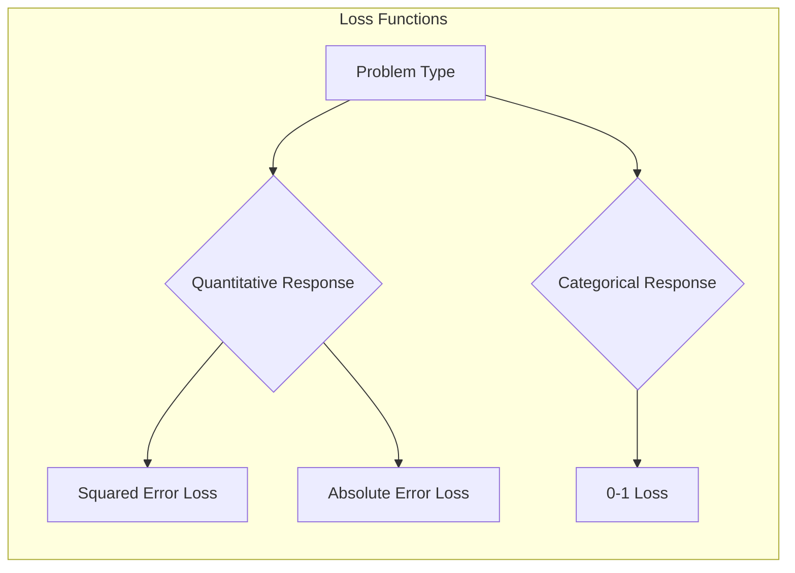

> 💡 **Exemplo Numérico:** Suponha que temos um problema de classificação binária com duas classes: 0 e 1. Temos três observações com classes verdadeiras $y = [0, 1, 0]$ e um modelo fez as seguintes previsões $\hat{y} = [1, 1, 0]$. Usando a 0-1 loss, a perda para cada observação será:
> - Observação 1: $\hat{y}_1 = 1$, $y_1 = 0$. Loss = 1 (previsão incorreta)
> - Observação 2: $\hat{y}_2 = 1$, $y_2 = 1$. Loss = 0 (previsão correta)
> - Observação 3: $\hat{y}_3 = 0$, $y_3 = 0$. Loss = 0 (previsão correta)
> A perda média para este pequeno conjunto é $\frac{1 + 0 + 0}{3} = \frac{1}{3}$.

**Lemma 1:** *A decomposição da função discriminante linear. Dada uma função discriminante linear $f(x) = w^Tx + b$, o *hyperplane* de decisão pode ser expresso como o conjunto de pontos para os quais $w^Tx + b = 0$*. [^4.3] Esta forma geométrica simplifica a análise do espaço de características e a interpretação da fronteira de decisão.
$$
\mathcal{H} = \{x \in \mathbb{R}^p: w^Tx + b = 0\}
$$
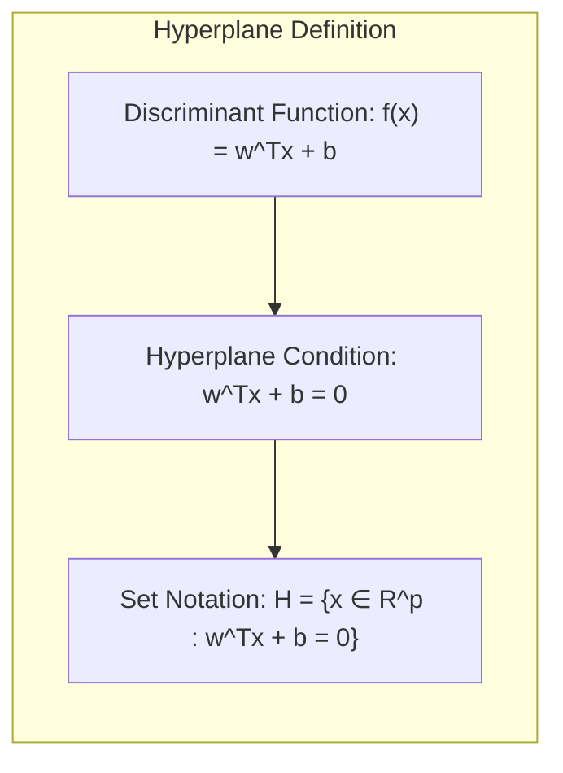

> 💡 **Exemplo Numérico:** Considere um problema de classificação em 2 dimensões ($p=2$) com $w = \begin{bmatrix} 2 \\ -1 \end{bmatrix}$ e $b = 1$. O hiperplano de decisão é dado por $2x_1 - x_2 + 1 = 0$. Este hiperplano divide o espaço em duas regiões. Por exemplo, o ponto $(0,0)$ está no lado onde $2(0) - 1(0) + 1 = 1 > 0$, e o ponto $(-1, -1)$ está no lado onde $2(-1) - 1(-1) + 1 = 0$, precisamente no hiperplano. Qualquer ponto onde a expressão é positiva é considerada de uma classe e negativa da outra.

#### Conceito 2: Linear Discriminant Analysis (LDA)
A **Linear Discriminant Analysis (LDA)** é um método de classificação que assume que as classes seguem distribuições Gaussianas com matrizes de covariância iguais [^4.3]. O objetivo da LDA é encontrar uma projeção linear que maximize a separação entre as médias das classes e minimize a variância dentro de cada classe [^4.3]. A função discriminante linear da LDA é derivada a partir da probabilidade posterior de cada classe, assumindo distribuições normais e covariâncias iguais [^4.3.1], [^4.3.2], [^4.3.3]. A LDA é uma abordagem paramétrica que estima os parâmetros da distribuição (médias e covariâncias) usando os dados de treinamento [^4.3].
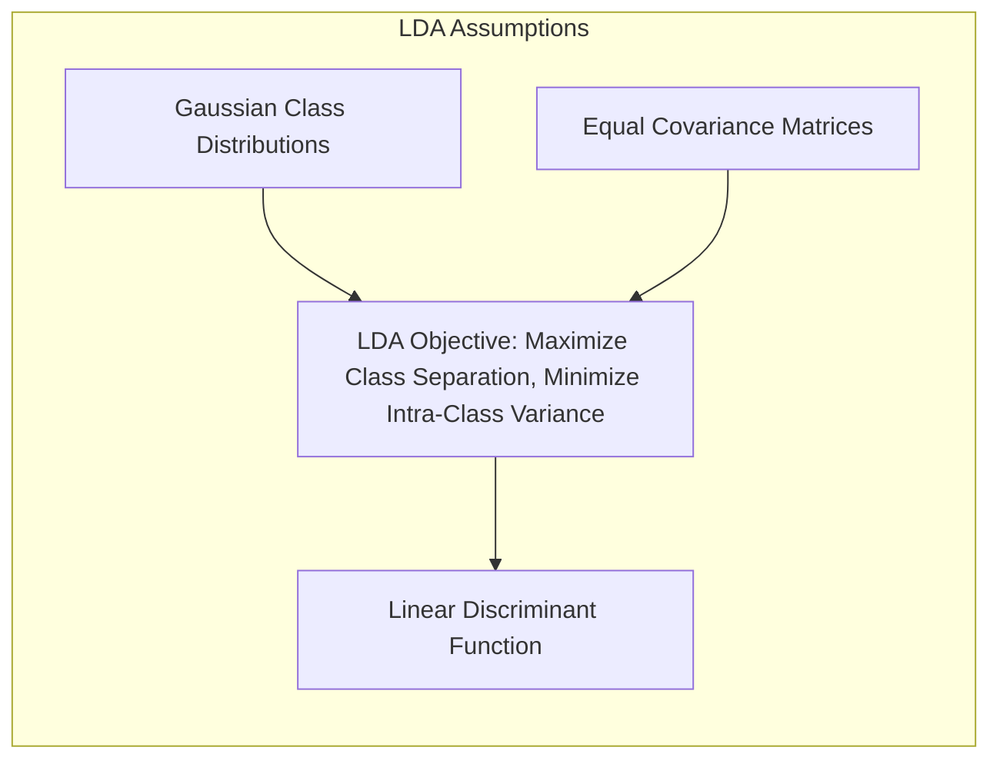
**Corolário 1:** *A relação entre LDA e projeções em subespaços. A função discriminante linear da LDA pode ser vista como uma projeção dos dados em um subespaço de menor dimensão que maximiza a separabilidade das classes*. [^4.3.1]
Essa propriedade permite que a LDA reduza a dimensionalidade dos dados, retendo as características mais discriminatórias para a classificação.
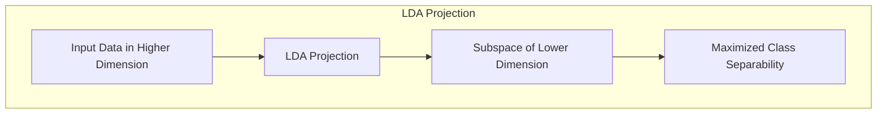

> 💡 **Exemplo Numérico:** Imagine um problema com duas classes (0 e 1) e duas características ($x_1$ e $x_2$). Após aplicar a LDA, descobrimos que a direção da projeção é definida pelo vetor $v = \begin{bmatrix} 0.8 \\ 0.6 \end{bmatrix}$. Isso significa que a LDA encontrou uma direção no espaço de características que melhor separa as classes quando projetamos os dados nessa direção. Pontos com projeções positivas são mais prováveis de pertencer a uma classe, e pontos com projeções negativas à outra.

#### Conceito 3: Logistic Regression
A **Logistic Regression** é um modelo de classificação probabilístico que estima a probabilidade de uma observação pertencer a uma determinada classe. Ao invés de modelar diretamente a classe, a regressão logística modela a probabilidade de uma classe por meio de uma transformação logística (logit) da combinação linear dos preditores [^4.4].  A função logit,  $\text{logit}(p) = \log(\frac{p}{1-p})$, mapeia a probabilidade $p$ no intervalo $(0,1)$ para o intervalo $(-\infty, +\infty)$ [^4.4]. Os parâmetros da regressão logística são estimados através da **maximização da verossimilhança**, que busca os valores que melhor explicam os dados observados [^4.4.1].
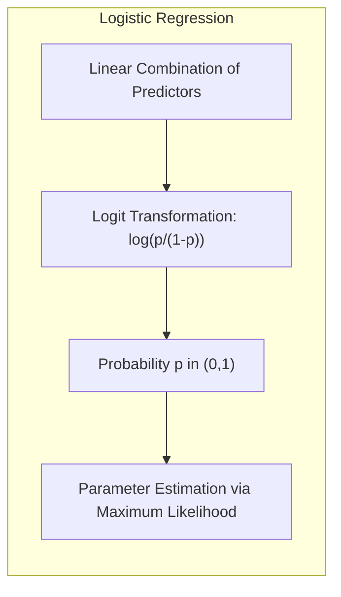

> ⚠️ **Nota Importante**: A regressão logística é um modelo linear no espaço logit, mas não no espaço da probabilidade original [^4.4.1].

> ❗ **Ponto de Atenção**: Em casos de classes desbalanceadas, a regressão logística pode favorecer a classe majoritária, sendo necessário o uso de técnicas de balanceamento ou pesos nas amostras [^4.4.2].

> ✔️ **Destaque**: A regressão logística e a LDA, embora derivadas de abordagens diferentes, podem produzir resultados similares quando as condições da LDA são satisfeitas (distribuições Gaussianas com covariâncias iguais) [^4.5].
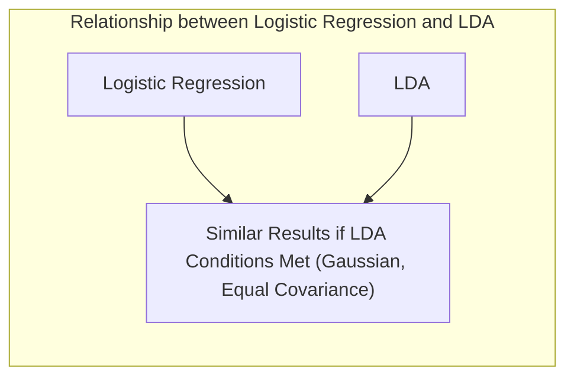

> 💡 **Exemplo Numérico:** Suponha um modelo de regressão logística com um único preditor $x$, e os parâmetros estimados são $\beta_0 = -2$ e $\beta_1 = 1$. A probabilidade de pertencer à classe 1 é modelada por $p(x) = \frac{1}{1 + e^{-(\beta_0 + \beta_1 x)}}$.  Para $x = 2$, a probabilidade é $p(2) = \frac{1}{1 + e^{-(-2 + 1 * 2)}} = \frac{1}{1 + e^{0}} = 0.5$. Para $x = 3$, $p(3) = \frac{1}{1 + e^{-(-2 + 1 * 3)}} = \frac{1}{1 + e^{-1}} \approx 0.731$. Isso ilustra como a probabilidade aumenta conforme o valor do preditor $x$ aumenta.

### Regressão Linear e Mínimos Quadrados para Classificação
<imagem: Diagrama de fluxo detalhando o processo de Regressão de Indicadores, desde a codificação das classes até a comparação com métodos probabilísticos, incluindo uma etapa de otimização para estimar os coeficientes>
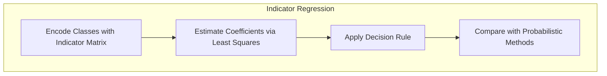
A regressão linear pode ser aplicada a problemas de classificação usando uma **matriz de indicadores** para codificar as classes. Para um problema de classificação com $K$ classes, cada observação é codificada como um vetor de $K$ elementos, onde apenas um elemento correspondente à classe verdadeira é igual a 1 e os demais são 0 [^4.2]. A regressão linear é então aplicada para estimar um modelo para cada classe, utilizando mínimos quadrados (least squares) para ajustar os parâmetros. A classe prevista para uma nova observação é aquela com a maior saída do modelo linear correspondente [^4.2]. A regressão linear para classificação é uma abordagem simples, mas apresenta algumas limitações. O problema de *masking* ocorre quando a sobreposição entre classes impede a construção de fronteiras lineares eficientes [^4.3]. A regressão linear também pode levar a previsões fora do intervalo [0,1] quando aplicada a probabilidades, sendo um problema quando a resposta esperada é uma probabilidade [^4.2].
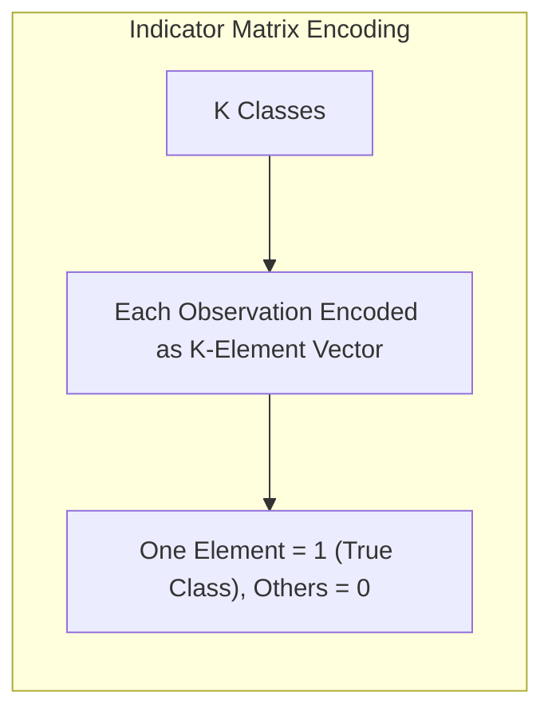
> 💡 **Exemplo Numérico:** Considere um problema de classificação com 3 classes. A observação com classe 2 seria codificada como $[0, 1, 0]$. Suponha que tenhamos 3 observações e um preditor $x$. A matriz de indicadores $Y$ e o vetor de preditores $X$ podem ser:
> $$Y = \begin{bmatrix} 1 & 0 & 0 \\ 0 & 1 & 0 \\ 0 & 0 & 1 \end{bmatrix}, X = \begin{bmatrix} 1 \\ 2 \\ 3 \end{bmatrix}$$
>  Usando mínimos quadrados, estimaríamos 3 conjuntos de coeficientes (um para cada coluna de $Y$). A classe prevista para um novo ponto $x=2.5$ seria aquela com a maior predição linear. Se os coeficientes estimados fossem, por exemplo, $\hat{\beta}_1 = [0.8, -0.2]$, $\hat{\beta}_2 = [-0.5, 0.7]$, $\hat{\beta}_3 = [-0.1, -0.1]$, então as previsões seriam: $\hat{y}_1 = 0.8 + (-0.2)*2.5=0.3$, $\hat{y}_2 = -0.5 + 0.7*2.5=1.25$, $\hat{y}_3 = -0.1 + (-0.1)*2.5=-0.35$. A classe prevista seria a 2, pois tem o maior valor previsto.

**Lemma 2:** *A relação entre regressão linear e discriminantes lineares. Sob certas condições, as projeções nos hiperplanos de decisão gerados pela regressão linear e por discriminantes lineares são equivalentes*. [^4.2], [^4.3]
Isso demonstra que a regressão linear, quando aplicada a uma matriz de indicadores, é capaz de gerar resultados semelhantes aos métodos de discriminantes lineares.
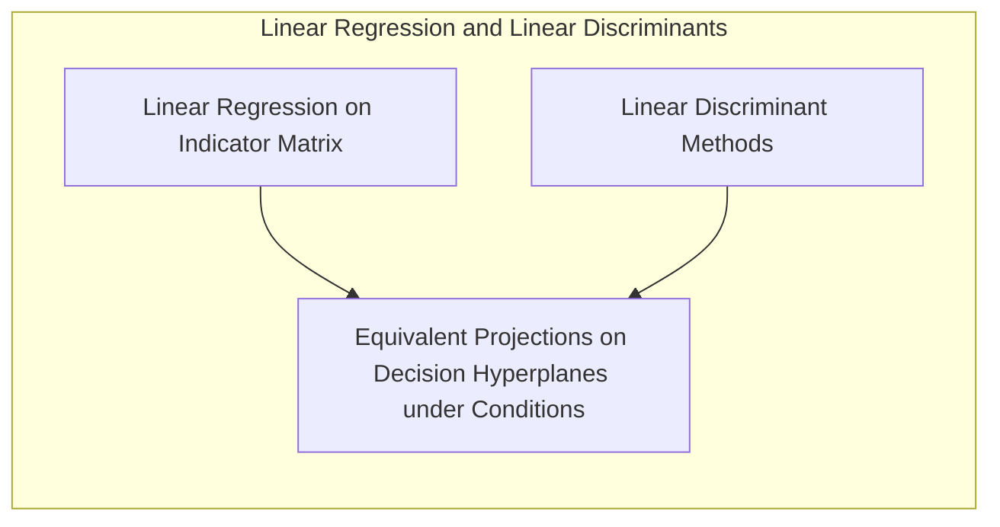
**Corolário 2:** *A simplificação da análise do modelo. O Lemma 2 permite simplificar a análise do modelo, focando nas projeções e hiperplanos de decisão em vez de diretamente nos coeficientes da regressão*. [^4.3]
Essa abordagem simplificada facilita a interpretação e comparação dos diferentes métodos de classificação linear.

A regressão logística, conforme apontado em [^4.4], fornece estimativas de probabilidade mais estáveis, enquanto a regressão de indicadores pode levar a extrapolações fora do intervalo [0,1]. No entanto, a regressão de indicadores pode ser vantajosa quando o objetivo principal é a fronteira de decisão linear, como indicado em [^4.2].

### Métodos de Seleção de Variáveis e Regularização em Classificação
A seleção de variáveis e a regularização são técnicas cruciais para evitar o *overfitting* e melhorar a generalização dos modelos de classificação, especialmente em cenários com muitas variáveis [^7.2]. Em modelos logísticos, a **penalização L1 (Lasso)** promove a esparsidade dos coeficientes, selecionando as variáveis mais relevantes para a classificação [^4.4.4], [^4.5], [^4.5.1]. A **penalização L2 (Ridge)** reduz a magnitude dos coeficientes, tornando o modelo mais estável e menos sensível a pequenas variações nos dados de treinamento [^4.4.4], [^4.5], [^4.5.1]. O **Elastic Net**, que combina as penalizações L1 e L2, aproveita as vantagens de ambas as técnicas [^4.5]. A regularização se encaixa na formulação de uma função de custo que combina a verossimilhança com termos de penalização, controlando a complexidade do modelo [^4.4.4].
$$
J(\beta) = -\frac{1}{N} \sum_{i=1}^N \left[ y_i \log(p(x_i)) + (1-y_i) \log(1-p(x_i)) \right] + \lambda \left( \alpha ||\beta||_1 + (1-\alpha) ||\beta||_2^2 \right)
$$
onde $\lambda$ é o parâmetro de regularização e $\alpha$ controla o peso das penalidades L1 e L2.
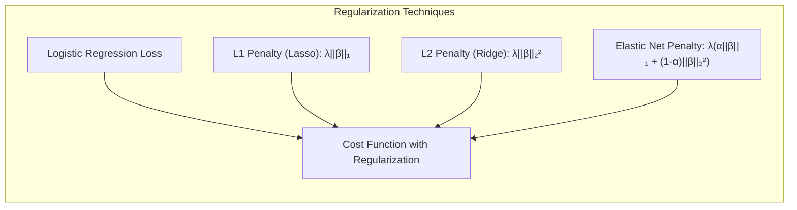

> 💡 **Exemplo Numérico:** Considere um problema de regressão logística com dois preditores, $x_1$ e $x_2$. A função de custo com regularização Elastic Net é:
> $$ J(\beta) = -\frac{1}{N} \sum_{i=1}^N \left[ y_i \log(p(x_i)) + (1-y_i) \log(1-p(x_i)) \right] + \lambda \left( \alpha (|\beta_1| + |\beta_2|) + (1-\alpha) (\beta_1^2 + \beta_2^2) \right) $$
> Suponha que após a otimização, sem regularização, os coeficientes sejam $\beta_1 = 10$ e $\beta_2 = -5$. Com regularização L1 ($\alpha = 1$, $\lambda = 0.1$) os coeficientes podem se tornar $\beta_1 = 1$ e $\beta_2 = 0$, indicando que $x_2$ foi considerado irrelevante pelo modelo. Com regularização L2 ($\alpha=0$, $\lambda=0.1$), os coeficientes podem se tornar $\beta_1 = 7$ e $\beta_2 = -3$. Já com Elastic Net, com $\alpha=0.5$, os valores podem se tornar $\beta_1 = 4$ e $\beta_2 = -1$, ambos reduzidos em magnitude, mas sem zerar nenhum deles.

**Lemma 3:** *A esparsidade induzida pela penalização L1. Em problemas de classificação logística, a penalização L1 (Lasso) leva à obtenção de coeficientes esparsos, resultando em um modelo com um número menor de variáveis relevantes*. [^4.4.4]
**Prova do Lemma 3:** A penalização L1, dada por $\lambda \sum_{j=1}^p |\beta_j|$, adiciona um termo de penalização à função de custo que é proporcional à soma dos valores absolutos dos coeficientes. O efeito dessa penalização é forçar muitos coeficientes $\beta_j$ a serem exatamente zero, criando esparsidade. A otimização da função de custo penalizada leva a uma solução onde apenas os coeficientes mais relevantes permanecem não nulos. Este efeito é decorrente da natureza não diferenciável da penalidade L1 em zero, que empurra os coeficientes para esse valor. $\blacksquare$
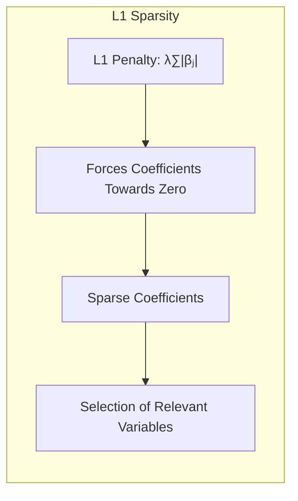

**Corolário 3:** *Implicações para interpretabilidade. Modelos com coeficientes esparsos (obtidos via penalização L1) são mais interpretáveis, pois envolvem um número menor de variáveis e revelam quais são as mais importantes para a classificação*. [^4.4.5]
Essa característica facilita a compreensão dos fatores que influenciam as previsões do modelo.
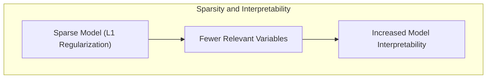

> ⚠️ **Ponto Crucial**: A combinação das penalizações L1 e L2 (Elastic Net) permite ajustar o balanço entre esparsidade e estabilidade, resultando em modelos robustos com melhor generalização [^4.5].

### Separating Hyperplanes e Perceptrons
A ideia de maximizar a margem de separação entre classes leva ao conceito de **hiperplanos ótimos**, que são hiperplanos que maximizam a distância mínima entre os pontos de cada classe e o hiperplano [^4.5.2]. A formulação do problema de otimização para encontrar hiperplanos separadores envolve o uso do dual de Wolfe, que permite que a solução seja expressa em termos de combinações lineares dos **pontos de suporte**, que são os pontos mais próximos ao hiperplano [^4.5.2]. O Perceptron de Rosenblatt é um algoritmo para encontrar um hiperplano separador linear, com convergência garantida em condições de separabilidade linear [^4.5.1].
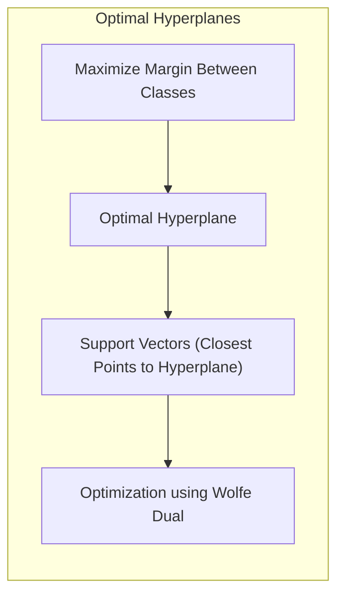

> 💡 **Exemplo Numérico:** Imagine um cenário com duas classes separadas por um hiperplano. Os pontos de suporte são aqueles que se encontram mais próximos desse hiperplano. O Perceptron ajustaria os pesos do hiperplano iterativamente, usando as amostras mal classificadas. Por exemplo, se inicialmente temos um hiperplano dado por $x_1 - x_2 = 0$ e um ponto de suporte da classe 1 está em $(1, -0.5)$, e outro da classe 0 em $(-0.5, 1)$, o Perceptron ajustaria os pesos do hiperplano para movê-lo mais perto destes pontos. Após algumas iterações, o hiperplano poderia ser $0.8x_1 - 1.2x_2 = 0$, por exemplo, separando melhor as classes.

### Pergunta Teórica Avançada: Quais as diferenças fundamentais entre a formulação de LDA e a Regra de Decisão Bayesiana considerando distribuições Gaussianas com covariâncias iguais?
**Resposta:** A LDA e a regra de decisão Bayesiana compartilham uma base teórica comum quando se assume distribuições Gaussianas com covariâncias iguais para as classes [^4.3]. A regra de decisão Bayesiana aloca uma observação à classe que maximiza a probabilidade posterior, que é proporcional à probabilidade condicional da observação dado cada classe multiplicada pela probabilidade *a priori* da classe. Sob as hipóteses de normalidade e covariâncias iguais, a probabilidade condicional pode ser expressa como uma função exponencial quadrática, e as probabilidades posteriores podem ser expressas como uma função linear dos preditores [^4.3]. Nesse caso, as fronteiras de decisão obtidas são lineares e equivalentes às fronteiras obtidas pela LDA [^4.3]. A LDA, entretanto, estima os parâmetros (médias e covariâncias) diretamente dos dados, enquanto a regra Bayesiana requer o conhecimento das distribuições ou de seus parâmetros. A escolha da média e da covariância afeta diretamente o limite de decisão, e quando a hipótese de covariâncias iguais é relaxada, as fronteiras de decisão podem se tornar quadráticas (QDA).
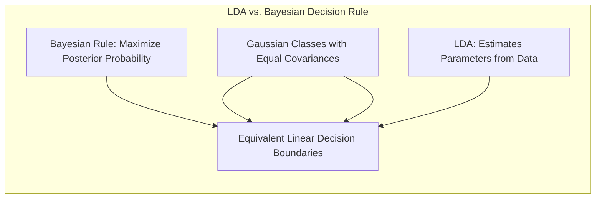
**Lemma 4:** *Equivalência formal de LDA e Bayes com covariâncias iguais. Se as classes seguem distribuições Gaussianas com a mesma matriz de covariância, então o classificador Bayesiano e a LDA são equivalentes, no sentido de que conduzem à mesma fronteira de decisão linear*. [^4.3], [^4.3.3]
**Corolário 4:** *A mudança para fronteiras quadráticas. Ao relaxar a hipótese de covariâncias iguais, as fronteiras de decisão da regra Bayesiana e do método correspondente (QDA) tornam-se quadráticas, refletindo a diferença nas distribuições dos dados*. [^4.3]
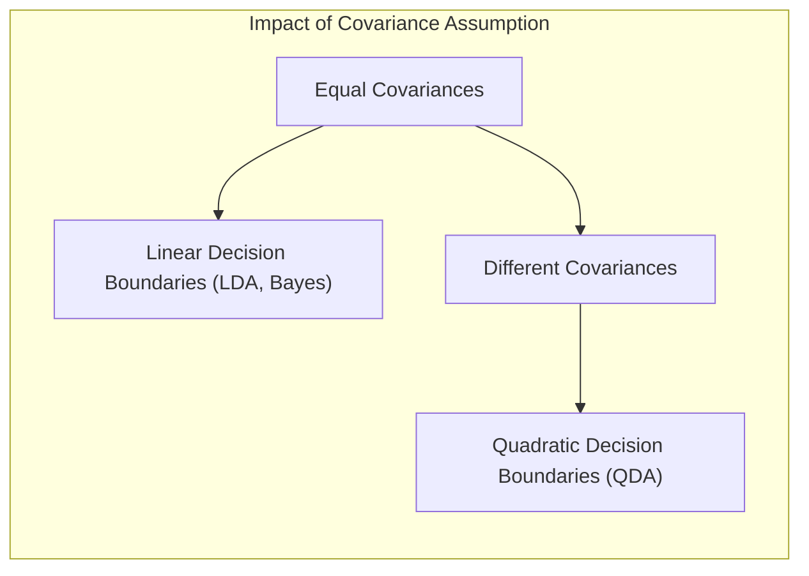
> ⚠️ **Ponto Crucial**: A escolha entre LDA (fronteiras lineares) e QDA (fronteiras quadráticas) depende de como as covariâncias são modeladas; covariâncias iguais levam a fronteiras lineares, covariâncias diferentes levam a fronteiras quadráticas [^4.3.1], [^4.3].

### Conclusão
Neste capítulo, exploramos métodos de avaliação e seleção de modelos de classificação, com foco na utilização da log-likelihood como função de perda. O *trade-off* entre viés e variância, e as técnicas de regularização foram abordados para a melhoria da generalização dos modelos. Foi demonstrado que a regressão linear, a LDA, e a regressão logística são métodos capazes de fornecer soluções de classificação lineares, cada qual com suas peculiaridades. As análises comparativas entre LDA e a regra de decisão Bayesiana sob certas condições demonstram a riqueza teórica dos modelos apresentados. Métodos de avaliação, como cross-validation e bootstrap foram mencionados, juntamente com algumas de suas limitações. O uso adequado dessas ferramentas e o profundo entendimento das técnicas discutidas são cruciais para a construção de modelos de classificação eficientes e robustos.

### Footnotes
[^7.1]: "The generalization performance of a learning method relates to its prediction capability on independent test data. Assessment of this performance is extremely important in practice, since it guides the choice of learning method or model, and gives us a measure of the quality of the ultimately chosen model." *(Trecho de <Model Assessment and Selection>)*
[^7.2]: "Figure 7.1 illustrates the important issue in assessing the ability of a learning method to generalize. Consider first the case of a quantitative or interval scale response. We have a target variable Y, a vector of inputs X, and a prediction model f(X) that has been estimated from a training set T." *(Trecho de <Model Assessment and Selection>)*
[^7.3]: "Test error, also referred to as generalization error, is the prediction error over an independent test sample" *(Trecho de <Model Assessment and Selection>)*
[^7.4]: "Training error is the average loss over the training sample" *(Trecho de <Model Assessment and Selection>)*
[^7.5]: "The story is similar for a qualitative or categorical response G taking one of K values in a set G, labeled for convenience as 1, 2, ..., K. Typically we model the probabilities pk(X) = Pr(G = k|X) (or some monotone transformations fr(X)), and then Ĝ(X) = arg maxk Îk(X). In some cases, such as 1-nearest neighbor classification (Chapters 2 and 13) we produce G(X) directly. Typical loss functions are" *(Trecho de <Model Assessment and Selection>)*
[^4.1]: "Linear methods for classification, such as linear discriminant analysis and logistic regression, attempt to find linear boundaries to separate classes" *(Trecho de <The Elements of Statistical Learning>)*
[^4.2]: "A linear regression fit to an indicator matrix can be a useful technique for classification.  For a K-class problem, we have K indicator variables, each corresponding to one of the classes. We can fit a separate linear regression to each of these indicators" *(Trecho de <The Elements of Statistical Learning>)*
[^4.3]: "Linear discriminant analysis (LDA) is a classic method for classification.  LDA is based on the assumption that the data within each class follows a multivariate Gaussian distribution with class-specific means but a common covariance matrix" *(Trecho de <The Elements of Statistical Learning>)*
[^4.3.1]: "The decision boundary is given by the locus of points where the posteriors are equal." *(Trecho de <The Elements of Statistical Learning>)*
[^4.3.2]: "In LDA the within class covariance matrix is used to define an appropriate metric for the input space" *(Trecho de <The Elements of Statistical Learning>)*
[^4.3.3]: "LDA can also be viewed as finding the optimal linear projection from the input space onto a low-dimensional subspace such that the projected class means are well separated" *(Trecho de <The Elements of Statistical Learning>)*
[^4.4]: "Logistic regression is an important and widely used method for classification. The idea is to model the posterior probability Pr(G|X) directly, rather than assuming a Gaussian model like LDA" *(Trecho de <The Elements of Statistical Learning>)*
[^4.4.1]: "The logistic model is a generalized linear model and has a logit link function" *(Trecho de <The Elements of Statistical Learning>)*
[^4.4.2]: "In practice, for binary classification, it is not unusual to have a highly unbalanced problem with one class having many more examples than the other. This is an important issue to consider when designing or assessing the performance of any classifier" *(Trecho de <The Elements of Statistical Learning>)*
[^4.4.3]: "The unknown parameters β are estimated via maximum likelihood" *(Trecho de <The Elements of Statistical Learning>)*
[^4.4.4]: "Penalized or regularized logistic regression is frequently used to address issues of overfitting and instability" *(Trecho de <The Elements of Statistical Learning>)*
[^4.4.5]: "The main motivation for this shrinkage is that it can improve the accuracy of the model; sparse models may be preferred" *(Trecho de <The Elements of Statistical Learning>)*
[^4.5]: "In particular, regularization has the effect of shrinking the coefficients, and hence improving the accuracy of the model and reducing its variance" *(Trecho de <The Elements of Statistical Learning>)*
[^4.5.1]: "A simple linear classifier is the perceptron classifier, which we discussed in Chapter 4" *(Trecho de <The Elements of Statistical Learning>)*
[^4.5.2]: "The idea of maximizing the margin of separation between the classes leads to the concept of optimal separating hyperplanes and the support vector classifier" *(Trecho de <The Elements of Statistical Learning>)*
