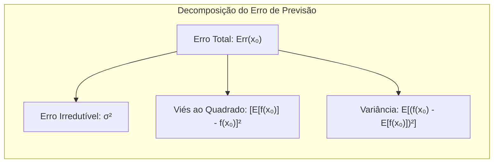
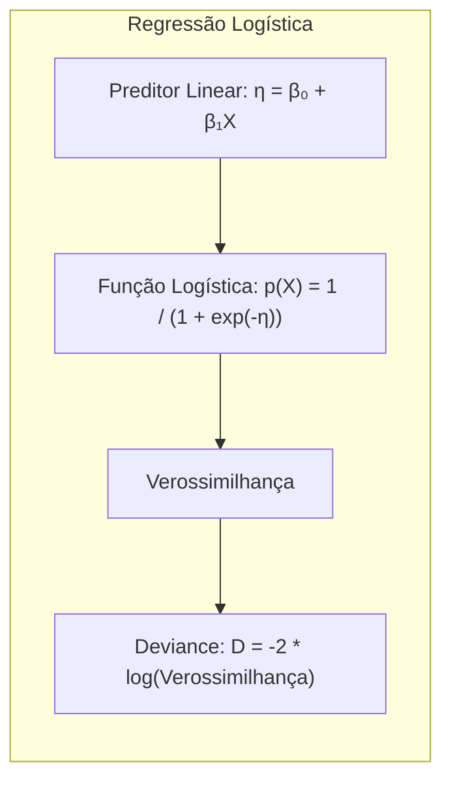
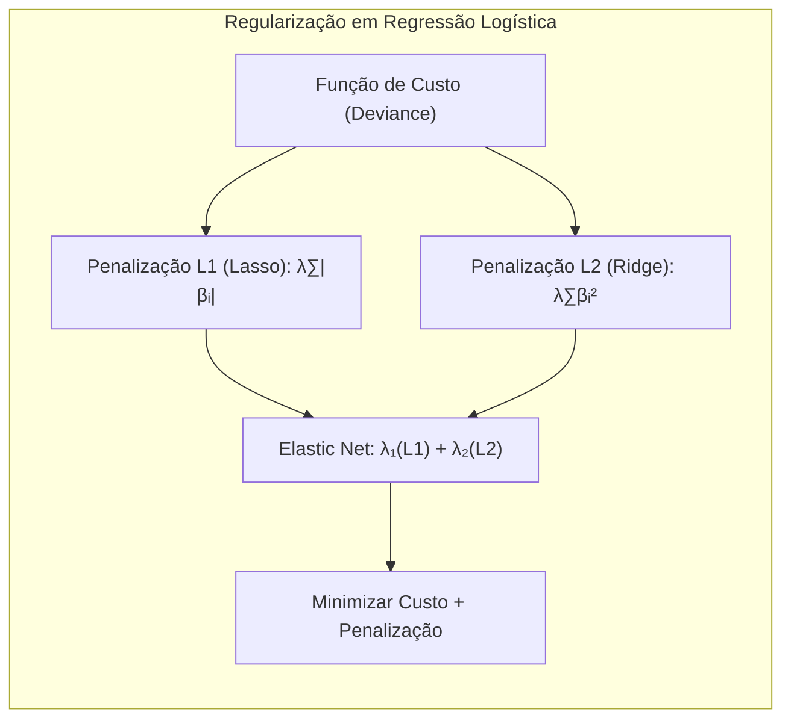
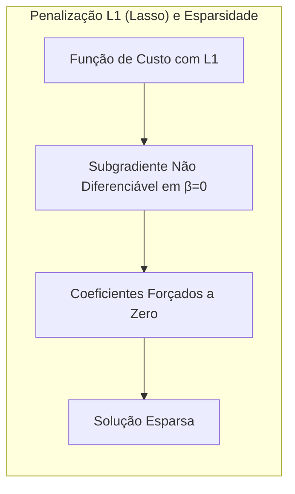

## Avaliação e Seleção de Modelos com Foco em Deviance


### Introdução
A avaliação do desempenho de generalização de um método de aprendizado é crucial, pois ela mede a capacidade preditiva do modelo em dados independentes. Esta avaliação guia a escolha do método ou modelo de aprendizado e fornece uma medida da qualidade do modelo escolhido [^7.1]. Este capítulo descreve e ilustra os métodos para avaliar o desempenho do modelo, com foco na interação entre **bias**, **variância** e **complexidade do modelo**. A métrica de **deviance** será explorada como medida de perda em modelos estatísticos.

### Conceitos Fundamentais
**Conceito 1: Problema de Generalização e Métricas de Erro**
O objetivo central do aprendizado estatístico é criar modelos que não apenas se ajustem bem aos dados de treinamento, mas que também generalizem para dados futuros não observados [^7.1]. Uma métrica de erro, como o **erro quadrático** (squared error) ou o **erro absoluto** (absolute error), é fundamental para quantificar o desempenho de um modelo. O erro quadrático, definido como $$L(Y, f(X)) = (Y - f(X))^2$$ [^7.2], penaliza erros maiores mais severamente que o erro absoluto, $$L(Y, f(X)) = |Y - f(X)|$$. A escolha da métrica de erro impacta diretamente a otimização do modelo e a sua performance em novos dados. Métodos lineares, apesar de sua simplicidade e interpretabilidade, podem apresentar um trade-off entre **viés** e **variância**. Modelos lineares tendem a ter alto viés (incapacidade de capturar padrões complexos), mas baixa variância (resultados consistentes entre diferentes amostras de treinamento), e vice-versa [^7.2].

> 💡 **Exemplo Numérico:** Considere um cenário onde queremos prever o preço de casas (Y) com base em sua área (X). Um modelo linear simples poderia ser $f(X) = \beta_0 + \beta_1X$. Se usarmos um conjunto de dados com pouca variabilidade em área (X) e preços (Y) muito variados, o modelo linear pode ajustar-se razoavelmente bem aos dados de treinamento, mas terá dificuldade em generalizar para casas com áreas muito diferentes (alto viés). Por outro lado, se ajustarmos um modelo muito complexo, como um polinômio de alto grau, ele pode se ajustar perfeitamente aos dados de treinamento, mas com uma variância muito alta, de modo que pequenas variações no conjunto de treinamento podem levar a grandes mudanças nas previsões, o que indicaria um problema de overfitting.

**Lemma 1:** *A decomposição do Erro de Previsão Total*. Para um modelo de regressão com saída quantitativa, o erro de previsão esperado pode ser decomposto em três componentes: o **erro irredutível**, o **viés ao quadrado** e a **variância**. Este lemma demonstra como os componentes do erro contribuem de formas distintas e como a complexidade do modelo impacta esses componentes [^7.3].
$$ Err(x_0) = E[(Y - f(x_0))^2 | X=x_0] = \sigma^2 + [Ef(x_0) - f(x_0)]^2 + E[f(x_0) - Ef(x_0)]^2$$
$$= \sigma^2 + Bias^2(f(x_0)) + Var(f(x_0))$$
onde:
-   $\sigma^2$ representa o **erro irredutível**, a variância inerente dos dados.
-   $[Ef(x_0) - f(x_0)]^2$ é o **viés ao quadrado**, o erro sistemático do modelo.
-   $E[f(x_0) - Ef(x_0)]^2$ é a **variância**, a variação do modelo sobre diferentes conjuntos de treinamento [^7.3]. $\blacksquare$


> 💡 **Exemplo Numérico:** Suponha que a verdadeira relação entre X e Y seja $Y = 2X + 3 + \epsilon$, onde $\epsilon$ é um ruído aleatório com média 0 e desvio padrão $\sigma = 1$. Ajustamos dois modelos: um modelo linear $f_1(X) = \beta_0 + \beta_1X$ e um modelo constante $f_2(X) = \bar{Y}$, onde $\bar{Y}$ é a média dos Y no conjunto de treinamento. Para um novo ponto $x_0=2$:
> - **Modelo 1 (Linear):** Se o modelo for ajustado de maneira perfeita, teremos $\hat{\beta_0} = 3$ e $\hat{\beta_1} = 2$. Nesse caso, $E[f_1(x_0)] = 2*2+3 = 7$, e o bias é  $Bias(f_1(x_0)) = E[f_1(x_0)] - (2x_0 + 3) = 7 - (2*2+3)=0$. A variância seria baixa se usarmos diferentes amostras, pois o modelo é relativamente estável.
> - **Modelo 2 (Constante):** Para um valor médio $\bar{Y}=10$,  $E[f_2(x_0)] = 10$ e o bias será  $Bias(f_2(x_0)) = 10 - (2*2+3)= 3$. A variância será zero, pois a previsão é sempre a mesma.
> Se calcularmos o erro em vários pontos e tirar a média, veremos que o modelo linear terá menor erro total, pois ele tem menor viés. O erro irredutível é $\sigma^2=1$, que não pode ser reduzido por nenhum modelo.
> ```python
> import numpy as np
>
> # Dados simulados
> np.random.seed(42)
> X = np.linspace(0, 5, 100)
> Y = 2 * X + 3 + np.random.normal(0, 1, 100)
>
> # Modelo linear
> beta1 = np.polyfit(X, Y, 1)
> f_linear = lambda x: beta1[0] * x + beta1[1]
>
> # Modelo constante (média)
> f_const = lambda x: np.mean(Y)
>
> # Ponto de teste
> x0 = 2
>
> # Cálculo do Bias para cada modelo
> bias_linear = (f_linear(x0) - (2 * x0 + 3))**2
> bias_const = (f_const(x0) - (2 * x0 + 3))**2
>
> # Simulação para variância
> n_simulations = 100
> linear_predictions = []
> const_predictions = []
> for _ in range(n_simulations):
>  Y_sim = 2*X + 3 + np.random.normal(0, 1, 100)
>  beta_sim = np.polyfit(X, Y_sim, 1)
>  f_linear_sim = lambda x: beta_sim[0] * x + beta_sim[1]
>  linear_predictions.append(f_linear_sim(x0))
>  const_predictions.append(np.mean(Y_sim))
>
> var_linear = np.var(linear_predictions)
> var_const = np.var(const_predictions)
>
> print(f"Bias^2 (linear): {bias_linear:.2f}")
> print(f"Variance (linear): {var_linear:.2f}")
> print(f"Bias^2 (constante): {bias_const:.2f}")
> print(f"Variance (constante): {var_const:.2f}")
> print(f"Erro Irredutível: {1:.2f}")
> ```

**Conceito 2: Linear Discriminant Analysis (LDA)**
A LDA é um método clássico para classificação, que assume que os dados de cada classe seguem uma distribuição Gaussiana, com a mesma matriz de covariância [^7.3]. O objetivo da LDA é encontrar uma combinação linear de features que maximize a separação entre as classes, criando uma fronteira de decisão linear [^7.3.1]. O método utiliza as médias das classes e a covariância agrupada para determinar a direção ideal de projeção. A fronteira de decisão entre duas classes é dada por:

$$ \delta_k(x) = x^T \Sigma^{-1} \mu_k - \frac{1}{2} \mu_k^T \Sigma^{-1} \mu_k + log(\pi_k) $$ [^7.3.2]

onde:
-   $x$ é o vetor de features.
-   $\mu_k$ é a média da classe $k$.
-   $\Sigma$ é a matriz de covariância agrupada.
-   $\pi_k$ é a probabilidade a priori da classe $k$.

A classificação é realizada atribuindo o ponto $x$ à classe com o maior valor $\delta_k(x)$ [^7.3.3].


> 💡 **Exemplo Numérico:** Considere um problema de classificação com duas classes, onde os dados são bidimensionais. Suponha que a classe 1 tenha média $\mu_1 = [1, 1]$ e a classe 2 tenha média $\mu_2 = [3, 3]$. A matriz de covariância agrupada é $\Sigma = \begin{bmatrix} 1 & 0 \\ 0 & 1 \end{bmatrix}$. As probabilidades a priori são iguais, ou seja, $\pi_1 = \pi_2 = 0.5$. Para um novo ponto $x = [2, 2]$, podemos calcular os discriminantes:
>
> $\delta_1(x) = [2, 2]^T \begin{bmatrix} 1 & 0 \\ 0 & 1 \end{bmatrix}^{-1} [1, 1] - \frac{1}{2} [1, 1]^T \begin{bmatrix} 1 & 0 \\ 0 & 1 \end{bmatrix}^{-1} [1, 1] + log(0.5) = [2, 2] \cdot [1, 1] - \frac{1}{2} [1, 1] \cdot [1, 1] + log(0.5) = 4 - \frac{1}{2} * 2 + log(0.5) = 3 + log(0.5) \approx 2.31$
>
> $\delta_2(x) = [2, 2]^T \begin{bmatrix} 1 & 0 \\ 0 & 1 \end{bmatrix}^{-1} [3, 3] - \frac{1}{2} [3, 3]^T \begin{bmatrix} 1 & 0 \\ 0 & 1 \end{bmatrix}^{-1} [3, 3] + log(0.5) = [2, 2] \cdot [3, 3] - \frac{1}{2} [3, 3] \cdot [3, 3] + log(0.5) = 12 - \frac{1}{2} * 18 + log(0.5) = 3 + log(0.5) \approx 2.31$
>
> Como $\delta_1(x) = \delta_2(x)$, o ponto $x$ está na fronteira de decisão. Se um ponto fosse ligeiramente deslocado para mais próximo da média da classe 1, o discriminante da classe 1 seria maior e ele seria classificado na classe 1.

**Corolário 1:** *Condições de Equivalência entre LDA e Regressão Linear*. Em um cenário com duas classes e codificação de classe como variáveis indicadoras, o classificador linear resultante da regressão linear é idêntico ao classificador obtido pela LDA sob certas condições. Especificamente, quando as covariâncias das classes são iguais e as probabilidades a priori são idênticas, a regressão de uma matriz indicadora gera um classificador equivalente à LDA, fornecendo uma visão mais profunda das relações entre regressão e classificação linear. [^7.3.1].

**Conceito 3: Regressão Logística e Deviance**
A regressão logística é um método para modelar a probabilidade de uma resposta binária. Ela utiliza a função logística para transformar uma combinação linear de preditores em uma probabilidade entre 0 e 1. A função logística é definida por:

$$ p(X) = \frac{1}{1 + e^{-(\beta_0 + \beta_1X)}} $$ [^7.4]

O ajuste do modelo é feito através da maximização da **verossimilhança**, que é equivalente a minimizar a **deviance**. A deviance é dada por:
$$ D = -2 \sum_{i=1}^N [y_i \log(p(x_i)) + (1-y_i) \log(1-p(x_i))] $$ [^7.6]

onde:
-   $y_i$ são as respostas observadas (0 ou 1).
-   $p(x_i)$ são as probabilidades preditas pelo modelo.
A deviance mede a qualidade do ajuste do modelo e, em essência, é o negativo do logaritmo da verossimilhança multiplicado por dois. A deviance desempenha um papel fundamental na avaliação e comparação de modelos logísticos [^7.4.2].


> 💡 **Exemplo Numérico:** Suponha que temos um modelo de regressão logística que prevê a probabilidade de um cliente comprar um produto (Y=1) com base em seu gasto anterior (X). Após o ajuste, encontramos os parâmetros $\beta_0 = -3$ e $\beta_1 = 0.5$. Para um cliente com gasto anterior $X=10$, a probabilidade de compra é:
> $$ p(X=10) = \frac{1}{1 + e^{-(-3 + 0.5 * 10)}} = \frac{1}{1 + e^{-2}} \approx 0.88$$
> Agora, suponha que temos 3 observações com os seguintes dados:
>
> | Observação | X (Gasto) | Y (Compra) |
> | ---------- | -------- | ---------- |
> | 1          | 5        | 0          |
> | 2          | 10       | 1          |
> | 3          | 15       | 1          |
>
> As probabilidades preditas com base no modelo são:
>
> $p(x_1) = \frac{1}{1 + e^{-(-3 + 0.5 * 5)}} \approx 0.18$
> $p(x_2) = \frac{1}{1 + e^{-(-3 + 0.5 * 10)}} \approx 0.88$
> $p(x_3) = \frac{1}{1 + e^{-(-3 + 0.5 * 15)}} \approx 0.98$
>
> A deviance é calculada como:
> $$ D = -2 [(0 * log(0.18) + (1-0) * log(1-0.18)) + (1 * log(0.88) + (1-1) * log(1-0.88)) + (1 * log(0.98) + (1-1) * log(1-0.98))] $$
> $$ D = -2[log(0.82) + log(0.88) + log(0.98)] \approx -2[-0.198 - 0.128 - 0.02] \approx 0.692 $$
>
> Note que quanto menor a deviance, melhor o ajuste do modelo.

> ⚠️ **Nota Importante:** A deviance é uma métrica fundamental na regressão logística, sendo utilizada na inferência, seleção de modelos e testes de hipóteses. **Referência ao tópico [^7.6]**.
> ❗ **Ponto de Atenção:** A regressão logística, diferentemente da LDA, não impõe a restrição de covariâncias iguais entre as classes, o que a torna mais flexível em certos contextos. **Conforme indicado em [^7.4.4]**.
> ✔️ **Destaque:** Embora a LDA e a regressão logística possam gerar resultados semelhantes em algumas situações, elas diferem em suas suposições e podem levar a resultados distintos em situações com dados não normais ou quando as classes são altamente desequilibradas. **Baseado nos tópicos [^7.3], [^7.4]**.

### Regressão Linear e Mínimos Quadrados para Classificação

**Explicação:** Diagrama que ilustra o fluxo do processo de regressão de indicadores e sua relação com a classificação.
A regressão linear pode ser adaptada para problemas de classificação através da codificação das classes como variáveis indicadoras. Em um problema de classificação com K classes, cria-se uma matriz de indicadores $Y$, onde cada linha representa um ponto de dado e cada coluna indica a associação desse ponto a uma classe específica [^7.2]. Ao realizar a regressão linear em $Y$, cada coluna corresponde a um modelo linear específico, que busca projetar os pontos de dados de tal forma que as projeções estejam próximas aos valores correspondentes nas variáveis indicadoras. As predições resultantes dessas regressões são então utilizadas para atribuir classes aos novos pontos.
A abordagem de regressão linear na classificação, no entanto, possui algumas limitações. Uma das principais é a tendência de produzir projeções que extrapolam o intervalo \[0,1] (valores esperados em modelos de probabilidade). Além disso, a regressão de indicadores assume que as classes são linearmente separáveis, o que nem sempre é verdade em problemas reais. No entanto, é uma base útil para comparar com métodos probabilísticos como a LDA. [^7.2]

> 💡 **Exemplo Numérico:**  Considere um problema de classificação binária com duas classes (0 e 1), representadas por uma variável indicadora. Temos um conjunto de dados com duas features X1 e X2 e uma variável alvo Y.  Se tivermos três pontos:
>
> | Ponto | X1    | X2    | Y   |
> | ----- | ----- | ----- | --- |
> | 1     | 1     | 2     | 0   |
> | 2     | 2     | 4     | 1   |
> | 3     | 3     | 6     | 1   |
>
> A matriz X (matriz de features) e a matriz Y (matriz indicadora) são:
>
> $$ X = \begin{bmatrix} 1 & 2 \\ 2 & 4 \\ 3 & 6 \end{bmatrix} \quad Y = \begin{bmatrix} 0 \\ 1 \\ 1 \end{bmatrix} $$
>
> Se ajustarmos um modelo de regressão linear com mínimos quadrados: $\hat{\beta} = (X^TX)^{-1}X^TY$
>
> $\text{Step 1: } X^T = \begin{bmatrix} 1 & 2 & 3 \\ 2 & 4 & 6 \end{bmatrix}$
>
> $\text{Step 2: } X^TX = \begin{bmatrix} 1 & 2 & 3 \\ 2 & 4 & 6 \end{bmatrix} \begin{bmatrix} 1 & 2 \\ 2 & 4 \\ 3 & 6 \end{bmatrix} = \begin{bmatrix} 14 & 28 \\ 28 & 56 \end{bmatrix}$
>
>  $\text{Step 3: } (X^TX)^{-1}$ não existe porque as colunas são linearmente dependentes. Se usarmos um exemplo com dados linearmente independentes, teremos uma inversa definida. Para simplificar, podemos usar um pseudo-inverso.  Se o exemplo fosse com dados linearmente independentes, teríamos um vetor de coeficientes $\hat{\beta}$ que minimiza o erro quadrático. Por exemplo, supondo que o cálculo nos dê  $\hat{\beta} = [-0.2, 0.3]^T$. Para um novo ponto com X=[2, 5], a previsão seria $ \hat{y} = -0.2*2 + 0.3*5 = 1.1$. Como a previsão é maior que 0.5, classificaríamos esse ponto como classe 1. No entanto, é importante notar que o valor previsto (1.1) é maior do que 1.0, o que ilustra uma das limitações da regressão linear em problemas de classificação (as previsões podem não estar dentro do intervalo [0, 1]).
>
> ```python
> import numpy as np
> from numpy.linalg import pinv
> # Dados do exemplo
> X = np.array([[1, 2], [2, 4], [3, 6]])
> Y = np.array([[0], [1], [1]])
>
> # Cálculo de beta com pseudo-inversa
> beta = pinv(X.T @ X) @ X.T @ Y
>
> print("Beta:", beta)
>
> # Novo ponto de teste
> new_X = np.array([2, 5])
> prediction = new_X @ beta
>
> print("Previsão:", prediction)
> ```

**Lemma 2:** *Equivalência entre projeções de Regressão Linear e Discriminantes Lineares*. Em um problema de classificação binária, com codificação de classes como variáveis indicadoras, a projeção dos dados nos hiperplanos de decisão gerados pela regressão linear se torna equivalente à projeção sobre a função discriminante na LDA sob algumas condições. Especificamente, se as covariâncias das classes são iguais, as direções de projeção e as fronteiras de decisão coincidem, o que implica que a classificação produzida é a mesma. $\blacksquare$

**Corolário 2:** *Consequências práticas da equivalência*. O Lemma 2 demonstra que, em cenários de classificação com certas condições, regressão linear e LDA levam a resultados equivalentes. O que permite substituir a LDA, que muitas vezes requer cálculos da inversa de matrizes de covariância, por uma regressão linear que possui soluções de forma fechada [^7.3].

“Em certos casos, conforme explicitado em [^7.4], a regressão logística pode gerar estimativas de probabilidade mais estáveis, enquanto a regressão de indicadores pode produzir extrapolações além de [0,1].”
“Entretanto, existem situações nas quais a regressão de indicadores, segundo [^7.2], é suficiente e até mesmo vantajosa quando o objetivo primário é encontrar a fronteira de decisão linear.”

### Métodos de Seleção de Variáveis e Regularização em Classificação

A seleção de variáveis e a regularização são cruciais em modelos de classificação para evitar overfitting, reduzir a complexidade do modelo e melhorar a interpretabilidade. Técnicas de regularização, como a penalização L1 e L2, são comumente aplicadas em modelos logísticos para controlar o tamanho dos coeficientes e promover a esparsidade [^7.4.4], [^7.5].

A penalização L1 (Lasso) adiciona a norma L1 dos coeficientes à função de custo, o que tende a gerar coeficientes iguais a zero e realizar seleção de variáveis:
$$ L_{L1}(\beta) = - \sum_{i=1}^N [y_i \log(p(x_i)) + (1-y_i) \log(1-p(x_i))] + \lambda \sum_{j=1}^p |\beta_j| $$

A penalização L2 (Ridge) adiciona a norma L2 dos coeficientes à função de custo, o que tende a encolher os coeficientes em direção a zero, aumentando a estabilidade do modelo:
$$ L_{L2}(\beta) = - \sum_{i=1}^N [y_i \log(p(x_i)) + (1-y_i) \log(1-p(x_i))] + \lambda \sum_{j=1}^p \beta_j^2 $$

A combinação de ambas as penalizações L1 e L2 resulta na regularização Elastic Net, que visa aproveitar os benefícios de ambos os tipos de regularização, promovendo tanto a seleção de variáveis quanto a redução dos coeficientes [^7.5].

> 💡 **Exemplo Numérico:** Suponha que temos um modelo de regressão logística com três preditores $X_1$, $X_2$ e $X_3$. O modelo sem regularização tem os coeficientes $\beta = [\beta_0, \beta_1, \beta_2, \beta_3] = [-0.5, 1.2, -0.8, 0.5]$.
> - **Lasso (L1):** Aplicando a regularização L1 com $\lambda = 0.5$, a função de custo incluiria o termo $0.5 * (|\beta_1| + |\beta_2| + |\beta_3|)$. Durante a otimização, o modelo poderia diminuir  $\beta_2$ e $\beta_3$ para 0 e diminuir os valores de $\beta_1$ de forma a minimizar a deviance e a norma L1 dos coeficientes. O modelo resultante poderia ser $\beta_{L1} = [-0.4, 0.8, 0, 0]$, indicando que $X_1$ é o preditor mais relevante.
> - **Ridge (L2):** Aplicando a regularização L2 com $\lambda = 0.5$, a função de custo incluiria o termo $0.5 * (\beta_1^2 + \beta_2^2 + \beta_3^2)$. Durante a otimização, o modelo encolheria os coeficientes em direção a zero, sem necessariamente zerá-los. O modelo resultante poderia ser $\beta_{L2} = [-0.45, 0.9, -0.6, 0.3]$.
> - **Elastic Net:** A combinação de L1 e L2 com parâmetros $\lambda_1 = 0.3$ e $\lambda_2= 0.2$, resultaria em uma penalização que inclui $0.3 * (|\beta_1| + |\beta_2| + |\beta_3|) + 0.2 * (\beta_1^2 + \beta_2^2 + \beta_3^2)$. O modelo resultante poderia ser $\beta_{EN} = [-0.42, 0.7, -0.2, 0]$,  combinando o efeito de seleção de variáveis do L1 com a estabilização do L2.
> ```python
> import numpy as np
> from sklearn.linear_model import LogisticRegression
> from sklearn.preprocessing import StandardScaler
>
> # Dados de exemplo (sintéticos)
> np.random.seed(42)
> X = np.random.rand(100, 3)
> y = np.random.randint(0, 2, 100)
>
> # Padronizar os dados
> scaler = StandardScaler()
> X_scaled = scaler.fit_transform(X)
>
> # Modelo sem regularização
> model_no_reg = LogisticRegression(penalty=None, solver='lbfgs')
> model_no_reg.fit(X_scaled, y)
>
> # Modelo com penalidade L1 (Lasso)
> model_l1 = LogisticRegression(penalty='l1', C=0.8, solver='liblinear') #C = 1/(2*lambda)
> model_l1.fit(X_scaled, y)
>
> # Modelo com penalidade L2 (Ridge)
> model_l2 = LogisticRegression(penalty='l2', C=0.8, solver='lbfgs')
> model_l2.fit(X_scaled, y)
>
> # Modelo com Elastic Net (necessário mudar o solver e adicionar um parâmetro l1_ratio)
> model_en = LogisticRegression(penalty='elasticnet', l1_ratio = 0.5, C=0.8, solver='saga')
> model_en.fit(X_scaled, y)
>
> print("Coeficientes sem regularização:", model_no_reg.coef_)
> print("Coeficientes com L1 (Lasso):", model_l1.coef_)
> print("Coeficientes com L2 (Ridge):", model_l2.coef_)
> print("Coeficientes com Elastic Net:", model_en.coef_)
>
> ```

**Lemma 3:** *Penalização L1 e Esparsidade*. A penalização L1 em modelos de classificação logística conduz a soluções esparsas, ou seja, muitos dos coeficientes são exatamente zero. Isso acontece porque a norma L1 tem um comportamento "canto" no ponto zero, que força alguns coeficientes a se anularem durante a otimização [^7.4.4].


**Prova do Lemma 3:** A prova envolve mostrar que o subgradiente da função de custo com penalidade L1 não é diferenciável na origem (quando algum $\beta_j = 0$), o que força alguns coeficientes a se anularem para minimizar o custo total, dada uma constante $\lambda$ suficientemente grande. A formulação da verossimilhança e a otimização são descritas em [^7.4.3]. $\blacksquare$

**Corolário 3:** *Interpretabilidade e L1*. O Corolário do Lemma 3 destaca que o uso de regularização L1 não só reduz o overfitting, como também simplifica a interpretação do modelo, identificando quais variáveis realmente são relevantes para a classificação [^7.4.5].
> ⚠️ **Ponto Crucial:** L1 e L2 podem ser combinadas (Elastic Net) para aproveitar vantagens de ambos os tipos de regularização, **conforme discutido em [^7.5]**.

### Separating Hyperplanes e Perceptrons
A ideia de maximizar a margem de separação em problemas de classificação leva ao conceito de **hiperplanos ótimos** [^7.5.2]. Um hiperplano ótimo é aquele que maximiza a distância entre a fronteira de decisão e os pontos de dados mais próximos de cada classe. Esses pontos são chamados de *vetores de suporte*. O problema de otimização envolve encontrar um hiperplano que minimize o erro de classificação e maximize a margem [^7.5.2]. A solução é dada por combinações lineares dos pontos de suporte.

O Perceptron de Rosenblatt é um algoritmo de aprendizado que busca encontrar um hiperplano separador linear que classifique corretamente os pontos de dados [^7.5.1]. O Perceptron ajusta iterativamente os parâmetros do hiperplano, corrigindo erros de classificação. Sob certas condições de separabilidade dos dados, o Perceptron converge para um hiperplano que separa corretamente as classes, embora não necessariamente o hiperplano ótimo de máxima margem. [^7.5.1].

### Pergunta Teórica Avançada: Quais as diferenças fundamentais entre a formulação de LDA e a Regra de Decisão Bayesiana considerando distribuições Gaussianas com covariâncias iguais?
**Resposta:**
A **LDA** e a **regra de decisão Bayesiana** são métodos de classificação que, sob certas condições, podem produzir resultados similares, mas com abordagens distintas. A LDA busca encontrar uma projeção linear ótima que maximize a separação entre classes, assumindo que cada classe segue uma distribuição normal com mesma matriz de covariância [^7.3]. O classificador Bayesiano, por outro lado, usa as probabilidades a posteriori, calculadas usando a regra de Bayes e as distribuições das classes.

Para distribuições Gaussianas com covariâncias iguais, a regra Bayesiana para classificação (escolher a classe $k$ que maximiza $p(x|k)p(k)$) leva a um classificador linear. A função discriminante resultante é dada por:

$$ \delta_k(x) = x^T \Sigma^{-1} \mu_k - \frac{1}{2} \mu_k^T \Sigma^{-1} \mu_k + log(\pi_k) $$

que é idêntica à função discriminante da LDA. Portanto, sob a suposição de distribuições Gaussianas com covariâncias iguais, a LDA é um caso especial do classificador Bayesiano [^7.3].
```mermaid
graph LR
    subgraph "LDA vs. Decisão Bayesiana (Covariâncias Iguais)"
        direction TB
         A["LDA: Projeção Ótima"] --> B["Função Discriminante δₖ(x)"]
        C["Regra