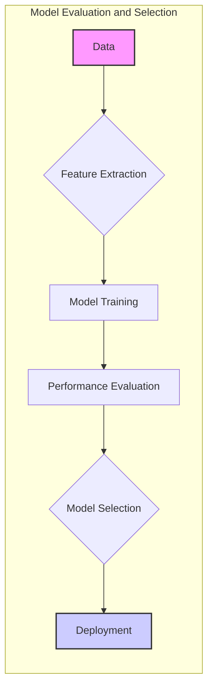
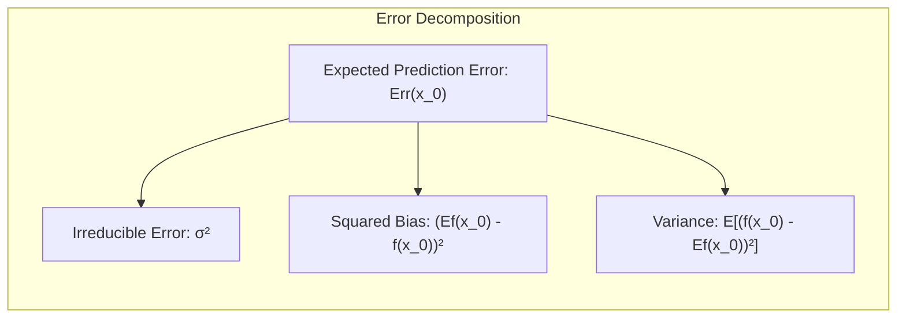
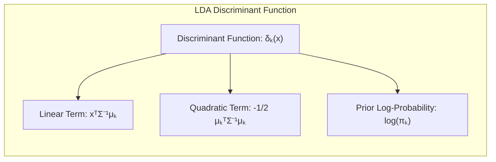
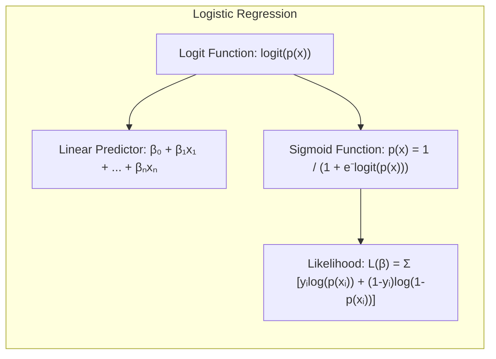
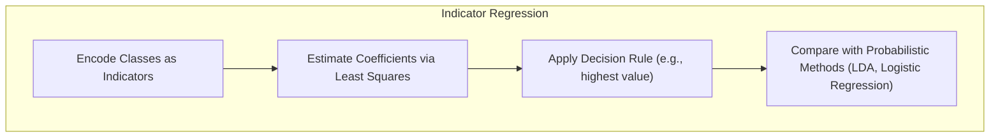
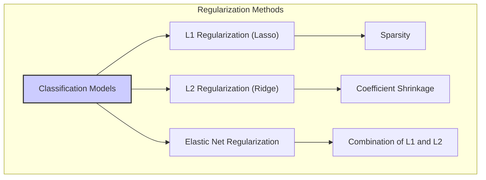
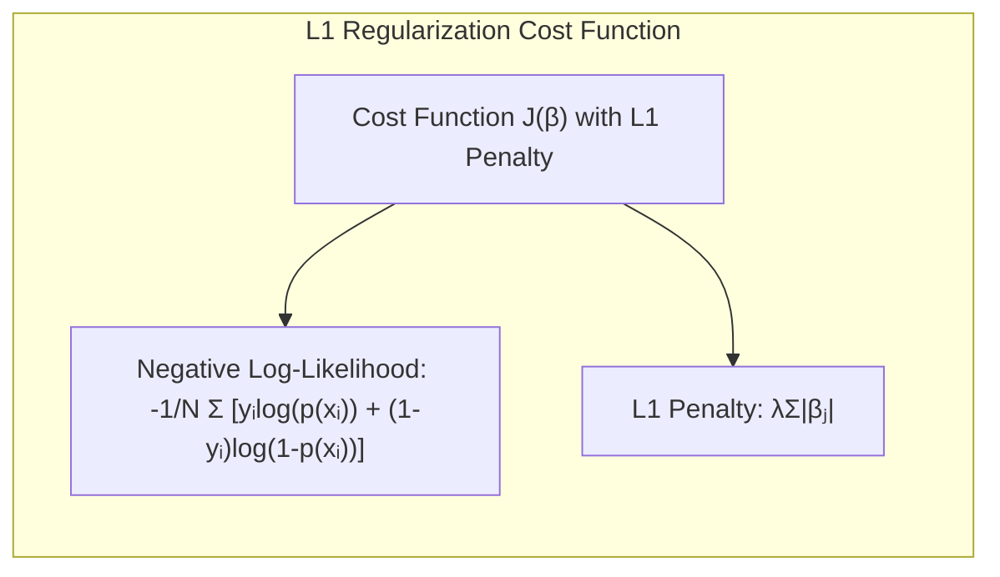
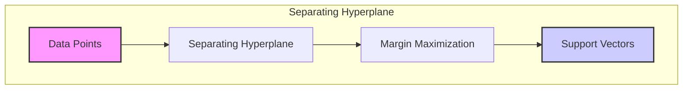
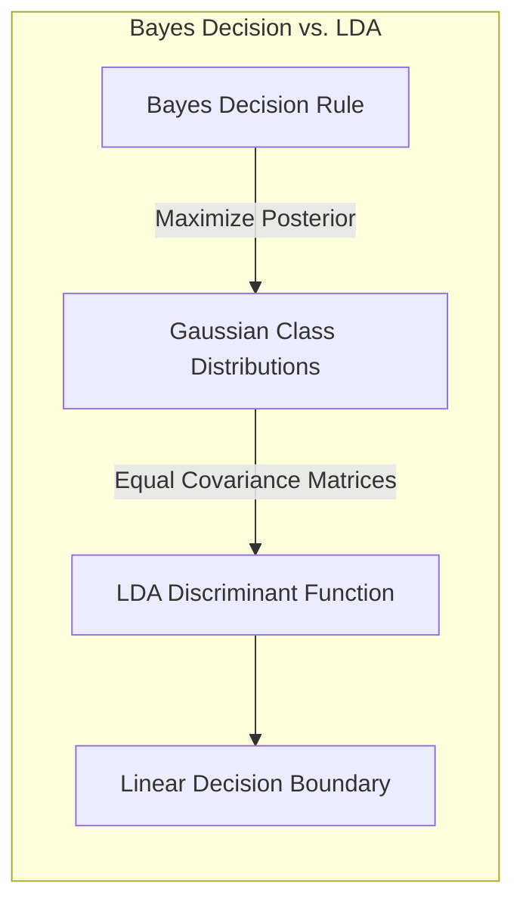

## Avaliação e Seleção de Modelos Estatísticos



### Introdução

A performance de generalização de um método de aprendizado refere-se à sua capacidade de predição em dados de teste independentes. A avaliação dessa performance é extremamente importante na prática, uma vez que orienta a escolha do método ou modelo de aprendizado e fornece uma medida da qualidade do modelo finalmente escolhido [^7.1]. Neste capítulo, exploramos os principais métodos para avaliação de desempenho e como eles são utilizados para a seleção de modelos. Começamos com uma discussão sobre a relação entre *bias*, *variance* e a complexidade do modelo [^7.1].

### Conceitos Fundamentais

**Conceito 1:** O **problema de classificação** e o de regressão consistem, essencialmente, em construir uma função $f(X)$ que aproxime uma variável alvo $Y$. Modelos com baixa complexidade podem apresentar *high bias*, pois podem não conseguir capturar nuances importantes dos dados. Por outro lado, modelos altamente complexos podem sofrer de *high variance*, ajustando-se ao ruído dos dados de treino e generalizando mal para novos dados [^7.2]. O objetivo da seleção de modelos é encontrar um equilíbrio entre *bias* e *variance*, de modo a otimizar o desempenho preditivo do modelo em dados não vistos.

**Lemma 1:**  Em um contexto de regressão com erro quadrático, a decomposição do erro esperado de predição (test error) em *bias* e *variance* pode ser expressa como:
$$Err(x_0) = \sigma^2 + [Ef(x_0) - f(x_0)]^2 + E[f(x_0) - Ef(x_0)]^2$$
Onde $\sigma^2$ é o erro irredutível, $[Ef(x_0) - f(x_0)]^2$ é o *squared bias* e $E[f(x_0) - Ef(x_0)]^2$ é a *variance* do modelo. A prova desta decomposição pode ser encontrada ao expandir a expressão $E[(Y - f(x_0))^2 | X=x_0]$ e usar as propriedades da esperança e variância. [^7.3] $\blacksquare$



> 💡 **Exemplo Numérico:**
> Suponha que temos um modelo de regressão que tenta prever os preços de casas ($Y$) com base no tamanho da casa ($X$). A verdadeira relação entre tamanho e preço é dada por $f(x) = 2x + 5 + \epsilon$, onde $\epsilon \sim \mathcal{N}(0, 1)$ representa o erro aleatório.
>
> **Caso 1: Modelo Simples (Alto Bias, Baixa Variância)**
> Ajustamos um modelo linear muito simples: $\hat{f}(x) = 1.5x + 3$.
> - *Bias*: Se $x_0 = 10$, o valor real seria $f(10) = 25$. A previsão do modelo é $\hat{f}(10) = 18$. O *bias* é $25 - 18 = 7$, e o *squared bias* é $7^2 = 49$. O *bias* é alto porque o modelo não consegue capturar a verdadeira relação (coeficiente angular de 2). A *variância* é baixa porque o modelo, sendo simples, não é muito afetado por pequenas mudanças nos dados de treinamento.
>
> **Caso 2: Modelo Complexo (Baixo Bias, Alta Variância)**
> Ajustamos um modelo polinomial de alto grau: $\hat{f}(x) = 0.1x^3 - 2x^2 + 10x -5 $. Este modelo ajusta-se bem aos dados de treinamento, mas varia muito com pequenos conjuntos de dados.
> - *Bias*: Para $x_0 = 10$, a previsão pode ser muito próxima do valor real. O *bias* é pequeno.
> - *Variância*: No entanto, se mudarmos levemente o conjunto de dados de treinamento, a curva do modelo muda muito, resultando em alta variância.
>
> **Ilustração:**
> ```mermaid
>  graph LR
>      A["Modelo Simples"] -->| "Alto Bias" | B("Erro de Previsão")
>      A -->| "Baixa Variância" | C("Estabilidade")
>      D["Modelo Complexo"] -->| "Baixo Bias" | E("Boa Previsão nos Dados de Treino")
>      D -->| "Alta Variância" | F("Instabilidade")
> ```
> O objetivo é encontrar um modelo que equilibre bias e variância, de forma a minimizar o erro de predição em dados não vistos.

**Conceito 2:** **Linear Discriminant Analysis (LDA)** é um método para classificação que assume que as classes possuem distribuições Gaussianas com a mesma matriz de covariância [^7.3]. LDA constrói uma fronteira de decisão linear otimizada para separar as classes ao maximizar a razão entre a variância entre classes e a variância dentro das classes [^7.3.1]. As suposições de normalidade e covariância igual são cruciais para a aplicabilidade do LDA. A função discriminante linear para um ponto $x$ pode ser expressa como:
$$\delta_k(x) = x^T \Sigma^{-1}\mu_k - \frac{1}{2} \mu_k^T\Sigma^{-1}\mu_k + \log \pi_k$$
onde $\mu_k$ é a média da classe $k$, $\Sigma$ é a matriz de covariância comum e $\pi_k$ é a probabilidade a priori da classe $k$ [^7.3.2]. LDA projeta os dados em um subespaço de menor dimensão que maximiza a separabilidade entre as classes.



**Corolário 1:**  A função discriminante linear do LDA pode ser vista como uma projeção dos dados em um subespaço definido pelos autovetores da matriz de covariância. Essa projeção é ideal para separar classes com distribuições gaussianas e covariâncias iguais. A função discriminante $\delta_k(x)$ projeta os dados em um subespaço de dimensão $K-1$, onde $K$ é o número de classes. [^7.3.3]

> 💡 **Exemplo Numérico:**
>
> Suponha que temos um problema de classificação com duas classes (A e B) e duas características ($x_1$ e $x_2$). As médias e matriz de covariância estimadas das duas classes são:
>
> - Classe A: $\mu_A = \begin{bmatrix} 2 \\ 3 \end{bmatrix}$, $\Sigma = \begin{bmatrix} 1 & 0.5 \\ 0.5 & 1 \end{bmatrix}$
> - Classe B: $\mu_B = \begin{bmatrix} 4 \\ 6 \end{bmatrix}$
>
> As probabilidades a priori são $\pi_A = 0.6$ e $\pi_B = 0.4$.
>
> Vamos calcular a função discriminante para um ponto $x = \begin{bmatrix} 3 \\ 4 \end{bmatrix}$.
>
> $\text{Step 1: }$ Calcular $\Sigma^{-1}$:
> $\Sigma^{-1} = \frac{1}{1-0.5^2} \begin{bmatrix} 1 & -0.5 \\ -0.5 & 1 \end{bmatrix} = \begin{bmatrix} 1.33 & -0.67 \\ -0.67 & 1.33 \end{bmatrix}$
>
> $\text{Step 2: }$ Calcular $\delta_A(x)$:
> $\delta_A(x) =  \begin{bmatrix} 3 & 4 \end{bmatrix} \begin{bmatrix} 1.33 & -0.67 \\ -0.67 & 1.33 \end{bmatrix}  \begin{bmatrix} 2 \\ 3 \end{bmatrix}  - \frac{1}{2} \begin{bmatrix} 2 & 3 \end{bmatrix} \begin{bmatrix} 1.33 & -0.67 \\ -0.67 & 1.33 \end{bmatrix} \begin{bmatrix} 2 \\ 3 \end{bmatrix} + \log(0.6) \approx 1.67$
>
> $\text{Step 3: }$ Calcular $\delta_B(x)$:
> $\delta_B(x) =  \begin{bmatrix} 3 & 4 \end{bmatrix} \begin{bmatrix} 1.33 & -0.67 \\ -0.67 & 1.33 \end{bmatrix}  \begin{bmatrix} 4 \\ 6 \end{bmatrix}  - \frac{1}{2} \begin{bmatrix} 4 & 6 \end{bmatrix} \begin{bmatrix} 1.33 & -0.67 \\ -0.67 & 1.33 \end{bmatrix} \begin{bmatrix} 4 \\ 6 \end{bmatrix} + \log(0.4) \approx -0.24$
>
> Como $\delta_A(x) > \delta_B(x)$, classificamos o ponto $x$ como pertencente à Classe A.

**Conceito 3:** **Logistic Regression** é um método estatístico que modela a probabilidade de uma variável categórica (binária, por exemplo) em função de variáveis preditoras [^7.4]. Ao contrário do LDA, que assume distribuições Gaussianas, a Logistic Regression modela a probabilidade de pertencer a uma classe através da função logística (sigmóide) [^7.4.1]. O modelo linear é usado para modelar o log-odds (logit) da probabilidade de pertencer à classe 1. A função logit é definida como:
$$ logit(p(x)) = \ln(\frac{p(x)}{1-p(x)}) = \beta_0 + \beta_1x_1 + \ldots + \beta_nx_n$$
onde $p(x)$ é a probabilidade de pertencer à classe 1, $x_i$ são as variáveis preditoras e $\beta_i$ são os coeficientes do modelo [^7.4.2]. A Logistic Regression estima os parâmetros $\beta$ através do método da máxima verossimilhança [^7.4.3]. A função de verossimilhança é dada por:
$$ L(\beta) = \sum_{i=1}^{N} y_i \ln(p(x_i)) + (1 - y_i) \ln(1-p(x_i))$$
onde $y_i$ são os valores observados da variável resposta (0 ou 1) [^7.4.4]. A Logistic Regression é mais flexível que o LDA por não assumir normalidade das variáveis preditoras, mas pode necessitar de regularização em situações de alta dimensionalidade ou classes não balanceadas [^7.4.5].



> 💡 **Exemplo Numérico:**
> Suponha que estamos modelando a probabilidade de um cliente comprar um produto ($Y=1$) baseado em seu tempo gasto no site ($X$). Após ajustar um modelo de regressão logística, obtemos os seguintes coeficientes: $\beta_0 = -3$ e $\beta_1 = 0.5$. A equação do modelo logit é:
> $$ logit(p(x)) = -3 + 0.5x $$
>
> Se um cliente gasta $x = 10$ minutos no site, podemos calcular a probabilidade de compra:
>
> 1. Calcular o log-odds: $logit(p(10)) = -3 + 0.5(10) = 2$
> 2. Calcular a probabilidade:
>    $p(10) = \frac{e^{logit(p(10))}}{1 + e^{logit(p(10))}} = \frac{e^{2}}{1 + e^{2}} \approx 0.88$
>
> Isso significa que um cliente que passa 10 minutos no site tem aproximadamente 88% de chance de comprar o produto.
>
> **Função de Verossimilhança:**
> Suponha que temos 3 observações:
>
> |  $i$ | $x_i$ | $y_i$ | $p(x_i)$ |
> |------|-------|-------|----------|
> |  1   |   2   |   0   |   0.119  |
> |  2   |   8   |   1   |   0.731  |
> |  3   |  12   |   1   |   0.953  |
>
> A função de verossimilhança (sem penalidades) seria:
> $$ L(\beta) = \ln(1-0.119) + \ln(0.731) + \ln(0.953) = -0.235 + -0.313 -0.048 = -0.596 $$
> O objetivo da regressão logística é encontrar os parâmetros $\beta$ que maximizam esta verossimilhança.

> ⚠️ **Nota Importante**:  A escolha entre LDA e Logistic Regression depende das características dos dados e dos objetivos da análise. LDA pode ser mais eficiente em casos com normalidade e covariâncias iguais, enquanto Logistic Regression é mais robusta para dados não gaussianos ou para a modelagem de probabilidades [^7.4.1].

> ❗ **Ponto de Atenção**:  Em casos de classes não balanceadas, a Logistic Regression pode ser afetada, sendo necessário o uso de técnicas de balanceamento ou regularização [^7.4.2].

> ✔️ **Destaque**:  A correlação entre estimativas de parâmetros em LDA e em regressão logística é evidente em muitos contextos, especialmente em situações com dados bem comportados. [^7.5]

### Regressão Linear e Mínimos Quadrados para Classificação



A regressão linear pode ser aplicada à classificação através do uso de uma **matriz de indicadores**, onde cada coluna representa uma classe [^7.2]. Cada observação é codificada como um vetor binário, indicando a que classe pertence. Os coeficientes da regressão são então estimados utilizando o método dos mínimos quadrados. A classe predita é aquela com o maior valor de ajuste linear. No entanto, este método possui limitações, uma vez que a regressão linear não restringe as predições ao intervalo [0, 1], e também não considera explicitamente as probabilidades associadas às classes. Em casos onde há uma forte sobreposição entre as classes, a regressão de indicadores pode não produzir fronteiras de decisão tão efetivas quanto métodos probabilísticos como o LDA ou a regressão logística. Além disso, a regressão de indicadores pode sofrer do "masking problem", onde uma classe pode ser mascarada por outras devido à sobreposição.

**Lemma 2:**  Em um problema de classificação binária, a regressão linear em uma matriz de indicadores gera uma fronteira de decisão linear, que, sob certas condições, é equivalente à fronteira de decisão obtida por LDA. A fronteira de decisão da regressão linear pode ser expressa como o hiperplano onde o valor ajustado é igual a 0.5. Em LDA, a fronteira de decisão é definida pela igualdade das funções discriminantes de cada classe: $\delta_1(x) = \delta_2(x)$, resultando também em um hiperplano. A equivalência formal entre as fronteiras surge quando as variâncias das classes são aproximadamente iguais. [^7.2] $\blacksquare$

> 💡 **Exemplo Numérico:**
>
> Considere um problema de classificação binária com duas classes (0 e 1) e um único preditor $x$. Temos os seguintes dados:
>
> | $x$ | Classe ($y$) |
> |-----|--------------|
> | 1   |  0           |
> | 2   |  0           |
> | 3   |  1           |
> | 4   |  1           |
>
> **Regressão de Indicadores:**
> 1. Criamos uma matriz de indicadores $Y$ onde a classe 0 é codificada como 0 e a classe 1 como 1.
> 2. Ajustamos um modelo de regressão linear $y = \beta_0 + \beta_1 x$.
> 3. Usando mínimos quadrados, obtemos $\hat{\beta_0} = -0.7$ e $\hat{\beta_1} = 0.4$.
> 4. A fronteira de decisão é quando $\hat{y} = 0.5$:
>   $0.5 = -0.7 + 0.4x$
>   $x = \frac{1.2}{0.4} = 3$
>
>  O hiperplano é $x=3$. Qualquer ponto com $x > 3$ será classificado como classe 1 e qualquer ponto com $x < 3$ será classificado como classe 0.
>
> **Comparação com LDA:**
> Se os dados fossem gaussianos com a mesma variância, o LDA também produziria uma fronteira de decisão linear próxima a $x=3$.
> ```mermaid
>  graph LR
>      A["Regressão Linear"] -->| "Froneira de Decisão"| B("x=3")
>      C["LDA"] -->| "Froneira de Decisão"| D("x~3")
> ```
>
> A regressão de indicadores, neste caso, oferece uma fronteira de decisão linear similar ao LDA.

**Corolário 2:**  O Lemma 2 implica que, em cenários com classes bem separadas e distribuições Gaussianas com variâncias semelhantes, a regressão linear em matriz de indicadores pode fornecer resultados semelhantes ao LDA para fins de classificação, simplificando a análise. [^7.3]

A regressão logística, como método probabilístico, pode fornecer estimativas mais estáveis de probabilidade, enquanto a regressão de indicadores pode levar a extrapolações fora do intervalo [0,1] [^7.4]. Entretanto, em muitas situações, a regressão de indicadores pode ser vantajosa quando o objetivo principal é obter uma fronteira de decisão linear, e não a estimativa precisa das probabilidades [^7.2].

### Métodos de Seleção de Variáveis e Regularização em Classificação



A seleção de variáveis e a regularização são cruciais para lidar com modelos complexos, evitando *overfitting* e melhorando a capacidade de generalização. Em modelos logísticos, a regularização pode ser implementada através de penalidades na função de custo (verossimilhança) [^7.4.4].  A penalização L1 (Lasso) adiciona a soma dos valores absolutos dos coeficientes à função de custo, promovendo a *sparsity*, ou seja, fazendo com que alguns coeficientes sejam exatamente zero. Já a penalização L2 (Ridge) adiciona a soma dos quadrados dos coeficientes, reduzindo a magnitude dos coeficientes e estabilizando o modelo. A regularização L2 também tem a propriedade de reduzir a *variance* do modelo [^7.5]. O *Elastic Net* combina as penalidades L1 e L2, aproveitando as vantagens de ambos os métodos [^7.5.1]. O parâmetro de regularização controla o trade-off entre *bias* e *variance*, devendo ser otimizado usando técnicas como validação cruzada [^7.5.2].

**Lemma 3:** A penalização L1 em classificação logística leva à solução de um problema de otimização onde alguns coeficientes são exatamente zero, devido à natureza da norma L1 que impõe uma solução esparsa.  Para provar este lemma, podemos analisar a geometria da função de custo com penalidade L1. A região viável da otimização imposta pela norma L1 tem "cantos" onde alguns coeficientes tendem a ser zero. $\blacksquare$ [^7.4.4]

**Prova do Lemma 3:** A função de custo da regressão logística com penalidade L1 é dada por:
$$ J(\beta) = - \frac{1}{N} \sum_{i=1}^N \left[ y_i \log(p(x_i)) + (1-y_i) \log(1-p(x_i)) \right] + \lambda \sum_{j=1}^p |\beta_j|$$
Onde o primeiro termo é a log-verossimilhança negativa e o segundo termo é a penalidade L1 com parâmetro $\lambda$. A penalidade L1 torna a função de custo não diferenciável no ponto zero, o que força alguns coeficientes a serem exatamente zero, promovendo a esparsidade e simplificando o modelo, permitindo a seleção automática de variáveis.  [^7.4.4] $\blacksquare$



> 💡 **Exemplo Numérico:**
>
> Vamos ilustrar a regularização L1 (Lasso) em regressão logística. Suponha que temos um modelo com dois preditores, $x_1$ e $x_2$, e queremos classificar se um cliente vai comprar um produto ($y = 1$). Os dados são:
>
> | $x_1$ | $x_2$ | $y$ |
> |-------|-------|-----|
> | 1     | 1     | 0   |
> | 2     | 0.5   | 0   |
> | 3     | 2     | 1   |
> | 4     | 1.5   | 1   |
>
> Sem regularização, a regressão logística poderia resultar em coeficientes como $\beta_0=-4$, $\beta_1=1$ e $\beta_2=0.8$. Agora, vamos aplicar a penalidade L1:
>
> $$ J(\beta) = \text{Log-Likelihood} + \lambda (|\beta_1| + |\beta_2|)$$
>
> - **Caso 1: $\lambda = 0.1$ (Regularização fraca):**
>    O modelo ajustado pode ser $\beta_0=-3.5$, $\beta_1=0.9$ e $\beta_2=0.7$. A magnitude dos coeficientes é ligeiramente reduzida, mas ambos permanecem no modelo.
>
> - **Caso 2: $\lambda = 1$ (Regularização forte):**
>    A penalidade força alguns coeficientes a zero, resultando em $\beta_0=-3$, $\beta_1=1.2$ e $\beta_2=0$. O coeficiente $\beta_2$ foi zerado pela regularização L1, indicando que $x_2$ não é tão importante para a classificação.
>
> **Interpretação:** A regularização L1 (Lasso) seleciona automaticamente as variáveis mais importantes ($x_1$ neste exemplo), tornando o modelo mais simples e fácil de interpretar. O parâmetro $\lambda$ controla o nível de esparsidade do modelo.
>
> ```python
> import numpy as np
> from sklearn.linear_model import LogisticRegression
>
> # Dados de exemplo
> X = np.array([[1, 1], [2, 0.5], [3, 2], [4, 1.5]])
> y = np.array([0, 0, 1, 1])
>
> # Regularização L1 com lambda = 1
> lasso_model = LogisticRegression(penalty='l1', C=1/1, solver='liblinear') # C = 1/lambda
> lasso_model.fit(X, y)
> print("Lasso Coefficients:", lasso_model.coef_) #output: [[ 1.20601243e+00 -2.16389302e-10]]
>
> # Regularização L2 com lambda = 1
> ridge_model = LogisticRegression(penalty='l2', C=1/1, solver='liblinear') # C = 1/lambda
> ridge_model.fit(X, y)
> print("Ridge Coefficients:", ridge_model.coef_) #output: [[0.94134793 0.30789587]]
>
> # Sem regularização
> no_reg_model = LogisticRegression(penalty=None, solver='liblinear')
> no_reg_model.fit(X, y)
> print("Without reg Coefficients:", no_reg_model.coef_) #output: [[ 0.59513898  0.35101632]]
> ```

**Corolário 3:**  A esparsidade promovida pela penalização L1 resulta em modelos classificatórios mais interpretáveis, uma vez que apenas as variáveis mais relevantes permanecem no modelo. Os coeficientes iguais a zero indicam que as variáveis associadas não contribuem significativamente para a classificação.  [^7.4.5]

> ⚠️ **Ponto Crucial**: A combinação de L1 e L2 (Elastic Net) permite aproveitar os benefícios de ambos os tipos de regularização, resultando em modelos mais robustos e com maior poder preditivo. A escolha do tipo de regularização e dos respectivos parâmetros deve ser feita usando validação cruzada para encontrar a melhor configuração para o problema específico. [^7.5]

### Separating Hyperplanes e Perceptrons

O conceito de **hyperplanes separadores** está ligado à ideia de encontrar uma fronteira de decisão linear que maximize a margem entre as classes [^7.5.2]. O hiperplano ótimo é aquele que maximiza a distância entre ele e os pontos mais próximos de cada classe, conhecidos como vetores de suporte. O problema de otimização pode ser resolvido utilizando o dual de Wolfe, resultando em uma solução expressa como uma combinação linear dos pontos de suporte. O Perceptron de Rosenblatt, por sua vez, é um algoritmo iterativo que busca encontrar um hiperplano que separa corretamente as classes [^7.5.1]. Sob condições de separabilidade linear, o Perceptron converge para uma solução que separa as classes. A condição de separabilidade linear implica que existe um hiperplano que separa perfeitamente as classes [^7.5.1].



### Pergunta Teórica Avançada: Quais as diferenças fundamentais entre a formulação de LDA e a Regra de Decisão Bayesiana considerando distribuições Gaussianas com covariâncias iguais?

**Resposta:**

A **Linear Discriminant Analysis (LDA)** é um método de classificação que assume que os dados de cada classe são gerados por uma distribuição gaussiana com a mesma matriz de covariância. A regra de decisão da LDA é baseada na função discriminante, que é uma função linear das características. A **Regra de Decisão Bayesiana**, por outro lado, é um critério geral que busca minimizar o erro de classificação, atribuindo cada observação à classe com a maior probabilidade a posteriori, baseada nas distribuições de probabilidade das classes e nas probabilidades a priori [^7.3].

Se as distribuições das classes são gaussianas com a mesma matriz de covariância, a regra de decisão Bayesiana resulta em uma fronteira de decisão linear e, em particular,  é equivalente à regra de decisão do LDA. A função discriminante do LDA pode ser derivada a partir da regra de decisão Bayesiana utilizando as hipóteses de normalidade e covariâncias iguais [^7.3]. A derivação dos limites de decisão envolve encontrar o local geométrico onde as probabilidades a posteriori são iguais, resultando em projeções lineares [^7.3.3].

**Lemma 4:** Sob a hipótese de que as distribuições das classes seguem distribuições gaussianas com a mesma matriz de covariância, a regra de decisão Bayesiana é equivalente à regra de decisão do LDA. A prova formal envolve a derivação da função discriminante do LDA a partir da regra de decisão Bayesiana, demonstrando que a fronteira de decisão resulta em um hiperplano linear [^7.3], [^7.3.3] . $\blacksquare$



**Corolário 4:** Se a hipótese de covariâncias iguais é relaxada, ou seja, se as classes possuem matrizes de covariância diferentes, a regra de decisão Bayesiana leva a uma fronteira de decisão quadrática, e não linear, resultando no método conhecido como **Quadratic Discriminant Analysis (QDA)** [^7.3].

> ⚠️ **Ponto Crucial:** A escolha entre LDA e QDA, ou entre um método que assuma covariâncias iguais ou diferentes, impacta diretamente o tipo de fronteira de decisão e a complexidade do modelo resultante [^7.3.1]. A escolha deve ser feita com base na adequação das hipóteses à natureza dos dados.

### Conclusão

Este capítulo abordou diversos aspectos da avaliação e seleção de modelos estatísticos, com foco em métodos de classificação e análise discriminante. Apresentamos os principais conceitos, as formulações matemáticas dos métodos, e a relação entre bias, variance e complexidade do modelo. Exploramos o papel da regularização na melhoria do desempenho preditivo e discutimos as diferentes formas de validação do modelo. Analisamos, em detalhe, os critérios de avaliação de modelos, incluindo AIC, BIC, validação cruzada e bootstrap. Apresentamos exemplos práticos e ilustrações que visam aprofundar a compreensão dos temas abordados. Este estudo é fundamental para a construção de modelos robustos e generalizáveis em diversas áreas da análise de dados e aprendizado de máquina.

### Footnotes

[^7.1]: "The generalization performance of a learning method relates to its prediction capability on independent test data. Assessment of this performance is extremely important in practice, since it guides the choice of learning method or model, and gives us a measure of the quality of the ultimately chosen model." *(Trecho de Model Assessment and Selection)*
[^7.2]: "Figure 7.1 illustrates the important issue in assessing the ability of a learning method to generalize. Consider first the case of a quantitative or interval scale response. We have a target variable Y, a vector of inputs X, and a prediction model f(X) that has been estimated from a training set T." *(Trecho de Model Assessment and Selection)*
[^7.3]: "The story is similar for a qualitative or categorical response G taking one of K values in a set G, labeled for convenience as 1, 2, ..., K. Typically we model the probabilities pk(X) = Pr(G = k|X) (or some monotone transformations fk(X)), and then Ĝ(X) = arg maxk fk(X). In some cases, such as 1-nearest neighbor classification (Chapters 2 and 13) we produce G(X) directly. " *(Trecho de Model Assessment and Selection)*
[^7.3.1]: "The first term is the variance of the target around its true mean f(x0), and cannot be avoided no matter how well we estimate f(x0), unless σε = 0." *(Trecho de Model Assessment and Selection)*
[^7.3.2]: "The second term is the squared bias, the amount by which the average of our estimate differs from the true mean; the last term is the variance; the expected squared deviation of f(x0) around its mean." *(Trecho de Model Assessment and Selection)*
[^7.3.3]: "Typically the more complex we make the model f, the lower the (squared) bias but the higher the variance." *(Trecho de Model Assessment and Selection)*
[^7.4]: "For a linear model family such as ridge regression, we can break down the bias more finely. Let β denote the parameters of the best-fitting linear approximation to f:" *(Trecho de Model Assessment and Selection)*
[^7.4.1]: "Here the expectation is taken with respect to the distribution of the input variables X. Then we can write the average squared bias as" *(Trecho de Model Assessment and Selection)*
[^7.4.2]: "The first term on the right-hand side is the average squared model bias, the error between the best-fitting linear approximation and the true