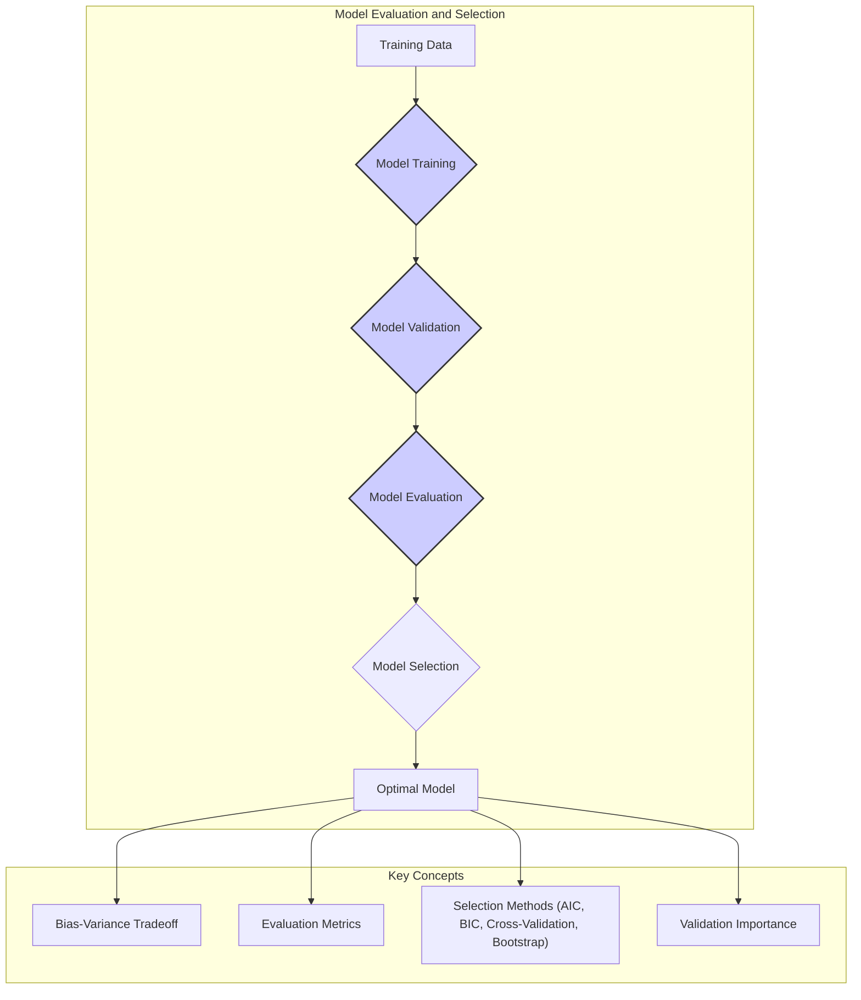
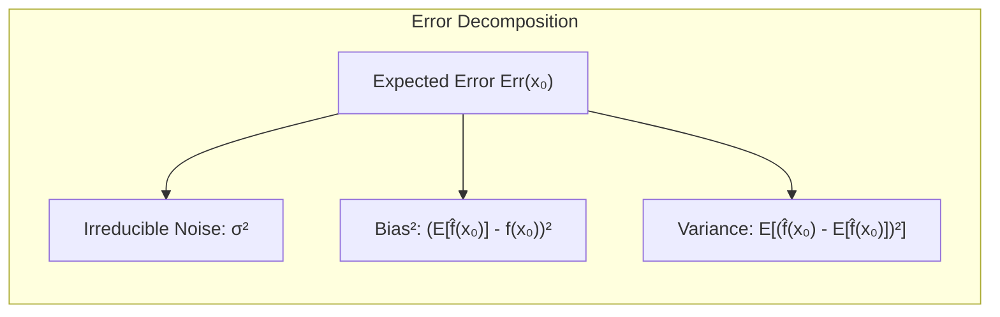
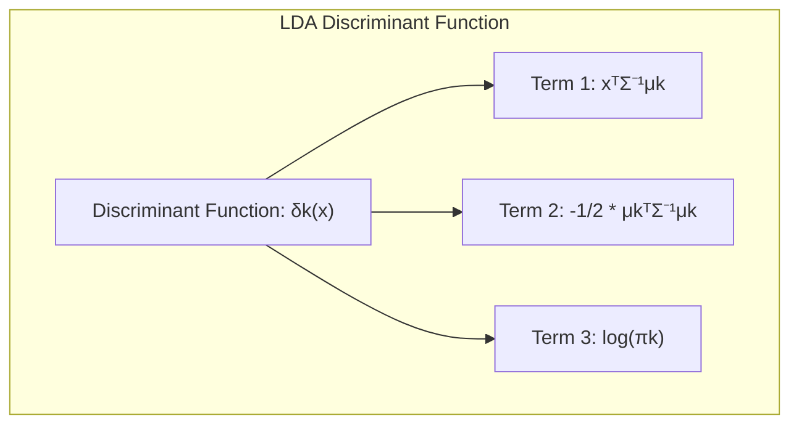
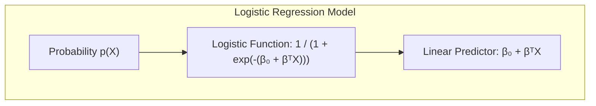
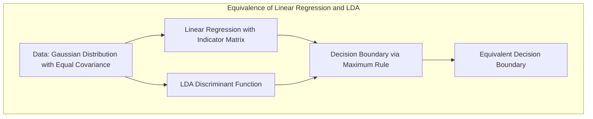
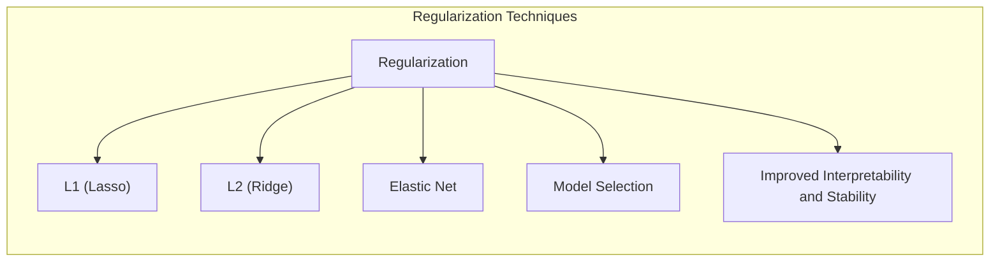
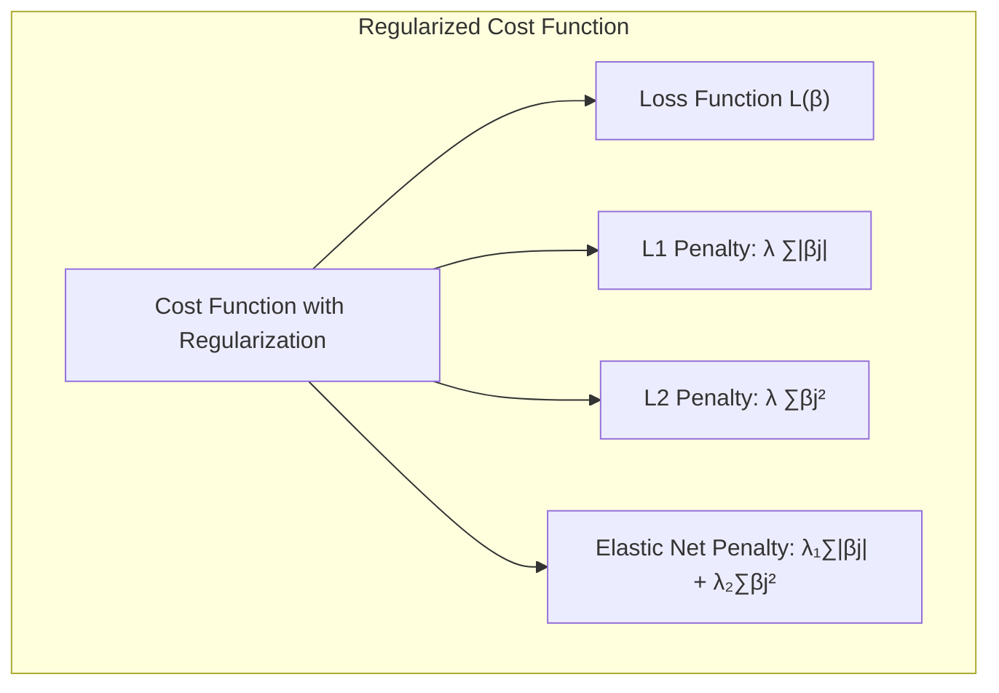

## Avaliação e Seleção de Modelos

### Introdução
A capacidade de generalização de um método de aprendizado está intrinsecamente ligada ao seu desempenho preditivo em dados de teste independentes. A avaliação deste desempenho é de suma importância na prática, pois ela orienta a escolha do método ou modelo de aprendizado mais adequado, e fornece uma métrica da qualidade do modelo escolhido [^7.1]. Neste capítulo, exploraremos os principais métodos de avaliação de desempenho, e como eles são utilizados para selecionar modelos, iniciando com uma discussão sobre a relação entre **viés**, **variância** e a **complexidade do modelo** [^7.1].

### Conceitos Fundamentais

**Conceito 1: Generalização e Erro de Previsão**

O problema de classificação, e mais genericamente, o problema de aprendizado de máquina, visa encontrar uma função $f(X)$ que mapeie um conjunto de entradas $X$ para uma variável de resposta $Y$ [^7.2]. O objetivo é que esta função generalize bem para dados não vistos. O conceito de **generalização** está diretamente ligado à capacidade de um modelo fazer previsões precisas em dados diferentes daqueles usados no treinamento. Um modelo que se ajusta muito bem aos dados de treino pode ter um desempenho ruim em dados não vistos devido ao *overfitting*, demonstrando que um bom ajuste nos dados de treinamento não garante uma boa generalização [^7.2].

O erro de previsão, denotado por $L(Y, f(X))$, quantifica a diferença entre as respostas reais $Y$ e as previsões $f(X)$. Uma escolha comum para essa função de perda é o **erro quadrático médio** (squared error), dado por [^7.2]:

$$L(Y, f(X)) = (Y - f(X))^2$$

Em termos de **viés** e **variância**, um modelo linear simples (alta viés) pode não conseguir capturar a complexidade dos dados, enquanto um modelo muito flexível (alta variância) pode se ajustar ao ruído nos dados de treinamento, prejudicando a capacidade de generalização. Há um *trade-off* entre esses dois fatores [^7.2].

> 💡 **Exemplo Numérico:**
>
> Considere um cenário onde queremos prever o preço de casas ($Y$) com base no tamanho em metros quadrados ($X$). Temos um conjunto de dados de treinamento com 10 casas.
>
> **Modelo 1 (Simples):** Uma regressão linear simples, $f(X) = \beta_0 + \beta_1 X$.
> **Modelo 2 (Complexo):** Um modelo polinomial de grau 5, $f(X) = \beta_0 + \beta_1 X + \beta_2 X^2 + \beta_3 X^3 + \beta_4 X^4 + \beta_5 X^5$.
>
> | Casa | Tamanho (m²) | Preço Real (R$) | Preço Modelo 1 (R$) | Preço Modelo 2 (R$) |
> |------|-------------|-----------------|-------------------|-------------------|
> | 1    | 50          | 150.000         | 140.000           | 152.000           |
> | 2    | 75          | 210.000         | 200.000           | 208.000           |
> | 3    | 100         | 280.000         | 260.000           | 279.000           |
> | 4    | 60          | 170.000         | 160.000           | 172.000           |
> | 5    | 80          | 230.000         | 215.000           | 231.000           |
> | 6    | 110         | 300.000         | 285.000           | 301.000           |
> | 7    | 55          | 160.000         | 150.000           | 161.000           |
> | 8    | 90          | 250.000         | 235.000           | 250.000           |
> | 9    | 70          | 200.000         | 190.000           | 201.000           |
> | 10   | 105         | 290.000         | 270.000           | 289.000           |
>
> O Modelo 1 tem um viés maior, pois simplifica demais a relação, enquanto o Modelo 2 ajusta-se muito bem aos dados de treinamento, podendo ter alta variância. Se testarmos ambos os modelos em novas casas, o Modelo 2 pode não generalizar tão bem. O erro quadrático médio (MSE) nos dados de treinamento para o Modelo 1 seria maior do que o Modelo 2. No entanto, em dados novos, o MSE do Modelo 1 pode ser menor do que o Modelo 2, indicando que o Modelo 2 realizou overfitting aos dados de treinamento e o modelo 1 generalizou melhor.

**Lemma 1:** *Decomposição do Erro de Previsão*

O erro de previsão esperado $Err(x_0)$ em um ponto de entrada $x_0$ pode ser decomposto em três componentes: ruído irredutível, o quadrado do viés e a variância do modelo. Formalmente, considerando o caso onde $Y = f(X) + \epsilon$, com $E[\epsilon] = 0$ e $Var[\epsilon] = \sigma^2$, temos [^7.3]:

$$
Err(x_0) = E[(Y - \hat{f}(x_0))^2 | X = x_0] = \sigma^2 + [E[\hat{f}(x_0)] - f(x_0)]^2 + E[(\hat{f}(x_0) - E[\hat{f}(x_0)])^2]
$$

$$
Err(x_0) = \text{Ruído Irredutível} + \text{Viés}^2 + \text{Variância}
$$

Essa decomposição é crucial porque ela fornece um caminho para entender como a complexidade do modelo impacta o erro de previsão. $\blacksquare$

> 💡 **Exemplo Numérico:**
>
> Vamos supor que temos um modelo preditivo para a temperatura em uma determinada hora do dia. A temperatura real pode ser modelada por $Y = f(X) + \epsilon$, onde $f(X)$ é uma função verdadeira (mas desconhecida) que depende de fatores como hora do dia e estação do ano, e $\epsilon$ representa o ruído aleatório.
>
> Suponha que o ruído $\epsilon$ tem uma variância $\sigma^2 = 2$. Temos um modelo $\hat{f}(x_0)$ e no ponto $x_0$, a verdadeira temperatura $f(x_0)$ é 25°C.
>
> **Cenário 1: Modelo com Alto Viés**
>
> - $E[\hat{f}(x_0)] = 22$, ou seja, nosso modelo subestima a temperatura em média.
> - $Var[\hat{f}(x_0)] = 1$, ou seja, a variabilidade das previsões do modelo é baixa.
>
> Então, o erro de previsão é:
>
> $Err(x_0) = 2 + (22 - 25)^2 + 1 = 2 + 9 + 1 = 12$
>
> **Cenário 2: Modelo com Alta Variância**
>
> - $E[\hat{f}(x_0)] = 25$, ou seja, nosso modelo é preciso em média.
> - $Var[\hat{f}(x_0)] = 8$, ou seja, a variabilidade das previsões é alta.
>
> Então, o erro de previsão é:
>
> $Err(x_0) = 2 + (25 - 25)^2 + 8 = 2 + 0 + 8 = 10$
>
> **Cenário 3: Modelo Ideal**
>
> - $E[\hat{f}(x_0)] = 25$, ou seja, nosso modelo é preciso em média.
> - $Var[\hat{f}(x_0)] = 1$, ou seja, a variabilidade das previsões é baixa.
>
> Então, o erro de previsão é:
>
> $Err(x_0) = 2 + (25 - 25)^2 + 1 = 2 + 0 + 1 = 3$
>
> Neste exemplo, vemos como o trade-off entre viés e variância impacta o erro de previsão. O cenário 2 (alta variância) tem um erro total menor que o cenário 1 (alto viés). Note também que o erro irredutível ($\sigma^2 = 2$) sempre estará presente, independente do modelo.

**Conceito 2: Linear Discriminant Analysis (LDA)**

A **Linear Discriminant Analysis (LDA)** é um método para classificação que busca encontrar uma projeção linear dos dados que maximize a separação entre as classes [^4.3]. A LDA assume que os dados de cada classe seguem uma distribuição normal com a mesma matriz de covariância, o que simplifica o problema e permite a obtenção de uma fronteira de decisão linear [^4.3.1].

O objetivo da LDA é encontrar uma função discriminante linear, $δ_k(x) = x^T \Sigma^{-1} \mu_k - \frac{1}{2} \mu_k^T \Sigma^{-1} \mu_k + \log \pi_k$, onde $\Sigma$ é a matriz de covariância comum, $\mu_k$ é o vetor médio da classe $k$, e $\pi_k$ é a probabilidade a priori da classe $k$. A classe atribuída a um ponto $x$ é aquela que maximiza $δ_k(x)$ [^4.3.2]. A LDA pode ser vista como um caso especial da **Regressão de Indicadores** em que as classes são representadas por vetores indicadores, mas com uma restrição adicional de covariâncias iguais.

> 💡 **Exemplo Numérico:**
>
> Suponha que temos duas classes de flores, Iris Setosa e Iris Versicolor, e estamos usando duas características: comprimento da sépala ($X_1$) e largura da sépala ($X_2$). Temos os seguintes parâmetros estimados:
>
> - Classe Setosa (k=1): $\mu_1 = [5.0, 3.4]$, $\pi_1 = 0.5$
> - Classe Versicolor (k=2): $\mu_2 = [5.9, 2.7]$, $\pi_2 = 0.5$
>
> Matriz de covariância comum estimada:
>
> $\Sigma = \begin{bmatrix}
> 0.6 & 0.2 \\
> 0.2 & 0.4
> \end{bmatrix}$
>
> Calculando $\Sigma^{-1}$:
>
> $\Sigma^{-1} = \frac{1}{(0.6 \times 0.4) - (0.2 \times 0.2)} \begin{bmatrix}
> 0.4 & -0.2 \\
> -0.2 & 0.6
> \end{bmatrix} =  \begin{bmatrix}
> 2.5 & -1.25 \\
> -1.25 & 3.75
> \end{bmatrix}$
>
> Agora, podemos calcular a função discriminante para um ponto de teste $x = [5.5, 3.0]$:
>
> $\delta_1(x) = \begin{bmatrix} 5.5 \\ 3.0 \end{bmatrix}^T \begin{bmatrix} 2.5 & -1.25 \\ -1.25 & 3.75 \end{bmatrix} \begin{bmatrix} 5.0 \\ 3.4 \end{bmatrix} - \frac{1}{2} \begin{bmatrix} 5.0 \\ 3.4 \end{bmatrix}^T \begin{bmatrix} 2.5 & -1.25 \\ -1.25 & 3.75 \end{bmatrix} \begin{bmatrix} 5.0 \\ 3.4 \end{bmatrix} + \log(0.5) \approx -4.51$
>
> $\delta_2(x) = \begin{bmatrix} 5.5 \\ 3.0 \end{bmatrix}^T \begin{bmatrix} 2.5 & -1.25 \\ -1.25 & 3.75 \end{bmatrix} \begin{bmatrix} 5.9 \\ 2.7 \end{bmatrix} - \frac{1}{2} \begin{bmatrix} 5.9 \\ 2.7 \end{bmatrix}^T \begin{bmatrix} 2.5 & -1.25 \\ -1.25 & 3.75 \end{bmatrix} \begin{bmatrix} 5.9 \\ 2.7 \end{bmatrix} + \log(0.5) \approx -4.52$
>
> Como $\delta_1(x) > \delta_2(x)$, classificamos o ponto $x$ como pertencente à classe Setosa.

**Corolário 1:** *Relação entre LDA e Projeções Lineares*

A função discriminante linear da LDA pode ser vista como uma projeção dos dados em um subespaço de menor dimensão, o que facilita a visualização e a interpretação dos resultados. A projeção linear $w$ que maximiza a separação entre as classes é dada por:

$$w = \Sigma^{-1} (\mu_1 - \mu_2)$$

Essa projeção transforma o problema de classificação em uma única dimensão, tornando a separação das classes mais simples e clara, especialmente para dados de alta dimensão. [^4.3.3] $\blacksquare$
```mermaid
graph LR
    subgraph "LDA Projection"
        direction LR
         A["Projection Vector: w"]
         B["Inverse Covariance Matrix: Σ⁻¹"]
         C["Mean Difference: μ₁ - μ₂"]
         A -->| "w = Σ⁻¹(μ₁ - μ₂)"| B
         A --> C
         B -->|Multiplication| C
    end
```
> 💡 **Exemplo Numérico:**
>
> Usando os dados do exemplo anterior:
>
> $w = \begin{bmatrix} 2.5 & -1.25 \\ -1.25 & 3.75 \end{bmatrix} \begin{bmatrix} 5.0 - 5.9 \\ 3.4 - 2.7 \end{bmatrix} = \begin{bmatrix} 2.5 & -1.25 \\ -1.25 & 3.75 \end{bmatrix} \begin{bmatrix} -0.9 \\ 0.7 \end{bmatrix} = \begin{bmatrix} -3.125 \\ 3.75 \end{bmatrix}$
>
> A projeção $w$ é um vetor no espaço das características, e podemos projetar qualquer ponto $x$ nesse vetor usando o produto interno $w^T x$. Isso transforma os dados em uma única dimensão, que podemos usar para classificar as amostras.

**Conceito 3: Regressão Logística**

A **Regressão Logística** é um método de classificação que modela a probabilidade de um ponto pertencer a uma classe usando a função logística. Ao contrário da LDA que usa uma função discriminante linear, a regressão logística usa a transformação *logit* (log-odds) para modelar a probabilidade da classe em função dos dados [^4.4.1].

O modelo logístico é dado por:

$$
p(X) = \frac{1}{1 + e^{-(\beta_0 + \beta^T X)}}
$$

onde $p(X)$ é a probabilidade da classe, $\beta_0$ é o intercepto e $\beta$ são os coeficientes do modelo. Os parâmetros $\beta$ são estimados maximizando a verossimilhança dos dados de treinamento. A verossimilhança é expressa como:

$$ L(\beta) = \sum_{i=1}^N [y_i \log(p(x_i)) + (1-y_i)\log(1 - p(x_i))]$$

A **Regressão Logística** é um modelo flexível e adequado para problemas onde as classes não seguem estritamente a suposição de normalidade imposta pela LDA, sendo um método robusto para classificação em muitos contextos [^4.4.3].

> 💡 **Exemplo Numérico:**
>
> Suponha que temos dados binários de pacientes com ou sem uma doença (1 ou 0) e uma característica preditora, a idade ($X$). Após ajustar um modelo de regressão logística, obtemos os seguintes coeficientes: $\beta_0 = -5$ e $\beta_1 = 0.1$.
>
> Para um paciente de 60 anos ($x = 60$):
>
> $p(X) = \frac{1}{1 + e^{-(-5 + 0.1 \times 60)}} = \frac{1}{1 + e^{-1}} \approx \frac{1}{1 + 0.368} \approx 0.731$
>
> Isso significa que a probabilidade de um paciente de 60 anos ter a doença é aproximadamente 73.1%.
>
> A função de verossimilhança é utilizada para estimar $\beta_0$ e $\beta_1$ a partir dos dados. Suponha que tenhamos 3 dados de treinamento:
>
> - Paciente 1: idade = 50, doença = 0
> - Paciente 2: idade = 60, doença = 1
> - Paciente 3: idade = 70, doença = 1
>
> Primeiro, calculamos $p(x_i)$ para cada paciente com os parâmetros iniciais $\beta_0=-5$ e $\beta_1=0.1$:
>
> - $p(50) = \frac{1}{1 + e^{-(-5 + 0.1 \times 50)}} = \frac{1}{1+e^0} = 0.5$
> - $p(60) = \frac{1}{1 + e^{-(-5 + 0.1 \times 60)}} = \frac{1}{1+e^{-1}} \approx 0.731$
> - $p(70) = \frac{1}{1 + e^{-(-5 + 0.1 \times 70)}} = \frac{1}{1+e^{-2}} \approx 0.881$
>
> A verossimilhança é:
>
> $L(\beta) = 0 \times \log(0.5) + (1-0)\log(1 - 0.5) + 1 \times \log(0.731) + (1-1)\log(1 - 0.731) + 1 \times \log(0.881) + (1-1)\log(1 - 0.881) \approx -0.693 + -0.313 + -0.127 = -1.133$.
>
> O processo de maximização da verossimilhança envolve o uso de algoritmos iterativos para encontrar os valores de $\beta_0$ e $\beta_1$ que maximizam esta função, tipicamente usando gradient ascent ou outros algoritmos de otimização.

> ⚠️ **Nota Importante**: Na regressão logística, as classes são tratadas como independentes, enquanto na LDA há uma dependência das classes através da matriz de covariância compartilhada.

> ❗ **Ponto de Atenção**: Em conjuntos de dados com classes desbalanceadas, a regressão logística pode apresentar viés nas probabilidades estimadas, sendo necessário utilizar técnicas de balanceamento de classes para mitigar este problema.

> ✔️ **Destaque**: As estimativas dos parâmetros em LDA e em regressão logística podem ter uma forte correlação, especialmente quando as classes são bem separáveis.

### Regressão Linear e Mínimos Quadrados para Classificação

A regressão linear pode ser adaptada para problemas de classificação usando uma **matriz de indicadores** para representar as classes [^4.2]. Em vez de prever um valor numérico, o modelo de regressão linear é usado para prever a probabilidade de cada amostra pertencer a cada classe. Isso é feito codificando cada classe como um vetor binário onde um único elemento é igual a 1 e os outros são 0. Em um problema com $K$ classes, a matriz de indicadores terá $K$ colunas. O modelo de regressão linear ajusta um vetor de coeficientes para cada classe [^4.2].

As limitações desta abordagem são que as previsões podem cair fora do intervalo [0, 1] e que a relação linear entre as variáveis de entrada e as probabilidades da classe pode não ser adequada em alguns casos. No entanto, em algumas situações, a regressão de indicadores pode ser suficiente e até mesmo vantajosa quando o objetivo principal é a fronteira de decisão linear [^4.2]. A influência da covariância entre as classes e o problema de *masking* na regressão de indicadores são questões que podem ser melhor abordadas utilizando outros métodos, como LDA [^4.3].

> 💡 **Exemplo Numérico:**
>
> Considere um problema de classificação com três classes (A, B, C) e duas variáveis preditoras ($X_1$ e $X_2$). Vamos criar uma matriz de indicadores para cada classe:
>
> | Amostra | $X_1$ | $X_2$ | Classe | $Y_A$ | $Y_B$ | $Y_C$ |
> |---------|-------|-------|--------|-------|-------|-------|
> |   1     | 2     | 3     |   A    |  1    |   0  |  0    |
> |   2     | 4     | 2     |   B    |  0    |   1  |  0    |
> |   3     | 3     | 4     |   C    |  0    |   0  |  1    |
> |   4     | 5     | 1     |   A    |  1    |   0  |  0    |
> |   5     | 2     | 5     |   B    |  0    |   1  |  0    |
>
> Onde $Y_A$, $Y_B$ e $Y_C$ são as variáveis indicadoras para as classes A, B e C, respectivamente. Usamos a regressão linear para ajustar modelos para cada classe:
>
> $\hat{Y_A} = \beta_{0A} + \beta_{1A}X_1 + \beta_{2A}X_2$
> $\hat{Y_B} = \beta_{0B} + \beta_{1B}X_1 + \beta_{2B}X_2$
> $\hat{Y_C} = \beta_{0C} + \beta_{1C}X_1 + \beta_{2C}X_2$
>
> Após ajustar os modelos por mínimos quadrados, podemos obter, por exemplo, os seguintes coeficientes:
>
> $\hat{Y_A} = 0.2 + 0.1X_1 - 0.05X_2$
> $\hat{Y_B} = -0.1 + 0.05X_1 + 0.2X_2$
> $\hat{Y_C} = 0.0 + 0.01X_1 - 0.1X_2$
>
> Para classificar um novo ponto com $X_1=3$ e $X_2=3$, calculamos as previsões:
>
> $\hat{Y_A} = 0.2 + 0.1(3) - 0.05(3) = 0.35$
> $\hat{Y_B} = -0.1 + 0.05(3) + 0.2(3) = 0.65$
> $\hat{Y_C} = 0.0 + 0.01(3) - 0.1(3) = -0.27$
>
> A classe com a maior previsão é B, então classificamos este novo ponto como classe B. Uma possível limitação seria que a previsão de C foi negativa, o que não faz sentido em uma probabilidade de classe.

**Lemma 2:** *Equivalência entre Projeções da Regressão Linear e Discriminantes Lineares*
Em certas condições, as projeções nos hiperplanos de decisão gerados pela regressão linear e os discriminantes lineares são equivalentes. Quando as classes têm variâncias iguais, a regressão linear com matriz de indicadores leva a resultados comparáveis com os discriminantes lineares [^4.2]. Essa equivalência é formalizada através do seguinte lemma:

*Se os dados de classes seguem distribuições Gaussianas com médias $\mu_k$ e covariâncias idênticas $\Sigma$, e a função de decisão é baseada na regra do máximo, então a fronteira de decisão derivada da regressão linear com matriz de indicadores é idêntica à fronteira de decisão da LDA.* $\blacksquare$

**Corolário 2:** *Simplificação da Análise do Modelo*
A equivalência acima permite simplificar a análise de modelos, pois as projeções lineares obtidas por regressão podem ser interpretadas em termos de funções discriminantes, o que facilita a interpretação da importância de cada variável para a classificação. [^4.3]

> Em alguns cenários, a regressão logística pode fornecer estimativas mais estáveis de probabilidade, enquanto a regressão de indicadores pode levar a extrapolações fora de [0,1].

> No entanto, há situações em que a regressão de indicadores é suficiente e até mesmo vantajosa quando o objetivo principal é a fronteira de decisão linear.

### Métodos de Seleção de Variáveis e Regularização em Classificação

A seleção de variáveis e a regularização são técnicas importantes para lidar com a complexidade do modelo, o *overfitting*, e a multicolinearidade das variáveis de entrada. A regularização, em particular, adiciona uma penalidade à função de custo para controlar a magnitude dos coeficientes do modelo. As penalidades mais comuns são:

-   **Penalidade L1 (Lasso):** Adiciona a soma dos valores absolutos dos coeficientes à função de custo:

$$
\text{Custo} = L(\beta) + \lambda \sum_{j=1}^p |\beta_j|
$$

Esta penalidade pode levar a coeficientes esparsos, ou seja, muitos coeficientes iguais a zero, selecionando apenas as variáveis mais relevantes [^4.4.4].
-   **Penalidade L2 (Ridge):** Adiciona a soma dos quadrados dos coeficientes à função de custo:

$$
\text{Custo} = L(\beta) + \lambda \sum_{j=1}^p \beta_j^2
$$
Esta penalidade reduz a magnitude dos coeficientes, mas não os torna exatamente zero, sendo útil para lidar com multicolinearidade e melhorar a estabilidade do modelo [^4.4.4].
-   **Elastic Net:** Combina as penalidades L1 e L2 para aproveitar as vantagens de ambos os métodos:

$$
\text{Custo} = L(\beta) + \lambda_1 \sum_{j=1}^p |\beta_j| + \lambda_2 \sum_{j=1}^p \beta_j^2
$$

A regularização se encaixa na formulação da função de custo como um termo que combina verossimilhança e termos de penalização [^4.4.4], controlando a complexidade do modelo.

> 💡 **Exemplo Numérico:**
>
> Considere um problema de regressão logística com duas variáveis preditoras ($X_1$, $X_2$) e uma variável de resposta binária (0 ou 1). Temos os seguintes dados de treinamento e parâmetros estimados sem regularização:
>
> | Amostra | $X_1$ | $X_2$ | Y |
> |--------|-------|-------|---|
> |    1   |   1  |   1   |  1|
> |    2   |   2   |  2   |  0|
> |    3   |  3   |  1   | 1 |
> |    4   |  4   |  2  |  0 |
>
> Após ajustar um modelo sem regularização, obtivemos os coeficientes:
>
> $\beta_0 = -1.5$, $\beta_1 = 2$, $\beta_2 = -1$
>
> **Cenário 1: Regularização L1 (Lasso) com $\lambda = 0.5$:**
>
> $\text{Custo}_{\text{Lasso}} = L(\beta) + 0.5 * (|2| + |-1|)$
>
> Após reajustar o modelo com regularização L1, os coeficientes podem mudar para:
>
> $\beta_0 = -1.0$, $\beta_1 = 0.8$, $\beta_2 = 0$
>
> Note que o coeficiente $\beta_2$ foi zerado, indicando que a variável $X_2$ foi considerada menos relevante pelo modelo.
>
> **Cenário 2: Regularização L2 (Ridge) com $\lambda = 0.5$:**
>
> $\text{Custo}_{\text{Ridge}} = L(\beta) + 0.5 * (2^2 + (-1)^2)$
>
> Após reajustar o modelo com regularização L2, os coeficientes podem mudar para:
>
> $\beta_0 = -1.2$, $\beta_1 = 1.0$, $\beta_2 = -0.5$
>
> Os coeficientes foram reduzidos em magnitude, mas nenhuma variável foi eliminada.
>
> **Cenário 3: Elastic Net com $\lambda_1 = 0.3$ e $\lambda_2 = 0.2$:**
>
> $\text{Custo}_{\text{Elastic Net}} = L(\beta) + 0.3 * (|2| + |-1|) + 0.2 * (2^2 + (-1)^2)$
>
> Após reajustar o modelo com Elastic Net, os coeficientes podem mudar para:
>
> $\beta_0 = -1.1$, $\beta_1 = 0.9$, $\beta_2 = -0.1$
>
> Vemos uma combinação de redução da magnitude dos coeficientes (L2) e alguma seleção de variáveis, mesmo que não tão forte quanto L1.

**Lemma 3:** *Penalização L1 e Coeficientes Esparsos*

A penalização L1 na classificação logística promove a esparsidade dos coeficientes, levando à seleção de variáveis e modelos mais interpretáveis. O termo de penalidade L1 força os coeficientes a serem exatamente zero