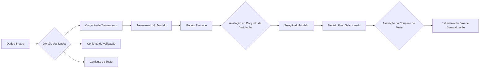
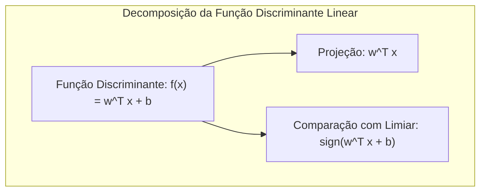
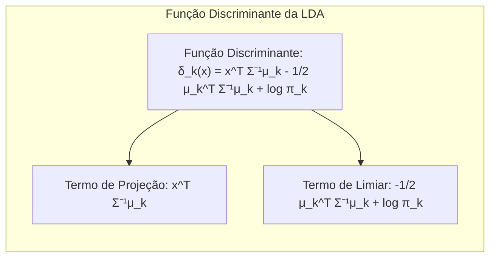
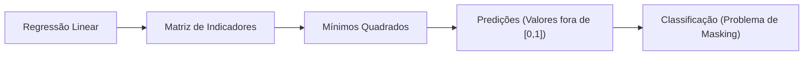
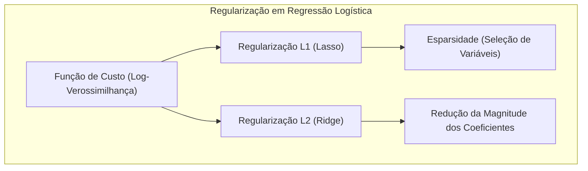
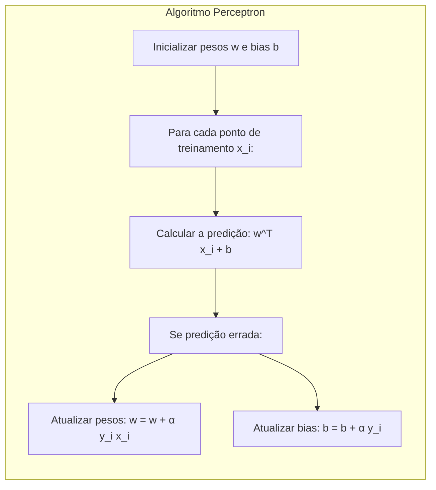
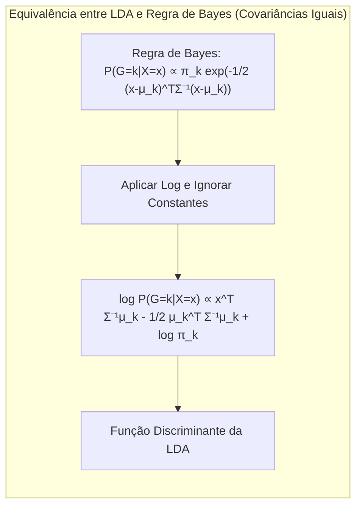

## Avaliação e Seleção de Modelos: Foco no Erro de Predição Esperado (Expected Prediction Error) e Erro de Teste Esperado (Expected Test Error)
<imagem: Diagrama que ilustra o fluxo do processo de avaliação e seleção de modelos, mostrando a divisão de dados em treinamento, validação e teste, e as diferentes métricas de erro utilizadas em cada etapa.>



### Introdução

A performance de **generalização** de um método de aprendizado, ou seja, sua capacidade de prever em dados de teste independentes, é de extrema importância na prática [^7.1]. Essa performance guia a escolha do método de aprendizado ou modelo e fornece uma medida da qualidade do modelo escolhido. Este capítulo aborda métodos-chave para avaliação de performance e como eles são usados na seleção de modelos, iniciando com a discussão da relação entre **viés, variância e complexidade do modelo** [^7.1].

### Conceitos Fundamentais

**Conceito 1: Problema de Classificação e Métodos Lineares**

O problema de classificação envolve prever a qual categoria um dado ponto pertence, com base em um conjunto de características. Métodos lineares, como os discutidos neste capítulo, procuram estabelecer uma fronteira de decisão linear no espaço das características. A escolha de um método linear implica um *tradeoff* entre viés e variância. Modelos lineares simples podem sofrer de alto viés (subajuste) se a verdadeira fronteira de decisão for complexa, mas apresentar baixa variância devido à sua simplicidade. Modelos mais complexos podem capturar fronteiras não lineares mas à custa de maior variância. [^7.1]

> 💡 **Exemplo Numérico:** Considere um problema de classificação binária onde temos duas *features*, $x_1$ e $x_2$, e duas classes (0 e 1). Um modelo linear simples poderia ser $f(x) = 0.5x_1 + 0.2x_2 - 0.1$. Se os dados verdadeiramente seguem uma relação não linear, um modelo linear como esse, mesmo que com baixa variância, pode levar a muitas classificações erradas por sua incapacidade de capturar a complexidade dos dados (alto viés). Por outro lado, um modelo muito complexo (e.g., um polinômio de grau alto) poderia se ajustar perfeitamente aos dados de treinamento, mas apresentar grande variância quando exposto a novos dados, generalizando mal.

**Lemma 1:** A decisão de classe em métodos lineares pode ser vista como uma projeção dos dados em um espaço de menor dimensão, seguida por uma decisão baseada na posição dessa projeção em relação a um limiar.

**Prova:** Considere a função discriminante linear $f(x) = w^T x + b$. A decisão de classe é dada por $\hat{y} = \text{sign}(f(x))$. Essa função pode ser vista como a projeção do vetor de características $x$ no vetor $w$, seguida por uma comparação com o limiar $-b$. A classe atribuída será a que corresponde ao lado do hiperplano definido por $w^Tx + b = 0$. Essa decomposição linear é fundamental para entender a geometria da decisão de classe. $\blacksquare$



**Conceito 2: Análise Discriminante Linear (LDA)**

A Análise Discriminante Linear (LDA) é uma técnica de classificação que assume que os dados dentro de cada classe seguem uma distribuição normal multivariada com a mesma matriz de covariância [^7.3]. A LDA busca encontrar a combinação linear de atributos que melhor separa as classes [^7.3.1]. A fronteira de decisão na LDA é linear e obtida com base nas médias de cada classe e na matriz de covariância comum [^7.3.2]. Um aspecto importante da LDA é a premissa de que a distribuição das características é normal em cada classe, e a matriz de covariâncias entre as classes é a mesma. Quando essa premissa é satisfeita, a LDA minimiza o erro de classificação [^7.3.3].

> 💡 **Exemplo Numérico:** Suponha que temos duas classes, A e B, com as seguintes médias e matriz de covariância comum (simplificada para 2 dimensões):
>
> $\mu_A = \begin{bmatrix} 1 \\ 1 \end{bmatrix}$,  $\mu_B = \begin{bmatrix} 3 \\ 3 \end{bmatrix}$, $\Sigma = \begin{bmatrix} 1 & 0.5 \\ 0.5 & 1 \end{bmatrix}$
>
> A LDA calculará a fronteira de decisão com base nessas médias e na matriz de covariância comum. A projeção dos dados na direção que maximiza a separação entre as médias será usada para classificação. Se um novo ponto $x = \begin{bmatrix} 2 \\ 2 \end{bmatrix}$ estiver mais próximo de $\mu_A$ após a projeção, será classificado como pertencente à classe A.

**Corolário 1:** Sob a hipótese de normalidade e covariâncias iguais, a função discriminante linear da LDA pode ser interpretada como a projeção dos dados em um subespaço de menor dimensão, onde a distância entre as médias de cada classe é maximizada, levando a uma separação ótima.
**Prova:** A função discriminante da LDA é definida como  $\delta_k(x) = x^T \Sigma^{-1}\mu_k - \frac{1}{2}\mu_k^T\Sigma^{-1}\mu_k + \log \pi_k$, onde $\mu_k$ é a média da classe $k$, $\Sigma$ é a matriz de covariâncias comum e $\pi_k$ é a probabilidade a priori da classe $k$. Ao analisar a forma da função, é possível notar que a parte $x^T \Sigma^{-1}\mu_k$ corresponde a uma projeção do ponto $x$ sobre o vetor $\Sigma^{-1}\mu_k$, que aponta na direção em que a separação entre classes é maximizada. O termo $-\frac{1}{2}\mu_k^T\Sigma^{-1}\mu_k + \log \pi_k$ atua como um limiar que define a fronteira de decisão, portanto, o corolário segue. $\blacksquare$


**Conceito 3: Regressão Logística**

A Regressão Logística é um modelo probabilístico para classificação binária que modela a probabilidade de um evento ocorrer [^7.4]. Ao contrário da regressão linear, a Regressão Logística usa a função *logit* para transformar a probabilidade em um modelo linear. A função *logit* é dada por:
$$ \text{logit}(p) = \ln\left(\frac{p}{1-p}\right) $$, onde $p$ é a probabilidade do evento ocorrer.
A Regressão Logística estima os parâmetros do modelo por meio da **maximização da verossimilhança** [^7.4.1]. O modelo busca ajustar um hiperplano que separa os dados de acordo com as probabilidades estimadas. A Regressão Logística, assim como a LDA, também define fronteiras lineares, mas a função *logit* permite que o modelo se adapte melhor em casos onde os dados não necessariamente seguem uma distribuição normal. Em termos de estimativas, a *maximum likelihood estimation* é usada na Regressão Logística, enquanto a LDA usa estimativas de média e covariância para gerar os parâmetros da fronteira de decisão [^7.4.2]. Em resumo, embora ambos definam fronteiras lineares, sua formulação matemática e suposições sobre os dados são distintas [^7.4.3], [^7.4.4], [^7.4.5].

> 💡 **Exemplo Numérico:** Em um problema de classificação binária, onde $y$ é a variável resposta (0 ou 1) e $x$ é um preditor, a Regressão Logística modela $P(y=1|x)$ como uma função sigmoide: $P(y=1|x) = \frac{1}{1 + e^{-(w^Tx + b)}}$. Os parâmetros $w$ e $b$ são estimados pela maximização da verossimilhança. Por exemplo, se após a otimização, obtivermos $w = 1.2$ e $b = -0.5$, para um $x=1$, teríamos:
>
> $P(y=1|x=1) = \frac{1}{1 + e^{-(1.2*1 - 0.5)}} \approx 0.67$
>
> Isso significa que existe uma probabilidade de 67% de que um ponto com $x=1$ pertença à classe 1.

> ⚠️ **Nota Importante**: Em situações de classes não balanceadas, é fundamental ajustar os pesos para que classes menos frequentes tenham maior importância no processo de treinamento, caso contrário, a previsão tenderá à classe majoritária, conforme discutido em [^7.4.2].

> ❗ **Ponto de Atenção**: A Regressão Logística, ao modelar probabilidades, pode ser mais apropriada em cenários onde a decisão final necessita de uma interpretação probabilística, diferentemente da LDA, que fornece a decisão baseada no classificador que maximiza a distância entre classes [^7.4].

> ✔️ **Destaque**: Em alguns cenários, as estimativas de parâmetros obtidas por LDA podem ser relacionadas às estimativas obtidas em Regressão Logística, especialmente quando as classes são bem separadas, como mencionado em [^7.5].

### Regressão Linear e Mínimos Quadrados para Classificação

<imagem: Mapa mental conectando regressão linear, matriz de indicadores, mínimos quadrados, classificação e suas limitações, destacando o problema de masking.>



A regressão linear pode ser adaptada para problemas de classificação através da **regressão de uma matriz de indicadores** [^7.2]. Nesse caso, cada classe é representada por uma coluna na matriz de indicadores, e a regressão linear busca encontrar os coeficientes que melhor separam as classes [^7.1]. Essa abordagem busca modelar as classes como combinações lineares de *features*, com a decisão sendo tomada pela classe com o maior valor predito.
Entretanto, a regressão linear para classificação enfrenta limitações, como o chamado "**masking problem**", onde os dados de diferentes classes podem se sobrepor e "mascarar" a verdadeira fronteira de decisão. Além disso, a regressão linear pode gerar previsões fora do intervalo [0,1], o que é um problema quando modelamos probabilidades [^7.3]. Métodos probabilísticos como a Regressão Logística e LDA, geralmente fornecem estimativas mais estáveis e interpretáveis [^7.4].

> 💡 **Exemplo Numérico:** Considere um problema com três classes (A, B, C). A matriz de indicadores $Y$ terá três colunas, onde cada linha contém um vetor com "1" na posição correspondente à classe da amostra e "0" nas outras. Se temos uma matriz de *features* $X$, a regressão linear buscará $B$ tal que $Y \approx XB$. Os valores preditos para cada classe serão calculados como $\hat{Y} = XB$. A classe predita para um novo ponto $x$ será a classe correspondente à coluna com o maior valor em $\hat{Y}$. Por exemplo, se para um ponto $x$ a predição $\hat{y} = \begin{bmatrix} 0.2 \\ 0.7 \\ 0.4 \end{bmatrix}$, o ponto seria classificado como pertencente à classe B. No entanto, note que os valores podem ser negativos ou maiores que 1, representando um problema para interpretação probabilística.

**Lemma 2:** Em problemas de classificação com classes bem separadas, a projeção dos dados nos hiperplanos de decisão gerados pela regressão linear de indicadores pode ser aproximadamente equivalente à projeção nos hiperplanos gerados por um discriminante linear, desde que as matrizes de covariância entre classes sejam semelhantes.

**Prova:** Considere um problema de classificação binária, com as classes representadas pelos indicadores 0 e 1. A regressão linear busca ajustar um hiperplano que minimiza o erro quadrático médio, ou seja, a distância dos pontos às suas projeções nesse hiperplano. Quando as classes são bem separadas e a variância dentro de cada classe é baixa, este hiperplano tende a se alinhhar à direção que maximiza a separação entre as classes, similar ao que ocorre com os discriminantes lineares. Essa similaridade se manifesta, especialmente, quando as matrizes de covariâncias são parecidas, o que leva a aproximações equivalentes dos hiperplanos de decisão. $\blacksquare$

**Corolário 2:** A equivalência aproximada entre as projeções de decisão geradas pela regressão linear de indicadores e discriminantes lineares em certas condições simplifica a análise do modelo e possibilita o uso de ferramentas e intuições desenvolvidas para modelos lineares em ambas as abordagens.

“Em alguns cenários, conforme apontado em [^7.4], a regressão logística pode fornecer estimativas mais estáveis de probabilidade, enquanto a regressão de indicadores pode levar a extrapolações fora de [0,1].”

“No entanto, há situações em que a regressão de indicadores, de acordo com [^7.2], é suficiente e até mesmo vantajosa quando o objetivo principal é a fronteira de decisão linear.”

### Métodos de Seleção de Variáveis e Regularização em Classificação

A seleção de variáveis e a regularização são cruciais para evitar o *overfitting* e melhorar a generalização dos modelos de classificação [^7.5]. A **regularização** adiciona um termo de penalidade à função de custo do modelo, controlando a magnitude dos coeficientes e promovendo modelos mais simples [^7.4.4]. As penalidades L1 e L2 são comuns:
 - **L1 (Lasso):** Introduz a esparsidade, forçando alguns coeficientes a serem exatamente zero, o que leva à seleção automática de variáveis [^7.4.4], [^7.5].
 - **L2 (Ridge):** Reduz a magnitude de todos os coeficientes, mas não os zera completamente, promovendo modelos mais estáveis e robustos.
Modelos Logísticos podem se beneficiar da regularização L1 para seleção de *features* relevantes e L2 para redução da variância, como abordado em [^7.4.4], [^7.5]. A escolha entre L1 e L2, ou sua combinação (Elastic Net), depende do objetivo do problema e da natureza dos dados.

> 💡 **Exemplo Numérico:** Suponha um modelo de regressão logística com *features* $x_1, x_2, x_3, x_4$. Após o treinamento sem regularização, os coeficientes estimados são: $\beta = [0.8, -0.3, 1.2, 0.5]$.
>
> 1.  **Regularização L1 (Lasso):**  Ao aplicar L1, alguns coeficientes podem ser reduzidos a zero, e.g., $\beta_{L1} = [0.5, 0, 0.9, 0.1]$, indicando que $x_2$ não é importante.
> 2.  **Regularização L2 (Ridge):** Ao aplicar L2, os coeficientes serão reduzidos, mas não zerados, e.g., $\beta_{L2} = [0.6, -0.2, 0.9, 0.4]$.
>
> A escolha entre L1 e L2 ou mesmo uma combinação (Elastic Net) dependerá dos dados. Se houver muitas variáveis irrelevantes, L1 é mais apropriada por fazer seleção de variáveis. Se todas as variáveis forem relevantes, porém com alguma colinearidade, L2 pode ajudar a estabilizar o modelo.


**Lemma 3:** A penalidade L1 na classificação logística resulta em coeficientes esparsos, devido à forma do termo de penalidade e seu impacto na otimização da função de custo.

**Prova:** O termo de penalidade L1, expresso como $\lambda \sum_{j=1}^p |\beta_j|$, onde $\lambda$ é o parâmetro de regularização e $\beta_j$ são os coeficientes, impõe uma penalidade linear na magnitude dos coeficientes. Durante a otimização da função de custo (incluindo a verossimilhança e o termo de penalidade), a penalidade L1 tende a levar alguns coeficientes a zero, pois a derivada do módulo é uma constante (exceto em zero), diferentemente da derivada do quadrado na penalidade L2, o que resulta em coeficientes mais esparsos e seleção de *features* [^7.4.4]. $\blacksquare$

**Corolário 3:** A esparsidade induzida pela penalidade L1 em modelos classificatórios não apenas simplifica o modelo, mas também aumenta sua interpretabilidade, facilitando a identificação das variáveis mais relevantes para a decisão de classe, como descrito em [^7.4.5].

> ⚠️ **Ponto Crucial**: A combinação de L1 e L2 (Elastic Net) é uma estratégia útil para balancear a esparsidade e a estabilidade do modelo, e tem sido utilizada em contextos mais desafiadores, como discutido em [^7.5].

### Separating Hyperplanes e Perceptrons

A ideia de **hiperplanos separadores** surge ao buscar uma fronteira de decisão que maximize a margem entre classes [^7.5.2]. O problema de encontrar um hiperplano ótimo pode ser formulado como um problema de otimização que pode ser resolvido usando conceitos de dualidade, como o dual de Wolfe. A solução para esse problema geralmente envolve a identificação dos **vetores de suporte**, que são os pontos mais próximos à fronteira de decisão [^7.5.2]. O Perceptron de Rosenblatt é um algoritmo de aprendizado para classificar dados linearmente separáveis [^7.5.1]. Ele itera sobre os pontos de treinamento, atualizando os pesos da função discriminante até que todos os pontos sejam classificados corretamente. Sob condições específicas de separabilidade linear dos dados, o algoritmo Perceptron converge para um hiperplano separador.

> 💡 **Exemplo Numérico:** Considere um conjunto de dados bidimensional linearmente separável, com pontos da classe 1 (círculos) e da classe 0 (cruzes):
>
> ```
> Classe 1 (círculos): (1, 2), (2, 3), (3, 2)
> Classe 0 (cruzes): (1, 1), (2, 1), (3, 0)
> ```
>
> O Perceptron inicializa um vetor de pesos aleatório ($w$) e um bias ($b$). Para cada ponto ($x_i$), ele calcula $w^Tx_i + b$. Se a predição estiver errada, ele atualiza os pesos de acordo com a regra: $w = w + \alpha y_i x_i$ e $b = b + \alpha y_i$, onde $\alpha$ é a taxa de aprendizado e $y_i$ é o rótulo da classe (-1 para classe 0 e 1 para classe 1). O processo itera até que todos os pontos estejam corretamente classificados, encontrando um hiperplano separador que maximize a margem entre as classes. O algoritmo Perceptron garante encontrar um hiperplano separador (se existir) sob a condição de que o conjunto de dados seja linearmente separável.



### Pergunta Teórica Avançada: Quais as diferenças fundamentais entre a formulação de LDA e a Regra de Decisão Bayesiana considerando distribuições Gaussianas com covariâncias iguais?

**Resposta:** Sob as premissas de que cada classe segue uma distribuição Gaussiana multivariada com **mesma matriz de covariância**, a LDA se torna equivalente à decisão Bayesiana. A LDA assume a mesma matriz de covariância para todas as classes, o que resulta em fronteiras de decisão lineares. Já a regra de decisão Bayesiana, aplicada nesse caso específico, busca a classe com a maior probabilidade a *posteriori*, que, sob as mesmas hipóteses de normalidade e covariâncias iguais, leva a uma função discriminante linear similar à da LDA. As diferenças surgem quando as covariâncias são diferentes, o que leva a fronteiras quadráticas (QDA) na decisão Bayesiana, enquanto a LDA ainda busca uma fronteira linear. Em termos práticos, a LDA aproxima a fronteira de decisão quando as covariâncias não são iguais, sendo mais estável com poucos dados, enquanto a QDA pode gerar *overfitting* nessas situações [^7.3].

**Lemma 4:** Sob a hipótese de que as classes seguem distribuições Gaussianas multivariadas com mesma matriz de covariância, a função discriminante linear da LDA é formalmente equivalente à regra de decisão Bayesiana.

**Prova:** A regra de decisão Bayesiana atribui um ponto $x$ à classe $k$ que maximiza a probabilidade a *posteriori*, $P(G=k|X=x)$. Se as distribuições são gaussianas com mesma matriz de covariância $\Sigma$, então,
$$P(G=k|X=x) \propto \pi_k \exp(-\frac{1}{2}(x - \mu_k)^T\Sigma^{-1}(x - \mu_k))$$
onde $\pi_k$ é a probabilidade a priori da classe k, e $\mu_k$ é a média da classe k. Ao tomar o logaritmo da expressão acima, e ignorando termos constantes em relação a $k$, temos:

$$ \log P(G=k|X=x) \propto x^T \Sigma^{-1}\mu_k - \frac{1}{2}\mu_k^T \Sigma^{-1} \mu_k + \log \pi_k$$
Essa é exatamente a função discriminante da LDA [^7.3], provando o lemma. $\blacksquare$

**Corolário 4:** Se relaxarmos a premissa de covariâncias iguais e considerarmos matrizes de covariância distintas $\Sigma_k$ para cada classe, a regra de decisão Bayesiana levará a fronteiras de decisão quadráticas (QDA), dadas por:
$$ \log P(G=k|X=x) \propto  -\frac{1}{2}\log|\Sigma_k| - \frac{1}{2}(x-\mu_k)^T \Sigma_k^{-1}(x-\mu_k) + \log \pi_k$$
[A diferença entre LDA e QDA reside no uso de matrizes de covariância iguais (LDA) ou diferentes (QDA), conforme apontado em [^7.3].]

> ⚠️ **Ponto Crucial**: A escolha entre a hipótese de covariâncias iguais ou diferentes (LDA vs QDA) afeta profundamente o tipo de fronteira de decisão (linear vs. quadrática), e tem implicações importantes sobre a complexidade do modelo e a capacidade de generalização, conforme discutido em [^7.3.1].

As perguntas devem ser altamente relevantes, **avaliar a compreensão profunda de conceitos teóricos-chave**, podem envolver derivações matemáticas e provas, e focar em análises teóricas.

### Conclusão

Neste capítulo, exploramos uma variedade de métodos de avaliação e seleção de modelos, com foco em **métricas de erro** e na compreensão do *tradeoff* entre viés e variância. Métodos lineares, como LDA e Regressão Logística, são ferramentas poderosas para classificação, mas entender suas nuances e limitações é crucial. A **regularização**, a **seleção de variáveis** e as **técnicas de validação**, como *cross-validation* e *bootstrap*, são essenciais para construir modelos robustos e com boa capacidade de generalização. A escolha do método ideal depende de cada problema específico e das características dos dados, e uma boa compreensão dos conceitos teóricos abordados neste capítulo é fundamental para que o profissional faça escolhas adequadas na prática.

### Footnotes

[^7.1]: "The generalization performance of a learning method relates to its prediction capability on independent test data. Assessment of this performance is extremely important in practice, since it guides the choice of learning method or model, and gives us a measure of the quality of the ultimately chosen model." *(Trecho de "Model Assessment and Selection")*
[^7.2]: "Figure 7.1 illustrates the important issue in assessing the ability of a learning method to generalize. Consider first the case of a quantitative or interval scale response. We have a target variable Y, a vector of inputs X, and a prediction model f(X) that has been estimated from a training set T. The loss function for measuring errors between Y and f(X) is denoted by L(Y, f(X)). Typical choices are" *(Trecho de "Model Assessment and Selection")*
[^7.3]: "The story is similar for a qualitative or categorical response G taking one of K values in a set G, labeled for convenience as 1, 2, ..., K. Typically we model the probabilities pk(X) = Pr(G = k|X) (or some monotone transformations fk(X)), and then Ĝ(X) = arg maxk fk(X). In some cases, such as 1-nearest neighbor classification (Chapters 2 and 13) we produce G(X) directly." *(Trecho de "Model Assessment and Selection")*
[^7.3.1]: "For the k-nearest-neighbor regression fit, these expressions have the simple form Err(xo) = E[(Y - fk(xo))^2|X = xo] = \sigma^2 + [(\sum_k l=1 f(x_l)) / k - f(x_o)]^2 + (\sigma^2 / k)" *(Trecho de "Model Assessment and Selection")*
[^7.3.2]: "Here we assume for simplicity that training inputs xi are fixed, and the randomness arises from the yi. The number of neighbors k is inversely related to the model complexity. For small k, the estimate f(x) can potentially adapt itself better to the underlying f(x). As we increase k, the bias the squared difference between f(x0) and the average of f(x) at the k-nearest neighbors will typically increase, while the variance decreases." *(Trecho de "Model Assessment and Selection")*
[^7.3.3]: "For a linear model fit fp(x) = xTβ, where the parameter vector β with p components is fit by least squares, we have Err(xo) = E[(Y - fp(xo))^2|X = xo] = \sigma^2 + [f(xo) - Efp(xo)]^2 + ||h(xo)||^2 \sigma^2" *(Trecho de "Model Assessment and Selection")*
[^7.4]: "The log-likelihood can be used as a loss-function for general response densities, such as the Poisson, gamma, exponential, log-normal and others. If Pro(x) (Y) is the density of Y, indexed by a parameter θ(X) that depends on the predictor X, then L(Y,θ(X)) = −2. log Pro(x) (Y)." *(Trecho de "Model Assessment and Selection")*
[^7.4.1]: "The “-2” in the definition makes the log-likelihood loss for the Gaussian distribution match squared-error loss." *(Trecho de "Model Assessment and Selection")*
[^7.4.2]: "For ease of exposition, for the remainder of this chapter we will use Y and f(X) to represent all of the above situations, since we focus mainly on the quantitative response (squared-error loss) setting. For the other situations, the appropriate translations are obvious." *(Trecho de "Model Assessment and Selection")*
[^7.4.3]: "In this chapter we describe a number of methods for estimating the expected test error for a model. Typically our model will have a tuning parameter or parameters a and so we can write our predictions as fa(x). The tuning parameter varies the complexity of our model, and we wish to find the value of a that minimizes error, that is, produces the minimum of the average test error curve in Figure 7.1." *(Trecho de "Model Assessment and Selection")*
[^7.4.4]: "Having said this, for brevity we will often suppress the dependence of f(x) on a." *(Trecho de "Model Assessment and Selection")*
[^7.4.5]: "It is important to note that there are in fact two separate goals that we might have in mind: Model selection: estimating the performance of different models in order to choose the best one. Model assessment: having chosen a final model, estimating its prediction error (generalization error) on new data." *(Trecho de "Model Assessment and Selection")*
[^7.5]: "If we are in a data-rich situation, the best approach for both problems is to randomly divide the dataset into three parts: a training set, a validation set, and a test set. The training set is used to fit the models; the validation set is used to estimate prediction error for model selection; the test set is used for assessment of the generalization error of the final chosen model." *(Trecho de "Model Assessment and Selection")*
[^7.5.1]: "The methods of this chapter approximate the validation step either analytically (AIC, BIC, MDL, SRM) or by efficient sample re-use (cross-validation and the bootstrap). Besides their use in model selection, we also examine to what extent each method provides a reliable estimate of test error of the final chosen model." *(Trecho de "Model Assessment and Selection")*
[^7.5.2]: "Before jumping into these topics, we first explore in more detail the nature of test error and the bias-variance tradeoff." *(Trecho de "Model Assessment and Selection")*
<!-- END DOCUMENT -->
