## Data Splitting: Estratégias para Avaliação e Seleção de Modelos

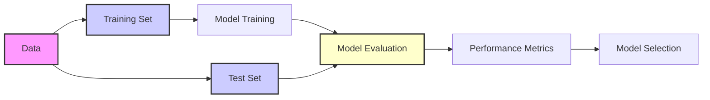

### Introdução

A capacidade de um modelo de aprendizado de máquina de generalizar para dados não vistos é crucial. Este capítulo aborda a **generalização** [^7.1], ou seja, a performance preditiva do modelo em dados independentes (test set). A avaliação dessa performance é essencial para orientar a escolha do melhor método de aprendizado ou modelo [^7.1]. Discutiremos métodos para avaliar e selecionar modelos, começando com a análise do *tradeoff* entre viés (*bias*), variância e complexidade do modelo [^7.2].

### Conceitos Fundamentais

**Conceito 1: Generalização e Erro de Predição**

A **generalização** refere-se à habilidade de um modelo de aprendizado de máquina em prever resultados corretamente em dados que não foram usados para treiná-lo [^7.1]. O erro de predição, por sua vez, quantifica o quão distante as predições do modelo estão dos valores reais. Formalmente, um modelo $f(X)$ é treinado utilizando um conjunto de dados $T$ para aproximar uma variável alvo $Y$. O erro pode ser medido através de funções de perda, como o erro quadrático médio ou o erro absoluto [^7.2]:

$$ L(Y, f(X)) = \begin{cases}
(Y - f(X))^2 & \text{erro quadrático} \\
|Y - f(X)| & \text{erro absoluto}
\end{cases} $$

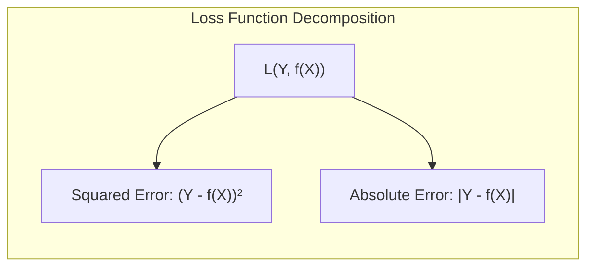

O objetivo é minimizar este erro no conjunto de teste, um conjunto de dados não visto durante o treinamento. Métodos lineares, embora simples, podem sofrer de viés alto (underfitting) quando a relação entre $X$ e $Y$ é não linear [^7.2]. A escolha do modelo impacta no equilíbrio entre viés e variância.

> 💡 **Exemplo Numérico:**
>
> Imagine que estamos tentando prever o preço de casas ($Y$) com base no número de quartos ($X$). Um modelo linear simples poderia ser $f(X) = 50000 + 75000X$. Se a relação verdadeira for, na verdade, não linear, como $Y = 100000 + 50000X + 10000X^2$, o modelo linear terá um **viés alto**. Ele não consegue capturar a curvatura da relação. Para calcular o erro, podemos usar um conjunto de teste:
>
> | Casa | Número de Quartos ($X$) | Preço Real ($Y$) | Preço Predito ($f(X)$) | Erro Quadrático $(Y - f(X))^2$ |
> |---|---|---|---|---|
> | 1  | 1 | 160000 | 125000 | 1225000000 |
> | 2  | 2 | 300000 | 200000 | 10000000000 |
> | 3  | 3 | 550000 | 275000 | 75625000000 |
>
> O erro quadrático médio neste pequeno conjunto de teste seria a média da coluna de erros quadráticos. Se usarmos um modelo mais complexo (um polinômio de grau 2, por exemplo), poderíamos obter um erro menor nesse mesmo conjunto de teste. No entanto, um modelo muito complexo (ex: um polinômio de grau 10) poderia ajustar-se perfeitamente ao conjunto de treino, mas apresentar erros altos em dados não vistos (variância alta).

**Lemma 1:** *A complexidade do modelo afeta o balanço entre viés e variância*. Um modelo com pouca complexidade (ex: modelo linear simples) pode ter um alto viés (não consegue capturar padrões complexos), enquanto modelos muito complexos podem ter alta variância (sensíveis a variações nos dados de treinamento e baixa generalização). O objetivo é encontrar um ponto ótimo onde o erro de predição seja minimizado [^7.2]. Um modelo *linear*, por exemplo, apresenta uma *menor variância*, mas um *alto viés* quando os dados são não lineares.

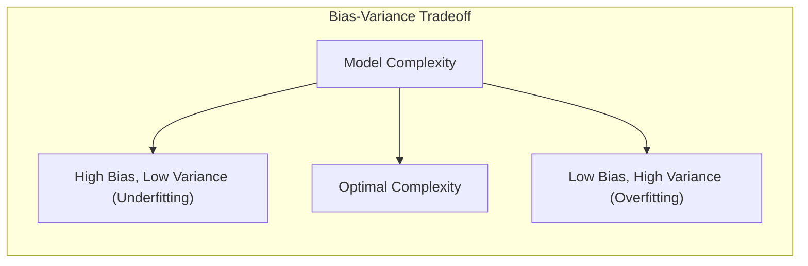

**Conceito 2: Linear Discriminant Analysis (LDA)**

A *Linear Discriminant Analysis* (LDA) é um método de classificação que busca projetar os dados em um subespaço de dimensão menor, de forma que as classes fiquem o mais separadas possível. Ele assume que os dados de cada classe são normalmente distribuídos e compartilham a mesma matriz de covariância [^7.3]. A função discriminante linear gerada pelo LDA pode ser expressa como:

$$ \delta_k(x) = x^T \Sigma^{-1}\mu_k - \frac{1}{2}\mu_k^T\Sigma^{-1}\mu_k + \log(\pi_k) $$

onde:

-   $x$ é o vetor de features,
-   $\Sigma$ é a matriz de covariância conjunta,
-   $\mu_k$ é a média da classe $k$,
-   $\pi_k$ é a probabilidade a priori da classe $k$.

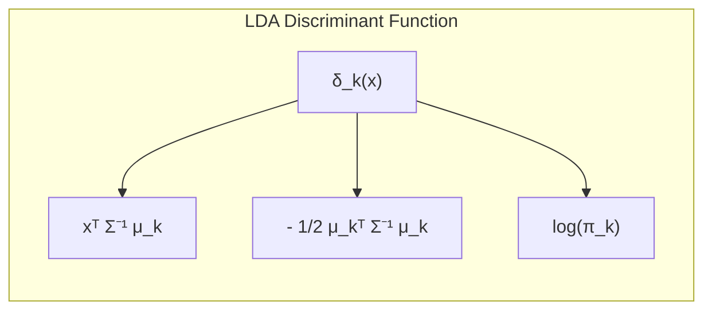
O LDA tem como objetivo projetar os dados em uma direção que maximize a separação entre as classes [^7.3.1], [^7.3.2].

> 💡 **Exemplo Numérico:**
>
> Suponha que temos duas classes de flores (classe 0 e classe 1) e duas features (comprimento e largura da sépala). Temos os seguintes dados:
>
> ```python
> import numpy as np
> from sklearn.discriminant_analysis import LinearDiscriminantAnalysis
>
> X = np.array([[5.1, 3.5], [4.9, 3.0], [6.2, 3.4], [7.2, 3.2], [4.6, 3.1], [5.0, 3.6], [6.7, 3.0], [7.7, 3.8]])
> y = np.array([0, 0, 1, 1, 0, 0, 1, 1])
>
> lda = LinearDiscriminantAnalysis()
> lda.fit(X, y)
>
> print("Médias das classes:", lda.means_)
> print("Matriz de covariância conjunta:", lda.covariance_)
> print("Coeficientes da função discriminante:", lda.scalings_)
>
> # Saída aproximada
# Médias das classes: [[4.9   3.24]  [7.2    3.35]]
# Matriz de covariância conjunta: [[0.482  0.05  ] [0.05  0.09  ]]
# Coeficientes da função discriminante: [[-0.9  0.5]]
> ```
>
> A saída mostra as médias das classes, a matriz de covariância conjunta estimada pelo LDA e os coeficientes da função discriminante. O LDA encontrou uma combinação linear das features que melhor separa as duas classes, o que pode ser usado para classificar novas flores. A função discriminante $\delta_k(x)$ calcula um score, e a classe com maior score é atribuída ao novo dado.

**Corolário 1:** A fronteira de decisão do LDA é linear [^7.3.3], o que a torna uma escolha adequada para problemas onde as classes são linearmente separáveis ou aproximadamente separáveis. Em outras palavras, o LDA busca encontrar a melhor combinação linear das features que separe as classes, o que corresponde a encontrar a melhor projeção dos dados em um subespaço de dimensão menor [^7.3].

**Conceito 3: Logistic Regression**

A *Logistic Regression* é outro método popular para classificação, modelando a probabilidade de pertencer a uma classe através da função logística (sigmoide). A regressão logística estima a probabilidade de um evento ocorrer utilizando uma função logística sobre uma combinação linear das variáveis preditoras [^7.4]. O log-odds (logit) é dado por:

$$ \text{logit}(p(X)) = \ln\left(\frac{p(X)}{1 - p(X)}\right) = \beta_0 + \beta_1 X_1 + \ldots + \beta_p X_p $$

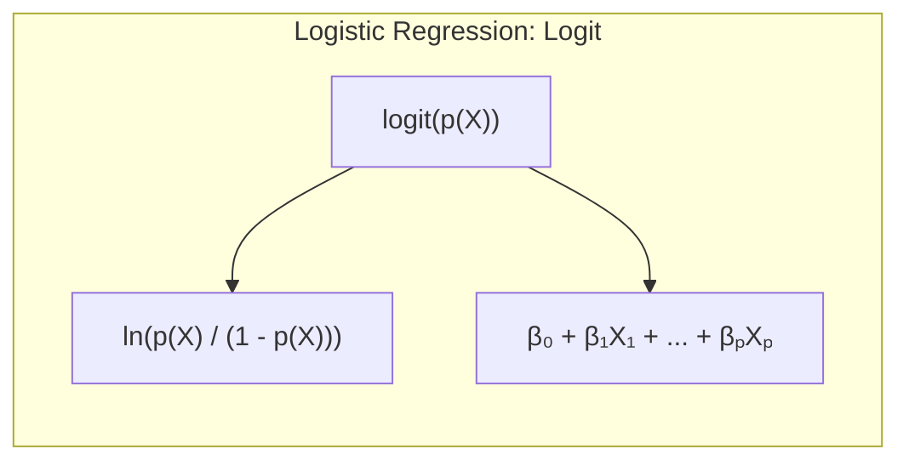
A função logística converte o resultado do modelo linear em uma probabilidade entre 0 e 1 [^7.4.1]. Os parâmetros são estimados maximizando a verossimilhança (likelihood) dos dados de treinamento [^7.4.3].

> 💡 **Exemplo Numérico:**
>
> Vamos usar o mesmo conjunto de dados anterior e aplicar regressão logística:
>
> ```python
> from sklearn.linear_model import LogisticRegression
>
> logreg = LogisticRegression()
> logreg.fit(X, y)
>
> print("Intercepto:", logreg.intercept_)
> print("Coeficientes:", logreg.coef_)
>
> # Saída aproximada
# Intercepto: [-33.6]
# Coeficientes: [[5.1  -2.1]]
> ```
>
> Aqui, o `intercept_` é o $\beta_0$ e `coef_` contém os $\beta_i$ da equação logística. O modelo calcula a probabilidade de uma flor pertencer à classe 1. Se essa probabilidade for maior que 0.5, a flor será classificada como classe 1; caso contrário, classe 0.

> ⚠️ **Nota Importante**: A *Logistic Regression* estima probabilidades, enquanto o LDA fornece fronteiras de decisão. A escolha entre eles depende da necessidade de estimar probabilidades ou apenas classificar [^7.4].
> ❗ **Ponto de Atenção**: Classes não balanceadas podem levar a resultados enviesados na *Logistic Regression*. É importante tratar esse desbalanceamento, através de técnicas como *re-sampling* [^7.4.2].
> ✔️ **Destaque**: Em certos casos, quando as suposições do LDA são válidas, as estimativas de parâmetros em LDA e em *Logistic Regression* podem apresentar comportamentos semelhantes [^7.5].

### Regressão Linear e Mínimos Quadrados para Classificação

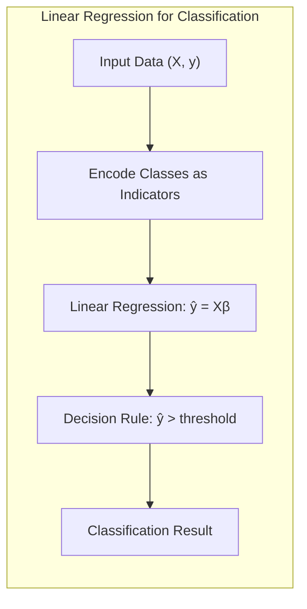

A regressão linear pode ser usada para classificação através da criação de uma **matriz de indicadores**, onde cada coluna indica a pertença de uma amostra a uma determinada classe. O objetivo é minimizar o erro quadrático da predição da pertença à classe [^7.2]. A regressão linear, neste caso, ajusta um modelo linear para prever a pertença à classe, e a classificação é feita através de uma regra de decisão baseada nas predições.

> 💡 **Exemplo Numérico:**
>
> Para usar regressão linear para classificação com o mesmo exemplo anterior, transformamos as classes em uma representação numérica:
>
> | Casa | Número de Quartos ($X_1$) | Largura da Sépala ($X_2$)| Classe (y) |
> |---|---|---|---|
> | 1 | 5.1 | 3.5 | 0 |
> | 2 | 4.9 | 3.0 | 0 |
> | 3 | 6.2 | 3.4 | 1 |
> | 4 | 7.2 | 3.2 | 1 |
> | 5 | 4.6 | 3.1 | 0 |
> | 6 | 5.0 | 3.6 | 0 |
> | 7 | 6.7 | 3.0 | 1 |
> | 8 | 7.7 | 3.8 | 1 |
>
> Agora, usamos regressão linear, onde o objetivo é prever o valor de y (0 ou 1).
>
> ```python
> from sklearn.linear_model import LinearRegression
>
> linreg = LinearRegression()
> linreg.fit(X, y)
>
> print("Intercepto:", linreg.intercept_)
> print("Coeficientes:", linreg.coef_)
>
> # Saída aproximada
# Intercepto: -1.16
# Coeficientes: [0.23    0.12]
> ```
>
> A classificação é feita usando o resultado da regressão linear. Se o resultado é maior que 0.5, a classe predita é 1, senão, 0. Isso mostra como a regressão linear pode ser adaptada para tarefas de classificação.

No entanto, a regressão linear aplicada diretamente à classificação pode apresentar algumas limitações, como extrapolações fora do intervalo \[0, 1], e não modelar a probabilidade de cada classe [^7.4]. O uso de uma matriz de indicadores e a regressão linear podem levar a estimativas menos estáveis e a extrapolações errôneas [^7.2]. Quando o objetivo é obter uma fronteira de decisão linear, e não estimar a probabilidade de pertença à classe, a regressão linear pode ser suficiente [^7.2].

**Lemma 2**: *Sob certas condições, a projeção nos hiperplanos de decisão obtidos via regressão linear em matriz de indicadores pode ser equivalente às projeções obtidas por discriminantes lineares.* Em outras palavras, ao invés de usar LDA, sob condições específicas, a regressão linear pode produzir uma fronteira de decisão linear muito similar. Isso é particularmente útil quando a projeção linear é o principal objetivo, e não a estimativa da probabilidade de classes. [^7.2]

**Corolário 2**: A equivalência entre as projeções via regressão linear e discriminantes lineares, sob certas condições [^7.3], pode simplificar a análise do modelo, especialmente quando a separação linear das classes é o principal objetivo. O uso de regressão linear em problemas de classificação pode ser uma alternativa interessante quando a complexidade e o custo computacional de outros métodos, como LDA, precisam ser considerados [^7.2].

> Em alguns cenários, a regressão logística pode fornecer estimativas mais estáveis de probabilidade, enquanto a regressão de indicadores pode levar a extrapolações fora de [0,1]. [^7.4]
> No entanto, há situações em que a regressão de indicadores é suficiente e até mesmo vantajosa quando o objetivo principal é a fronteira de decisão linear [^7.2].

### Métodos de Seleção de Variáveis e Regularização em Classificação

A seleção de variáveis é crucial para construir modelos parcimoniosos, evitar *overfitting* e aumentar a interpretabilidade. Em modelos lineares como a regressão logística, a *regularização* é uma técnica que adiciona um termo de penalidade na função de custo, que controla a complexidade do modelo [^7.4.4]. As penalidades mais comuns são a L1 (Lasso) e a L2 (Ridge), que tendem a encolher os coeficientes em direção a zero e diminuir a variância [^7.5].

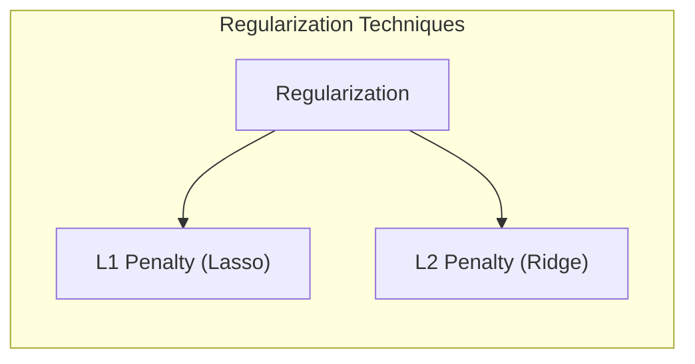

A penalização L1 leva a coeficientes esparsos, ou seja, muitos coeficientes são zerados, realizando assim a seleção de variáveis [^7.4.4]. A penalização L2 encolhe os coeficientes, diminuindo a variância e a complexidade do modelo [^7.5]. Ambas as técnicas, L1 e L2, ajudam a controlar o *overfitting* e melhorar a capacidade de generalização do modelo.

> 💡 **Exemplo Numérico:**
>
> Vamos aplicar a regularização L1 (Lasso) à regressão logística:
>
> ```python
> from sklearn.linear_model import LogisticRegression
>
> # Aumentando o número de features
> X_extended = np.hstack((X, np.random.rand(X.shape[0], 5)))
>
> # Ajustando com L1 (Lasso)
> logreg_l1 = LogisticRegression(penalty='l1', solver='liblinear', C=0.1) # C é o inverso de lambda
> logreg_l1.fit(X_extended, y)
> print("Coeficientes Lasso:", logreg_l1.coef_)
>
> # Ajustando com L2 (Ridge)
> logreg_l2 = LogisticRegression(penalty='l2', C=0.1) # C é o inverso de lambda
> logreg_l2.fit(X_extended, y)
> print("Coeficientes Ridge:", logreg_l2.coef_)
>
> # Saída (variável devido à aleatoriedade)
# Coeficientes Lasso: [[ 0.          0.         -0.4         0.         0.          0.         -0.        ]]
# Coeficientes Ridge: [[-0.23 -0.24 -0.14  -0.07 -0.12  -0.27 -0.08]]
> ```
>
> Observe que com a penalidade L1 (Lasso), alguns coeficientes são exatamente zero, realizando seleção de variáveis, enquanto que com L2 (Ridge), os coeficientes tendem a ficar pequenos. O parâmetro C controla a intensidade da regularização.

**Lemma 3**: *A penalização L1 em modelos de classificação logística leva a coeficientes esparsos*, o que significa que muitos dos coeficientes são forçados a serem exatamente zero, efetivamente realizando a seleção de variáveis. Matematicamente, a penalização L1 adiciona um termo proporcional à soma dos valores absolutos dos coeficientes à função de perda. A otimização dessa função tende a levar à esparsidade dos coeficientes, removendo os preditores menos relevantes [^7.4.4].

**Prova do Lemma 3**: A função de custo com penalização L1 para um modelo de regressão logística é dada por:

$$ J(\beta) = -\frac{1}{N} \sum_{i=1}^{N} \left[ y_i \log(p_i) + (1 - y_i) \log(1 - p_i) \right] + \lambda \sum_{j=1}^{p} |\beta_j| $$

Onde $p_i$ é a probabilidade de pertença à classe, $\beta$ são os coeficientes do modelo, e $\lambda$ é o parâmetro de regularização. A derivada da penalidade L1 em relação a $\beta_j$ é dada por $\lambda \cdot \text{sign}(\beta_j)$. Este termo não é diferenciável em $\beta_j=0$, o que leva a coeficientes sendo exatamente zero durante o processo de otimização, especialmente para valores suficientemente altos de $\lambda$. Este processo induz a esparsidade e realiza seleção de variáveis [^7.4.3], [^7.4.5]. $\blacksquare$

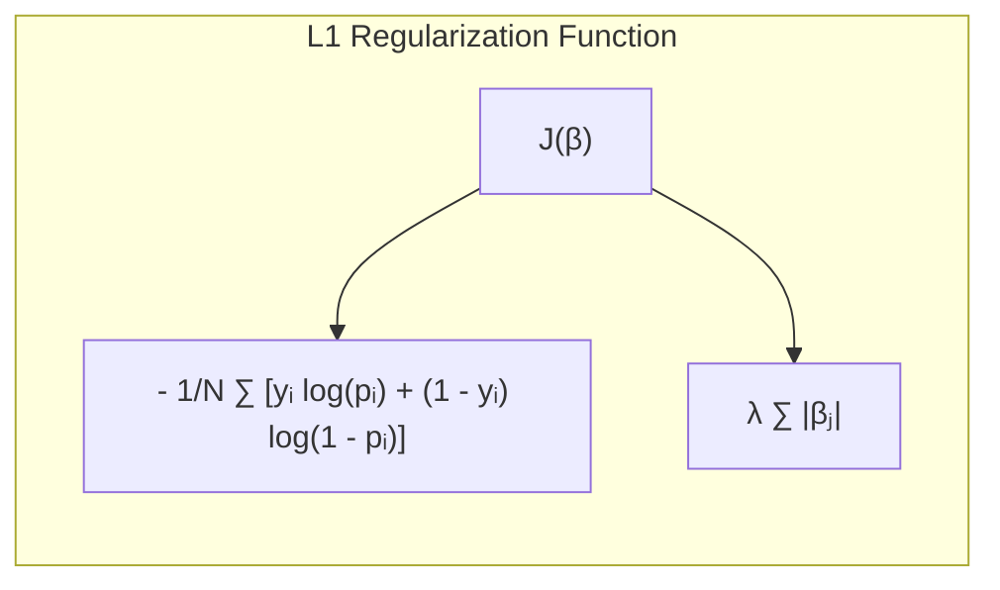

**Corolário 3**: A esparsidade dos coeficientes resultante da penalização L1 aumenta a interpretabilidade do modelo, uma vez que apenas as variáveis mais importantes são mantidas no modelo final [^7.4.5]. Isso facilita a compreensão da relação entre as variáveis preditoras e a variável alvo.

> ⚠️ **Ponto Crucial**: L1 e L2 podem ser combinadas (Elastic Net) para aproveitar vantagens de ambos os tipos de regularização [^7.5]. Essa técnica é especialmente útil quando há alta correlação entre as variáveis preditoras.

### Separating Hyperplanes e Perceptrons

A ideia de maximizar a margem de separação entre classes leva ao conceito de **hiperplanos** ótimos. O objetivo é encontrar um hiperplano que separe as classes com a maior distância possível entre ele e os pontos mais próximos de cada classe (os *support vectors*). A formulação matemática desse problema envolve a otimização do dual de Wolfe, que permite encontrar os pontos de suporte e definir o hiperplano ótimo [^7.5.2].

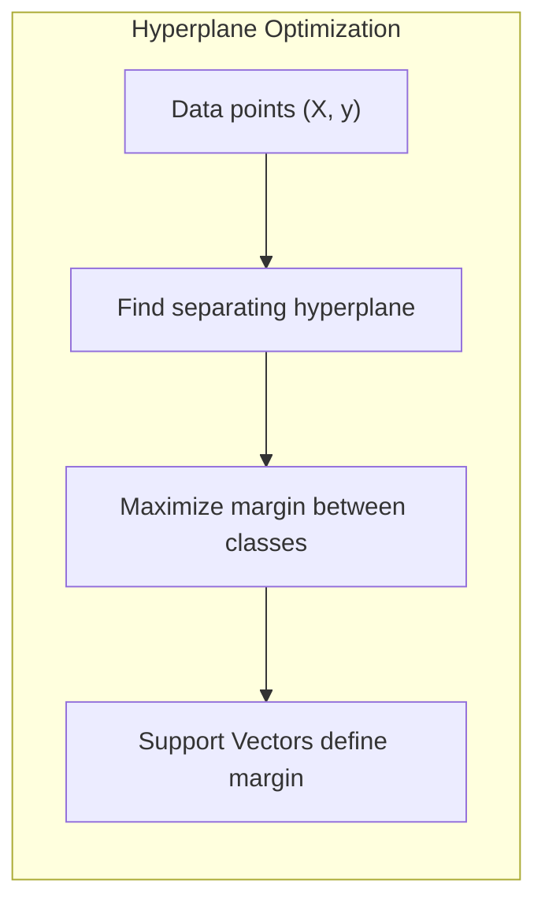

O Perceptron de Rosenblatt é um algoritmo de classificação que busca encontrar um hiperplano que separe linearmente os dados [^7.5.1]. O algoritmo itera sobre os dados, ajustando os pesos do hiperplano a cada erro de classificação. Sob a condição de separabilidade linear dos dados, o Perceptron converge para um hiperplano que separa as classes.

### Pergunta Teórica Avançada (Exemplo): Quais as diferenças fundamentais entre a formulação de LDA e a Regra de Decisão Bayesiana considerando distribuições Gaussianas com covariâncias iguais?

**Resposta:**
O *Linear Discriminant Analysis* (LDA) e a Regra de Decisão Bayesiana são métodos de classificação que, sob certas condições, podem apresentar resultados similares, especialmente quando assumimos que os dados seguem distribuições Gaussianas com covariâncias iguais [^7.3]. No entanto, as formulações e objetivos de cada método são distintos:

-   **Regra de Decisão Bayesiana:** O classificador Bayesiano busca minimizar a probabilidade de erro de classificação e, para isso, utiliza as probabilidades *a posteriori* das classes, dadas pelas seguintes expressões:

    $$ P(G=k|X=x) = \frac{P(X=x|G=k)\pi_k}{\sum_{l=1}^K P(X=x|G=l)\pi_l} $$

    Onde $P(G=k|X=x)$ é a probabilidade *a posteriori* da classe $k$, dado o vetor de features $x$; $P(X=x|G=k)$ é a densidade de probabilidade dos dados da classe $k$; e $\pi_k$ é a probabilidade *a priori* da classe $k$ [^7.3].
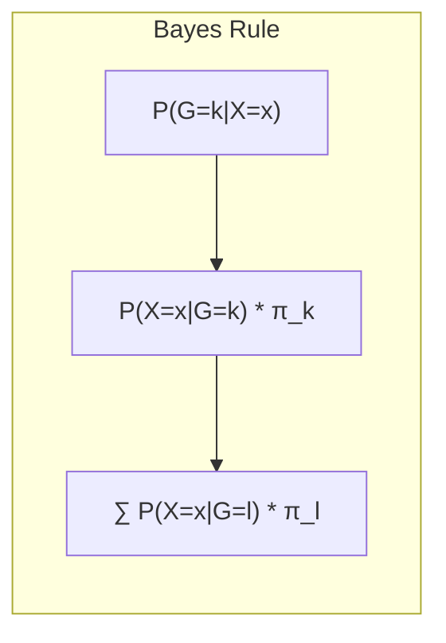
-   **LDA:** O LDA, por sua vez, assume que os dados de cada classe seguem uma distribuição Gaussiana com a mesma matriz de covariância e utiliza uma função discriminante linear para separar as classes, como expresso em [^7.3]. Matematicamente, o LDA busca encontrar um subespaço de dimensão menor que maximize a separação entre as classes, projetando os dados nessa direção. Quando assumimos que as covariâncias das classes são iguais, a fronteira de decisão entre duas classes $k$ e $l$ é expressa como:

    $$  x^T \Sigma^{-1}(\mu_k - \mu_l) - \frac{1}{2}(\mu_k^T\Sigma^{-1}\mu_k - \mu_l^T\Sigma^{-1}\mu_l) + \log\left(\frac{\pi_k}{\pi_l}\right) = 0 $$

    que define um hiperplano [^7.3.3].

**Lemma 4:** *Quando as distribuições condicionais das classes são Gaussianas com a mesma matriz de covariância e quando usamos a Regra de Decisão Bayesiana, a fronteira de decisão resultante é uma função linear dos dados, equivalente à função discriminante do LDA* [^7.3], [^7.3.3]. Isso significa que, sob essas suposições específicas, ambos os métodos levam ao mesmo hiperplano de decisão, embora utilizando abordagens diferentes.

**Corolário 4:** *Ao relaxar a suposição de covariâncias iguais, a Regra de Decisão Bayesiana leva a fronteiras quadráticas* (Quadratic Discriminant Analysis ou QDA), enquanto o LDA continua utilizando fronteiras lineares [^7.3]. Essa é uma diferença fundamental entre os dois métodos, e a escolha entre eles depende da natureza dos dados e da complexidade da fronteira de decisão necessária.

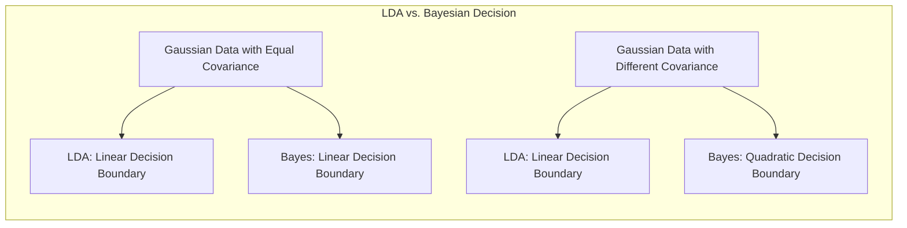

> ⚠️ **Ponto Crucial**: A adoção ou não de covariâncias iguais impacta fortemente o tipo de fronteira de decisão (linear vs. quadrática) [^7.3.1]. A escolha entre LDA e QDA (ou Regra de Decisão Bayesiana com covariâncias diferentes) dependerá da adequação das hipóteses aos dados e da capacidade de cada modelo de capturar as complexidades do problema de classificação.

### Conclusão

Este capítulo forneceu uma visão abrangente sobre a divisão de dados para avaliação e seleção de modelos. Discutimos o *tradeoff* entre *bias* e variância, a importância de estimar o erro de generalização e apresentamos diferentes métodos para divisão de dados e escolha do melhor modelo. Métodos de regularização, como L1 e L2, desempenham um papel crucial no controle da complexidade do modelo e na melhoria da sua capacidade de generalização. Concluímos que o *data splitting* é essencial para avaliar corretamente a performance de modelos de *machine learning* e guiar a escolha dos melhores modelos para problemas específicos. <!-- END DOCUMENT -->

### Footnotes

[^7.1]: "The generalization performance of a learning method relates to its prediction capability on independent test data. Assessment of this performance is extremely important in practice, since it guides the choice of learning method or model, and gives us a measure of the quality of the ultimately chosen model."
[^7.2]: "Figure 7.1 illustrates the important issue in assessing the ability of a learning method to generalize. Consider first the case of a quantitative or interval scale response. We have a target variable Y, a vector of inputs X, and a prediction model f(X) that has been estimated from a training set T. The loss function for measuring errors between Y and f(X) is denoted by L(Y, f(X)). Typical choices are L(Y, f(X)) = (Y−f(X))2 squared error or L(Y, f(X)) = |Y − f(X)| absolute error."
[^7.3]: "The story is similar for a qualitative or categorical response G taking one of K values in a set G, labeled for convenience as 1, 2, ..., K. Typically we model the probabilities pk(X) = Pr(G = k|X) (or some monotone transformations fk(X)), and then Ĝ(X) = arg maxk fk(X). In some cases, such as 1-nearest neighbor classification (Chapters 2 and 13) we produce G(X) directly. Typical loss functions are L(G, Ĝ(X)) = I(G ≠ Ĝ(X)) (0-1 loss) or L(G, P(X)) = −2 ∑k=1 K I(G = k) log pk(X) = −2 log pĜ(X)  (-2 × log-likelihood)."
[^7.3.1]: "Test error, also referred to as generalization error, is the prediction error over an independent test sample ErrT = E[L(Y, f(X))|T], where both X and Y are drawn randomly from their joint distribution (population). Here the training set T is fixed, and test error refers to the error for this specific training set."
[^7.3.2]: "A related quantity is the expected prediction error (or expected test error) Err = E[L(Y, f(X))] = E[ErrT]. Note that this expectation averages over everything that is random, including the randomness in the training set that produced f."
[^7.3.3]: "Estimation of Erry will be our goal, although we will see that Err is more amenable to statistical analysis, and most methods effectively estimate the expected error."
[^7.4]: "Training error is the average loss over the training sample err =  1/N * Σ L(Yi, f(xi))"
[^7.4.1]: "We would like to know the expected test error of our estimated model f. As the model becomes more and more complex, it uses the training data more and is able to adapt to more complicated underlying structures. Hence there is a decrease in bias but an increase in variance. There is some intermediate model complexity that gives minimum expected test error."
[^7.4.2]: "Unfortunately training error is not a good estimate of the test error, as seen in Figure 7.1. Training error consistently decreases with model complexity, typically dropping to zero if we increase the model complexity enough."
[^7.4.3]: "However, a model with zero training error is overfit to the training data and will typically generalize poorly."
[^7.4.4]: "The log-likelihood can be used as a loss-function for general response densities, such as the Poisson, gamma, exponential, log-normal and others."
[^7.4.5]: "If Pro(x) (Y) is the density of Y, indexed by a parameter θ(X) that depends on the predictor X, then L(Y, θ(X)) = −2 · log Pro(x) (Y)."
[^7.5]: "The “−2” in the definition makes the log-likelihood loss for the Gaussian distribution match squared-error loss."
[^7.5.1]: "For ease of exposition, for the remainder of this chapter we will use Y and f(X) to represent all of the above situations, since we focus mainly on the quantitative response (squared-error loss) setting."
[^7.5.2]: "For the other situations, the appropriate translations are obvious."
