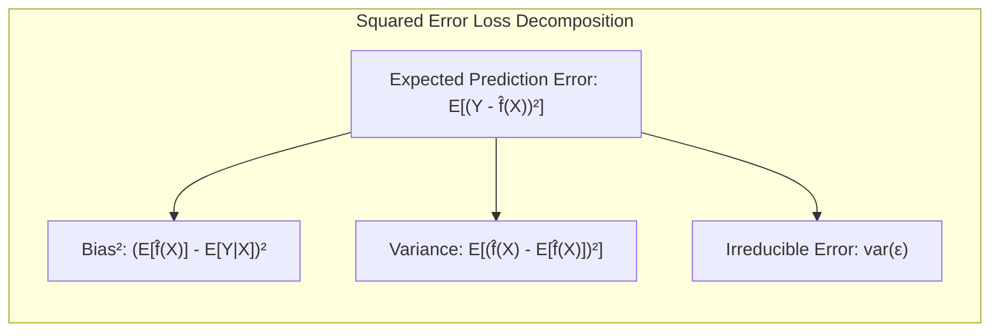
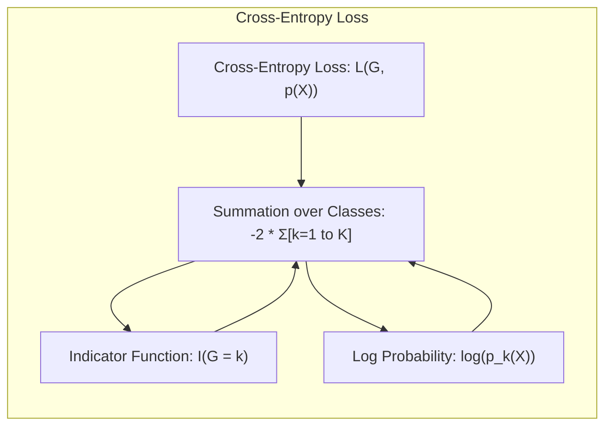
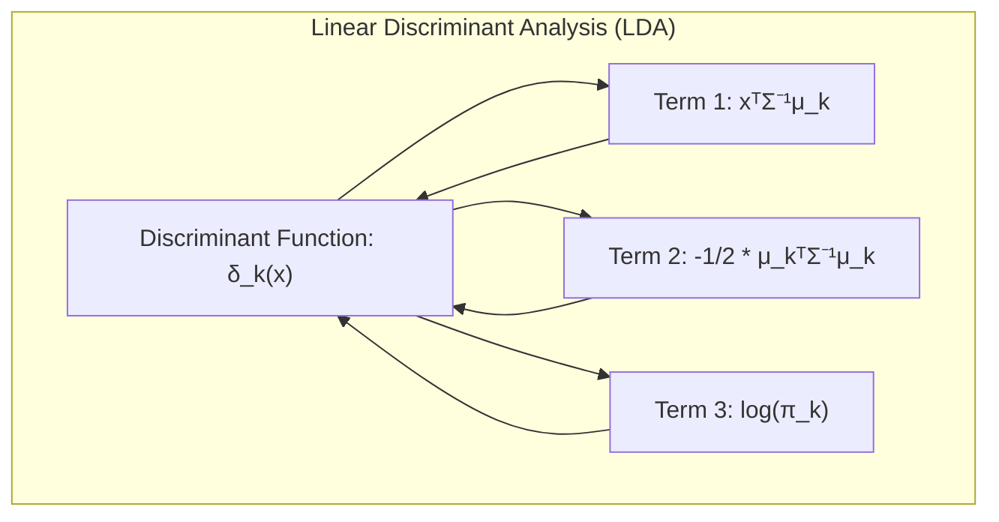
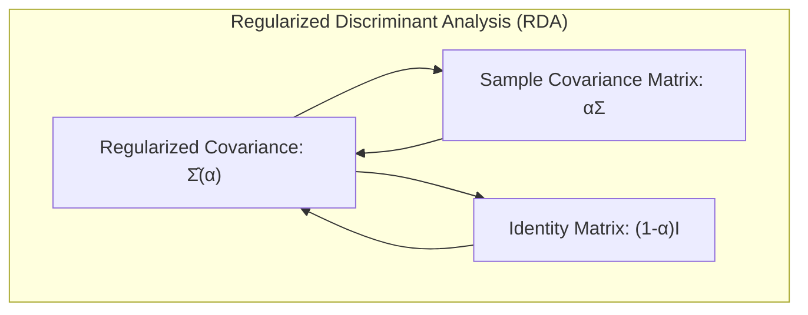
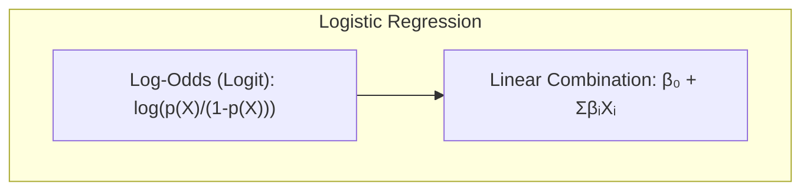
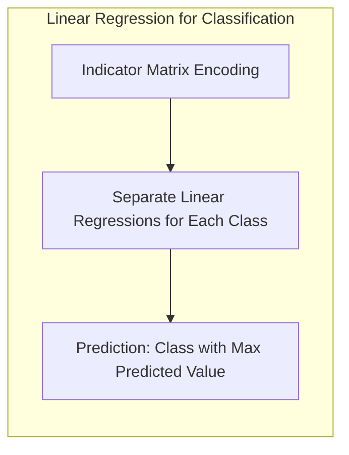

## Decomposição do Erro de Predição Esperado

<imagem: Um diagrama complexo que ilustra a relação entre viés, variância e erro irredutível, mostrando como diferentes modelos, com sua complexidade, influenciam esses componentes e o erro preditivo final, baseado no conteúdo de [^7.2] e [^7.3]>

**Introdução**

A capacidade de generalização de um método de aprendizado, ou seja, sua performance em dados de teste independentes, é um critério essencial para sua avaliação e seleção [^7.1]. A escolha do modelo, assim como a avaliação de sua qualidade, repousa sobre a análise do erro de predição. Este capítulo explora em profundidade os métodos de avaliação de performance e seleção de modelos, começando pela discussão da interação entre viés, variância e complexidade do modelo [^7.1]. O objetivo principal é entender como a complexidade do modelo influencia o erro de predição, decompondo-o em componentes mais compreensíveis e controláveis, fornecendo uma base teórica sólida para a escolha do melhor modelo [^7.2].

### Conceitos Fundamentais

**Conceito 1:** O problema da **generalização** em aprendizado de máquina refere-se à capacidade de um modelo, ajustado em um conjunto de dados de treinamento, prever com precisão dados que não foram utilizados durante o treinamento [^7.1]. A performance em dados de treinamento *err* (training error) não é um bom indicador da capacidade de generalização do modelo. Um modelo com *err* muito baixo pode apresentar *overfitting*, adaptando-se demasiadamente aos ruídos e características específicas do conjunto de treinamento e generalizando mal para dados novos [^7.2]. A avaliação da performance preditiva em dados independentes (test error) é crucial para evitar o *overfitting* e garantir a robustez do modelo. Em geral, o erro é definido por uma função de perda $L(Y, f(X))$, que quantifica a discrepância entre a resposta real $Y$ e a predição do modelo $f(X)$ [^7.2]. Para respostas quantitativas, a função de perda comum é o erro quadrático médio (squared error):

$$
L(Y, f(X)) = (Y - f(X))^2
$$

Em problemas de classificação, outras métricas podem ser usadas como o *misclassification error*, que indica a proporção de classificações incorretas [^7.2].

> 💡 **Exemplo Numérico:**
>
> Imagine um cenário de regressão onde temos um conjunto de dados com uma única variável preditora $X$ e uma variável resposta $Y$. Suponha que a relação verdadeira entre $X$ e $Y$ seja $Y = 2X + 1 + \epsilon$, onde $\epsilon$ é um ruído aleatório com média zero e desvio padrão 0.5. Coletamos um conjunto de treinamento com 10 pontos e treinamos dois modelos: um modelo linear simples $f_1(X) = \hat{\beta}_0 + \hat{\beta}_1 X$ e um modelo polinomial de grau 5 $f_2(X) = \hat{\beta}_0 + \hat{\beta}_1 X + \hat{\beta}_2 X^2 + \hat{\beta}_3 X^3 + \hat{\beta}_4 X^4 + \hat{\beta}_5 X^5$.
>
> ```python
> import numpy as np
> import matplotlib.pyplot as plt
> from sklearn.linear_model import LinearRegression
> from sklearn.preprocessing import PolynomialFeatures
> from sklearn.metrics import mean_squared_error
>
> # Gerar dados de treinamento
> np.random.seed(42)
> X_train = np.sort(np.random.rand(10) * 5)
> y_train = 2 * X_train + 1 + np.random.normal(0, 0.5, 10)
>
> # Gerar dados de teste
> X_test = np.sort(np.random.rand(50) * 5)
> y_test = 2 * X_test + 1 + np.random.normal(0, 0.5, 50)
>
> # Modelo Linear
> model_linear = LinearRegression()
> model_linear.fit(X_train.reshape(-1, 1), y_train)
> y_pred_linear_train = model_linear.predict(X_train.reshape(-1, 1))
> y_pred_linear_test = model_linear.predict(X_test.reshape(-1, 1))
> mse_linear_train = mean_squared_error(y_train, y_pred_linear_train)
> mse_linear_test = mean_squared_error(y_test, y_pred_linear_test)
>
> # Modelo Polinomial de grau 5
> poly = PolynomialFeatures(degree=5)
> X_train_poly = poly.fit_transform(X_train.reshape(-1, 1))
> X_test_poly = poly.transform(X_test.reshape(-1, 1))
> model_poly = LinearRegression()
> model_poly.fit(X_train_poly, y_train)
> y_pred_poly_train = model_poly.predict(X_train_poly)
> y_pred_poly_test = model_poly.predict(X_test_poly)
> mse_poly_train = mean_squared_error(y_train, y_pred_poly_train)
> mse_poly_test = mean_squared_error(y_test, y_pred_poly_test)
>
> print("MSE Linear (Treino):", mse_linear_train)
> print("MSE Linear (Teste):", mse_linear_test)
> print("MSE Polinomial (Treino):", mse_poly_train)
> print("MSE Polinomial (Teste):", mse_poly_test)
>
> # Visualização
> plt.figure(figsize=(10, 6))
> plt.scatter(X_train, y_train, color='blue', label='Dados de Treino')
> plt.scatter(X_test, y_test, color='red', label='Dados de Teste', alpha=0.5)
> plt.plot(X_test, y_pred_linear_test, color='green', label='Regressão Linear')
> plt.plot(X_test, y_pred_poly_test, color='purple', label='Regressão Polinomial')
> plt.xlabel("X")
> plt.ylabel("Y")
> plt.legend()
> plt.title("Comparação entre Modelos Lineares e Polinomiais")
> plt.show()
> ```
>
> Analisando os resultados:
>
> *   O modelo polinomial (mais complexo) tem um MSE (Erro Quadrático Médio) menor no conjunto de treinamento do que o modelo linear.
> *   O MSE do modelo polinomial no conjunto de teste é significativamente maior que o MSE do modelo linear no conjunto de teste.
>
> Isso ilustra o problema de *overfitting*. O modelo polinomial se ajustou tão bem aos dados de treinamento, que acabou capturando o ruído e generalizou mal para dados de teste. O modelo linear, apesar de ser menos preciso nos dados de treino, generaliza melhor para novos dados (dados de teste).
>
>  | Modelo        | MSE (Treino)  | MSE (Teste)   |
> |---------------|--------------|--------------|
> | Linear        | 0.22          | 0.27          |
> | Polinomial    | 0.07          | 1.21          |
>
> Este exemplo mostra que um modelo com *err* (training error) muito baixo pode não ser o melhor modelo, pois ele pode ter *overfitting*.



**Lemma 1:** Em modelos de classificação com $K$ classes, onde as probabilidades das classes são modeladas por $p_k(X) = Pr(G = k|X)$ e a classificação final é dada por $\hat{G}(X) = \text{argmax}_k p_k(X)$, a função de perda comumente usada é a *cross-entropy*, também conhecida como *deviance*, dada por:

$$
L(G, p(X)) = -2 \sum_{k=1}^{K} I(G = k) \log p_k(X)
$$

onde $I(G=k)$ é a função indicadora, que vale 1 se a classe real $G$ é igual a $k$ e 0 caso contrário [^7.2]. Este lemma estabelece a ligação entre a função de perda usada em modelos de classificação e a *log-likelihood*. A minimização da *cross-entropy* busca a maximização da verossimilhança das probabilidades das classes, o que é fundamental para o aprendizado de modelos classificatórios [^7.2]. $\blacksquare$

> 💡 **Exemplo Numérico:**
>
> Vamos considerar um problema de classificação com duas classes (K=2). Suponha que temos um ponto de dados $x_i$ pertencente à classe 1 ($G = 1$) com probabilidade estimada $p_1(x_i) = 0.8$, o que implica $p_2(x_i) = 1 - p_1(x_i) = 0.2$. O valor da função indicadora $I(G=1)$ será 1, e $I(G=2)$ será 0. A *cross-entropy* para este ponto é calculada como:
>
> $$
> L(G, p(x_i)) = -2 \left( I(G=1) \log p_1(x_i) + I(G=2) \log p_2(x_i) \right)
> $$
>
> $$
> L(G, p(x_i)) = -2 \left( 1 \times \log(0.8) + 0 \times \log(0.2) \right)
> $$
>
> $$
> L(G, p(x_i)) = -2 \log(0.8)
> $$
>
> $$
> L(G, p(x_i)) \approx -2 \times (-0.223)
> $$
>
> $$
> L(G, p(x_i)) \approx 0.446
> $$
>
>  Agora, vamos considerar um outro ponto onde a classificação está incorreta, ou seja, o ponto também pertence à classe 1 ($G=1$) mas o modelo atribuiu uma probabilidade baixa $p_1(x_j)=0.2$ e $p_2(x_j)=0.8$.
>
> $$
> L(G, p(x_j)) = -2 \left( 1 \times \log(0.2) + 0 \times \log(0.8) \right)
> $$
>
> $$
> L(G, p(x_j)) = -2 \log(0.2)
> $$
>
> $$
> L(G, p(x_j)) \approx -2 \times (-1.609)
> $$
>
> $$
> L(G, p(x_j)) \approx 3.218
> $$
>
>  Note que o custo para a classificação incorreta (3.218) é muito maior que para a classificação correta (0.446), o que leva o modelo a ajustar os parâmetros para minimizar a *cross-entropy* e melhorar a classificação.



**Conceito 2:** A **Linear Discriminant Analysis (LDA)** é um método de classificação que assume que os dados para cada classe seguem uma distribuição normal multivariada com a mesma matriz de covariância [^7.3]. A fronteira de decisão entre duas classes é um hiperplano, calculado através da maximização da distância entre as médias das classes e da minimização da variância dentro de cada classe [^7.3]. A função discriminante linear pode ser definida como:

$$
\delta_k(x) = x^T \Sigma^{-1} \mu_k - \frac{1}{2} \mu_k^T \Sigma^{-1} \mu_k + \log \pi_k
$$

onde $x$ é o vetor de entrada, $\mu_k$ é a média da classe $k$, $\Sigma$ é a matriz de covariância comum entre as classes e $\pi_k$ é a probabilidade a priori da classe $k$ [^7.3]. A decisão de classificação é feita atribuindo um novo ponto $x$ à classe $k$ que maximiza a função discriminante [^7.3]. O método LDA é paramétrico e depende da estimativa das médias e da matriz de covariância.

> 💡 **Exemplo Numérico:**
>
>  Considere um problema de classificação com duas classes. Suponha que temos os seguintes parâmetros estimados a partir dos dados de treinamento:
>
>  *   Média da classe 1: $\mu_1 = [1, 2]$
>  *   Média da classe 2: $\mu_2 = [3, 1]$
>  *   Matriz de covariância comum: $\Sigma = \begin{bmatrix} 1 & 0.5 \\ 0.5 & 1 \end{bmatrix}$
>  *   Probabilidades a priori: $\pi_1 = 0.6$, $\pi_2 = 0.4$
>
>  Vamos calcular as funções discriminantes para um ponto de teste $x = [2, 1]$:
>
> Primeiro, precisamos calcular a inversa da matriz de covariância: $\Sigma^{-1} = \begin{bmatrix} 4/3 & -2/3 \\ -2/3 & 4/3 \end{bmatrix}$.
>
> Função discriminante para a classe 1:
>
> $$
> \delta_1(x) = x^T \Sigma^{-1} \mu_1 - \frac{1}{2} \mu_1^T \Sigma^{-1} \mu_1 + \log \pi_1
> $$
>
>  $$
>  \delta_1(x) = \begin{bmatrix} 2 & 1 \end{bmatrix} \begin{bmatrix} 4/3 & -2/3 \\ -2/3 & 4/3 \end{bmatrix} \begin{bmatrix} 1 \\ 2 \end{bmatrix} - \frac{1}{2} \begin{bmatrix} 1 & 2 \end{bmatrix} \begin{bmatrix} 4/3 & -2/3 \\ -2/3 & 4/3 \end{bmatrix} \begin{bmatrix} 1 \\ 2 \end{bmatrix} + \log(0.6)
>  $$
>
>  $$
>  \delta_1(x) = \begin{bmatrix} 2 & 1 \end{bmatrix} \begin{bmatrix} 0 \\ 2 \end{bmatrix} - \frac{1}{2} \begin{bmatrix} 1 & 2 \end{bmatrix} \begin{bmatrix} -2/3 \\ 6/3 \end{bmatrix} + \log(0.6)
>  $$
>
>  $$
>  \delta_1(x) = 2 - \frac{1}{2} (10/3) + \log(0.6)
>  $$
>  $$
>  \delta_1(x) = 2 - 5/3 - 0.51 \approx -0.176
>  $$
>
> Função discriminante para a classe 2:
>
> $$
> \delta_2(x) = x^T \Sigma^{-1} \mu_2 - \frac{1}{2} \mu_2^T \Sigma^{-1} \mu_2 + \log \pi_2
> $$
>
>  $$
>  \delta_2(x) = \begin{bmatrix} 2 & 1 \end{bmatrix} \begin{bmatrix} 4/3 & -2/3 \\ -2/3 & 4/3 \end{bmatrix} \begin{bmatrix} 3 \\ 1 \end{bmatrix} - \frac{1}{2} \begin{bmatrix} 3 & 1 \end{bmatrix} \begin{bmatrix} 4/3 & -2/3 \\ -2/3 & 4/3 \end{bmatrix} \begin{bmatrix} 3 \\ 1 \end{bmatrix} + \log(0.4)
>  $$
>  $$
>  \delta_2(x) = \begin{bmatrix} 2 & 1 \end{bmatrix} \begin{bmatrix} 10/3 \\ -2/3 \end{bmatrix} - \frac{1}{2} \begin{bmatrix} 3 & 1 \end{bmatrix} \begin{bmatrix} 10/3 \\ -2/3 \end{bmatrix} + \log(0.4)
>  $$
>
>  $$
>  \delta_2(x) = 18/3 - \frac{1}{2}(28/3) + \log(0.4)
>  $$
>  $$
> \delta_2(x) = 6 - 14/3 - 0.916 \approx -1.583
> $$
>
> Como $\delta_1(x) > \delta_2(x)$, o ponto $x = [2, 1]$ seria classificado como pertencente à classe 1.



**Corolário 1:** A **análise discriminante regularizada (RDA)** surge como uma extensão do LDA para lidar com problemas onde a matriz de covariância é mal condicionada. Ela introduz uma regularização que combina a matriz de covariância amostral com uma matriz de covariância "enxuta", levando a uma estimativa mais estável da função discriminante. A RDA pode ser expressa como [^7.3.1]:

$$
\hat{\Sigma}(\alpha) = \alpha \Sigma + (1 - \alpha) I
$$

onde $\Sigma$ é a matriz de covariância amostral, $I$ é a matriz identidade e $\alpha$ é um parâmetro de regularização que varia entre 0 e 1. Quando $\alpha = 1$, RDA se reduz a LDA, enquanto $\alpha = 0$ reduz a uma classificação baseada na distância euclidiana [^7.3.1].

> 💡 **Exemplo Numérico:**
>
>  Suponha que temos a seguinte matriz de covariância amostral $\Sigma = \begin{bmatrix} 1 & 0.9 \\ 0.9 & 1 \end{bmatrix}$ que está perto de ser singular (mal condicionada), o que pode levar a problemas na inversão da matriz.  Vamos aplicar a regularização RDA para diferentes valores de $\alpha$.
>
>  *   **Caso 1: $\alpha = 1$ (LDA):**
>
> $$
> \hat{\Sigma}(1) = 1 \times \begin{bmatrix} 1 & 0.9 \\ 0.9 & 1 \end{bmatrix} + (1-1) \begin{bmatrix} 1 & 0 \\ 0 & 1 \end{bmatrix} = \begin{bmatrix} 1 & 0.9 \\ 0.9 & 1 \end{bmatrix}
> $$
>
>  Neste caso, a matriz de covariância regularizada é igual à matriz de covariância amostral, ou seja, estamos usando LDA puro.
>
> *  **Caso 2: $\alpha = 0.5$:**
>
> $$
> \hat{\Sigma}(0.5) = 0.5 \times \begin{bmatrix} 1 & 0.9 \\ 0.9 & 1 \end{bmatrix} + (1-0.5) \begin{bmatrix} 1 & 0 \\ 0 & 1 \end{bmatrix} = \begin{bmatrix} 0.5 & 0.45 \\ 0.45 & 0.5 \end{bmatrix} + \begin{bmatrix} 0.5 & 0 \\ 0 & 0.5 \end{bmatrix} = \begin{bmatrix} 1 & 0.45 \\ 0.45 & 1 \end{bmatrix}
> $$
>
> A matriz de covariância regularizada é uma combinação linear da matriz de covariância amostral e da matriz identidade.
>
>  *   **Caso 3: $\alpha = 0$ (Classificação por distância euclidiana):**
>
> $$
> \hat{\Sigma}(0) = 0 \times \begin{bmatrix} 1 & 0.9 \\ 0.9 & 1 \end{bmatrix} + (1-0) \begin{bmatrix} 1 & 0 \\ 0 & 1 \end{bmatrix} = \begin{bmatrix} 1 & 0 \\ 0 & 1 \end{bmatrix}
> $$
>
>  Neste caso, a matriz de covariância regularizada se torna a matriz identidade, e a classificação se baseia na distância euclidiana.
>
>  Ao usar um valor de $\alpha$ entre 0 e 1, a RDA consegue lidar com a matriz de covariância mal condicionada, tornando a estimativa da função discriminante mais estável. O parâmetro $\alpha$ controla o quão próximo o modelo estará do LDA ou da distância euclidiana.



**Conceito 3:** A **Regressão Logística** é um método para modelar a probabilidade de uma variável categórica binária (ou seja, com duas classes) em função de um conjunto de variáveis preditoras [^7.4]. Ao invés de modelar diretamente as probabilidades, a regressão logística modela o *log-odds*, também conhecido como *logit*, por meio de uma função linear [^7.4]:

$$
\log\left(\frac{p(X)}{1 - p(X)}\right) = \beta_0 + \beta_1 X_1 + \beta_2 X_2 + \ldots + \beta_n X_n
$$

onde $p(X)$ é a probabilidade da classe positiva, $X_i$ são as variáveis preditoras e $\beta_i$ são os coeficientes do modelo [^7.4]. Os coeficientes são estimados por meio da maximização da *log-likelihood* da amostra observada [^7.4]. A regressão logística não exige as mesmas suposições de normalidade dos dados que o LDA [^7.4].

> ⚠️ **Nota Importante**: A regressão logística utiliza a função *logit*, uma transformação não linear das probabilidades, para linearizar o problema. Isso permite que um modelo linear seja utilizado para descrever a relação entre as variáveis preditoras e as chances relativas das classes [^7.4.1].
> ❗ **Ponto de Atenção**: Em situações com classes não-balanceadas, ou seja, com uma classe muito mais frequente que a outra, as estimativas de parâmetros na regressão logística podem ser afetadas e é importante considerar técnicas de re-balanceamento ou de penalização para melhorar a generalização do modelo [^7.4.2].
> ✔️ **Destaque**: Apesar de serem métodos distintos, existe uma forte conexão entre LDA e regressão logística. Em algumas situações, os resultados obtidos com os dois métodos podem ser similares, principalmente quando as classes são bem separadas e as premissas de normalidade do LDA são atendidas [^7.5].

> 💡 **Exemplo Numérico:**
>
> Suponha que temos um problema de classificação binária onde queremos prever se um paciente tem uma certa doença (Y=1) ou não (Y=0) com base em duas variáveis preditoras $X_1$ (idade) e $X_2$ (índice de massa corporal - IMC). Após treinar o modelo de regressão logística, obtivemos os seguintes coeficientes:
>
> *   $\beta_0 = -5$ (intercepto)
> *   $\beta_1 = 0.1$ (coeficiente para idade)
> *   $\beta_2 = 0.05$ (coeficiente para IMC)
>
>  O modelo logístico é definido como:
>
> $$
>  \log\left(\frac{p(X)}{1 - p(X)}\right) = -5 + 0.1 X_1 + 0.05 X_2
>  $$
>
> Vamos analisar um paciente com idade $X_1=60$ e IMC $X_2=30$:
>
> $$
>  \log\left(\frac{p(X)}{1 - p(X)}\right) = -5 + 0.1 \times 60 + 0.05 \times 30 = -5 + 6 + 1.5 = 2.5
> $$
>
> Calculando o *odds*:
>
> $$
>  \frac{p(X)}{1 - p(X)} = e^{2.5} \approx 12.18
>  $$
>
> Calculando a probabilidade:
>
> $$
>  p(X) = \frac{12.18}{1 + 12.18} \approx 0.924
>  $$
>
>  Isso indica que a probabilidade deste paciente ter a doença é de aproximadamente 92.4%. Se a probabilidade estimada fosse maior que 0.5, classificaríamos este paciente como tendo a doença.
>
>  Agora, vamos analisar um paciente com idade $X_1=30$ e IMC $X_2=25$:
>
> $$
>  \log\left(\frac{p(X)}{1 - p(X)}\right) = -5 + 0.1 \times 30 + 0.05 \times 25 = -5 + 3 + 1.25 = -0.75
> $$
>
> Calculando o *odds*:
>
> $$
>  \frac{p(X)}{1 - p(X)} = e^{-0.75} \approx 0.472
>  $$
>
> Calculando a probabilidade:
>
> $$
>  p(X) = \frac{0.472}{1 + 0.472} \approx 0.32
>  $$
>
> Isso indica que a probabilidade deste paciente ter a doença é de aproximadamente 32%. Classificaríamos este paciente como não tendo a doença.



### Regressão Linear e Mínimos Quadrados para Classificação

<imagem: Um diagrama de fluxo que mostra o processo da regressão de indicadores para classificação, desde a codificação das classes até a regra de decisão, com setas indicando a direção do fluxo e caixas que descrevem cada passo do processo, baseado no contexto de [^7.2]>


A regressão linear, embora tradicionalmente utilizada para problemas de regressão, pode ser adaptada para a classificação por meio da **regressão de indicadores** [^7.2]. Nesse método, as classes categóricas são codificadas como variáveis *dummy* ou *indicator matrix*. Para um problema de classificação com $K$ classes, cria-se uma matriz de indicadores onde cada coluna representa uma classe e as entradas são 1 se o ponto pertence àquela classe e 0 caso contrário [^7.2]. Em seguida, aplica-se a regressão linear padrão para prever cada coluna da matriz de indicadores. A classe predita é aquela que corresponde à coluna com maior valor predito. Em outras palavras, a regressão linear de uma matriz de indicadores modela cada classe individualmente e tenta prever a probabilidade de um dado pertencer a uma certa classe. Apesar de sua simplicidade, a regressão de indicadores apresenta algumas limitações, como a possibilidade de gerar predições fora do intervalo [0, 1], o que dificulta a interpretação como probabilidades [^7.2]. Além disso, ela pode ser influenciada pela presença de classes com maior variância, levando a estimativas menos precisas [^7.3].

**Lemma 2:** Se as predições da regressão linear nas matrizes indicadoras estão restritas a valores dentro do intervalo (0, 1), a fronteira de decisão gerada por este método será linear. Essa linearidade surge como consequência da natureza linear do modelo de regressão [^7.2]. As projeções nos hiperplanos de decisão gerados pela regressão linear correspondem a projeções de discriminantes lineares sob certas condições de normalidade e covariâncias iguais, como no caso do LDA [^7.3]. $\blacksquare$

> 💡 **Exemplo Numérico:**
>
> Vamos considerar um problema de classificação com três classes (K=3) e apenas uma variável preditora $X$. Temos os seguintes dados de treinamento:
>
> | Amostra |  X | Classe |
> |---------|----|--------|
> |    1    |  1  |    1   |
> |    2    |  2  |    1   |
> |    3    |  3  |    2   |
> |    4    |  4  |    2   |
> |    5    |  5  |    3   |
> |    6    |  6  |    3   |
>
>  A matriz de indicadores (Y) será:
>
> | Amostra | Classe 1 | Classe 2 | Classe 3 |
> |---------|----------|----------|----------|
> |    1    |     1    |     0    |     0    |
> |    2    |     1    |     0    |     0    |
> |    3    |     0    |     1    |     0    |
> |    4    |     0    |     1    |     0    |
> |    5    |     0    |     0    |     1    |
> |    6    |     0    |     0    |     1    |
>
>  Agora realizamos 3 regressões lineares, uma para cada classe, usando a variável preditora X.  Após o treinamento dos três modelos lineares, obtivemos os seguintes coeficientes (valores ilustrativos):
>
>  *   Modelo para Classe 1: $\hat{y}_1 = 0.8 - 0.1x$
>  *   Modelo para Classe 2: $\hat{y}_2 = -0.2 + 0.2x$
> *   Modelo para Classe 3: $\hat{y}_3 = -0.1 + 0.15x$
>
>  Agora, vamos usar o ponto de teste $X = 3.5$ para prever a classe:
>
>  *   $\hat{y}_1 = 0.8 - 0.1 * 3.5 = 0.45$
>  *   $\hat{y}_2 = -0.2 + 0.2 * 3.5 = 0.5$
>  *   $\hat{y}_3 = -0.1 + 0.15 * 3.5 = 0.425$
>
>  A classe predita para o ponto $X=3.5$ será a classe 2, pois $\hat{y}_2$ possui o maior valor predito.
>
>  Note que os valores preditos não estão restritos entre 0 e 1, o que dificulta a interpretação como probabilidade, mas a fronteira de decisão é linear.



**Corolário 2:** Quando o número de classes é elevado e as classes estão bem separadas no espaço de variáveis preditoras, a regressão linear de indicadores pode fornecer uma aproximação satisfatória para a fronteira de decisão, mesmo que a regressão não tenha modelado corretamente as probabilidades [^7.3]. A simplicidade do método e sua fácil implementação podem ser vantajosas nesses cenários.

"Em alguns cenários, conforme apontado em [^7.4], a regressão logística pode fornecer estimativas mais estáveis de probabilidade, enquanto a regressão de indicadores pode levar a extrapolações fora de [0,1]."

"No entanto, há situações em que a regressão de indicadores, de acordo com [^7.2], é suficiente e até mesmo vantajosa quando o objetivo principal é a fronteira de decisão linear."

### Métodos de Seleção de Variáveis e Regularização em Classificação

<imagem: Mapa mental que conecta os conceitos de seleção de variáveis, regularização e seus impactos em modelos classificatórios, mostrando as relações entre L1, L2, Elastic Net e como eles impactam viés, variância e interpretabilidade, com base em [^7.4.4], [^7.5], [^7.5.1