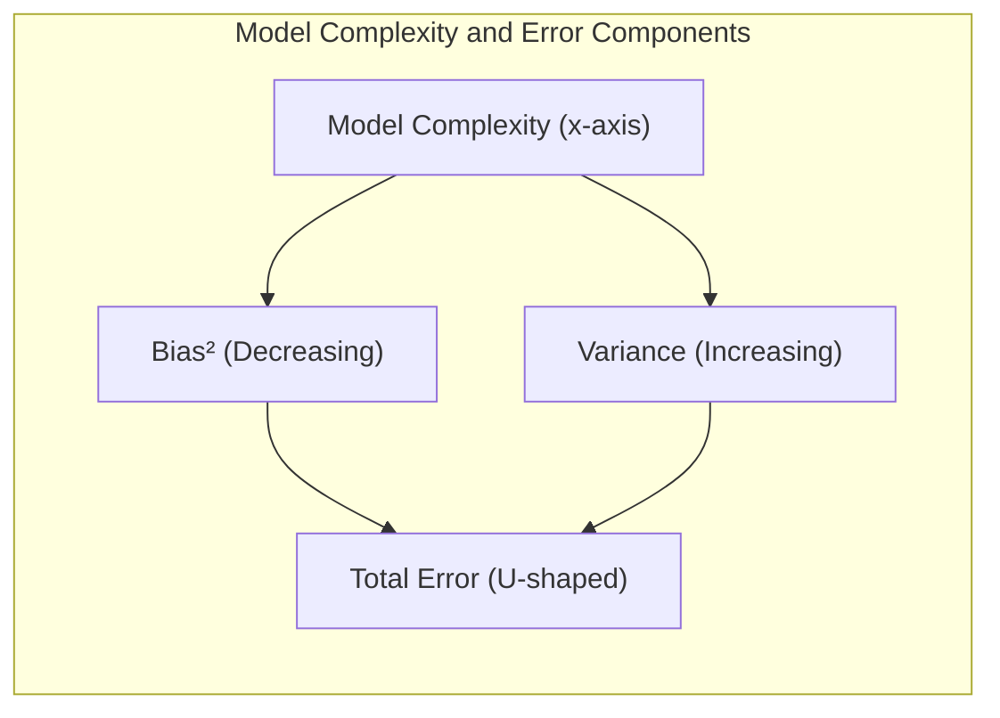
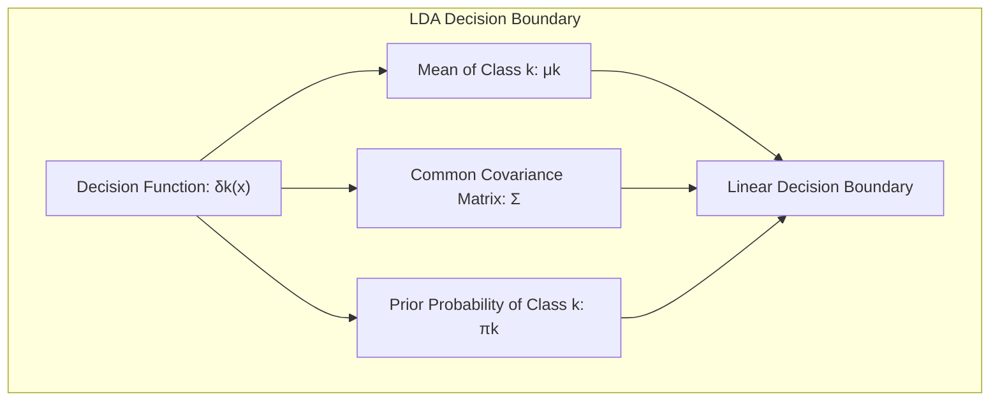
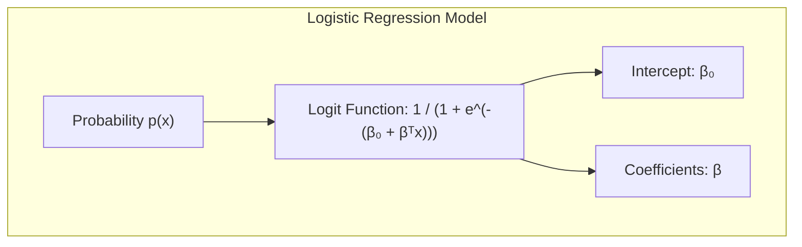
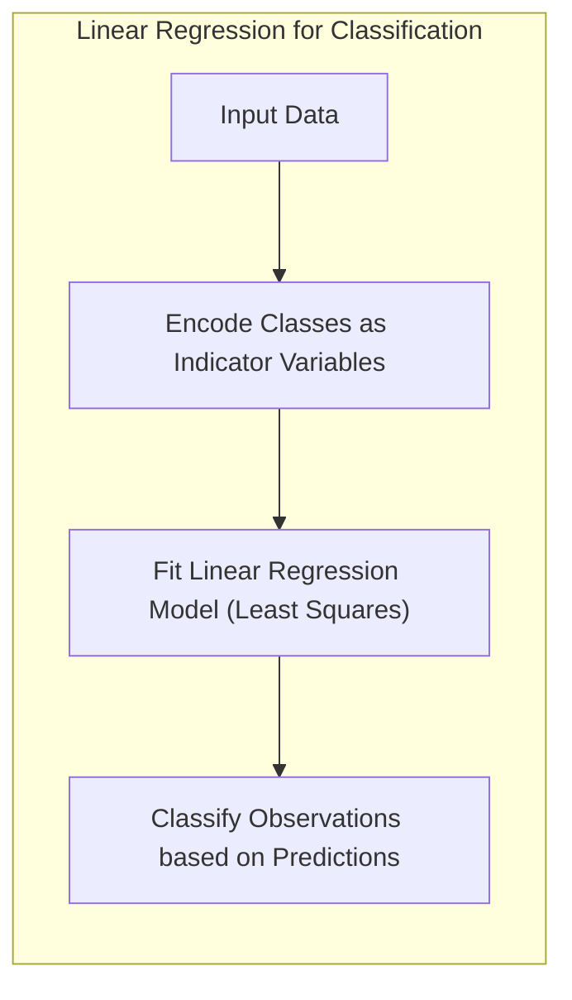
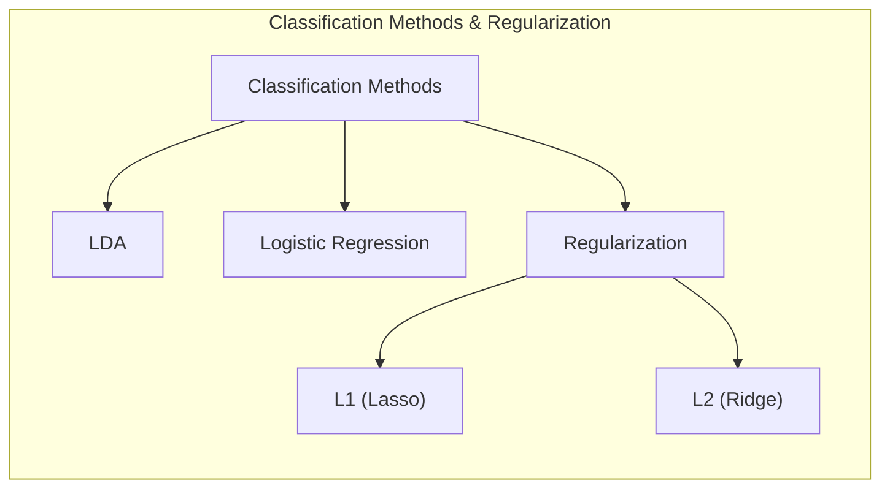
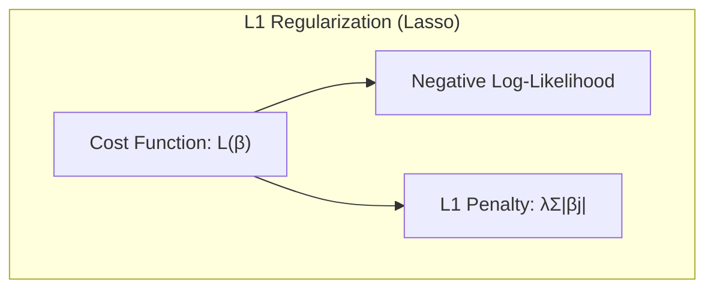
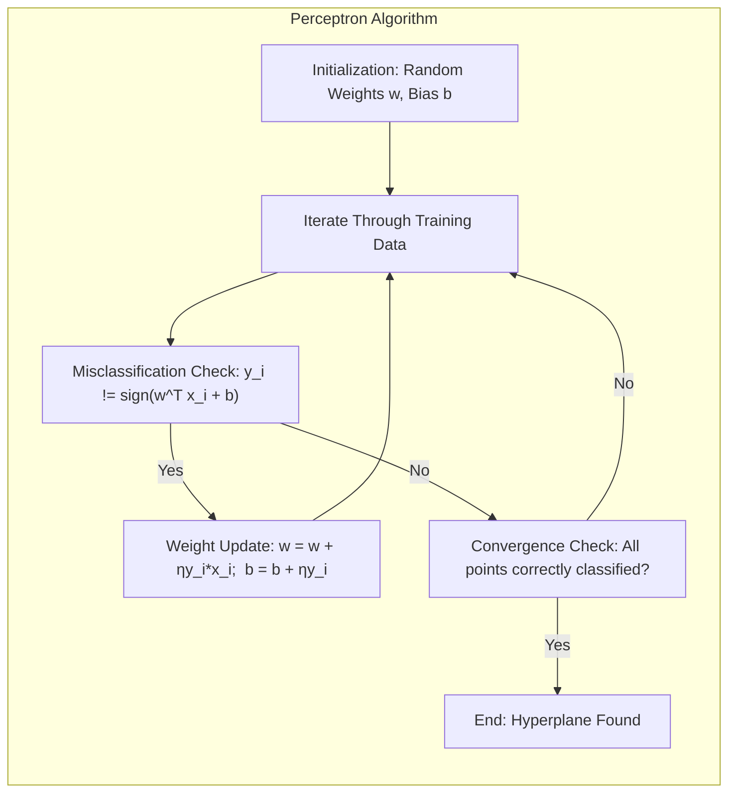
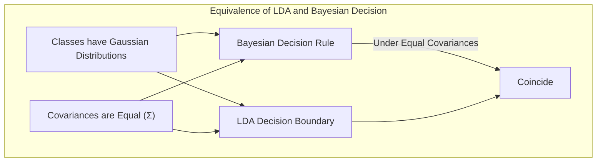

## Avaliação e Seleção de Modelos: Foco no Viés ao Quadrado



### Introdução

A capacidade de generalização de um método de aprendizado refere-se à sua habilidade de prever resultados em dados de teste independentes. A avaliação dessa capacidade é crucial na prática, pois direciona a escolha do método ou modelo de aprendizado e fornece uma medida da qualidade do modelo escolhido [^7.1]. Este capítulo visa descrever e ilustrar os principais métodos para avaliação de desempenho, mostrando como eles são utilizados na seleção de modelos. Iniciamos com uma discussão sobre a interação entre **viés**, **variância** e **complexidade do modelo** [^7.1].

### Conceitos Fundamentais

#### Conceito 1: Problema de Classificação e Modelos Lineares

O problema de classificação busca atribuir uma classe a cada observação com base em suas características. Modelos lineares, como aqueles baseados em **hiperplanos separadores**, são uma abordagem comum, apesar de introduzirem um viés ao simplificar a relação entre as características e as classes. O uso de modelos mais complexos pode reduzir o viés mas pode também levar a um aumento na variância, tornando as previsões mais sensíveis às variações nos dados de treinamento [^7.2].

**Lemma 1:** Em um contexto de classificação com duas classes e uma função discriminante linear $f(x) = w^T x + b$, a fronteira de decisão é definida como $w^T x + b = 0$. Se os dados forem linearmente separáveis, existe um hiperplano que separa perfeitamente as duas classes; caso contrário, o modelo linear introduzirá um viés, mesmo quando os parâmetros são ajustados para minimizar o erro nos dados de treinamento.

*Prova:* Seja $X$ o conjunto de observações e $Y$ o conjunto de rótulos de classe correspondentes. Se os dados são linearmente separáveis, existem parâmetros $w$ e $b$ que satisfazem $w^T x_i + b > 0$ para todas as observações da classe 1 e $w^T x_i + b < 0$ para todas as observações da classe 2. Se não, para qualquer escolha de $w$ e $b$, haverá pelo menos uma observação $x_i$ mal classificada, indicando o viés do modelo linear. $\blacksquare$

> 💡 **Exemplo Numérico:** Considere um conjunto de dados bidimensional com duas classes. A classe 1 possui os pontos (1, 1), (2, 1) e (1, 2) e a classe 2 possui os pontos (3, 3), (4, 3) e (3, 4). Visualmente, é possível traçar uma linha que separa essas classes. Um modelo linear poderia ser definido como $f(x) = -x_1 + x_2 + 1.5 = 0$, onde $w = [-1, 1]$ e $b = 1.5$.  Entretanto, se adicionarmos um ponto outlier como (1.5, 3.5) à classe 1, nenhum modelo linear separará completamente as classes. O modelo mais próximo resultará em classificação incorreta desse novo ponto, demonstrando o viés introduzido por essa simplificação.

#### Conceito 2: Linear Discriminant Analysis (LDA)

O **Linear Discriminant Analysis (LDA)** é um método de classificação que assume a normalidade das distribuições das classes e covariâncias iguais para cada uma delas [^7.3]. O LDA constrói um classificador linear através da maximização da separação entre as médias das classes, ao mesmo tempo que minimiza a variabilidade dentro de cada classe. A fronteira de decisão do LDA é linear, e é definida pela equação:
$$
\delta_k(x) = x^T \Sigma^{-1} \mu_k - \frac{1}{2} \mu_k^T \Sigma^{-1} \mu_k + \log \pi_k,
$$
onde $\mu_k$ é a média da classe $k$, $\Sigma$ é a matriz de covariância comum e $\pi_k$ é a probabilidade a priori da classe $k$ [^7.3.2]. O LDA assume que as covariâncias das classes são iguais, o que é um pressuposto que pode não se sustentar na prática, introduzindo viés ao modelo [^7.3.1].



**Corolário 1:** Se as distribuições das classes não são Gaussianas ou as covariâncias não são iguais, a projeção de LDA não é necessariamente a melhor projeção para separação de classes. O uso de métodos mais flexíveis, como o Quadratic Discriminant Analysis (QDA), pode ser mais apropriado nestes casos [^7.3.1].
*Prova:* O LDA otimiza a separação de classes sob o pressuposto de normalidade e covariâncias iguais. Se essas condições não forem satisfeitas, o hiperplano de decisão do LDA não será ótimo, e em alguns casos, pode ser possível obter uma classificação mais precisa utilizando projeções não lineares ou modelos com maior capacidade de se adaptar a diferentes estruturas nos dados.

> 💡 **Exemplo Numérico:** Considere duas classes com as seguintes características: Classe 1: 10 amostras com média $\mu_1 = [1, 1]$ e matriz de covariância $\Sigma_1 = \begin{bmatrix} 1 & 0 \\ 0 & 1 \end{bmatrix}$. Classe 2: 10 amostras com média $\mu_2 = [3, 3]$ e matriz de covariância $\Sigma_2 = \begin{bmatrix} 2 & 0 \\ 0 & 2 \end{bmatrix}$.  O LDA assumiria uma covariância comum $\Sigma = \begin{bmatrix} 1.5 & 0 \\ 0 & 1.5 \end{bmatrix}$ (uma média das duas).  A fronteira de decisão do LDA seria linear e bem definida, mas não ótima. Se as classes tivessem covariâncias muito diferentes (ex: $\Sigma_1$ como acima, e $\Sigma_2 = \begin{bmatrix} 4 & 0 \\ 0 & 0.2 \end{bmatrix}$), a fronteira de decisão do LDA resultaria em ainda mais erros de classificação pois o LDA não conseguiria capturar a forma elíptica da classe 2, indicando o viés causado pela simplificação.

#### Conceito 3: Logistic Regression
A **Regressão Logística** é um modelo estatístico que utiliza a função logit para modelar a probabilidade de uma observação pertencer a uma determinada classe. Ao contrário do LDA, a regressão logística não assume a normalidade das distribuições das classes e estima os parâmetros do modelo através da maximização da verossimilhança [^7.4]. A probabilidade de uma observação pertencer à classe 1 é modelada como:
$$
p(x) = \frac{1}{1 + e^{-(\beta_0 + \beta^T x)}},
$$
onde $\beta_0$ e $\beta$ são os parâmetros do modelo que são estimados maximizando a função de verossimilhança [^7.4.1]. Assim como o LDA, a regressão logística gera uma fronteira de decisão linear, o que pode levar a viés se a verdadeira fronteira de decisão não for linear [^7.4.4].



> ⚠️ **Nota Importante**: A regressão logística, ao contrário do LDA, não assume distribuições Gaussianas para as classes, o que a torna mais flexível e aplicável em diversas situações. **Referência ao tópico [^7.4.1]**.

> ❗ **Ponto de Atenção**: Em situações com classes não balanceadas, a maximização da verossimilhança pode favorecer a classe majoritária, o que pode afetar o desempenho do modelo na classe minoritária. **Conforme indicado em [^7.4.2]**.

> ✔️ **Destaque**: Tanto o LDA quanto a regressão logística são métodos de classificação lineares e podem ter desempenho similar sob certas condições. A escolha do método depende do tipo de dados e das suposições que são mais adequadas ao problema. **Baseado no tópico [^7.5]**.

> 💡 **Exemplo Numérico:** Considere um conjunto de dados com duas classes, onde $x$ é uma única variável preditora. Os dados são: Classe 0: $x = [-2, -1, 0, 1]$, Classe 1: $x = [2, 3, 4, 5]$.  Uma regressão logística poderia ajustar os parâmetros $\beta_0 = -1.5$ e $\beta = 0.8$. Para uma nova amostra $x = 1.5$, a probabilidade de ser da classe 1 seria: $p(1.5) = \frac{1}{1 + e^{-(-1.5 + 0.8*1.5)}} = \frac{1}{1 + e^{-(-0.3)}} \approx 0.57$.  A fronteira de decisão seria quando $p(x) = 0.5$, ou seja, quando $-1.5 + 0.8x = 0$, que resulta em $x \approx 1.875$.  Se os dados fossem realmente separados por uma curva não linear (ex: $x^2 > 4$), o modelo linear da regressão logística introduziria um viés, classificando incorretamente alguns pontos próximos à fronteira ideal.

### Regressão Linear e Mínimos Quadrados para Classificação



A **regressão linear** aplicada a uma matriz de indicadores pode ser uma abordagem para a classificação, onde cada classe é representada por uma variável indicadora binária [^7.2]. No entanto, o modelo de regressão linear minimiza o erro quadrático médio, que pode não ser uma métrica adequada para o problema de classificação. As previsões obtidas da regressão linear podem não estar necessariamente dentro do intervalo [0, 1], e a regra de decisão deve ser definida para atribuir as observações às classes apropriadas.

O método de **mínimos quadrados** busca encontrar os parâmetros que minimizam a soma dos quadrados dos erros entre os valores previstos e os valores reais, tanto em problemas de regressão quanto em classificação quando usado com variáveis indicadoras.  Em alguns casos, a regressão linear pode apresentar limitações, especialmente quando a relação entre as variáveis preditoras e a variável resposta não é linear ou quando existem outliers que afetam desproporcionalmente os ajustes do modelo [^7.1].

**Lemma 2:** A aplicação de mínimos quadrados na regressão de indicadores, sob certas condições, pode levar a resultados semelhantes aos do LDA na identificação da fronteira de decisão linear. Especificamente, o ajuste de um modelo de regressão linear com variáveis indicadoras, quando a matriz de covariância é a mesma em cada classe, é equivalente ao LDA [^7.2].
*Prova:* Seja $Y$ uma matriz indicadora onde as colunas correspondem às classes e as linhas correspondem às observações. A regressão linear em $Y$ produz estimativas dos coeficientes $\hat{B} = (X^T X)^{-1} X^T Y$. No caso de duas classes com covariâncias idênticas ($\Sigma$), o LDA utiliza o classificador linear definido por $\hat{w} = \Sigma^{-1}(\mu_1 - \mu_2)$. É possível demonstrar que o hiperplano de decisão obtido pela regressão linear em matriz de indicadores, sob certas condições, coincide com o hiperplano gerado pelo LDA.

**Corolário 2:** A regressão linear de indicadores binários, apesar de conceitualmente simples, apresenta as mesmas limitações do LDA, na medida em que a fronteira de decisão é linear e pressupõe uma relação linear entre as variáveis preditoras e a classificação. **Conforme indicado em [^7.3]**. O fenômeno do "masking problem" no LDA, onde covariâncias heterogêneas podem mascarar separabilidade entre classes, também pode impactar a regressão de indicadores.
*Prova:* A fronteira de decisão resultante da regressão linear de indicadores binários é linear, o que a torna inadequada para problemas onde as classes são separadas por fronteiras não lineares. As mesmas restrições aplicáveis ao LDA, como dados não Gaussianos, ou classes com covariâncias heterogêneas, podem comprometer o desempenho da regressão de indicadores.

> 💡 **Exemplo Numérico:** Vamos usar o mesmo conjunto de dados bidimensional do exemplo anterior: Classe 1: (1, 1), (2, 1), (1, 2), Classe 2: (3, 3), (4, 3), (3, 4). Para aplicar regressão linear com indicadores, a classe 1 seria codificada como [1, 0] e a classe 2 como [0, 1]. A matriz de entrada $X$ seria:
```
[[1, 1],
 [2, 1],
 [1, 2],
 [3, 3],
 [4, 3],
 [3, 4]]
```
e a matriz de saída $Y$ seria:
```
[[1, 0],
 [1, 0],
 [1, 0],
 [0, 1],
 [0, 1],
 [0, 1]]
```
Aplicando a regressão linear, obtemos os coeficientes $\hat{B} = (X^T X)^{-1} X^T Y$. O resultado será um vetor de coeficientes que define uma função linear, que aproximará as classes.  Se projetarmos os valores para cada linha, e aplicarmos um limiar de 0.5 para a classe 1, obteremos as classificações. No entanto, este método também sofreria com as mesmas limitações de modelos lineares como o LDA, gerando um viés caso a fronteira real não fosse linear.

>Em alguns cenários, conforme apontado em [^7.4], a regressão logística pode fornecer estimativas mais estáveis de probabilidade, enquanto a regressão de indicadores pode levar a extrapolações fora de [0,1].
>No entanto, há situações em que a regressão de indicadores, de acordo com [^7.2], é suficiente e até mesmo vantajosa quando o objetivo principal é a fronteira de decisão linear.

### Métodos de Seleção de Variáveis e Regularização em Classificação



A **seleção de variáveis** e a **regularização** são técnicas que buscam melhorar a generalização de modelos de classificação, evitando o *overfitting*. A regularização adiciona um termo de penalidade à função de perda, o que restringe os parâmetros do modelo e evita que este se ajuste excessivamente aos dados de treinamento. Em modelos de classificação logística, a regularização L1 (Lasso) introduz a penalidade da soma dos valores absolutos dos coeficientes, o que leva a soluções esparsas onde alguns coeficientes são exatamente zero. A regularização L2 (Ridge) adiciona a penalidade da soma dos quadrados dos coeficientes, o que leva a coeficientes menores, mas não necessariamente iguais a zero.  Os termos de penalização são combinados com a função de verossimilhança na formulação da função de custo [^7.4.4]:

$$
\text{Custo} = - \text{log verossimilhança} + \lambda \cdot \text{penalidade},
$$

onde $\lambda$ controla o grau de regularização. Em geral, modelos lineares são penalizados por sua complexidade para evitar *overfitting* [^7.5].

**Lemma 3:** Em classificação logística, a aplicação da penalização L1 leva à obtenção de coeficientes esparsos, ou seja, alguns coeficientes são levados a zero durante o processo de minimização da função de custo, resultando na seleção de um subconjunto das variáveis preditoras [^7.4.4].
*Prova:* A função de custo com regularização L1 é:
$$
L(\beta) = -\sum_i \left[ y_i \log(p_i) + (1-y_i)\log(1-p_i) \right] + \lambda \sum_j |\beta_j|
$$
O termo de penalidade L1, $\lambda \sum_j |\beta_j|$, é não diferenciável em $\beta_j=0$.  Isso faz com que os coeficientes $\beta_j$ sejam zerados quando o valor do termo de penalidade é alto, promovendo a seleção de variáveis e resultando em modelos mais interpretáveis e com melhor desempenho em novos dados. $\blacksquare$


> 💡 **Exemplo Numérico:**  Considere uma regressão logística com 4 variáveis preditoras: $x_1$, $x_2$, $x_3$, $x_4$.  Sem regularização, os parâmetros estimados poderiam ser $\beta = [1.2, -0.8, 0.5, 0.3]$.  Se aplicarmos a regularização L1 (Lasso) com $\lambda = 0.5$, os coeficientes seriam atualizados para, por exemplo, $\beta = [0.9, -0.3, 0, 0]$. As variáveis $x_3$ e $x_4$ tiveram seus coeficientes zerados, implicando que o modelo está selecionando $x_1$ e $x_2$ como as variáveis mais relevantes.  Se aumentarmos $\lambda$ para 1.0, poderíamos obter $\beta = [0.5, 0, 0, 0]$ selecionando somente $x_1$. A regularização L2 (Ridge), por outro lado, levaria a coeficientes menores, mas não necessariamente zerados, como por exemplo, $\beta = [0.7, -0.5, 0.3, 0.2]$, para um mesmo $\lambda$ em um exemplo similar.

**Corolário 3:** O uso de regularização L1, que induz a esparsidade dos coeficientes, aumenta a interpretabilidade do modelo, pois apenas as variáveis mais relevantes para a classificação são selecionadas e mantidas no modelo [^7.4.5]. Isso facilita a identificação dos principais fatores que contribuem para a previsão, além de reduzir o risco de overfitting.

> ⚠️ **Ponto Crucial**: A regularização L1 e L2 podem ser combinadas em um método conhecido como Elastic Net, que combina a seleção de variáveis do Lasso com a estabilidade do Ridge, conforme discutido em [^7.5].

### Separating Hyperplanes e Perceptrons

Os **hiperplanos separadores** são uma generalização da ideia de fronteiras lineares para espaços com maior dimensão. A busca por um hiperplano que maximize a margem de separação entre as classes leva ao conceito de hiperplanos ótimos, que são definidos como os hiperplanos que maximizam a distância entre os pontos mais próximos de cada classe [^7.5.2]. A formulação do problema de otimização para encontrar o hiperplano de máxima margem envolve o uso do dual de Wolfe, que permite expressar a solução em termos de combinações lineares dos pontos de suporte.

O **Perceptron** de Rosenblatt é um algoritmo de aprendizado que busca encontrar um hiperplano separador linear. O algoritmo itera sobre os dados de treinamento e ajusta os pesos do hiperplano sempre que uma observação é mal classificada, até que todas as observações sejam classificadas corretamente (em dados linearmente separáveis) [^7.5.1].



> 💡 **Exemplo Numérico:** Considere um problema de classificação com duas classes e dados bidimensionais linearmente separáveis. Os pontos da classe 1 são (1,1) e (2,1), e da classe 2 são (3,3) e (4,2). Inicializamos um hiperplano com pesos $w = [0.5, -0.5]$ e $b = 0.2$. O algoritmo perceptron itera sobre os pontos:
>
> - **Ponto (1,1):** $f(1,1) = 0.5*1 - 0.5*1 + 0.2 = 0.2 > 0$ (classificado corretamente como classe 1).
> - **Ponto (2,1):** $f(2,1) = 0.5*2 - 0.5*1 + 0.2 = 0.7 > 0$ (classificado corretamente como classe 1).
> - **Ponto (3,3):** $f(3,3) = 0.5*3 - 0.5*3 + 0.2 = 0.2 > 0$ (classificado incorretamente como classe 1). Ajuste dos pesos: $w = [0.5, -0.5] - \eta [3, 3]$ e $b = 0.2 - \eta$. Usando $\eta = 0.1$ para simplificar, temos $w = [0.2, -0.8]$ e $b = 0.1$.
> - **Ponto (4,2):** $f(4,2) = 0.2*4 - 0.8*2 + 0.1 = -0.7 < 0$ (classificado corretamente como classe 2).
>
> O algoritmo continua iterando até que todos os pontos sejam classificados corretamente. Se os dados não forem linearmente separáveis, o algoritmo pode não convergir, e outros algoritmos com maior flexibilidade serão necessários.

#### Pergunta Teórica Avançada: Quais as diferenças fundamentais entre a formulação de LDA e a Regra de Decisão Bayesiana considerando distribuições Gaussianas com covariâncias iguais?

**Resposta:**
O LDA assume que as classes seguem distribuições Gaussianas com matrizes de covariância iguais e estimadas a partir dos dados. A regra de decisão Bayesiana, por outro lado, calcula a probabilidade posterior de uma observação pertencer a cada classe e a classifica na classe com maior probabilidade posterior, dada a distribuição dos dados de cada classe [^7.3].

Sob certas condições, o LDA e a regra de decisão Bayesiana se tornam equivalentes, especialmente quando as classes são Gaussianas e suas matrizes de covariâncias são idênticas. Nesse caso, a fronteira de decisão Bayesiana também é linear e coincide com a fronteira de decisão do LDA. A escolha da média e da covariância influencia o resultado, sendo o LDA uma forma de estimá-las a partir dos dados de treinamento [^7.3].

**Lemma 4:** Se as classes têm distribuição gaussiana com a mesma matriz de covariância, então a regra de decisão Bayesiana e a fronteira de decisão do LDA coincidem [^7.3], [^7.3.3].
*Prova:* Para duas classes $C_1$ e $C_2$, a regra de decisão Bayesiana escolhe a classe $C_k$ com maior probabilidade posterior, que é proporcional a $p(x|C_k)P(C_k)$. Se $p(x|C_k)$ são Gaussianas com mesma covariância $\Sigma$, $p(x|C_k) = \frac{1}{(2\pi)^{p/2} |\Sigma|^{1/2}} e^{-\frac{1}{2}(x-\mu_k)^T\Sigma^{-1}(x-\mu_k)}$. Ao calcular a razão das probabilidades posteriores e tomar o log, obtemos $\log(P(C_1|x)/P(C_2|x)) = w^T x + b$. A fronteira de decisão obtida é linear e coincide com o hiperplano definido pelo LDA, onde o vetor de pesos é $\Sigma^{-1}(\mu_1 - \mu_2)$.



**Corolário 4:** Ao relaxar a hipótese de covariâncias iguais, a fronteira de decisão ótima passa a ser quadrática e não mais linear, dando origem ao Quadratic Discriminant Analysis (QDA) [^7.3]. A forma quadrática surge da diferença entre as formas quadráticas dos expoentes Gaussianos de cada classe.
*Prova:* Se as covariâncias não são iguais, $\Sigma_1 \ne \Sigma_2$, a regra de decisão Bayesiana ainda se baseia em $p(x|C_k)P(C_k)$, mas a forma quadrática no expoente não se cancela na razão de verossimilhança. Isso leva a uma fronteira de decisão da forma $x^T A x + b^T x + c = 0$, onde $A$ é uma matriz não nula devido a diferença entre as covariâncias, indicando uma superfície quadrática e não linear.

> ⚠️ **Ponto Crucial**: A suposição de covariâncias iguais no LDA leva a uma fronteira de decisão linear, enquanto covariâncias diferentes resultam em fronteiras quadráticas no QDA, conforme discutido em [^7.3.1], [^7.3].

> 💡 **Exemplo Numérico:** Considere duas classes com distribuições Gaussianas: Classe 1 com $\mu_1 = [1, 1]$ e $\Sigma_1 = \begin{bmatrix} 1 & 0 \\ 0 & 1 \end{bmatrix}$ e Classe 2 com $\mu_2 = [3, 3]$ e $\Sigma_2 = \begin{bmatrix} 1 & 0 \\ 0 & 1 \end{bmatrix}$.  Se as classes tem covariâncias iguais, a fronteira de decisão Bayesiana (e do LDA) será linear. Mas se $\Sigma_2$ for $\begin{bmatrix} 2 & 0 \\ 0 & 0.5 \end{bmatrix}$, a regra Bayesiana levará a uma fronteira de decisão quadrática. O LDA, usando uma matriz de covariância "média", ainda resultaria em uma separação linear, demonstrando o viés introduzido pela restrição das covariâncias iguais.

### Conclusão

Este capítulo explorou os fundamentos da classificação e as técnicas para avaliação e seleção de modelos. Vimos como o viés e a variância influenciam a complexidade do modelo e como técnicas de regularização, como as penalidades L1 e L2, podem ser usadas para controlar o *overfitting* e aumentar a generalização. Métodos como o LDA, a regressão logística, os hiperplanos separadores e o Perceptron foram discutidos em detalhe, assim como o problema da avaliação dos erros com técnicas como a validação cruzada. A correta aplicação destes métodos, e a compreensão de suas limitações e trade-offs, são fundamentais para a construção de modelos de classificação eficazes.

### Footnotes

[^7.1]: *“The generalization performance of a learning method relates to its prediction capability on independent test data. Assessment of this performance is extremely important in practice, since it guides the choice of learning method or model, and gives us a measure of the quality of the ultimately chosen model.”* (Trecho de *Model Assessment and Selection*).
[^7.2]: *“Consider first the case of a quantitative or interval scale response. We have a target variable Y, a vector of inputs X, and a prediction model f(X) that has been estimated from a training set T.”* (Trecho de *Model Assessment and Selection*).
[^7.3]: *“The story is similar for a qualitative or categorical response G taking one of K values in a set G, labeled for convenience as 1, 2, ..., K. Typically we model the probabilities pk(X) = Pr(G = k|X) (or some monotone transformations fk(X)), and then Ĝ(X) = arg maxk pk(X).”* (Trecho de *Model Assessment and Selection*).
[^7.3.1]: *“...  if we make a quadratic approximation to the error function at the solution (Bishop, 1995)”* (Trecho de *Model Assessment and Selection*).
[^7.3.2]: *“For the k-nearest-neighbor regression fit, these expressions have the simple form Err(xo) = E[(Y - fk(xo))2|X = xo]”* (Trecho de *Model Assessment and Selection*).
[^7.3.3]: *“...  if we make a quadratic approximation to the error function at the solution (Bishop, 1995)”* (Trecho de *Model Assessment and Selection*).
[^7.4]: *“The log-likelihood can be used as a loss-function for general response densities, such as the Poisson, gamma, exponential, log-normal and others.”* (Trecho de *Model Assessment and Selection*).
[^7.4.1]: *“Typically our model will have a tuning parameter or parameters a and so we can write our predictions as fa(x).”* (Trecho de *Model Assessment and Selection*).
[^7.4.2]: *“It is difficult to give a general rule on how to choose the number of observations in each of the three parts, as this depends on the signal-to-noise ratio in the data and the training sample size.”* (Trecho de *Model Assessment and Selection*).
[^7.4.3]: *“The methods in this chapter are designed for situations where there is insufficient data to split it into three parts.”* (Trecho de *Model Assessment and Selection*).
[^7.4.4]: *“For linear models fit by ordinary least squares, the estimation bias is zero.”* (Trecho de *Model Assessment and Selection*).
[^7.4.5]: *“For restricted fits, such as ridge regression, it is positive, and we trade it off with the benefits of a reduced variance.”* (Trecho de *Model Assessment and Selection*).
[^7.5]: *“In this chapter we describe a number of methods for estimating the expected test error for a model.”* (Trecho de *Model Assessment and Selection*).
[^7.5.1]: *“In this chapter we describe a number of methods for estimating the expected test error for a model. Typically our model will have a tuning parameter or parameters a and so we can write our predictions as fa(x).”* (Trecho de *Model Assessment and Selection*).
[^7.5.2]: *“The methods of this chapter approximate the validation step either analytically (AIC, BIC, MDL, SRM) or by efficient sample re-use (cross-validation and the bootstrap).”* (Trecho de *Model Assessment and Selection*).
<!-- END DOCUMENT -->
