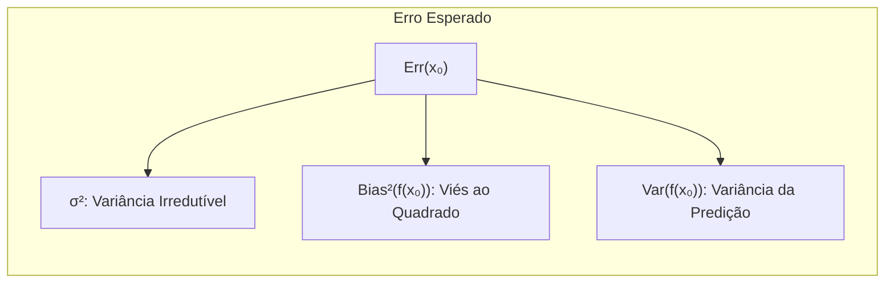
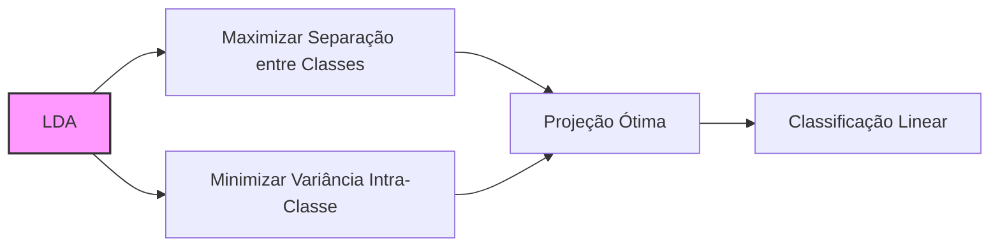
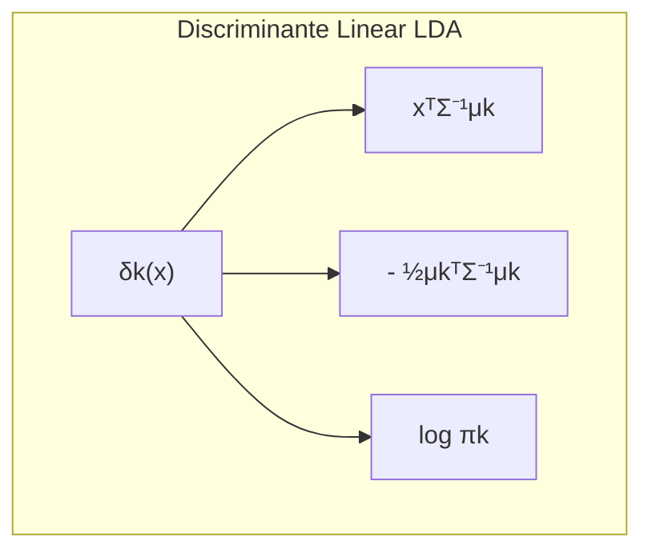
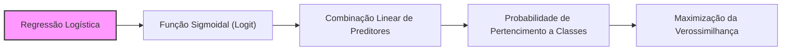
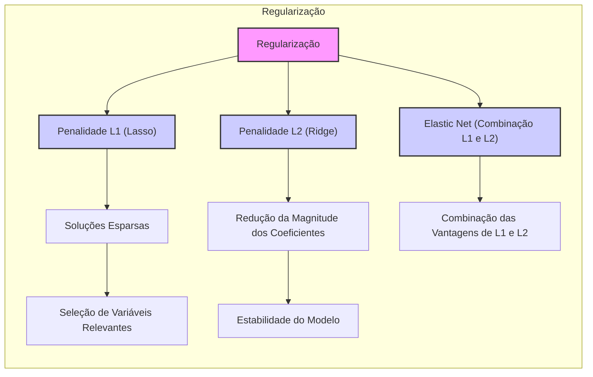
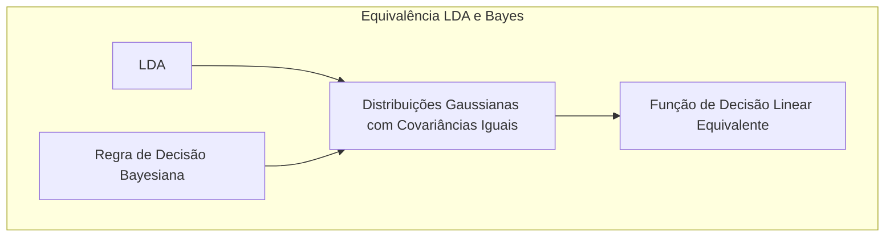

## Avaliação e Seleção de Modelos: O Impacto da Variância


### Introdução
A capacidade de um método de aprendizado generalizar, ou seja, prever com precisão em dados de teste independentes, é fundamental na prática [^7.1]. A avaliação desse desempenho orienta a escolha do método ou modelo de aprendizado, fornecendo uma medida da qualidade do modelo selecionado. Este capítulo aborda os principais métodos para avaliar o desempenho de modelos, mostrando como eles são usados para a seleção de modelos e discute a interação entre **viés**, **variância** e complexidade do modelo [^7.1].

### Conceitos Fundamentais

**Conceito 1: Generalização e Erro de Predição**

O objetivo central do aprendizado estatístico é criar modelos que generalizem bem, ou seja, que não apenas se ajustem aos dados de treinamento, mas também façam previsões precisas em novos dados. A **generalização** é a capacidade de um modelo aplicar o conhecimento adquirido em dados de treinamento a dados desconhecidos [^7.1]. O **erro de predição** mede a discrepância entre as previsões do modelo e os valores reais, sendo uma métrica crucial para avaliar essa generalização [^7.2]. Métodos lineares, apesar de sua simplicidade, podem ser eficazes em muitos cenários, mas podem apresentar um compromisso entre **viés** (a tendência de um modelo de prever incorretamente devido a simplificações excessivas) e **variância** (a sensibilidade do modelo a pequenas variações nos dados de treinamento) [^7.2].

**Lemma 1:** A função de perda para o erro quadrático, utilizada na avaliação do desempenho do modelo, pode ser decomposta em termos de **viés** e **variância**. Essa decomposição fornece insights sobre as fontes de erros de predição [^7.3]. Formalmente, para uma resposta quantitativa $Y$ e uma predição $f(X)$, a perda por erro quadrático é dada por:

$$
L(Y, f(X)) = (Y - f(X))^2
$$

E o erro esperado pode ser decomposto como:

$$
Err(x_0) = \sigma^2 + [Ef(x_0) - f(x_0)]^2 + E[f(x_0) - Ef(x_0)]^2 = \sigma^2 + Bias^2(f(x_0)) + Var(f(x_0))
$$

Onde $\sigma^2$ representa a variância do ruído irredutível, o segundo termo o viés ao quadrado, e o terceiro a variância da predição. $\blacksquare$



> 💡 **Exemplo Numérico:**
>
> Vamos considerar um cenário simples de regressão onde o modelo verdadeiro é $y = 2x + 3 + \epsilon$, com $\epsilon \sim \mathcal{N}(0, 1)$. Suponha que temos um conjunto de treinamento com 5 pontos e queremos avaliar dois modelos: um modelo linear $f_1(x) = \hat{\beta}_1 x + \hat{\beta}_0$ e um modelo constante $f_2(x) = \hat{\gamma}$.
>
>  ```python
>  import numpy as np
>  import matplotlib.pyplot as plt
>  from sklearn.linear_model import LinearRegression
>
>  # Dados de treinamento
>  np.random.seed(42)
>  x_train = np.sort(np.random.rand(5) * 10)
>  y_train = 2 * x_train + 3 + np.random.normal(0, 1, 5)
>
>  # Modelo linear
>  X_train = x_train.reshape(-1, 1)
>  model_linear = LinearRegression()
>  model_linear.fit(X_train, y_train)
>  y_pred_linear = model_linear.predict(X_train)
>
>  # Modelo constante
>  y_pred_const = np.mean(y_train) * np.ones_like(x_train)
>
>  # Visualização dos resultados
>  plt.figure(figsize=(8, 6))
>  plt.scatter(x_train, y_train, label='Dados de treinamento')
>  plt.plot(x_train, y_pred_linear, label='Regressão Linear', color='red')
>  plt.plot(x_train, y_pred_const, label='Modelo Constante', color='green')
>  plt.xlabel('x')
>  plt.ylabel('y')
>  plt.legend()
>  plt.title('Comparação de Modelos')
>  plt.show()
>
>  # Avaliação do viés e variância (aproximada)
>  x0 = 5
>  y_true = 2*x0 + 3
>  # Calcula a variância das predições do modelo linear em um novo conjunto de dados
>  n_samples = 100
>  y_preds_linear_x0 = np.zeros(n_samples)
>  y_preds_const_x0 = np.zeros(n_samples)
>  for i in range(n_samples):
>     x_train_new = np.sort(np.random.rand(5) * 10)
>     y_train_new = 2 * x_train_new + 3 + np.random.normal(0, 1, 5)
>
>     X_train_new = x_train_new.reshape(-1, 1)
>     model_linear_new = LinearRegression()
>     model_linear_new.fit(X_train_new, y_train_new)
>     y_preds_linear_x0[i] = model_linear_new.predict(np.array([[x0]]))[0]
>     y_preds_const_x0[i] = np.mean(y_train_new)
>
>  bias_linear = np.mean(y_preds_linear_x0) - y_true
>  var_linear = np.var(y_preds_linear_x0)
>
>  bias_const = np.mean(y_preds_const_x0) - y_true
>  var_const = np.var(y_preds_const_x0)
>
>  print(f'Viés do Modelo Linear: {bias_linear:.3f}')
>  print(f'Variância do Modelo Linear: {var_linear:.3f}')
>  print(f'Viés do Modelo Constante: {bias_const:.3f}')
>  print(f'Variância do Modelo Constante: {var_const:.3f}')
>  ```
>
>  O modelo linear tem um viés menor, pois consegue capturar a relação linear entre x e y. Em contrapartida, o modelo constante possui um viés maior, já que não consegue capturar a relação entre as variáveis, mas possui uma variância menor, já que a predição é constante.

**Conceito 2: Linear Discriminant Analysis (LDA)**

A **Linear Discriminant Analysis (LDA)** é um método de classificação que assume que as classes são bem separadas por hiperplanos lineares. A LDA utiliza a análise de variância para encontrar uma projeção que maximize a separação entre as classes, ao mesmo tempo em que minimiza a variância dentro de cada classe [^7.3]. As suposições de normalidade e igualdade de covariância entre as classes simplificam o problema, transformando-o em uma análise de variância, onde as classes são separadas usando a razão de variância entre as classes pela variância dentro das classes. A LDA é influenciada pelas distribuições dos dados, o que pode levar a problemas se essas distribuições não forem gaussianas ou tiverem covariâncias muito diferentes.



**Corolário 1:** No contexto da LDA, se as classes seguirem distribuições gaussianas com as mesmas matrizes de covariância, a função discriminante linear pode ser derivada do Teorema de Bayes e da função de densidade gaussiana. Essa derivação conecta a LDA com a estrutura teórica da classificação bayesiana [^7.3.1]. Especificamente, as fronteiras de decisão são determinadas onde as probabilidades a posteriori de uma observação pertencer a cada classe são iguais. Em tal caso, o discriminante linear é dado por $ \delta_k(x) = x^T\Sigma^{-1}\mu_k - \frac{1}{2}\mu_k^T \Sigma^{-1} \mu_k + \log\pi_k $, onde $\mu_k$ é a média da classe $k$, $\Sigma$ é a matriz de covariância comum, e $\pi_k$ é a probabilidade a priori da classe $k$ [^7.3.1]. $\blacksquare$



> 💡 **Exemplo Numérico:**
>
> Suponha que temos duas classes de dados bidimensionais, cada uma seguindo uma distribuição gaussiana com a mesma matriz de covariância.
>
>  ```python
>  import numpy as np
>  import matplotlib.pyplot as plt
>  from sklearn.discriminant_analysis import LinearDiscriminantAnalysis
>
>  # Dados para duas classes
>  np.random.seed(42)
>  mean1 = [2, 2]
>  mean2 = [5, 5]
>  cov = [[1, 0.5], [0.5, 1]]
>  X1 = np.random.multivariate_normal(mean1, cov, 100)
>  X2 = np.random.multivariate_normal(mean2, cov, 100)
>  X = np.vstack((X1, X2))
>  y = np.array([0] * 100 + [1] * 100)
>
>  # Aplicando LDA
>  lda = LinearDiscriminantAnalysis()
>  lda.fit(X, y)
>
>  # Criando uma grade para plotar as fronteiras de decisão
>  x_min, x_max = X[:, 0].min() - 1, X[:, 0].max() + 1
>  y_min, y_max = X[:, 1].min() - 1, X[:, 1].max() + 1
>  xx, yy = np.meshgrid(np.arange(x_min, x_max, 0.02),
>                     np.arange(y_min, y_max, 0.02))
>
>  Z = lda.predict(np.c_[xx.ravel(), yy.ravel()])
>  Z = Z.reshape(xx.shape)
>
>  # Plotando os resultados
>  plt.figure(figsize=(8, 6))
>  plt.contourf(xx, yy, Z, alpha=0.3)
>  plt.scatter(X[:, 0], X[:, 1], c=y, edgecolors='k')
>  plt.xlabel('Feature 1')
>  plt.ylabel('Feature 2')
>  plt.title('LDA para Separação de Classes')
>  plt.show()
>
>  # Exibindo os parâmetros do discriminante linear
>  print(f'Coeficientes do discriminante linear: {lda.coef_}')
>  print(f'Intercept do discriminante linear: {lda.intercept_}')
>  ```
>
> A saída do código mostra os coeficientes do hiperplano linear encontrado pela LDA.  O discriminante linear pode ser expresso como $\delta(x) = \text{coef}_1 \cdot x_1 + \text{coef}_2 \cdot x_2 + \text{intercept}$. Um novo ponto $x$ é classificado como pertencente à classe 1 se $\delta(x) > 0$ e à classe 0 caso contrário.  No gráfico, a região colorida mostra a separação entre as classes.

**Conceito 3: Regressão Logística**

A **Regressão Logística** é um método para modelar probabilidades de pertencimento a classes usando uma função sigmoidal (logit) aplicada a uma combinação linear dos preditores. Ao contrário da LDA, que assume distribuições gaussianas para as classes, a regressão logística modela diretamente a probabilidade de uma observação pertencer a uma classe específica [^7.4]. Isso torna a regressão logística mais flexível em relação às distribuições dos dados, embora ela também possa apresentar viés e variância dependendo da complexidade do modelo e dos dados. A maximização da verossimilhança é usada para estimar os parâmetros do modelo, ou seja, encontra os parâmetros que maximizam a probabilidade dos dados observados.



> ⚠️ **Nota Importante**:  A Regressão Logística modela a probabilidade de uma classe diretamente através da função sigmoide (logit), o que a torna uma alternativa mais flexível quando as suposições da LDA não se mantêm [^7.4.1].
> ❗ **Ponto de Atenção**: Em conjuntos de dados com classes não balanceadas, é importante ajustar a função de perda na regressão logística para evitar o viés do modelo para a classe majoritária. Isso pode ser feito atribuindo pesos maiores às observações da classe minoritária [^7.4.2].
> ✔️ **Destaque**: Tanto a LDA quanto a regressão logística podem resultar em classificadores lineares, mas suas abordagens são diferentes em relação às suposições sobre os dados e os métodos de estimativa de parâmetros [^7.5].

> 💡 **Exemplo Numérico:**
>
> Vamos aplicar a regressão logística em um problema de classificação binária com duas variáveis preditoras.
>
>  ```python
>  import numpy as np
>  import matplotlib.pyplot as plt
>  from sklearn.linear_model import LogisticRegression
>
>  # Dados de exemplo
>  np.random.seed(42)
>  X = np.random.rand(100, 2) * 10
>  y = (1 / (1 + np.exp(-(X[:, 0] - X[:, 1] + 2))) > 0.5).astype(int)
>
>  # Treinando o modelo de regressão logística
>  logistic_model = LogisticRegression()
>  logistic_model.fit(X, y)
>
>  # Criando uma grade para plotar as fronteiras de decisão
>  x_min, x_max = X[:, 0].min() - 1, X[:, 0].max() + 1
>  y_min, y_max = X[:, 1].min() - 1, X[:, 1].max() + 1
>  xx, yy = np.meshgrid(np.arange(x_min, x_max, 0.02),
>                     np.arange(y_min, y_max, 0.02))
>
>  Z = logistic_model.predict(np.c_[xx.ravel(), yy.ravel()])
>  Z = Z.reshape(xx.shape)
>
>  # Plotando os resultados
>  plt.figure(figsize=(8, 6))
>  plt.contourf(xx, yy, Z, alpha=0.3)
>  plt.scatter(X[:, 0], X[:, 1], c=y, edgecolors='k')
>  plt.xlabel('Feature 1')
>  plt.ylabel('Feature 2')
>  plt.title('Regressão Logística para Separação de Classes')
>  plt.show()
>
>  # Exibindo os coeficientes do modelo
>  print(f'Coeficientes: {logistic_model.coef_}')
>  print(f'Intercept: {logistic_model.intercept_}')
>  ```
>
>  O modelo ajustado pela regressão logística encontra um hiperplano linear que separa as classes, com os coeficientes indicando a importância de cada característica. A probabilidade de pertencimento à classe 1 é dada por:
>
>  $$
>  P(y=1 | x) = \frac{1}{1 + e^{-(\beta_0 + \beta_1 x_1 + \beta_2 x_2)}}
>  $$
>  Onde $\beta_0$ é o intercepto e $\beta_1$ e $\beta_2$ são os coeficientes para as duas variáveis preditoras $x_1$ e $x_2$.

### Regressão Linear e Mínimos Quadrados para Classificação


A regressão linear aplicada a uma **matriz de indicadores** pode ser usada para problemas de classificação. Nessa abordagem, cada classe é codificada como um vetor indicador, e a regressão linear é usada para prever esses vetores. A atribuição de classe é feita com base no vetor predito mais próximo dos vetores indicadores originais. Embora seja uma abordagem direta, a regressão de indicadores pode apresentar limitações, especialmente quando o número de classes é alto, e as probabilidades podem ser extrapoladas fora do intervalo [0, 1] [^7.1, 7.2]. O método dos mínimos quadrados é usado para encontrar os coeficientes que minimizam a soma dos erros quadráticos. O uso de métodos como a **regressão de indicadores** pode ser visto como uma forma de abordar o problema de classificação, em que um modelo linear é treinado para prever os indicadores de classe.

**Lemma 2:** Em condições de linearidade, a projeção dos dados no hiperplano de decisão, seja por regressão linear ou análise discriminante, pode ser equivalente, e a diferença reside principalmente na forma como os parâmetros são estimados e interpretados [^7.2, 7.3]. Formalmente, a regressão de indicadores pode ser vista como uma aproximação linear da função de decisão, que busca minimizar a soma dos erros quadráticos.

**Corolário 2:** Sob certas condições, a solução dos mínimos quadrados para a regressão de indicadores resulta em projeções semelhantes àquelas obtidas pela LDA, especialmente quando as classes são bem separadas [^7.3]. Essa equivalência pode simplificar a análise e otimização de modelos classificatórios lineares.

*Em cenários em que as classes são separadas, a regressão de indicadores pode oferecer resultados similares à LDA, porém sem a garantia de que as probabilidades estimadas sejam consistentes. Conforme mencionado em [^7.4], a regressão logística pode fornecer estimativas mais estáveis para tais probabilidades.*

> No entanto, existem situações em que a regressão de indicadores é suficiente para estabelecer uma fronteira de decisão linear [^7.2].

> 💡 **Exemplo Numérico:**
>
> Vamos demonstrar a regressão de indicadores para um problema de classificação com três classes.
>
> ```python
> import numpy as np
> from sklearn.linear_model import LinearRegression
> from sklearn.preprocessing import OneHotEncoder
>
> # Dados de exemplo (duas features e três classes)
> np.random.seed(42)
> X = np.random.rand(100, 2) * 10
> y = np.random.choice([0, 1, 2], size=100, p=[0.3, 0.4, 0.3])
>
> # Codificação das classes usando One-Hot Encoding
> encoder = OneHotEncoder(sparse_output=False)
> y_encoded = encoder.fit_transform(y.reshape(-1, 1))
>
> # Regressão linear para cada classe
> model = LinearRegression()
> model.fit(X, y_encoded)
>
> # Predição das classes para os dados de entrada
> y_pred_encoded = model.predict(X)
>
> # Decodificação das predições usando a classe com maior valor predito
> y_pred = np.argmax(y_pred_encoded, axis=1)
>
> # Calculando a acurácia
> accuracy = np.mean(y_pred == y)
>
> # Exibindo os resultados
> print(f"Acurácia: {accuracy:.3f}")
> print(f"Coeficientes do modelo: {model.coef_}")
> print(f"Intercept do modelo: {model.intercept_}")
>
> # Visualização dos resultados (simplificada para demonstração)
> import matplotlib.pyplot as plt
> plt.figure(figsize=(8, 6))
> plt.scatter(X[:, 0], X[:, 1], c=y_pred, edgecolors='k')
> plt.xlabel('Feature 1')
> plt.ylabel('Feature 2')
> plt.title('Regressão de Indicadores para Classificação Multiclasse')
> plt.show()
>
> ```
>
> Neste exemplo, cada classe é representada por um vetor binário único, e a regressão linear é usada para prever esses vetores. A classe predita é aquela com o maior valor predito entre todos os vetores. O modelo de regressão linear tenta modelar a relação entre as variáveis preditoras e a representação *one-hot* das classes. A acurácia reflete quão bem o modelo consegue prever a classe correta para os dados de treinamento.
>

### Métodos de Seleção de Variáveis e Regularização em Classificação



A seleção de variáveis e a regularização são técnicas essenciais para lidar com a complexidade de modelos de classificação. A regularização, especialmente via penalidades L1 e L2, impõe restrições aos coeficientes do modelo, controlando o risco de *overfitting* e promovendo modelos mais estáveis e interpretáveis [^7.4.4]. A penalidade L1 (Lasso) tende a gerar soluções esparsas, com muitos coeficientes iguais a zero, o que simplifica o modelo e ajuda a selecionar as variáveis mais relevantes. A penalidade L2 (Ridge) reduz a magnitude dos coeficientes, estabilizando o modelo e evitando que ele seja excessivamente influenciado por variáveis específicas [^7.5, 7.5.1]. A combinação de L1 e L2 (Elastic Net) pode ser utilizada para aproveitar as vantagens de ambas as técnicas [^7.5].

**Lemma 3:** A penalização L1 na regressão logística promove soluções esparsas, ou seja, muitos coeficientes são reduzidos a zero. Isso ocorre porque a penalização L1 é não-diferenciável em zero, levando a soluções onde alguns coeficientes são exatamente zero [^7.4.4].

**Prova do Lemma 3:**
A penalidade L1 adiciona um termo ao custo da função de perda que é proporcional à soma dos valores absolutos dos coeficientes, ou seja, $\lambda \sum_{j=1}^{p} |\beta_j|$. A minimização da função de perda com essa penalidade tende a levar alguns coeficientes a zero, enquanto a penalidade L2 apenas reduz a magnitude dos coeficientes, mas não necessariamente os anula [^7.4.4]. A penalização L1 é uma convex relaxation para a $l_0$ norm que diretamente força a esparsidade. Ao contrário da norma $l_2$, na norma $l_1$, o nível de contorno toca em $\beta_j=0$, resultando em parâmetros exatamente 0. $\blacksquare$


**Corolário 3:** A esparsidade induzida pela penalização L1 melhora a interpretabilidade do modelo, pois as variáveis com coeficientes zero são efetivamente removidas do modelo, deixando apenas as variáveis mais importantes. Modelos mais simples tendem a generalizar melhor, especialmente quando o número de variáveis é alto em relação ao número de observações [^7.4.5].

> ⚠️ **Ponto Crucial**: A escolha da regularização (L1, L2 ou Elastic Net) depende das características específicas do problema. L1 promove esparsidade, L2 reduz a magnitude dos coeficientes, e Elastic Net combina os benefícios de ambas [^7.5].

> 💡 **Exemplo Numérico:**
>
> Vamos comparar a aplicação de regularização L1 (Lasso) e L2 (Ridge) na regressão logística.
>
> ```python
> import numpy as np
> import matplotlib.pyplot as plt
> from sklearn.linear_model import LogisticRegression
> from sklearn.model_selection import train_test_split
> from sklearn.preprocessing import StandardScaler
>
> # Criando dados sintéticos
> np.random.seed(42)
> X = np.random.randn(100, 10)
> y = (1 / (1 + np.exp(-(X[:, 0] - X[:, 2] + 0.5*X[:, 5] + 2))) > 0.5).astype(int) # Apenas algumas features são relevantes
>
> # Padronização dos dados
> scaler = StandardScaler()
> X_scaled = scaler.fit_transform(X)
>
> # Dividindo em treino e teste
> X_train, X_test, y_train, y_test = train_test_split(X_scaled, y, test_size=0.3, random_state=42)
>
> # Modelo de regressão logística sem regularização
> logistic_model = LogisticRegression(penalty=None, solver='lbfgs')
> logistic_model.fit(X_train, y_train)
>
> # Modelo de regressão logística com regularização L1 (Lasso)
> logistic_model_l1 = LogisticRegression(penalty='l1', solver='liblinear', C=0.1)
> logistic_model_l1.fit(X_train, y_train)
>
> # Modelo de regressão logística com regularização L2 (Ridge)
> logistic_model_l2 = LogisticRegression(penalty='l2', solver='lbfgs', C=0.1)
> logistic_model_l2.fit(X_train, y_train)
>
> # Avaliação dos modelos
> accuracy_no_reg = logistic_model.score(X_test, y_test)
> accuracy_l1 = logistic_model_l1.score(X_test, y_test)
> accuracy_l2 = logistic_model_l2.score(X_test, y_test)
>
> # Exibindo os resultados
> print(f'Acurácia sem Regularização: {accuracy_no_reg:.3f}')
> print(f'Acurácia com Regularização L1 (Lasso): {accuracy_l1:.3f}')
> print(f'Acurácia com Regularização L2 (Ridge): {accuracy_l2:.3f}')
> print(f"Coeficientes sem regularização: {logistic_model.coef_}")
> print(f'Coeficientes com regularização L1: {logistic_model_l1.coef_}')
> print(f'Coeficientes com regularização L2: {logistic_model_l2.coef_}')
>
> # Visualização dos coeficientes
> labels = [f'feature {i+1}' for i in range(X.shape[1])]
>
> plt.figure(figsize=(10,6))
>
> plt.subplot(1, 3, 1)
> plt.bar(labels, logistic_model.coef_[0])
> plt.title('Sem Regularização')
>
> plt.subplot(1, 3, 2)
> plt.bar(labels, logistic_model_l1.coef_[0])
> plt.title('Regularização L1')
>
> plt.subplot(1, 3, 3)
> plt.bar(labels, logistic_model_l2.coef_[0])
> plt.title('Regularização L2')
>
> plt.tight_layout()
> plt.show()
> ```
>
>  O exemplo mostra como a regularização L1 zera alguns coeficientes (esparsidade), enquanto a regularização L2 reduz a magnitude de todos os coeficientes. A comparação das acurácias e dos coeficientes permite entender o impacto de cada tipo de regularização na complexidade e no desempenho do modelo.

### Separating Hyperplanes e Perceptrons

O conceito de hiperplanos separadores se baseia na ideia de maximizar a margem de separação entre as classes. Em problemas de classificação, o objetivo é encontrar o hiperplano que melhor separa as classes, minimizando a probabilidade de erro. Hiperplanos ótimos são aqueles que maximizam a distância (margem) entre o hiperplano e os pontos mais próximos de cada classe. A formulação desse problema envolve uma otimização, e a solução pode ser expressa em termos de uma combinação linear dos pontos de suporte. O Perceptron de Rosenblatt é um algoritmo de aprendizado que se adapta iterativamente para encontrar um hiperplano separador. Em condições de separabilidade linear, o Perceptron converge para um hiperplano que separa as classes corretamente [^7.5.1, 7.5.2].

### Pergunta Teórica Avançada: Quais as diferenças fundamentais entre a formulação de LDA e a Regra de Decisão Bayesiana considerando distribuições Gaussianas com covariâncias iguais?

**Resposta:**
A LDA e a regra de decisão Bayesiana, quando aplicadas a distribuições gaussianas com covariâncias iguais, buscam classificar os dados com base em probabilidades a posteriori. A LDA assume que as classes podem ser separadas por um hiperplano, derivando a fronteira de decisão diretamente dos parâmetros de cada classe (médias e covariâncias). O classificador Bayesiano, por outro lado, utiliza as probabilidades a priori das classes e as funções de densidade de probabilidade para cada classe, calculando a probabilidade a posteriori de uma amostra pertencer a uma classe específica. Sob a suposição de que as covariâncias são iguais e as distribuições são gaussianas, os limites de decisão se tornam lineares, tornando LDA e a regra de decisão Bayesiana equivalentes, o que indica que o LDA é uma particularização da regra de decisão Bayesiana sob essas condições [^7.3].

**Lemma 4:** Sob a suposição de que as classes seguem distribuições gaussianas com a mesma matriz de covariância $\Sigma$, a LDA e a regra de decisão Bayesiana levam à mesma função de decisão linear. Isto é, o discriminante linear obtido pela LDA é equivalente a tomar o log da razão das probabilidades a posteriori em um cenário Bayesiano [^7.3, 7.3.3].



**Corolário 4:** Se a hipótese de igualdade das covariâncias for relaxada, o classificador Bayesiano leva a limites de decisão quadráticos (QDA) e as fronteiras não são mais lineares. LDA é um caso especial de QDA sob o qual as covariâncias das classes são assumidas iguais [^7.3].

> ⚠️ **Ponto Crucial**: A escolha entre LDA e QDA depende das suposições sobre as covariâncias das classes. LDA é apropriada quando as covariâncias são semelhantes, enquanto QDA é mais flexível quando as covariâncias variam, embora mais suscetível a overfitting [^7.3.1, 7.3.3].

### Conclus