## Avaliação e Seleção de Modelos: Foco em Erro de Regressão K-NN

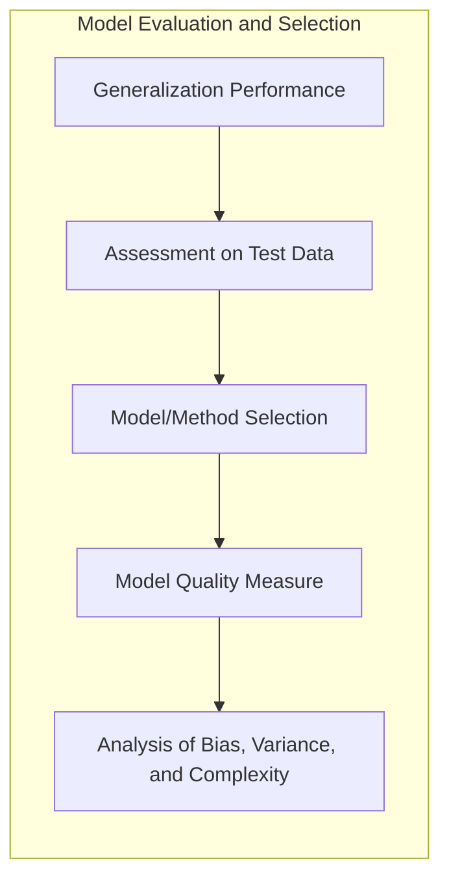

### Introdução
A capacidade de generalização de um método de aprendizado está intrinsecamente ligada à sua performance em dados de teste independentes. Avaliar essa performance é crucial na prática, pois orienta a seleção do método ou modelo de aprendizado e fornece uma medida da qualidade do modelo escolhido [^7.1]. Neste capítulo, exploramos os principais métodos para avaliação de desempenho e como eles são utilizados para a seleção de modelos. Iniciamos com uma análise da interação entre **bias**, **variance** e a complexidade do modelo, e como essas propriedades afetam o **erro de regressão k-NN** [^7.2].

### Conceitos Fundamentais

**Conceito 1: Generalização e Erro de Predição**

O problema de classificação, como o de regressão, busca criar modelos que prevejam valores de uma variável dependente (*Y*) com base em um conjunto de variáveis independentes (*X*). A capacidade de um modelo generalizar, isto é, de fazer previsões precisas em dados não vistos durante o treinamento, é um indicador fundamental de sua eficácia [^7.1]. Em regressão, o erro de predição é frequentemente quantificado usando funções de perda, como o erro quadrático médio (MSE) ou o erro absoluto médio [^7.2]. Modelos lineares, como os de regressão linear, têm seu bias e variância caracterizados pela sua estrutura, que pode ser limitada para se ajustar a padrões complexos nos dados, levando a um alto bias e baixa variância. Por outro lado, modelos não lineares podem se adaptar a ruídos no conjunto de dados de treinamento, levando a baixo bias, porém alta variância. A escolha do modelo ideal envolve um compromisso entre essas duas propriedades.

**Lemma 1:** *Relação entre Erro Esperado, Bias e Variância*

O erro de predição esperado de um modelo $f(X)$ em um ponto $x_0$ pode ser decomposto em três componentes: ruído irredutível ($\sigma^2$), o quadrado do bias e a variância do modelo [^7.3].
$$Err(x_0) = E[(Y - f(x_0))^2 | X = x_0] = \sigma^2 + [Ef(x_0) - f(x_0)]^2 + E[f(x_0) - Ef(x_0)]^2$$

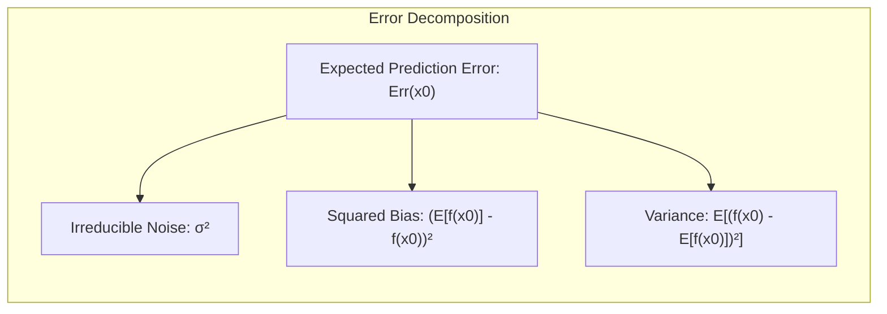

Essa formulação revela que o erro de generalização é afetado tanto pela capacidade do modelo de aproximar a função verdadeira quanto pela sua sensibilidade às variações nos dados de treinamento. O primeiro termo ($\sigma^2$) representa o ruído inerente aos dados, não influenciável pela escolha do modelo [^7.3]. Os outros dois termos representam, respectivamente, o bias (tendência) do modelo e sua variância, que pode ser minimizada com um bom controle da complexidade do modelo.

> 💡 **Exemplo Numérico:**
>
> Vamos supor que estamos modelando a relação entre o tamanho de uma casa (em metros quadrados) e seu preço (em reais). Imagine que a verdadeira relação é dada por $Y = 2000X + 50000 + \epsilon$, onde $\epsilon$ é um ruído aleatório com $\sigma^2 = 10000$.
>
> Temos um ponto de interesse $x_0 = 100$. O valor verdadeiro para este ponto seria $f(x_0) = 2000 * 100 + 50000 = 250000$. Vamos considerar dois modelos para exemplificar o trade-off bias-variância:
>
> *   **Modelo 1 (Alto Bias, Baixa Variância):** Um modelo linear simples $f_1(X) = 1500X + 70000$.  Nesse caso, $Ef_1(x_0) = 1500 * 100 + 70000 = 220000$. O bias seria  $[220000 - 250000]^2 = 900000000$. Assumimos que a variância desse modelo, devido à sua simplicidade, seja de $500$.
> *   **Modelo 2 (Baixo Bias, Alta Variância):** Um modelo complexo, que pode overfit, $f_2(X)$. Este modelo se ajusta muito bem aos dados de treino, resultando em $Ef_2(x_0) = 248000$, dando um bias de  $[248000 - 250000]^2 = 4000000$. No entanto, ele é muito sensível aos dados de treino e sua variância é de $15000$.
>
> O erro total para cada modelo em $x_0$ seria:
>
> *   Modelo 1: $Err_1(x_0) = 10000 + 900000000 + 500 = 900010500$
> *   Modelo 2: $Err_2(x_0) = 10000 + 4000000 + 15000 = 4025000$
>
> Neste exemplo, apesar do Modelo 2 ter um bias menor, sua alta variância resulta em um erro total maior do que o Modelo 1. Esse exemplo demonstra como o tradeoff entre bias e variância é crucial na escolha de um modelo. Um modelo com bias mais alto, mas menos sensível aos dados de treinamento (baixa variância), pode ter um erro total menor. O objetivo é encontrar o equilibrio que minimize o erro.

**Conceito 2: K-Nearest Neighbors (k-NN) Regression**

A regressão k-NN é um método não paramétrico que estima o valor de *Y* para um dado *X* como a média dos valores de *Y* dos *k* vizinhos mais próximos de *X* no espaço de atributos [^7.3].  A escolha do valor de *k* influencia diretamente o desempenho do modelo. Valores pequenos de *k* levam a um modelo com baixa bias (o modelo é altamente flexível e pode se ajustar bem aos dados de treinamento) mas alta variância (o modelo é muito sensível às variações nos dados de treinamento), podendo sofrer com overfitting. Valores grandes de *k* levam a um modelo com alto bias (o modelo torna-se menos sensível a mudanças nos dados e pode não se ajustar bem à função de regressão real) mas baixa variância. A escolha de *k* é uma forma de controlar a complexidade do modelo, e a complexidade do modelo se relaciona com o trade-off bias-variância [^7.2]. A melhor escolha de *k* busca um equilíbrio entre o ajuste aos dados e a capacidade de generalização [^7.3].

**Corolário 1:** *Erro de k-NN em Função da Complexidade*

O erro de um modelo k-NN ($Err(x_0)$) pode ser expresso como a soma do ruído irredutível ($\sigma^2$), o quadrado do bias e a variância da estimativa. Conforme *k* varia, a influência do bias e da variância no erro de predição muda. A expressão  [^7.3]:
 $$ Err(x_0) = \sigma^2 + [f(x_0) - \frac{1}{k}\sum_{l=1}^{k}f(x_i)]^2 + \frac{\sigma^2}{k} $$
 ilustra como para pequenos *k* o modelo pode se adaptar melhor ao $f(x)$ subjacente (menor bias) mas com alta variância devido a amostras com muito ruído e, inversamente,  para grandes *k* a variância diminui mas o bias pode aumentar.

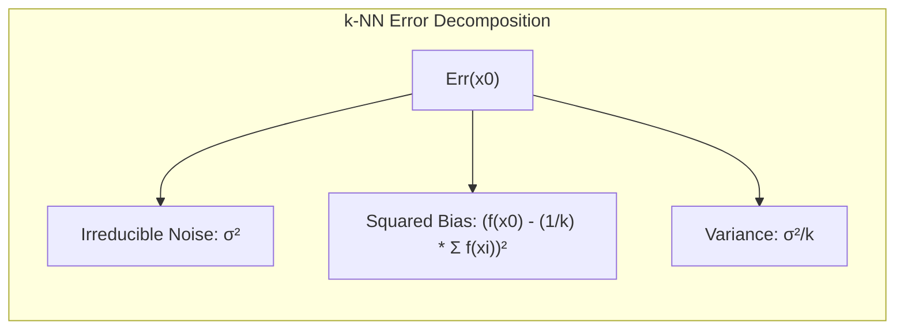

> 💡 **Exemplo Numérico:**
>
> Suponha que temos os seguintes dados de treinamento (X, Y) e queremos prever o valor de Y para um novo ponto $x_0 = 5$:
>
> | X   | Y   |
> | --- | --- |
> | 1   | 2   |
> | 2   | 3   |
> | 3   | 5   |
> | 4   | 6   |
> | 6   | 8   |
> | 7   | 9   |
> | 8   | 10  |
>
> *   **k=1 (Baixo Bias, Alta Variância):** O vizinho mais próximo de $x_0 = 5$ é $x=4$.  A predição será $f(5) = 6$. Se o valor real fosse, por exemplo, 7, o erro seria $(7-6)^2=1$. Este modelo é muito sensível a um único ponto e tem alta variância, pois uma pequena mudança nos dados pode alterar muito o vizinho mais próximo e, portanto, a previsão.
> *   **k=3:** Os 3 vizinhos mais próximos de $x_0=5$ são $x = [4, 6, 3]$, com $Y = [6, 8, 5]$. A predição será a média: $f(5) = (6 + 8 + 5)/3 = 6.33$.  Neste caso, se o valor real fosse 7 o erro seria $(7-6.33)^2=0.44$. O modelo tem menos variância e mais bias que o k=1.
> *   **k=7:** Os 7 vizinhos mais próximos são todos os pontos do conjunto de treino. A predição será $f(5) = (2+3+5+6+8+9+10)/7 = 6.14$. Se o valor real fosse 7, o erro seria $(7-6.14)^2 = 0.74$. O modelo tem alta bias e baixa variância, é menos sensível a um determinado ponto mas também pode subestimar a função real.
>
> Este exemplo demonstra como a escolha de *k* afeta a predição e o compromisso entre bias e variância. Valores pequenos de *k* levam a um ajuste mais detalhado aos dados, mas maior variância; valores grandes levam a um ajuste mais suave, mas maior bias.

**Conceito 3: Bias-Variance Tradeoff**

A relação entre bias e variância é um conceito central em aprendizado de máquina. Modelos complexos, como os modelos k-NN com *k* pequeno, tendem a ter baixa bias e alta variância [^7.2]. Eles se ajustam bem aos dados de treinamento, mas são suscetíveis a overfitting, apresentando desempenho ruim em dados não vistos. Por outro lado, modelos mais simples, como os modelos k-NN com *k* grande, tendem a ter alta bias e baixa variância [^7.2]. Eles não se ajustam perfeitamente aos dados de treinamento, mas generalizam melhor para novos dados. O trade-off bias-variância refere-se à busca do equilíbrio ideal entre esses dois extremos. O objetivo é encontrar o nível de complexidade do modelo que minimize o erro de generalização.

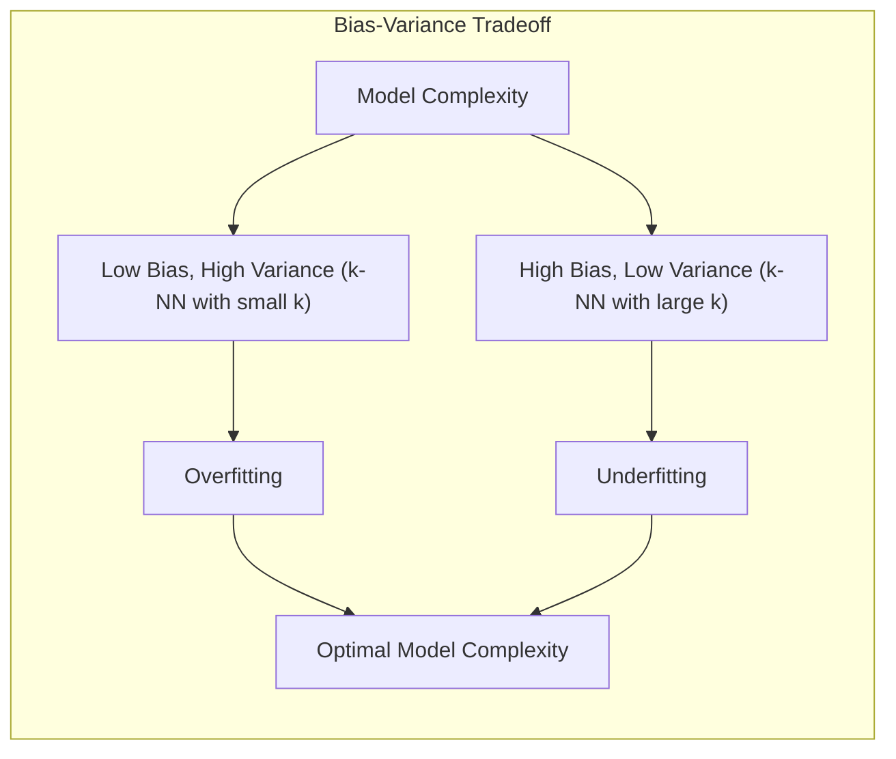

> ⚠️ **Nota Importante**: A escolha adequada do valor de *k* é crucial para otimizar o desempenho da regressão k-NN, equilibrando bias e variância [^7.2].
>
> ❗ **Ponto de Atenção**: O k-NN pode sofrer com a maldição da dimensionalidade em espaços de alta dimensão, sendo relevante avaliar os métodos de seleção de variáveis.
>
> ✔️ **Destaque**: As abordagens de regularização podem ajudar a controlar a complexidade do modelo, reduzindo a variância e melhorando a generalização, embora não discutido diretamente para k-NN, mas aplicável a outros modelos [^7.5].

### Regressão Linear e Mínimos Quadrados para Classificação
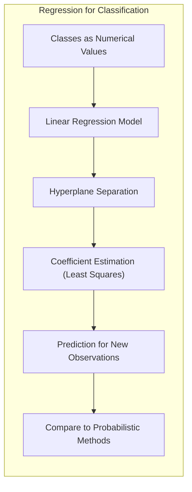

A regressão linear de uma matriz de indicadores pode ser utilizada para classificação, codificando as classes como valores numéricos distintos [^7.2]. O modelo de regressão ajusta um hiperplano que separa as diferentes classes [^7.2]. Os coeficientes são estimados por mínimos quadrados e, uma vez treinados, podem ser usados para prever a classe para novas observações. As limitações do modelo de regressão linear em classificação incluem sua suposição de linearidade entre as classes, que nem sempre se sustenta, a possibilidade de gerar predições fora do intervalo [0,1] quando aplicada diretamente a um problema de classificação binária, e a sensibilidade a *outliers* [^7.2]. Embora a regressão linear possa ser usada, o erro quadrático (MSE) não é a melhor métrica para avaliar a qualidade da classificação, sendo preferível o uso de métricas como acurácia ou *F1-score* [^7.2].

**Lemma 2:** *Projeção em Hiperplanos de Decisão*

Em certas condições, os hiperplanos de decisão gerados pela regressão linear de indicadores podem ser equivalentes aos obtidos por análise discriminante linear (LDA). Este lemma estabelece a relação entre o espaço de projeção linear de regressão e o espaço discriminante [^7.3]. Seja a função discriminante linear obtida por regressão linear de indicadores, $f(x) = w^Tx + b$ e a função discriminante da LDA, $g(x) = v^Tx + c$. Sob condições de classes com covariância iguais e isotrópicas, pode-se mostrar que os vetores $w$ e $v$ são colineares e os hiperplanos de decisão $f(x)=0$ e $g(x)=0$ definem a mesma fronteira [^7.3].
$$\exists \alpha \in \mathbb{R} \;\; \text{tal que} \;\; v = \alpha w  $$
$$\text{Portanto, os hiperplanos } \{x | w^Tx + b = 0 \} \text{ e } \{x | v^Tx + c = 0\} \text{ são equivalentes.}$$
$\blacksquare$

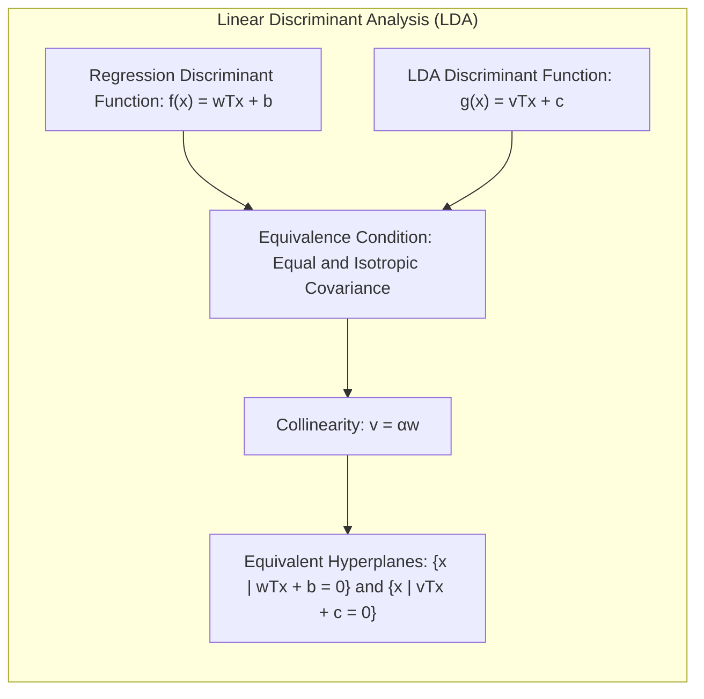

> 💡 **Exemplo Numérico:**
>
> Considere um problema de classificação binária com duas classes, onde os pontos são:
>
> *   Classe 0: (1, 1), (2, 1), (1, 2)
> *   Classe 1: (3, 3), (4, 2), (4, 4)
>
> Podemos usar regressão linear para classificar esses pontos. Primeiro, codificamos a classe 0 como -1 e a classe 1 como 1. A matriz de design X e o vetor de saída y são:
>
> ```python
> import numpy as np
> from sklearn.linear_model import LinearRegression
>
> X = np.array([[1, 1], [2, 1], [1, 2], [3, 3], [4, 2], [4, 4]])
> y = np.array([-1, -1, -1, 1, 1, 1])
>
> model = LinearRegression()
> model.fit(X, y)
>
> w = model.coef_
> b = model.intercept_
>
> print(f"Coeficientes w: {w}")
> print(f"Intercepto b: {b}")
>
> # Função de predição para novos pontos
> def predict(x):
>   return np.dot(w, x) + b
>
> # Exemplo de classificação de um novo ponto
> new_point = np.array([3,2.5])
> prediction = predict(new_point)
> print(f"Predição para {new_point}: {prediction}")
> if prediction > 0:
>  print ("Classe 1")
> else:
>   print ("Classe 0")
> ```
>
> Os coeficientes `w` e o intercepto `b` definem o hiperplano $w^Tx + b = 0$ que separa as classes. A classificação de um novo ponto é feita verificando o sinal de  $w^Tx + b$. Se o valor for positivo, o ponto é classificado como classe 1; caso contrário, é classificado como classe 0.
>
> Este exemplo demonstra como a regressão linear pode ser utilizada para classificação, embora com as limitações mencionadas anteriormente.

**Corolário 2:** *Simplificação da Análise do Modelo*

Como consequência direta do Lemma 2, sob certas condições específicas, é possível simplificar a análise de modelos de classificação baseados em regressão de indicadores, utilizando a teoria da análise discriminante linear (LDA) e propriedades de projeções lineares [^7.3]. A relação entre regressão e LDA permite que algoritmos de regressão sejam aplicados em situações de classificação quando se busca uma fronteira de decisão linear.

> "Em alguns cenários, a regressão logística pode fornecer estimativas mais estáveis de probabilidade, enquanto a regressão de indicadores pode levar a extrapolações fora de [0,1] [^7.4]."
>
> "No entanto, há situações em que a regressão de indicadores é suficiente e até mesmo vantajosa quando o objetivo principal é a fronteira de decisão linear [^7.2]."

### Métodos de Seleção de Variáveis e Regularização em Classificação
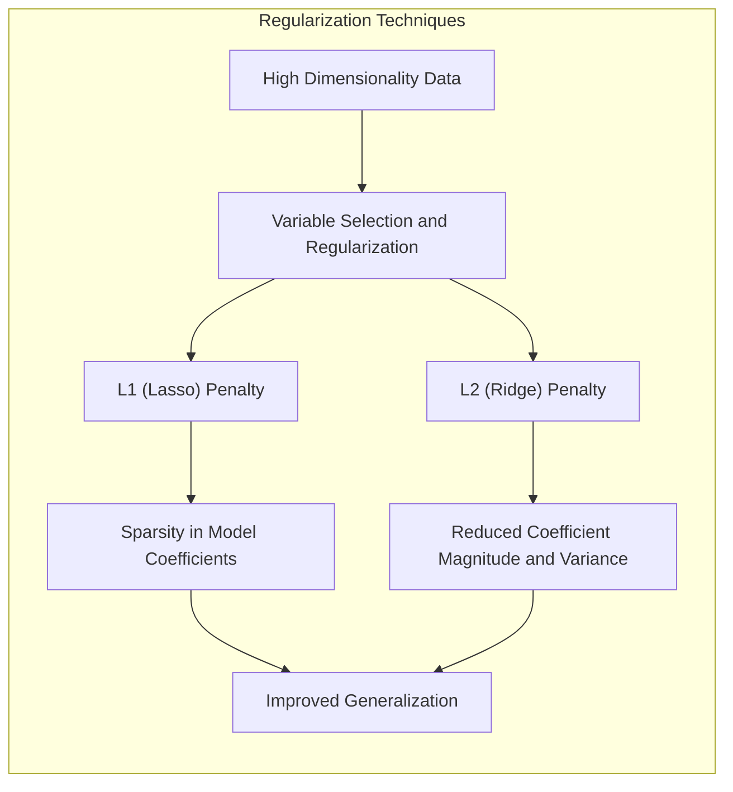

A seleção de variáveis e a regularização são técnicas cruciais para lidar com modelos complexos e dados com alta dimensionalidade, evitando o overfitting. Em modelos lineares, a regularização pode ser implementada com penalidades L1 e L2 [^7.4]. A penalidade L1, também conhecida como Lasso, induz a esparsidade nos coeficientes do modelo, selecionando as variáveis mais importantes e zerando as menos relevantes [^7.4.4]. A penalidade L2, também conhecida como Ridge, reduz a magnitude dos coeficientes, melhorando a estabilidade do modelo e reduzindo a variância [^7.5]. A escolha entre L1 e L2 (ou uma combinação delas como *Elastic Net*) depende das características dos dados e dos objetivos da modelagem. Regularizar modelos logísticos com penalidades L1 e L2 ajuda a controlar o número de variáveis (sparsity) e a estabilidade dos modelos, reduzindo a complexidade [^7.4.4].

**Lemma 3:** *Esparsidade em Regularização L1*

A penalidade L1 em regressão logística leva a coeficientes esparsos devido ao formato de sua função de penalidade.
A função de custo de um modelo logístico com penalidade L1 é definida como:
$$ J(\beta) = - \frac{1}{N}\sum_{i=1}^{N} [y_i \log(p_i) + (1-y_i)\log(1-p_i)] + \lambda \sum_{j=1}^p |\beta_j| $$

onde $\beta$ são os coeficientes do modelo, $\lambda$ é o parâmetro de regularização, e $p_i$ é a probabilidade prevista. O termo $\lambda \sum_{j=1}^p |\beta_j|$ impõe a penalidade L1, fazendo com que alguns coeficientes $\beta_j$ sejam exatamente zero. Isso acontece porque a derivada da penalidade L1 (em valor absoluto) é uma constante em quase toda a sua extensão. Quando o valor $\beta_j$ alcança zero, ele "para" em zero.
$\blacksquare$

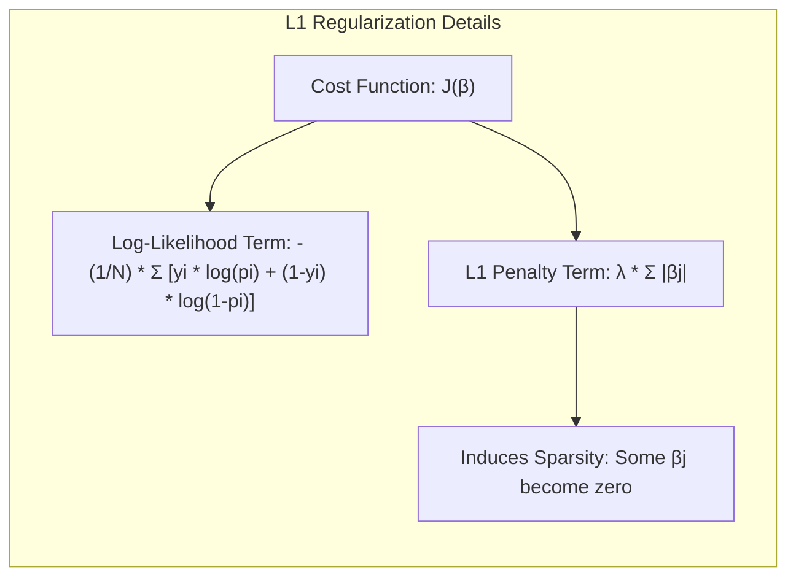

> 💡 **Exemplo Numérico:**
>
> Considere um problema de classificação binária com 4 variáveis ($x_1, x_2, x_3, x_4$). Temos um modelo de regressão logística que inicialmente ajusta os seguintes coeficientes: $\beta = [1.2, -0.5, 0.8, -0.2]$.
>
> *   **Regularização L1 (Lasso):**
>     Aplicamos a regularização L1 com $\lambda = 0.5$. A função de custo agora inclui o termo $0.5 * (|\beta_1| + |\beta_2| + |\beta_3| + |\beta_4|)$. O algoritmo de otimização do modelo ajustará os coeficientes. Vamos supor que após este processo, alguns coeficientes sejam zerados, e tenhamos $\beta_{Lasso} = [0.9, 0, 0.3, 0]$. As variáveis $x_2$ e $x_4$ foram eliminadas do modelo.
>
> *   **Regularização L2 (Ridge):**
>     Aplicamos a regularização L2 com $\lambda = 0.5$. A função de custo agora inclui o termo $0.5 * (\beta_1^2 + \beta_2^2 + \beta_3^2 + \beta_4^2)$. Os coeficientes serão ajustados, mas nenhum será zerado, pois a penalidade L2 não induz esparsidade. Suponha que os novos coeficientes sejam $\beta_{Ridge} = [1.0, -0.3, 0.6, -0.1]$. Os coeficientes reduziram em magnitude, mas não são zero.
>
> | Método      | $\beta_1$ | $\beta_2$ | $\beta_3$ | $\beta_4$ |
> | ----------- | -------- | -------- | -------- | -------- |
> | Inicial     | 1.2      | -0.5     | 0.8      | -0.2     |
> | L1 (Lasso)  | 0.9      | 0        | 0.3      | 0        |
> | L2 (Ridge)  | 1.0      | -0.3     | 0.6      | -0.1     |
>
> Observe que com Lasso (L1) as variáveis $x_2$ e $x_4$ foram excluídas do modelo, enquanto com Ridge (L2) todas as variáveis permanecem no modelo, mas com coeficientes menores. Isso ilustra a diferença na forma como as duas regularizações lidam com a complexidade do modelo e selecionam variáveis.

**Corolário 3:** *Interpretabilidade de Modelos com L1*

Como consequência do Lemma 3, a esparsidade dos coeficientes induzida pela penalidade L1 simplifica a interpretação dos modelos classificatórios, pois as variáveis com coeficientes zero são efetivamente removidas do modelo. Isso facilita a identificação das variáveis mais relevantes para a predição, tornando o modelo mais transparente e fácil de analisar [^7.4.5].

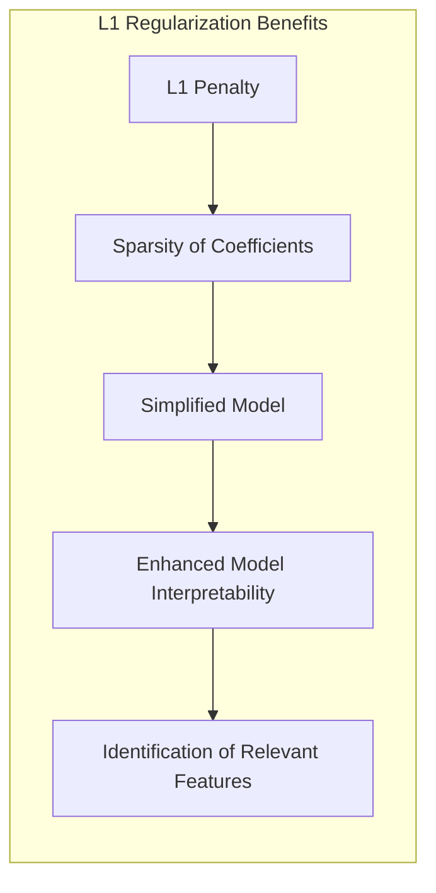

> ⚠️ **Ponto Crucial**: L1 e L2 podem ser combinadas (Elastic Net) para aproveitar vantagens de ambos os tipos de regularização, conforme discutido em [^7.5].

### Separating Hyperplanes e Perceptrons

A ideia de maximizar a margem de separação entre as classes leva ao conceito de hiperplanos ótimos, onde a margem é definida como a distância mínima entre as amostras mais próximas e o hiperplano de decisão [^7.5.2]. A formulação do problema de otimização é feita utilizando o dual de Wolfe, e a solução do problema pode ser expressa como combinações lineares dos pontos de suporte, ou seja, amostras que estão mais próximas da fronteira de decisão [^7.5.2]. O Perceptron de Rosenblatt é um algoritmo de classificação linear que aprende uma função discriminante a partir de amostras de treinamento [^7.5.1]. O algoritmo ajusta iterativamente os pesos do modelo para minimizar os erros de classificação. Sob certas condições de separabilidade linear, é garantida a convergência do Perceptron, ou seja, ele encontra uma função discriminante que separa corretamente as classes [^7.5.1].

### Pergunta Teórica Avançada: Quais as diferenças fundamentais entre a formulação de LDA e a Regra de Decisão Bayesiana considerando distribuições Gaussianas com covariâncias iguais?

**Resposta:**
A Análise Discriminante Linear (LDA) e a regra de decisão Bayesiana são abordagens distintas para classificação, mas se tornam equivalentes sob certas hipóteses. Em ambas as abordagens, assume-se que as classes seguem distribuições Gaussianas com médias e covariâncias distintas. No entanto, a LDA assume que as matrizes de covariância para todas as classes são iguais, enquanto a regra de decisão Bayesiana não faz essa suposição. Sob a condição de covariâncias iguais, e no cenário de duas classes, a fronteira de decisão Bayesiana se torna linear e idêntica à fronteira de decisão obtida por LDA [^7.3].

**Lemma 4:** *Equivalência entre LDA e Decisão Bayesiana (covariâncias iguais)*

Sejam duas classes $\pi_1$ e $\pi_2$ com distribuições Gaussianas multivariadas $p(x|\pi_i) = \mathcal{N}(\mu_i, \Sigma_i)$ e onde $\Sigma_1 = \Sigma_2 = \Sigma$. A regra de decisão Bayesiana atribui um novo ponto *x* à classe *k* tal que $k = \text{argmax}_i P(\pi_i|x)$. Usando o teorema de Bayes e a hipótese de covariâncias iguais, pode-se mostrar que a regra de decisão Bayesiana se reduz a uma função discriminante linear, formalmente idêntica à função discriminante do LDA [^7.3]. Essa equivalência ocorre pois a diferença entre os logaritmos das densidades Gaussianas se torna uma função linear de x.

$$\text{Bayes: } \text{argmax}_i P(\pi_i|x) = \text{argmax}_i \frac{p(x|\pi_i)P(\pi_i)}{p(x)} = \text{argmax}_i p(x|\pi_i)P(\pi_i)$$
$$\text{LDA: }  \text{argmax}_i  \log p(x|\pi_i) + \log P(\pi_i) $$
$$\text{Sob } \Sigma_1 = \Sigma_2 = \Sigma, \text{ LDA } \Leftrightarrow \text{ Bayes}$$
$\blacksquare$

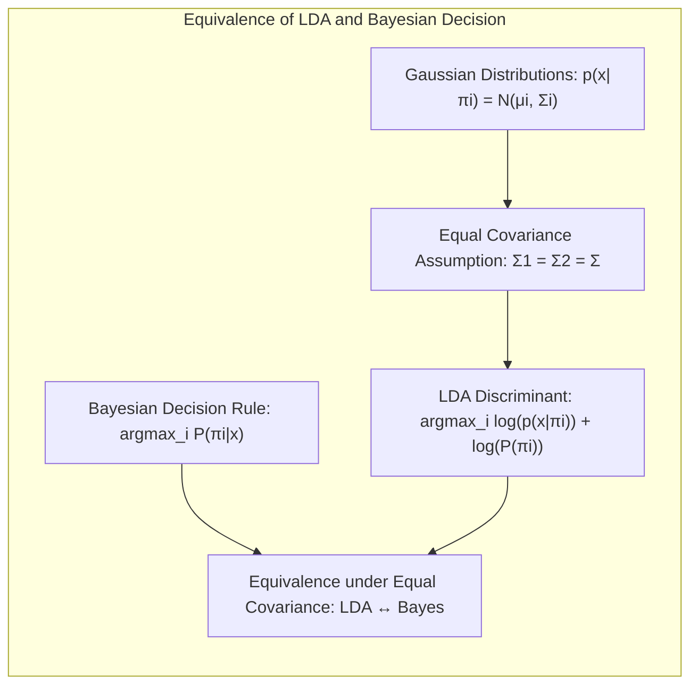

> 💡 **Exemplo Numérico:**
>
> Para ilustrar, suponha que temos duas classes, $\pi_1$ e $\pi_2$, com distribuições Gaussianas e covariâncias iguais, ambas sendo a matriz identidade $I$. As médias são $\mu_1 = [1, 1]$ e $\mu_2 = [3, 3]$.
>
> A função discriminante do LDA é:
>
> $ \delta_i(x) = x^T \Sigma^{-1} \mu_i - \frac{1}{2}\mu_i^T \Sigma^{-1}\mu_i + \log(\pi_i)$
>
> Como $\Sigma = I$, e assumindo probabilidades a priori iguais, $\pi_1 = \pi_2 = 0.5$ e $\log(\pi_i) = \log(0.5)$, então:
>
> $ \delta_1(x) = x^T \mu_1 - \frac{1}{2}\mu_1^T \mu_1  = x^T [1, 1] - \frac{1}{2} [1, 1]^T [1, 1] = x_1 + x_2 - 1$
>
> $ \delta_2(x) = x^T \mu_2 - \frac{1}{2}\mu_2^T \mu_2  = x^T [3, 3] - \frac{1}{2} [3, 3]^T [3, 3] = 3x_1 + 3x_2 - 9$
>
> A fronteira de decisão é dada por $\delta_1(x) = \delta_2(x)$:
>
> $ x_1 + x_2 - 1 = 3x_1 + 3x_2 - 9$
>
> $ 2x_1 + 2x_2 = 8$
>
> $ x_1 + x_2 = 4$
>
> Este é o hiperplano linear que separa as duas classes. A regra de decisão Bayesiana sob essas condições também leva a esta mesma fronteira de decisão.

**Corolário 4:** *Fronteiras Quadráticas (QDA)*

Ao relaxar a suposição de covariâncias iguais entre as classes, ou seja, permitindo que $\Sigma_1 \neq \Sigma_2$, a regra de decisão Bayesiana leva a fronteiras de decisão quadráticas, caracterizando a Análise Discriminante Quadrática (QDA) [^7.3]. A fronteira de decisão não é mais um hiperplano, mas sim uma forma mais complexa, capaz de modelar as particularidades dos dados em situações de covariâncias distintas entre classes [^7.3].

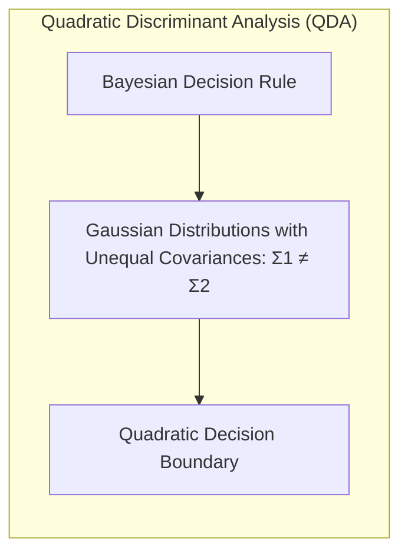

> ⚠️ **Ponto Crucial**: A adoção ou não de covariâncias iguais impacta fortemente o tipo de fronteira de decisão (linear vs. quadrática) [^7.3.1].

### Conclusão

A avaliação e seleção de modelos são etapas cruciais no desenvolvimento de sistemas de aprendizado de máquina eficazes. A regressão k-NN é uma técnica versátil e não-paramétrica que oferece flexibilidade, mas sua eficácia depende da escolha adequada do parâmetro *k*. Este capítulo explorou a interação entre complexidade, bias e variância, os métodos de regularização e os conceitos teóricos da classificação, mostrando que a melhor abordagem é um balanço entre o ajuste do modelo aos dados de treino e sua capacidade de generalização para novos dados. A seleção de modelos deve considerar essas propriedades, e a avaliação do desempenho é essencial para garantir resultados confiáveis na prática.
<!-- END DOCUMENT -->

### Footnotes

[^7.1]: "The generalization performance of a learning method relates to its prediction capability on independent test data. Assessment of this performance is extremely important in practice, since it guides the choice of learning method or model, and gives us a measure of the quality of the ultimately chosen model." *(Trecho de  Model Assessment and Selection)*
[^7.2]: "Figure 7.1 illustrates the important issue in assessing the ability of a learning method to generalize. Consider first the case of a quantitative or interval scale response. We have a target variable Y, a vector of inputs X, and a prediction model f(X) that has been estimated from a training set T." *(Trecho de  Model Assessment and Selection)*
[^7.3]: "As in Chapter 2, if we assume that Y = f(X) + ε where E(ε) = 0 and Var(ε) = σε, we can derive an expression for the expected prediction error of a regression fit f(X) at an input point X = x0, using squared-error loss:" *(Trecho de  Model Assessment and Selection)*
[^7.3.1]: "For the k-nearest-neighbor regression fit, these expressions have the simple form" *(Trecho de Model Assessment and Selection)*
[^7.4]: "The story is similar for a qualitative or categorical response G taking one of K values in a set G, labeled for convenience as 1, 2, ..., K. Typically we model the probabilities pk(X) = Pr(G = k|X) (or some monotone transformations fr(X)), and then Ĝ(X) = arg max