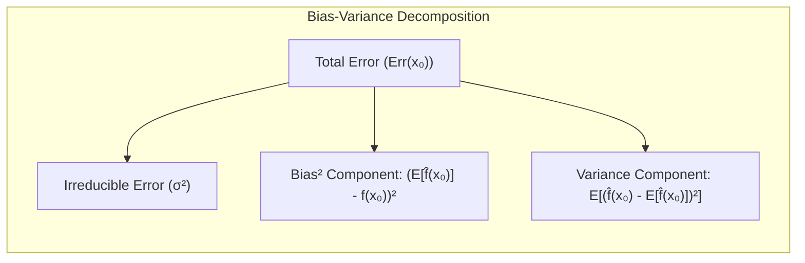
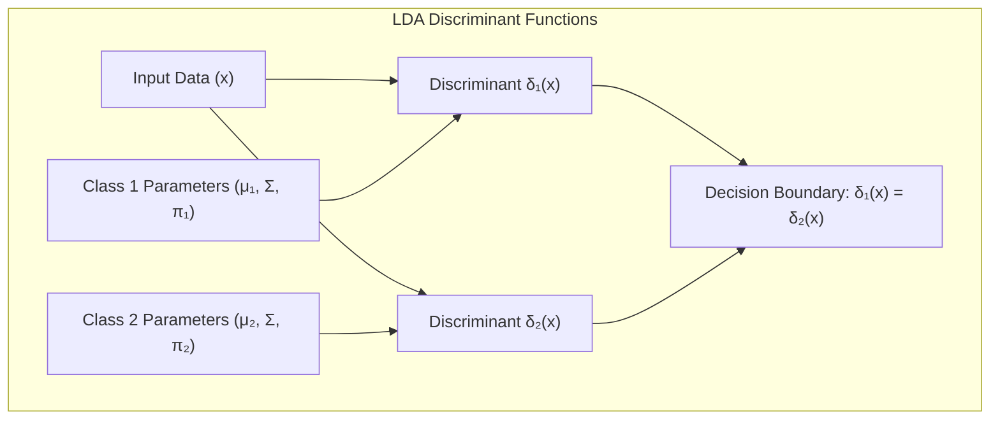
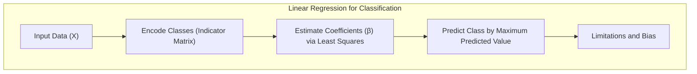
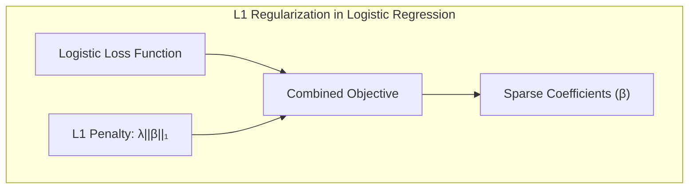

## Avaliação e Seleção de Modelos: Foco no Erro da Ridge Regression

<imagem: Um diagrama complexo que ilustra o tradeoff bias-variância, mostrando curvas de erro de treinamento e teste em relação à complexidade do modelo para Ridge Regression, destacando o ponto de ótimo desempenho.>

### Introdução

A capacidade de generalização de um método de aprendizado refere-se à sua habilidade de realizar previsões precisas em dados de teste independentes. A avaliação desse desempenho é crucial na prática, pois orienta a escolha do método ou modelo de aprendizado e fornece uma medida da qualidade do modelo escolhido [^7.1]. Este capítulo aborda os principais métodos para avaliação de desempenho, mostrando como eles são utilizados na seleção de modelos, com foco na análise do erro da **Ridge Regression** e sua relação com **viés, variância e complexidade do modelo** [^7.1].

### Conceitos Fundamentais

**Conceito 1:** O **problema de classificação** (ou regressão) busca construir um modelo $f(X)$ que aproxime a variável resposta $Y$ com base nas variáveis de entrada $X$. Métodos lineares, como a regressão linear e a Ridge Regression, são frequentemente empregados, mas estão sujeitos a um tradeoff entre viés e variância. Modelos mais simples (baixa complexidade) tendem a ter alto viés e baixa variância, enquanto modelos mais complexos (alta complexidade) tendem a ter baixo viés e alta variância. O objetivo é encontrar a complexidade ideal que minimize o erro de generalização [^7.2]. A escolha de um modelo linear implica em um viés inicial (modelo estruturalmente restrito) mas pode levar a menor variância, dada uma quantidade de dados finita.

> 💡 **Exemplo Numérico:** Imagine que estamos tentando ajustar um modelo para prever o preço de casas (`Y`) com base no tamanho em metros quadrados (`X`).
>
> 1.  **Modelo Simples (Alto Viés, Baixa Variância):** Usamos um modelo linear simples, como $Y = \beta_0 + \beta_1X$. Esse modelo pode não capturar nuances na relação entre tamanho e preço (alto viés), mas seus coeficientes $\beta_0$ e $\beta_1$ são relativamente estáveis com mudanças nos dados de treinamento (baixa variância).
> 2.  **Modelo Complexo (Baixo Viés, Alta Variância):** Usamos um modelo polinomial de grau 5, como $Y = \beta_0 + \beta_1X + \beta_2X^2 + \beta_3X^3 + \beta_4X^4 + \beta_5X^5$. Esse modelo pode se ajustar muito bem aos dados de treinamento (baixo viés), mas seus coeficientes são sensíveis a pequenas mudanças nos dados, levando a resultados diferentes em novos conjuntos de dados (alta variância).
> 3.  **Objetivo:** O objetivo é encontrar um modelo com complexidade intermediária, que minimize o erro tanto nos dados de treinamento quanto nos dados de teste. Em outras palavras, um modelo que generalize bem.

**Lemma 1:** Em modelos de regressão linear, o erro de previsão pode ser decomposto em três componentes: o erro irredutível, o viés ao quadrado e a variância. A **decomposição viés-variância** é fundamental para entender como diferentes modelos se comportam em relação ao overfitting e underfitting [^7.3].



$$
Err(x_0) = \sigma^2 + [Ef(x_0) - f(x_0)]^2 + E[f(x_0) - Ef(x_0)]^2
$$

Onde:

-   $\sigma^2$ é o erro irredutível.
-   $[Ef(x_0) - f(x_0)]^2$ é o viés ao quadrado.
-   $E[f(x_0) - Ef(x_0)]^2$ é a variância.

[^7.3]

> 💡 **Exemplo Numérico:** Vamos considerar um cenário onde o verdadeiro modelo é $f(x) = 2x$ e temos um conjunto de dados ruidoso $y_i = 2x_i + \epsilon_i$, com $\epsilon_i \sim N(0, 0.5^2)$.  Vamos ajustar dois modelos:  um linear $f_1(x) = \beta_0 + \beta_1x$ e outro  mais simples $f_2(x) = \beta_1x$.  Simulando 100 conjuntos de dados de treinamento, podemos calcular o erro médio de previsão em $x_0 = 1$.
> ```python
> import numpy as np
> import matplotlib.pyplot as plt
> from sklearn.linear_model import LinearRegression
>
> np.random.seed(42)
> n_simulations = 100
> x0 = 1
> true_f_x0 = 2 * x0
> sigma2 = 0.5**2
>
> # Simulate data
> def simulate_data(n_samples):
>     x = np.sort(np.random.rand(n_samples) * 2)
>     epsilon = np.random.normal(0, np.sqrt(sigma2), n_samples)
>     y = 2 * x + epsilon
>     return x.reshape(-1, 1), y
>
> bias_squared_f1 = 0
> variance_f1 = 0
> bias_squared_f2 = 0
> variance_f2 = 0
>
> f1_predictions = []
> f2_predictions = []
>
> for _ in range(n_simulations):
>     x_train, y_train = simulate_data(20)
>
>     # Fit model f1
>     model_f1 = LinearRegression()
>     model_f1.fit(x_train, y_train)
>     f1_x0_pred = model_f1.predict([[x0]])[0]
>     f1_predictions.append(f1_x0_pred)
>
>    # Fit model f2 (without intercept)
>     model_f2 = LinearRegression(fit_intercept=False)
>     model_f2.fit(x_train, y_train)
>     f2_x0_pred = model_f2.predict([[x0]])[0]
>     f2_predictions.append(f2_x0_pred)
>
>
> # Calculate components
> Ef1_x0 = np.mean(f1_predictions)
> Ef2_x0 = np.mean(f2_predictions)
>
> bias_squared_f1 = (Ef1_x0 - true_f_x0)**2
> variance_f1 = np.var(f1_predictions)
>
> bias_squared_f2 = (Ef2_x0 - true_f_x0)**2
> variance_f2 = np.var(f2_predictions)
>
> print(f"Model f1 (Linear with intercept):")
> print(f"  Bias²: {bias_squared_f1:.4f}")
> print(f"  Variance: {variance_f1:.4f}")
> print(f"  Total Error: {bias_squared_f1 + variance_f1 + sigma2:.4f}")
>
> print(f"\nModel f2 (Linear without intercept):")
> print(f"  Bias²: {bias_squared_f2:.4f}")
> print(f"  Variance: {variance_f2:.4f}")
> print(f"  Total Error: {bias_squared_f2 + variance_f2 + sigma2:.4f}")
>
> # Plotting predictions
> plt.figure(figsize=(10,5))
> plt.subplot(1,2,1)
> plt.hist(f1_predictions, bins=20, alpha=0.7, label='Model f1 Predictions')
> plt.axvline(Ef1_x0, color='red', linestyle='dashed', linewidth=1, label='Average Prediction')
> plt.axvline(true_f_x0, color='green', linestyle='dashed', linewidth=1, label='True value')
> plt.title('Model f1 Predictions')
> plt.legend()
>
> plt.subplot(1,2,2)
> plt.hist(f2_predictions, bins=20, alpha=0.7, label='Model f2 Predictions')
> plt.axvline(Ef2_x0, color='red', linestyle='dashed', linewidth=1, label='Average Prediction')
> plt.axvline(true_f_x0, color='green', linestyle='dashed', linewidth=1, label='True value')
> plt.title('Model f2 Predictions')
> plt.legend()
> plt.tight_layout()
> plt.show()
>
> ```
>
> **Interpretação:**
>
>  *   **Modelo f1 (Linear com intercepto):** Tem um viés menor (o valor médio da predição está mais perto do valor verdadeiro), e também menor variância, com  previsões mais concentradas.
> *  **Modelo f2 (Linear sem intercepto):** Tem um viés maior (o valor médio da predição está mais longe do valor verdadeiro), mas previsões com uma variância menor que modelo f1.
> *  **Erro Irredutível:** $\sigma^2 = 0.25$ é constante para ambos os modelos e representa a variabilidade intrínseca dos dados.
> *  A decomposição viés-variância nos permite entender que o modelo f1 tem um erro total menor.

**Conceito 2:** A **Linear Discriminant Analysis (LDA)** busca encontrar a melhor projeção linear dos dados para classificar diferentes classes, assumindo que os dados seguem uma distribuição normal com a mesma matriz de covariância para todas as classes [^4.3]. Embora a LDA seja um método de classificação, sua formulação também está relacionada a conceitos de regressão e projeções lineares. Em especial, quando assumimos que os dados seguem uma distribuição normal, a fronteira de decisão é dada pela igualdade das funções discriminantes lineares [^4.3.1]. A LDA busca projetar os dados em um subespaço de menor dimensão que maximize a separação entre classes.

**Corolário 1:** A função discriminante linear da LDA é derivada da diferença entre funções de densidade gaussianas, cujos parâmetros são estimativas da média e da covariância para cada classe. A fronteira de decisão é dada pelo conjunto de pontos onde a probabilidade de pertencer a ambas as classes é igual, o que equivale a fazer a diferença entre essas funções discriminantes [^4.3.3]. A relação com projeções lineares é que o discriminante linear representa a projeção em um eixo que melhor separa as classes.

> 💡 **Exemplo Numérico:** Suponha que temos duas classes de dados bidimensionais ($X_1, X_2$), com as seguintes médias e covariância comum:
> - Classe 1: $\mu_1 = [1, 1]$,
> - Classe 2: $\mu_2 = [2, 2]$,
> - Covariância: $\Sigma = \begin{bmatrix} 0.5 & 0 \\ 0 & 0.5 \end{bmatrix}$
>
> A função discriminante para a classe 1 é:
> $\delta_1(x) = x^T \Sigma^{-1} \mu_1 - \frac{1}{2} \mu_1^T \Sigma^{-1} \mu_1 + \ln \pi_1$
> e para a classe 2 é:
> $\delta_2(x) = x^T \Sigma^{-1} \mu_2 - \frac{1}{2} \mu_2^T \Sigma^{-1} \mu_2 + \ln \pi_2$
>
> Assumindo probabilidades a priori iguais ($\pi_1 = \pi_2 = 0.5$), a fronteira de decisão é dada por $\delta_1(x) = \delta_2(x)$.  Nesse caso, a fronteira é uma linha reta que separa as duas classes.  Um ponto será classificado na classe 1 se $\delta_1(x) > \delta_2(x)$ ou na classe 2 caso contrário.
>
> ```python
> import numpy as np
> import matplotlib.pyplot as plt
>
> # Parâmetros das classes
> mu1 = np.array([1, 1])
> mu2 = np.array([2, 2])
> sigma = np.array([[0.5, 0], [0, 0.5]])
> sigma_inv = np.linalg.inv(sigma)
> pi1 = 0.5
> pi2 = 0.5
>
> # Define a função discriminante
> def delta(x, mu, sigma_inv, pi):
>     return x @ sigma_inv @ mu - 0.5 * mu @ sigma_inv @ mu + np.log(pi)
>
> # Gera os dados
> np.random.seed(42)
> X1 = np.random.multivariate_normal(mu1, sigma, 100)
> X2 = np.random.multivariate_normal(mu2, sigma, 100)
>
> # Gera pontos para visualização da fronteira
> x_min, x_max = 0, 3
> y_min, y_max = 0, 3
> xx, yy = np.meshgrid(np.linspace(x_min, x_max, 100), np.linspace(y_min, y_max, 100))
> grid_points = np.c_[xx.ravel(), yy.ravel()]
>
> # Calcula os discriminantes
> delta1_grid = np.array([delta(x, mu1, sigma_inv, pi1) for x in grid_points])
> delta2_grid = np.array([delta(x, mu2, sigma_inv, pi2) for x in grid_points])
>
> # Calcula as classes preditas
> predicted_classes = np.where(delta1_grid > delta2_grid, 1, 2)
> predicted_classes = predicted_classes.reshape(xx.shape)
>
> # Plota os dados e a fronteira
> plt.figure(figsize=(8, 6))
> plt.scatter(X1[:, 0], X1[:, 1], color='blue', label='Classe 1')
> plt.scatter(X2[:, 0], X2[:, 1], color='red', label='Classe 2')
> plt.contourf(xx, yy, predicted_classes, levels=[0.5, 1.5, 2.5], colors=['lightblue', 'lightcoral'], alpha=0.4)
> plt.xlabel('X1')
> plt.ylabel('X2')
> plt.title('LDA: Fronteira de Decisão')
> plt.legend()
> plt.grid(True)
> plt.show()
> ```
> **Interpretação:** A visualização mostra a fronteira linear entre as duas classes, destacando que a LDA projeta os dados em um espaço que maximiza a separação. Os pontos azuis e vermelhos representam as duas classes, e a região entre eles é a fronteira de decisão, que é uma linha reta.



**Conceito 3:** A **Logistic Regression** modela a probabilidade de um resultado binário usando a função logística, que mapeia uma combinação linear das variáveis de entrada para um valor entre 0 e 1 [^4.4]. O logit da probabilidade, que é a transformação log-odds, é uma função linear das variáveis de entrada. Os parâmetros do modelo são estimados por maximização da função de verossimilhança. Diferentemente da LDA que assume gaussianidade, a regressão logística não faz essa suposição sobre as distribuições das variáveis preditoras, tornando-a mais flexível em alguns cenários. O logit da probabilidade, representado por $ln(p(x)/(1-p(x)))$, pode ser modelado linearmente [^4.4.1]. A função de verossimilhança é dada por $L(\beta) = \sum_{i} y_i ln(p(x_i)) + (1-y_i)ln(1-p(x_i))$ [^4.4.4]

> ⚠️ **Nota Importante**: A Logistic Regression, ao modelar probabilidades, pode ser mais adequada em situações onde se quer obter uma estimativa da probabilidade de um resultado, diferentemente da LDA que foca na separação de classes [^4.4.1].
> ❗ **Ponto de Atenção**: Em classes desbalanceadas, a Logistic Regression pode ser mais robusta do que a regressão linear direta em matriz de indicadores, pois otimiza um critério de verossimilhança mais adequado [^4.4.2].
> ✔️ **Destaque**: Apesar de terem formulações diferentes, os parâmetros estimados por LDA e por Logistic Regression podem ter correlações em alguns contextos, especialmente quando a distribuição das classes se aproxima de gaussianas com a mesma matriz de covariância [^4.5].

> 💡 **Exemplo Numérico:** Vamos considerar um problema de classificação binária onde queremos prever se um cliente fará uma compra (`Y=1`) ou não (`Y=0`) com base na sua idade (`X`).
>
> 1.  **Dados:** Temos 100 clientes, e os dados podem ser simulados da seguinte forma:
> ```python
> import numpy as np
> import pandas as pd
> import matplotlib.pyplot as plt
> import seaborn as sns
> from sklearn.linear_model import LogisticRegression
> from sklearn.model_selection import train_test_split
> from sklearn.metrics import confusion_matrix, accuracy_score
>
> np.random.seed(42)
> n_samples = 100
> ages = np.random.randint(20, 70, n_samples)
>
> # Simulando a probabilidade de compra baseada na idade
> probabilities = 1 / (1 + np.exp(-0.1 * (ages - 45)))  # Função logística
>
> # Gerando os rótulos (compra ou não)
> purchases = np.random.binomial(1, probabilities)
>
> # Criando um dataframe pandas
> data = pd.DataFrame({'Age': ages, 'Purchase': purchases})
>
> # Scatter plot
> plt.figure(figsize=(8, 5))
> sns.scatterplot(x='Age', y='Purchase', data=data, alpha=0.6)
> plt.title('Compra vs Idade')
> plt.xlabel('Idade')
> plt.ylabel('Compra (1=Sim, 0=Não)')
> plt.show()
>
> # Separa os dados em treinamento e teste
> X_train, X_test, y_train, y_test = train_test_split(data[['Age']], data['Purchase'], test_size=0.2, random_state=42)
>
> # Treina o modelo de regressão logística
> model = LogisticRegression(random_state=42)
> model.fit(X_train, y_train)
>
> # Predições nos dados de teste
> y_pred = model.predict(X_test)
> y_prob = model.predict_proba(X_test)[:, 1] # Probabilidade da classe 1
>
> # Matriz de confusão
> cm = confusion_matrix(y_test, y_pred)
> print("Matriz de confusão:")
> print(cm)
>
> # Acurácia
> accuracy = accuracy_score(y_test, y_pred)
> print(f"\nAcurácia: {accuracy:.2f}")
>
> # Plotando a curva logística
> ages_range = np.linspace(data['Age'].min() - 5, data['Age'].max() + 5, 100).reshape(-1, 1)
> probs_range = model.predict_proba(ages_range)[:, 1]
>
> plt.figure(figsize=(8, 5))
> sns.scatterplot(x='Age', y='Purchase', data=data, alpha=0.6, label='Dados reais')
> plt.plot(ages_range, probs_range, color='red', label='Curva Logística')
> plt.title('Regressão Logística: Probabilidade de Compra vs Idade')
> plt.xlabel('Idade')
> plt.ylabel('Probabilidade de Compra')
> plt.legend()
> plt.show()
>
> # Imprimindo os coeficientes
> print("\nCoeficientes:")
> print(f"  Intercepto (beta_0): {model.intercept_[0]:.4f}")
> print(f"  Coeficiente da idade (beta_1): {model.coef_[0][0]:.4f}")
>
> ```
>
> **Interpretação:**
> *   A matriz de confusão mostra quantos exemplos foram corretamente e incorretamente classificados.
> *   A acurácia é uma medida do desempenho geral do modelo.
> *   A curva logística representa a probabilidade estimada de compra em função da idade.
> *   O intercepto e o coeficiente da idade indicam a influência da idade na probabilidade de compra. O coeficiente positivo indica que, em geral, a probabilidade de compra aumenta com a idade.

### Regressão Linear e Mínimos Quadrados para Classificação



A regressão linear pode ser aplicada para classificação usando uma matriz de indicadores, onde cada coluna representa uma classe e cada linha representa um exemplo. Uma variável de resposta $Y$ é codificada usando 1 para a classe pertencente e 0 para as demais.  Os coeficientes da regressão são estimados via mínimos quadrados e um novo ponto é classificado atribuindo-o à classe cujo indicador tiver o maior valor predito [^4.2]. No entanto, esse método tem limitações. A regressão linear não modela diretamente probabilidades e pode levar a valores preditos fora do intervalo \[0,1], além de poder apresentar comportamento inadequado em certas distribuições de classes [^4.1], [^4.2].

**Lemma 2:**  Em certas condições, as projeções nos hiperplanos de decisão gerados pela regressão linear de indicadores podem ser equivalentes às projeções geradas por discriminantes lineares, no sentido de produzir uma fronteira de decisão similar [^4.2]. Este resultado depende de uma correta codificação das classes e de uma distribuição específica para os dados.

**Corolário 2:** Se a codificação das classes for feita de tal forma que cada classe seja representada por um vetor linearmente independente, a regressão linear na matriz de indicadores se comportará de forma similar a uma análise discriminante. Este corolário destaca uma conexão interessante entre abordagens aparentemente distintas [^4.3].

Em cenários com classes desbalanceadas, a regressão logística geralmente oferece estimativas de probabilidade mais estáveis, enquanto a regressão de indicadores pode apresentar extrapolações fora do intervalo \[0,1]. Entretanto, em situações onde o foco principal é a fronteira de decisão linear, a regressão de indicadores pode ser suficiente [^4.4], [^4.2].

> 💡 **Exemplo Numérico:** Suponha que temos três classes (A, B, e C) e dados com duas características, $X_1$ e $X_2$. Vamos criar uma matriz de indicadores e aplicar a regressão linear para classificação.
>
> ```python
> import numpy as np
> import pandas as pd
> import matplotlib.pyplot as plt
> from sklearn.linear_model import LinearRegression
>
> # Dados de exemplo
> np.random.seed(42)
> n_samples = 100
>
> # Gerando dados para as classes
> X_A = np.random.multivariate_normal([1, 1], [[0.3, 0], [0, 0.3]], n_samples//3)
> X_B = np.random.multivariate_normal([3, 3], [[0.4, 0], [0, 0.4]], n_samples//3)
> X_C = np.random.multivariate_normal([1, 4], [[0.3, 0], [0, 0.3]], n_samples-2*(n_samples//3))
>
> X = np.concatenate((X_A, X_B, X_C))
>
> # Criando os rótulos
> y_A = np.zeros(len(X_A))
> y_B = np.ones(len(X_B))
> y_C = np.full(len(X_C),2)
>
> y = np.concatenate((y_A, y_B, y_C))
>
> # Criação da matriz de indicadores
> y_encoded = pd.get_dummies(y).values # converte para one-hot encoding
>
> # Ajuste do modelo de regressão linear
> model = LinearRegression()
> model.fit(X, y_encoded)
>
> # Predições
> predictions = model.predict(X)
> predicted_classes = np.argmax(predictions, axis=1)
>
> # Plotting the results
>
> # Create meshgrid for the decision boundaries
> x_min, x_max = X[:, 0].min() - 1, X[:, 0].max() + 1
> y_min, y_max = X[:, 1].min() - 1, X[:, 1].max() + 1
> xx, yy = np.meshgrid(np.arange(x_min, x_max, 0.02), np.arange(y_min, y_max, 0.02))
> Z = model.predict(np.c_[xx.ravel(), yy.ravel()])
> Z = np.argmax(Z, axis=1)
> Z = Z.reshape(xx.shape)
>
> # Generate colors for the classes
> colors = ['blue', 'red', 'green']
>
> # Create a scatter plot with colored points and class boundaries
> plt.figure(figsize=(8, 6))
> plt.contourf(xx, yy, Z, alpha=0.2, cmap=plt.cm.get_cmap('viridis', 3))
> scatter = plt.scatter(X[:, 0], X[:, 1], c=y, cmap=plt.cm.get_cmap('viridis', 3))
>
> # Add a legend
> class_labels = ['Class A', 'Class B', 'Class C']
> plt.legend(handles=scatter.legend_elements()[0], labels=class_labels)
>
> plt.xlabel('X1')
> plt.ylabel('X2')
> plt.title('Regressão Linear de Indicadores para Classificação')
> plt.grid(True)
> plt.show()
>
> # Mostrando os resultados
> print("Matriz de indicadores:")
> print(pd.get_dummies(y).head())
>
> print("\nPrimeiras 5 predições (valores não normalizados):")
> print(predictions[:5])
>
> print("\nClasses preditas para os 5 primeiros pontos:")
> print(predicted_classes[:5])
>
>
> ```
>
> **Interpretação:**
>
> *   A matriz de indicadores transforma os rótulos de classe em vetores binários.
> *   A regressão linear estima os coeficientes que melhor separam as classes.
> *   A visualização mostra as regiões de decisão criadas pelo modelo linear.
> *   Os valores preditos (não normalizados) indicam a proximidade a cada classe.
> *   Ao escolher a classe com maior valor predito para cada observação, fazemos a classificação.

### Métodos de Seleção de Variáveis e Regularização em Classificação

<imagem: Mapa mental mostrando a interconexão entre regularização L1 e L2, métodos de seleção de variáveis (forward, backward), e sua aplicação em LDA e Logistic Regression para controle da complexidade do modelo e aumento da interpretabilidade.>

A seleção de variáveis e a regularização são técnicas importantes para lidar com modelos de alta complexidade.  A regularização introduz termos de penalidade na função de custo, buscando modelos mais simples e robustos. A regularização L1 ($||\beta||_1$) promove a esparsidade dos coeficientes, isto é, leva a um modelo com poucos preditores relevantes, enquanto a regularização L2 ($||\beta||_2^2$) reduz a magnitude dos coeficientes, evitando overfitting. A escolha de qual tipo de regularização depende das características dos dados e do objetivo do modelador [^4.5], [^4.4.4].  A regularização L1 também é conhecida como penalização LASSO, enquanto a L2 é conhecida como penalização Ridge.

**Lemma 3:** A penalização L1 em regressão logística leva a coeficientes esparsos devido à sua geometria, que favorece soluções com muitos coeficientes iguais a zero. Este comportamento facilita a interpretação dos modelos, pois seleciona um subconjunto de variáveis com maior poder preditivo [^4.4.4].

**Prova do Lemma 3:**
A penalização L1 adiciona o termo $\lambda||\beta||_1 = \lambda \sum_{j}|\beta_j|$ à função de custo. A não diferenciabilidade da função de valor absoluto em 0 força as soluções ótimas a se localizarem nos eixos coordenados, promovendo esparsidade. A otimização dessa função de custo é realizada iterativamente por métodos como o gradiente descendente [^4.4.3]. A combinação da regularização com a função de verossimilhança da regressão logística direciona o algoritmo a soluções esparsas. $\blacksquare$



**Corolário 3:** Modelos com coeficientes esparsos obtidos pela regularização L1 são mais fáceis de interpretar, pois apenas um subconjunto das variáveis de entrada é utilizado na predição [^4.4.5]. Isso auxilia na identificação dos fatores mais relevantes para a classificação.

> ⚠️ **Ponto Crucial**: A combinação das penalidades L1 e L2 (Elastic Net) permite um controle mais flexível sobre a esparsidade e estabilidade do modelo, combinando as vantagens de ambos os tipos de regularização [^4.5].

> 💡 **Exemplo Numérico:** Vamos comparar o efeito da regularização L1 (LASSO) e L2 (Ridge) em um modelo de regressão logística para um problema de classificação. Vamos usar um conjunto de dados simulado com 10 variáveis preditoras e 1 variável resposta binária.
>
> ```python
> import numpy as np
> import pandas as pd
> import matplotlib.pyplot as plt
> from sklearn.linear_model import LogisticRegression
> from sklearn.model_selection import train_test_split
> from sklearn.preprocessing import StandardScaler
> from sklearn.metrics import accuracy_score
>
> # Criação de dados simulados
> np.random.seed(42)
> n_samples = 100
> n_features = 10
>
> X = np.random.normal(0, 1, size=(n_samples, n_features))
> true_betas = np.array([2, -1, 0.5, -0.2, 0, 0, 0, 0, 0, 0])
> logit = X @ true_betas
> probabilities = 1 / (1 + np.exp(-logit))
> y = np.random.binomial(1, probabilities)
>
> # Divide em treinamento e teste
> X_train, X_test, y_train, y_test = train_test_split(X, y, test_size=0.3, random_state=42)
>
> # Escala os dados
> scaler = StandardScaler()
> X_train_scaled = scaler.fit_transform(X_train)
> X_test_scaled = scaler.transform(X_test)
>
> # Modelo sem regularização
> model_no_reg = LogisticRegression(penalty=None, solver='lbfgs', random_state=42)
> model_no_reg.fit(X_train_scaled, y_train)
>
> # Modelo com regularização L1 (LASSO)
> model_l1 = LogisticRegression(penalty='l1', solver='liblinear', C=0.5, random_state=42)
> model_l1.fit(X_train_scaled, y_train)
>
> # Modelo com regularização L2 (Ridge)
> model_l2 = LogisticRegression(penalty='l2', solver='lbfgs', C=0.5, random_state=42)
> model_l2.fit(X_train_scaled, y_train)
>
> # Predições
> y_pred_no_reg = model_no_reg.predict(X_test_scaled)
> y_pred_l1 = model_l1.predict(X_test_scaled)
> y_pred_l2 = model_l2.predict(X_test_scaled)
>
> # Avaliação
> accuracy_no_reg = accuracy_score(y_test, y_pred_no_reg)
> accuracy_l1 = accuracy_score(y_test, y_pred_l1)
> accuracy_l2 = accuracy_score(y_test, y_pred_l2)
>
> # Exibição dos resultados
> print(f"Acurácia (sem regularização): {accuracy_no_reg:.4f}")
> print(f"Acurácia (L1/LASSO):        {accuracy_l1:.4f}")
