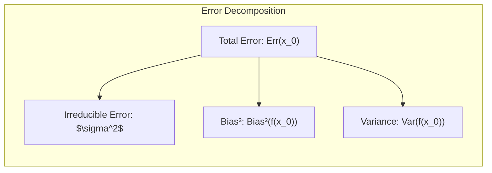
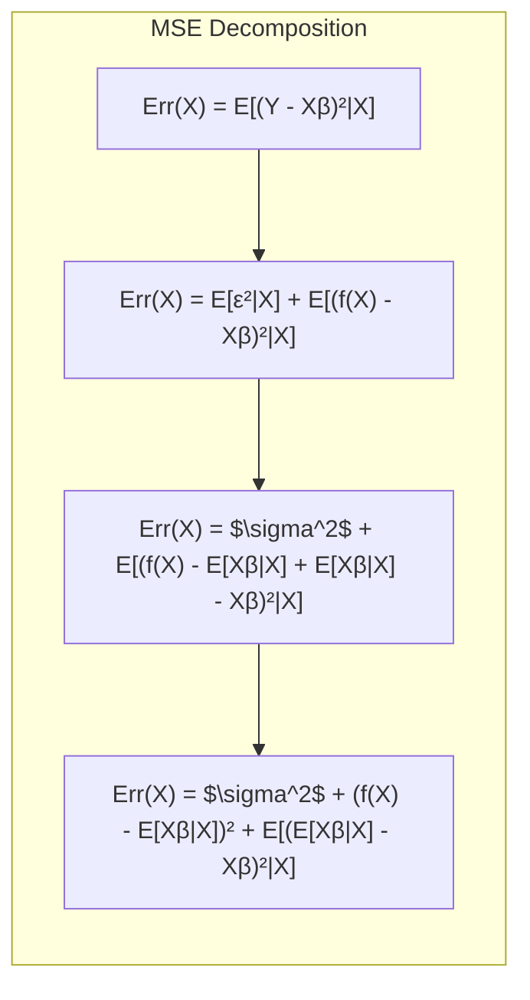
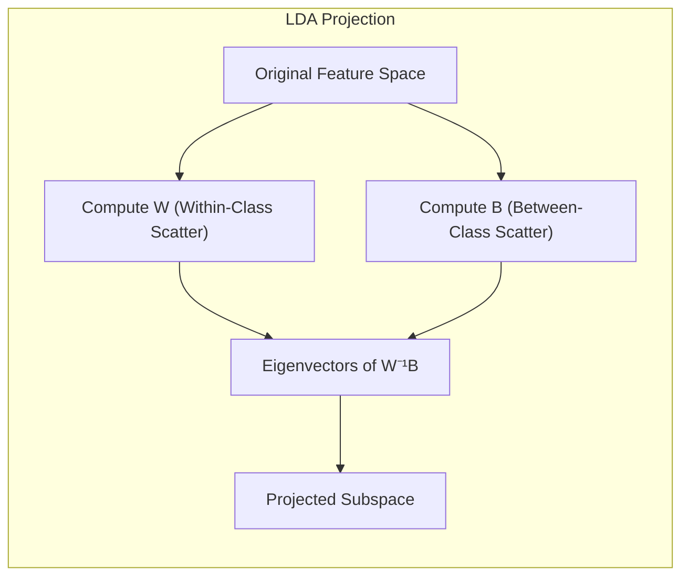
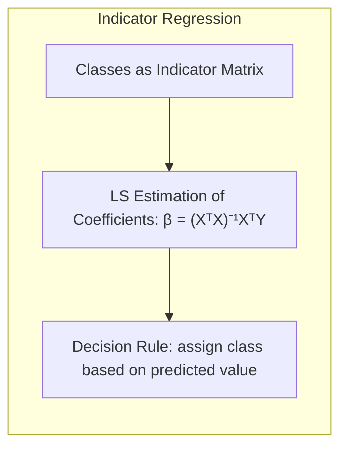
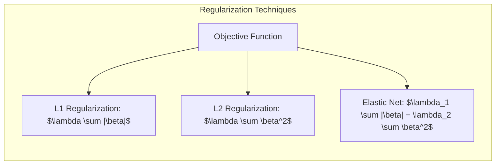
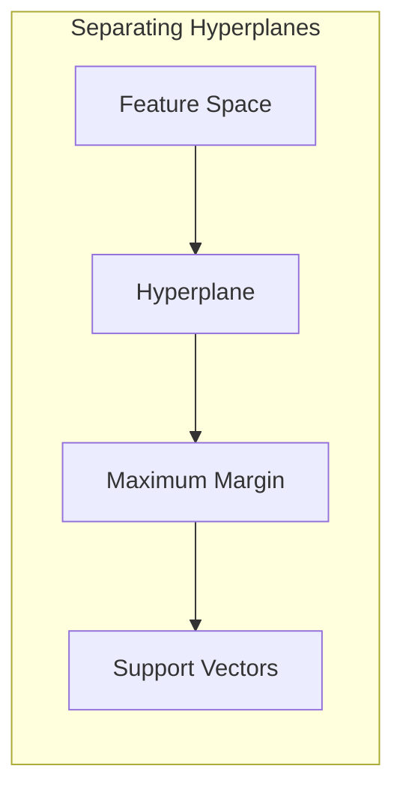

## Avaliação e Seleção de Modelos Lineares: Viés, Variância e Complexidade



### Introdução

A avaliação da performance de um modelo de aprendizado está intrinsecamente ligada à sua capacidade de generalização, ou seja, de fazer previsões precisas em dados que não foram usados no treinamento. Esta capacidade é crucial na prática, pois orienta a escolha do método de aprendizado ou modelo apropriado, além de quantificar a qualidade do modelo selecionado [^7.1]. Este capítulo aborda os principais métodos para avaliar essa performance e como eles podem ser aplicados para selecionar os modelos mais adequados. Iniciamos com uma análise da interação entre viés, variância e complexidade do modelo [^7.1].

### Conceitos Fundamentais

**Conceito 1: Erro de Generalização e a Decomposição do Erro**

O **erro de generalização**, ou **test error**, é a métrica que quantifica a capacidade de um modelo de aprendizado em prever com precisão dados independentes que não foram utilizados no processo de treinamento. Em termos matemáticos, dado um modelo $f(X)$ treinado em um conjunto de dados de treinamento $T$, o erro de generalização pode ser definido como:

$$
Err_T = E[L(Y, f(X))|T]
$$

onde $L(Y, f(X))$ é a função de perda que quantifica a diferença entre o valor verdadeiro $Y$ e a predição do modelo $f(X)$ e a esperança é tomada sobre a distribuição conjunta da população [^7.2].

O erro de generalização pode ser decomposto em três componentes: **viés**, **variância** e **ruído irredutível**, um conceito crucial para entender o compromisso entre complexidade do modelo e generalização [^7.3].  O ruído irredutível $\sigma^2$ é a variância do target $Y$ em torno de sua média verdadeira $f(X)$ e não pode ser reduzido por nenhum modelo, a menos que $\sigma^2=0$. O viés $Bias(f(X))$ é a diferença entre a média das predições do modelo e o valor verdadeiro do target, enquanto a variância $Var(f(X))$ é a variabilidade das predições do modelo em torno de sua média. Matematicamente, essa decomposição é expressa por [^7.3]:

$$
Err(x_0) = \sigma^2 + Bias^2(f(x_0)) + Var(f(x_0))
$$

onde $x_0$ representa um ponto de input. O objetivo é minimizar $Err(x_0)$, mas a minimização do viés geralmente leva a um aumento da variância e vice-versa.

> 💡 **Exemplo Numérico:** Imagine que estamos tentando prever o preço de casas ($Y$) com base em seu tamanho ($X$). Suponha que a relação verdadeira seja $Y = 2X + 5 + \epsilon$, onde $\epsilon$ é um ruído aleatório com $\sigma^2 = 1$. Se usarmos um modelo muito simples, como $f(X) = X + 2$, teremos um viés alto. Se usarmos um modelo muito complexo, como um polinômio de grau 10, o modelo pode se ajustar perfeitamente aos dados de treinamento (baixo viés), mas terá alta variância, ou seja, pequenas variações nos dados de treinamento levarão a grandes variações nas predições.
>
> Para quantificar, vamos simular um conjunto de dados:
> ```python
> import numpy as np
> import matplotlib.pyplot as plt
> from sklearn.linear_model import LinearRegression
> from sklearn.preprocessing import PolynomialFeatures
> from sklearn.metrics import mean_squared_error
>
> np.random.seed(42)
> X = np.sort(5 * np.random.rand(50, 1), axis=0)
> y_true = 2 * X.flatten() + 5
> y = y_true + np.random.normal(0, 1, 50) # Adding noise
>
> # Simple Model
> model_simple = LinearRegression()
> model_simple.fit(X, y)
> y_pred_simple = model_simple.predict(X)
>
> # Complex Model (Polynomial Regression)
> poly = PolynomialFeatures(degree=10)
> X_poly = poly.fit_transform(X)
> model_complex = LinearRegression()
> model_complex.fit(X_poly, y)
> y_pred_complex = model_complex.predict(X_poly)
>
> # Calculating bias and variance (approximated via repeated sampling)
> n_simulations = 100
> y_preds_simple = np.zeros((n_simulations, len(X)))
> y_preds_complex = np.zeros((n_simulations, len(X)))
>
> for i in range(n_simulations):
>   X_sample = np.sort(5 * np.random.rand(50, 1), axis=0)
>   y_sample = 2 * X_sample.flatten() + 5 + np.random.normal(0, 1, 50)
>   model_simple.fit(X_sample, y_sample)
>   y_preds_simple[i] = model_simple.predict(X_sample)
>
>   X_poly_sample = poly.fit_transform(X_sample)
>   model_complex.fit(X_poly_sample, y_sample)
>   y_preds_complex[i] = model_complex.predict(X_poly_sample)
>
>
> mean_y_pred_simple = np.mean(y_preds_simple, axis=0)
> mean_y_pred_complex = np.mean(y_preds_complex, axis=0)
>
> bias_simple = np.mean((y_true - mean_y_pred_simple)**2)
> bias_complex = np.mean((y_true - mean_y_pred_complex)**2)
>
> var_simple = np.mean(np.var(y_preds_simple, axis=0))
> var_complex = np.mean(np.var(y_preds_complex, axis=0))
>
> print(f"Simple Model Bias^2: {bias_simple:.2f}")
> print(f"Simple Model Variance: {var_simple:.2f}")
> print(f"Complex Model Bias^2: {bias_complex:.2f}")
> print(f"Complex Model Variance: {var_complex:.2f}")
>
> plt.figure(figsize=(10, 6))
> plt.scatter(X, y, color='blue', label='Dados reais')
> plt.plot(X, y_true, color='black', linestyle='-', linewidth=2, label='Função verdadeira')
> plt.plot(X, y_pred_simple, color='red', label='Modelo Simples')
> plt.plot(X, y_pred_complex, color='green', label='Modelo Complexo')
>
> plt.xlabel('Tamanho da casa (X)')
> plt.ylabel('Preço da casa (Y)')
> plt.title('Viés e Variância')
> plt.legend()
> plt.show()
> ```
> Os resultados mostrarão que o modelo simples tem um viés maior (as predições estão sistematicamente erradas), mas menor variância (as predições são mais estáveis entre diferentes amostras de treinamento), enquanto o modelo complexo tem um viés menor (as predições se aproximam da função real), mas uma variância muito maior. Este exemplo demonstra o trade-off entre viés e variância na prática.

> ⚠️ **Nota Importante**: A complexidade do modelo é um fator determinante na magnitude do viés e da variância. Modelos com alta complexidade tendem a ter baixo viés, mas alta variância, enquanto modelos com baixa complexidade tendem a ter alto viés, mas baixa variância. É fundamental encontrar um equilíbrio entre esses componentes para obter um bom desempenho de generalização [^7.2], [^7.3].

**Lemma 1: Decomposição da Esperança do Erro Quadrático**

Seja um modelo linear $f(X)=X\beta$, onde $X$ é a matriz de features e $\beta$ é o vetor de parâmetros. Ao utilizar o erro quadrático médio como função de perda, temos que:

$$
Err(X) = E[(Y-f(X))^2|X]
$$

Assumindo que $Y=f(X)+\epsilon$, com $E[\epsilon]=0$ e $Var(\epsilon)=\sigma^2$, a expressão do erro pode ser decomposta da seguinte forma:
$$
Err(X) = E[(f(X)+\epsilon - X\beta)^2|X] = E[\epsilon^2|X] + E[(f(X)-X\beta)^2|X]
$$



$$
Err(X) = \sigma^2 + E[(f(X)-E[X\beta|X]+E[X\beta|X]-X\beta)^2|X]
$$
$$
Err(X) = \sigma^2 + (f(X)-E[X\beta|X])^2 + E[(E[X\beta|X]-X\beta)^2|X]
$$
O primeiro termo $\sigma^2$ é o ruído irredutível. O segundo termo, $(f(X)-E[X\beta|X])^2$, representa o viés ao quadrado. O terceiro termo $E[(E[X\beta|X]-X\beta)^2|X]$, representa a variância do modelo. $\blacksquare$

**Conceito 2: Linear Discriminant Analysis (LDA)**

**Linear Discriminant Analysis (LDA)** é uma técnica para encontrar a combinação linear de features que melhor separa duas ou mais classes. O LDA é baseado na premissa de que os dados dentro de cada classe seguem uma distribuição normal, com média e covariância específicas por classe [^4.3]. O objetivo principal do LDA é projetar os dados para um espaço de menor dimensão, mantendo a separação entre as classes. O LDA é um classificador linear, onde a fronteira de decisão é um hiperplano, e as suposições de normalidade são cruciais para a formulação do LDA [^4.3.1]. A função discriminante do LDA para uma observação $x$ e uma classe $k$ é dada por [^4.3.3]:

$$
\delta_k(x) = x^T \Sigma^{-1} \mu_k - \frac{1}{2} \mu_k^T \Sigma^{-1} \mu_k + \log \pi_k
$$

onde $\mu_k$ é a média da classe $k$, $\Sigma$ é a matriz de covariância comum a todas as classes, e $\pi_k$ é a probabilidade a priori da classe $k$. O LDA atribui uma observação à classe que maximiza $\delta_k(x)$.

> 💡 **Exemplo Numérico:** Vamos supor um cenário de classificação com duas classes (0 e 1) e duas features ($X_1$ e $X_2$). As médias das classes são $\mu_0 = [1, 2]$ e $\mu_1 = [3, 4]$, e a matriz de covariância compartilhada é $\Sigma = \begin{bmatrix} 1 & 0.5 \\ 0.5 & 1 \end{bmatrix}$. As probabilidades a priori são $\pi_0 = 0.4$ e $\pi_1 = 0.6$. Dada uma nova observação $x = [2, 3]$, podemos calcular os discriminantes:
>
> $\text{Step 1: } \Sigma^{-1} = \frac{1}{0.75}\begin{bmatrix} 1 & -0.5 \\ -0.5 & 1 \end{bmatrix} = \begin{bmatrix} 1.33 & -0.67 \\ -0.67 & 1.33 \end{bmatrix}$
>
> $\text{Step 2: } \delta_0(x) = [2, 3] \begin{bmatrix} 1.33 & -0.67 \\ -0.67 & 1.33 \end{bmatrix} [1, 2]^T - \frac{1}{2}[1, 2] \begin{bmatrix} 1.33 & -0.67 \\ -0.67 & 1.33 \end{bmatrix} [1, 2]^T + \log(0.4) \approx -2.29$
>
> $\text{Step 3: } \delta_1(x) = [2, 3] \begin{bmatrix} 1.33 & -0.67 \\ -0.67 & 1.33 \end{bmatrix} [3, 4]^T - \frac{1}{2}[3, 4] \begin{bmatrix} 1.33 & -0.67 \\ -0.67 & 1.33 \end{bmatrix} [3, 4]^T + \log(0.6) \approx -0.46$
>
> Como $\delta_1(x) > \delta_0(x)$, a observação $x = [2, 3]$ seria classificada como pertencente à classe 1.
>
> ```python
> import numpy as np
> from numpy.linalg import inv
>
> # Dados do Exemplo
> mu_0 = np.array([1, 2])
> mu_1 = np.array([3, 4])
> Sigma = np.array([[1, 0.5], [0.5, 1]])
> pi_0 = 0.4
> pi_1 = 0.6
> x = np.array([2, 3])
>
> # Cálculos LDA
> Sigma_inv = inv(Sigma)
> delta_0 = x @ Sigma_inv @ mu_0 - 0.5 * mu_0 @ Sigma_inv @ mu_0 + np.log(pi_0)
> delta_1 = x @ Sigma_inv @ mu_1 - 0.5 * mu_1 @ Sigma_inv @ mu_1 + np.log(pi_1)
>
> print(f"Discriminante para a classe 0: {delta_0:.2f}")
> print(f"Discriminante para a classe 1: {delta_1:.2f}")
>
> if delta_1 > delta_0:
>   print("A observação pertence à classe 1")
> else:
>   print("A observação pertence à classe 0")
> ```
> Este exemplo demonstra como o LDA utiliza as informações das médias e covariâncias das classes para calcular discriminantes e classificar novas observações.

> ❗ **Ponto de Atenção**: Uma suposição fundamental do LDA é que as matrizes de covariância das classes são iguais. Quando essa suposição não é válida, uma alternativa é usar a análise discriminante quadrática (QDA). O LDA, por ser uma técnica linear, não é capaz de capturar relações complexas entre as classes, resultando em modelos com viés elevado se o limite de decisão real não for linear [^4.3.2].

**Corolário 1: Relação Entre LDA e Projeção Linear**

O LDA pode ser interpretado como um método que projeta os dados originais para um subespaço linear de menor dimensão onde as classes são mais bem separadas. A direção da projeção linear é obtida a partir dos autovetores da matriz  $W^{-1}B$, onde $W$ representa a matriz de espalhamento dentro das classes e $B$ a matriz de espalhamento entre as classes. Essa projeção linear garante a maximização da separabilidade entre as classes no novo espaço de menor dimensionalidade [^4.3.1].



**Conceito 3: Logistic Regression**

A **Logistic Regression** é um modelo estatístico utilizado para problemas de classificação binária, que modela a probabilidade de uma observação pertencer a uma determinada classe. Em vez de modelar diretamente a variável de saída (como em regressão linear), a regressão logística modela a probabilidade de pertinência a classe através de uma função sigmoidal (logit) [^4.4].  A forma da regressão logística é dada por [^4.4.1]:

$$
p(X) = \frac{1}{1+e^{-(X\beta)}}
$$

onde $p(X)$ representa a probabilidade da observação pertencer a uma determinada classe, $X$ é o vetor de features e $\beta$ é o vetor de parâmetros a serem estimados. A estimativa dos parâmetros $\beta$ é realizada por meio da maximização da verossimilhança (Maximum Likelihood Estimation - MLE) [^4.4.2].

> 💡 **Exemplo Numérico:** Suponha que temos uma feature $X$ e o modelo de regressão logística seja $p(X) = \frac{1}{1 + e^{-(2 + 1.5X)}}$. Se tivermos uma observação com $X = 1$, a probabilidade estimada de pertencer à classe 1 seria $p(1) = \frac{1}{1 + e^{-(2 + 1.5*1)}} \approx \frac{1}{1 + e^{-3.5}} \approx 0.97$. Se $X = -1$, então $p(-1) = \frac{1}{1 + e^{-(2 - 1.5)}} \approx \frac{1}{1 + e^{-0.5}} \approx 0.38$. Isto indica que observações com $X = 1$ são muito mais propensas a serem da classe 1, enquanto observações com $X = -1$ são mais propensas à classe 0.

> ✔️ **Destaque**: Tanto o LDA como a regressão logística podem ser utilizadas para classificação linear, mas a regressão logística não assume normalidade nos preditores, sendo mais flexível e adequada em muitos cenários reais [^4.4.5]. O método de otimização (maximização da verossimilhança) na regressão logística difere do LDA, e os coeficientes de regressão logística podem ser interpretados como log-odds ratios [^4.4.3], [^4.4.4].

### Regressão Linear e Mínimos Quadrados para Classificação



A regressão linear, embora originalmente concebida para problemas de regressão, pode ser adaptada para problemas de classificação através da regressão em uma matriz de indicadores. O processo consiste em codificar cada classe como um vetor binário (um "one-hot encoding"), transformando um problema de classificação em um problema de regressão. Os coeficientes são estimados usando o método de mínimos quadrados, e uma regra de decisão é usada para atribuir cada observação a uma das classes.

A abordagem de regressão de indicadores tem suas limitações [^4.2]. Em cenários com mais de duas classes, a regressão de indicadores pode levar a fronteiras de decisão menos eficientes se comparadas com outros métodos como LDA ou regressão logística. Além disso, as predições obtidas através da regressão de indicadores podem extrapolar para valores fora do intervalo [0,1], dificultando a interpretação das saídas como probabilidades.

**Lemma 2: Equivalência com LDA sob Hipóteses Específicas**
Sob condições específicas, a regressão de indicadores é equivalente à projeção linear obtida por LDA, ou seja, as projeções nos hiperplanos de decisão gerados por ambos os métodos são as mesmas. Considere um problema de classificação binária, onde as classes são codificadas como $Y_i \in \{0, 1\}$. A regressão de indicadores busca um vetor de coeficientes $\beta$ que minimiza a soma dos erros quadrados: $\sum_{i=1}^N (Y_i - X_i\beta)^2$. Ao resolver este problema, obtém-se $\beta = (X^T X)^{-1} X^T Y$.

No LDA, a direção da projeção é dada pelo vetor $W^{-1}(\mu_1-\mu_0)$, onde $W$ é a matriz de covariância dentro da classe e $\mu_1$ e $\mu_0$ são as médias das classes. Sob certas condições, como classes com mesmo número de observações e matrizes de covariância idênticas, as projeções nos hiperplanos de decisão da regressão de indicadores e do LDA são equivalentes, indicando a semelhança matemática entre essas duas abordagens em determinadas situações.
$\blacksquare$

**Corolário 2: Relação com Funções Discriminantes Lineares**

Em problemas de classificação binária, é possível demonstrar que a regressão de indicadores se conecta com as funções discriminantes lineares. A função discriminante linear obtida através da regressão de indicadores para uma observação $x$ pode ser escrita como $f(x) = x^T \beta$. Ao compararmos com a função discriminante do LDA, $\delta_k(x) = x^T \Sigma^{-1} \mu_k - \frac{1}{2} \mu_k^T \Sigma^{-1} \mu_k + \log \pi_k$, notamos que o termo $x^T \beta$ da regressão de indicadores pode ser interpretado como uma projeção linear que busca maximizar a separação entre as classes, similar ao objetivo do LDA. Em muitos casos, o termo $\beta$ pode ser interpretado como uma transformação do espaço original de features que maximiza a separabilidade linear, conectando, assim, as duas abordagens.

Em certas circunstâncias, a regressão de indicadores pode levar a estimativas menos estáveis em comparação com outros métodos como a regressão logística. Em casos onde as classes são bem separadas, a regressão de indicadores, embora possa ser mais simples, ainda consegue obter bons resultados, especialmente quando o foco principal é a fronteira de decisão linear.

### Métodos de Seleção de Variáveis e Regularização em Classificação



A seleção de variáveis e a regularização são técnicas cruciais para a construção de modelos de classificação robustos e com boa capacidade de generalização, especialmente quando há um grande número de features.

A regularização, em particular, busca controlar a complexidade do modelo através da adição de termos de penalidade à função de custo, mitigando o risco de overfitting. A regularização L1 (Lasso) penaliza a soma dos valores absolutos dos coeficientes [^4.4.4], promovendo a sparsity na solução, ou seja, induzindo muitos coeficientes a zero, resultando em modelos mais interpretáveis e menos propensos a overfitting. A regularização L2 (Ridge) penaliza a soma dos quadrados dos coeficientes, promovendo a estabilidade do modelo através da redução da magnitude dos coeficientes. Uma combinação dessas penalidades, conhecida como Elastic Net, busca balancear os benefícios da sparsity da L1 e da estabilidade da L2 [^4.5].

A implementação da regularização em modelos de classificação, como a regressão logística, envolve a inclusão de um termo de penalização na função de verossimilhança. Por exemplo, o problema de otimização para a regressão logística com regularização L1 pode ser escrito como [^4.4.4]:

$$
\text{min}_{\beta} \left\{ - \sum_{i=1}^{N} [y_i \log(p(x_i)) + (1-y_i)\log(1-p(x_i))] + \lambda \sum_{j=1}^p |\beta_j| \right\}
$$

onde $\lambda$ é o parâmetro de regularização, que controla a intensidade da penalidade.

> 💡 **Exemplo Numérico:** Vamos considerar a regressão logística para um problema de classificação binária com 3 features. O modelo sem regularização pode ter parâmetros $\beta = [2, -1, 0.5]$. Aplicando a regularização L1, com $\lambda = 0.5$, alguns coeficientes podem ser reduzidos a zero. A nova solução pode ser $\beta_{L1} = [1.2, 0, 0]$. Aplicando a regularização L2, a solução pode ser $\beta_{L2} = [1.8, -0.8, 0.4]$. Veja o exemplo abaixo usando `sklearn`:
>
> ```python
> import numpy as np
> from sklearn.linear_model import LogisticRegression
> from sklearn.preprocessing import StandardScaler
> from sklearn.model_selection import train_test_split
> from sklearn.metrics import accuracy_score
> import pandas as pd
>
> # Criar um dataset de exemplo
> np.random.seed(42)
> n_samples = 100
> X = np.random.rand(n_samples, 3)
> y = (X[:, 0] + 2 * X[:, 1] - 1.5 * X[:, 2] + np.random.randn(n_samples) > 0).astype(int)
>
> # Dividir dados em treino e teste
> X_train, X_test, y_train, y_test = train_test_split(X, y, test_size=0.3, random_state=42)
>
> # Padronizar as features
> scaler = StandardScaler()
> X_train_scaled = scaler.fit_transform(X_train)
> X_test_scaled = scaler.transform(X_test)
>
> # Modelo sem regularização
> model_no_reg = LogisticRegression(penalty=None)
> model_no_reg.fit(X_train_scaled, y_train)
> y_pred_no_reg = model_no_reg.predict(X_test_scaled)
>
> # Modelo com regularização L1 (Lasso)
> model_l1 = LogisticRegression(penalty='l1', solver='liblinear', C=1.0) # C = 1/lambda
> model_l1.fit(X_train_scaled, y_train)
> y_pred_l1 = model_l1.predict(X_test_scaled)
>
> # Modelo com regularização L2 (Ridge)
> model_l2 = LogisticRegression(penalty='l2', C=1.0) # C = 1/lambda
> model_l2.fit(X_train_scaled, y_train)
> y_pred_l2 = model_l2.predict(X_test_scaled)
>
> # Imprimir os coeficientes e a acurácia
> print("Coeficientes (Sem Regularização):", model_no_reg.coef_)
> print("Coeficientes (Regularização L1):", model_l1.coef_)
> print("Coeficientes (Regularização L2):", model_l2.coef_)
> print("Acurácia (Sem Regularização):", accuracy_score(y_test, y_pred_no_reg))
> print("Acurácia (Regularização L1):", accuracy_score(y_test, y_pred_l1))
> print("Acurácia (Regularização L2):", accuracy_score(y_test, y_pred_l2))
>
> # Tabela para comparacao
> comparison_data = {
>   "Method": ["No Regularization", "L1 (Lasso)", "L2 (Ridge)"],
>   "Accuracy": [accuracy_score(y_test, y_pred_no_reg), accuracy_score(y_test, y_pred_l1), accuracy_score(y_test, y_pred_l2)],
>   "Coefficients": [model_no_reg.coef_[0].round(2), model_l1.coef_[0].round(2), model_l2.coef_[0].round(2)]
> }
>
> comparison_table = pd.DataFrame(comparison_data)
> print("\nComparison Table:")
> print(comparison_table)
> ```
> A saída mostrará como a regularização L1 zera coeficientes (promovendo sparsity) e a L2 reduz a magnitude dos coeficientes.

**Lemma 3: Efeito da Penalização L1 em Coeficientes**

Em regressão logística com penalização L1, a minimização da função de custo com o termo de penalização leva a coeficientes esparsos. A penalidade L1, ao ser adicionada à função de verossimilhança, promove o encolhimento de coeficientes em direção a zero, e alguns coeficientes podem se tornar exatamente zero. Essa propriedade da L1 é dada pela natureza da penalidade, que possui uma derivada não-contínua em zero, levando os coeficientes a serem "empurrados" para zero durante o processo de otimização.

**Prova do Lemma 3:**
A penalidade L1 adiciona $\lambda \sum_{j=1}^{p}|\beta_j|$ à função de custo da regressão logística. Para coeficientes não nulos ($\beta_j \neq 0$), a derivada do termo de penalização com relação a $\beta_j$ é $\lambda \text{sign}(\beta_j)$, onde $\text{sign}$ é a função sinal. A otimização da função de custo busca encontrar um mínimo, e um coeficiente se torna exatamente zero se sua derivada parcial na função de custo, antes da penalização L1, for menor que $\lambda$ em valor absoluto. Quando um coeficiente é nulo, a sua influência na predição do modelo é eliminada, produzindo um modelo mais simples e interpretável.
$\blacksquare$

**Corolário 3: Interpretabilidade e Seleção de Features**

O Lemma 3 implica que a penalização L1 não só controla o overfitting, mas também atua como um mecanismo de seleção de variáveis, uma vez que muitos dos coeficientes da regressão logística com L1 se tornam zero. Isto facilita a identificação das features mais importantes para a predição, já que apenas os coeficientes não nulos são relevantes para o modelo. Esta propriedade é muito útil em cenários com um número elevado de features, onde é desejável obter modelos mais parsimoniosos [^4.4.5].

> ⚠️ **Ponto Crucial**: A escolha entre regularização L1, L2 ou Elastic Net, bem como o ajuste do parâmetro de regularização, depende da natureza do problema, da complexidade dos dados e dos objetivos específicos do problema de classificação. A validação cruzada, conforme mencionado mais adiante neste capítulo, pode auxiliar na escolha do método mais adequado de regularização e na otimização do parâmetro correspondente [^4.5].

### Separating Hyperplanes e Perceptrons



A busca por hiperplanos de separação, ou **separating hyperplanes**, é uma abordagem fundamental em problemas de classificação. Um hiperplano é uma generalização de uma linha (em duas dimensões) para espaços de maiores dimensões, onde ele separa o espaço de features em regiões distintas, cada uma correspondente a uma classe diferente. O problema de encontrar o hiperplano ótimo para separação envolve a maximização da margem, ou seja, a distância entre o hiperplano e os pontos de treinamento mais próximos [^4.5.2].

O problema de otimização para encontrar o hiperplano separador com margem máxima pode ser formulado como um problema de programação quadrática, com restrições lineares. A solução ótima para este problema pode ser obtida utilizando o dual de Wolfe, onde a solução é escrita em termos de combinações lineares dos pontos de suporte, ou seja, os pontos de treinamento que são cruciais para a determinação do hiperplano.

O Perceptron de Rosenblatt é um algoritmo que busca encontrar um hiperplano separador por meio de ajustes iterativos. Sob condições de separabilidade linear, o Perceptron converge para um hiperplano que separa as classes corretamente [^4.5.1]. No entanto, o Perceptron pode não convergir se os dados não forem linearmente separáveis.

### Pergunta Teórica Avançada (Exemplo): Quais as diferenças fundamentais entre a formulação de LDA e a Regra de Decisão Bayesiana considerando distribuições Gaussianas com covariâncias iguais?

**Resposta:**

A **Regra de Decisão Bayesiana**, sob a hipótese de distribuições Gaussianas para as classes, define a regra de classificação que minimiza a probabilidade de erro. Essa regra atribui uma observação $x$ à classe $k$ que maximiza a probabilidade condicional posterior $P(G=k|X=x)$, dada por:

$$
P(G=k|X=x) = \frac{P(X=x|G=k)P(G=k)}{P(X=x)}
$$

onde $P(X=x|G=k)$ é a densidade de probabilidade condicional da observação $x$ na classe $k$ e $P(G=k)$ é a probabilidade a priori da classe $k$.

Sob a suposição de que as densidades condicionais são Gaussianas e que todas as classes compartilham a mesma matriz de covariância $\Sigma$, temos que $P(X=x|G=k) = \frac{1}{(2\pi)^{p/2}|\Sigma|^{1/2}}exp(-\frac{1}{2}(x-\mu_k)^T\Sigma^{-1}(x-\mu_k))$, onde $\mu_k$ é a média da classe $k$ e $p$ é