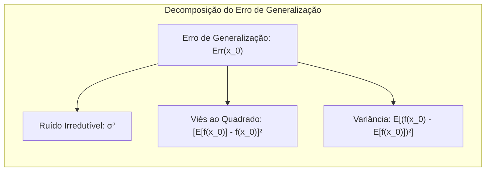
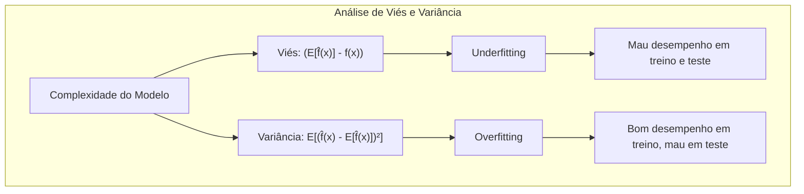
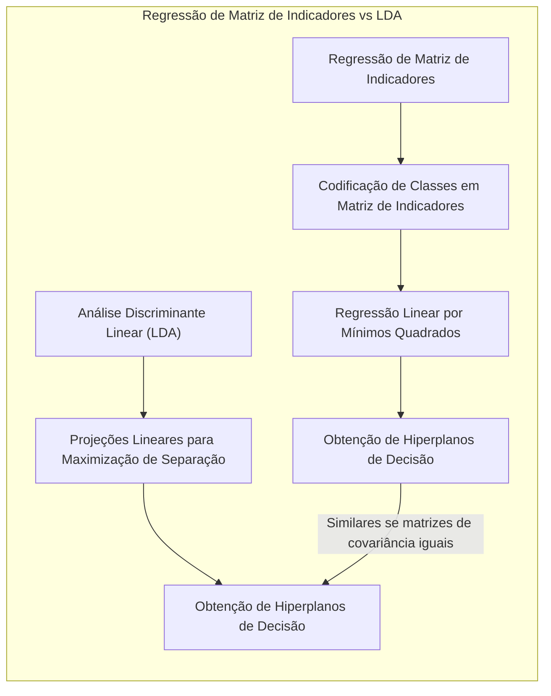
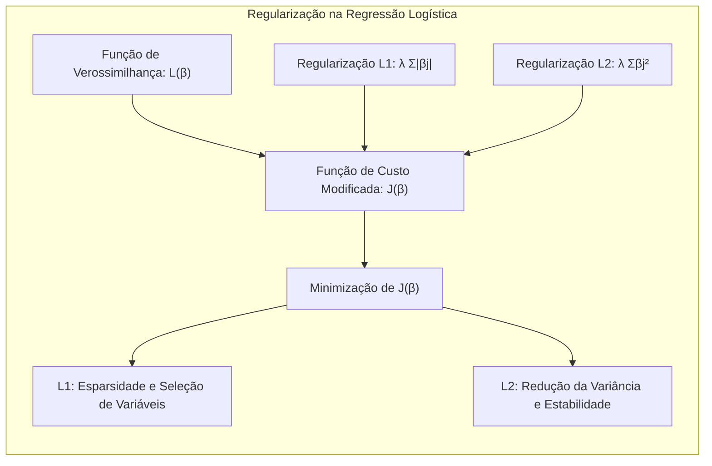
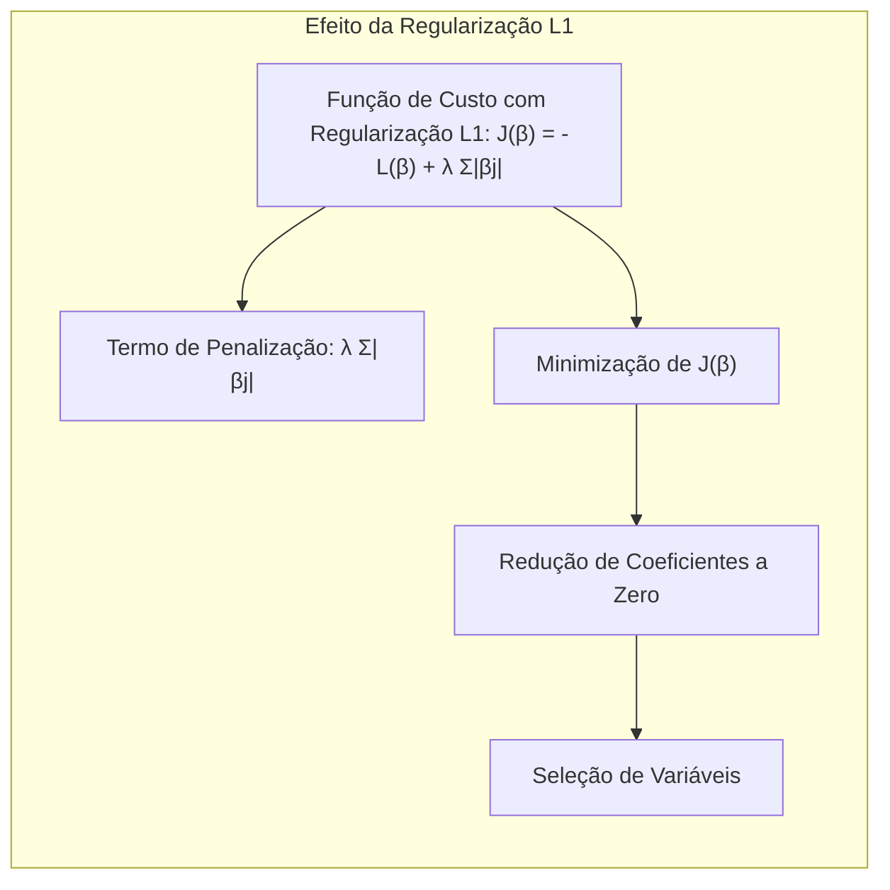

## O Dilema Viés-Variância: Uma Análise Profunda em Modelos de Aprendizado Estatístico

<imagem: Um diagrama complexo que ilustra o compromisso entre viés e variância, mostrando como a complexidade do modelo influencia esses componentes e, consequentemente, o erro de generalização. Inclua curvas de erro de treinamento e teste com seus comportamentos esperados em função da complexidade.>

### Introdução

A capacidade de um modelo de aprendizado estatístico generalizar para dados não vistos é fundamental para seu sucesso em aplicações práticas. O conceito de **generalização** refere-se à performance do modelo em dados independentes dos usados no treinamento [^7.1]. Avaliar essa performance é crucial, pois orienta a escolha do método de aprendizado ou modelo e fornece uma medida da qualidade do modelo escolhido [^7.1]. Este capítulo explora métodos essenciais para essa avaliação, focando especialmente na interação entre viés, variância e complexidade do modelo [^7.1]. Em particular, esta seção apresenta uma visão geral sobre o "bias-variance tradeoff" e como ele influencia a seleção e avaliação de modelos de aprendizado estatístico, baseando-se fortemente no material fornecido, com ênfase no tópico [^7.2].

### Conceitos Fundamentais

**Conceito 1: Erro de Generalização** O objetivo primário de um modelo de aprendizado estatístico é minimizar o **erro de generalização**, ou seja, seu desempenho em dados não vistos durante o treinamento [^7.1]. Este erro pode ser medido por uma **função de perda** que quantifica a discrepância entre os valores preditos pelo modelo e os valores verdadeiros. Usualmente, são utilizados o **erro quadrático** ou o **erro absoluto** [^7.2]. O erro quadrático é dado por $$L(Y, f(X)) = (Y - f(X))^2$$ [^7.2]. Modelos lineares, embora mais simples, podem sofrer de um alto viés quando a relação entre as variáveis não é linear, enquanto modelos complexos podem ter alta variância, sendo muito sensíveis aos dados de treinamento. A escolha apropriada da complexidade do modelo busca minimizar o erro de generalização, encontrando um equilíbrio entre viés e variância [^7.2].

> 💡 **Exemplo Numérico:**
> Considere um conjunto de dados com uma relação não linear entre a variável de entrada $X$ e a variável de saída $Y$. Vamos simular alguns dados para ilustrar.
> ```python
> import numpy as np
> import matplotlib.pyplot as plt
>
> np.random.seed(42)
> X = np.sort(5 * np.random.rand(80, 1), axis=0)
> y = np.sin(X).ravel() + np.random.normal(0, 0.2, len(X))
>
> X_test = np.sort(5 * np.random.rand(50, 1), axis=0)
> y_test = np.sin(X_test).ravel() + np.random.normal(0, 0.2, len(X_test))
>
>
> plt.figure(figsize=(10, 6))
> plt.scatter(X, y, color="darkorange", label="Dados de treinamento")
> plt.scatter(X_test, y_test, color="green", label="Dados de teste", alpha=0.5)
> plt.xlabel("X")
> plt.ylabel("Y")
> plt.title("Dados de Treinamento e Teste")
> plt.legend()
> plt.show()
>
>
> ```
> Agora, vamos ajustar dois modelos: um modelo linear (simples) e um modelo polinomial de grau 7 (complexo) a esses dados.
>
> ```python
> from sklearn.linear_model import LinearRegression
> from sklearn.preprocessing import PolynomialFeatures
> from sklearn.metrics import mean_squared_error
>
> # Modelo Linear
> linear_reg = LinearRegression()
> linear_reg.fit(X, y)
> y_pred_linear = linear_reg.predict(X)
> y_pred_linear_test = linear_reg.predict(X_test)
> mse_linear_train = mean_squared_error(y, y_pred_linear)
> mse_linear_test = mean_squared_error(y_test, y_pred_linear_test)
>
> # Modelo Polinomial (Grau 7)
> poly = PolynomialFeatures(degree=7)
> X_poly = poly.fit_transform(X)
> X_poly_test = poly.transform(X_test)
> poly_reg = LinearRegression()
> poly_reg.fit(X_poly, y)
> y_pred_poly = poly_reg.predict(X_poly)
> y_pred_poly_test = poly_reg.predict(X_poly_test)
> mse_poly_train = mean_squared_error(y, y_pred_poly)
> mse_poly_test = mean_squared_error(y_test, y_pred_poly_test)
>
> print(f'MSE Linear (treino): {mse_linear_train:.3f}')
> print(f'MSE Linear (teste): {mse_linear_test:.3f}')
> print(f'MSE Polinomial (treino): {mse_poly_train:.3f}')
> print(f'MSE Polinomial (teste): {mse_poly_test:.3f}')
>
>
> plt.figure(figsize=(10, 6))
> plt.scatter(X, y, color="darkorange", label="Dados de treinamento")
> plt.plot(X, y_pred_linear, color="blue", label="Modelo Linear")
> plt.plot(X, y_pred_poly, color="red", label="Modelo Polinomial")
>
> plt.xlabel("X")
> plt.ylabel("Y")
> plt.title("Comparação de Modelos")
> plt.legend()
> plt.show()
> ```
> Observamos que o modelo linear tem um erro maior nos dados de treinamento e teste, indicando um alto viés (underfitting), enquanto o modelo polinomial de grau 7 se ajusta muito bem aos dados de treinamento, mas tem um erro maior nos dados de teste (overfitting), indicando alta variância.

**Lemma 1:** Em problemas de regressão com erro quadrático, a decomposição do erro de generalização em viés e variância é uma ferramenta útil para entender o comportamento de diferentes modelos [^7.3]. O erro de generalização $Err(x_0)$ para um ponto de entrada $x_0$ pode ser decomposto da seguinte forma:
$$Err(x_0) = E[(Y - f(x_0))^2|X = x_0] = \sigma^2 + [Ef(x_0) - f(x_0)]^2 + E[f(x_0) - Ef(x_0)]^2$$
onde $\sigma^2$ representa a variância do ruído, $[Ef(x_0) - f(x_0)]^2$ é o **viés ao quadrado**, e $E[f(x_0) - Ef(x_0)]^2$ é a **variância**. Essa decomposição é fundamental para entender o compromisso entre viés e variância [^7.3].


> 💡 **Exemplo Numérico:**
> Para ilustrar a decomposição do erro, vamos considerar um cenário simplificado com um modelo de regressão linear. Suponha que a verdadeira relação entre $X$ e $Y$ seja dada por $Y = 2X + 3 + \epsilon$, onde $\epsilon$ é um ruído com média 0 e variância $\sigma^2 = 1$.
>
> Vamos gerar alguns dados com ruído e treinar um modelo de regressão linear $\hat{f}(X) = \hat{\beta_1}X + \hat{\beta_0}$:
> ```python
> import numpy as np
> from sklearn.linear_model import LinearRegression
>
> np.random.seed(42)
> X = np.random.rand(50, 1) * 5
> y = 2 * X.ravel() + 3 + np.random.normal(0, 1, len(X))
>
> model = LinearRegression()
> model.fit(X, y)
>
> beta_1 = model.coef_[0]
> beta_0 = model.intercept_
>
> print(f"Coeficiente angular estimado (beta_1): {beta_1:.2f}")
> print(f"Intercepto estimado (beta_0): {beta_0:.2f}")
>
> ```
> Agora, vamos considerar um ponto específico $x_0 = 2$. O valor verdadeiro de $Y$ neste ponto seria $y_0 = 2 * 2 + 3 = 7$.
> Uma predição do nosso modelo linear seria $\hat{f}(2) = \hat{\beta_1} * 2 + \hat{\beta_0} $. Vamos considerar um exemplo onde $\hat{\beta_1} = 2.1$ e $\hat{\beta_0} = 2.8$. Então $\hat{f}(2) = 2.1 * 2 + 2.8 = 7.0$.
>
>  Para calcular o viés, precisamos considerar o valor esperado da predição $E[\hat{f}(x_0)]$. Suponha que após repetir o experimento de treinamento várias vezes, a média das predições seja $E[\hat{f}(2)] = 6.9$. Então o viés ao quadrado é:
>
> $$ \text{Viés}^2 = [E[\hat{f}(2)] - y_0]^2 = (6.9 - 7)^2 = 0.01 $$
>
> Para calcular a variância, precisamos considerar a variabilidade das predições em torno de sua média $E[\hat{f}(x_0)]$. Vamos assumir que a variância das predições em torno da média seja $E[(\hat{f}(2) - E[\hat{f}(2)])^2]= 0.2$.
>
> Então, o erro de generalização $Err(2)$ é:
> $$ Err(2) = \sigma^2 + \text{Viés}^2 + \text{Variância} = 1 + 0.01 + 0.2 = 1.21 $$
>
> Este exemplo ilustra como o erro de generalização pode ser decomposto em viés, variância e ruído irredutível.

**Conceito 2: Análise de Viés e Variância** A **análise de viés e variância** é um método para entender a capacidade de um modelo de aprendizado estatístico generalizar. O viés refere-se à diferença entre o valor médio predito pelo modelo e o valor verdadeiro que o modelo tenta aprender [^7.3]. Um modelo com alto viés tende a simplificar excessivamente a relação entre as variáveis, levando a um mau desempenho em dados de treinamento e teste. A variância, por outro lado, descreve o quanto as predições do modelo variam quando treinadas com diferentes conjuntos de dados [^7.3]. Modelos com alta variância tendem a se ajustar demais aos dados de treinamento, levando a um bom desempenho no treinamento, mas um mau desempenho em dados não vistos. A complexidade do modelo influencia diretamente este balanço: modelos mais complexos tendem a ter menor viés, mas maior variância [^7.2].


**Corolário 1:** A complexidade do modelo tem um impacto direto na decomposição do erro em viés e variância. Modelos mais complexos, como redes neurais profundas com muitos parâmetros ou modelos de regressão com muitos termos, podem ter um viés muito baixo nos dados de treinamento, adaptando-se perfeitamente às relações nos dados usados para otimização, mas podem exibir uma alta variância, sendo muito sensíveis a pequenas mudanças nos dados, como ruídos ou outliers, levando a um mau desempenho na generalização para dados não vistos. Modelos mais simples, como modelos lineares, podem ter um viés maior, mas menos variância, tendo um desempenho mais constante em diferentes conjuntos de dados [^7.2].

> 💡 **Exemplo Numérico:**
> Imagine que temos um modelo linear simples, $f(x) = \beta_0 + \beta_1 x$, e um modelo polinomial complexo, $g(x) = \beta_0 + \beta_1 x + \beta_2 x^2 + \ldots + \beta_{10} x^{10}$.
>
> 1. **Alto Viés (Modelo Linear Simples):**
>   -  Se a relação verdadeira entre $x$ e $y$ for uma curva, o modelo linear não será capaz de capturar essa curvatura.
>   - Ele terá um alto viés (simplifica demais a relação) e um desempenho ruim tanto nos dados de treinamento quanto nos dados de teste.
>   - O modelo linear irá underfit os dados, sendo incapaz de capturar a complexidade real da relação entre as variáveis.
>
> 2. **Alta Variância (Modelo Polinomial Complexo):**
>   - O modelo polinomial, com muitos parâmetros, pode se ajustar perfeitamente aos dados de treinamento.
>   -  Se forem fornecidos pequenos conjuntos de dados, o polinômio irá sobreajustar os dados de treinamento, se tornando sensível a ruídos e flutuações.
>   -  Como resultado, o modelo terá um bom desempenho em dados de treinamento, mas um mau desempenho em dados de teste, apresentando uma alta variância.
>   -  O modelo polinomial irá overfit os dados, se tornando sensível a dados específicos de treinamento.
>
> Em resumo, o modelo linear tem um viés alto e variância baixa, enquanto o modelo polinomial tem um viés baixo e variância alta. O ideal seria encontrar um modelo com um balanço adequado entre viés e variância, que capture a complexidade da relação subjacente sem se tornar excessivamente sensível aos dados específicos de treinamento.

**Conceito 3: Regressão Linear e o Dilema Viés-Variância** Na regressão linear, a complexidade do modelo é diretamente relacionada ao número de parâmetros. Modelos com poucos parâmetros (poucas variáveis preditoras) tendem a ter alto viés, pois simplificam demais as relações entre as variáveis [^7.2]. Por outro lado, modelos com muitos parâmetros tendem a ter baixa viés nos dados de treinamento, mas podem ter alta variância, generalizando mal para novos dados. A escolha adequada do número de parâmetros (seleção de variáveis) é crucial para equilibrar viés e variância, e alcançar o melhor desempenho de generalização [^7.2].

> 💡 **Exemplo Numérico:**
> Considere um modelo de regressão linear com duas variáveis preditoras, $x_1$ e $x_2$, e uma variável de resposta $y$.
>
> 1. **Modelo com Poucos Parâmetros (Alto Viés):**
>    - Se apenas uma variável preditora, digamos $x_1$, for usada para prever $y$, o modelo será: $\hat{y} = \beta_0 + \beta_1 x_1$.
>    - Este modelo é muito simples e não captura a influência de $x_2$ em $y$, resultando em alto viés.
>    - Se $x_2$ tiver um impacto significativo em $y$, este modelo subestimará a relação entre as variáveis.
>
> 2. **Modelo com Muitos Parâmetros (Alta Variância):**
>    - Se adicionarmos termos de interação e polinômios das variáveis preditoras, como $\hat{y} = \beta_0 + \beta_1 x_1 + \beta_2 x_2 + \beta_3 x_1^2 + \beta_4 x_2^2 + \beta_5 x_1 x_2$, teremos um modelo mais complexo.
>    - Esse modelo pode se ajustar muito bem aos dados de treinamento, mas pode ser muito sensível a pequenas variações nesses dados, levando a alta variância.
>    - Em outras palavras, ao usar uma amostra diferente dos dados de treino, os coeficientes $\beta$ poderiam mudar drasticamente, e consequentemente as predições também.
>
> A escolha do número ideal de parâmetros envolve balancear o risco de underfitting (alto viés) e overfitting (alta variância), e usualmente é feita usando métodos de validação cruzada.

> ⚠️ **Nota Importante**: A complexidade do modelo, seja pelo número de parâmetros em modelos lineares ou pela arquitetura em modelos mais complexos, afeta profundamente o balanço entre viés e variância. Modelos muito simples podem sofrer de "underfitting" devido a alto viés, enquanto modelos muito complexos podem sofrer de "overfitting" devido a alta variância. **Referência ao tópico [^7.2]**.

> ❗ **Ponto de Atenção**: A avaliação do desempenho de um modelo não deve ser feita apenas no conjunto de treinamento, pois um bom desempenho no treinamento pode não se traduzir em um bom desempenho em dados novos. Avaliar a performance em dados independentes (dados de teste) é essencial para verificar a capacidade de generalização do modelo. **Conforme indicado em [^7.2]**.

> ✔️ **Destaque**: A decomposição do erro de generalização em viés e variância fornece um entendimento profundo sobre o comportamento do modelo. A análise de viés e variância é uma ferramenta poderosa para orientar a escolha do melhor modelo para um problema específico. **Baseado no tópico [^7.3]**.

### Regressão Linear e Mínimos Quadrados para Classificação
<imagem: Diagrama ou mapa mental complexo mostrando a ligação entre a regressão de matriz de indicadores e a análise discriminante linear (LDA), com destaque para como ambas as técnicas buscam um hiperplano de decisão ótimo e como as suposições feitas por cada método afetam seus resultados. Incluir, no mapa mental, as fórmulas principais da regressão de matriz de indicadores e as relações entre os parâmetros obtidos com os parâmetros do LDA. Adicione também um exemplo de gráfico ilustrativo que mostre as fronteiras de decisão obtidas por ambos os métodos, quando aplicados a um conjunto de dados simulado.>


A regressão linear em matriz de indicadores é uma abordagem para problemas de classificação que busca construir um modelo preditivo usando a regressão linear tradicional, mas codificando a variável de resposta categórica em uma matriz de indicadores [^7.2].  Cada categoria da variável de resposta é representada por uma coluna na matriz de indicadores, e a regressão é então usada para ajustar os coeficientes de regressão para cada categoria. Em essência, a ideia é aproximar os indicadores de classe (1 ou 0) por um modelo linear. Ao fazer isso, estamos essencialmente buscando uma função discriminante linear que separa as classes, ou seja, um hiperplano de decisão.

> 💡 **Exemplo Numérico:**
> Suponha que temos um conjunto de dados com duas classes (0 e 1) e duas variáveis preditoras $x_1$ e $x_2$. A matriz de indicadores $Y$ seria uma matriz com duas colunas. Se uma observação pertencer a classe 0, a primeira coluna seria 1 e a segunda 0. Se a observação pertencer a classe 1, a primeira coluna seria 0 e a segunda 1. Vamos gerar dados e treinar o modelo.
>
> ```python
> import numpy as np
> import matplotlib.pyplot as plt
> from sklearn.linear_model import LinearRegression
>
> # Gerando dados de exemplo
> np.random.seed(42)
> X = np.random.rand(100, 2) * 5  # 100 amostras, 2 features
> y = np.array([1 if x[0] + x[1] > 5 else 0 for x in X]) # Classe 1 if x1+x2>5 else classe 0
>
> # Criando a matriz de indicadores
> Y = np.zeros((len(y), 2))
> Y[np.arange(len(y)), y] = 1
>
> # Treinando o modelo de regressão linear
> model = LinearRegression()
> model.fit(X, Y)
>
> # Função para prever a classe
> def predict_class(x, model):
>  y_pred = model.predict(x.reshape(1, -1))
>  return np.argmax(y_pred)
>
> # Plotando a fronteira de decisão
> x_min, x_max = X[:, 0].min() - 1, X[:, 0].max() + 1
> y_min, y_max = X[:, 1].min() - 1, X[:, 1].max() + 1
> xx, yy = np.meshgrid(np.arange(x_min, x_max, 0.02),
>                      np.arange(y_min, y_max, 0.02))
> Z = np.array([predict_class(np.array([x,y]), model) for x, y in np.c_[xx.ravel(), yy.ravel()]])
> Z = Z.reshape(xx.shape)
> plt.contourf(xx, yy, Z, cmap=plt.cm.RdBu, alpha=0.8)
> plt.scatter(X[:, 0], X[:, 1], c=y, cmap=plt.cm.RdBu, edgecolors='k')
> plt.title("Regressão Linear em Matriz de Indicadores")
> plt.xlabel("Feature 1 (x1)")
> plt.ylabel("Feature 2 (x2)")
> plt.show()
>
> ```
> O modelo de regressão ajusta um hiperplano para separar as classes e a cor de fundo indica a região predita pelo modelo.

**Lemma 2**: Em certas condições, os coeficientes de regressão linear para matriz de indicadores podem estar diretamente relacionados com as projeções lineares da LDA. Especificamente, se as classes tiverem a mesma matriz de covariância, as projeções dos dados nos hiperplanos de decisão gerados pela regressão linear e LDA tendem a ser semelhantes [^7.3].  A função discriminante linear, para classes $k=1,2,\ldots,K$, pode ser escrita como:
$$f_k(x) = x^T W_k + w_{k0}$$
onde $W_k$ e $w_{k0}$ são os parâmetros ajustados [^7.3]. Na regressão de indicadores, ao otimizar a soma dos quadrados dos erros, implicitamente se busca a função discriminante que melhor separa as classes, ou seja, uma projeção dos dados no espaço de características que maximiza a diferença entre os grupos [^7.2].

**Corolário 2:** A regressão de indicadores, quando combinada com uma regra de decisão que atribui a um ponto de teste a classe com a maior probabilidade predita, pode gerar fronteiras de decisão que são equivalentes ou muito próximas das obtidas via LDA, especialmente sob a suposição de matrizes de covariância iguais para todas as classes [^7.3]. Contudo, a regressão de indicadores, ao otimizar a soma dos erros quadráticos, não impõe a restrição de que as probabilidades preditas devam estar no intervalo [0,1], e podem gerar previsões fora desse intervalo.  Esta é uma das limitações da abordagem [^7.2], [^7.4].

“A regressão linear de indicadores tem algumas limitações em comparação com métodos probabilísticos como a regressão logística, especialmente quando as probabilidades devem ser interpretadas. Conforme apontado em [^7.4], a regressão logística modela diretamente as probabilidades de classe através da função logística, enquanto a regressão de indicadores não impõe essa restrição, levando a estimativas potencialmente fora do intervalo [0,1]. A regressão logística também pode ter melhor performance em cenários com classes desbalanceadas.  No entanto, a regressão de indicadores pode ser suficiente e vantajosa quando a preocupação principal é apenas obter a fronteira de decisão linear, conforme indicado em [^7.2].”

### Métodos de Seleção de Variáveis e Regularização em Classificação
<imagem: Diagrama complexo mostrando como os métodos de regularização L1 e L2 modificam a função de custo na regressão logística e como eles afetam a complexidade do modelo e o balanço viés-variância, além da relação dos mesmos com diferentes algoritmos de seleção de variáveis. Inclua, no diagrama, as fórmulas da função de custo com os termos de regularização e exemplos ilustrativos de como os coeficientes são afetados em um modelo de classificação simulado.>

A seleção de variáveis e a regularização são técnicas importantes em modelos de classificação para lidar com a alta dimensionalidade dos dados e evitar overfitting [^7.4], [^7.5]. A **regularização** adiciona um termo de penalização à função de custo, restringindo os coeficientes do modelo [^7.4], [^7.5], [^7.5.1], [^7.5.2]. Na regressão logística, a função de custo é baseada na verossimilhança, e a regularização L1 e L2 podem ser aplicadas da seguinte forma:
A função de verossimilhança para o modelo de regressão logística pode ser expressa como
$$L(\beta) = \sum [y_i \log(p(x_i)) + (1-y_i)\log(1-p(x_i))]$$ [^7.4.4]
onde $p(x_i) = \frac{1}{1 + e^{-x_i^T\beta}}$.
Para o caso da regularização L1, a função de custo modificada é expressa por:
$$ J(\beta) = -L(\beta) + \lambda  \sum_{j=1}^{p} |\beta_j| $$ [^7.4.4]
Para o caso da regularização L2, a função de custo modificada é expressa por:
$$ J(\beta) = -L(\beta) + \lambda \sum_{j=1}^{p} \beta_j^2 $$ [^7.4.4]
A **penalização L1 (Lasso)**, dada pela soma dos valores absolutos dos coeficientes, tende a zerar alguns coeficientes, promovendo a **esparsidade** e a seleção de variáveis [^7.4.4]. A **penalização L2 (Ridge)**, dada pela soma dos quadrados dos coeficientes, tende a diminuir os valores dos coeficientes, mas não necessariamente zerá-los, reduzindo a variância e melhorando a estabilidade do modelo [^7.4.4], [^7.5].

> 💡 **Exemplo Numérico:**
> Vamos demonstrar o efeito da regularização L1 (Lasso) e L2 (Ridge) na regressão logística. Para isso, vamos gerar alguns dados e aplicar diferentes valores de $\lambda$.
> ```python
> import numpy as np
> import matplotlib.pyplot as plt
> from sklearn.linear_model import LogisticRegression
> from sklearn.model_selection import train_test_split
> from sklearn.metrics import accuracy_score
>
> np.random.seed(42)
> X = np.random.rand(100, 5)  # 100 amostras, 5 features
> y = np.array([1 if x[0] + 2*x[1] - x[2] + 0.5*x[3] > 1.5 else 0 for x in X])
> X_train, X_test, y_train, y_test = train_test_split(X, y, test_size=0.3, random_state=42)
>
> # Sem regularização
> model_no_reg = LogisticRegression(penalty=None, solver='lbfgs')
> model_no_reg.fit(X_train, y_train)
> y_pred_no_reg = model_no_reg.predict(X_test)
> acc_no_reg = accuracy_score(y_test, y_pred_no_reg)
>
> # Regularização L1
> model_l1_1 = LogisticRegression(penalty='l1', C=0.5, solver='liblinear', random_state=42)
> model_l1_1.fit(X_train, y_train)
> y_pred_l1_1 = model_l1_1.predict(X_test)
> acc_l1_1 = accuracy_score(y_test, y_pred_l1_1)
>
> model_l1_2 = LogisticRegression(penalty='l1', C=0.1, solver='liblinear', random_state=42)
> model_l1_2.fit(X_train, y_train)
> y_pred_l1_2 = model_l1_2.predict(X_test)
> acc_l1_2 = accuracy_score(y_test, y_pred_l1_2)
>
>
> # Regularização L2
> model_l2_1 = LogisticRegression(penalty='l2', C=0.5, solver='lbfgs', random_state=42)
> model_l2_1.fit(X_train, y_train)
> y_pred_l2_1 = model_l2_1.predict(X_test)
> acc_l2_1 = accuracy_score(y_test, y_pred_l2_1)
>
> model_l2_2 = LogisticRegression(penalty='l2', C=0.1, solver='lbfgs', random_state=42)
> model_l2_2.fit(X_train, y_train)
> y_pred_l2_2 = model_l2_2.predict(X_test)
> acc_l2_2 = accuracy_score(y_test, y_pred_l2_2)
>
> print("Acurácia (Sem Regularização): {:.3f}".format(acc_no_reg))
> print("Acurácia (L1, C=0.5): {:.3f}".format(acc_l1_1))
> print("Acurácia (L1, C=0.1): {:.3f}".format(acc_l1_2))
> print("Acurácia (L2, C=0.5): {:.3f}".format(acc_l2_1))
> print("Acurácia (L2, C=0.1): {:.3f}".format(acc_l2_2))
>
>
> print("\nCoeficientes (Sem Regularização): {}".format(model_no_reg.coef_))
> print("Coeficientes (L1, C=0.5): {}".format(model_l1_1.coef_))
> print("Coeficientes (L1, C=0.1): {}".format(model_l1_2.coef_))
> print("Coeficientes (L2, C=0.5): {}".format(model_l2_1.coef_))
> print("Coeficientes (L2, C=0.1): {}".format(model_l2_2.coef_))
>
> ```
>
> Observamos que os modelos com penalização L1, especialmente com um valor menor de `C` (maior penalização), tem mais coeficientes iguais a zero, indicando a seleção de variáveis. Já os modelos com penalização L2 tendem a diminuir os valores dos coeficientes.

**Lemma 3:** A penalização L1 na regressão logística promove a esparsidade dos coeficientes, o que significa que ela automaticamente realiza a seleção de variáveis. O termo de penalização adicionado à função de custo, $\lambda \sum_{j=1}^{p} |\beta_j|$, influencia a solução da otimização para diminuir o número de variáveis não nulas, ou seja, os coeficientes tendem a ser zerados quando não são muito importantes para o modelo, em termos da minimização da função de custo [^7.4.4].


**Prova do Lemma 3:** A prova pode ser feita analisando as condições de otimalidade da função de custo com penalização L1. Ao resolver o problema de otimização, em que se busca o vetor de parâmetros $\beta$ que minimiza a função de custo $J(\beta)$, notamos que a penalização L1 introduz um ponto não diferenciável na origem. Este ponto não diferenciável faz com que alguns coeficientes sejam exatamente zero