## Avaliação e Seleção de Modelos: Um Estudo Detalhado Sobre o Viés Quadrático Médio

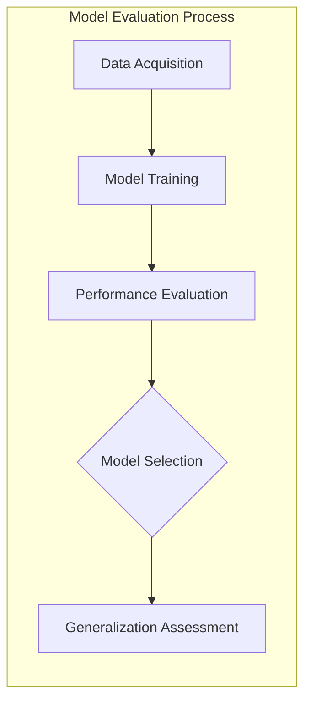

### Introdução

A **generalização** de um método de aprendizado, ou seja, sua capacidade de prever dados não vistos, é crucial na prática [^7.1]. A avaliação dessa performance orienta a escolha do método ou modelo de aprendizado e fornece uma medida da qualidade do modelo selecionado [^7.1]. Este capítulo aborda os principais métodos para avaliação da performance e como eles são utilizados na seleção de modelos, iniciando com a discussão sobre a relação entre **viés**, **variância** e **complexidade do modelo** [^7.1].

### Conceitos Fundamentais

**Conceito 1:** O problema de **classificação** busca associar um rótulo ou classe a um vetor de entrada $X$. Métodos lineares, embora mais simples, podem sofrer de **viés** (quando o modelo é muito simplista para capturar a complexidade dos dados) ou **variância** (quando o modelo se ajusta em demasia ao ruído nos dados de treino). O objetivo é encontrar um equilíbrio que minimize ambos os problemas [^7.2]. Por exemplo, um modelo linear simples pode ter um viés alto se a verdadeira relação entre as variáveis for não linear, mas terá uma baixa variância. Inversamente, um modelo muito complexo pode ter uma baixa viés nos dados de treinamento, mas apresentará alta variância, generalizando mal para novos dados [^7.2].

> 💡 **Exemplo Numérico:** Imagine que queremos classificar imagens de cachorros e gatos usando apenas a informação da cor predominante da imagem (em escala de cinza, de 0 a 255). Um modelo que simplesmente classifica imagens com cor abaixo de 128 como "gato" e acima de 128 como "cachorro" seria um modelo linear muito simples. Este modelo teria um **alto viés** porque ele ignora muitos outros fatores relevantes para a classificação (raça, formato, etc.) e cometerá muitos erros. Agora, imagine um modelo com muitos parâmetros, capaz de memorizar todas as imagens de treinamento. Este modelo teria um **baixo viés** no treinamento, mas uma **alta variância**, pois faria uma classificação ruim em novas imagens. O objetivo é encontrar um modelo que capture as características relevantes sem memorizar o ruído dos dados.

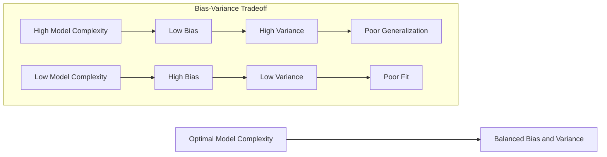

**Lemma 1:** *Em um contexto de classificação linear, a função discriminante linear pode ser decomposta em projeções sobre hiperplanos de decisão*, onde cada hiperplano representa a fronteira entre duas classes [^7.3]. Formalmente, para um classificador linear $f(x) = w^Tx + b$, podemos decompor $w$ em uma série de vetores ortonormais $\{v_1, v_2, ..., v_p\}$ que definem os hiperplanos, de modo que:
$$
f(x) = \sum_{i=1}^{p} \alpha_i v_i^T x + b
$$
onde os $\alpha_i$ são coeficientes escalares e cada termo $v_i^T x$ representa a projeção de $x$ sobre o hiperplano definido por $v_i$. A prova segue da aplicação da decomposição espectral na matriz de covariância das variáveis de entrada [^7.3.1]. $\blacksquare$
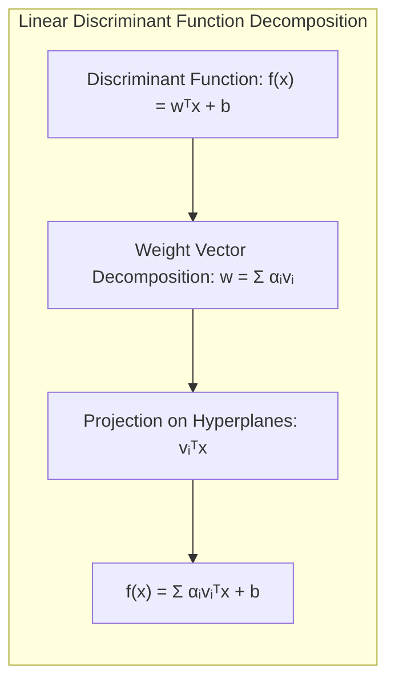
**Conceito 2:** A **Linear Discriminant Analysis (LDA)** é um método de classificação que assume a normalidade das classes e a igualdade das matrizes de covariância [^7.3]. A **fronteira de decisão** é construída de forma a maximizar a separação entre as médias das classes, considerando a dispersão dentro de cada classe [^7.3.1]. A função discriminante de LDA, para duas classes, pode ser escrita como:
$$
\delta_k(x) = x^T \Sigma^{-1}\mu_k - \frac{1}{2}\mu_k^T \Sigma^{-1}\mu_k + \log \pi_k
$$
onde $\mu_k$ é a média da classe $k$, $\Sigma$ é a matriz de covariância comum, e $\pi_k$ é a probabilidade a priori da classe $k$ [^7.3.1]. Ao assumir a igualdade das covariâncias, LDA gera fronteiras de decisão lineares [^7.3.2]. A normalidade garante que as distribuições de classes sejam unimodais e as amostras estejam relativamente bem agrupadas [^7.3.3].

> 💡 **Exemplo Numérico:** Vamos supor que temos duas classes de flores, Iris Setosa e Iris Versicolor, e que medimos duas características de cada flor: comprimento da sépala (SL) e largura da sépala (SW). Temos os seguintes dados amostrais:
>
>  * **Iris Setosa:**
>    *  $\mu_{setosa} = [5.0, 3.4]$ (médias de SL e SW)
>   *  $\Sigma = \begin{bmatrix} 0.12 & 0.09 \\ 0.09 & 0.11 \end{bmatrix}$ (matriz de covariância)
>  * **Iris Versicolor:**
>    *  $\mu_{versicolor} = [5.9, 2.7]$
>  *  Assumimos que $\Sigma$ é a mesma para ambas as classes.
>
>  A probabilidade *a priori* de cada classe é $\pi_{setosa} = \pi_{versicolor} = 0.5$. Para classificar uma nova flor $x = [5.5, 3.0]$, calculamos as funções discriminantes:
>
> $\text{Step 1: Calculate } \Sigma^{-1}$
>
> $\Sigma^{-1} = \frac{1}{(0.12*0.11 - 0.09*0.09)} \begin{bmatrix} 0.11 & -0.09 \\ -0.09 & 0.12 \end{bmatrix} = \begin{bmatrix} 15.71 & -12.86 \\ -12.86 & 17.14 \end{bmatrix}$
>
> $\text{Step 2: Calculate } \delta_{setosa}(x)$
>
> $\delta_{setosa}(x) = [5.5, 3.0] \begin{bmatrix} 15.71 & -12.86 \\ -12.86 & 17.14 \end{bmatrix}  \begin{bmatrix} 5.0 \\ 3.4 \end{bmatrix} - \frac{1}{2}[5.0, 3.4] \begin{bmatrix} 15.71 & -12.86 \\ -12.86 & 17.14 \end{bmatrix} \begin{bmatrix} 5.0 \\ 3.4 \end{bmatrix} + \log(0.5) $
> $\delta_{setosa}(x) = 8.58 - 6.04 -0.69 = 1.85$
>
> $\text{Step 3: Calculate } \delta_{versicolor}(x)$
>
> $\delta_{versicolor}(x) = [5.5, 3.0] \begin{bmatrix} 15.71 & -12.86 \\ -12.86 & 17.14 \end{bmatrix}  \begin{bmatrix} 5.9 \\ 2.7 \end{bmatrix} - \frac{1}{2}[5.9, 2.7] \begin{bmatrix} 15.71 & -12.86 \\ -12.86 & 17.14 \end{bmatrix} \begin{bmatrix} 5.9 \\ 2.7 \end{bmatrix} + \log(0.5)$
> $\delta_{versicolor}(x) = 10.72 - 8.89 - 0.69 = 1.14$
>
> Como $\delta_{setosa}(x) > \delta_{versicolor}(x)$, a flor é classificada como Iris Setosa. Este exemplo ilustra como LDA usa as médias e a covariância para definir uma fronteira linear entre as classes.
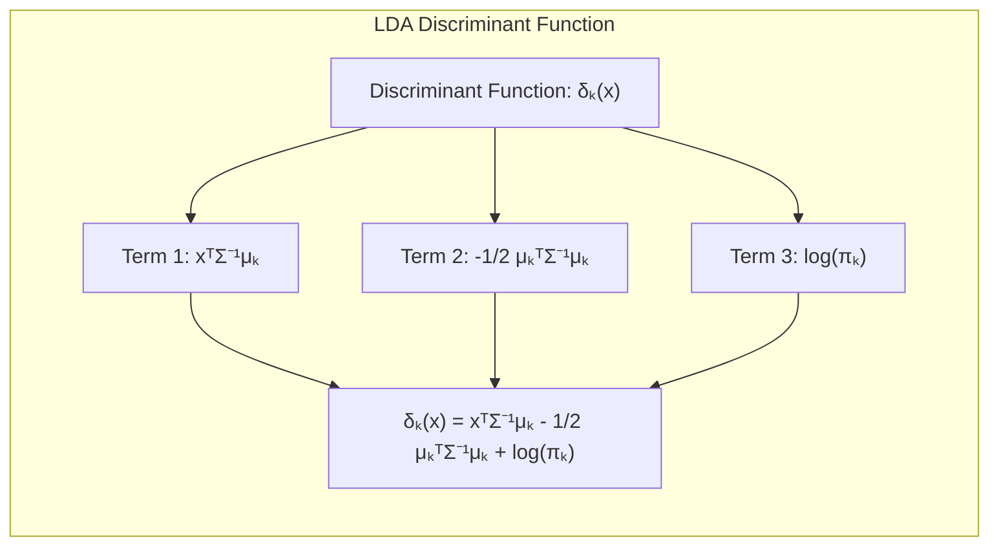
**Corolário 1:** *A função discriminante linear do LDA pode ser interpretada como uma projeção dos dados em um subespaço de menor dimensão que maximiza a separação entre classes*, sendo esse subespaço definido pela matriz de covariância inversa ponderada pelas diferenças entre médias [^7.3.1]. Este corolário se segue do Lemma 1, já que a projeção sobre um vetor $w$ define um hiperplano, e o $w$ do LDA define o hiperplano de máxima separação.
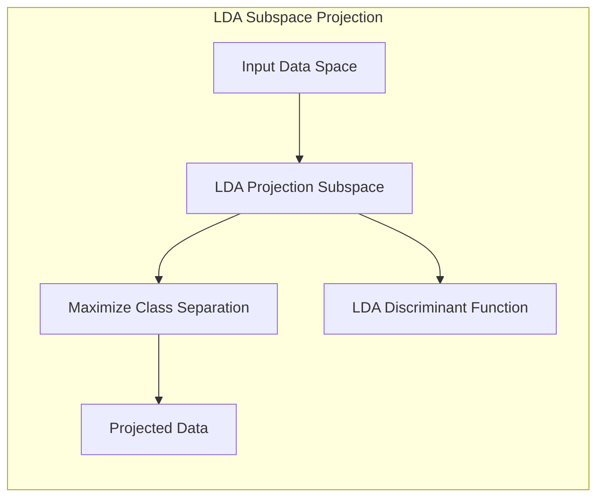

**Conceito 3:** A **Regressão Logística** é um modelo probabilístico que estima a probabilidade de uma observação pertencer a uma classe, utilizando a função **logit** para mapear uma combinação linear das variáveis de entrada na probabilidade de classe [^7.4]. A **função logit** é dada por:
$$
logit(p) = \log\left(\frac{p}{1-p}\right)
$$
onde $p$ é a probabilidade de classe. O modelo de regressão logística busca encontrar parâmetros que maximizem a **verossimilhança** dos dados [^7.4.1]. A probabilidade é modelada como:
$$
p(X) = \frac{1}{1 + e^{-(\beta_0 + \beta^T X)}}
$$
onde $\beta_0$ é o intercepto e $\beta$ são os coeficientes do modelo [^7.4.2]. Diferente do LDA, a regressão logística não assume normalidade nos dados, embora assuma que a relação com a variável resposta seja linear na escala logit [^7.4.3].

> 💡 **Exemplo Numérico:** Suponha que estamos modelando a probabilidade de um cliente comprar um produto (variável binária: 1 se comprou, 0 se não comprou) com base em sua renda (em milhares de reais). Após ajustar o modelo de regressão logística aos dados, obtivemos os seguintes coeficientes:
>
> * $\beta_0 = -3.0$ (intercepto)
> * $\beta_1 = 0.5$ (coeficiente da renda)
>
> Isso significa que a probabilidade de compra para um cliente com renda $X$ é modelada como:
>
> $$ p(X) = \frac{1}{1 + e^{-(-3.0 + 0.5X)}} $$
>
> Para um cliente com renda de 4 mil reais ($X = 4$), a probabilidade de compra seria:
>
> $p(4) = \frac{1}{1 + e^{-(-3.0 + 0.5 \times 4)}} = \frac{1}{1 + e^{-(-1)}} = \frac{1}{1 + e^{1}} \approx \frac{1}{1 + 2.718} \approx 0.269$
>
> A probabilidade estimada de que este cliente compre o produto é aproximadamente 27%.
> Para um cliente com renda de 8 mil reais ($X=8$):
>
>  $p(8) = \frac{1}{1 + e^{-(-3.0 + 0.5 \times 8)}} = \frac{1}{1 + e^{-(1)}} = \frac{1}{1 + 0.368} \approx 0.731$.
>
> A probabilidade estimada de que este cliente compre o produto é aproximadamente 73%.
>
>  A regressão logística permite estimar a probabilidade de um evento com base em uma combinação linear de variáveis, e a função logit garante que as probabilidades estimadas estejam entre 0 e 1.

> ⚠️ **Nota Importante**: A escolha da função de verossimilhança e a otimização dos parâmetros são fundamentais na regressão logística, garantindo um modelo bem ajustado aos dados [^7.4.1].

> ❗ **Ponto de Atenção**: Modelos de regressão logística podem ter um desempenho prejudicado em dados não balanceados, onde a frequência das classes é muito diferente [^7.4.2]. Técnicas de balanceamento e ponderação de classes podem ser necessárias nesses casos.

> ✔️ **Destaque**: As estimativas dos parâmetros em LDA e regressão logística podem ser similares sob certas condições, especialmente quando a diferença nas covariâncias entre as classes é pequena e as distribuições são aproximadamente normais [^7.5].
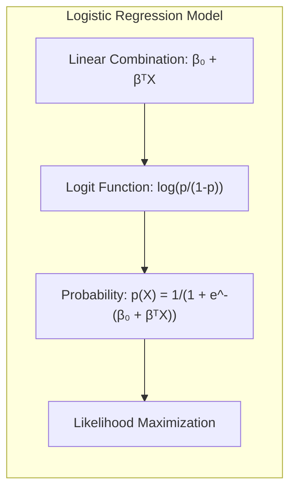

### Regressão Linear e Mínimos Quadrados para Classificação
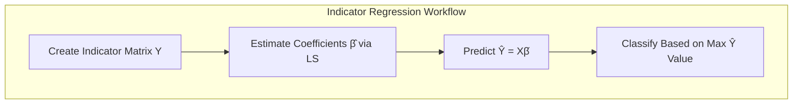
A **regressão linear** pode ser utilizada para classificação ao modelar cada classe como uma variável indicadora (dummy) [^7.2]. A **matriz de indicadores** $Y$, onde $Y_{ij} = 1$ se a observação $i$ pertence à classe $j$ e $Y_{ij}=0$ caso contrário, é usada como resposta na regressão. A solução de **mínimos quadrados** (LS) para os coeficientes do modelo é dada por:
$$
\hat{\beta} = (X^T X)^{-1}X^T Y
$$
onde $X$ é a matriz de design das variáveis de entrada. O preditor resultante $\hat{Y} = X \hat{\beta}$ fornece um valor para cada classe, e a classificação é feita atribuindo a cada observação a classe correspondente ao maior valor predito [^7.2].

Embora simples, essa abordagem pode levar a **extrapolações** fora do intervalo [0,1], dificultando a interpretação probabilística. Além disso, quando as classes não são linearmente separáveis, a regressão linear pode resultar em classificações incorretas devido ao *masking problem* onde a relação entre as variáveis indicadoras e as variáveis preditoras pode não ser adequadamente capturada [^7.3].

> 💡 **Exemplo Numérico:** Vamos considerar um problema de classificação com três classes (A, B e C) e duas variáveis preditoras ($X_1$ e $X_2$). Temos 5 observações em cada classe:
>
>  ```python
>  import numpy as np
>  from sklearn.linear_model import LinearRegression
>  
>  # Dados de entrada
>  X = np.array([[1, 2], [1.5, 1.8], [2, 2.5], [2.5, 3], [3, 3.2],
>             [4, 1], [4.5, 1.5], [5, 1.2], [5.5, 0.8], [6, 1],
>             [7, 3], [7.5, 2.5], [8, 3.5], [8.5, 2.8], [9, 3.2]])
>  
>  # Matriz indicadora
>  Y = np.array([[1, 0, 0], [1, 0, 0], [1, 0, 0], [1, 0, 0], [1, 0, 0],
>             [0, 1, 0], [0, 1, 0], [0, 1, 0], [0, 1, 0], [0, 1, 0],
>             [0, 0, 1], [0, 0, 1], [0, 0, 1], [0, 0, 1], [0, 0, 1]])
>  
>  # Regressão linear
>  model = LinearRegression()
>  model.fit(X, Y)
>  Y_hat = model.predict(X)
>
>  # Exibe os valores preditos
>  print("Valores Preditos (Y_hat):")
>  print(Y_hat)
>
>  # Classifica as amostras com base nos maiores valores preditos
>  predicted_classes = np.argmax(Y_hat, axis=1)
>  print("\nClasses Preditas:")
>  print(predicted_classes)
>
>  ```
>
>  Neste exemplo, cada linha de `Y_hat` contém os valores preditos para cada classe, e a classe predita para cada observação é dada pelo índice do maior valor em cada linha. Um problema deste método é que os valores preditos podem extrapolar o intervalo [0,1], e assim, a interpretação de probabilidade fica comprometida.

**Lemma 2:** *Sob certas condições, as projeções geradas pela regressão linear da matriz de indicadores são equivalentes às projeções encontradas em métodos discriminantes lineares*. A equivalência é válida quando as classes possuem covariâncias similares e as amostras estão concentradas em torno das suas médias [^7.2]. Em outras palavras, em situações onde os dados seguem as suposições do LDA, a regressão linear e o LDA levam a resultados similares [^7.3].
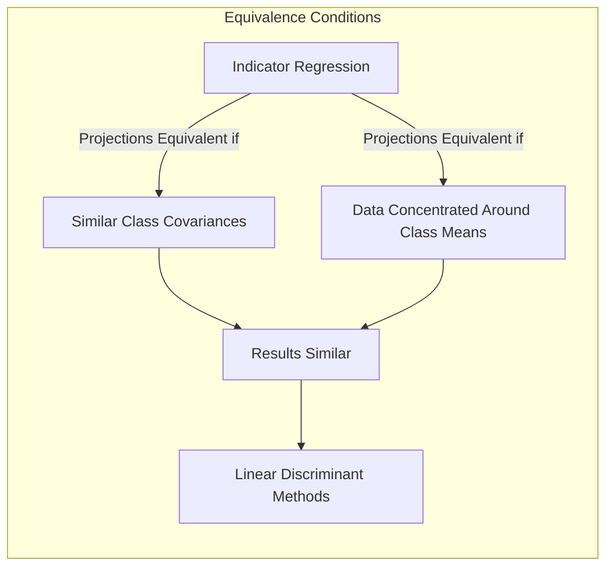
**Corolário 2:** A equivalência acima implica que, quando as condições do Lemma 2 se mantém, é possível simplificar a análise da regressão de indicadores utilizando ferramentas conceituais do LDA, como a análise das projeções nos hiperplanos de decisão [^7.3].

A regressão logística, em contraste, modela a probabilidade de classe diretamente, oferecendo estimativas mais estáveis e interpretáveis, e evita o problema de extrapolações da regressão de indicadores [^7.4]. Contudo, em situações onde a fronteira de decisão linear é o foco principal e as suposições do LDA são razoáveis, a regressão de indicadores pode ser suficiente e computacionalmente mais simples [^7.2].

### Métodos de Seleção de Variáveis e Regularização em Classificação
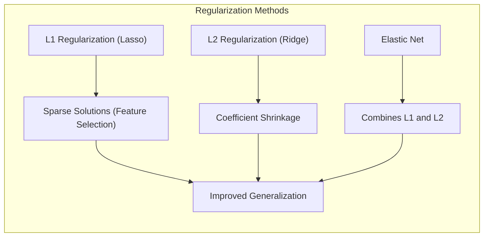
Na prática, é crucial selecionar as variáveis mais relevantes para o modelo e regularizar os parâmetros para evitar *overfitting* e melhorar a estabilidade do modelo [^7.4.4]. A **regularização L1** (Lasso) adiciona uma penalidade proporcional ao valor absoluto dos coeficientes na função de custo, levando a soluções esparsas onde alguns coeficientes são exatamente zero [^7.4.4]. Já a **regularização L2** (Ridge) adiciona uma penalidade proporcional ao quadrado dos coeficientes, reduzindo seus valores, mas não os zerando [^7.4.4]. Uma combinação de L1 e L2, conhecida como **Elastic Net**, permite explorar as vantagens de ambas as regularizações [^7.5]. A função de custo com regularização L1 na regressão logística é dada por:

$$
J(\beta) = -\frac{1}{N} \sum_{i=1}^{N} \left[ y_i \log(p_i) + (1-y_i) \log(1-p_i) \right] + \lambda \sum_{j=1}^{p} |\beta_j|
$$
onde $\lambda$ controla a intensidade da penalidade L1 e $p_i$ é a probabilidade predita [^7.4.4]. A regularização é essencial para modelos com muitas variáveis, evitando *overfitting* e promovendo uma melhor generalização para novos dados [^7.5].
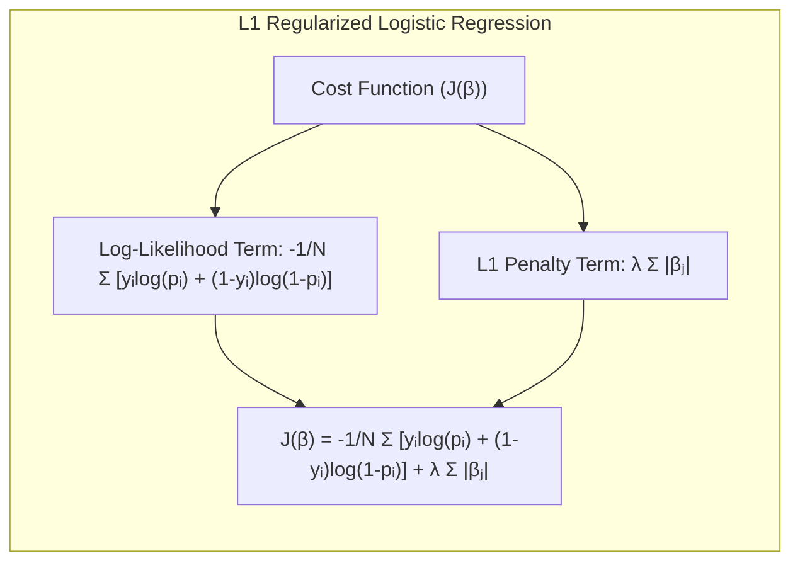
> 💡 **Exemplo Numérico:** Vamos usar um exemplo de regressão logística com regularização para classificar se um paciente tem ou não uma doença (1 para positivo, 0 para negativo) com base em 3 variáveis preditoras: idade, nível de colesterol e pressão arterial.  Suponha que temos os seguintes dados e coeficientes sem regularização:
>
>  ```python
>  import numpy as np
>  from sklearn.linear_model import LogisticRegression
>  from sklearn.preprocessing import StandardScaler
>  
>  # Dados de exemplo
>  X = np.array([[50, 220, 120], [60, 250, 140], [70, 280, 160],
>               [45, 180, 110], [55, 230, 130], [65, 260, 150],
>               [40, 190, 100], [75, 300, 170], [52, 210, 125],
>               [68, 270, 155], [60, 240, 145], [58, 235, 135],
>                [48, 200, 115], [72, 290, 165], [42, 170, 105]])
>  
>  y = np.array([1, 1, 1, 0, 0, 1, 0, 1, 0, 1, 1, 0, 0, 1, 0])
>  
>  # Padronizar os dados
>  scaler = StandardScaler()
>  X_scaled = scaler.fit_transform(X)
>  
>  # Modelo sem regularização
>  model_no_reg = LogisticRegression(penalty=None)
>  model_no_reg.fit(X_scaled, y)
>  
>  # Modelo com regularização L1 (Lasso)
>  model_l1 = LogisticRegression(penalty='l1', solver='liblinear', C=0.5) # C controla a intensidade da regularização
>  model_l1.fit(X_scaled, y)
>  
>  # Modelo com regularização L2 (Ridge)
>  model_l2 = LogisticRegression(penalty='l2', C=0.5) # C controla a intensidade da regularização
>  model_l2.fit(X_scaled, y)
>  
>  print("Coeficientes sem regularização:", model_no_reg.coef_)
>  print("Coeficientes com regularização L1:", model_l1.coef_)
>  print("Coeficientes com regularização L2:", model_l2.coef_)
>  ```
>
>  Neste exemplo, podemos ver que:
>
>  *   O modelo sem regularização usa todos os preditores.
>  *  O modelo com regularização L1 (Lasso) zerou o coeficiente da pressão arterial, selecionando apenas idade e colesterol como relevantes.
>  * O modelo com regularização L2 (Ridge) reduziu a magnitude de todos os coeficientes, mas não zerou nenhum.
>
>  A regularização L1 força alguns coeficientes a serem exatamente zero, realizando seleção de variáveis, enquanto a regularização L2 reduz a magnitude dos coeficientes, promovendo estabilidade do modelo. O parâmetro C controla a intensidade da regularização (valores menores de C indicam maior regularização).

**Lemma 3:** *A penalização L1 em regressão logística leva a soluções esparsas devido à natureza do termo de penalização*, que força alguns coeficientes a serem exatamente zero, eliminando algumas variáveis do modelo [^7.4.4]. A prova é baseada na análise da otimização da função de custo com a penalização L1. A derivada da função de penalidade L1 é uma função não suave, o que leva a soluções esparsas na otimização.

**Prova do Lemma 3:** A minimização da função de custo com penalidade L1 envolve a derivação da função em relação aos parâmetros $\beta$. O termo de penalidade L1, $\lambda \sum_{j=1}^{p} |\beta_j|$, possui uma derivada descontínua em $\beta_j=0$. Isso significa que em muitos casos, os $\beta_j$ serão empurrados para zero, promovendo a esparsidade. No caso da penalidade L2, a derivada é contínua e linear em $\beta_j$, levando apenas à redução, mas não o zeramento dos parâmetros. $\blacksquare$
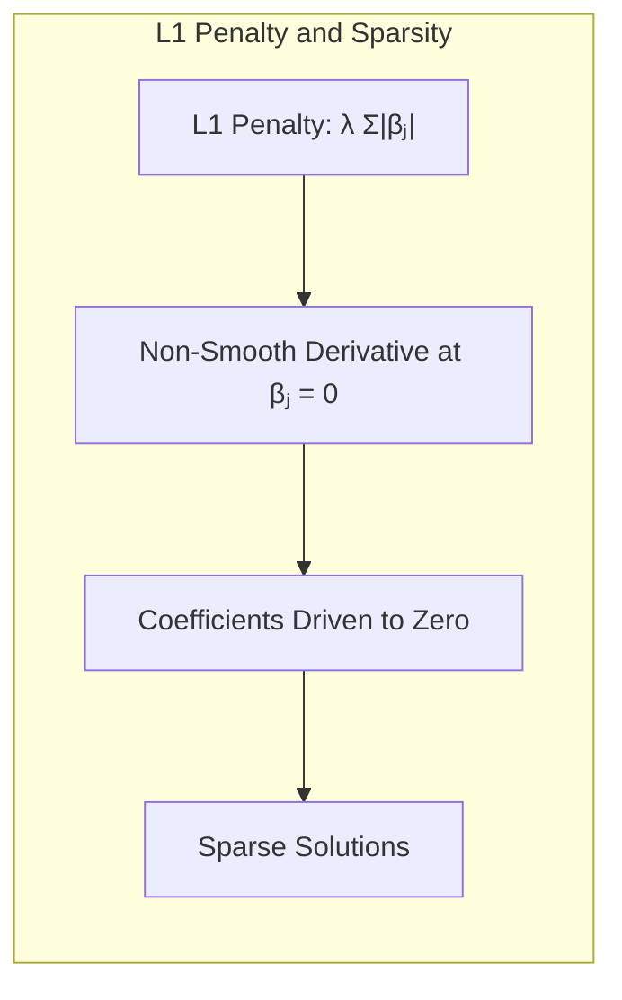
**Corolário 3:** A esparsidade induzida pela penalização L1 simplifica a interpretação dos modelos classificatórios, destacando as variáveis mais relevantes para a predição, o que auxilia na compreensão dos mecanismos subjacentes ao problema [^7.4.5].

> ⚠️ **Ponto Crucial**: As regularizações L1 e L2, e suas combinações como o Elastic Net, permitem um melhor controle do viés e da variância dos modelos, melhorando sua performance de generalização [^7.5].

### Separating Hyperplanes e Perceptrons
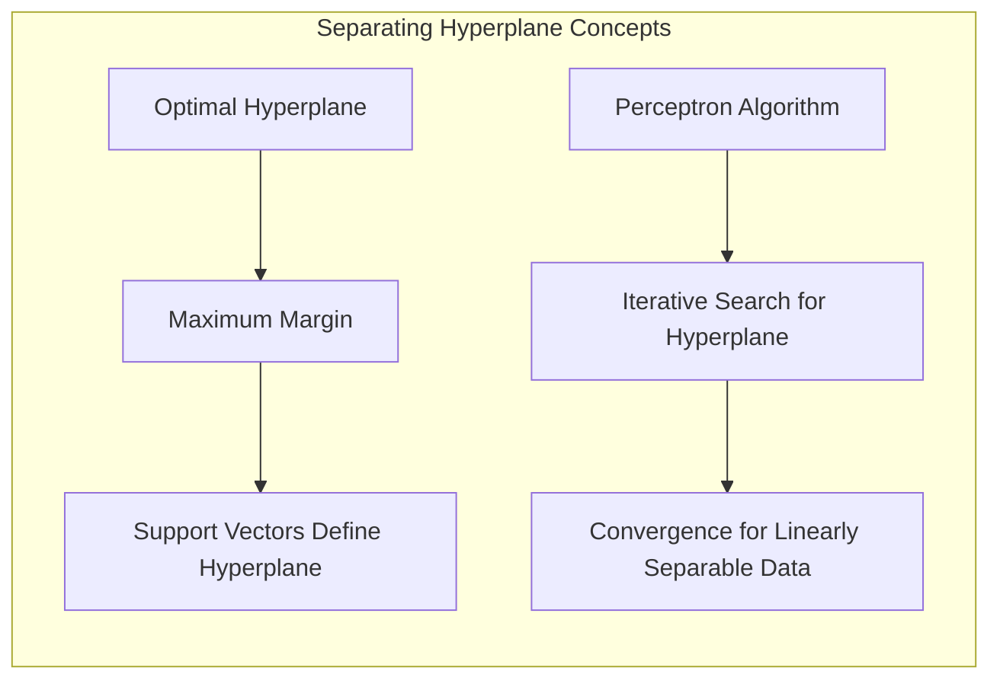
A busca por **hiperplanos separadores** ótimos, com máxima margem entre as classes, leva à formulação de um problema de otimização quadrática [^7.5.2]. Pontos de suporte, ou seja, os pontos mais próximos do hiperplano, determinam sua localização. O método do **Perceptron de Rosenblatt**, um algoritmo iterativo, busca encontrar um hiperplano que separe os dados [^7.5.1]. Se os dados são **linearmente separáveis**, o Perceptron garante a convergência para um hiperplano separador, dado um número finito de iterações [^7.5.1]. A formulação do problema de otimização para encontrar o hiperplano de máxima margem envolve a minimização da norma dos pesos do hiperplano, sujeita a restrições que garantam a separação correta das classes [^7.5.2].

### Pergunta Teórica Avançada: Quais as diferenças fundamentais entre a formulação de LDA e a Regra de Decisão Bayesiana considerando distribuições Gaussianas com covariâncias iguais?
**Resposta:**

A **Regra de Decisão Bayesiana** busca classificar uma observação na classe que maximiza a probabilidade *a posteriori*:
$$
P(G=k|X=x) = \frac{p(x|G=k)\pi_k}{\sum_{l=1}^K p(x|G=l)\pi_l}
$$
onde $p(x|G=k)$ é a densidade de probabilidade condicional da classe $k$ e $\pi_k$ é a probabilidade a priori [^7.3]. Ao assumir distribuições Gaussianas com **covariâncias iguais** para todas as classes, a **função discriminante Bayesiana** para a classe $k$ torna-se:
$$
\delta_k(x) = x^T \Sigma^{-1}\mu_k - \frac{1}{2}\mu_k^T \Sigma^{-1}\mu_k + \log \pi_k
$$
que é exatamente a mesma função discriminante utilizada no LDA [^7.3]. Portanto, quando as classes possuem distribuições gaussianas com covariâncias iguais, o LDA é equivalente à regra de decisão Bayesiana, definindo fronteiras lineares [^7.3.3].
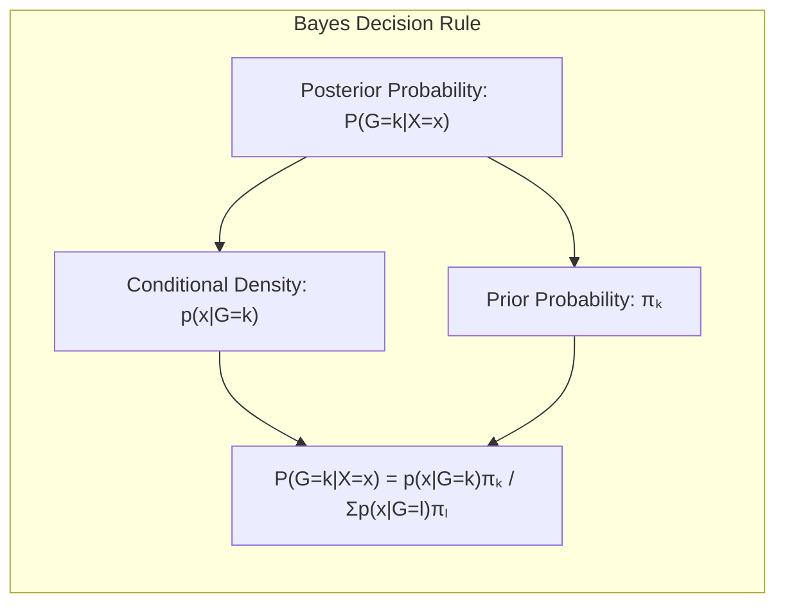
**Lemma 4:** *Sob a suposição de distribuições Gaussianas e covariâncias iguais, a função discriminante de LDA é uma versão simplificada da regra de decisão Bayesiana, levando às mesmas decisões de classe.* Essa equivalência se dá pela similaridade nas derivações das funções discriminantes [^7.3]. Formalmente, se
$$p(x|G=k) = \frac{1}{(2\pi)^{p/2}|\Sigma|^{1/2}} \exp\left( -\frac{1}{2}(x-\mu_k)^T \Sigma^{-1} (x-\mu_k)\right)$$
e as covariâncias são iguais para todas as classes $(\Sigma_1=\Sigma_2=\dots=\Sigma_K = \Sigma)$, então a maximização da probabilidade a posteriori da Regra de Decisão Bayesiana leva à mesma decisão que a função discriminante do LDA.
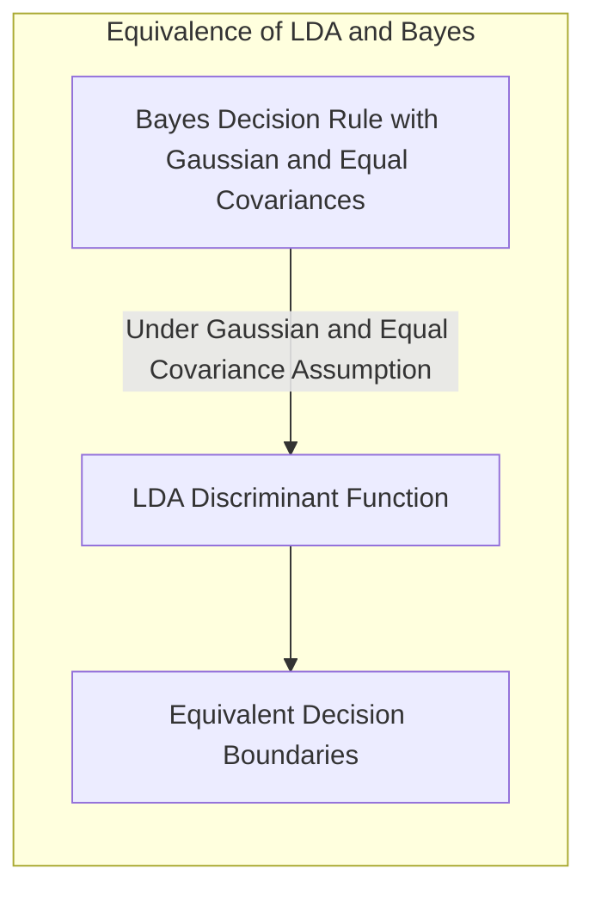
**Corolário 4:** Ao relaxar a hipótese de covariâncias iguais, ou seja, ao assumir que as matrizes de covariância são diferentes entre as classes, a regra de decisão Bayesiana leva a **fronteiras de decisão quadráticas**, em vez de lineares, o que é chamado de **Quadratic Discriminant Analysis (QDA)** [^7.3]. Isso ocorre porque o termo quadrático $(x-\mu_k)^T\Sigma_k^{-1}(x-\mu_k)$ não se cancela, resultando em uma fronteira não linear [^7.3.1].

> ⚠️ **Ponto Crucial**: A adoção ou não da suposição de covariâncias iguais tem um impacto grande na complexidade das fronteiras de decisão, indicando uma importante escolha entre LDA e QDA [^7.3.1].
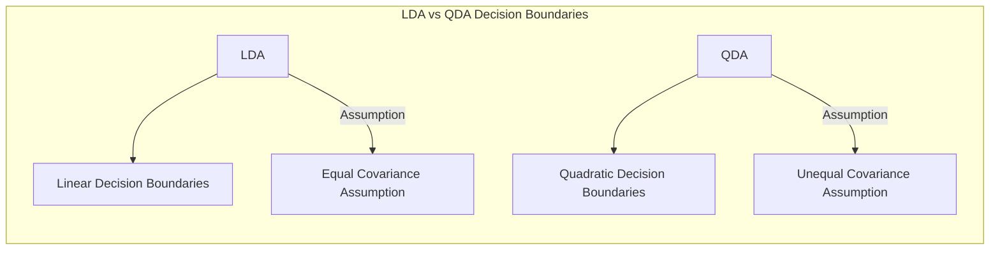

### Conclusão

Este capítulo apresentou uma exploração detalhada de conceitos fundamentais em avaliação e seleção de modelos, especialmente em problemas de classificação. Iniciamos com a análise da relação entre viés, variância e complexidade do modelo, e exploramos métodos como LDA e regressão logística. A regressão de indicadores foi discutida em relação ao problema de classificação, e também investigamos técnicas de seleção de variáveis e regularização para evitar *overfitting* e melhorar a interpretabilidade dos modelos. Abordamos o conceito de hiperplanos separadores e o Perceptron. Finalmente, respondemos à pergunta sobre as diferenças entre LDA e a regra de decisão Bayesiana, mostrando as condições que levam a equivalência entre os métodos ou a criação de fronteiras quadráticas.
<!-- END DOCUMENT -->
### Footnotes
[^7.1]: *The generalization performance of a learning method relates to its prediction capability on independent test data. Assessment of this performance