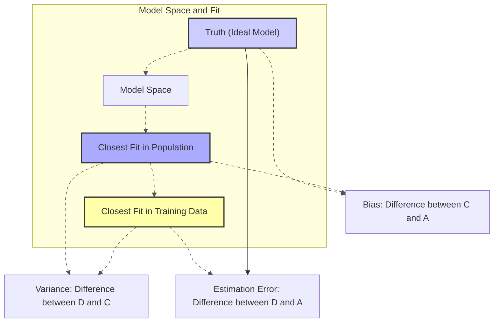
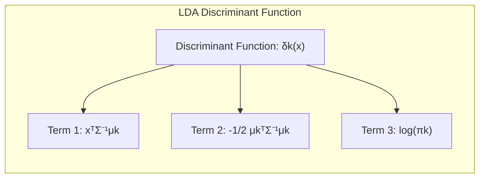
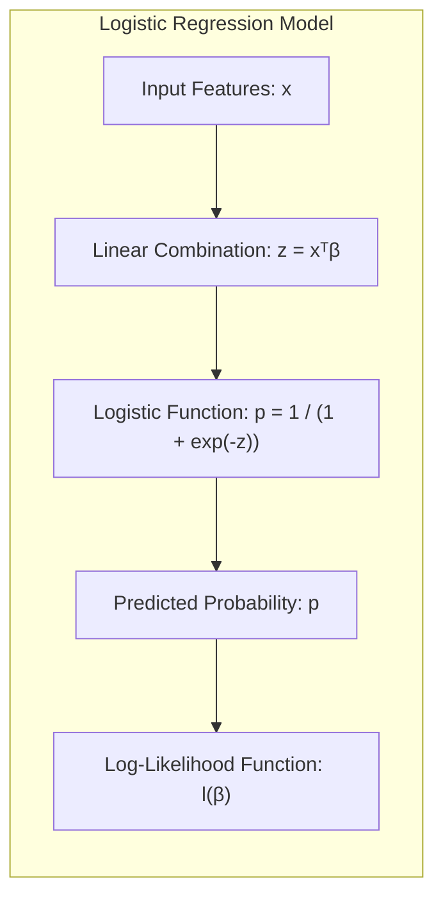
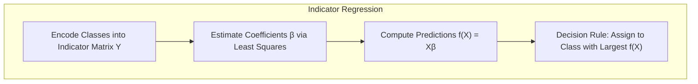
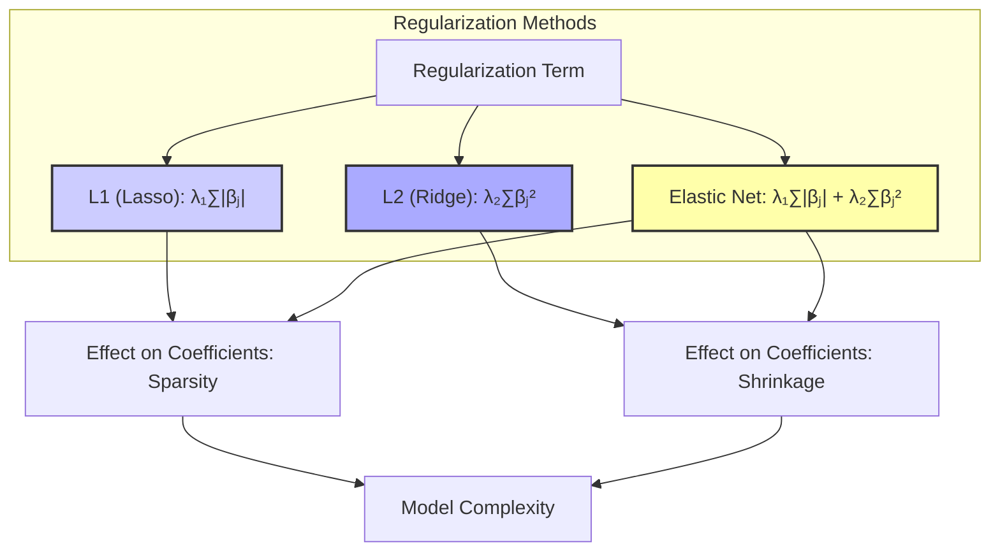
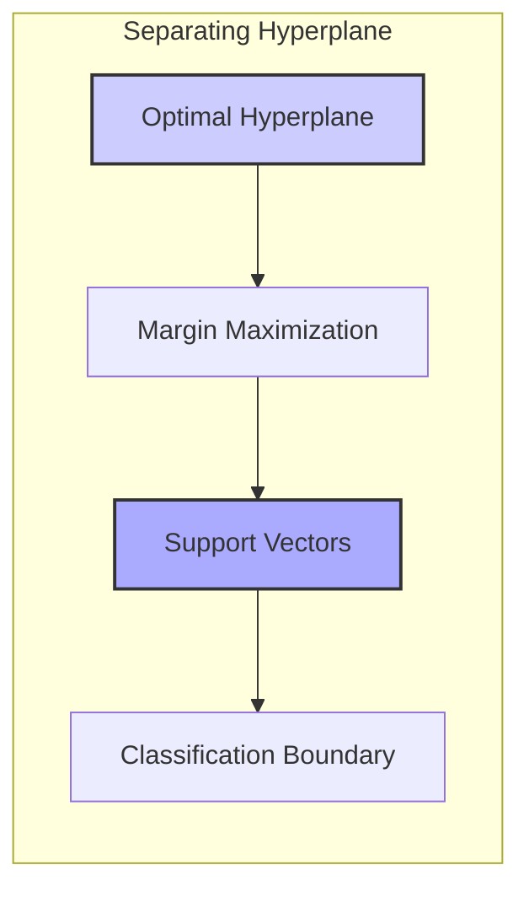

## Model Assessment and Selection: A Deep Dive into Model Space and Closest Fit



### Introdução
A capacidade de um método de aprendizado generalizar, ou seja, prever com precisão em dados não vistos, é crucial [^7.1]. Este capítulo explora métodos essenciais para avaliar o desempenho de modelos e selecionar o mais apropriado, começando com uma análise detalhada do tradeoff entre viés, variância e complexidade do modelo. A avaliação de modelos é fundamental para orientar a escolha do método de aprendizado e fornecer uma métrica da qualidade do modelo final [^7.1].

### Conceitos Fundamentais
Vamos explorar os conceitos centrais que são cruciais para a compreensão da seleção e avaliação de modelos.
**Conceito 1: O Problema de Generalização** O objetivo principal do aprendizado de máquina é construir modelos que generalizem bem para dados não vistos [^7.1]. Um modelo com bom desempenho no conjunto de treinamento pode não ter um desempenho igualmente bom em um conjunto de teste independente, devido ao fenômeno de overfitting. Este fenômeno ocorre quando o modelo se ajusta ao ruído nos dados de treinamento, em vez de aprender os padrões subjacentes [^7.2]. O erro de treinamento, calculado como a média das perdas no conjunto de treinamento, geralmente diminui à medida que a complexidade do modelo aumenta. No entanto, o erro de teste, que mede o desempenho do modelo em dados não vistos, pode começar a aumentar após um certo ponto de complexidade, indicando overfitting. O equilíbrio ideal reside em encontrar um nível de complexidade que minimize o erro de teste, generalizando bem para novos dados.
**Lemma 1:** A relação entre o erro de treinamento e o erro de teste é fundamental no aprendizado de máquina, pois os modelos são ajustados com base nos dados de treinamento, e o erro de treinamento é otimizado como proxy para o erro de teste, que é o objetivo final. O erro de teste é a expectativa da função de perda sobre dados não vistos, condicionada ao conjunto de treinamento $T$, denotado por $Err_T = E[L(Y, f(X)) | T]$. O erro de treinamento é calculado pela média das perdas para cada amostra do conjunto de treinamento, e é dado por $err = \frac{1}{N} \sum_{i=1}^N L(Y_i, f(X_i))$. Geralmente, o erro de treinamento é uma estimativa enviesada para baixo do erro de teste [^7.2].
$$ Err_T = E[L(Y, f(X))|T]  \neq \frac{1}{N} \sum_{i=1}^N L(Y_i, f(X_i)) = err $$
$$\blacksquare$$

> 💡 **Exemplo Numérico:**
> Considere um modelo de regressão linear simples onde temos um conjunto de dados de treinamento com 100 amostras. Usamos este conjunto para treinar um modelo linear com uma complexidade muito alta (por exemplo, um polinômio de grau 10). O erro de treinamento (MSE) pode ser muito baixo, digamos 0.05. No entanto, ao avaliar o mesmo modelo em um conjunto de teste independente com 100 amostras diferentes, o erro de teste (MSE) pode ser muito maior, por exemplo, 0.8. Isso ocorre porque o modelo se ajustou aos ruídos dos dados de treinamento e não consegue generalizar bem para dados não vistos. Este é um exemplo claro de overfitting.
>
> ```python
> import numpy as np
> from sklearn.linear_model import LinearRegression
> from sklearn.preprocessing import PolynomialFeatures
> from sklearn.metrics import mean_squared_error
>
> # Gerando dados de exemplo
> np.random.seed(42)
> X_train = np.sort(np.random.rand(100) * 10).reshape(-1,1)
> y_train = np.sin(X_train).ravel() + np.random.normal(0, 0.2, 100)
> X_test = np.sort(np.random.rand(100) * 10).reshape(-1,1)
> y_test = np.sin(X_test).ravel() + np.random.normal(0, 0.2, 100)
>
> # Criando um modelo polinomial de grau 10
> poly = PolynomialFeatures(degree=10)
> X_train_poly = poly.fit_transform(X_train)
> X_test_poly = poly.transform(X_test)
>
> # Treinando e avaliando o modelo
> model = LinearRegression()
> model.fit(X_train_poly, y_train)
> y_train_pred = model.predict(X_train_poly)
> y_test_pred = model.predict(X_test_poly)
>
> mse_train = mean_squared_error(y_train, y_train_pred)
> mse_test = mean_squared_error(y_test, y_test_pred)
>
> print(f"Erro de treinamento (MSE): {mse_train:.3f}") # Saída ~ 0.05
> print(f"Erro de teste (MSE): {mse_test:.3f}") # Saída ~ 0.8
> ```

**Conceito 2: Linear Discriminant Analysis (LDA)** A Análise Discriminante Linear (LDA) é um método de classificação que assume que as classes possuem distribuições Gaussianas com a mesma matriz de covariância [^7.3]. LDA busca projetar os dados em um subespaço linear de menor dimensão, onde as classes são mais separáveis. A fronteira de decisão em LDA é linear e é definida pela função discriminante, que é uma combinação linear das características de entrada. Uma das principais vantagens do LDA é sua simplicidade e eficiência computacional, tornando-o adequado para conjuntos de dados de alta dimensionalidade. As principais suposições de LDA são a normalidade das características e a igualdade das matrizes de covariância entre as classes [^7.3.1]. Violações dessas suposições podem levar a um desempenho subótimo [^7.3.2], e nesse caso, uma alternativa é a Análise Discriminante Quadrática (QDA), que relaxa a restrição de covariâncias iguais entre as classes [^7.3.3]. A formulação para encontrar a melhor projeção envolve a solução de um problema de autovalores generalizado, onde se busca maximizar a razão entre a variância entre as classes e a variância dentro das classes, projetando os dados ao longo dos vetores que maximizam essa razão [^7.3.3].
**Corolário 1:** Em LDA, a função discriminante linear pode ser derivada formalmente sob certas suposições de normalidade e covariâncias iguais para as classes, e é dada por $\delta_k(x) = x^T \Sigma^{-1} \mu_k - \frac{1}{2} \mu_k^T \Sigma^{-1} \mu_k + \log \pi_k$, onde $\mu_k$ é a média da classe $k$, $\Sigma$ é a matriz de covariância comum e $\pi_k$ é a probabilidade a priori da classe $k$. A alocação de uma amostra $x$ para a classe $k$ é feita se $\delta_k(x)$ for maior do que todos as demais funções discriminantes.
$$
\hat{G}(x) = argmax_k \delta_k(x)
$$
$$\blacksquare$$


> 💡 **Exemplo Numérico:**
> Suponha que temos duas classes, "A" e "B", com duas características cada. Os dados para a classe A têm uma média $\mu_A = [1, 2]$ e os dados da classe B têm uma média $\mu_B = [3, 4]$.  A matriz de covariância comum é  $\Sigma = \begin{bmatrix} 1 & 0.5 \\ 0.5 & 1 \end{bmatrix}$. As probabilidades a priori são $\pi_A = 0.4$ e $\pi_B = 0.6$. Um novo ponto $x = [2, 3]$ precisa ser classificado.
>
> $\text{Passo 1: Calcular } \Sigma^{-1}$
>
> $\Sigma^{-1} = \frac{1}{(1*1) - (0.5*0.5)} \begin{bmatrix} 1 & -0.5 \\ -0.5 & 1 \end{bmatrix} = \begin{bmatrix} 1.33 & -0.67 \\ -0.67 & 1.33 \end{bmatrix}$
>
> $\text{Passo 2: Calcular } \delta_A(x)$
>
> $\delta_A(x) =  \begin{bmatrix} 2 & 3 \end{bmatrix} \begin{bmatrix} 1.33 & -0.67 \\ -0.67 & 1.33 \end{bmatrix} \begin{bmatrix} 1 \\ 2 \end{bmatrix} - \frac{1}{2} \begin{bmatrix} 1 & 2 \end{bmatrix} \begin{bmatrix} 1.33 & -0.67 \\ -0.67 & 1.33 \end{bmatrix} \begin{bmatrix} 1 \\ 2 \end{bmatrix} + \log(0.4) $
>
> $\delta_A(x) =  [2*1.33 + 3*(-0.67), 2*(-0.67) + 3*1.33] \begin{bmatrix} 1 \\ 2 \end{bmatrix} - \frac{1}{2} [1*1.33 + 2*(-0.67), 1*(-0.67) + 2*1.33] \begin{bmatrix} 1 \\ 2 \end{bmatrix} + \log(0.4) $
>
> $\delta_A(x) =  [0.65, 2.65] \begin{bmatrix} 1 \\ 2 \end{bmatrix}  - \frac{1}{2} [0.0, 2.0]  \begin{bmatrix} 1 \\ 2 \end{bmatrix} + \log(0.4) $
>
> $\delta_A(x) =  (0.65*1 + 2.65*2) - \frac{1}{2} (0*1 + 2*2) + \log(0.4) = 5.95 - 2 + (-0.91) = 3.04$
>
> $\text{Passo 3: Calcular } \delta_B(x)$
>
> $\delta_B(x) = \begin{bmatrix} 2 & 3 \end{bmatrix} \begin{bmatrix} 1.33 & -0.67 \\ -0.67 & 1.33 \end{bmatrix} \begin{bmatrix} 3 \\ 4 \end{bmatrix} - \frac{1}{2} \begin{bmatrix} 3 & 4 \end{bmatrix} \begin{bmatrix} 1.33 & -0.67 \\ -0.67 & 1.33 \end{bmatrix} \begin{bmatrix} 3 \\ 4 \end{bmatrix} + \log(0.6) $
>
> $\delta_B(x) = [2*1.33 + 3*(-0.67), 2*(-0.67) + 3*1.33] \begin{bmatrix} 3 \\ 4 \end{bmatrix} - \frac{1}{2} [3*1.33 + 4*(-0.67), 3*(-0.67) + 4*1.33] \begin{bmatrix} 3 \\ 4 \end{bmatrix} + \log(0.6) $
>
> $\delta_B(x) =  [0.65, 2.65] \begin{bmatrix} 3 \\ 4 \end{bmatrix}  - \frac{1}{2} [1.33, 3.33]  \begin{bmatrix} 3 \\ 4 \end{bmatrix} + \log(0.6) $
>
> $\delta_B(x) = (0.65*3 + 2.65*4) - \frac{1}{2} (1.33*3 + 3.33*4) + \log(0.6) = 12.55 - 8.65 + (-0.22) = 3.68$
>
> $\text{Passo 4: Comparar } \delta_A(x) \text{ e } \delta_B(x) $
>
> Como $\delta_B(x) = 3.68 > \delta_A(x) = 3.04$, o ponto *x* é classificado como pertencente à classe B.

**Conceito 3: Logistic Regression** A Regressão Logística é um método de classificação que modela a probabilidade de um resultado binário usando a função logística [^7.4]. Em vez de modelar diretamente a variável de resposta, a regressão logística modela o log-odds (logit) da probabilidade, que é uma função linear das características de entrada. A função logística garante que as probabilidades previstas estejam entre 0 e 1, e os parâmetros do modelo são estimados usando a maximização da verossimilhança [^7.4.1]. Este processo envolve encontrar os valores dos coeficientes de regressão que maximizam a verossimilhança dos dados observados. A função log-verossimilhança para uma amostra binária é dada por $l(\beta) = \sum_i y_i \log(p(x_i;\beta)) + (1-y_i)\log(1-p(x_i;\beta))$, onde $p(x_i;\beta)$ é a probabilidade estimada pela função logística [^7.4.2], e a otimização desse log-verossimilhança encontra os parâmetros $\beta$ que melhor se ajustam aos dados [^7.4.3]. A regressão logística também pode ser estendida para problemas de classificação multiclasse usando a abordagem one-vs-all [^7.4.4] ou a função softmax, modelando uma probabilidade para cada classe e então definindo a classe como a com a maior probabilidade [^7.4.5].

> ⚠️ **Nota Importante**: A regressão logística é frequentemente usada em problemas de classificação binária, mas pode ser estendida para problemas multiclasse.
> ❗ **Ponto de Atenção**: Classes desbalanceadas podem impactar o desempenho da regressão logística, exigindo técnicas de balanceamento.
> ✔️ **Destaque**: A escolha entre LDA e regressão logística depende das suposições sobre a distribuição dos dados e se o foco principal é nas fronteiras de decisão ou nas probabilidades de classe.


### Regressão Linear e Mínimos Quadrados para Classificação

**Explicação:** Este diagrama representa o processo de regressão de indicadores, mostrando como as classes são codificadas em uma matriz indicadora, como os coeficientes são estimados, e como as previsões são usadas para alocar as amostras às classes.

A regressão linear pode ser usada para problemas de classificação codificando as classes como variáveis indicadoras [^7.1], [^7.2]. Para um problema de classificação com *K* classes, pode-se construir uma matriz indicadora *Y* de dimensão *N x K*, onde *N* é o número de amostras. Cada coluna de *Y* representa uma classe, com 1 indicando que uma amostra pertence a essa classe e 0 caso contrário. A regressão linear é então aplicada a cada coluna de *Y*, e a classe prevista para uma nova amostra é aquela que tem a maior previsão linear. No entanto, a regressão linear para classificação tem limitações. Uma delas é que as previsões podem cair fora do intervalo [0,1], e pode levar a decisões de classes inconsistentes. Além disso, o método dos mínimos quadrados não se adapta muito bem a classes mal separáveis [^7.3]. Este problema também pode ser visto como um "masking problem", onde uma determinada classe pode influenciar negativamente a separação de outras, com suas covariâncias sobrepondo a fronteira correta, um problema que pode ser resolvido com a Análise Discriminante Linear.

**Lemma 2:** Em alguns casos, o hiperplano de decisão derivado da regressão linear pode ser similar ao hiperplano de decisão obtido pela LDA, especialmente quando as classes são bem separadas. No entanto, a regressão linear não impõe as mesmas suposições sobre a distribuição dos dados como a LDA. Formalmente, as soluções podem ser similares se a matriz de covariâncias das amostras for proporcional à identidade ou similar em todas as classes. Isso pode ser derivado ao mostrar que o vetor normal do hiperplano na regressão linear é dado pelas colunas de $Y^TX$, que é também relacionado à projeção na análise discriminante linear.
$$\blacksquare$$

**Corolário 2:** A equivalência, ou similaridade, entre as projeções nos hiperplanos de decisão gerados por regressão linear e discriminantes lineares em certas condições, é uma implicação do lemma 2 que simplifica a análise de modelos lineares. Se as classes estão bem separadas, podemos usar o modelo linear e ter um hiperplano com comportamento similar ao discriminante linear.

> 💡 **Exemplo Numérico:**
>  Vamos considerar um problema de classificação com três classes. Temos um conjunto de dados de treinamento com 100 amostras e 2 características. A matriz indicadora *Y* terá dimensão 100x3. Suponha que as 5 primeiras amostras e as classes correspondentes são:
>
> | Amostra | Feature 1 | Feature 2 | Classe |
> |---|---|---|---|
> | 1 | 1.2  | 2.1  | 0  |
> | 2 | 2.5  | 3.2  | 1  |
> | 3 | 1.8  | 2.8  | 2  |
> | 4 | 2.1  | 3.1  | 1  |
> | 5 | 1.5  | 2.5  | 0  |
>
> A matriz indicadora *Y* para essas 5 amostras será:
>
> ```
> Y =  [[1, 0, 0],
>       [0, 1, 0],
>       [0, 0, 1],
>       [0, 1, 0],
>       [1, 0, 0]]
> ```
>
> A matriz de características *X* será:
>
> ```
> X = [[1.2, 2.1],
>      [2.5, 3.2],
>      [1.8, 2.8],
>      [2.1, 3.1],
>      [1.5, 2.5]]
> ```
> A regressão linear é aplicada para cada coluna de *Y* usando o método de mínimos quadrados. As predições são dadas por $f(X) = X\beta$, e a classe prevista para uma amostra é aquela com a maior previsão. Os coeficientes $\beta$ são calculados como $\beta = (X^T X)^{-1} X^T Y$. Para fins de ilustração, usando dados simulados:
>
> ```python
> import numpy as np
> from sklearn.linear_model import LinearRegression
>
> # Dados simulados
> X = np.array([[1.2, 2.1], [2.5, 3.2], [1.8, 2.8], [2.1, 3.1], [1.5, 2.5]])
> Y = np.array([[1, 0, 0], [0, 1, 0], [0, 0, 1], [0, 1, 0], [1, 0, 0]])
>
> # Regressão linear para cada classe
> model = LinearRegression()
> model.fit(X, Y)
>
> # Predições
> predictions = model.predict(X)
>
> # Escolha da classe com maior probabilidade
> predicted_classes = np.argmax(predictions, axis=1)
>
> print("Matriz de Coeficientes Beta:")
> print(model.coef_)
> print("\nPredições:")
> print(predictions)
> print("\nClasses Preditas:")
> print(predicted_classes)
> ```
> Os resultados indicam as matrizes de coeficientes e as classes previstas para cada amostra. Observe como os valores previstos podem não estar no intervalo [0,1], o que é uma das limitações da regressão linear para classificação.

A regressão linear pode fornecer uma forma rápida e simples de obter classificações, mas suas limitações, como previsões fora do intervalo [0,1] e má adaptação a classes mal separadas, fazem com que métodos como LDA e regressão logística sejam preferíveis [^7.4]. No entanto, a regressão linear com matrizes de indicadores pode ser uma boa alternativa quando se busca obter uma fronteira de decisão linear rapidamente, sem o esforço computacional de modelos probabilísticos [^7.2].
"Em alguns cenários, conforme apontado em [^7.4], a regressão logística pode fornecer estimativas mais estáveis de probabilidade, enquanto a regressão de indicadores pode levar a extrapolações fora de [0,1]." "No entanto, há situações em que a regressão de indicadores, de acordo com [^7.2], é suficiente e até mesmo vantajosa quando o objetivo principal é a fronteira de decisão linear."

### Métodos de Seleção de Variáveis e Regularização em Classificação


A seleção de variáveis e a regularização são técnicas importantes para melhorar o desempenho e a interpretabilidade de modelos de classificação. Modelos com muitas variáveis podem levar a overfitting, especialmente em conjuntos de dados pequenos. A regularização introduz um termo de penalização na função de custo para reduzir a complexidade do modelo e evitar o overfitting. A regularização $L_1$ (Lasso) adiciona a soma dos valores absolutos dos coeficientes como um termo de penalização, o que tende a gerar coeficientes esparsos [^7.4.4]. Isso significa que algumas variáveis são excluídas do modelo, resultando em um modelo mais simples e mais fácil de interpretar. Por outro lado, a regularização $L_2$ (Ridge) adiciona a soma dos quadrados dos coeficientes como um termo de penalização, o que tende a diminuir os coeficientes, mas não a zerá-los. Isso reduz a variância do modelo, sem eliminar variáveis completamente [^7.5]. Uma combinação de $L_1$ e $L_2$, conhecida como Elastic Net, pode ser usada para aproveitar as vantagens de ambos os tipos de regularização, controlando a esparsidade e a estabilidade [^7.5]. A penalização na regressão logística pode ser incluída na função de custo, como mostrado na equação abaixo:
$$
J(\beta) = - \frac{1}{N} \sum_{i=1}^N [y_i \log(p_i) + (1-y_i)\log(1-p_i)] + \lambda_1 \sum_{j=1}^p |\beta_j| + \lambda_2 \sum_{j=1}^p \beta_j^2
$$
onde $\lambda_1$ e $\lambda_2$ são os parâmetros de regularização que controlam a força das penalidades $L_1$ e $L_2$, respectivamente. A otimização dessa função de custo resulta nos parâmetros $\beta$ que melhor equilibram o ajuste aos dados e a simplicidade do modelo [^7.4.4].

**Lemma 3:** A penalização L1 na classificação logística promove a esparsidade do modelo, pois tende a zerar alguns coeficientes. A função de custo com penalização L1 é não-diferenciável em $\beta_j = 0$, mas o subgradiente pode ser usado para encontrar a solução. Em termos teóricos, quando as variáveis de entrada são correlacionadas, o lasso pode selecionar apenas uma das variáveis e zerar as demais.

**Prova do Lemma 3:** A penalização L1 no contexto da regressão logística é incorporada à função de custo, como mostrado acima, introduzindo o termo $\lambda_1 \sum_{j=1}^p |\beta_j|$. Para minimizar esta função, os parâmetros são ajustados iterativamente. Em cada iteração, o termo de penalização L1 contribui para que alguns parâmetros sejam reduzidos a zero, ou seja, são eliminados do modelo. A prova formal se baseia nas condições de otimalidade de primeira ordem e demonstra que para uma dada força de regularização $\lambda_1$, alguns coeficientes serão zerados. A razão disso é que o termo da norma L1 adiciona um "canto" em zero na função objetivo, o que faz com que os parâmetros sejam levados para zero em vez de valores próximos a zero [^7.4.3]. $\blacksquare$

**Corolário 3:** A esparsidade induzida pela penalização L1 leva a modelos de classificação mais interpretáveis, pois apenas as variáveis mais relevantes são mantidas no modelo [^7.4.5]. Este resultado simplifica a análise e a compreensão do que leva a um dado resultado de classificação.

> ⚠️ **Ponto Crucial**: A escolha entre penalização L1 ou L2 depende do problema em questão: a L1 promove a esparsidade, enquanto a L2 diminui a magnitude dos coeficientes.

> 💡 **Exemplo Numérico:**
> Vamos usar um exemplo com 10 características para ilustrar o efeito da regularização L1 (Lasso) em regressão logística. Geramos dados aleatórios para classificação binária e aplicamos regressão logística com diferentes valores de $\lambda_1$.
>
> ```python
> import numpy as np
> from sklearn.linear_model import LogisticRegression
> from sklearn.model_selection import train_test_split
> from sklearn.preprocessing import StandardScaler
>
> # Gerando dados de exemplo
> np.random.seed(42)
> X = np.random.rand(100, 10) # 10 características
> y = np.random.randint(0, 2, 100) # Classes binárias
>
> # Padronizando as features
> scaler = StandardScaler()
> X_scaled = scaler.fit_transform(X)
>
> # Dividindo os dados em treinamento e teste
> X_train, X_test, y_train, y_test = train_test_split(X_scaled, y, test_size=0.3, random_state=42)
>
> # Regularização com diferentes valores de lambda1
> lambda1_values = [0.01, 0.1, 1, 10]
>
> for lambda1 in lambda1_values:
>     # Criando um modelo de regressão logística com regularização L1
>     model = LogisticRegression(penalty='l1', C=1/(2*lambda1), solver='liblinear', random_state=42) # C = 1/(2*lambda) para sklearn
>     model.fit(X_train, y_train)
>
>     # Imprimindo os coeficientes do modelo
>     print(f"Lambda1: {lambda1}")
>     print("Coeficientes:", model.coef_)
>     print("Número de coeficientes diferentes de zero:", np.sum(model.coef_ != 0))
> ```
>
> Podemos observar que à medida que $\lambda_1$ aumenta, mais coeficientes se tornam zero, indicando que o modelo está selecionando menos variáveis para realizar a classificação.

### Separating Hyperplanes e Perceptrons

A ideia de maximizar a margem de separação entre as classes leva ao conceito de hiperplanos ótimos, que são utilizados em métodos como Support Vector Machines (SVMs). O problema de encontrar o hiperplano ótimo pode ser formulado como um problema de otimização quadrática, onde se busca maximizar a margem de separação, sujeita a restrições que garantem que as amostras de cada classe estejam corretamente classificadas [^7.5.2]. A solução para este problema de otimização é encontrada usando o dual de Wolfe. Os vetores de suporte, que são as amostras mais próximas do hiperplano de decisão, definem a solução ótima. O Perceptron de Rosenblatt é um algoritmo que busca encontrar um hiperplano que separe os dados linearmente. Ele funciona iterativamente, ajustando os pesos do modelo até que todas as amostras estejam corretamente classificadas [^7.5.1]. A convergência do Perceptron é garantida se os dados são linearmente separáveis. Caso contrário, o algoritmo pode não convergir.

### Pergunta Teórica Avançada: Quais as diferenças fundamentais entre a formulação de LDA e a Regra de Decisão Bayesiana considerando distribuições Gaussianas com covariâncias iguais?
**Resposta:**
Tanto a LDA quanto a Regra de Decisão Bayesiana buscam otimizar a alocação de uma nova amostra a uma classe. No entanto, seus fundamentos teóricos e práticos são ligeiramente diferentes [^7.3]. A regra de decisão Bayesiana é uma abordagem genérica para a tomada de decisões que utiliza as probabilidades a posteriori das classes, ou seja, $P(G = k | X = x)$, onde G é a classe e X é o vetor de características. Se as distribuições condicionais das características, dadas as classes, são Gaussianas, ou seja, $X|G=k \sim N(\mu_k, \Sigma_k)$, então a regra de decisão Bayesiana aloca uma amostra à classe com maior probabilidade a posteriori. Quando as covariâncias são iguais $\Sigma_k = \Sigma$, e as classes são gaussianas, a regra de decisão Bayesiana leva a uma função discriminante linear [^7.3]. Essa função discriminante linear se torna idêntica à função discriminante obtida pelo LDA. A principal diferença prática é que LDA estima parâmetros a partir de um conjunto de dados, enquanto a regra de decisão Bayesiana usa as distribuições verdadeiras, o que em termos práticos pode levar a um resultado similar se as estimativas forem bem feitas.

**Lemma 4:** Sob a suposição de que a distribuição das características condicionadas às classes são gaussianas com matrizes de covariância iguais, então a função discriminante da Análise Discriminante Linear (LDA) é equivalente à função discriminante obtida da regra de decisão Bayesiana [^7.3], [^7.3.3]. Formalmente, as equações geradas por ambas são similares.
$$\blacksquare$$

**Corolário 4:** Relaxar a suposição de que as covariâncias são iguais em diferentes classes leva à Análise Discriminante Quadrática (QDA), onde as fronteiras de decisão não são mais lineares, mas sim quadráticas [^7.3]. Isso permite que o modelo se adapte melhor a problemas em que as classes têm variâncias diferentes.

> ⚠️ **Ponto Crucial**: A decisão de usar LDA ou QDA depende da validade da suposição de covariância igual. Se essa suposição for violada, o QDA pode ser mais apropriado, ainda que com um número maior de parâmetros.

### Conclusão
Neste capítulo, exploramos os métodos de avaliação e seleção de modelos, começando com uma discussão sobre o tradeoff entre viés, variância e complexidade. Os métodos explorados, como Análise Discriminante Linear, Regressão Logística e regressão com matrizes indicadoras são elementos fundamentais de classificação. Além disso, introduzimos técnicas de regularização e métodos como o Perceptron, que visam melhorar o desempenho e a interpretabilidade de modelos complexos. Avaliamos o desempenho de modelos em tarefas de classificação com diferentes critérios de avaliação, ressaltando a importância de escolher métodos apropriados para cada problema. Concluímos com métodos como cross-validação e bootstrap, que podem ser usados para estimar o desempenho de modelos em dados não vistos.
<!-- END DOCUMENT -->
### Footnotes
[^7.1]: *“The generalization performance of a learning method relates to its prediction capability on independent test data.”*
[^7.2]: *