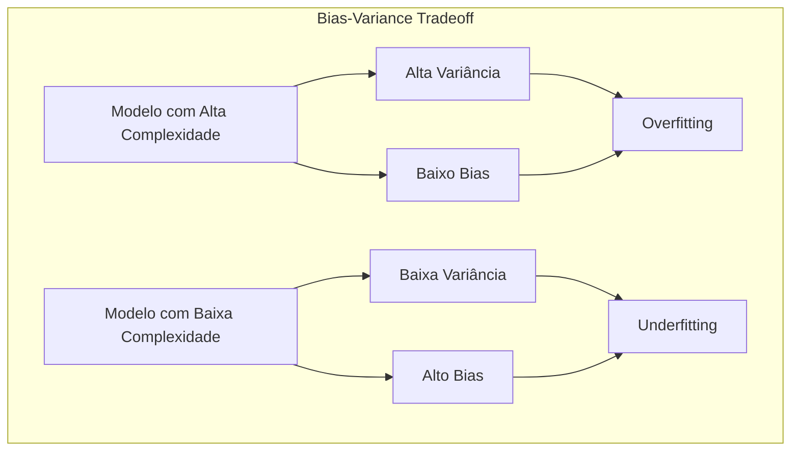
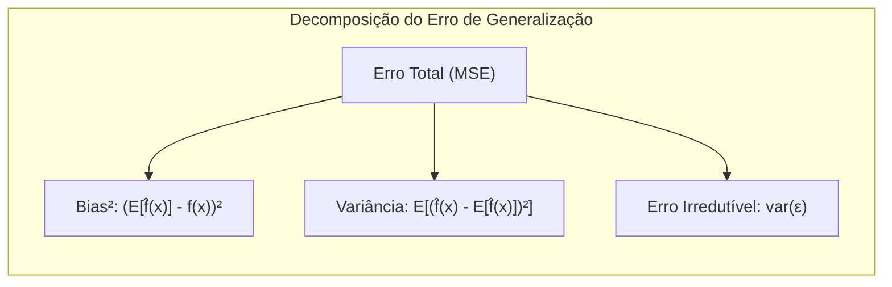
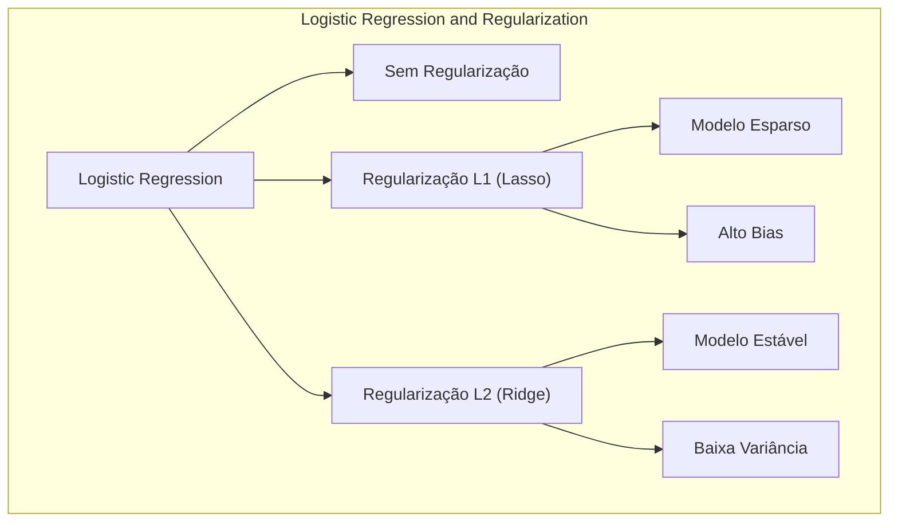
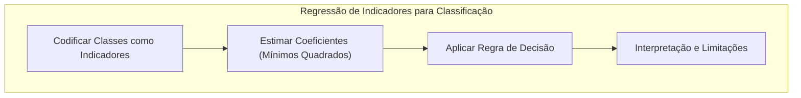
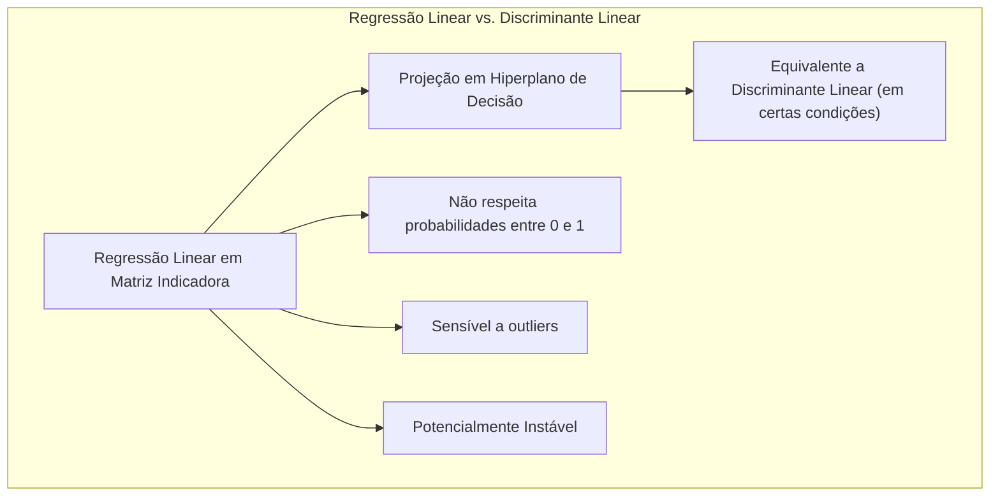
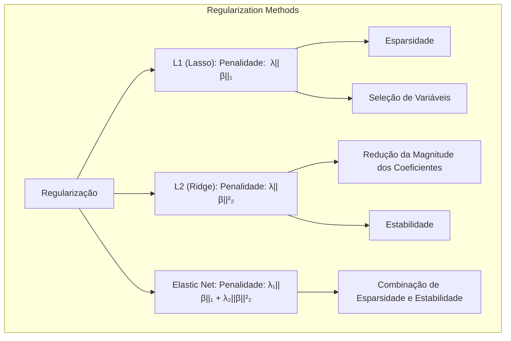
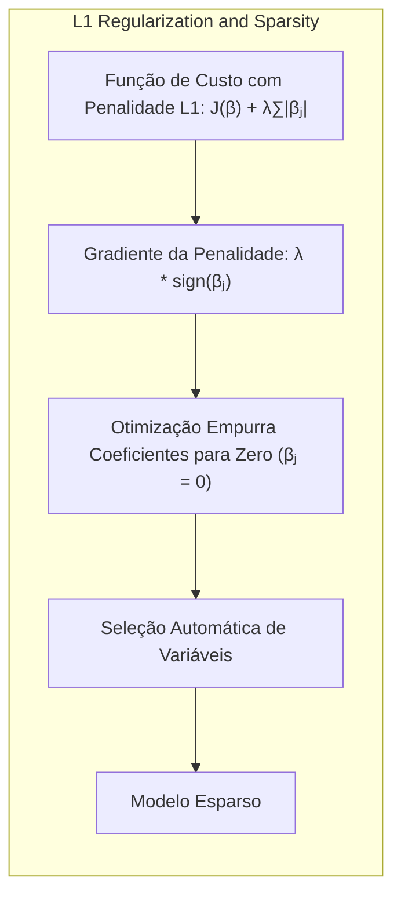

## Model Assessment and Selection: Focusing on the Bias-Variance Tradeoff

<imagem: Diagrama que ilustra o trade-off entre bias e variância, mostrando curvas de erro de treinamento e teste, com níveis crescentes de complexidade do modelo. Adicione também uma representação visual de um alvo (representando a função verdadeira) e diferentes estimativas (representando diferentes modelos) que se aproximam ou se afastam deste alvo, destacando como um modelo de baixa complexidade tem um alto bias e um modelo de alta complexidade tem uma alta variância.>

### Introdução
A avaliação do desempenho de um método de aprendizado, ou seja, sua capacidade de generalização para dados de teste independentes, é crucial na prática [^7.1]. Essa avaliação orienta a escolha do método de aprendizado ou modelo e fornece uma medida da qualidade do modelo escolhido [^7.1]. Este capítulo explora os principais métodos de avaliação de desempenho, mostrando como eles são usados para selecionar modelos, e discute a interação entre **bias**, **variância** e complexidade do modelo, que é central para o problema de modelagem preditiva [^7.1].

### Conceitos Fundamentais

**Conceito 1: O Problema da Classificação e o Trade-off entre Bias e Variância**

O problema de classificação, em sua essência, busca atribuir uma classe correta a cada ponto de dados dado um conjunto de features [^7.1]. Ao abordar este problema com métodos lineares, como os discutidos em [^4.1], é fundamental entender o **trade-off entre bias e variância**. Um modelo com **alto bias** tende a simplificar excessivamente a relação entre as features e a classe, levando a erros sistemáticos. Por outro lado, um modelo com **alta variância** se ajusta muito bem aos dados de treinamento, mas pode generalizar mal para novos dados, devido ao ruído nos dados de treinamento [^7.2]. Por exemplo, um modelo linear simples pode não capturar relações não lineares complexas nos dados (alto bias), enquanto um modelo muito flexível pode se ajustar aos ruídos e peculiaridades dos dados de treinamento (alta variância). A complexidade do modelo, portanto, desempenha um papel crucial na forma como este trade-off é equilibrado [^7.2].



> 💡 **Exemplo Numérico:** Imagine que temos um problema de classificação onde a relação verdadeira entre os dados e as classes é uma parábola. Um modelo linear (baixo grau de liberdade) tentará ajustar uma linha reta, resultando em um alto bias. Ele não conseguirá capturar a curvatura da relação. Em contrapartida, um modelo polinomial de alta ordem (alto grau de liberdade) poderá ajustar-se perfeitamente aos dados de treinamento, incluindo ruídos, apresentando alta variância e generalizando mal para novos dados. Vamos simular isso com um exemplo simples em Python:
>
> ```python
> import numpy as np
> import matplotlib.pyplot as plt
> from sklearn.linear_model import LinearRegression
> from sklearn.preprocessing import PolynomialFeatures
> from sklearn.pipeline import make_pipeline
>
> # Generate synthetic data
> np.random.seed(42)
> X = np.sort(np.random.rand(50) * 10)
> y_true = 2 + 3 * X - 0.5 * X**2 # True quadratic relationship
> y = y_true + np.random.normal(0, 3, len(X)) # Add noise
>
> # Linear Model
> linear_model = LinearRegression()
> linear_model.fit(X.reshape(-1, 1), y)
> y_linear_pred = linear_model.predict(X.reshape(-1, 1))
>
> # Polynomial Model (degree 6)
> poly_model = make_pipeline(PolynomialFeatures(6), LinearRegression())
> poly_model.fit(X.reshape(-1, 1), y)
> y_poly_pred = poly_model.predict(X.reshape(-1, 1))
>
> # Plotting
> plt.figure(figsize=(10, 6))
> plt.scatter(X, y, color='blue', label='Dados de Treinamento')
> plt.plot(X, y_true, color='green', linestyle='--', label='Relação Verdadeira')
> plt.plot(X, y_linear_pred, color='red', label='Modelo Linear (Alto Bias)')
> plt.plot(X, y_poly_pred, color='purple', label='Modelo Polinomial (Alta Variância)')
> plt.xlabel('X')
> plt.ylabel('y')
> plt.title('Comparação entre Modelos com Alto Bias e Alta Variância')
> plt.legend()
> plt.show()
>
> # Calculate MSE
> from sklearn.metrics import mean_squared_error
>
> mse_linear = mean_squared_error(y_true, y_linear_pred)
> mse_poly = mean_squared_error(y_true, y_poly_pred)
>
> print(f'MSE do Modelo Linear (Alto Bias): {mse_linear:.2f}')
> print(f'MSE do Modelo Polinomial (Alta Variância): {mse_poly:.2f}')
>
> ```
> No exemplo acima, o modelo linear tem um erro maior (alto bias) porque não captura a relação quadrática, enquanto o modelo polinomial de ordem 6 se ajusta aos dados de treinamento, incluindo ruído, tendo um erro pequeno nos dados de treino mas que possivelmente levará a um alto erro nos dados de teste (alta variância).

**Lemma 1:** *Um modelo linear com baixo grau de liberdade (por exemplo, um modelo linear simples com poucos parâmetros) tende a ter um alto bias e uma baixa variância. Por outro lado, um modelo linear com muitos graus de liberdade (por exemplo, um modelo com muitas features e interações) tende a ter um baixo bias e uma alta variância*. [^7.2] A demonstração deste lemma é evidenciada pela decomposição do erro de generalização, onde o bias se refere à diferença entre a previsão média do modelo e a verdadeira relação, enquanto a variância refere-se a quão sensível o modelo é a pequenas mudanças no conjunto de treinamento [^7.3]. Modelos lineares simples tendem a ter um bias alto devido à sua incapacidade de se adaptar a relações complexas, enquanto modelos lineares com mais parâmetros são mais sensíveis a mudanças no treinamento, e portanto, possuem maior variância.



**Conceito 2: Linear Discriminant Analysis (LDA) e a Complexidade do Modelo**

A Linear Discriminant Analysis (LDA) é um método de classificação que assume que as classes são geradas por distribuições Gaussianas com a mesma matriz de covariância [^4.3]. A fronteira de decisão entre as classes é linear, o que significa que a LDA é um método linear [^4.3.1]. A complexidade do modelo na LDA está relacionada ao número de classes e à distribuição dos dados [^4.3.2]. Apesar de ser um classificador linear, a LDA busca maximizar a separação entre as classes e pode funcionar bem quando as classes são bem separadas, conforme discutido em [^4.3.3]. No entanto, quando a suposição de covariâncias iguais não é válida ou as classes são altamente sobrepostas, outros modelos mais complexos podem ser mais adequados. É importante notar que a LDA, apesar de sua simplicidade, pode apresentar um trade-off de bias-variância. Por exemplo, uma LDA com covariâncias iguais pode apresentar um bias maior em situações com covariâncias diferentes entre as classes, mas ao mesmo tempo, pode ter uma menor variância do que métodos mais complexos que ajustam covariâncias diferentes para cada classe, conforme mencionado em [^4.3.1].

> 💡 **Exemplo Numérico:** Considere um problema de classificação binária com duas classes, cada uma seguindo uma distribuição gaussiana. Se as duas classes tiverem a mesma matriz de covariância (uma elipse com a mesma forma e orientação para ambas as classes), a LDA funcionará bem, encontrando uma fronteira linear que separa as duas classes com baixa variância e baixo bias. No entanto, se as classes tiverem matrizes de covariância diferentes (elipses com formas e orientações diferentes), a fronteira de decisão ideal seria uma curva. A LDA tentará ajustar uma linha reta, levando a um maior bias, mas, como é um modelo simples, terá menor variância que outros modelos que tentariam ajustar a fronteira curva.
> ```python
> import numpy as np
> import matplotlib.pyplot as plt
> from sklearn.discriminant_analysis import LinearDiscriminantAnalysis
> from sklearn.datasets import make_classification
>
> # Generate data with different covariances
> np.random.seed(42)
> X, y = make_classification(n_samples=200, n_features=2, n_informative=2, n_redundant=0,
>                            n_clusters_per_class=1, random_state=42, class_sep=1.5)
>
> # Manipulate covariance for class 1
> X_class_1 = X[y == 1]
> cov_class_1 = np.cov(X_class_1, rowvar=False)
>
> # Rotate class 1 to introduce different covariance
> rotation_matrix = np.array([[np.cos(np.pi/4), -np.sin(np.pi/4)],
>                            [np.sin(np.pi/4),  np.cos(np.pi/4)]])
> X_class_1_rotated = np.dot(X_class_1 - np.mean(X_class_1, axis=0), rotation_matrix) + np.mean(X_class_1, axis=0)
> X[y == 1] = X_class_1_rotated
>
>
> # Fit LDA model
> lda = LinearDiscriminantAnalysis()
> lda.fit(X, y)
>
> # Create a grid to plot decision boundaries
> x_min, x_max = X[:, 0].min() - 1, X[:, 0].max() + 1
> y_min, y_max = X[:, 1].min() - 1, X[:, 1].max() + 1
> xx, yy = np.meshgrid(np.arange(x_min, x_max, 0.02), np.arange(y_min, y_max, 0.02))
> Z = lda.predict(np.c_[xx.ravel(), yy.ravel()])
> Z = Z.reshape(xx.shape)
>
> # Plotting
> plt.figure(figsize=(8, 6))
> plt.contourf(xx, yy, Z, alpha=0.3)
> plt.scatter(X[:, 0], X[:, 1], c=y, edgecolors='k', cmap=plt.cm.Paired)
> plt.xlabel('Feature 1')
> plt.ylabel('Feature 2')
> plt.title('LDA com Covariâncias Diferentes')
> plt.show()
> ```
> Neste exemplo, podemos visualizar que a fronteira de decisão (linha) da LDA não se adapta perfeitamente à forma das classes quando elas têm covariâncias diferentes. Isso resulta em um maior número de erros de classificação (maior bias), mas ainda assim a fronteira de decisão é estável (baixa variância).

**Corolário 1:** *A fronteira de decisão em LDA é linear e a sua complexidade é limitada pela linearidade dos discriminantes. Isso implica que, quando as classes são muito sobrepostas ou as fronteiras de decisão não são lineares, a LDA pode levar a um alto bias, mesmo que tenha uma baixa variância relativamente aos dados de treino* [^4.3.1]. Este resultado é uma consequência direta do Lemma 1 e da natureza linear do LDA, o que implica que em situações não lineares a LDA não irá apresentar um bom balanceamento entre bias e variância.

**Conceito 3: Logistic Regression e o Trade-off Bias-Variância**

A Logistic Regression, ao contrário da LDA, é um modelo que estima diretamente a probabilidade de uma observação pertencer a uma determinada classe [^4.4]. Ela utiliza a função logit para modelar a probabilidade e os parâmetros são estimados através da maximização da verossimilhança [^4.4.1]. A flexibilidade da Logistic Regression pode ser ajustada através da regularização, o que altera o trade-off entre bias e variância, conforme abordado em [^4.4.4] e [^4.5]. A regularização L1, por exemplo, pode levar a modelos mais esparsos (e com maior bias), enquanto a regularização L2 pode levar a modelos mais estáveis e com menor variância [^4.4.4]. Ao contrário da LDA, a Logistic Regression pode modelar dados com diferentes matrizes de covariância para cada classe [^4.4.2], o que dá um pouco mais de flexibilidade para o modelo, especialmente em situações em que as distribuições gaussianas assumidas pela LDA não são válidas.



> 💡 **Exemplo Numérico:** Para ilustrar o efeito da regularização, vamos ajustar modelos de regressão logística a um conjunto de dados simulados com algumas features irrelevantes.
>
> ```python
> import numpy as np
> import matplotlib.pyplot as plt
> from sklearn.linear_model import LogisticRegression
> from sklearn.preprocessing import StandardScaler
> from sklearn.model_selection import train_test_split
> from sklearn.metrics import accuracy_score
>
> # Gerar dados de treino
> np.random.seed(42)
> X = np.random.rand(100, 10) # 10 features, algumas irrelevantes
> true_coef = np.array([1.5, -2, 0.7, 0, 0, 0, 0.5, -0.3, 0, 0]) # Coeficientes reais com alguns zeros
> y_prob = 1 / (1 + np.exp(-(np.dot(X, true_coef) + 0.5)))
> y = np.array([1 if prob > np.random.rand() else 0 for prob in y_prob])
>
> X_train, X_test, y_train, y_test = train_test_split(X, y, test_size=0.3, random_state=42)
>
> # Scaling
> scaler = StandardScaler()
> X_train_scaled = scaler.fit_transform(X_train)
> X_test_scaled = scaler.transform(X_test)
>
> # Model without regularization
> logistic_no_reg = LogisticRegression(penalty=None, solver='lbfgs', max_iter=1000)
> logistic_no_reg.fit(X_train_scaled, y_train)
> y_pred_no_reg = logistic_no_reg.predict(X_test_scaled)
>
> # Model with L1 regularization
> logistic_l1 = LogisticRegression(penalty='l1', C=0.1, solver='liblinear', max_iter=1000)
> logistic_l1.fit(X_train_scaled, y_train)
> y_pred_l1 = logistic_l1.predict(X_test_scaled)
>
> # Model with L2 regularization
> logistic_l2 = LogisticRegression(penalty='l2', C=0.1, solver='lbfgs', max_iter=1000)
> logistic_l2.fit(X_train_scaled, y_train)
> y_pred_l2 = logistic_l2.predict(X_test_scaled)
>
> # Evaluate
> acc_no_reg = accuracy_score(y_test, y_pred_no_reg)
> acc_l1 = accuracy_score(y_test, y_pred_l1)
> acc_l2 = accuracy_score(y_test, y_pred_l2)
>
> print(f'Accuracy without regularization: {acc_no_reg:.2f}')
> print(f'Accuracy with L1 regularization: {acc_l1:.2f}')
> print(f'Accuracy with L2 regularization: {acc_l2:.2f}')
>
> # Compare coefficients
> print('\nCoefficients without regularization:', logistic_no_reg.coef_)
> print('Coefficients with L1 regularization:', logistic_l1.coef_)
> print('Coefficients with L2 regularization:', logistic_l2.coef_)
> ```
> Neste exemplo, a regularização L1 leva a um modelo mais esparso, onde alguns coeficientes são exatamente zero, o que indica que certas features foram consideradas irrelevantes pelo modelo. Isso aumenta o bias, mas reduz a variância e pode melhorar o desempenho em dados de teste. A regularização L2 reduz a magnitude dos coeficientes, mantendo todas as features no modelo, o que leva a uma menor variância, mas um possível aumento de bias dependendo do valor de C.

> ⚠️ **Nota Importante**: A regularização, como discutida em [^4.4.4], pode ser usada para controlar o trade-off entre bias e variância em modelos de regressão logística, alterando a complexidade do modelo e sua tendência de overfitting ou underfitting.

> ❗ **Ponto de Atenção**: Em situações onde as classes são desbalanceadas (um número diferente de observações em cada classe), as probabilidades estimadas na regressão logística, sem o uso de regularização, podem ser enviesadas, e neste caso, o modelo pode apresentar um maior bias [^4.4.2].

> ✔️ **Destaque**: Embora a LDA e a Logistic Regression sejam métodos de classificação distintos, as estimativas de parâmetros em ambos podem ser relacionadas, conforme discutido em [^4.5]. A escolha entre os dois pode depender da adequação dos dados às pressuposições de cada modelo, bem como da necessidade de flexibilidade e interpretabilidade.

### Regressão Linear e Mínimos Quadrados para Classificação



**Explicação:** Este diagrama representa o fluxo do processo de regressão de indicadores e como ele se relaciona à classificação, conforme descrito nos tópicos [^7.2] e [^4.2].

A aplicação da regressão linear em uma matriz de indicadores para problemas de classificação envolve a codificação das classes como variáveis binárias ou categóricas, onde cada classe é representada por um vetor de indicadores [^4.2]. Os coeficientes são estimados utilizando o método de mínimos quadrados, que minimiza a soma dos quadrados dos erros entre as classes reais e as classes preditas [^4.2]. Este método simplifica o processo de classificação, mas impõe severas limitações. Por exemplo, a regressão linear pode produzir previsões fora do intervalo [0, 1] quando aplicada a probabilidades, o que não é ideal para classificação [^4.2]. Embora seja um método simples e fácil de implementar, o modelo pode sofrer com o **masking problem** quando há multicolinearidade entre as classes e pode apresentar um alto bias, especialmente se a relação entre as features e as classes não for linear [^4.2], [^4.3].

> 💡 **Exemplo Numérico:** Considere um problema de classificação com três classes e duas features. Para aplicar a regressão linear, podemos criar uma matriz de indicadores onde cada classe é representada por um vetor (1,0,0), (0,1,0) e (0,0,1). Os coeficientes da regressão linear serão ajustados para minimizar a soma dos quadrados dos erros entre a saída do modelo e os valores das classes. Para a classe 1, o modelo tentará prever valores próximos a 1 e 0 para as classes 2 e 3.
>
> ```python
> import numpy as np
> import matplotlib.pyplot as plt
> from sklearn.linear_model import LinearRegression
> from sklearn.preprocessing import OneHotEncoder
> from sklearn.model_selection import train_test_split
>
> # Generate sample data for 3 classes
> np.random.seed(42)
> n_samples = 100
> X = np.random.rand(n_samples, 2) * 10
> y = np.random.randint(0, 3, n_samples) # Classes 0, 1, 2
>
> # Convert labels to indicator variables
> encoder = OneHotEncoder(sparse_output=False)
> y_encoded = encoder.fit_transform(y.reshape(-1, 1))
>
> # Split data
> X_train, X_test, y_train, y_test = train_test_split(X, y_encoded, test_size=0.2, random_state=42)
>
> # Fit linear regression for each class indicator
> model = LinearRegression()
> model.fit(X_train, y_train)
>
> # Prediction (for the encoded class indicators)
> y_pred_encoded = model.predict(X_test)
>
> # Convert encoded prediction to class with highest probability
> y_pred = np.argmax(y_pred_encoded, axis=1)
>
> # Actual classes for the test set
> y_true = np.argmax(y_test, axis=1)
>
> # Plotting decision boundary (simplified for 2D features)
> h = .02
> x_min, x_max = X[:, 0].min() - 1, X[:, 0].max() + 1
> y_min, y_max = X[:, 1].min() - 1, X[:, 1].max() + 1
> xx, yy = np.meshgrid(np.arange(x_min, x_max, h), np.arange(y_min, y_max, h))
> Z_encoded = model.predict(np.c_[xx.ravel(), yy.ravel()])
> Z = np.argmax(Z_encoded, axis=1)
> Z = Z.reshape(xx.shape)
>
> plt.figure(figsize=(8, 6))
> plt.contourf(xx, yy, Z, cmap=plt.cm.RdYlBu, alpha=0.3)
> plt.scatter(X[:, 0], X[:, 1], c=y, edgecolors='k', cmap=plt.cm.RdYlBu)
> plt.title('Regressão Linear com Matriz Indicadora')
> plt.xlabel('Feature 1')
> plt.ylabel('Feature 2')
> plt.show()
>
> # Evaluate performance
> from sklearn.metrics import accuracy_score
> accuracy = accuracy_score(y_true, y_pred)
> print(f'Accuracy: {accuracy:.2f}')
> ```
> O resultado será uma fronteira de decisão linear. No entanto, a regressão linear pode produzir resultados fora do intervalo [0,1], sendo menos adequada do que a regressão logística em cenários de classificação. Além disso, observe como a fronteira linear é incapaz de modelar a complexidade das classes, levando a erros de classificação.

**Lemma 2:** *Em certas condições, a projeção dos dados em um hiperplano de decisão gerada por regressão linear de uma matriz indicadora é equivalente à projeção gerada por um discriminante linear. Contudo, a regressão linear em matriz de indicadores não respeita a restrição das probabilidades entre 0 e 1, sendo mais sensível a outliers e podendo levar a resultados instáveis* [^4.2]. A prova deste lemma demonstra que a regressão linear de matrizes indicadoras, apesar de simples, pode ser utilizada para encontrar hiperplanos de decisão, mas sua formulação como um modelo linear pode trazer algumas limitações quando comparado a métodos que modelam explicitamente as probabilidades de cada classe.



**Corolário 2:** *A equivalência mencionada no Lemma 2 se manifesta, sob a condição das classes serem aproximadamente balanceadas e bem separadas, como a capacidade da regressão linear em matriz de indicadores de encontrar fronteiras de decisão lineares similares àquelas encontradas pelo LDA*. No entanto, conforme indicado em [^4.3], quando as classes não estão bem separadas e não são balanceadas, a regressão linear de indicadores pode levar a resultados sub-ótimos se comparada à LDA ou à regressão logística.

A regressão linear de indicadores pode ser suficiente quando o objetivo é apenas encontrar uma fronteira de decisão linear, no entanto, a regressão logística é geralmente preferível quando as probabilidades de cada classe também são importantes [^4.4]. Adicionalmente, a regressão logística fornece estimativas mais estáveis para a probabilidade de classe quando comparada à regressão linear de indicadores [^4.4]. A regressão linear de indicadores pode levar a extrapolações fora do intervalo [0, 1] para probabilidades, o que pode ser problemático em alguns cenários [^4.4].

### Métodos de Seleção de Variáveis e Regularização em Classificação

<imagem: Mapa mental mostrando a relação entre métodos de seleção de variáveis, regularização (L1, L2 e Elastic Net), LDA, Logistic Regression e hyperplanes, conforme discussão nos tópicos [^4.4.4], [^4.5], [^4.5.1] e [^4.5.2]. Este mapa mental deve destacar como a regularização pode afetar o trade-off entre bias e variância, e como a seleção de variáveis contribui para o desempenho do modelo.>

A seleção de variáveis e a regularização são técnicas usadas para lidar com modelos complexos que podem ter alta variância [^4.5]. A regularização, em particular, adiciona uma penalidade à função de custo para evitar que os parâmetros do modelo cresçam muito, levando a modelos mais simples e estáveis, que podem generalizar melhor para novos dados. Por exemplo, na Logistic Regression, podemos adicionar um termo de penalização L1 (Lasso) ou L2 (Ridge) para controlar a complexidade do modelo [^4.4.4]. A regularização L1 tende a zerar alguns dos coeficientes, levando a modelos mais esparsos e com um maior bias, enquanto a regularização L2 reduz a magnitude dos coeficientes, levando a modelos mais estáveis e com menor variância. A escolha entre L1 e L2 ou uma combinação de ambos (Elastic Net) depende do problema específico e dos dados [^4.5].



> 💡 **Exemplo Numérico:** Para exemplificar a diferença entre a regularização L1 (Lasso) e L2 (Ridge), vamos utilizar novamente um conjunto de dados com muitas features, algumas delas irrelevantes. Vamos comparar os coeficientes obtidos com os dois métodos.
>
> ```python
> import numpy as np
> import matplotlib.pyplot as plt
> from sklearn.linear_model import LogisticRegression
> from sklearn.preprocessing import StandardScaler
>
> # Generate data with 20 features
> np.random.seed(42)
> n_samples = 200
> n_features = 20
> X = np.random.rand(n_samples, n_features)
>
> # True coeficients (some are zero)
> true_coef = np.array([2, -1.5, 0.8, 0, 0, 0, 1, -0.5, 0, 0, 0.3, -0.2, 0, 0, 0.1, -0.1, 0, 0, 0, 0])
>
> # Calculate probabilities and generate labels
> y_prob = 1 / (1 + np.exp(-(np.dot(X, true_coef) + 0.5)))
> y = np.array([1 if prob > np.random.rand() else 0 for prob in y_prob])
>
> # Split data
> X_train, X_test, y_train, y_test = train_test_split(X, y, test_size=0.3, random_state=42)
>
> # Scale features
> scaler = StandardScaler()
> X_train_scaled = scaler.fit_transform(X_train)
> X_test_scaled = scaler.transform(X_test)
>
> # Logistic Regression with L1 regularization (Lasso)
> lasso_model = LogisticRegression(penalty='l1', C=0.5, solver='liblinear', random_state=42)
> lasso_model.fit(X_train_scaled, y_train)
>
> # Logistic Regression with L2 regularization (Ridge)
> ridge_model = LogisticRegression(penalty='l2', C=0.5, solver='lbfgs', random_state=42, max_iter=1000)
> ridge_model.fit(X_train_scaled, y_train)
>
> # Extract coefficients
> lasso_coef = lasso_model.coef_[0]
> ridge_coef = ridge_model.coef_[0]
>
> # Compare coefficients
> print("Coefficients - L1 Regularization (Lasso)")
> print(np.round(lasso_coef, 2))
> print("\nCoefficients - L2 Regularization (Ridge)")
> print(np.round(ridge_coef, 2))
>
> # Plotting the magnitude of the coefficients
> plt.figure(figsize=(10, 6))
> plt.plot(range(n_features), lasso_coef, marker='o', linestyle='-', label='Lasso (L1)')
> plt.plot(range(n_features), ridge_coef, marker='x', linestyle='--', label='Ridge (L2)')
> plt.xlabel("Feature Index")
> plt.ylabel("Coefficient Value")
> plt.title("Comparison of L1 and L2 regularization")
> plt.legend()
> plt.grid(True)
> plt.show()
>
> ```
> No exemplo acima, podemos ver que a regularização L1 leva a um modelo mais esparso, com vários coeficientes exatamente iguais a zero, selecionando assim as features mais relevantes para o modelo e aumentando o bias em troca de reduzir a variância. Em contrapartida, a regularização L2 reduz a magnitude dos coeficientes, mantendo todos eles no modelo. Note que com este exemplo, os valores dos coeficientes se aproximam dos valores reais, o que também aumenta a capacidade de generalização do modelo.

**Lemma 3:** *A penalização L1 na classificação logística promove a esparsidade dos coeficientes do modelo, levando a uma seleção automática de variáveis*. [^4.4.4] A prova deste lemma reside na natureza da penalidade L1, que ao adicionar a soma dos valores absolutos dos coeficientes na função de custo, faz com que muitos dos coeficientes tendam a zero durante o processo de otimização. Isso leva à seleção de um subconjunto de features que são mais importantes para a classificação, reduzindo a complexidade do modelo e possivelmente o seu nível de variância.



**Prova do Lemma 3:** A penalização L1 adiciona o termo $\lambda \sum_{j=1}^p |\beta_j|$ à função de custo da regressão logística. Durante a otimização, o gradiente deste termo é $\lambda \cdot \text{sign}(\beta_j)$, que para $\beta_j \neq 0$ tem um valor constante. Isso faz com que o processo de otimização empurre muitos dos coeficientes para zero [^4.4.3]. Este processo difere da penalização L2, onde o gradiente do termo de penalização é linear, ou seja, $\lambda \beta_j$, o que leva apenas à redução da magnitude dos parâmetros, sem zerá-los. $\blacksquare$

**Corolário 3:** *O resultado da esparsidade dos coeficientes do Lemma 3 é um aumento da interpretabilidade do modelo, uma vez que apenas as features mais relevantes para a classificação são mantidas*. [^4.4.5] A esparsidade também reduz a complexidade do modelo e o seu risco de overfitting, o que leva a uma maior generalização para novos dados.

> ⚠️ **Ponto Crucial**: O Elastic Net, conforme discutido em [^4.5], combina as vantagens das regularizações L1 e L2, o que pode levar a modelos mais robustos que conseguem controlar melhor o bias e a variância.

### Separating Hyperplanes e Perceptrons

A ideia de encontrar **hyperplanes separadores** para classificar dados leva ao conceito de **hiperplanos ótimos**, que maximizam a margem de separação entre as classes [^4.5.2]. A formulação do problema de otimização para encontrar o hiperplano ótimo envolve a solução de um problema dual de Wolfe, onde os pontos de suporte desempenham um papel