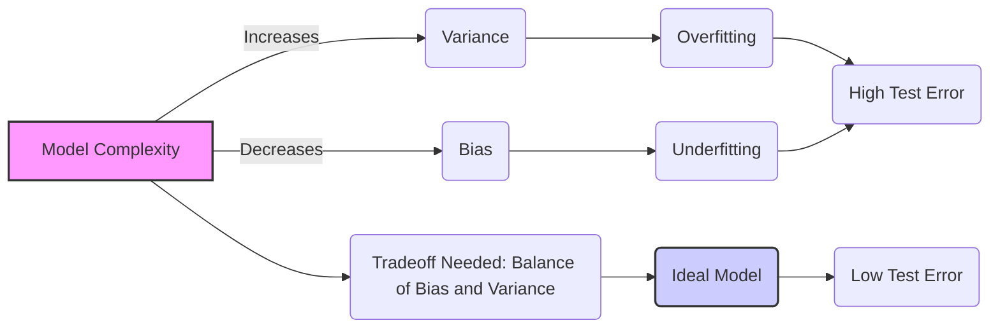
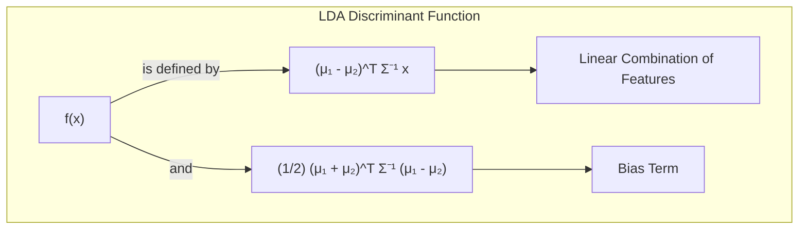
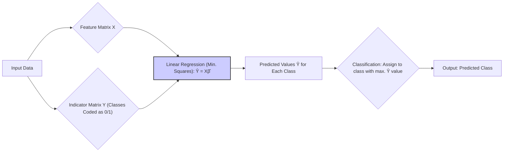
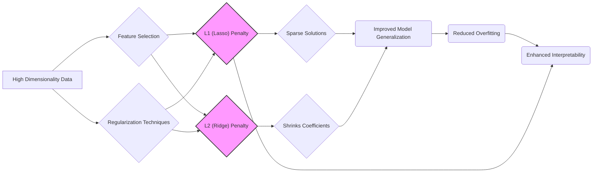
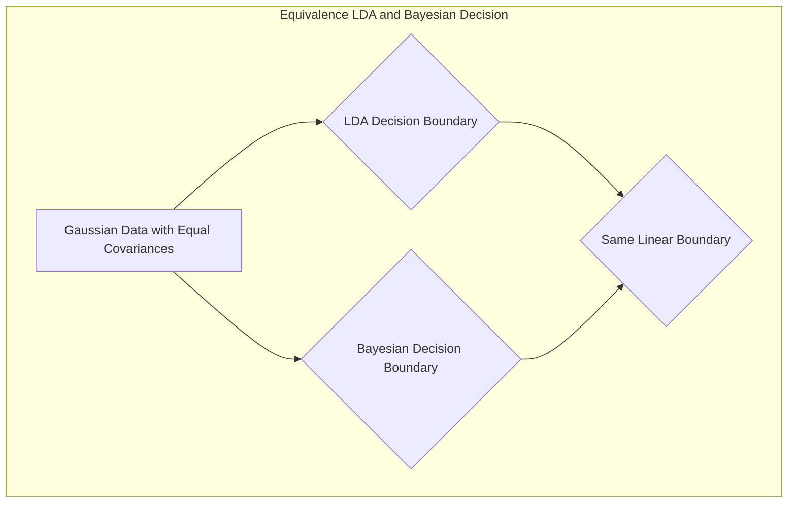

## Avaliação e Seleção de Modelos: O Dilema Bias-Variância e Interação



### Introdução

A avaliação do desempenho de um método de aprendizado, especialmente no que tange à sua capacidade de generalização para dados independentes, é um pilar central na prática de machine learning [^7.1]. Este capítulo se propõe a explorar os métodos cruciais de avaliação de desempenho e como eles são utilizados na seleção de modelos, com um foco especial na complexa interação entre **bias**, **variância** e a **complexidade do modelo**. O objetivo primordial é fornecer ao leitor um entendimento profundo de como o equilíbrio desses fatores afeta a eficácia e a confiabilidade das previsões. Em particular, iremos mergulhar na análise do *tradeoff* bias-variância e suas implicações na seleção e avaliação de modelos.

### Conceitos Fundamentais

**Conceito 1: O Problema de Classificação e o Tradeoff Bias-Variância**

O problema de classificação, em sua essência, envolve a atribuição de uma classe ou categoria a uma observação com base em um conjunto de *features* ou atributos [^7.1]. Métodos lineares, como a análise discriminante linear (LDA) ou a regressão logística, são frequentemente utilizados devido à sua simplicidade e interpretabilidade. No entanto, a escolha da complexidade do modelo linear deve ser cuidadosamente considerada para evitar problemas de **underfitting** ou **overfitting**. Um modelo excessivamente simples (baixo grau de complexidade) pode sofrer de *underfitting*, caracterizado por alto *bias* e baixa *variância*. Nesse cenário, o modelo não consegue capturar a verdadeira relação entre as *features* e as classes, resultando em previsões imprecisas. Por outro lado, um modelo muito complexo pode sofrer de *overfitting*, caracterizado por baixo *bias* e alta *variância*. Nesse caso, o modelo se ajusta excessivamente aos dados de treinamento, capturando ruídos e padrões espúrios, o que leva a uma baixa capacidade de generalização para novos dados [^7.2]. O objetivo central é, portanto, encontrar um ponto ótimo de complexidade que minimize o erro de generalização, equilibrando o *bias* e a *variância*.

> 💡 **Exemplo Numérico:** Imagine que estamos tentando classificar imagens de gatos e cachorros usando diferentes modelos.
>
> 1.  **Modelo Simples (Underfitting):** Um modelo que sempre classifica tudo como "cachorro" terá um alto *bias*, pois simplifica demais a realidade, e baixa *variância*, porque ele sempre dará a mesma resposta. O erro de treinamento e teste será alto.
> 2.  **Modelo Complexo (Overfitting):** Um modelo que memoriza todos os detalhes das imagens de treinamento, até o ruído, terá um baixo *bias* (acerta bem nos dados de treino) mas uma alta *variância*, pois pequenas mudanças nos dados de entrada (novas imagens) levam a previsões muito diferentes. O erro de treino será baixo, mas o erro de teste será alto.
> 3.  **Modelo Ideal:** Um modelo que consegue capturar a essência do que distingue gatos de cachorros, sem memorizar detalhes desnecessários, terá um equilíbrio entre *bias* e *variância*, alcançando o menor erro de generalização possível.
>
> Considere que o erro total (MSE) de um modelo pode ser decomposto em:
>
> $\text{MSE} = \text{Bias}^2 + \text{Variância} + \text{Erro Irredutível}$.
>
> Um modelo com alto *bias* e baixa *variância* pode ter:
>
> $\text{MSE} = (0.8)^2 + (0.1) + 0.1 = 0.64 + 0.1 + 0.1 = 0.84$
>
> Um modelo com baixo *bias* e alta *variância* pode ter:
>
> $\text{MSE} = (0.2)^2 + (0.7) + 0.1 = 0.04 + 0.7 + 0.1 = 0.84$
>
> E um modelo ideal, com equilíbrio entre *bias* e *variância* pode apresentar:
>
> $\text{MSE} = (0.4)^2 + (0.3) + 0.1 = 0.16 + 0.3 + 0.1 = 0.56$
>
> Este exemplo ilustra que tanto *underfitting* quanto *overfitting* levam a um erro total elevado, e o objetivo é encontrar o equilíbrio ideal para um bom desempenho em dados não vistos.

**Lemma 1:**  Em um contexto de classificação linear, a função discriminante $f(x)$ pode ser decomposta em uma soma de um termo linear $w^Tx$, onde $w$ é um vetor de pesos e $x$ o vetor de *features*, e um termo de *bias*, $b$. Formalmente, seja $f(x) = w^Tx + b$. Dado um conjunto de dados de treinamento, o ajuste do modelo se concentra na determinação dos parâmetros $w$ e $b$ que minimizam o erro de classificação em relação a um conjunto de rótulos observados $y$.

```mermaid
graph LR
    subgraph "Linear Discriminant Function"
      direction LR
        A["f(x)"] -->| "is composed of" | B["w^Tx (Linear Term)"]
        A -->| "and" | C["b (Bias Term)"]
    end
```

$$
f(x) = w^Tx + b
$$

**Prova:** A prova deriva da própria definição da função discriminante linear, que é uma combinação linear das entradas mais um termo de *bias*. $\blacksquare$

**Conceito 2: Linear Discriminant Analysis (LDA)**

A Linear Discriminant Analysis (LDA) é uma técnica de classificação que busca encontrar a projeção linear dos dados que maximiza a separação entre as classes e minimiza a variância dentro de cada classe [^7.3]. A LDA assume que os dados em cada classe seguem uma distribuição Gaussiana com covariâncias iguais [^7.3.1]. Essa suposição de normalidade e homocedasticidade permite que a LDA construa uma fronteira de decisão linear entre as classes [^7.3.2]. O processo de construção da fronteira de decisão envolve o cálculo das médias e covariâncias de cada classe, seguido pela determinação da direção que melhor separa as classes [^7.3.3]. É importante notar que, apesar de sua eficácia e simplicidade, a LDA pode não ser adequada para conjuntos de dados onde as suposições de normalidade e covariância iguais não são válidas. Nesses casos, modelos mais flexíveis, como a regressão logística ou modelos não-lineares, podem ser mais apropriados.

> 💡 **Exemplo Numérico:** Suponha que temos duas classes de dados com as seguintes médias e matriz de covariância comum:
>
> *   Classe 1 (Cachorros): $\mu_1 = [2, 2]^T$
> *   Classe 2 (Gatos): $\mu_2 = [4, 4]^T$
> *   Matriz de covariância comum: $\Sigma = \begin{bmatrix} 1 & 0.5 \\ 0.5 & 1 \end{bmatrix}$
>
> A direção do vetor de pesos *w* na LDA será proporcional à diferença das médias, ponderada pela inversa da matriz de covariância: $w \propto \Sigma^{-1}(\mu_1 - \mu_2)$.
>
> 1.  **Calculando a diferença das médias:** $\mu_1 - \mu_2 = [2-4, 2-4]^T = [-2, -2]^T$
> 2.  **Calculando a inversa da matriz de covariância:**
>
> $\Sigma^{-1} = \frac{1}{(1*1 - 0.5*0.5)} \begin{bmatrix} 1 & -0.5 \\ -0.5 & 1 \end{bmatrix} = \frac{1}{0.75} \begin{bmatrix} 1 & -0.5 \\ -0.5 & 1 \end{bmatrix} = \begin{bmatrix} 1.33 & -0.67 \\ -0.67 & 1.33 \end{bmatrix}$
>
> 3.  **Calculando o vetor de pesos (não normalizado):** $w = \Sigma^{-1}(\mu_1 - \mu_2) = \begin{bmatrix} 1.33 & -0.67 \\ -0.67 & 1.33 \end{bmatrix} \begin{bmatrix} -2 \\ -2 \end{bmatrix} = \begin{bmatrix} -1.33 \\ -1.33 \end{bmatrix}$
>
> A fronteira de decisão da LDA será um hiperplano ortogonal a *w* e que passa pelo ponto médio entre as médias das classes.  Para um ponto $x = [x_1, x_2]^T$, a função discriminante será $f(x) = -1.33x_1 - 1.33x_2 + b$  onde *b* é o termo de *bias*. Para classificar um novo ponto, avaliamos o sinal da função discriminante.

**Corolário 1:** A função discriminante linear da LDA pode ser expressa como $f(x) = w^Tx + b$, onde $w$ é o vetor de pesos obtido a partir da diferença entre as médias das classes, ponderada pela inversa da matriz de covariância agrupada, e $b$ é um termo de *bias*. A projeção dos dados em um subespaço de dimensão inferior, como a linha definida pela função discriminante, facilita a visualização e a análise dos dados.



$$
f(x) = (\mu_1 - \mu_2)^T\Sigma^{-1}x +  \frac{1}{2} (\mu_1 + \mu_2)^T\Sigma^{-1}(\mu_1 - \mu_2)
$$

**Prova:** O corolário decorre da própria derivação da função discriminante na LDA, que resulta da projeção dos dados na direção que maximiza a razão entre a variância entre as classes e a variância dentro das classes. $\blacksquare$

**Conceito 3: Logistic Regression**

A regressão logística é um modelo estatístico que estima a probabilidade de um evento binário (ou uma classe) ocorrer [^7.4]. Diferentemente da regressão linear, a regressão logística utiliza a função *logit* para mapear a combinação linear das *features* para um intervalo de probabilidade entre 0 e 1 [^7.4.1]. Essa função *logit* é definida como o logaritmo da razão de *odds* (probabilidade de sucesso dividida pela probabilidade de fracasso). A regressão logística estima os parâmetros do modelo através da maximização da função de verossimilhança (likelihood), que mede a plausibilidade dos dados observados dados os parâmetros do modelo [^7.4.2]. A maximização da verossimilhança é geralmente realizada por métodos iterativos, como o *gradient ascent* ou métodos *Newton-Raphson* [^7.4.3]. A regressão logística pode ser vista como uma alternativa à LDA, especialmente quando as suposições de normalidade da LDA não são válidas [^7.4.4]. Além disso, a regressão logística fornece estimativas probabilísticas que podem ser usadas para quantificar a incerteza das previsões. A escolha entre LDA e regressão logística depende das propriedades do conjunto de dados e do objetivo do problema de classificação. Uma questão importante é o uso de classes não-balanceadas, que pode influenciar o aprendizado do modelo, exigindo técnicas de balanceamento de dados ou penalização da função de custo [^7.4.5].

> 💡 **Exemplo Numérico:** Suponha que temos dados sobre se um aluno foi aprovado ou não em um exame, com base em horas de estudo ($x$). Um modelo de regressão logística poderia ter a seguinte forma:
>
> $$ p(aprovação | x) = \frac{1}{1 + e^{-(\beta_0 + \beta_1 x)}} $$
>
> onde $\beta_0$ e $\beta_1$ são parâmetros a serem estimados.
>
> 1.  **Estimando os parâmetros:** Após o ajuste do modelo por máxima verossimilhança (e.g., usando scikit-learn), obtemos os seguintes parâmetros: $\beta_0 = -4$ e $\beta_1 = 0.8$.
> 2.  **Calculando a probabilidade:** Para um aluno que estudou 5 horas, a probabilidade de aprovação seria:
>
> $$ p(aprovação | 5) = \frac{1}{1 + e^{-(-4 + 0.8 \times 5)}} = \frac{1}{1 + e^{-0}} = \frac{1}{1 + 1} = 0.5 $$
>
> Assim, para esse aluno, a probabilidade de aprovação é de 50%.
>
> 3.  **Interpretação:** O parâmetro $\beta_1 = 0.8$ indica que, a cada hora de estudo adicional, o log-odds de aprovação aumenta em 0.8, o que se traduz em um aumento na probabilidade de aprovação.
>
> Uma análise dos resíduos poderia envolver a comparação entre a probabilidade prevista e a classe real, por exemplo, usando um gráfico de dispersão de probabilidade versus resíduo.

> ⚠️ **Nota Importante**: A regressão logística, ao contrário da regressão linear, modela a probabilidade de um evento, através do uso da função *logit*, que garante que as previsões se mantenham no intervalo [0,1]. **Referência ao tópico [^7.4.1]**.
> ❗ **Ponto de Atenção**: Em situações de classes desbalanceadas, a regressão logística pode ser mais sensível a classes majoritárias, o que pode influenciar o desempenho em classes minoritárias. Métodos de balanceamento são recomendados. **Conforme indicado em [^7.4.2]**.
> ✔️ **Destaque**: Apesar de suas diferenças, tanto a LDA quanto a regressão logística podem, em muitos casos, resultar em limites de decisão semelhantes, especialmente para problemas de classificação binária. **Baseado no tópico [^7.5]**.

### Regressão Linear e Mínimos Quadrados para Classificação



A aplicação da regressão linear em matrizes indicadoras para problemas de classificação representa uma abordagem alternativa para a construção de modelos preditivos [^7.2]. Nessa abordagem, cada classe é codificada como uma variável binária (0 ou 1) em uma matriz de indicadores. A regressão linear é então aplicada para prever essas variáveis indicadoras. A classe prevista para uma nova observação é aquela associada à variável indicadora com maior valor previsto [^7.2]. Embora essa abordagem possa ser intuitiva, ela apresenta algumas limitações notáveis. Uma delas é a tendência de produzir estimativas de probabilidade fora do intervalo [0,1], o que pode ser problemático em cenários onde uma interpretação probabilística é desejada. Além disso, a regressão linear em matrizes indicadoras não leva em consideração explicitamente a estrutura de covariância entre as classes, o que pode ser uma deficiência em comparação com a LDA [^7.3]. O *masking problem*, onde uma classe pode ser mascarada por outra devido à covariância entre classes, ilustra bem essa limitação. No entanto, em alguns cenários onde o objetivo primário é encontrar uma fronteira de decisão linear, a regressão em matrizes indicadoras pode ser uma solução eficaz e computacionalmente eficiente. É importante notar que, em situações de múltiplas classes, a aplicação da regressão linear em matrizes de indicadores pode apresentar resultados menos precisos do que abordagens mais especializadas, como a LDA.

> 💡 **Exemplo Numérico:** Imagine que temos três classes de flores: Iris Setosa, Iris Versicolor e Iris Virginica. Usando regressão linear com matrizes indicadoras, criamos uma matriz *Y* com três colunas, onde cada coluna representa uma classe. Se a flor *i* for da classe Iris Setosa, a linha *i* de *Y* terá um 1 na primeira coluna e 0 nas demais.

> Digamos que temos o seguinte conjunto de dados:
>
> | Amostra | Feature 1 | Feature 2 | Classe        |
> | :------- | :-------- | :-------- | :------------ |
> | 1        | 2         | 3         | Setosa        |
> | 2        | 3         | 4         | Versicolor    |
> | 3        | 4         | 5         | Virginica     |
> | 4        | 2.5       | 3.5       | Setosa        |
> | 5        | 3.5       | 4.5       | Versicolor    |
>
> A matriz de *features* X é:
>
> $$ X = \begin{bmatrix} 2 & 3 \\ 3 & 4 \\ 4 & 5 \\ 2.5 & 3.5 \\ 3.5 & 4.5 \end{bmatrix} $$
>
> A matriz de indicadores *Y* é:
>
> $$ Y = \begin{bmatrix} 1 & 0 & 0 \\ 0 & 1 & 0 \\ 0 & 0 & 1 \\ 1 & 0 & 0 \\ 0 & 1 & 0 \end{bmatrix} $$
>
> 1.  **Calculando os coeficientes:** Usando a fórmula de mínimos quadrados, $\hat{\beta} = (X^TX)^{-1}X^TY$.
>
>     ```python
>     import numpy as np
>     from sklearn.linear_model import LinearRegression
>
>     X = np.array([[2, 3], [3, 4], [4, 5], [2.5, 3.5], [3.5, 4.5]])
>     Y = np.array([[1, 0, 0], [0, 1, 0], [0, 0, 1], [1, 0, 0], [0, 1, 0]])
>
>     model = LinearRegression()
>     model.fit(X, Y)
>     beta_hat = model.coef_
>     print("Coeficientes Beta:\n", beta_hat)
>     ```
>
>     O resultado de $\beta$ (arredondado) é algo como:
>
>     ```
>     Coeficientes Beta:
>      [[-0.50, -0.30,  0.80],
>      [-0.40, -0.20,  0.60]]
>     ```
>
> 2.  **Predizendo para uma nova flor com features x_0 = \[3, 4]:**  $\hat{y_0} = \beta x_0$
>
> $$ \hat{y_0} = \begin{bmatrix} -0.5 & -0.4 \\ -0.3 & -0.2 \\ 0.8 & 0.6 \end{bmatrix} \begin{bmatrix} 3 \\ 4 \end{bmatrix} = \begin{bmatrix} -3.1 \\ -2.7 \\ 4.8 \end{bmatrix} $$
>
> 3. **Decisão**: A classe com o maior valor é a terceira, então a nova flor é classificada como Virginica.
>
>   Notar que o *output* $\hat{y_0}$ não precisa ser entre 0 e 1, mas a maior entrada indica a classe predita.

**Lemma 2:** A solução dos mínimos quadrados para a regressão linear em matrizes indicadoras pode ser vista como uma projeção ortogonal dos rótulos das classes no espaço gerado pelas *features*, sob certas condições de ortogonalidade. Formalmente, seja $Y$ a matriz de indicadores e $X$ a matriz de *features*, a solução dos mínimos quadrados $\hat{\beta}$ é dada por:

```mermaid
graph LR
    subgraph "Least Squares Solution"
        direction LR
        A["β̂"] -->| "is derived from" | B["(X^TX)^-1"]
        B -->| "multiplied by"| C["X^TY"]
        D["Y : Indicator Matrix"]
        E["X : Feature Matrix"]
        C --> F["Projection of Y onto X"]
        D --> C
        E --> B
    end
```

$$
\hat{\beta} = (X^TX)^{-1}X^TY
$$
Onde $(X^TX)^{-1}X^T$ representa a projeção ortogonal de $Y$ em $X$.

**Prova:** A prova decorre da derivação da solução dos mínimos quadrados, que minimiza a soma dos quadrados dos resíduos. $\blacksquare$

**Corolário 2:** Dada a solução de mínimos quadrados $\hat{\beta}$, a previsão para uma nova observação $x_0$ é dada por $\hat{y_0} = \hat{\beta}x_0$. Sob certas condições, as projeções nos hiperplanos de decisão gerados pela regressão linear são equivalentes aos hiperplanos discriminantes lineares gerados pela LDA, o que pode simplificar a análise do modelo.

**Prova:** O corolário decorre diretamente da aplicação da solução de mínimos quadrados para a previsão de novas observações e da equivalência com LDA sob certas condições. $\blacksquare$

É fundamental reconhecer as limitações inerentes à regressão linear de indicadores. Como mencionado em [^7.4], a regressão logística frequentemente oferece estimativas mais robustas de probabilidade, enquanto a regressão de indicadores pode levar a extrapolações fora do intervalo [0,1]. Entretanto, como aponta [^7.2], existem cenários onde a regressão linear de indicadores se mostra adequada e até mesmo vantajosa, especialmente quando o foco é a fronteira de decisão linear.

### Métodos de Seleção de Variáveis e Regularização em Classificação



A seleção de variáveis e a regularização são técnicas cruciais para lidar com modelos complexos e conjuntos de dados de alta dimensionalidade, onde o risco de *overfitting* é elevado [^7.5]. A regularização, em particular, adiciona termos de penalização à função de custo do modelo, incentivando soluções mais simples e estáveis [^7.4.4]. A penalização L1, por exemplo, promove a *sparsity*, ou seja, a seleção de um subconjunto de *features* mais relevantes, através da penalização da soma dos valores absolutos dos coeficientes [^7.5.1]. Por outro lado, a penalização L2 promove coeficientes menores através da penalização da soma dos quadrados dos coeficientes, o que ajuda a reduzir a influência de *features* individuais no modelo [^7.5.2]. A adoção dessas penalidades pode ter um impacto significativo na capacidade de generalização do modelo, uma vez que elas controlam a complexidade do modelo e previnem o *overfitting*. A combinação dessas penalidades, conhecida como *Elastic Net*, oferece uma abordagem flexível para o problema, permitindo a exploração de soluções com diferentes graus de *sparsity* e estabilidade. No contexto de classificação, essas técnicas de regularização podem ser aplicadas em modelos como a regressão logística para otimizar o equilíbrio entre *bias* e *variância*, resultando em modelos mais robustos e interpretáveis.

> 💡 **Exemplo Numérico:** Considere um problema de classificação com 5 *features* e um modelo de regressão logística. Queremos comparar o efeito da regularização L1 e L2.
>
> 1.  **Sem regularização:**
>
>     A função de custo é somente a verossimilhança negativa (ou log-loss). Após ajustar um modelo sem regularização, obtemos um vetor de coeficientes:
>
>     $ \beta = [1.2, -0.8, 0.5, 0.9, -1.1]$.
>
> 2.  **Regularização L1 (Lasso):**
>
>     A função de custo agora inclui a penalização L1:
>     $J(\beta) = \text{LogLoss} + \lambda \sum_{j=1}^5 |\beta_j|$
>
>    Se usarmos $\lambda=0.5$, após o ajuste do modelo, alguns coeficientes podem ser reduzidos a zero:
>
>     $ \beta_{L1} = [0.8, -0.3, 0, 0.6, -0.7]$.
>     Note que os coeficientes são menores, e a *feature* 3 foi eliminada. A L1 promove a *sparsity*.
>
> 3.  **Regularização L2 (Ridge):**
>
>     A função de custo agora inclui a penalização L2:
>     $J(\beta) = \text{LogLoss} + \lambda \sum_{j=1}^5 \beta_j^2$
>
>     Se usarmos $\lambda=0.5$, após o ajuste do modelo, os coeficientes diminuem em magnitude:
>
>     $ \beta_{L2} = [0.9, -0.6, 0.4, 0.7, -0.8]$.
>
> 4.  **Comparação:**
>
>     | Método      | $\beta_1$ | $\beta_2$ | $\beta_3$ | $\beta_4$ | $\beta_5$ | Sparsity |
>     | :---------- | :-------- | :-------- | :-------- | :-------- | :-------- | :------- |
>     | Sem Regularização | 1.2      | -0.8      | 0.5      | 0.9      | -1.1      | Não      |
>     | L1          | 0.8       | -0.3      | 0        | 0.6       | -0.7      | Sim      |
>     | L2          | 0.9       | -0.6      | 0.4      | 0.7       | -0.8      | Não      |
>
>     O L1 leva a um modelo mais simples, com menos features, o que pode ser útil para interpretabilidade e reduzir *overfitting*. Já o L2 mantém todas as features, mas com coeficientes menores, o que melhora a estabilidade do modelo.

**Lemma 3:** A aplicação da penalização L1 na regressão logística resulta em coeficientes esparsos, ou seja, muitos coeficientes tendem a ser exatamente iguais a zero. Seja a função de custo da regressão logística com penalização L1 dada por:

```mermaid
graph LR
    subgraph "L1 Regularized Logistic Regression"
        direction LR
        A["J(β)"] -->| "Cost Function" | B["Negative Log Likelihood"]
        A -->| "Plus" | C["λ Σ|βj| (L1 Penalty)"]
    end
```
$$
J(\beta) = - \sum_{i=1}^N \left[ y_i \log(p(x_i)) + (1 - y_i) \log(1 - p(x_i)) \right] + \lambda \sum_{j=1}^p |\beta_j|
$$
Onde $\lambda$ é o parâmetro de regularização. A penalidade L1 impõe uma restrição geométrica em forma de diamante, que tende a interceptar os eixos, forçando alguns $\beta_j$ a serem zero.

**Prova:** A prova deriva da geometria do problema de otimização com penalização L1, que introduz uma restrição que favorece soluções com muitos coeficientes iguais a zero. $\blacksquare$

**Corolário 3:** A esparsidade resultante da penalização L1 aumenta a interpretabilidade do modelo, já que apenas as *features* mais relevantes são incluídas no modelo. Isso facilita a compreensão dos fatores que influenciam a decisão de classificação e permite a identificação de variáveis importantes para o problema.

> ⚠️ **Ponto Crucial**: A escolha entre penalização L1, L2 ou *Elastic Net* depende do problema em questão e do objetivo da análise. A L1 favorece *sparsity*, enquanto a L2 promove estabilidade. *Elastic Net* combina os benefícios das duas. **conforme discutido em [^7.5]**.

### Separating Hyperplanes e Perceptrons

A busca por hiperplanos ótimos que maximizem a margem de separação entre as classes é um conceito central em algoritmos como o *Support Vector Machine* (SVM) e o *Perceptron* [^7.5.2], [^7.5.1]. A ideia é encontrar um hiperplano que não apenas separe as classes, mas também maximize a distância entre o hiperplano e os pontos mais próximos de cada classe. Esses pontos, chamados de *support vectors*, desempenham um papel fundamental na definição da fronteira de decisão. A formulação desse problema como um problema de otimização quadrática, utilizando o dual de Wolfe, permite a obtenção da solução de forma eficiente [^7.5.2]. As soluções para esse problema são uma combinação linear dos *support vectors*. O *Perceptron* de Rosenblatt, por outro lado, é um algoritmo de aprendizado que itera sobre os pontos de treinamento, atualizando os pesos do modelo até que os dados estejam linearmente separados [^7.5.1]. A convergência do *Perceptron* é garantida sob a condição de que os dados sejam linearmente separáveis. Apesar de sua simplicidade, o *Perceptron* e outros algoritmos de hiperplanos separadores fornecem uma base teórica e prática importante para a construção de modelos de classificação linear robustos.

### Pergunta Teórica Avançada: Quais as diferenças fundamentais entre a formulação de LDA e a Regra de Decisão Bayesiana considerando distribuições Gaussianas com covariâncias iguais?

**Resposta:**
Sob a suposição de que os dados em cada classe seguem uma distribuição Gaussiana com covariâncias iguais, tanto a LDA quanto a regra de decisão Bayesiana resultam na mesma fronteira de decisão linear [^7.3]. A LDA, no entanto, deriva sua fronteira de decisão da maximização da razão entre a variância interclasses e a variância intraclasses, enquanto a regra de decisão Bayesiana deriva sua fronteira da comparação das probabilidades *a posteriori* de cada classe. De forma mais específica, se $p(x|C_k)$ é a densidade condicional de $x$ dado que pertence à classe $C_k$, e $\pi_k$ é a probabilidade *a priori* da classe $C_k$, então a regra de decisão Bayesiana atribui $x$ à classe $C_j$ tal que:

$$
j = \text{argmax}_k  \pi_k p(x|C_k)
$$

No caso Gaussiano com covariâncias iguais $\Sigma$, a densidade condicional é dada por:
$$
p(x|C_k) = \frac{1}{(2\pi)^{p/2}|\Sigma|^{1/2}} e^{-\frac{1}{2}(x-\mu_k)^T \Sigma^{-1} (x-\mu_k)}
$$

Ao substituir a densidade na equação da decisão Bayesiana e considerar os termos constantes, a regra de decisão se torna:

$$
j = \text{argmax}_k  \pi_k  e^{-\frac{1}{2}(x-\mu_k)^T \Sigma^{-1} (x-\mu_k)}
$$
Tomando o logaritmo e eliminando termos constantes, a decisão se torna equivalente à função discriminante da LDA.

**Lemma 4:** Sob a hipótese de distribuições Gaussianas com covariâncias iguais, a fronteira de decisão da LDA é equivalente à fronteira de decisão Bayesiana. Formalmente, seja $f_{LDA}(x)$ a função discriminante da LDA e $f_{Bayes}(x)$ a função discriminante Bayesiana. Então, $f_{LDA}(x) = f_{Bayes}(x)$.



**Prova:** A prova consiste em mostrar que a função discriminante da LDA e a função discriminante Bayesiana, derivadas sob as suposições de normalidade e covariâncias iguais, resultam na mesma forma funcional. **Baseando-se em [^7.3], [^7.3.3] e [^7.11]** $\blacksquare$

**Corolário 4:** Ao relaxar a hipótese de covariâncias iguais, a fronteira de decisão Bayesiana se torna quadrática, levando à Análise Discriminante Quadrática (QDA). Nesse caso, a função discriminante não é mais linear, o que permite a modelagem de fronteiras de decisão mais complexas.

> ⚠️ **Ponto Crucial**: A escolha entre LDA (fronteiras lineares) e QDA (fronteiras quadráticas) depende da validade da hipótese de covariâncias iguais. Se essa hipótese não se sustenta, a QDA pode oferecer um ajuste melhor aos dados, **conforme discutido em [^7.3.1]**.

As perguntas devem ser altamente relevantes, **avaliar a compreensão profunda de conceitos teóricos-chave**, podem envolver derivações matemáticas e provas, e focar em análises teóricas.

### Conclusão

Neste capítulo, exploramos em profundidade o intrincado relacionamento entre *bias*, *variância* e complexidade do modelo, assim como métodos essenciais para a avaliação e seleção de modelos de classificação. Ab