## Avaliação e Seleção de Modelos: Foco no Bias Quadrático em Classificação

<imagem: Um mapa mental mostrando a hierarquia de métodos de avaliação de modelos, com um ramo dedicado ao Bias Quadrático em Classificação, conectando-o a conceitos como viés e variância e diferentes métodos como cross-validação e bootstrap.>
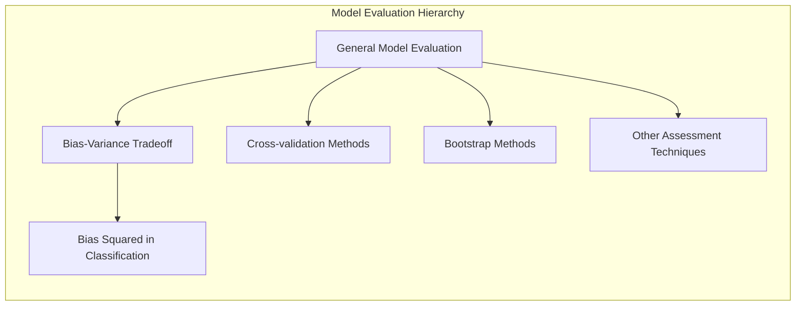

### Introdução

A performance de generalização de um método de aprendizado está intrinsecamente ligada à sua capacidade de prever dados independentes e não vistos [^7.1]. A avaliação desta performance é crucial na prática, pois direciona a escolha do método ou modelo de aprendizado e quantifica a qualidade do modelo selecionado [^7.1]. Este capítulo aborda os principais métodos de avaliação de desempenho e como eles são utilizados na seleção de modelos. O capítulo inicia com a discussão da interação entre viés (**bias**), variância e complexidade do modelo.

### Conceitos Fundamentais

**Conceito 1: Problema de Classificação e Métodos Lineares**

O **problema de classificação** envolve a atribuição de observações a categorias ou classes predefinidas, com base em seus atributos ou características [^7.1]. Métodos lineares, que utilizam combinações lineares de atributos para formar fronteiras de decisão, são amplamente empregados devido à sua simplicidade e interpretabilidade [^7.1]. No entanto, a escolha de métodos lineares pode levar a um trade-off entre viés e variância. Um modelo linear pode ter um **alto viés** (incapacidade de capturar a verdadeira relação entre as variáveis), resultando em um *underfitting* (ajuste insuficiente) dos dados [^7.2]. Por outro lado, modelos mais complexos tendem a apresentar menor viés, mas maior variância. Este *trade-off* é essencial para a escolha e avaliação de modelos.

> 💡 **Exemplo Numérico:** Considere um problema de classificação onde as classes são separadas por uma fronteira circular. Um modelo linear (como LDA ou regressão logística com apenas variáveis lineares) teria dificuldade em ajustar-se a esses dados. Este modelo sofreria de alto viés pois não pode capturar a relação não-linear entre os atributos e as classes, resultando em muitos erros de classificação. Por outro lado, um modelo polinomial de alta ordem poderia se ajustar melhor, mas com o risco de overfitting.
 ```mermaid
  graph LR
      A["Dados com fronteira circular"] --> B("Modelo Linear - Alto Viés");
      A --> C("Modelo Polinomial - Baixo Viés, Alta Variância");
      B --> D{"Underfitting"};
      C --> E{"Overfitting ou bom ajuste dependendo da complexidade"};
 ```

**Lemma 1:** *Em problemas de classificação com duas classes, as fronteiras de decisão ótimas baseiam-se nas probabilidades posteriores das classes, e a escolha de métodos lineares frequentemente leva a aproximações dessas fronteiras.*
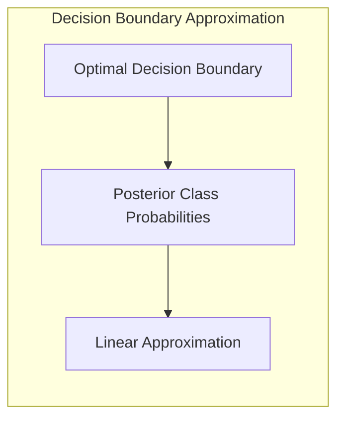

Essa afirmação implica que, mesmo que a verdadeira fronteira de decisão seja não linear, uma aproximação linear pode ser útil dependendo do *trade-off* entre a complexidade do modelo e a qualidade da aproximação. A forma linear das fronteiras de decisão em modelos como LDA e regressão logística [^4.3] e [^4.4] são exemplos práticos disso.

**Conceito 2: Linear Discriminant Analysis (LDA)**

A **Linear Discriminant Analysis (LDA)** é um método de classificação que busca projetar os dados em um espaço de menor dimensão de forma a maximizar a separação entre as classes [^4.3]. A LDA assume que os dados em cada classe seguem uma distribuição normal com a mesma matriz de covariância [^4.3.1]. A fronteira de decisão na LDA é linear e é definida como o local geométrico onde as probabilidades posteriores das classes são iguais [^4.3.2]. As funções discriminantes lineares são baseadas na análise das médias e covariâncias das classes e podem ser interpretadas como projeções dos dados em um subespaço que maximiza a separabilidade das classes [^4.3.3]. O LDA é útil quando há uma separabilidade linear razoável entre as classes e quando as suposições de normalidade e covariância são aproximadamente válidas.

> 💡 **Exemplo Numérico:** Considere duas classes, A e B, com as seguintes médias e matriz de covariância comum:
> $\mu_A = \begin{bmatrix} 1 \\ 2 \end{bmatrix}$, $\mu_B = \begin{bmatrix} 3 \\ 1 \end{bmatrix}$, e $\Sigma = \begin{bmatrix} 1 & 0.5 \\ 0.5 & 1 \end{bmatrix}$. A função discriminante linear do LDA é dada por:
> $\delta_k(x) = x^T \Sigma^{-1} \mu_k - \frac{1}{2} \mu_k^T \Sigma^{-1} \mu_k + \log \pi_k$.  Calculando a inversa da matriz de covariância: $\Sigma^{-1} = \frac{1}{0.75}\begin{bmatrix} 1 & -0.5 \\ -0.5 & 1 \end{bmatrix} = \begin{bmatrix} 1.33 & -0.67 \\ -0.67 & 1.33 \end{bmatrix}$. Assumindo probabilidades a priori iguais ($\pi_A = \pi_B = 0.5$), podemos calcular as funções discriminantes para cada classe:
> $\delta_A(x) = x^T  \begin{bmatrix} 1.33 & -0.67 \\ -0.67 & 1.33 \end{bmatrix} \begin{bmatrix} 1 \\ 2 \end{bmatrix} - \frac{1}{2}\begin{bmatrix} 1 \\ 2 \end{bmatrix}^T \begin{bmatrix} 1.33 & -0.67 \\ -0.67 & 1.33 \end{bmatrix} \begin{bmatrix} 1 \\ 2 \end{bmatrix} + \log(0.5)$
> $\delta_B(x) = x^T  \begin{bmatrix} 1.33 & -0.67 \\ -0.67 & 1.33 \end{bmatrix} \begin{bmatrix} 3 \\ 1 \end{bmatrix} - \frac{1}{2}\begin{bmatrix} 3 \\ 1 \end{bmatrix}^T \begin{bmatrix} 1.33 & -0.67 \\ -0.67 & 1.33 \end{bmatrix} \begin{bmatrix} 3 \\ 1 \end{bmatrix} + \log(0.5)$
> A fronteira de decisão é onde $\delta_A(x) = \delta_B(x)$. Simplificando as expressões, podemos encontrar a equação da reta que define a fronteira entre as classes. Pontos de um lado da reta serão classificados como A, e do outro lado como B.
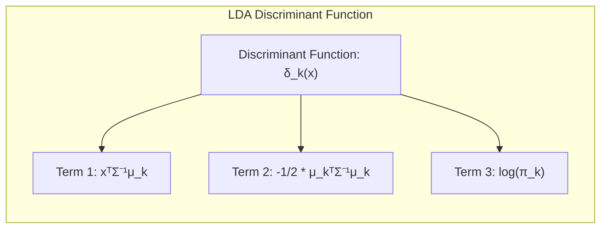
**Corolário 1:** *Sob a hipótese de igualdade das matrizes de covariância, as funções discriminantes lineares do LDA levam a fronteiras de decisão lineares, as quais podem ser derivadas tanto por meio de análise discriminante quanto por meio de regressão linear de matrizes de indicadores.* [^4.2] e [^4.3.1]
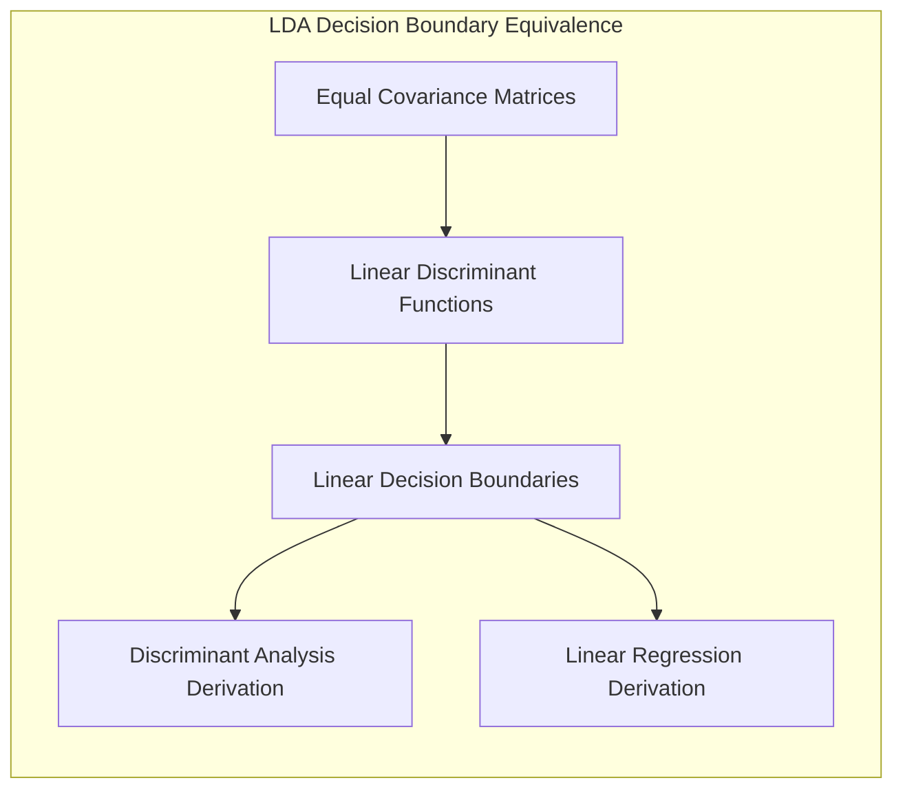

Este corolário estabelece que a projeção realizada pelo LDA em um subespaço de menor dimensão é consistente com a separação linear das classes, ressaltando a equivalência formal sob certas condições.

**Conceito 3: Logistic Regression**

A **Logistic Regression** é um método de classificação que modela a probabilidade de uma observação pertencer a uma determinada classe por meio de uma função sigmóide (logit) de uma combinação linear de atributos [^4.4]. A função *logit* transforma probabilidades em *log-odds*, o que é uma função linear das variáveis preditoras [^4.4.1]. Os parâmetros da regressão logística são estimados por meio da maximização da verossimilhança (**maximum likelihood**) [^4.4.2]. A logística assume que as probabilidades das classes são modeladas por uma função sigmóide, enquanto o LDA assume que as classes seguem uma distribuição normal [^4.4.3]. A regressão logística é mais flexível que a LDA e pode ser usada em situações onde as suposições de normalidade não são válidas [^4.4.4]. Em cenários com classes não balanceadas, a escolha da função de verossimilhança e regularização podem impactar significativamente a performance da regressão logística [^4.4.5].

> 💡 **Exemplo Numérico:** Considere um problema de classificação binária com um único atributo $x$ e um modelo de regressão logística: $p(Y=1|x) = \frac{1}{1 + e^{-(\beta_0 + \beta_1 x)}}$. Suponha que após o treinamento, os parâmetros estimados sejam $\beta_0 = -2$ e $\beta_1 = 1$. Para um ponto $x = 3$, a probabilidade predita da classe $Y=1$ é $p(Y=1|x=3) = \frac{1}{1 + e^{-(-2 + 1 \cdot 3)}} = \frac{1}{1 + e^{-1}} \approx 0.73$. A probabilidade predita da classe $Y=0$ é $1 - 0.73 = 0.27$. Se a classe limite for $0.5$, este ponto seria classificado como $Y=1$.
>
> ```python
> import numpy as np
>
> def sigmoid(z):
>    return 1 / (1 + np.exp(-z))
>
> beta0 = -2
> beta1 = 1
> x = 3
>
> prob_y1 = sigmoid(beta0 + beta1 * x)
> prob_y0 = 1 - prob_y1
>
> print(f"Probabilidade de Y=1: {prob_y1:.2f}")
> print(f"Probabilidade de Y=0: {prob_y0:.2f}")
> ```
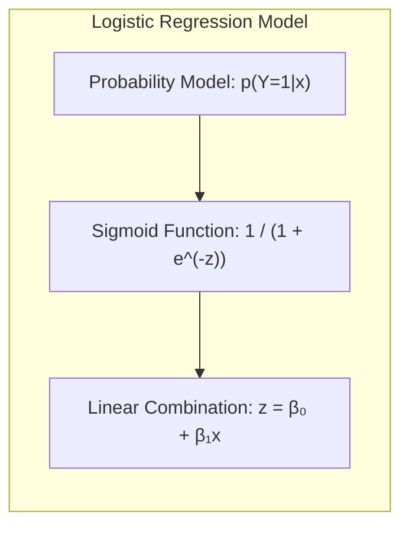

> ⚠️ **Nota Importante**: A regressão logística modela diretamente a probabilidade de pertencimento a uma classe, enquanto o LDA assume distribuições gaussianas para cada classe. [^4.4.1]
> ❗ **Ponto de Atenção**: Em datasets com classes não-balanceadas, o uso de *weights* na função de perda pode melhorar o desempenho da regressão logística. [^4.4.2]
> ✔️ **Destaque**: Os parâmetros estimados em LDA e em regressão logística podem ser semelhantes sob certas condições, mas suas interpretações e fundamentos são diferentes. [^4.5]

### Regressão Linear e Mínimos Quadrados para Classificação

<imagem: Diagrama de fluxo mostrando o processo de regressão de indicadores para classificação. As etapas incluem a codificação das classes, a estimativa dos coeficientes via mínimos quadrados, a aplicação da regra de decisão e a comparação com métodos probabilísticos.>
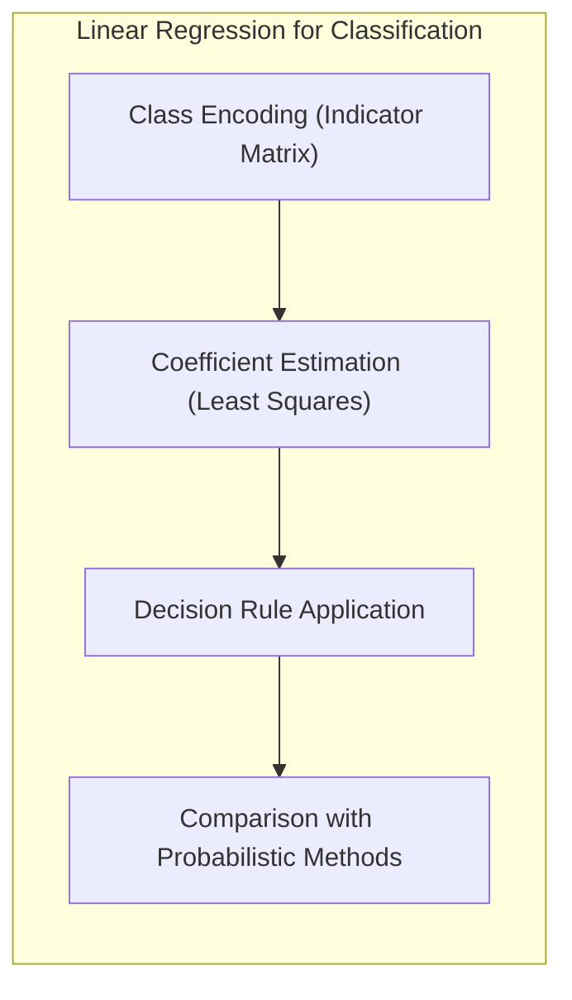

A regressão linear, quando aplicada a uma matriz de indicadores que codifica as classes, pode ser utilizada para construir um classificador [^4.2]. Nesse caso, cada classe é representada por um vetor de zeros, exceto por um ‘1’ na posição correspondente à classe. Os coeficientes são estimados utilizando o método dos **mínimos quadrados (least squares)**, e a classificação é realizada com base na classe que corresponde ao maior valor estimado. No entanto, este método apresenta limitações, especialmente quando as classes são não-lineares separáveis ou quando os dados contêm *outliers*. Além disso, as estimativas obtidas pela regressão linear podem não estar necessariamente entre 0 e 1, o que dificulta sua interpretação em termos de probabilidade. Conforme demonstrado em [^4.2], este método não é tão eficaz quanto outros métodos probabilísticos como LDA e regressão logística, quando a inferência de probabilidade é importante. A regressão linear assume homocedasticidade e normalidade dos erros o que não necessariamente é verdadeiro em problemas de classificação.

> 💡 **Exemplo Numérico:** Considere um problema de classificação com três classes (A, B, C) e duas features. Temos 5 amostras para cada classe. A matriz de indicadores `Y` terá dimensões 15x3, e a matriz de features `X` terá dimensões 15x2. Após aplicar regressão linear, obtemos uma matriz de predições `Y_hat` (15x3) onde cada linha é a predição da regressão para cada observação para as três classes. A classificação é então feita selecionando a classe com o maior valor predito para cada observação.
>
> ```python
> import numpy as np
> from sklearn.linear_model import LinearRegression
>
> # Dados de exemplo (15 amostras, 2 features)
> X = np.array([[1, 1], [1, 2], [1, 3], [2, 1], [2, 2],
>              [2, 3], [3, 1], [3, 2], [3, 3], [4, 1],
>              [4, 2], [4, 3], [5, 1], [5, 2], [5, 3]])
>
> # Matriz de indicadores para 3 classes (15 amostras, 3 classes)
> Y = np.array([[1, 0, 0], [1, 0, 0], [1, 0, 0], [1, 0, 0], [1, 0, 0],
>              [0, 1, 0], [0, 1, 0], [0, 1, 0], [0, 1, 0], [0, 1, 0],
>              [0, 0, 1], [0, 0, 1], [0, 0, 1], [0, 0, 1], [0, 0, 1]])
>
> # Regressão linear
> model = LinearRegression()
> model.fit(X, Y)
> Y_hat = model.predict(X)
>
> # Classificação (selecionar a classe com maior valor predito)
> predicted_classes = np.argmax(Y_hat, axis=1)
> print("Classes Preditas:", predicted_classes)
> ```
>
> Note que os valores em `Y_hat` podem estar fora do intervalo [0,1].

**Lemma 2:** *Em problemas de classificação, a regressão linear em matriz de indicadores, com a regra de decisão baseada no maior valor estimado, pode levar a limites de decisão similares aos obtidos pelo LDA quando as covariâncias das classes são aproximadamente iguais.*
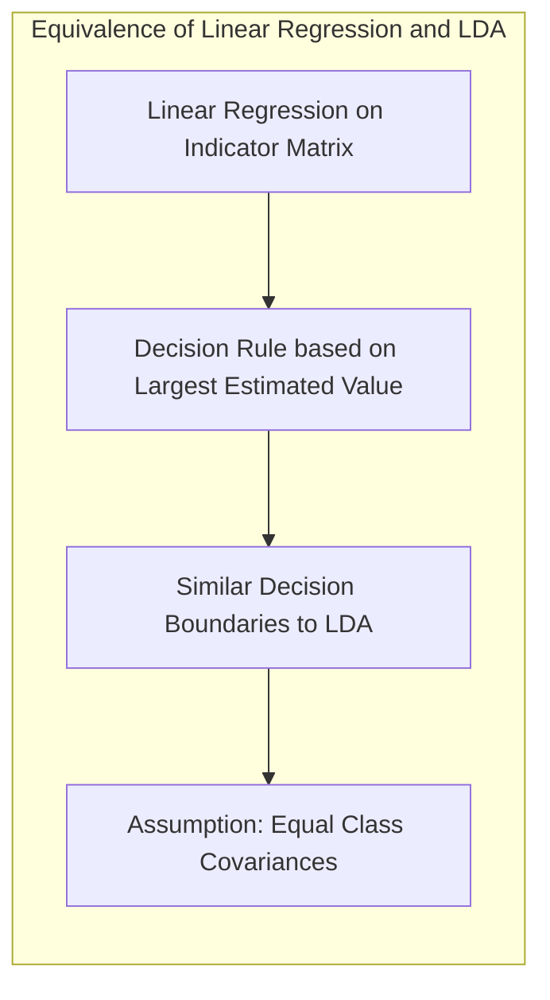
Essa equivalência, sob certas condições, surge devido à natureza linear de ambos os métodos e é um ponto de convergência importante a ser compreendido.

**Corolário 2:** *Quando as matrizes de covariância das classes são distintas, a regressão linear em matriz de indicadores pode não capturar as complexidades da separação das classes, sendo a LDA uma alternativa mais adequada.*
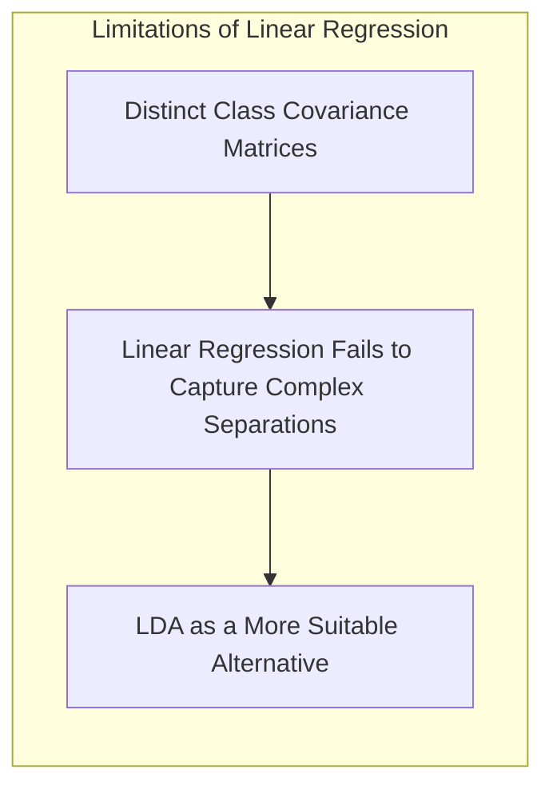

Este corolário demonstra que a regressão linear, apesar de sua aparente simplicidade, possui limitações e que outras abordagens como LDA e QDA [^4.3] podem ser mais adequadas em cenários mais complexos.

A regressão logística, conforme discutido em [^4.4], oferece estimativas de probabilidade mais estáveis em comparação com a regressão de indicadores, que pode produzir valores fora do intervalo [0, 1]. A regressão de indicadores, por outro lado, pode ser suficiente para obter limites de decisão lineares, conforme em [^4.2].

### Métodos de Seleção de Variáveis e Regularização em Classificação

A seleção de variáveis e a regularização são técnicas cruciais para lidar com o problema de *overfitting*, especialmente em modelos de classificação que utilizam muitos atributos [^4.5]. A regularização envolve a adição de um termo de penalidade à função de custo, que controla a complexidade do modelo. As penalidades L1 e L2 são comumente utilizadas, com a L1 promovendo a esparsidade dos coeficientes (seleção de variáveis) e a L2 a redução dos seus valores (controle da magnitude dos parâmetros) [^4.4.4]. Em modelos logísticos, penalidades como L1 e L2 são aplicadas à função de verossimilhança, resultando em um ajuste mais estável e melhor capacidade de generalização [^4.5.1]. As penalidades L1 e L2 podem ser combinadas em uma abordagem chamada *Elastic Net* para aproveitar os benefícios de ambas [^4.5].

> 💡 **Exemplo Numérico:** Considere um modelo de regressão logística com 10 variáveis preditoras. Com a regularização L1 (LASSO), algumas dessas variáveis terão seus coeficientes forçados a zero. Digamos que o modelo, sem regularização, tenha os seguintes coeficientes: $\beta = [0.8, -0.2, 1.5, -0.7, 0.3, 0.1, 0.9, -0.5, 0.2, 1.1]$.  Após a regularização L1 com um parâmetro $\lambda = 0.5$, os coeficientes podem ser: $\beta_{L1} = [0.6, 0, 1.0, 0, 0, 0, 0.4, 0, 0, 0.8]$.  Observe que as variáveis com menor importância (coeficientes menores) foram removidas do modelo, enquanto os coeficientes das variáveis mais importantes foram reduzidos. Já com a regularização L2, os coeficientes podem ser: $\beta_{L2} = [0.7, -0.1, 1.2, -0.5, 0.2, 0.05, 0.7, -0.3, 0.1, 0.9]$. Veja que nenhuma variável é totalmente zerada, mas a magnitude de todos os parâmetros é reduzida.
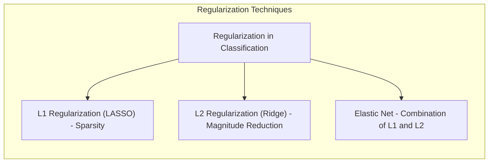
**Lemma 3:** *A penalização L1 (LASSO) em classificação logística leva a coeficientes esparsos, o que significa que muitas variáveis preditoras são excluídas do modelo, simplificando a interpretação e evitando overfitting.* [^4.4.4]
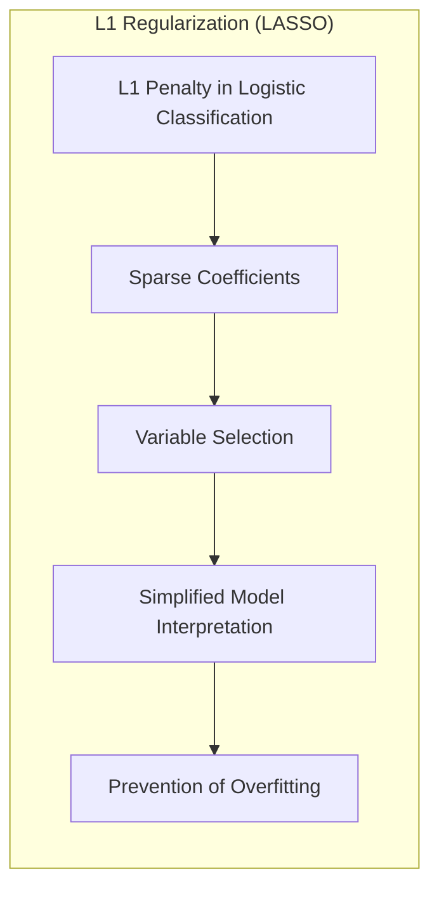

**Prova do Lemma 3:**  A penalização L1 adiciona um termo proporcional à soma dos valores absolutos dos coeficientes à função de custo, resultando na minimização tanto do erro de ajuste quanto da soma dos valores absolutos dos parâmetros:

$$J(\beta) = - \sum_{i=1}^{N}  \left[ y_i \log(\hat{p}_i) + (1-y_i) \log(1 - \hat{p}_i) \right] + \lambda \sum_{j=1}^{p} |\beta_j|,$$

onde $\lambda$ é o parâmetro de regularização, $\beta_j$ são os coeficientes, e $\hat{p}_i$ é a probabilidade predita. A natureza da penalização L1 força muitos coeficientes a serem exatamente zero, resultando em esparsidade e seleção de variáveis. A derivada da penalização L1 não é contínua em zero, o que promove o exato zeramento de alguns coeficientes, diferente da penalização L2 [^4.4.3] que apenas os reduz, mas não os elimina.  $\blacksquare$

**Corolário 3:** *A esparsidade induzida pela penalização L1 melhora a interpretabilidade dos modelos classificatórios, permitindo identificar as variáveis mais relevantes para a predição.* [^4.4.5]
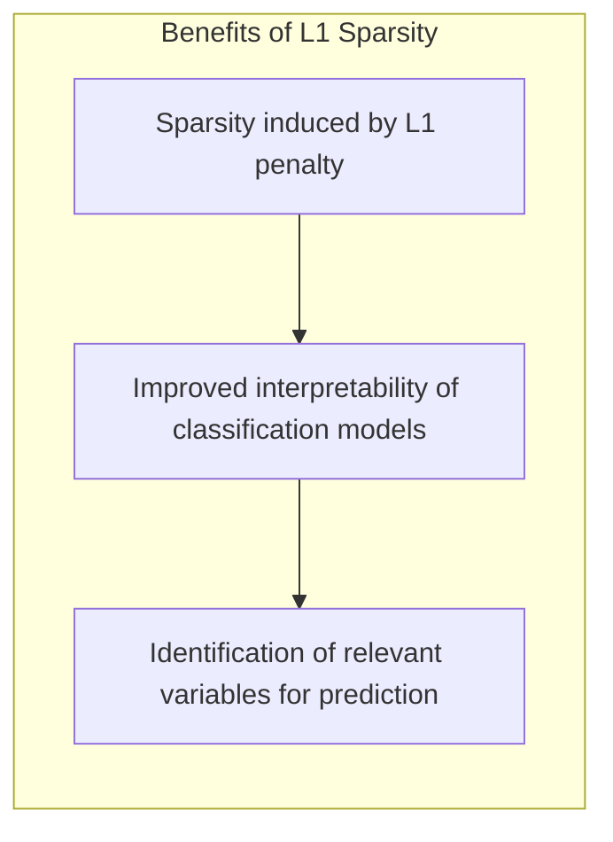

> ⚠️ **Ponto Crucial**:  A combinação das penalidades L1 e L2, conhecida como *Elastic Net*, oferece um equilíbrio entre esparsidade e estabilidade, sendo útil em cenários onde muitas variáveis preditoras são relevantes. [^4.5]
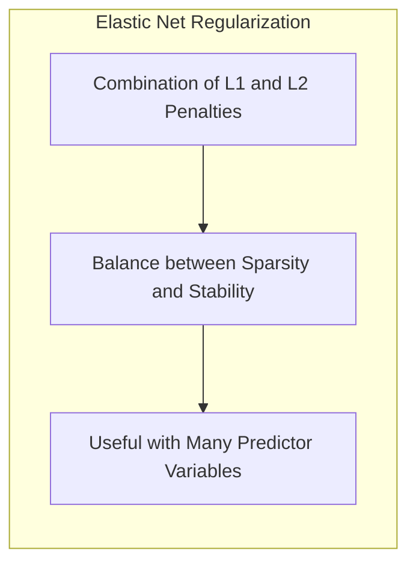

### Separating Hyperplanes e Perceptrons

O conceito de hiperplanos separadores busca construir superfícies lineares que separam as classes em um espaço multidimensional [^4.5.2]. A ideia de maximizar a margem de separação entre as classes leva ao conceito de hiperplanos ótimos, que são aqueles que maximizam a distância entre o hiperplano e as observações mais próximas (pontos de suporte). A formulação do problema de otimização para encontrar o hiperplano ótimo envolve a utilização do *dual de Wolfe* [^4.5.2]. As soluções surgem a partir de combinações lineares dos pontos de suporte, o que destaca a importância de identificar os pontos mais relevantes para a separação. O Perceptron de Rosenblatt é um algoritmo que busca encontrar um hiperplano separador por meio de atualizações iterativas dos pesos [^4.5.1]. Sob condições de separabilidade linear, o algoritmo Perceptron converge para uma solução que separa corretamente as classes. Este método é a base do funcionamento de algumas Redes Neurais.

> 💡 **Exemplo Numérico:** Considere um problema de classificação binária com duas features ($x_1$ e $x_2$). O Perceptron busca um hiperplano (neste caso, uma reta) que separa as classes. Inicialmente, os pesos podem ser inicializados aleatoriamente, por exemplo, $w = [0.1, -0.3]$ e um bias $b = 0.2$. O hiperplano seria definido por $0.1x_1 - 0.3x_2 + 0.2 = 0$.
> Suponha uma amostra $x = [1, 2]$ da classe 1. A previsão é calculada por:
> $\hat{y} = \text{sign}(0.1 * 1 - 0.3 * 2 + 0.2) = \text{sign}(-0.3) = -1$.
> O perceptron erraria, então atualizaria seus pesos:
> $w_{new} = w_{old} + \alpha \cdot y \cdot x$,
> onde $\alpha$ é a taxa de aprendizado (ex: 0.1) e $y$ é a classe correta (1).
> $w_{new} = [0.1, -0.3] + 0.1 * 1 * [1, 2] = [0.2, -0.1]$. O processo se repete até que a classificação seja correta para todos os dados.
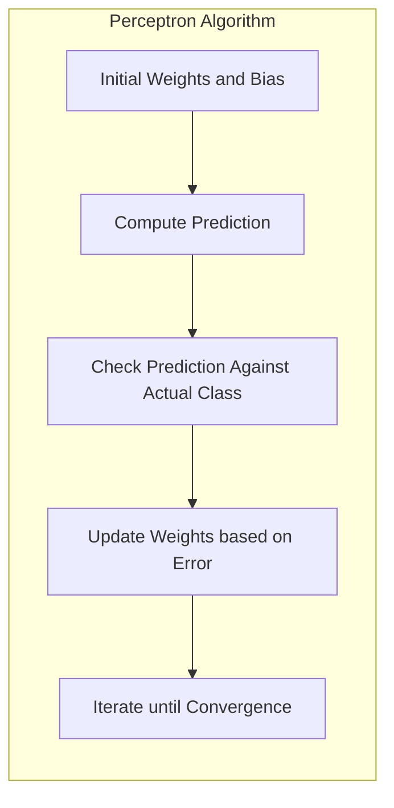

### Pergunta Teórica Avançada (Exemplo): Quais as diferenças fundamentais entre a formulação de LDA e a Regra de Decisão Bayesiana considerando distribuições Gaussianas com covariâncias iguais?

**Resposta:**
A **LDA (Linear Discriminant Analysis)** e a **regra de decisão Bayesiana** são ambas abordagens para classificação que utilizam distribuições gaussianas, mas com focos e formalismos distintos. A LDA é um método de aprendizado supervisionado que busca projetar dados em um subespaço que maximize a separabilidade das classes. A regra de decisão Bayesiana é um método ótimo de classificação que atribui uma observação à classe com a maior probabilidade posterior, dada sua distribuição.

Sob a hipótese de que as classes seguem distribuições gaussianas com a mesma matriz de covariância, o LDA se torna equivalente à regra de decisão Bayesiana [^4.3]. A LDA assume que as classes são normalmente distribuídas, $p(x|G=k) \sim N(\mu_k, \Sigma)$, e, então, busca a função discriminante linear que maximiza a separabilidade das classes:

$$\delta_k(x) = x^T \Sigma^{-1} \mu_k - \frac{1}{2}\mu_k^T \Sigma^{-1} \mu_k + \log \pi_k$$,

onde $\mu_k$ é o vetor médio da classe $k$, $\Sigma$ é a matriz de covariância comum, e $\pi_k$ é a probabilidade *a priori* da classe $k$. A regra de decisão Bayesiana atribui um ponto $x$ à classe $k$ se:

$$p(G=k|x) = \frac{p(x|G=k)\pi_k}{\sum_{l=1}^K p(x|G=l)\pi_l}$$

é máxima. Quando $p(x|G=k)$ são gaussianas com a mesma matriz de covariância, a regra de decisão Bayesiana se reduz à função discriminante do LDA.  [^4.3.3]
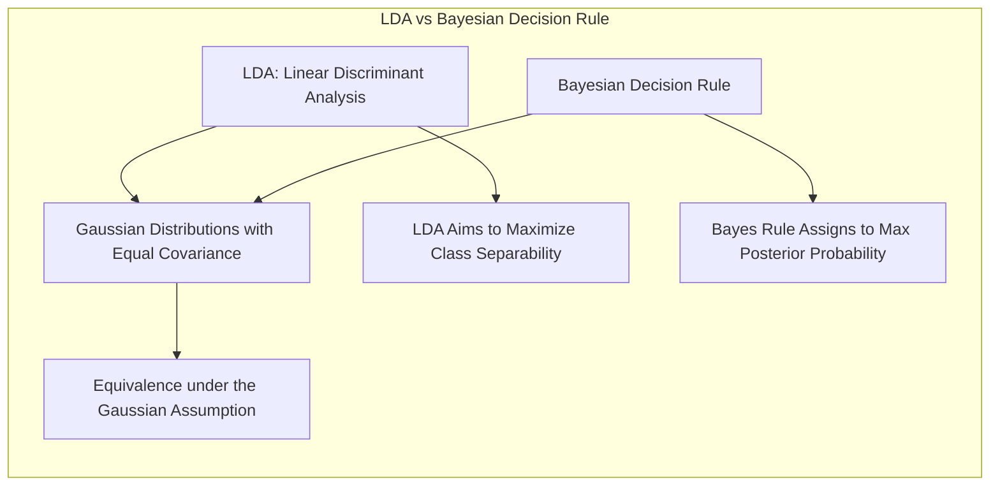

**Lemma 4:** *Sob a suposição de normalidade e igualdade de covariâncias, a função discriminante do LDA é equivalente à função de decisão ótima do classificador Bayesiano.* [^4.3], [^4.3.3]
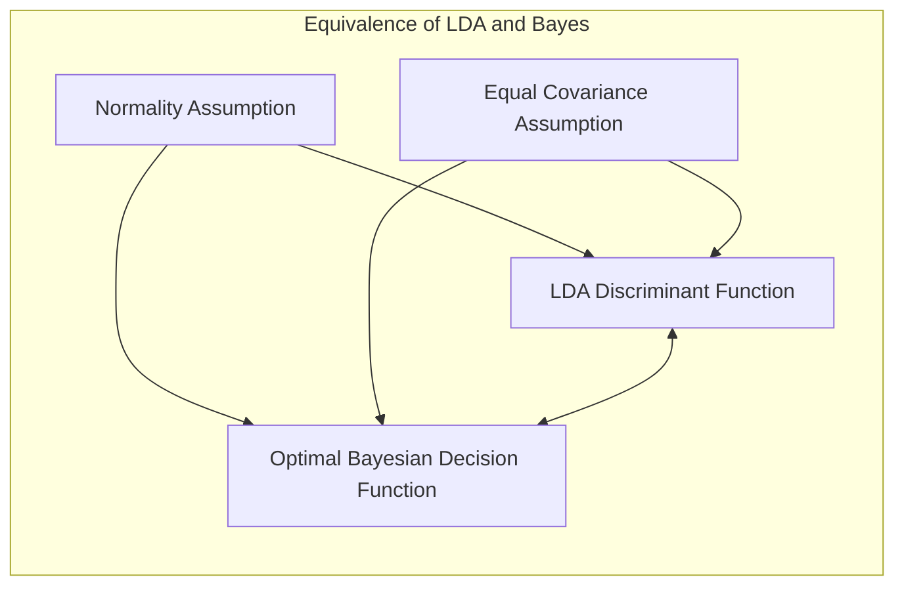
**Corolário 4:** *Ao relaxar a hipótese de covariâncias iguais, as fronteiras de decisão tornam-se quadráticas (QDA), o que leva a um classificador mais flexível, porém com maior complexidade.* [^4.3]
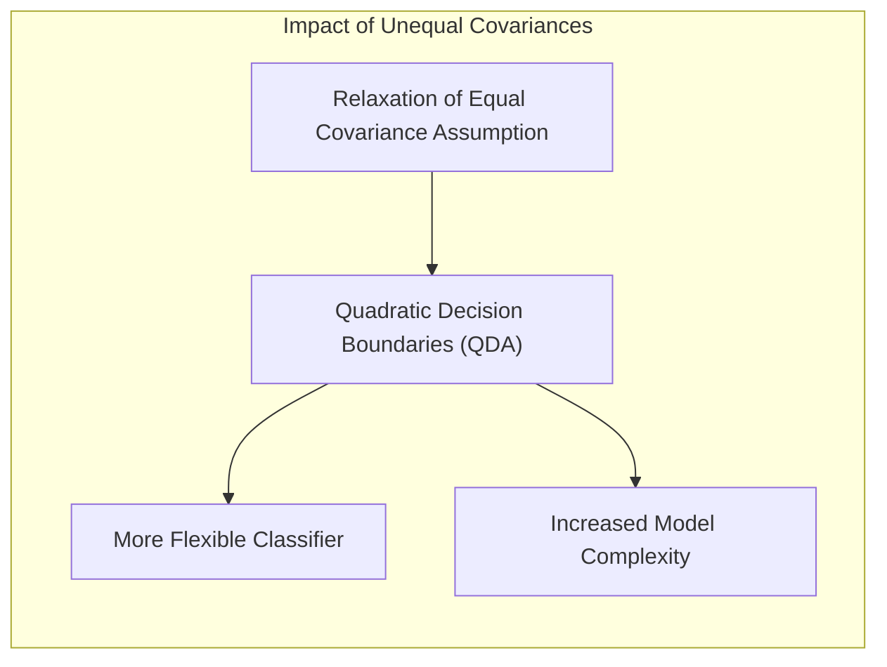

> ⚠️ **Ponto Crucial**: A escolha da hipótese de covariâncias iguais ou não afeta diretamente a forma da fronteira de decisão (linear vs. quadrática), e consequentemente, a capacidade de generalização do modelo.  [^4.3.1]

### Conclusão

Este capítulo abordou métodos estatísticos e de aprendizado de máquina para avaliação e seleção de modelos, com foco na interação entre viés, variância e complexidade do modelo. Foram discutidos métodos lineares para classificação, como a LDA e a regressão logística, além de técnicas de regularização e seleção de variáveis. A relação entre o LDA e a regra de decisão Bayesiana, as limitações da regressão de indicadores e o conceito de hiperplanos separadores também foram exploradas. Este conteúdo aprofundado visa auxiliar na compreensão e aplicação de métodos de classificação em cenários complexos e realistas.
<!-- END DOCUMENT -->

### Footnotes

[^7.1]: "The generalization performance of a learning method relates to its prediction capability on independent test data. Assessment of this performance is extremely important in practice, since it guides the choice of learning method or model, and gives us a measure of the quality of the ultimately chosen model." *(Trecho de <Model Assessment and Selection>)*
[^7.2]: "Figure 7.1 illustrates the important issue in assessing the ability of a learning method to generalize. Consider first the case of a quantitative or interval scale response. We have a target variable Y, a vector of inputs X, and a prediction model f(X) that has been estimated from a training set T. The loss function for measuring errors between Y and f(X) is denoted by L(Y, f(X)). Typical choices are" *(Trecho de <Model Assessment and Selection>)*
[^4.3]: "Linear discriminant analysis (LDA) is a method that aims to find a linear combination of features that characterizes or separates two or more classes of objects or events." *(Trecho de <Elements of Statistical Learning>)*
[^4.3.1]: "Linear discriminant analysis makes assumptions about the data that are not necessarily realistic. For example, it assumes that the data is normally distributed and that each class has the same covariance matrix." *(Trecho de <Elements of Statistical Learning>)*
[^4.3.2]: "The decision boundary in LDA is linear, which means that it is a straight line or plane in the feature space." *(Trecho de <Elements of Statistical Learning>)*
[^4.3.3]: "The discriminant function of LDA is a linear combination of the features, and it is obtained by finding the directions that maximize the separation between classes." *(Trecho de <Elements of Statistical Learning>)*
[^4.4]: "Logistic regression is a statistical model that analyzes data by using a logistic function to model the probability of a binary outcome." *(Trecho de <Elements of Statistical Learning>)*
[^4.4.1]: "The logit transformation is a way of transforming a probability to an unbounded scale. The logit is defined as the log of the odds of an event occurring." *(Trecho de <Elements of Statistical Learning>)*
[^4.4.2]: "The parameters in logistic regression are estimated by maximizing the likelihood of the observed data." *(Trecho de <Elements of Statistical Learning>)*
[^4.4.3]: "Logistic regression models the probabilities of the classes directly, whereas LDA assumes that the classes follow a Gaussian distribution." *(Trecho de <Elements of Statistical Learning>)*
[^4.4.4]: "Logistic regression is more flexible than LDA, and can be used in situations where the normality assumptions of LDA are not met." *(Trecho de <Elements of Statistical Learning>)*
[^4.4.5]: "In class imbalanced situations, the choice of loss function and regularization method may impact the performance of logistic regression significantly." *(Trecho de <Elements of Statistical Learning>)*
[^4.2]: "Linear regression of an indicator matrix, as described in Section 4.2, is a useful way to construct linear classifiers. The coefficients are obtained by minimizing the squared errors, and the class label is chosen as the one with the largest predicted value." *(Trecho de <Elements of Statistical Learning>)*
[^4.5]: "Regularization methods can be applied to improve the classification performance in logistic regression, particularly in situations with many input features or high multicollinearity. These methods include L1 and L2 regularization, as well as elastic net." *(Trecho de <Elements of Statistical Learning>)*
[^4.5.1]: "Regularization in logistic regression is achieved by adding a penalty term to the log-likelihood function, which shrinks the coefficients towards zero. This helps prevent overfitting and improves model generalization." *(Trecho de <Elements of Statistical Learning>)*
[^4.5.2]: "The idea of separating hyperplanes involves maximizing the margin between classes, which corresponds to finding the optimal linear decision boundary. The dual of Wolfe can be used to solve the optimization problem." *(Trecho de <Elements of Statistical Learning>)*
