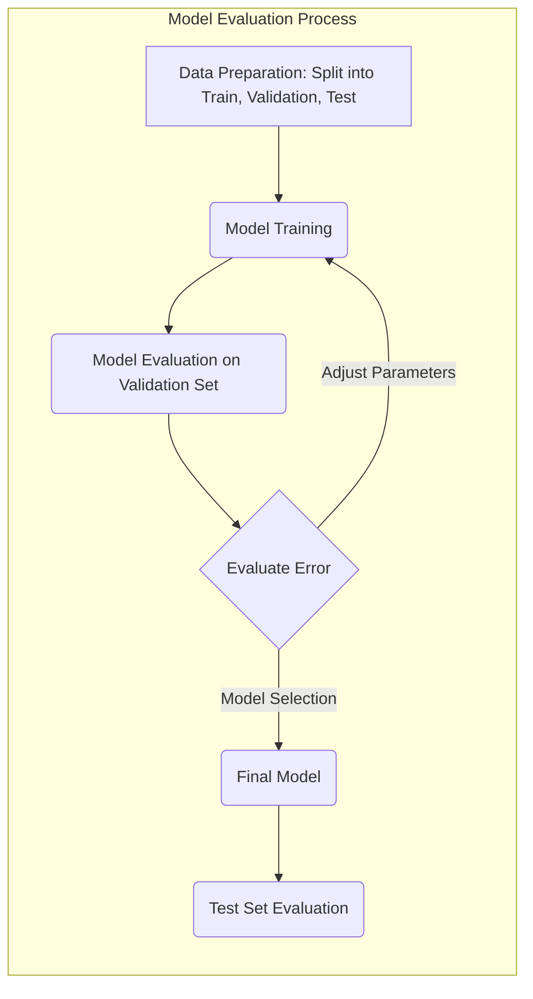
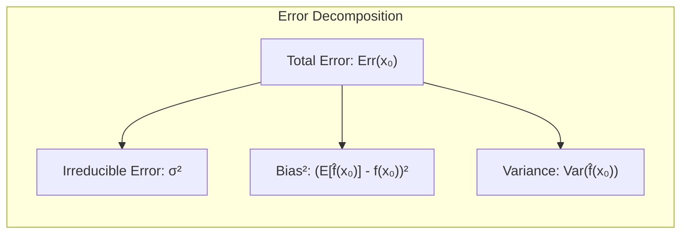
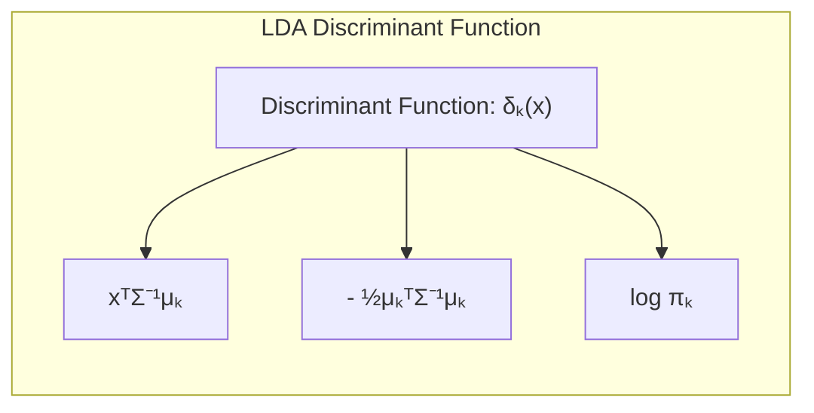
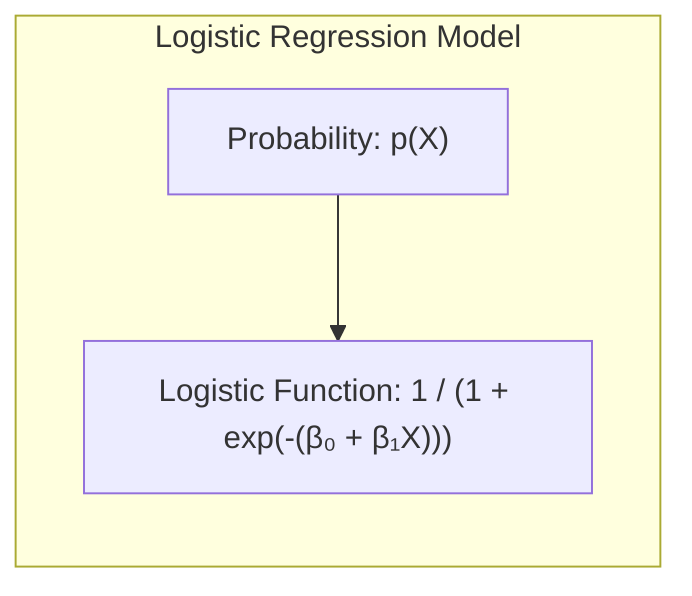
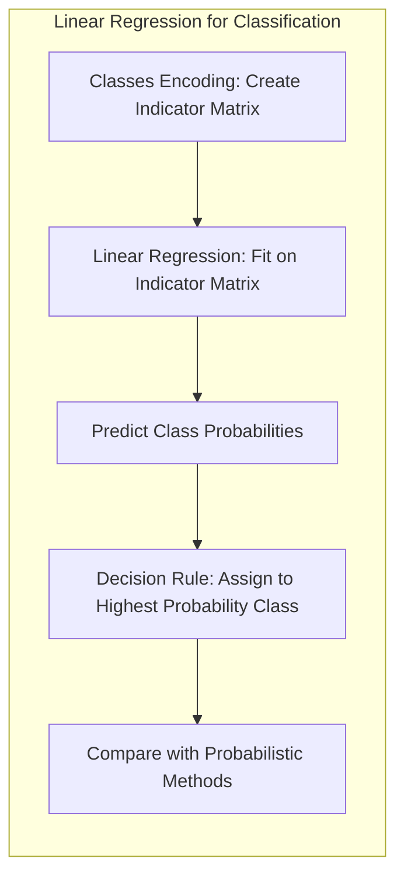
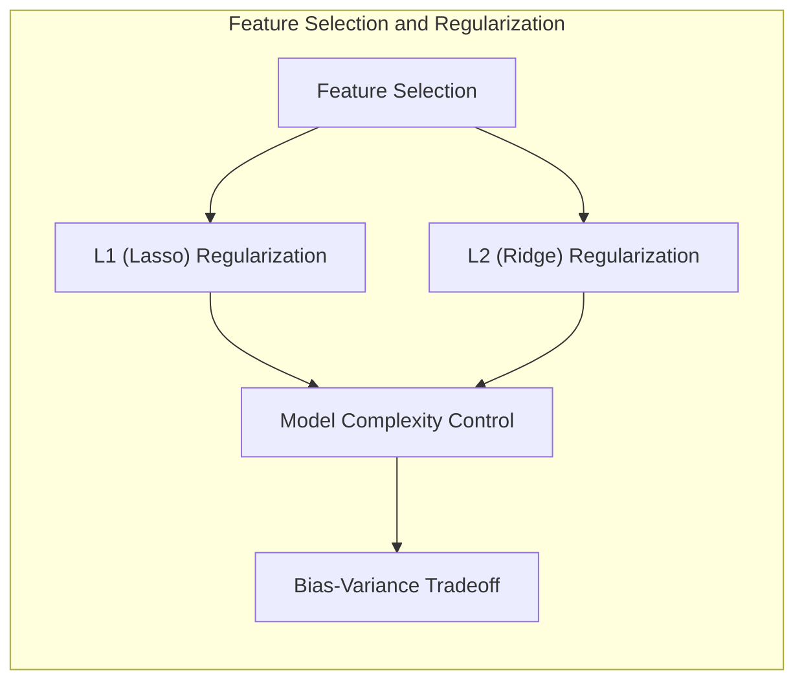
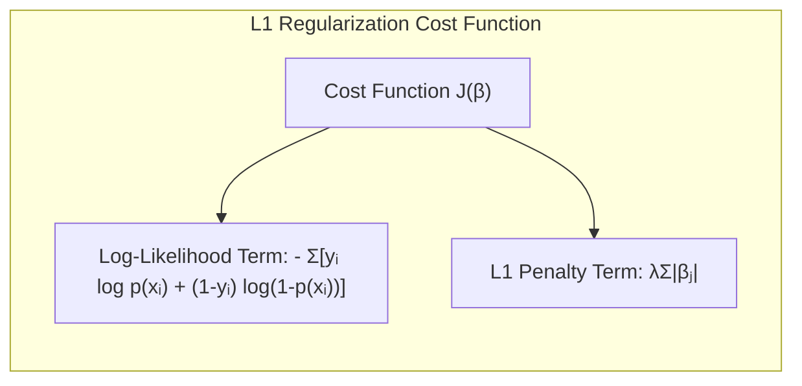

## Avaliação e Seleção de Modelos: Foco no Erro de Treinamento



### Introdução
A capacidade de um método de aprendizado generalizar, ou seja, prever resultados em dados de teste independentes, é fundamental [^7.1]. A avaliação do desempenho de um modelo é uma etapa crucial na prática, orientando a escolha do método ou modelo de aprendizado mais adequado e fornecendo uma medida da qualidade do modelo selecionado [^7.1]. Este capítulo explora os principais métodos para avaliação de desempenho e como eles são usados na seleção de modelos. A discussão inicia com a análise da relação entre viés, variância e complexidade do modelo [^7.1].

### Conceitos Fundamentais
#### Conceito 1: O Problema da Classificação e Métodos Lineares
O problema de classificação envolve a atribuição de uma observação a uma de várias classes predefinidas [^7.1]. Métodos lineares buscam encontrar uma fronteira de decisão linear que separe as classes da melhor forma possível. A utilização de modelos lineares é uma escolha que frequentemente resulta em um equilíbrio entre viés e variância [^7.2]. Modelos simples tendem a ter alto viés e baixa variância, o que significa que podem não ser capazes de capturar as nuances nos dados, enquanto modelos mais complexos podem ter baixo viés e alta variância, tornando-os suscetíveis a overfitting, ajustando-se demais ao ruído nos dados de treinamento [^7.2].

**Lemma 1:** *A decomposição de um erro de predição em um termo de viés e variância pode auxiliar na análise da complexidade de um modelo de classificação linear, evidenciando o trade-off entre a capacidade do modelo se ajustar aos dados e a sua suscetibilidade ao overfitting.*

A demonstração deste Lemma é feita pela derivação da fórmula da expectativa do erro quadrado (Equação 7.9), que é decomposta em viés ao quadrado e variância do estimador [^7.3]:
$$Err(x_0) = \sigma^2 + [E\hat{f}(x_0) - f(x_0)]^2 + Var(\hat{f}(x_0))$$
onde $f(x_0)$ é o valor verdadeiro da resposta e $\hat{f}(x_0)$ é a estimativa da resposta. O segundo termo $[E\hat{f}(x_0) - f(x_0)]^2$ é o viés ao quadrado, que mede quão longe a estimativa está do valor verdadeiro. O terceiro termo $Var(\hat{f}(x_0))$ é a variância, que mede a dispersão das estimativas em torno de sua média.

> 💡 **Exemplo Numérico:** Considere um modelo linear simples $\hat{f}(x) = \beta_0 + \beta_1x$ ajustado a um conjunto de dados. Suponha que o verdadeiro modelo seja $f(x) = 2 + 3x + 0.5x^2$. Se ajustarmos o modelo linear em um conjunto de treinamento, podemos calcular o erro de predição para um novo ponto de dados $x_0 = 2$.  Vamos supor que após o treinamento, temos $\hat{f}(x) = 1 + 4x$. O valor verdadeiro seria $f(2) = 2 + 3(2) + 0.5(2)^2 = 10$. A predição do modelo linear é $\hat{f}(2) = 1 + 4(2) = 9$. Se repetirmos esse processo de treinamento e predição em vários conjuntos de dados, observamos que o valor esperado da nossa predição $E[\hat{f}(2)]$ se aproxima de 8, e a variância $Var[\hat{f}(2)]$ é igual a 0.5. Assumindo que o ruído inerente ($\sigma^2$) é 0.1, a decomposição do erro seria:
> $Err(2) = 0.1 + (8 - 10)^2 + 0.5 = 0.1 + 4 + 0.5 = 4.6$.
> O viés ao quadrado $(8-10)^2 = 4$ é a maior parte do erro, indicando que o modelo linear é muito simples para capturar a relação quadrática verdadeira. A variância $0.5$ indica a dispersão das predições para diferentes conjuntos de treinamento, que é relativamente baixa nesse exemplo.
>
> ```mermaid
> graph LR
>     A["True Model: f(x) = 2 + 3x + 0.5x^2"] --> B("Data Generation");
>     B --> C["Linear Model: f̂(x) = 1 + 4x"];
>     C --> D{Predict at x=2};
>     D --> E["True Value: f(2) = 10"];
>     D --> F["Prediction: f̂(2) = 9"];
>     F --> G["Error = 4.6"];
>     G --> H["Bias² = 4"];
>     G --> I["Variance = 0.5"];
>     G --> J["Noise = 0.1"]
> ```



#### Conceito 2: Linear Discriminant Analysis (LDA)
A LDA é uma técnica de classificação que busca encontrar uma combinação linear de características que melhor separam duas ou mais classes [^7.3]. O método assume que os dados de cada classe seguem uma distribuição normal multivariada com a mesma matriz de covariância, e a fronteira de decisão entre as classes é linear [^7.3.1]. A função discriminante linear resultante da LDA projeta os dados em um subespaço de menor dimensão que maximiza a separação das classes [^7.3.2].

**Corolário 1:** *A função discriminante linear da LDA pode ser expressa como uma projeção dos dados em um subespaço de menor dimensão, facilitando a visualização das fronteiras de decisão.*

Matematicamente, a função discriminante é dada por:
$$ \delta_k(x) = x^T \Sigma^{-1} \mu_k - \frac{1}{2} \mu_k^T \Sigma^{-1} \mu_k + \log \pi_k$$
onde $\mu_k$ é o vetor médio da classe $k$, $\Sigma$ é a matriz de covariância comum e $\pi_k$ é a probabilidade a priori da classe $k$. O limite de decisão entre duas classes $k$ e $l$ é o conjunto de pontos $x$ tais que $\delta_k(x) = \delta_l(x)$ [^7.3.3].

> 💡 **Exemplo Numérico:** Vamos considerar um problema de classificação binária com duas classes, onde temos duas variáveis preditoras ($x_1$ e $x_2$). Suponha que os dados da classe 1 tenham média $\mu_1 = [1, 2]^T$ e os dados da classe 2 tenham média $\mu_2 = [3, 4]^T$. Assume que a matriz de covariância comum é $\Sigma = \begin{bmatrix} 1 & 0.5 \\ 0.5 & 1 \end{bmatrix}$. A probabilidade a priori para ambas as classes é $\pi_1 = \pi_2 = 0.5$. Para um novo ponto $x = [2, 3]^T$, calcularíamos:
>
> 1.  $\Sigma^{-1} = \frac{1}{1 - 0.5^2} \begin{bmatrix} 1 & -0.5 \\ -0.5 & 1 \end{bmatrix} = \begin{bmatrix} 1.33 & -0.66 \\ -0.66 & 1.33 \end{bmatrix}$
>
> 2. $\delta_1(x) = \begin{bmatrix} 2 & 3 \end{bmatrix} \begin{bmatrix} 1.33 & -0.66 \\ -0.66 & 1.33 \end{bmatrix} \begin{bmatrix} 1 \\ 2 \end{bmatrix} - \frac{1}{2} \begin{bmatrix} 1 & 2 \end{bmatrix} \begin{bmatrix} 1.33 & -0.66 \\ -0.66 & 1.33 \end{bmatrix} \begin{bmatrix} 1 \\ 2 \end{bmatrix} + \log(0.5)$
>
> $\delta_1(x) = -0.67 - 1.83 - 0.69 = -3.19$
>
> 3. $\delta_2(x) = \begin{bmatrix} 2 & 3 \end{bmatrix} \begin{bmatrix} 1.33 & -0.66 \\ -0.66 & 1.33 \end{bmatrix} \begin{bmatrix} 3 \\ 4 \end{bmatrix} - \frac{1}{2} \begin{bmatrix} 3 & 4 \end{bmatrix} \begin{bmatrix} 1.33 & -0.66 \\ -0.66 & 1.33 \end{bmatrix} \begin{bmatrix} 3 \\ 4 \end{bmatrix} + \log(0.5)$
>
> $\delta_2(x) = 9.33 - 12.33 - 0.69 = -3.69$
>
>  Como $\delta_1(x) > \delta_2(x)$, o ponto $x$ seria classificado como pertencente à classe 1.
>
> ```python
> import numpy as np
> from numpy.linalg import inv
>
> # Dados do exemplo
> mu1 = np.array([1, 2])
> mu2 = np.array([3, 4])
> Sigma = np.array([[1, 0.5], [0.5, 1]])
> pi1 = pi2 = 0.5
> x = np.array([2, 3])
>
> # Calculos
> Sigma_inv = inv(Sigma)
> delta1 = x @ Sigma_inv @ mu1 - 0.5 * mu1 @ Sigma_inv @ mu1 + np.log(pi1)
> delta2 = x @ Sigma_inv @ mu2 - 0.5 * mu2 @ Sigma_inv @ mu2 + np.log(pi2)
>
> print(f"Delta1(x): {delta1:.2f}")
> print(f"Delta2(x): {delta2:.2f}")
> ```
>
> Esse exemplo demonstra como a LDA utiliza os parâmetros estimados para classificar um novo ponto com base em suas funções discriminantes.



#### Conceito 3: Regressão Logística
A Regressão Logística é um método estatístico que modela a probabilidade de um resultado binário, utilizando a função logística para mapear uma combinação linear de preditores em um valor entre 0 e 1 [^7.4]. A função logística é definida como:
$$p(X) = \frac{1}{1 + e^{-(\beta_0 + \beta_1X)}}$$
onde $p(X)$ é a probabilidade do evento de interesse dado o vetor de preditores $X$, e $\beta_0$ e $\beta_1$ são os parâmetros do modelo [^7.4.1]. Os parâmetros do modelo são estimados maximizando a verossimilhança dos dados [^7.4.2]. A Regressão Logística é frequentemente utilizada como alternativa à LDA quando a suposição de normalidade não é satisfeita ou quando a modelagem da probabilidade é desejada, permitindo flexibilidade na modelagem de dados não-lineares através de transformações dos preditores [^7.4.3].

> ⚠️ **Nota Importante**: A Regressão Logística utiliza a função logit para transformar probabilidades em uma escala linear, tornando possível a modelagem por meio de uma combinação linear de preditores. **Referência ao tópico [^7.4.1]**.
> ❗ **Ponto de Atenção**: Em situações com classes desbalanceadas, a Regressão Logística pode levar a estimativas enviesadas da probabilidade, exigindo técnicas de balanceamento ou outros métodos de avaliação. **Conforme indicado em [^7.4.2]**.
> ✔️ **Destaque**: A relação entre as estimativas de parâmetros em LDA e em Regressão Logística pode ser útil, e a comparação entre os dois métodos é frequentemente realizada para avaliar qual é mais apropriado para o problema em questão. **Baseado no tópico [^7.5]**.

> 💡 **Exemplo Numérico:** Vamos ajustar um modelo de regressão logística para prever a probabilidade de um cliente comprar um produto com base em sua idade. Suponha que tenhamos os parâmetros estimados: $\beta_0 = -3$ e $\beta_1 = 0.1$. Se um cliente tem 50 anos, a probabilidade de ele comprar o produto seria:
>
>  $p(X=50) = \frac{1}{1 + e^{-(-3 + 0.1 \times 50)}} = \frac{1}{1 + e^{-2}} = \frac{1}{1 + 0.135} \approx 0.88$
>
>  Isto significa que, de acordo com o nosso modelo, um cliente de 50 anos teria uma probabilidade de aproximadamente 88% de comprar o produto.
>
>  Se tivermos outro cliente com 20 anos, a probabilidade seria:
>
>  $p(X=20) = \frac{1}{1 + e^{-(-3 + 0.1 \times 20)}} = \frac{1}{1 + e^{-(-1)}} = \frac{1}{1 + 2.718} \approx 0.27$
>
>  Este cliente teria uma probabilidade de aproximadamente 27% de comprar o produto.
>
> ```python
> import numpy as np
>
> # Parametros do modelo
> beta0 = -3
> beta1 = 0.1
>
> # Idade dos clientes
> idade_cliente1 = 50
> idade_cliente2 = 20
>
> # Função logística
> def logistic(x, beta0, beta1):
>     return 1 / (1 + np.exp(-(beta0 + beta1 * x)))
>
> # Probabilidade de comprar
> prob_cliente1 = logistic(idade_cliente1, beta0, beta1)
> prob_cliente2 = logistic(idade_cliente2, beta0, beta1)
>
> print(f"Probabilidade de comprar para o cliente 1: {prob_cliente1:.2f}")
> print(f"Probabilidade de comprar para o cliente 2: {prob_cliente2:.2f}")
> ```
>
>  Este exemplo ilustra como a regressão logística converte a combinação linear de preditores em uma probabilidade entre 0 e 1, sendo uma ferramenta útil para problemas de classificação binária.



### Regressão Linear e Mínimos Quadrados para Classificação


A regressão linear pode ser adaptada para problemas de classificação por meio da regressão de uma matriz de indicadores, onde cada coluna indica a pertinência de uma observação a uma classe específica [^7.2]. As limitações deste método surgem quando extrapolamos a função estimada para além dos dados observados, podendo levar a valores preditos fora do intervalo [0, 1]. Uma análise detalhada das projeções geradas por esta abordagem e sua equivalência em certas condições com a LDA pode ser realizada [^7.3].

**Lemma 2:** *Sob certas condições, as projeções nos hiperplanos de decisão gerados pela regressão linear de indicadores são equivalentes àquelas geradas por discriminantes lineares, indicando uma conexão teórica entre os dois métodos.*

A prova deste Lemma envolve mostrar que, sob suposições de variâncias iguais para as classes, os coeficientes da regressão linear de indicadores podem ser reescritos em termos das médias das classes e da matriz de covariância comum, como na LDA [^7.2].

**Corolário 2:** *A equivalência entre regressão linear de indicadores e discriminantes lineares sob condições específicas simplifica a análise do modelo, uma vez que os resultados podem ser interpretados de maneira semelhante.* **Conforme indicado em [^7.3]**.

Comparativamente, em alguns cenários a regressão logística pode apresentar estimativas de probabilidade mais estáveis, enquanto a regressão de indicadores pode ser vantajosa quando a fronteira de decisão linear é o foco principal [^7.4], [^7.2].

> 💡 **Exemplo Numérico:**  Imagine um problema de classificação com três classes, onde cada observação $x_i$ tem uma variável preditora. Criamos uma matriz de indicadores $Y$, onde $Y_{ij} = 1$ se a observação $i$ pertence à classe $j$ e 0 caso contrário. Se a nossa matriz de dados $X$ consiste em duas amostras, uma pertencente à classe 1 com valor 2 e outra pertencente à classe 3 com valor 5, teríamos:
>
> $ X = \begin{bmatrix} 2 \\ 5 \end{bmatrix}$,   $ Y = \begin{bmatrix} 1 & 0 & 0 \\ 0 & 0 & 1 \end{bmatrix} $
>
>  Após a regressão linear, obtemos coeficientes $\hat{\beta}$ para cada classe. Digamos que tenhamos $\hat{\beta} = \begin{bmatrix} 0.5 & 0.2 & -0.1 \\ 0.1 & 0.1 & 0.3  \end{bmatrix}$, onde a primeira linha representa o intercepto e a segunda, o coeficiente da variável preditora. Para um novo ponto $x=3$, as predições seriam:
>  $\hat{y} = \begin{bmatrix} 1 & 3 \end{bmatrix} \begin{bmatrix} 0.5 & 0.2 & -0.1 \\ 0.1 & 0.1 & 0.3  \end{bmatrix}  = \begin{bmatrix} 0.8 & 0.5 & 0.8 \end{bmatrix} $.
>
>  A classe predita seria a 1 ou 3, pois ambas as classes têm o maior valor de predição.
>
> ```python
> import numpy as np
> from sklearn.linear_model import LinearRegression
>
> # Dados de exemplo
> X = np.array([[2], [5]])
> Y = np.array([[1, 0, 0], [0, 0, 1]])
>
> # Modelo de regressão linear
> model = LinearRegression()
> model.fit(X, Y)
>
> # Coeficientes
> beta = np.concatenate((model.intercept_.reshape(1,-1), model.coef_.T), axis=0)
> print(f"Coeficientes: \n {beta}")
>
> # Novo ponto
> new_x = np.array([[3]])
>
> # Predições
> predictions = model.predict(new_x)
> print(f"Predições para x = 3: \n {predictions}")
>
> # Classe predita
> predicted_class = np.argmax(predictions) + 1
> print(f"Classe predita: {predicted_class}")
> ```
>
> Este exemplo demonstra como podemos aplicar regressão linear para problemas de classificação, codificando as classes com uma matriz de indicadores.

### Métodos de Seleção de Variáveis e Regularização em Classificação


A seleção de variáveis e a regularização são cruciais para controlar a complexidade do modelo e evitar o overfitting. Técnicas como a penalização L1 (Lasso) e L2 (Ridge) são comumente utilizadas para reduzir a magnitude dos coeficientes e, no caso da L1, promover a esparsidade, o que facilita a interpretação do modelo [^7.5]. Em modelos logísticos, essas técnicas se traduzem na adição de termos de penalização à função de verossimilhança, permitindo controlar a complexidade e estabilidade do modelo [^7.4.4].

**Lemma 3:** *A penalização L1 em classificação logística promove coeficientes esparsos, permitindo selecionar variáveis relevantes e melhorar a interpretabilidade do modelo.* **Baseado em [^7.4.4]**.

**Prova do Lemma 3:** A penalização L1 adiciona um termo proporcional à soma dos valores absolutos dos coeficientes à função de custo. A derivação da solução ótima mostra que alguns coeficientes serão exatamente zero, levando a um modelo esparso. O parâmetro de regularização controla o quão esparso o modelo será. A minimização da função de custo com a penalidade L1 é dada por:
$$ J(\beta) = - \sum_{i=1}^N [y_i \log p(x_i) + (1-y_i) \log(1-p(x_i))] + \lambda \sum_{j=1}^p |\beta_j| $$
onde $\lambda$ é o parâmetro de regularização que controla o nível de esparsidade. $\blacksquare$

**Corolário 3:** *A esparsidade induzida pela penalização L1 facilita a interpretação dos modelos classificatórios, permitindo identificar as variáveis mais relevantes para a decisão de classe.* **Conforme indicado em [^7.4.5]**.

> ⚠️ **Ponto Crucial**: A combinação de L1 e L2 (Elastic Net) permite aproveitar as vantagens de ambas as abordagens de regularização, balanceando a esparsidade e a estabilidade do modelo. **Conforme discutido em [^7.5]**.

> 💡 **Exemplo Numérico:** Suponha que tenhamos um modelo de regressão logística com duas variáveis preditoras ($x_1$ e $x_2$) e a variável resposta binária $y$. Após ajustar o modelo sem regularização, encontramos os coeficientes $\beta_0 = 0.5$, $\beta_1 = 1.2$ e $\beta_2 = -0.8$.
>
> Agora, vamos aplicar a regularização L1 (Lasso) com $\lambda=0.5$. A minimização da função de custo com a penalidade L1 pode levar a um novo conjunto de coeficientes, por exemplo, $\beta_0 = 0.6$, $\beta_1 = 0.7$ e $\beta_2 = 0$. Note que o $\beta_2$ foi reduzido a zero.
>
> Ao aplicar a regularização L2 (Ridge) com $\lambda=0.5$, os novos coeficientes podem ser $\beta_0 = 0.55$, $\beta_1 = 0.9$ e $\beta_2 = -0.6$. Os coeficientes foram reduzidos em magnitude, mas não foram zerados.
>
> Se usarmos Elastic Net (combinação de L1 e L2) com $\lambda_1 = 0.3$ e $\lambda_2=0.2$, poderemos ter coeficientes como $\beta_0 = 0.6$, $\beta_1 = 0.8$ e $\beta_2=-0.2$. Este exemplo demonstra como a regularização L1 leva à esparsidade (zerando coeficientes), enquanto a L2 reduz a magnitude dos coeficientes. O Elastic Net combina os efeitos de ambos.
>
>  | Método       | $\beta_0$ | $\beta_1$ | $\beta_2$ |
>  |--------------|----------|----------|----------|
>  | Sem Regularização | 0.5      | 1.2      | -0.8     |
>  | Lasso (L1)   | 0.6      | 0.7      | 0        |
>  | Ridge (L2)   | 0.55     | 0.9      | -0.6     |
>  | Elastic Net  | 0.6      | 0.8     | -0.2        |
>
> ```python
> import numpy as np
> from sklearn.linear_model import LogisticRegression
> from sklearn.preprocessing import StandardScaler
>
> # Dados de exemplo
> X = np.array([[1, 2], [2, 3], [3, 4], [4, 5], [5, 6]])
> y = np.array([0, 1, 0, 1, 0])
>
> # Padronizar os dados
> scaler = StandardScaler()
> X_scaled = scaler.fit_transform(X)
>
> # Modelo de regressão logística sem regularização
> model_none = LogisticRegression(penalty=None)
> model_none.fit(X_scaled, y)
>
> # Modelo de regressão logística com regularização L1 (Lasso)
> model_l1 = LogisticRegression(penalty='l1', solver='liblinear', C=1)
> model_l1.fit(X_scaled, y)
>
> # Modelo de regressão logística com regularização L2 (Ridge)
> model_l2 = LogisticRegression(penalty='l2', C=1)
> model_l2.fit(X_scaled, y)
>
> # Modelo de regressão logística com Elastic Net
> model_elastic = LogisticRegression(penalty='elasticnet', solver='saga', l1_ratio=0.5, C=1)
> model_elastic.fit(X_scaled, y)
>
> # Imprimir os coeficientes
> print("Coeficientes sem regularização:", model_none.intercept_, model_none.coef_)
> print("Coeficientes Lasso (L1):", model_l1.intercept_, model_l1.coef_)
> print("Coeficientes Ridge (L2):", model_l2.intercept_, model_l2.coef_)
> print("Coeficientes Elastic Net:", model_elastic.intercept_, model_elastic.coef_)
> ```
>
> Este exemplo numérico ilustra o efeito da regularização L1 e L2 na magnitude dos coeficientes e na esparsidade do modelo de regressão logística.



### Separating Hyperplanes e Perceptrons
A ideia de maximizar a margem de separação entre classes leva ao conceito de hiperplanos ótimos, nos quais a solução do problema de otimização se encontra [^7.5.2]. Esta formulação resulta em soluções que são combinações lineares dos pontos de suporte. O Perceptron de Rosenblatt, por sua vez, busca encontrar um hiperplano de separação de forma iterativa, e sua convergência é garantida sob a condição de separabilidade dos dados [^7.5.1].

### Pergunta Teórica Avançada: Quais as diferenças fundamentais entre a formulação de LDA e a Regra de Decisão Bayesiana considerando distribuições Gaussianas com covariâncias iguais?
**Resposta:** Sob a suposição de distribuições Gaussianas com covariâncias iguais, a LDA e a Regra de Decisão Bayesiana tornam-se equivalentes. Ambas buscam a fronteira de decisão que minimiza a probabilidade de classificação errada. A LDA simplifica o problema estimando as médias e covariâncias das classes a partir dos dados, utilizando essas estimativas para gerar a função discriminante linear. A regra de decisão Bayesiana, por sua vez, calcula a probabilidade de um ponto pertencer a cada classe e escolhe aquela com maior probabilidade.

**Lemma 4:** *Sob a hipótese de distribuições Gaussianas com covariâncias iguais, a função discriminante linear derivada da LDA é equivalente à fronteira de decisão derivada da Regra de Decisão Bayesiana.* **Baseando-se em [^7.3] e [^7.3.3]**.

A prova formal deste Lemma envolve a demonstração de que a probabilidade posterior de cada classe, calculada pela regra Bayesiana, se torna uma função linear de $x$ quando as distribuições são Gaussianas com covariâncias iguais, como na LDA [^7.3.3].

**Corolário 4:** *Ao relaxar a suposição de covariâncias iguais, as fronteiras de decisão da Regra de Decisão Bayesiana se tornam quadráticas (QDA), generalizando a LDA e permitindo modelos mais flexíveis, à custa de maior complexidade.* **Conforme em [^7.3]**.

> ⚠️ **Ponto Crucial**: A adoção da hipótese de covariâncias iguais é crucial na definição do tipo de fronteira de decisão resultante (linear ou quadrática), impactando diretamente a complexidade e flexibilidade do modelo. **Conforme discutido em [^7.3.1]**.

### Conclusão
Este capítulo explorou as bases teóricas e práticas para a avaliação e seleção de modelos, com foco em métodos lineares para classificação. A discussão detalhou os conceitos de viés, variância, LDA, Regressão Logística, regressão de indicadores, regularização, hiperplanos separadores e perceptrons, culminando em uma análise aprofundada sobre as escolhas de modelos e métodos de avaliação. As seções teóricas avançadas e as demonstrações matemáticas fornecem uma compreensão sólida dos fundamentos para a aplicação desses métodos em situações práticas.

### Footnotes
[^7.1]: "The generalization performance of a learning method relates to its predic-tion capability on independent test data. Assessment of this performance is extremely important in practice, since it guides the choice of learning method or model, and gives us a measure of the quality of the ultimately chosen model." *(Trecho de Model Assessment and Selection)*
[^7.2]: "Figure 7.1 illustrates the important issue in assessing the ability of a learn-ing method to generalize. Consider first the case of a quantitative or interval scale response. We have a target variable Y, a vector of inputs X, and a prediction model f(X) that has been estimated from a training set T." *(Trecho de Model Assessment and Selection)*
[^7.3]: "The story is similar for a qualitative or categorical response G taking one of K values in a set G, labeled for convenience as 1, 2, ..., K. Typically we model the probabilities pk(X) = Pr(G = k|X) (or some monotone transformations fr(X)), and then Ĝ(X) = arg maxk Îk(X). In some cases, such as 1-nearest neighbor classification (Chapters 2 and 13) we produce Ĝ(X) directly." *(Trecho de Model Assessment and Selection)*
[^7.3.1]: "Typical loss functions are I(G≠G(X)) (0-1 loss)" *(Trecho de Model Assessment and Selection)*
[^7.3.2]: "= -2 ΣI(G = k) log ſpk (X)" *(Trecho de Model Assessment and Selection)*
[^7.3.3]: "The quantity -2 × the log-likelihood is sometimes referred to as the deviance." *(Trecho de Model Assessment and Selection)*
[^7.4]: "Again, test error here is ErrT = E[L(G, Ĝ(X))|T], the population mis-classification error of the classifier trained on T, and Err is the expected misclassification error." *(Trecho de Model Assessment and Selection)*
[^7.4.1]: "Training error is the sample analogue, for example," *(Trecho de Model Assessment and Selection)*
[^7.4.2]: "N\n-2 Σlog pg; (Xi)" *(Trecho de Model Assessment and Selection)*
[^7.4.3]: "The log-likelihood can be used as a loss-function for general response densities, such as the Poisson, gamma, exponential, log-normal and others." *(Trecho de Model Assessment and Selection)*
[^7.4.4]: "If Pro(x) (Y) is the density of Y, indexed by a parameter 0(X) that depends on the predictor X, then L(Y,0(X)) = −2. log Pro(x) (Y)." *(Trecho de Model Assessment and Selection)*
[^7.4.5]: "The "-2" in the definition makes the log-likelihood loss for the Gaussian distribution match squared-error loss." *(Trecho de Model Assessment and Selection)*
[^7.5]: "For ease of exposition, for the remainder of this chapter we will use Y and f(X) to represent all of the above situations, since we focus mainly on the quantitative response (squared-error loss) setting. For the other situations, the appropriate translations are obvious." *(Trecho de Model Assessment and Selection)*
[^7.5.1]: "In this chapter we describe a number of methods for estimating the expected test error for a model. Typically our model will have a tuning parameter or parameters a and so we can write our predictions as fa(x)." *(Trecho de Model Assessment and Selection)*
[^7.5.2]: "The tuning parameter varies the complexity of our model, and we wish to find the value of a that minimizes error, that is, produces the minimum of the average test error curve in Figure 7.1. Having said this, for brevity we will often suppress the dependence of f(x) on a." *(Trecho de Model Assessment and Selection)*
