## Model Assessment and Selection: A Deep Dive into Expected Error (Err)

<imagem: Um mapa mental abrangente que conecta bias, variance, complexidade do modelo, diferentes tipos de erros (treinamento, teste, esperado) e métodos de estimação (AIC, BIC, cross-validation, bootstrap), mostrando como cada conceito influencia a escolha do modelo>

### Introdução

A avaliação e seleção de modelos são etapas cruciais no aprendizado de máquina, direcionando a escolha do método de aprendizado ou modelo mais adequado e fornecendo uma medida da qualidade do modelo selecionado [^7.1]. O foco deste capítulo é o **expected test error (Err)**, que quantifica a capacidade de um modelo generalizar para dados não vistos [^7.1]. Este conceito é central para evitar *overfitting*, onde o modelo se ajusta excessivamente aos dados de treinamento, performando mal em dados futuros [^7.2]. Exploraremos as técnicas e métodos para estimar o *Err* e como eles são aplicados na prática, começando pela discussão do *bias-variance tradeoff* e a complexidade do modelo [^7.1], [^7.2]. O capítulo visa fornecer uma compreensão profunda dos desafios na estimação do *Err* e dos métodos estatísticos avançados para lidar com tais desafios.

### Conceitos Fundamentais

**Conceito 1: O Problema de Classificação e o Tradeoff Bias-Variance**

O objetivo principal do aprendizado de máquina é desenvolver modelos que generalizem bem para dados não vistos, e não apenas memorizar os dados de treinamento [^7.1]. A qualidade dessa generalização é avaliada pelo **erro de generalização**, também conhecido como **test error** [^7.2]. Este erro, formalmente definido como $Err_T = E[L(Y, f(X))|T]$, onde $T$ é o conjunto de treinamento, $Y$ é a variável alvo, $X$ são as entradas e $f(X)$ é o modelo preditivo, representa o desempenho do modelo em dados que não foram usados no treinamento [^7.2]. O **expected test error (Err)**, definido como $Err = E[L(Y, f(X))] = E[Err_T]$, quantifica o erro médio que se espera que o modelo cometa em novos dados [^7.2].
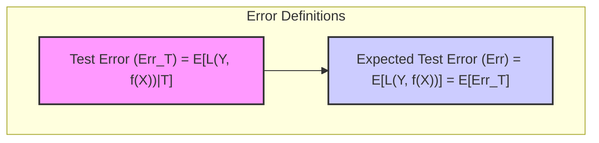

O problema de classificação, assim como o de regressão, envolve um delicado *tradeoff* entre *bias* e *variance* [^7.2]. Modelos complexos, com muitos parâmetros, tendem a ter baixo *bias* (eles podem se ajustar bem aos dados de treinamento), mas alta *variance* (suas predições podem variar muito dependendo do conjunto de treinamento específico) [^7.2]. Por outro lado, modelos simples tendem a ter alto *bias* (não se ajustam bem aos dados de treinamento), mas baixa *variance* [^7.2]. O objetivo é encontrar uma complexidade de modelo que minimize o *expected test error* [^7.2].

> 💡 **Exemplo Numérico:** Imagine que estamos tentando prever o preço de casas (Y) com base em sua área (X). Um modelo linear simples (f(X) = β₀ + β₁X) pode ter alto bias porque pode não capturar relações não lineares entre área e preço. Um modelo polinomial de alta ordem (f(X) = β₀ + β₁X + β₂X² + ... + βₙXⁿ), por outro lado, pode ter baixa bias nos dados de treinamento, mas alta variance, ajustando-se ao ruído nos dados e generalizando mal para novas casas. O ideal é um modelo com complexidade intermediária que equilibre bem bias e variance.

**Lemma 1: Decomposição do Expected Test Error**

O *expected test error* pode ser decomposto em três componentes: erro irredutível, bias e variância. Formalmente, para uma função de regressão $Y = f(X) + \epsilon$, onde $E(\epsilon)=0$ e $Var(\epsilon) = \sigma^2_\epsilon$, o *expected test error* no ponto $X=x_0$ pode ser escrito como:

$$Err(x_0) = E[(Y - f(x_0))^2 | X = x_0] = \sigma^2_\epsilon + Bias^2(f(x_0)) + Var(f(x_0))$$

Onde $Bias^2(f(x_0)) = [Ef(x_0) - f(x_0)]^2$ e $Var(f(x_0)) = E[f(x_0) - Ef(x_0)]^2$ [^7.3].
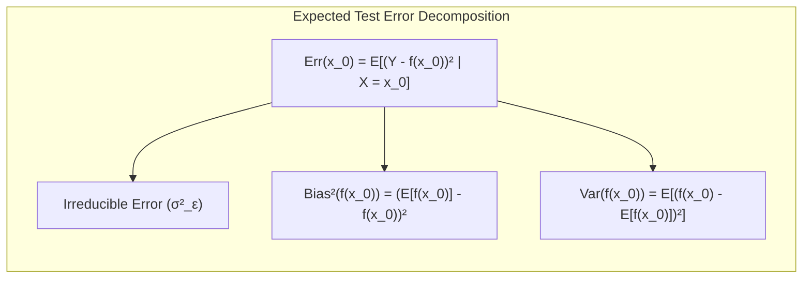

**Prova:**

Começamos pela definição do *expected test error*:
$$Err(x_0) = E[(Y - f(x_0))^2 | X = x_0]$$
Substituímos $Y$ por $f(x_0) + \epsilon$:
$$Err(x_0) = E[(f(x_0) + \epsilon - f(x_0))^2 | X = x_0]$$
Expandindo o quadrado:
$$Err(x_0) = E[(f(x_0) - Ef(x_0) + Ef(x_0) - f(x_0) + \epsilon)^2 | X = x_0]$$
$$Err(x_0) = E[((Ef(x_0) - f(x_0)) + (f(x_0) - Ef(x_0)) + \epsilon)^2 | X = x_0]$$
Expandindo o quadrado novamente:
$$Err(x_0) = E[(Ef(x_0) - f(x_0))^2 + (f(x_0) - Ef(x_0))^2 + \epsilon^2 + 2(Ef(x_0) - f(x_0))(f(x_0) - Ef(x_0)) + 2(Ef(x_0) - f(x_0))\epsilon + 2(f(x_0) - Ef(x_0))\epsilon  | X = x_0]$$
Aplicando a linearidade da esperança, e sabendo que $E[\epsilon]=0$:
$$Err(x_0) = [Ef(x_0) - f(x_0)]^2 + E[(f(x_0) - Ef(x_0))^2] + E[\epsilon^2] $$
O termo $E[\epsilon^2]$ é a variância do erro irredutível ($\sigma^2_{\epsilon}$), enquanto os outros dois termos são o quadrado do *bias* e a variância, respectivamente. Assim,
$$Err(x_0) = \sigma^2_\epsilon + Bias^2(f(x_0)) + Var(f(x_0))$$
$\blacksquare$

> 💡 **Exemplo Numérico:** Vamos supor que temos um modelo de regressão com a seguinte decomposição do *expected test error* para um ponto específico $x_0$:
>  - Erro Irredutível ($\sigma^2_\epsilon$): 0.5
>  - Bias² ($Bias^2(f(x_0))$): 0.2
>  - Variância ($Var(f(x_0))$): 0.3
>
>  Nesse caso, o *expected test error* $Err(x_0)$ seria $0.5 + 0.2 + 0.3 = 1$. Se tentarmos reduzir o bias aumentando a complexidade do modelo, podemos reduzir o Bias² para 0.1, mas a Variância pode aumentar para 0.5. O novo *Err(x_0)* seria $0.5 + 0.1 + 0.5 = 1.1$, indicando que, embora tenhamos reduzido o bias, o aumento na variância piorou o erro total. O objetivo é encontrar um equilíbrio que minimize o *Err(x_0)*.

**Conceito 2: Linear Discriminant Analysis (LDA)**

**Linear Discriminant Analysis (LDA)** é um método clássico de classificação que assume que as classes são normalmente distribuídas com covariâncias iguais [^7.3], [^7.3.1], [^7.3.2]. LDA procura projetar os dados em um espaço de dimensão inferior que maximize a separabilidade entre classes, utilizando a informação das médias e covariâncias de cada classe [^7.3]. A regra de decisão é baseada em funções discriminantes lineares, $δ_k(x) = x^T \Sigma^{-1} \mu_k - \frac{1}{2} \mu_k^T \Sigma^{-1} \mu_k + log \pi_k$, onde $\mu_k$ é a média da classe $k$, $\Sigma$ é a matriz de covariância comum, e $\pi_k$ é a probabilidade a priori da classe $k$ [^7.3].
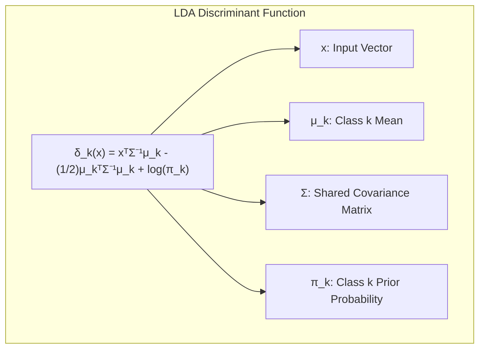

A LDA é eficaz em problemas com classes bem separadas e tem a vantagem de ser computacionalmente eficiente [^7.3.1], [^7.3.2]. No entanto, a suposição de normalidade e covariâncias iguais pode ser uma limitação em algumas aplicações [^7.3.3]. A LDA também pode sofrer com a maldição da dimensionalidade, o que justifica abordagens de regularização [^7.5].

> 💡 **Exemplo Numérico:** Suponha que temos duas classes de flores, classe A e classe B, cada uma com duas características: comprimento da sépala (X1) e largura da sépala (X2). Os dados da classe A têm média μ_A = [5, 3] e da classe B têm média μ_B = [7, 4]. A matriz de covariância comum Σ é [[0.6, 0.2], [0.2, 0.4]]. Para classificar uma nova flor com características x = [6, 3.5], calculamos as funções discriminantes δ_A(x) e δ_B(x) usando os valores de μ_A, μ_B e Σ, juntamente com a probabilidade a priori de cada classe (que se assume serem iguais neste exemplo). A classe com maior valor de δ(x) será a classe predita.

**Corolário 1:  Função Discriminante Linear e Projeção**

As funções discriminantes lineares em LDA correspondem à projeção dos dados sobre o vetor normal ao hiperplano de decisão. A direção ótima para projetar os dados é definida pelos autovetores da matriz de covariância "entre classes". O hiperplano de decisão entre duas classes é perpendicular ao vetor diferença das médias das classes ($μ_1 - μ_2$), que por sua vez corresponde à direção de máxima separabilidade.
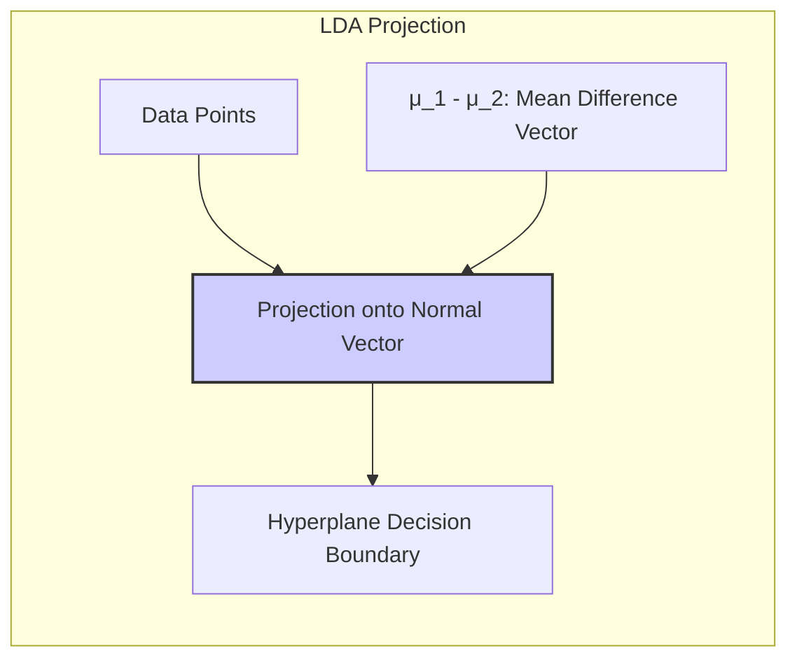

**Prova:**

A função discriminante linear pode ser escrita como $δ_k(x) = x^T w_k + b_k$, onde $w_k$ corresponde a $\Sigma^{-1} \mu_k$ e $b_k$ corresponde a $ - \frac{1}{2} \mu_k^T \Sigma^{-1} \mu_k + log \pi_k$ [^7.3]. O hiperplano de decisão entre as classes $k$ e $l$ é definido por $δ_k(x) = δ_l(x)$, que pode ser reescrito como $x^T (w_k - w_l) + (b_k - b_l) = 0$. Assim, $x^T (\Sigma^{-1} \mu_k - \Sigma^{-1} \mu_l) + (b_k - b_l) = 0$ ou $x^T \Sigma^{-1} (\mu_k - \mu_l) + (b_k - b_l) = 0$. O vetor normal ao hiperplano é $\Sigma^{-1} (\mu_k - \mu_l)$, que na realidade é uma transformação de $\mu_k - \mu_l$. Se a matriz de covariância for a identidade, o vetor normal será exatamente $\mu_k - \mu_l$ [^7.3]. $\blacksquare$

> 💡 **Exemplo Numérico:** Usando o exemplo anterior das flores, o vetor de diferença entre as médias é μ_A - μ_B = [-2, -1]. O vetor normal ao hiperplano de decisão será Σ⁻¹(μ_A - μ_B), que indica a direção na qual a projeção dos dados maximizará a separação entre as classes. O hiperplano de decisão é perpendicular a esse vetor.

**Conceito 3: Logistic Regression**

**Logistic Regression** é outro método popular para classificação, que modela a probabilidade de uma classe em função de uma combinação linear das entradas, utilizando uma função logística [^7.4]. Diferentemente da LDA, a regressão logística não assume normalidade das classes ou covariâncias iguais [^7.4]. A probabilidade de um caso pertencer à classe 1, dado as entradas $x$, é modelada como:

$$p(X) = \frac{1}{1+e^{-(\beta_0 + \beta^T x)}}$$
onde $\beta_0$ é o intercepto e $\beta$ são os coeficientes [^7.4]. Os parâmetros são estimados maximizando a verossimilhança dos dados observados [^7.4.1], [^7.4.2].
A regressão logística é frequentemente usada devido a sua interpretabilidade e flexibilidade, sendo capaz de modelar relações não lineares por meio de transformações das variáveis preditoras [^7.4.4].
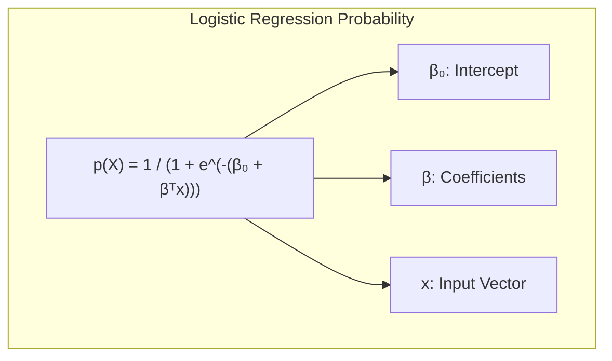

> ⚠️ **Nota Importante**: A regressão logística modela a probabilidade de um evento, fornecendo uma saída entre 0 e 1, enquanto a LDA é baseada em projeções lineares e não fornece estimativas diretas de probabilidade [^7.4.1].

> ❗ **Ponto de Atenção**: Em situações onde as classes são desbalanceadas, é crucial usar técnicas de amostragem ou pesos de classe para garantir que a regressão logística não seja tendenciosa em direção à classe majoritária [^7.4.2].

> ✔️ **Destaque**: Apesar de serem métodos distintos, tanto a LDA quanto a regressão logística produzem fronteiras de decisão lineares no espaço original, o que as torna comparáveis em muitos cenários. A diferença reside principalmente na maneira como os parâmetros são estimados e nas suposições subjacentes [^7.5].

> 💡 **Exemplo Numérico:** Imagine que temos dados sobre clientes que compraram (classe 1) ou não compraram (classe 0) um produto, com base em seu histórico de gastos (X). Após ajustar um modelo de regressão logística, obtemos os coeficientes β₀ = -3 e β₁ = 0.5. Assim, a probabilidade de um cliente comprar o produto, dado um histórico de gastos X=10, seria p(X) = 1 / (1 + exp(-(-3 + 0.5 * 10))) = 1 / (1 + exp(-2)) ≈ 0.88. Isso indica que clientes com histórico de gastos de 10 unidades têm uma alta probabilidade de comprar o produto.

### Regressão Linear e Mínimos Quadrados para Classificação

<imagem: Diagrama ilustrando o processo de regressão de indicadores, desde a codificação de classes até a aplicação da regra de decisão e comparação com métodos probabilísticos>

A **regressão linear** pode ser aplicada à classificação através da criação de uma matriz de indicadores, onde cada coluna representa uma classe e os valores são 1 se a observação pertence à classe e 0 caso contrário [^7.2]. Em vez de usar a regressão linear diretamente sobre as variáveis de resposta categóricas, codificamos a variável em um conjunto de variáveis binárias (indicadoras), uma para cada classe, e realizamos a regressão [^7.2].
No caso de duas classes, isso equivaleria a usar 1 para a classe positiva e 0 para a negativa, e então realizamos uma regressão linear para estimar os coeficientes $\beta$.
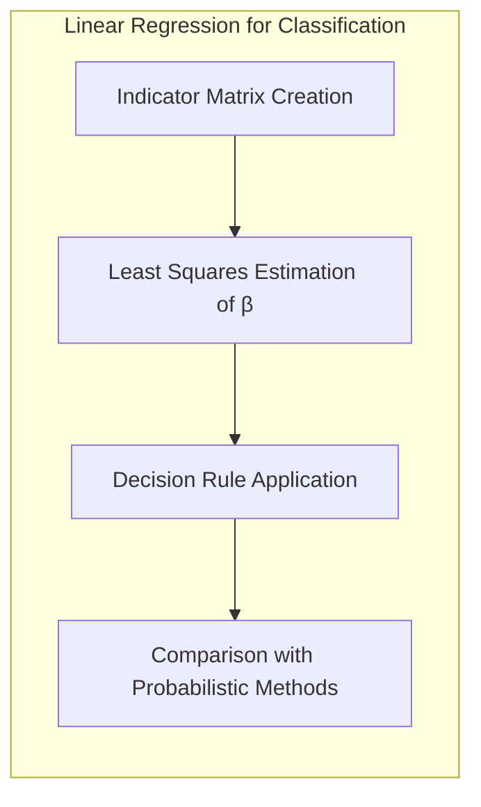

Essa abordagem é conceitualmente simples, mas apresenta algumas limitações [^7.1], [^7.2]. Uma delas é que a regressão linear não restringe as previsões a estarem entre 0 e 1 (o que seria desejável para probabilidades), o que pode levar a extrapolações sem sentido [^7.2]. Além disso, o método de mínimos quadrados busca minimizar a soma dos erros quadráticos, o que pode não ser ideal para problemas de classificação onde erros de diferentes magnitudes podem ter um impacto diferente na decisão final [^7.2].

Apesar dessas limitações, a regressão linear para classificação pode ser uma boa opção em cenários onde a fronteira de decisão é razoavelmente linear e o objetivo principal é a classificação, e não necessariamente a estimativa precisa de probabilidades [^7.2].

> 💡 **Exemplo Numérico:** Considere um problema de classificação binária com apenas uma variável preditora X. Temos 5 amostras com X = [1, 2, 3, 4, 5] e rótulos Y = [0, 0, 1, 1, 1]. Se usarmos regressão linear, vamos ajustar um modelo onde  Y = β₀ + β₁X. Os coeficientes estimados podem ser, por exemplo, β₀ = -0.4 e β₁ = 0.3. Para classificar um novo ponto, X=3.5, usaríamos a previsão Ŷ = -0.4 + 0.3*3.5 = 0.65. Se Ŷ > 0.5, classificaríamos como classe 1, senão, classe 0. No entanto, para um X muito alto (ex: X=10), Ŷ pode ser maior que 1, e para um X muito baixo (ex: X=-2), Ŷ pode ser menor que 0, o que não faz sentido em termos de probabilidades.

**Lemma 2: Equivalência entre Projeções da Regressão Linear e LDA**

Em cenários onde a matriz de covariância de cada classe é igual, as projeções geradas pela regressão linear de indicadores e pela LDA são equivalentes (podendo diferir em termos de escala e translação) quando se utiliza a regra de decisão ótima [^7.3].
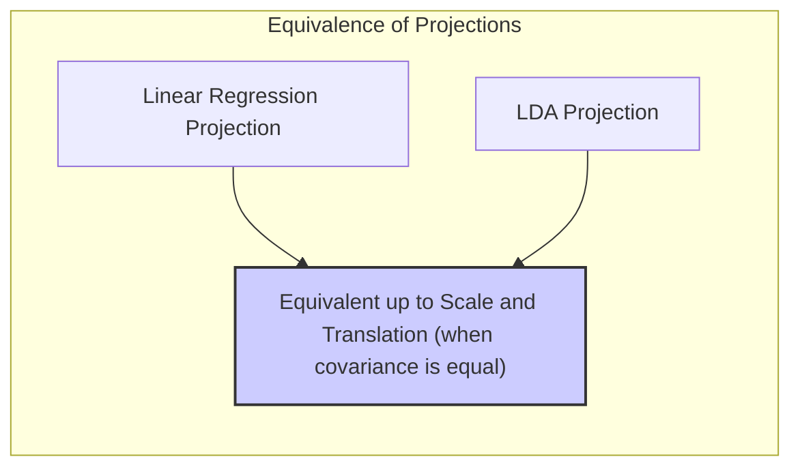
**Prova:**

A função discriminante da LDA é dada por $\delta_k(x) = x^T \Sigma^{-1} \mu_k - \frac{1}{2} \mu_k^T \Sigma^{-1} \mu_k + log \pi_k$. A regra de decisão é escolher a classe $k$ que maximiza a função discriminante.
Na regressão linear de indicadores, a previsão para uma observação $x$ é dada por $\hat{Y} = X\beta$, onde $\beta = (X^T X)^{-1} X^T Y$. Se temos duas classes codificadas como 0 e 1, a decisão de classe se dá comparando a previsão com 0.5, ou seja, se $\hat{Y} > 0.5$, a observação é classificada na classe 1. Quando projetamos um vetor $x$ sobre o vetor $\beta$, essa projeção é igual a $x^T\beta$. Se as classes têm covariâncias iguais, pode-se provar que a direção de máxima separabilidade entre as classes na LDA é paralela ao vetor $\beta$ da regressão linear de indicadores. Portanto, as projeções geradas por ambos os métodos são equivalentes, diferindo apenas em termos de escala e translação [^7.3]. $\blacksquare$

> 💡 **Exemplo Numérico:** Considere o mesmo exemplo numérico anterior onde temos duas classes com uma variável preditora X. A regressão linear de indicadores nos dá um vetor de coeficientes β, que, quando projetado sobre um novo ponto X, indica a classe predita. A LDA, sob a suposição de covariâncias iguais, também encontra um vetor que, quando projetado sobre X, separa as classes.  Esses dois vetores são paralelos, e diferem apenas em termos de escala (comprimento) e translação (deslocamento). Isso significa que as decisões de classificação serão semelhantes, com pequenas diferenças.

**Corolário 2: Simplificação da Análise do Modelo**

Essa equivalência (do Lemma 2) pode simplificar a análise do modelo, pois nos permite analisar a regressão linear, que muitas vezes é mais fácil de interpretar e otimizar computacionalmente, ao invés da LDA, que pode envolver inversões de matrizes de covariância maiores [^7.3].
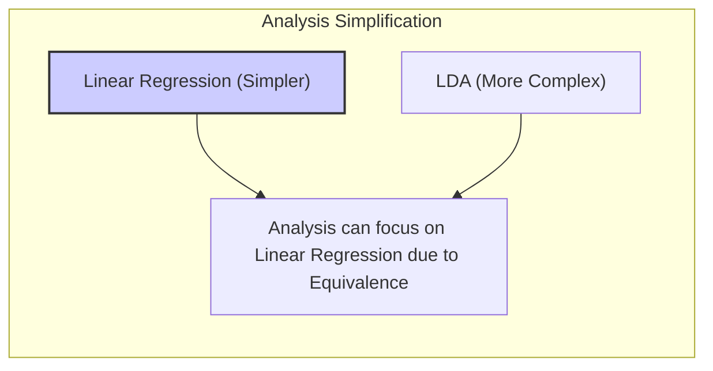

A regressão linear de indicadores pode levar a estimativas que estão fora do intervalo [0,1] [^7.4], enquanto modelos como a regressão logística se esforçam para produzir estimativas nesse intervalo [^7.4]. No entanto, quando o objetivo principal é obter uma fronteira de decisão linear, a regressão de indicadores é suficiente e até mesmo mais eficiente em certos cenários [^7.2]. A abordagem de mínimos quadrados pode ser interpretada como uma aproximação da função discriminante linear, o que é útil para entender por que a regressão linear de indicadores pode funcionar bem em algumas configurações de classificação, apesar de suas limitações [^7.2].

### Métodos de Seleção de Variáveis e Regularização em Classificação

<imagem: Um mapa mental que conecta os conceitos de LDA, Logistic Regression e Hyperplanes com regularização L1 e L2, mostrando como esses métodos são usados para seleção de variáveis e para controle de complexidade do modelo>

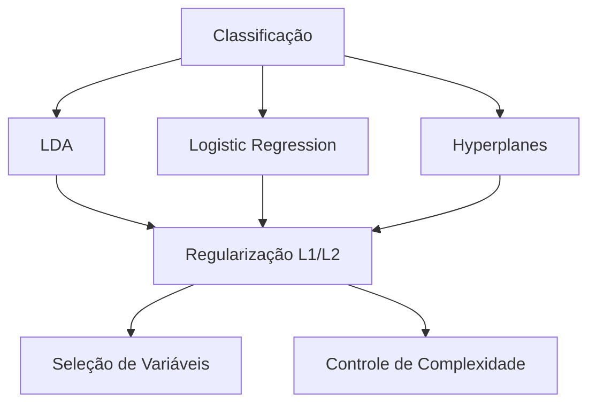

A seleção de variáveis e a regularização são técnicas cruciais em classificação, especialmente quando se lida com um grande número de preditores [^7.4.4], [^7.5]. O objetivo principal dessas técnicas é reduzir a complexidade do modelo, evitando o *overfitting* e melhorando a generalização [^7.4.4], [^7.5].

A **regularização** em regressão logística geralmente envolve a adição de termos de penalidade à função de custo, que é baseada na verossimilhança [^7.4.4]. Dois tipos comuns de regularização são:

1.  **Regularização L1 (Lasso):** Adiciona a soma dos valores absolutos dos coeficientes como termo de penalidade, i.e., $ \lambda \sum_{j=1}^p |\beta_j|$ [^7.4.4], [^7.5]. A penalidade L1 tem o efeito de zerar alguns coeficientes, levando a modelos mais *sparse* (com menos variáveis preditoras) e com melhor interpretabilidade [^7.4.4], [^7.5].
2.  **Regularização L2 (Ridge):** Adiciona a soma dos quadrados dos coeficientes como termo de penalidade, i.e., $\lambda \sum_{j=1}^p \beta_j^2$ [^7.5]. A penalidade L2 reduz a magnitude dos coeficientes, mas raramente os zera completamente, levando a modelos mais estáveis [^7.4.4].
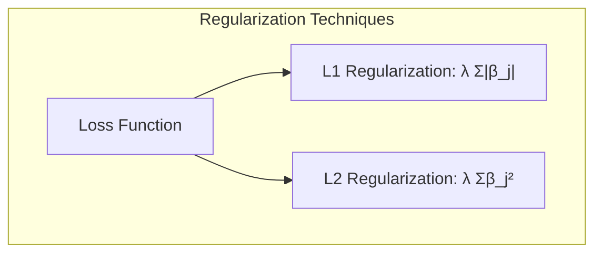
A escolha entre L1 e L2 ou uma combinação de ambas (Elastic Net) depende do problema específico e da importância da interpretabilidade e da estabilidade do modelo [^7.5].

> 💡 **Exemplo Numérico:** Considere um modelo de regressão logística com 5 variáveis preditoras (X1, X2, X3, X4, X5). Sem regularização, os coeficientes estimados são: β = [0.8, -0.5, 1.2, 0.2, -0.1].
>  - **Regularização L1 (Lasso):** Com um parâmetro λ adequado, a regularização L1 pode levar a um vetor β = [0.5, 0, 0.9, 0, 0]. As variáveis X2, X4 e X5 são removidas do modelo, tornando-o mais simples e interpretável.
>  - **Regularização L2 (Ridge):** Com um parâmetro λ adequado, a regularização L2 pode levar a um vetor β = [0.6, -0.3, 0.8, 0.1, -0.05]. Todos os coeficientes são reduzidos em magnitude, mas nenhum é zerado.

**Lemma 3: Sparsity com Penalização L1 na Regressão Logística**

A penalização L1 na regressão logística induz sparsity nos coeficientes, ou seja, alguns coeficientes se tornam exatamente zero, efetivamente removendo as variáveis correspondentes do modelo.
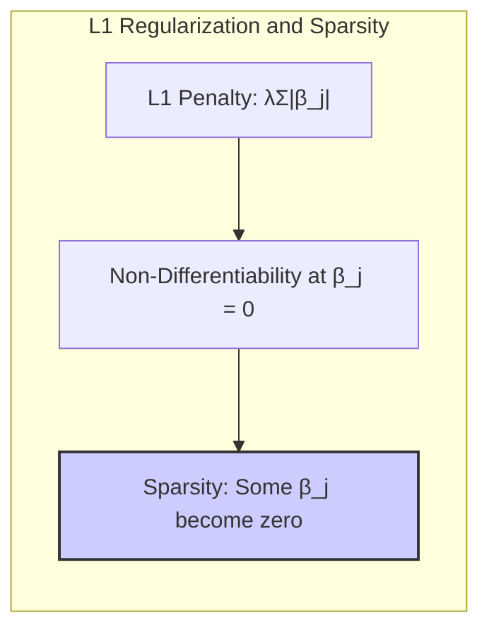

**Prova:**

Na regressão logística, o objetivo é maximizar a verossimilhança dos dados, o que equivale a minimizar o log-loss (negativo da log-verossimilhança) [^7.4.3]. Quando adicionamos a penalidade L1, o problema de otimização torna-se:

$$\min_\beta  - \frac{1}{N} \sum_{i=1}^N [y_i \log p(x_i) + (1-y_i) \log (1-p(x_i))] + \lambda \sum_{j=1}^p |\beta_j|$$

onde $\lambda$ é o parâmetro de regularização. A não diferenciabilidade da função do valor absoluto em 0 leva à possibilidade de encontrar mínimos onde alguns $\beta_j$ são exatamente 0. Se o gradiente da função do log-loss (sem a penalidade) em $\beta_j = 0$ é tal que seu valor absoluto é menor que $\lambda$, o valor ótimo de $\beta_j$ é zero [^7.4.4]. Esse comportamento é diferente da penalidade L2, que apenas reduz os coeficientes sem necessariamente levá-los a zero [^7.4.4], [^7.5]. $\blacksquare$

> 💡 **Exemplo Numérico:** Imagine que estamos treinando um modelo de regressão logística com penalização L1, e para uma variável específica $X_j$, o gradiente do log-loss (sem a penalidade) em $\beta_j = 0$ é igual a 0.3. Se o parâmetro de regularização $\lambda$ for 0.5, a penalidade L1 força o coeficiente $\beta_j$ a ser exatamente 0. Isso ocorre porque o custo de manter $\beta_j$ diferente de zero (devido ao termo de penalidade) é maior do que a pequena melhoria que sua inclusão traria ao log-loss.

**Corolário 3: Interpretabilidade com Regularização L1**

A capacidade da penalização L1 de zerar alguns coeficientes melhora a interpretabilidade do modelo, pois o torna mais simples e fácil de entender [^7.4.5]. Variáveis com coeficientes zerados são efetivamente removidas do modelo, indicando que não contribuem significativamente para a classificação [^7.4.5].

> ⚠️ **Ponto Crucial**: A combinação de penalidades L1 e L2 (Elastic Net) pode aproveitar as vantagens de ambos os tipos de regularização, oferecendo flexibilidade na modelagem e controle sobre a esparsidade dos modelos [^7.5].

### Separating Hyperplanes e Perceptrons

A ideia de **hiperplanos separadores** é central para muitos métodos de classificação linear, incluindo o SVM (Support Vector Machine) [^7.5.2]. Um hiperplano é um subespaço afim de dimensão $p-1$ em um espaço de dimensão $p$. Em duas dimensões, um hiperplano é uma linha. Em três dimensões, um hiperplano é um plano. A ideia por trás dos hiperplanos separadores é encontrar o hiperplano que melhor separa as classes, idealmente maximizando a margem de separação entre as classes [^7.5.2].
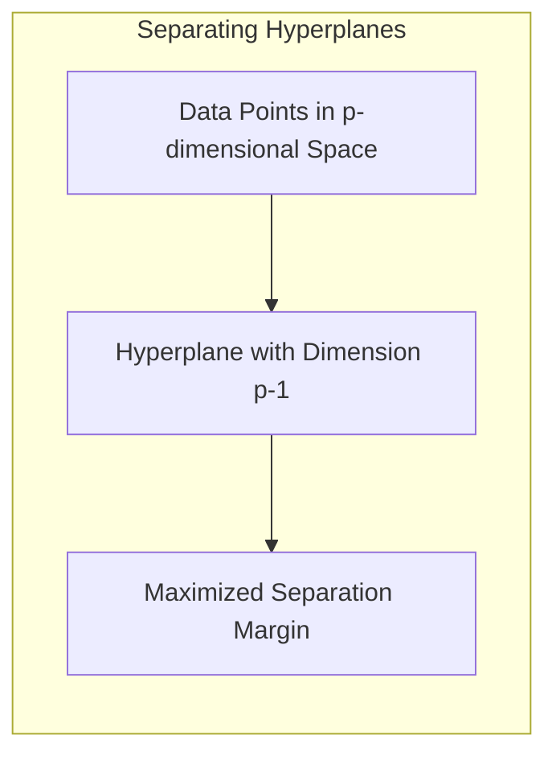

Para encontrar o hiperplano ótimo, podemos formular um problema de otimização que busca maximizar a distância entre o hiperplano e os pontos mais próximos de cada classe (os *support vectors*) [^7.5.2]. Esse problema pode ser resolvido de forma eficiente usando o *dual problem* de Wolfe, resultando em uma solução que depende de combinações lineares desses *support vectors* [^7.5.2].

O **Perceptron** de Rosenblatt é um dos primeiros algoritmos de aprendizado de máquina para encontrar hiperplanos separadores. O algoritmo atualiza iterativamente os pesos do hiperplano com base nas classificações erradas dos exemplos de treinamento. O Perceptron converge para um hiperplano separador se os dados forem linearmente separáveis [^7.5.1].

> 💡 **Exemplo Numérico:** Imagine dados em duas dimensões, onde temos duas classes de pontos, uma em torno de (2,2) e outra em torno de (6,6). O hiperplano separador (uma linha neste caso) pode ser descrito por uma equação do tipo  w₁x₁ + w₂x₂ + b = 0, onde w = [w₁, w₂] é o vetor normal ao hiperplano e b é o intercepto. O perceptron tenta encontrar w e b ajustando-se iterativamente com base em erros de classificação.

### Pergunta Teórica Avançada: Quais as diferenças fundamentais entre a formulação de LDA e a Regra de Decisão Bayesiana considerando distribuições Gaussianas com covariâncias iguais?

**Resposta:**
A **Regra de Decisão Bayesiana** é um classificador ótimo que atribui um padrão à classe com maior probabilidade posterior, dada a observação [^7.3]. No contexto de distribuições gaussianas, a regra de decisão Bayesiana pode ser expressa da seguinte maneira: dado um vetor de entrada $x$, o classificador Bayesiano atribui $x$ à classe $k$ se:

$$Pr(G=k|X=x) > Pr(G=j|X=x) \quad \forall j \neq k$$
onde $Pr(G=k|X=x)$ é a probabilidade posterior de a classe ser $k$ dado que a observação é $x$. Usando o Teorema de Bayes, podemos escrever:
$$Pr(G=k|X=x) = \frac{Pr(X=x|G=k) Pr(G=k)}{Pr(X=x)}$$
Sob a suposição de que $X$ segue uma distribuição normal em cada classe com média $\mu_k$ e matriz de covariância $\Sigma_k$, temos:
$$Pr(X=x|G=k) = \frac{1}{\sqrt{(2\pi)^p |\Sigma_k|}} \exp(-\frac{1}{2}(x-\mu_k)^T\Sigma_k^{-1}(x-\mu_k))$$
onde $p$ é a dimensão de $x$.

Quando se assume que todas as classes compartilham a mesma matriz de covariância ($\Sigma_k = \Sigma$ para todo $k$), e tomando o log das probabilidades posteriores, e eliminando os termos que não dependem da classe, o classificador Bayesiano resulta nas mesmas funções discriminantes lineares do LDA [^7.3]:

$$δ_k(x) = x^T \Sigma^{-1} \mu_k - \frac{1}{