## Optimismo da Taxa de Erro de Treinamento
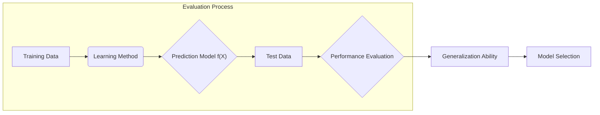

Introdução
A avaliação do desempenho de um método de aprendizado está intrinsecamente ligada à sua capacidade de generalização, ou seja, sua performance em dados de teste independentes [^7.1]. Em cenários práticos, essa avaliação é crucial para orientar a escolha do método ou modelo de aprendizado mais adequado, além de fornecer uma medida da qualidade do modelo final selecionado [^7.1]. Este capítulo aborda métodos para avaliação de performance, seleção de modelos e explora a relação entre viés, variância e complexidade do modelo [^7.2].

### Conceitos Fundamentais
**Conceito 1: Generalização e Erro de Teste**.
O conceito de **generalização** refere-se à capacidade de um modelo de aprendizado em fazer previsões precisas em dados não vistos durante o treinamento [^7.1]. A performance de um modelo em dados de treinamento geralmente não reflete sua capacidade de generalização, uma vez que o modelo pode ter se ajustado excessivamente aos dados de treinamento, um fenômeno conhecido como *overfitting*. A métrica chave para avaliar essa generalização é o **erro de teste**, que mede o quão bem o modelo prediz resultados em dados independentes [^7.2]. Métodos lineares de aprendizado, embora mais simples e propensos a viés, são cruciais devido à sua interpretabilidade e propriedades teóricas bem estabelecidas. A complexidade do modelo e a quantidade de dados são fatores determinantes no equilíbrio entre viés e variância.
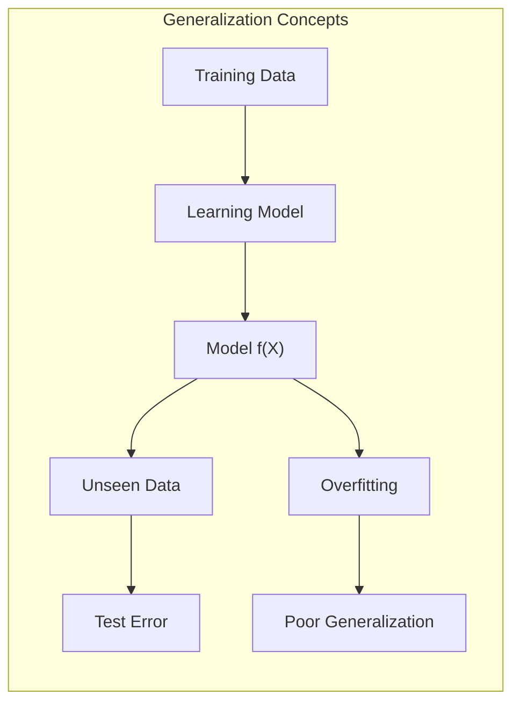

**Lemma 1:** *Decomposição do Erro Quadrático Médio*.
O erro quadrático médio (MSE) em um ponto $x_0$ pode ser decomposto em três componentes: variância do ruído, viés ao quadrado e variância da estimativa [^7.3]. Formalmente, o erro esperado em um ponto de entrada $x_0$ é definido como:
$$Err(x_0) = E[(Y-f(x_0))^2 | X=x_0] = \sigma^2 + [Ef(x_0) - f(x_0)]^2 + E[f(x_0) - Ef(x_0)]^2$$
Onde:
- $\sigma^2$ é a variância do erro aleatório (ruído).
- $[Ef(x_0) - f(x_0)]^2$ é o viés ao quadrado, a diferença entre a média das previsões do modelo e o valor real.
- $E[f(x_0) - Ef(x_0)]^2$ é a variância da estimativa, a dispersão das previsões do modelo em torno de sua média.
Esta decomposição revela o *trade-off* fundamental entre viés e variância na construção de modelos de aprendizado. $\blacksquare$
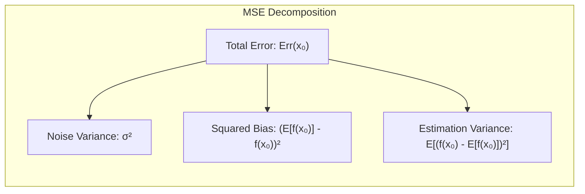

> 💡 **Exemplo Numérico:** Imagine um cenário em que queremos prever o preço de casas ($Y$) com base no tamanho ($X$). Suponha que o verdadeiro relacionamento seja $Y = 2X + 5 + \epsilon$, onde $\epsilon \sim N(0, \sigma^2)$ é um ruído aleatório.
>
> 1. **Modelo Simples (Alto Viés):**  Um modelo linear simples como $f(x) = 3X$ (ignorando o intercepto e com inclinação incorreta) terá um viés alto. Por exemplo, se $x_0 = 10$, o verdadeiro valor seria $Y = 2*10 + 5 + \epsilon = 25 + \epsilon$, mas a predição média do modelo seria $Ef(x_0) = 3 * 10 = 30$. O viés seria $(30-25)^2 = 25$.
> 2. **Modelo Flexível (Alta Variância):** Um modelo muito complexo, como um polinômio de alta ordem ajustado a poucos pontos de dados, pode se ajustar perfeitamente aos dados de treinamento, mas gerar previsões muito diferentes com pequenas variações nos dados. Por exemplo, com um pequeno conjunto de treinamento, a previsão para $x_0 = 10$ pode ser 24 numa amostra, 28 em outra, resultando numa variância alta.
> 3. **Ruído:** Se $\sigma^2 = 4$, isso representa a variabilidade inerente nos dados, que nenhum modelo pode reduzir.
>
> De acordo com o Lemma 1, o erro total seria a soma do viés ao quadrado (25), a variância (digamos, 2), e o ruído (4), totalizando 31.

**Conceito 2: Bias, Variance e Complexidade do Modelo**.
O **viés** representa o erro devido às simplificações feitas pelo modelo, enquanto a **variância** mede a sensibilidade do modelo a pequenas mudanças nos dados de treinamento [^7.2]. Modelos mais complexos geralmente possuem baixo viés, mas alta variância e vice-versa.  Em relação à complexidade do modelo, o *overfitting* ocorre quando um modelo se ajusta muito bem aos dados de treinamento, mas generaliza mal para novos dados. Isso ocorre quando o modelo se torna muito complexo, capturando ruído nos dados de treinamento ao invés de padrões subjacentes [^7.2]. A relação entre viés e variância é um dilema crucial na construção de modelos de aprendizado e deve ser cuidadosamente considerada na seleção do modelo.
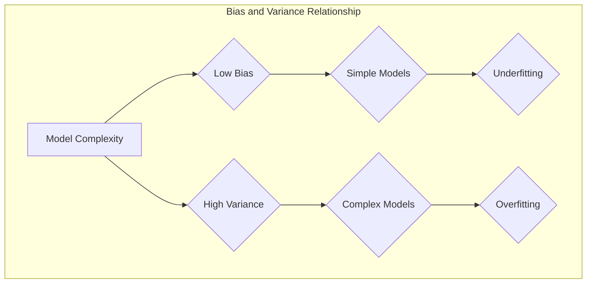

**Corolário 1:** *Trade-off Viés-Variância em Modelos Lineares*.
Modelos lineares simples, como a regressão linear, tendem a ter alto viés, pois impõem uma forma funcional restritiva aos dados. Em contrapartida, modelos mais complexos, como árvores de decisão com grande profundidade, podem capturar padrões complexos nos dados de treinamento, mas apresentam alta variância, tornando-os suscetíveis ao *overfitting* [^7.3]. Este *trade-off* demonstra a necessidade de buscar um equilíbrio ao escolher modelos para tarefas de classificação e regressão. Uma quantidade adequada de dados e técnicas de regularização são usadas para mitigar o *overfitting*.

> 💡 **Exemplo Numérico:** Considere o ajuste de modelos a um conjunto de dados que segue uma relação cúbica, $y = 0.5x^3 - 2x^2 + 3x + \epsilon$, onde $\epsilon$ é um ruído gaussiano.
>
> 1. **Regressão Linear (Alto Viés):** Um modelo de regressão linear ($y = \beta_0 + \beta_1 x$) não conseguiria capturar a curvatura dos dados, resultando em um alto viés. O modelo linear simplificaria a relação, levando a erros sistemáticos nas previsões.
> 2. **Árvore de Decisão Profunda (Alta Variância):** Uma árvore de decisão com muitas divisões pode se ajustar perfeitamente aos dados de treinamento, mas seria muito sensível a pequenas mudanças no conjunto de dados. Se uma nova amostra de dados fosse usada, a estrutura da árvore e, consequentemente, as previsões poderiam variar muito, indicando alta variância.
> 3. **Regularização:** Métodos como a regularização L2 (Ridge) poderiam ser usados para controlar a complexidade de um modelo polinomial de alta ordem, adicionando uma penalidade que evita que os coeficientes cresçam muito, o que ajuda a equilibrar o trade-off viés-variância.
> ```python
> import numpy as np
> import matplotlib.pyplot as plt
> from sklearn.linear_model import LinearRegression, Ridge
> from sklearn.preprocessing import PolynomialFeatures
> from sklearn.pipeline import make_pipeline
>
> np.random.seed(42)
> x = np.sort(np.random.rand(50) * 4)  # 50 pontos entre 0 e 4
> y = 0.5*x**3 - 2*x**2 + 3*x + np.random.randn(50)  # Dados com ruído
>
> # Regressão linear
> model_linear = LinearRegression()
> model_linear.fit(x.reshape(-1, 1), y)
> x_plot = np.linspace(0, 4, 100)
> y_linear = model_linear.predict(x_plot.reshape(-1,1))
>
> # Regressão polinomial com regularização Ridge
> degree = 10
> alpha = 1
> model_ridge = make_pipeline(PolynomialFeatures(degree), Ridge(alpha=alpha))
> model_ridge.fit(x.reshape(-1, 1), y)
> y_ridge = model_ridge.predict(x_plot.reshape(-1,1))
>
> # Plot
> plt.scatter(x, y, color='blue', label='Dados de Treinamento')
> plt.plot(x_plot, y_linear, color='red', label='Regressão Linear')
> plt.plot(x_plot, y_ridge, color='green', label='Regressão Ridge (Polinomial)')
> plt.xlabel('x')
> plt.ylabel('y')
> plt.legend()
> plt.title('Comparação de Modelos')
> plt.show()
> ```
> Esta visualização demonstra como um modelo linear (em vermelho) apresenta alto viés, pois não consegue capturar a curvatura dos dados. O modelo polinomial com regularização ridge (em verde) consegue se ajustar melhor aos dados, sem overfitting, equilibrando o viés e a variância.

**Conceito 3: Erro de Treinamento vs Erro de Teste**.
O **erro de treinamento** é a média do erro do modelo sobre os dados de treinamento, enquanto o **erro de teste** é a média do erro do modelo sobre um conjunto de dados independentes [^7.2]. É importante notar que o erro de treinamento geralmente é menor que o erro de teste, especialmente em modelos complexos que ajustam bem aos dados de treinamento. Um erro de treinamento baixo não garante que o modelo seja bom para dados não vistos. Uma discrepância significativa entre o erro de treinamento e o erro de teste sugere um possível *overfitting*. Métodos de avaliação, como validação cruzada, ajudam a estimar o erro de teste de forma mais robusta.
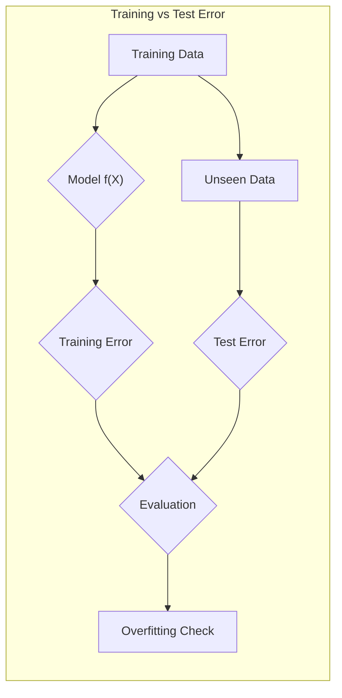

> ⚠️ **Nota Importante**: O erro de treinamento geralmente não é um bom estimador do erro de teste [^7.2].
> ❗ **Ponto de Atenção**: O *overfitting* ocorre quando um modelo tem um bom desempenho nos dados de treinamento, mas um desempenho ruim em dados de teste [^7.2].
> ✔️ **Destaque**: O objetivo principal é minimizar o erro de teste, não o erro de treinamento [^7.1].

### Regressão Linear e Mínimos Quadrados para Classificação
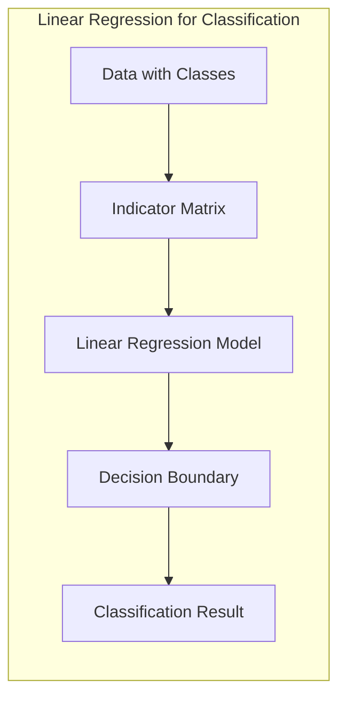

A regressão linear, quando aplicada a uma matriz de indicadores, pode ser usada para fins de classificação.  Nessa abordagem, cada classe é representada por um vetor indicador, e a regressão linear busca ajustar um modelo aos dados. No entanto, é importante observar as limitações dessa técnica. O modelo resultante pode não gerar limites de decisão ideais, além de não fornecer estimativas de probabilidade bem calibradas [^7.2]. Apesar disso, em certas situações, a regressão linear pode ser suficiente para a construção de fronteiras de decisão lineares. A utilização de mínimos quadrados para a estimação dos parâmetros na regressão linear pode levar a problemas como o "masking problem" quando as classes não são linearmente separáveis [^7.3].

> 💡 **Exemplo Numérico:** Considere um problema de classificação binária com duas classes, 'A' e 'B'. Os dados podem ser representados por duas variáveis, $x_1$ e $x_2$.
> 1. **Codificação de Classes:** A classe 'A' é codificada como 0 e a classe 'B' como 1 (ou -1 e 1).
> 2. **Regressão Linear:** Ajusta-se um modelo linear $f(x) = \beta_0 + \beta_1 x_1 + \beta_2 x_2$ aos dados.
> 3. **Limiar de Decisão:** A classe de um novo ponto $x$ é determinada comparando $f(x)$ com um limiar, por exemplo, 0.5. Se $f(x) \geq 0.5$, o ponto é classificado como 'B'; caso contrário, como 'A'.
> ```python
> import numpy as np
> import matplotlib.pyplot as plt
> from sklearn.linear_model import LinearRegression
>
> # Dados de exemplo
> np.random.seed(42)
> X = np.random.rand(100, 2)  # 100 pontos com 2 features
> y = np.where(X[:, 0] + X[:, 1] > 1, 1, 0) # Classes: 0 ou 1
>
> # Ajusta o modelo de regressão linear
> model = LinearRegression()
> model.fit(X, y)
>
> # Cria uma grade para plotar a fronteira de decisão
> x_min, x_max = X[:, 0].min() - 0.1, X[:, 0].max() + 0.1
> y_min, y_max = X[:, 1].min() - 0.1, X[:, 1].max() + 0.1
> xx, yy = np.meshgrid(np.linspace(x_min, x_max, 100),
>                      np.linspace(y_min, y_max, 100))
> Z = model.predict(np.c_[xx.ravel(), yy.ravel()])
> Z = Z.reshape(xx.shape)
>
> # Plota os dados e a fronteira de decisão
> plt.contourf(xx, yy, Z, levels=[0, 0.5, 1], colors=['skyblue', 'salmon'], alpha=0.8)
> plt.scatter(X[:, 0], X[:, 1], c=y, edgecolors='k', cmap=plt.cm.RdBu)
> plt.xlabel('$x_1$')
> plt.ylabel('$x_2$')
> plt.title('Regressão Linear para Classificação')
> plt.show()
> ```
> Este código ilustra como a regressão linear pode ser usada para classificar dados, criando uma fronteira de decisão linear. No entanto, a função de predição pode gerar valores fora do intervalo \[0, 1], que não são probabilidades válidas.

**Lemma 2:** *Relação entre Projeções e Limites de Decisão*.
A projeção dos dados no hiperplano de decisão, em certas condições, é equivalente à projeção obtida por um discriminante linear [^7.3]. Formalmente, seja $X$ a matriz de dados, com cada linha representando um ponto de dados, e $Y$ a matriz de indicadores de classe, onde cada coluna representa uma classe. O hiperplano de decisão obtido pela regressão de $Y$ em $X$, é matematicamente equivalente ao discriminante linear obtido por métodos como LDA sob certas condições de normalidade e covariância igual entre classes. Especificamente, sob essas condições, os vetores de pesos encontrados por regressão linear serão proporcionais aos vetores de pesos do LDA, resultando nas mesmas decisões de classe. $\blacksquare$
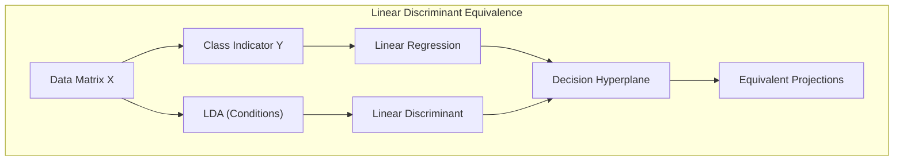

**Corolário 2:** *Condições para Equivalência*.
A equivalência mencionada no Lemma 2, é válida quando as classes apresentam distribuições gaussianas com matrizes de covariância iguais [^7.3]. Caso essas condições não sejam satisfeitas, as fronteiras de decisão geradas pela regressão linear podem diferir significativamente dos resultados de um discriminante linear. Em cenários de alta dimensão com muitas classes, a regressão linear pode se tornar impraticável devido à complexidade do modelo e à quantidade de parâmetros a serem estimados, além de não gerar probabilidades bem calibradas [^7.4].

"Em alguns casos, conforme apontado em [^7.4], a regressão logística pode fornecer estimativas de probabilidade mais estáveis, enquanto a regressão de indicadores pode gerar resultados fora do intervalo [0,1]."
"No entanto, há situações em que a regressão de indicadores, de acordo com [^7.2], é adequada quando o foco está na fronteira de decisão linear."

### Métodos de Seleção de Variáveis e Regularização em Classificação
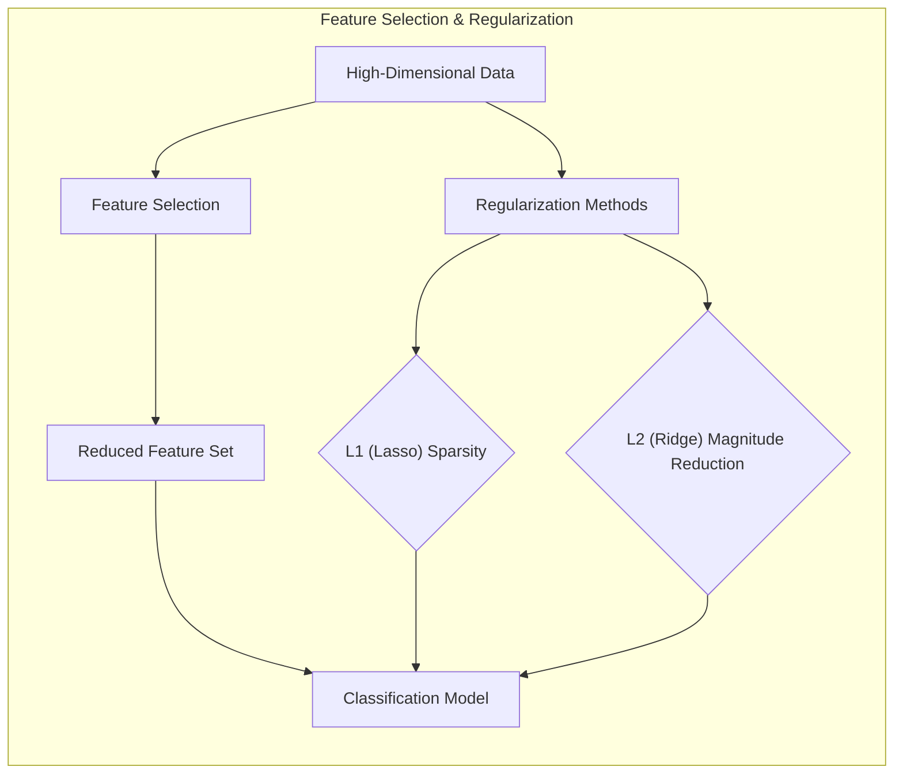

A seleção de variáveis e a regularização são técnicas importantes para aprimorar a performance e a interpretabilidade dos modelos de classificação, especialmente quando se lida com um grande número de *features*. Métodos de regularização, como L1 e L2, são usados para penalizar a complexidade do modelo, evitando o *overfitting* e promovendo a estabilidade [^7.4.4]. A penalização L1 (Lasso) promove a *sparsity*, fazendo com que alguns coeficientes sejam exatamente zero, o que leva a modelos mais interpretáveis [^7.5]. A penalização L2 (Ridge) reduz a magnitude dos coeficientes, o que diminui a influência de *features* potencialmente ruidosas, resultando em modelos mais robustos.

**Lemma 3:** *Penalização L1 e Sparsity*.
A penalização L1 na regressão logística leva a coeficientes esparsos, o que significa que muitos deles são zero [^7.4.4]. A função de custo regularizada com L1 é definida como:
$$J(\beta) = - \frac{1}{N} \sum_{i=1}^{N} [y_i \log(p(x_i)) + (1-y_i) \log(1-p(x_i))] + \lambda \sum_{j=1}^{p} |\beta_j|$$
Onde:
- $J(\beta)$ é a função de custo a ser minimizada.
- $\lambda$ é o parâmetro de regularização, que controla a força da penalização.
- $\beta_j$ são os coeficientes do modelo.

**Prova do Lemma 3:** A penalização L1 adiciona um termo proporcional à soma dos valores absolutos dos coeficientes na função de custo, o que leva a coeficientes nulos para variáveis pouco relevantes. A otimização dessa função resulta em uma solução esparsa, na qual alguns coeficientes são exatamente zero, eliminando as variáveis correspondentes do modelo [^7.4.3]. $\blacksquare$
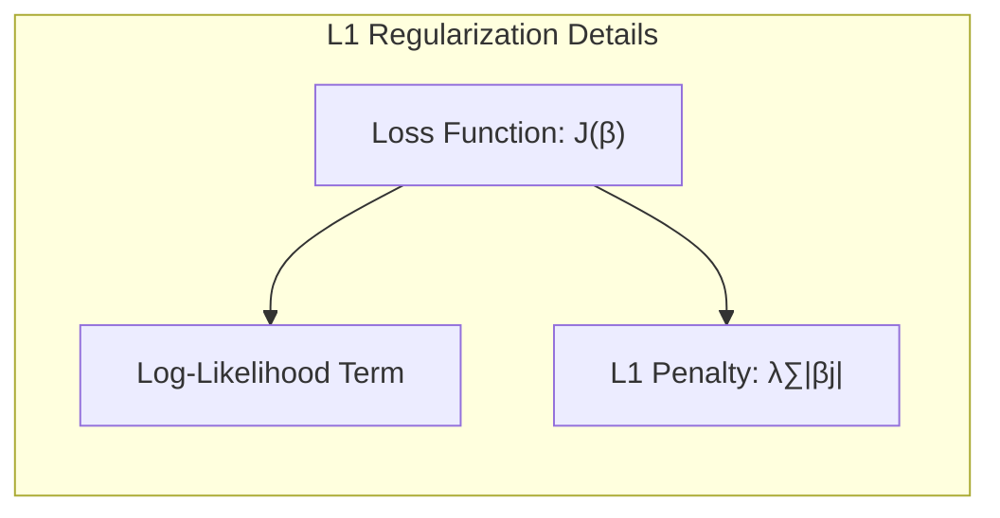

> 💡 **Exemplo Numérico:** Considere um problema de classificação com 10 features. Ajustamos um modelo de regressão logística com regularização L1 e L2.
>
> ```python
> import numpy as np
> import pandas as pd
> from sklearn.linear_model import LogisticRegression
> from sklearn.model_selection import train_test_split
> from sklearn.metrics import accuracy_score
>
> # Gerar dados de exemplo
> np.random.seed(42)
> n_samples = 100
> n_features = 10
> X = np.random.rand(n_samples, n_features)
> y = np.random.randint(0, 2, n_samples)
>
> # Dividir dados em treino e teste
> X_train, X_test, y_train, y_test = train_test_split(X, y, test_size=0.3, random_state=42)
>
> # Modelo sem regularização
> model_no_reg = LogisticRegression(penalty=None, solver='lbfgs')
> model_no_reg.fit(X_train, y_train)
>
> # Modelo com regularização L1 (Lasso)
> model_l1 = LogisticRegression(penalty='l1', solver='liblinear', C=0.5)
> model_l1.fit(X_train, y_train)
>
> # Modelo com regularização L2 (Ridge)
> model_l2 = LogisticRegression(penalty='l2', solver='lbfgs', C=0.5)
> model_l2.fit(X_train, y_train)
>
> # Avaliação dos modelos
> y_pred_no_reg = model_no_reg.predict(X_test)
> y_pred_l1 = model_l1.predict(X_test)
> y_pred_l2 = model_l2.predict(X_test)
>
> acc_no_reg = accuracy_score(y_test, y_pred_no_reg)
> acc_l1 = accuracy_score(y_test, y_pred_l1)
> acc_l2 = accuracy_score(y_test, y_pred_l2)
>
> # Exibir resultados
> results = pd.DataFrame({
>     "Modelo": ["Sem Reg", "Lasso (L1)", "Ridge (L2)"],
>     "Acurácia": [acc_no_reg, acc_l1, acc_l2],
>     "Nº Coef. Zero": [np.sum(model_no_reg.coef_ == 0), np.sum(model_l1.coef_ == 0), np.sum(model_l2.coef_ == 0)]
> })
> print(results)
> ```
>
> Este exemplo mostra:
> - Acurácia nos dados de teste para os três modelos.
> - O número de coeficientes que são exatamente zero no modelo Lasso (L1), indicando que o modelo L1 promove esparsidade. A regularização L2 (Ridge) geralmente não zera os coeficientes, mas reduz sua magnitude.
>
> O parâmetro `C` é o inverso da força de regularização (C = 1/lambda) e influencia o quão forte é a penalidade. Um valor menor de `C` implica maior regularização.

**Corolário 3:** *Interpretabilidade de Modelos Esparsos*.
Modelos com coeficientes esparsos, resultantes da penalização L1, são mais interpretáveis, pois apenas um número reduzido de variáveis exerce influência no resultado [^7.4.5]. Em aplicações com grande número de variáveis, a capacidade de identificar e selecionar as *features* mais relevantes é crucial para a construção de modelos compreensíveis e generalizáveis. A esparsidade também diminui a complexidade computacional do modelo, tornando-o mais eficiente para aplicações em larga escala.
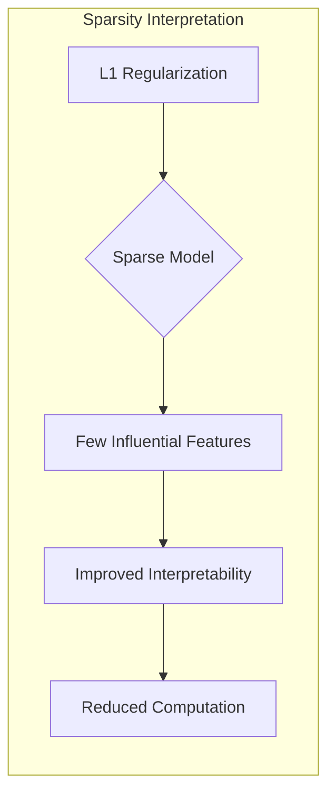

> ⚠️ **Ponto Crucial**: L1 e L2 podem ser combinadas (Elastic Net) para usufruir de vantagens de ambas as regularizações [^7.5].

### Separating Hyperplanes e Perceptrons
A ideia de maximizar a margem de separação entre classes leva ao conceito de **hiperplanos ótimos**, que são aqueles que melhor dividem as classes no espaço de *features* [^7.5.2]. A otimização desses hiperplanos pode ser formulada como um problema de otimização, resolvido utilizando o dual de Wolfe [^7.5.2]. As soluções são geralmente combinações lineares dos chamados vetores de suporte. O Perceptron de Rosenblatt, embora mais simples, é um método que também busca construir hiperplanos separadores [^7.5.1]. O Perceptron itera sobre os dados de treinamento, ajustando os pesos do modelo para classificar corretamente cada ponto. Ele converge para um hiperplano separador, desde que os dados sejam linearmente separáveis.

### Pergunta Teórica Avançada: Quais as diferenças fundamentais entre a formulação de LDA e a Regra de Decisão Bayesiana considerando distribuições Gaussianas com covariâncias iguais?
**Resposta:**
Em cenários onde as classes são normalmente distribuídas com matrizes de covariância iguais, a LDA e a regra de decisão Bayesiana se tornam equivalentes. A LDA assume que as classes compartilham a mesma matriz de covariância e tenta encontrar uma projeção linear que maximize a separação entre as médias das classes [^7.3]. Por outro lado, a regra de decisão Bayesiana busca classificar um novo ponto para a classe com maior probabilidade a posteriori, que é proporcional à probabilidade da amostra dado a classe, e a probabilidade *a priori* da classe. Com as suposições de normalidade e covariâncias iguais, os limites de decisão entre as classes tornam-se lineares e idênticos, indicando que o LDA, sob essas condições, implementa a regra Bayesiana de forma ótima.
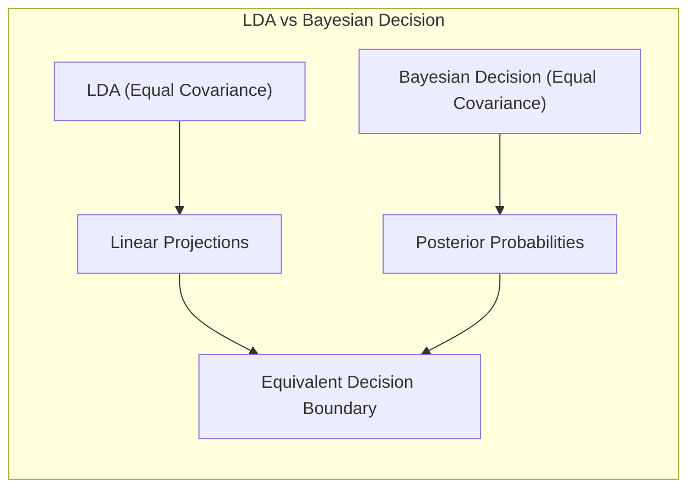

**Lemma 4:** *Equivalência Formal LDA e Decisão Bayesiana*.
Sob as suposições de classes Gaussianas com mesma matriz de covariância, as funções discriminantes lineares do LDA e da Regra de Decisão Bayesiana são equivalentes até uma constante [^7.3], [^7.3.3]. Isso pode ser formalmente demonstrado comparando-se as equações de decisão resultantes de cada abordagem. A função discriminante linear do LDA é dada por:
$$ \delta_k(x) = x^T \Sigma^{-1} \mu_k - \frac{1}{2} \mu_k^T \Sigma^{-1} \mu_k $$
onde $\mu_k$ é a média da classe $k$ e $\Sigma$ é a matriz de covariância compartilhada. Já a regra de decisão Bayesiana calcula a probabilidade *a posteriori*:
$$ p(k|x) \propto p(x|k) p(k) $$
sob a suposição de normalidade, e assumindo $\Sigma$ igual, as duas funções tornam-se lineares e proporcionais. $\blacksquare$
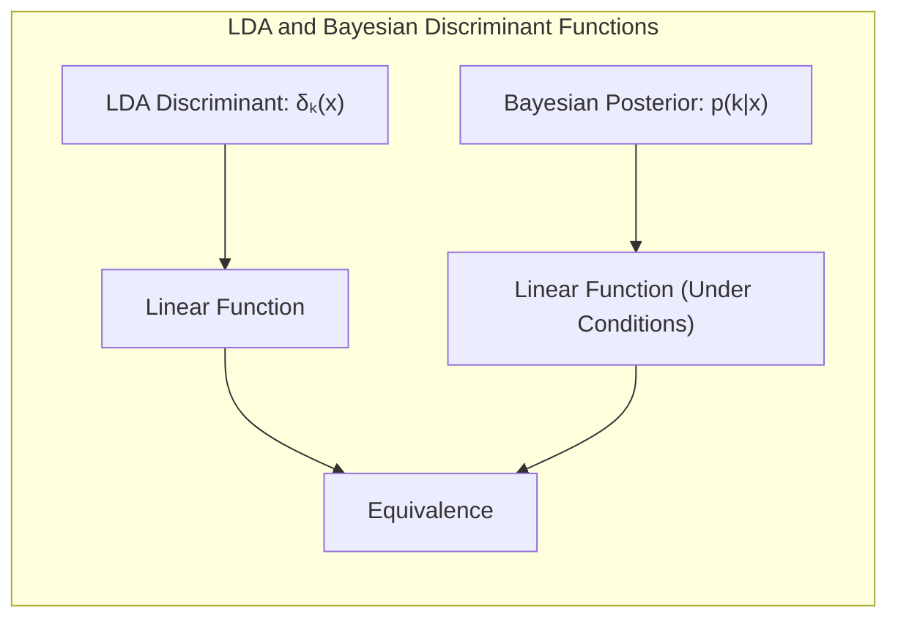

**Corolário 4:** *Fronteiras Quadráticas com Covariâncias Desiguais*.
Ao relaxar a hipótese de covariâncias iguais, as fronteiras de decisão entre classes na regra de decisão Bayesiana tornam-se quadráticas, dando origem a QDA (Quadratic Discriminant Analysis). Isso ocorre porque os termos quadráticos (relativos às matrizes de covariância distintas) não se cancelam mais, e a função discriminante toma uma forma quadrática em $x$. [^7.3].
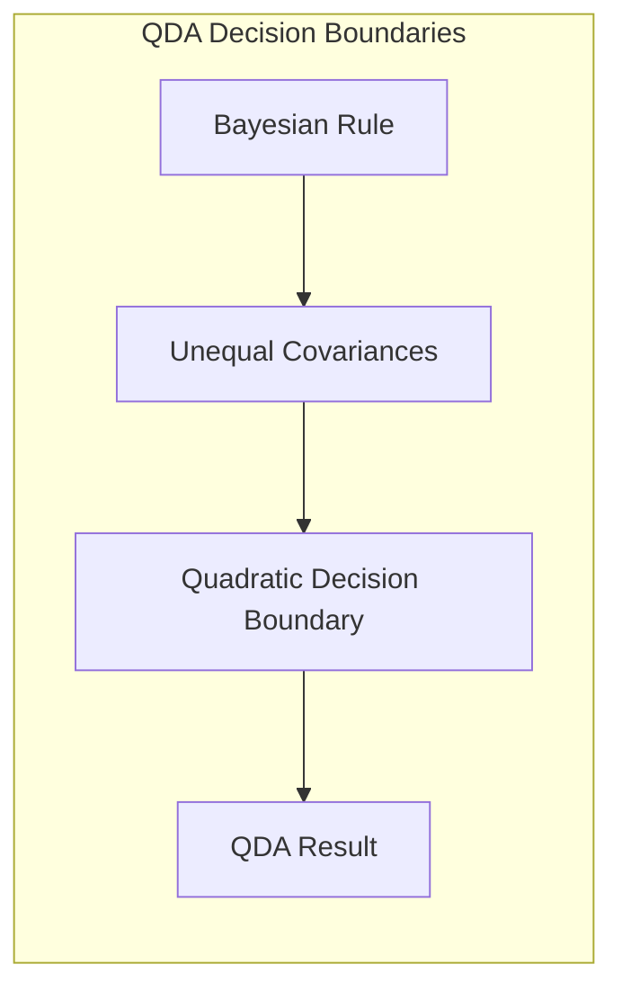

> ⚠️ **Ponto Crucial**: A adoção ou não de covariâncias iguais impacta fortemente o tipo de fronteira de decisão (linear vs. quadrática) [^7.3.1].

### Conclusão
Este capítulo apresentou os conceitos fundamentais de classificação e análise discriminante, explorando o *trade-off* viés-variância e a importância da seleção de modelos, utilizando técnicas como regressão linear, LDA, regularização e hiperplanos separadores. A discussão sobre o otimismo da taxa de erro de treinamento e a avaliação de performance dos modelos, mostrou a necessidade de métodos como validação cruzada e bootstrap para estimar o erro de generalização de forma mais precisa e confiável. Cada seção explorou os detalhes teóricos e matemáticos dos conceitos apresentados, fornecendo uma base sólida para a compreensão e aplicação desses métodos em problemas de classificação complexos.
<!-- END DOCUMENT -->
### Footnotes
[^7.1]: "The generalization performance of a learning method relates to its prediction capability on independent test data. Assessment of this performance is extremely important in practice, since it guides the choice of learning method or model, and gives us a measure of the quality of the ultimately chosen model."
[^7.2]: "Figure 7.1 illustrates the important issue in assessing the ability of a learning method to generalize. Consider first the case of a quantitative or interval scale response. We have a target variable Y, a vector of inputs X, and a prediction model f(X) that has been estimated from a training set T. The loss function for measuring errors between Y and f(X) is denoted by L(Y, f(X)). Typical choices are"
[^7.3]: "As in Chapter 2, if we assume that $Y = f(X) + \epsilon$ where $E(\epsilon) = 0$ and $Var(\epsilon) = \sigma^2$, we can derive an expression for the expected prediction error of a regression fit f(X) at an input point $X = x_0$, using squared-error loss:"
[^7.4]: "The story is similar for a qualitative or categorical response G taking one of K values in a set G, labeled for convenience as 1, 2, ..., K. Typically we model the probabilities $p_k(X) = Pr(G = k|X)$ (or some monotone transformations $f_k(X)$), and then $G(X) = \text{arg max}_k f_k(X)$."
[^7.3.1]: "For the k-nearest-neighbor regression fit, these expressions have the simple form"
[^7.3.3]: "The methods of this chapter approximate the validation step either analytically (AIC, BIC, MDL, SRM) or by efficient sample re-use (cross-validation and the bootstrap). Besides their use in model selection, we also examine to what extent each method provides a reliable estimate of test error of the final chosen model."
[^7.4.4]: "The log-likelihood can be used as a loss-function for general response densities, such as the Poisson, gamma, exponential, log-normal and others. If Pro(Y) is the density of Y, indexed by a parameter $\theta(X)$ that depends on the predictor X, then"
[^7.5]: "In this chapter we describe a number of methods for estimating the expected test error for a model. Typically our model will have a tuning parameter or parameters $\alpha$ and so we can write our predictions as $f_\alpha(x)$. The tuning parameter varies the complexity of our model, and we wish to find the value of $\alpha$ that minimizes error, that is, produces the minimum of the average test error curve in Figure 7.1. Having said this, for brevity we will often suppress the dependence of f(x) on $\alpha$."
[^7.5.1]: "The methods in this chapter are designed for situations where there is insufficient data to split it into three parts. Again it is too difficult to give a general rule on how much training data is enough; among other things, this depends on the signal-to-noise ratio of the underlying function, and the complexity of the models being fit to the data."
[^7.5.2]: "If we are in a data-rich situation, the best approach for both problems is to randomly divide the dataset into three parts: a training set, a validation set, and a test set. The training set is used to fit the models; the validation set is used to estimate prediction error for model selection; the test set is used for assessment of the generalization error of the final chosen model."
[^7.4.3]: "Here the expectation is taken with respect to the distribution of the input variables X. Then we can write the average squared bias as"
[^7.4.5]: "Again, test error here is $Err_t = E[L(G, \hat{G}(X))|T]$, the population misclassification error of the classifier trained on T, and Err is the expected misclassification error."
