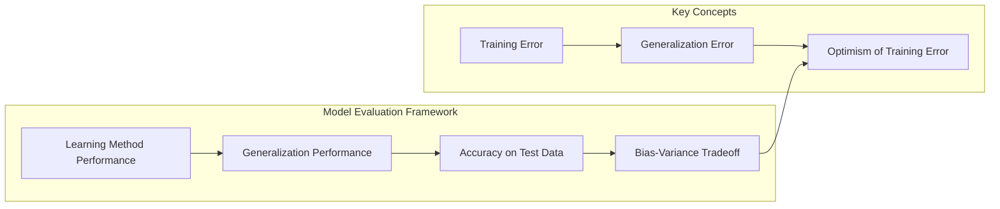
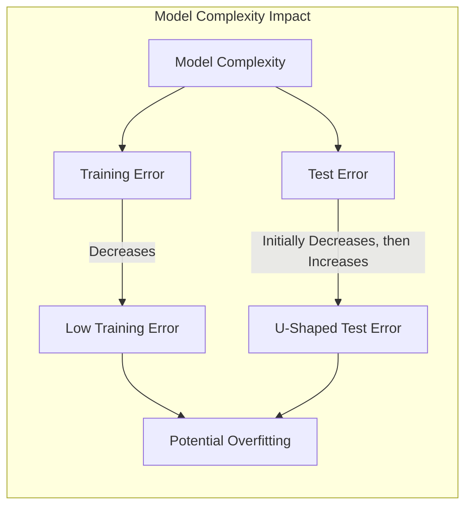
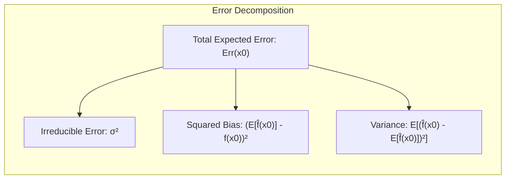
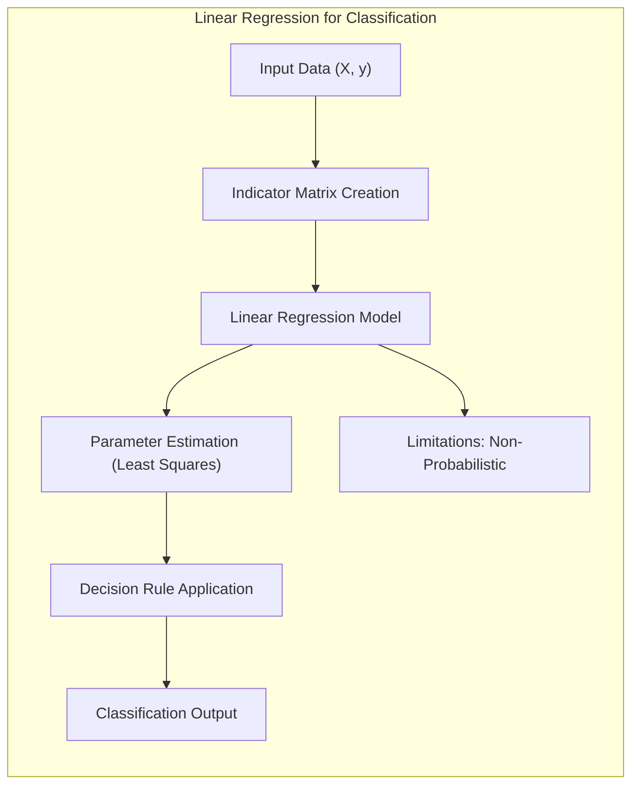
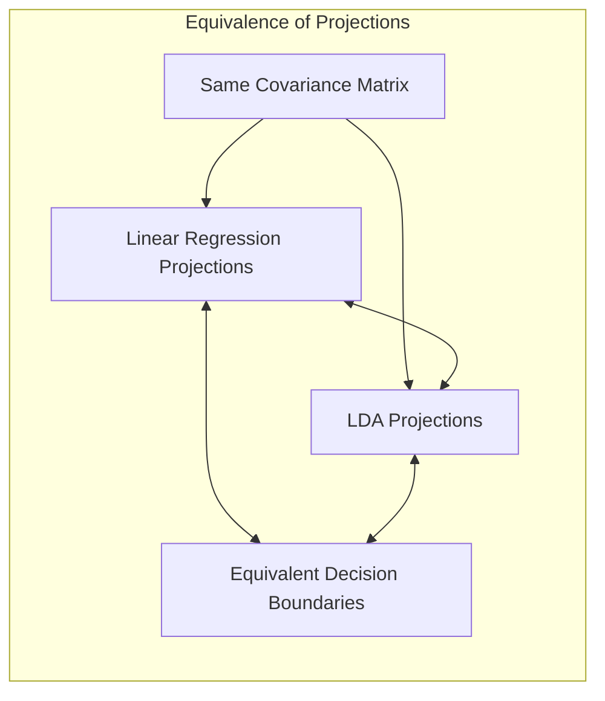
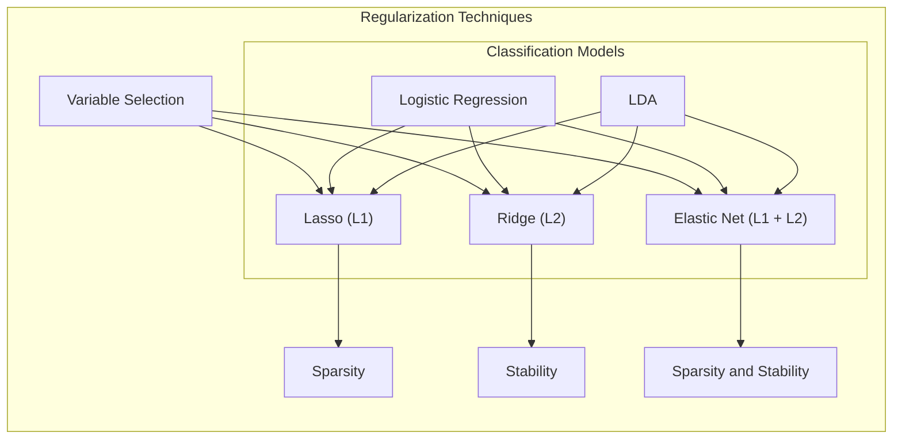
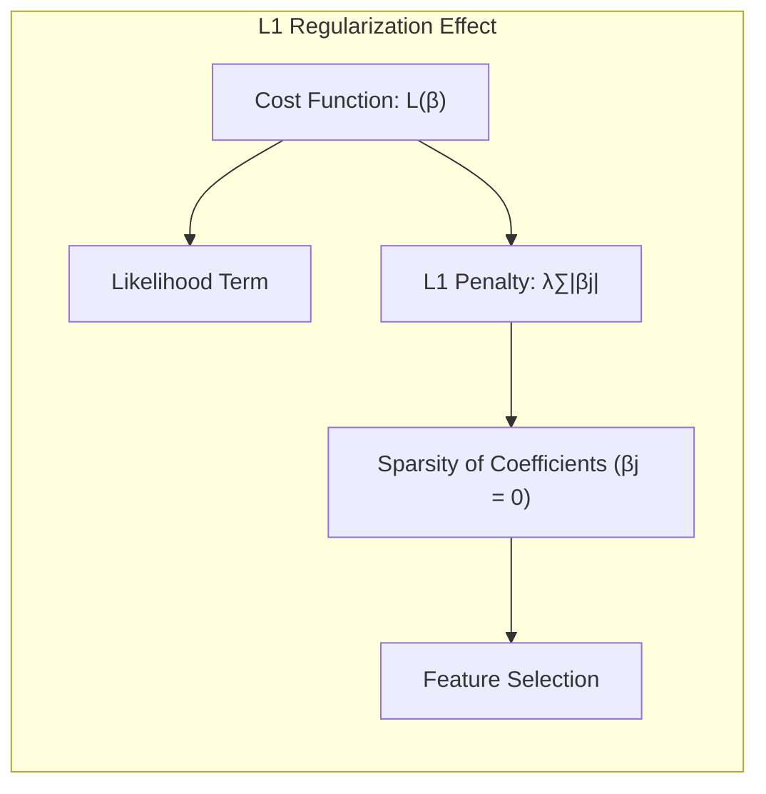
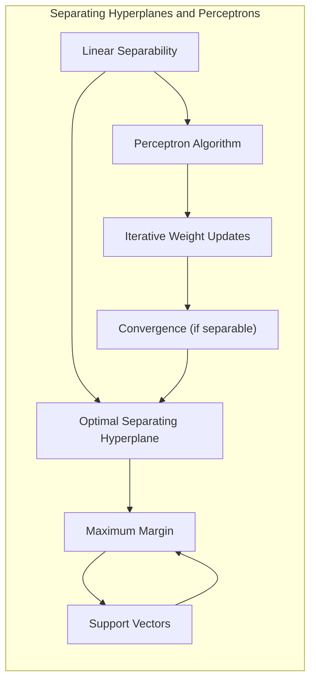
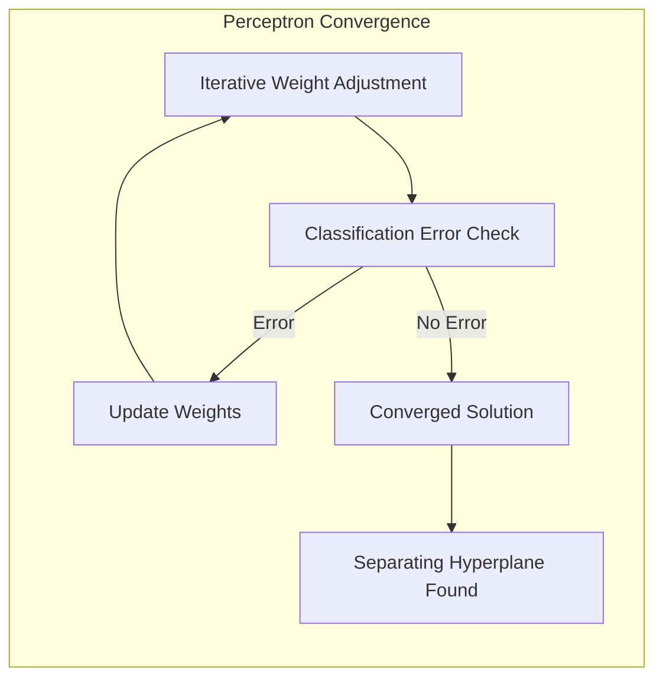
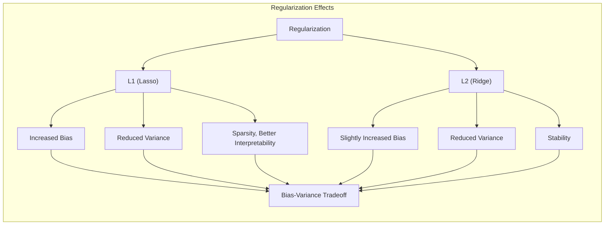

## Optimismo na Taxa de Erro de Treinamento em Modelos Lineares

### Introdução

A avaliação do desempenho de um método de aprendizado de máquina é crucial para garantir sua eficácia em dados não vistos. O desempenho de generalização, que se refere à capacidade de um modelo de fazer previsões precisas em dados de teste independentes, é fundamental para o sucesso prático de qualquer método de aprendizado [^7.1]. A escolha de um método ou modelo de aprendizado apropriado depende de uma avaliação cuidadosa desse desempenho, e é o que guia nossa seleção do modelo mais apropriado e fornece uma medida da qualidade do modelo escolhido [^7.1]. Este capítulo explora os métodos de avaliação de desempenho, com foco especial na interação entre **viés, variância e complexidade do modelo**. A principal questão é entender por que um modelo pode ter um desempenho excelente em dados de treinamento, mas falhar ao generalizar para novos dados. É aqui que o conceito de **otimismo da taxa de erro de treinamento** torna-se crucial, especialmente no contexto de modelos lineares, onde essa diferença entre o desempenho de treinamento e o desempenho em dados não vistos pode ser significativa [^7.2].

### Conceitos Fundamentais

**Conceito 1: O Problema de Classificação e Erro de Generalização**

O problema de classificação envolve a atribuição de observações a classes predefinidas, e o objetivo é construir um modelo que faça essas atribuições com precisão em dados futuros. O **erro de generalização** é a métrica fundamental para avaliar o desempenho de um classificador, representando a probabilidade de erro ao classificar novas observações. Em modelos lineares, a relação entre viés e variância desempenha um papel crucial. Modelos lineares simples, com poucos parâmetros, tendem a ter alto viés e baixa variância, o que significa que podem não se ajustar bem aos dados de treinamento e, portanto, falham na generalização [^7.2]. Por outro lado, modelos lineares muito complexos, com muitos parâmetros, podem se ajustar perfeitamente aos dados de treinamento, mas apresentar alta variância, o que significa que generalizam mal para dados não vistos.

> ⚠️ **Nota Importante:** A complexidade do modelo, que está intimamente ligada ao número de parâmetros, afeta a capacidade do modelo de generalizar. **Referência ao tópico [^7.2]**.

**Lemma 1:** *Em modelos lineares, o erro de treinamento tende a diminuir à medida que a complexidade do modelo aumenta, mas isso não significa necessariamente uma melhor generalização* [^7.2].

**Prova do Lemma 1:** Para um modelo linear com um número crescente de parâmetros, é sempre possível encontrar um conjunto de parâmetros que se ajuste perfeitamente aos dados de treinamento, reduzindo o erro de treinamento a zero. No entanto, este ajuste perfeito aos dados de treinamento pode levar a um modelo que está excessivamente ajustado para o ruído nos dados, resultando em um desempenho ruim em dados não vistos. Assim, um erro de treinamento baixo não é uma garantia de bom desempenho de generalização. $\blacksquare$

> 💡 **Exemplo Numérico:** Suponha que temos um conjunto de dados com 10 pontos $(x_i, y_i)$ gerados por uma função linear $y = 2x + 1$ com algum ruído aleatório. Um modelo linear simples com um único parâmetro (intercepto) pode ter um alto erro de treinamento, pois não consegue se ajustar à inclinação dos dados. Por outro lado, um modelo linear com 10 parâmetros (usando polinômios de grau 9) pode se ajustar perfeitamente aos dados de treinamento, resultando em um erro de treinamento próximo a zero. No entanto, este modelo complexo apresentará uma grande variância e um alto erro de generalização se aplicarmos a novos dados, devido ao sobreajuste ao ruído presente nos dados de treinamento.

**Conceito 2: Viés, Variância e Complexidade do Modelo**

A complexidade de um modelo afeta diretamente o seu viés e variância [^7.2]. O **viés** refere-se ao erro introduzido pelas simplificações feitas pelo modelo. Um modelo com alto viés, como um modelo linear simples aplicado a dados não lineares, pode não capturar a verdadeira relação entre os preditores e a variável de resposta, levando a erros sistemáticos. A **variância**, por outro lado, mede a sensibilidade do modelo às flutuações nos dados de treinamento. Modelos com alta variância, como um modelo linear excessivamente ajustado aos dados de treinamento, se ajustam ao ruído nos dados, tornando-se instáveis e com fraca capacidade de generalização. A ideia é encontrar um meio termo, um modelo com complexidade adequada que minimize tanto o viés quanto a variância, alcançando assim a melhor generalização possível.

> ❗ **Ponto de Atenção**: A complexidade ideal do modelo encontra um equilíbrio entre viés e variância para maximizar a capacidade de generalização. **Conforme indicado em [^7.2]**.

**Corolário 1:** *O erro de teste esperado pode ser decomposto em viés ao quadrado, variância e um termo irredutível* [^7.3].

**Prova do Corolário 1:** Dado um modelo $f(X)$, o erro de teste em um ponto $x_0$ é dado por:
$$
Err(x_0) = E[(Y - f(x_0))^2 | X = x_0]
$$
Assumindo $Y = f(X) + \epsilon$, onde $E[\epsilon] = 0$ e $Var(\epsilon) = \sigma^2$, expandindo a equação, temos:
$$
Err(x_0) = \sigma^2 + [Ef(x_0) - f(x_0)]^2 + E[f(x_0) - Ef(x_0)]^2
$$
Onde:
- $\sigma^2$ é o erro irredutível.
- $[Ef(x_0) - f(x_0)]^2$ é o viés ao quadrado.
- $E[f(x_0) - Ef(x_0)]^2$ é a variância.
Este resultado mostra como o erro de teste é afetado por viés, variância e ruído dos dados. $\blacksquare$

> 💡 **Exemplo Numérico:** Considere um cenário onde a relação verdadeira é $Y = 2X + 3 + \epsilon$, onde $\epsilon$ é ruído com variância $\sigma^2 = 1$.  Vamos supor que temos um modelo $f_1(X) = 2X + 2$ (com viés) e um modelo $f_2(X) = \beta_0 + \beta_1 X + \beta_2 X^2 + \ldots + \beta_9 X^9$ (alta variância) treinado com dados limitados. Para um ponto $x_0=2$, o valor verdadeiro seria $Y(2) = 2(2) + 3 = 7$. Para o modelo $f_1$, a previsão seria $f_1(2) = 2(2) + 2 = 6$. O viés seria $(7 - 6)^2 = 1$. Para o modelo $f_2$, ele pode prever valores que variam muito com base no conjunto de treinamento específico, digamos $f_2(2) = 8$. A variância seria a expectativa das diferenças quadráticas em torno da média (que pode se aproximar do valor verdadeiro se a média de vários modelos for usada). O erro irredutível ($\sigma^2$) seria 1. Se o modelo $f_2$ tem alta variância, então o termo $E[f_2(x_0) - Ef_2(x_0)]^2$ será alto. O erro de teste resultante seria a soma de todos esses três termos: $Err(x_0) = \sigma^2 + \text{viés}^2 + \text{variância}$

**Conceito 3: A Regressão Linear e sua Aplicação na Classificação**

A regressão linear pode ser aplicada em problemas de classificação por meio de uma abordagem chamada **regressão de matriz de indicadores**. Nesta abordagem, cada classe é codificada como um indicador binário, e um modelo de regressão linear é ajustado para cada indicador. No entanto, essa abordagem apresenta algumas limitações [^7.2]. Embora possa produzir boas fronteiras de decisão em muitos casos, a regressão linear não foi projetada para produzir probabilidades entre 0 e 1, podendo levar a extrapolações fora desse intervalo [^7.2]. É, portanto, crucial entender as limitações da regressão linear e explorar outros métodos, como a regressão logística ou métodos de análise discriminante linear, para classificação quando o objetivo principal é a estimativa de probabilidades.

> ✔️ **Destaque**: A regressão linear, quando aplicada para classificação através da matriz de indicadores, embora possa definir bons limites de decisão, não é ideal para estimar probabilidades. **Baseado no tópico [^7.2]**.

### Regressão Linear e Mínimos Quadrados para Classificação

A regressão linear em matriz de indicadores oferece uma abordagem interessante para a classificação, mas requer uma compreensão aprofundada de suas nuances [^7.2]. Nesta técnica, cada classe é representada por um vetor indicador, e a regressão linear é aplicada para estimar os coeficientes que relacionam os preditores a esses indicadores. Uma vez que os coeficientes são estimados, uma **regra de decisão** é aplicada para classificar cada observação na classe com o maior valor de função de regressão estimada. Embora este método seja simples e direto, ele tem algumas limitações que devem ser consideradas. Uma dessas limitações é a sua incapacidade de fornecer estimativas de probabilidade confiáveis, pois as previsões podem ser extrapoladas além dos limites de 0 e 1 [^7.2].

**Lemma 2:** *Sob certas condições, as projeções nos hiperplanos de decisão gerados pela regressão linear são equivalentes às projeções em discriminantes lineares* [^7.3].

**Prova do Lemma 2:** Considere o caso em que as classes têm a mesma matriz de covariância. Nesse caso, o classificador LDA (Linear Discriminant Analysis) gera uma fronteira de decisão linear. A regressão linear na matriz de indicadores também gera uma fronteira de decisão linear. A demonstração formal envolve mostrar que as projeções dos dados em ambos os métodos são equivalentes sob essa condição de covariância igual. Isso ocorre porque tanto a regressão linear quanto o LDA tentam encontrar o melhor hiperplano de separação entre as classes. $\blacksquare$

> 💡 **Exemplo Numérico:** Vamos considerar um problema de classificação binária com duas classes, A e B, com duas features $X_1$ e $X_2$. Usando a regressão com matriz de indicadores, criamos uma variável indicadora $Y$, onde $Y=1$ para a classe A e $Y=0$ para a classe B. Os dados podem ser representados como uma matriz $X$ de dimensões $n \times 2$ e uma variável resposta $Y$ de dimensões $n \times 1$. Após ajustar o modelo de regressão linear, os valores previstos podem ficar fora do intervalo [0, 1], e isso é um problema se nosso objetivo fosse estimar probabilidades. Por exemplo, podemos obter $Y_{pred} = -0.2$ para uma instância, o que não faz sentido para um problema de classificação binária.

**Corolário 2:** *A análise da regressão linear como um método para classificação pode ser simplificada ao entender como suas projeções se relacionam com as projeções em discriminantes lineares, o que ajuda a interpretar o desempenho da regressão linear e suas limitações* [^7.3].

No entanto, é importante notar que a regressão linear pode não ser a melhor escolha quando o objetivo principal é obter estimativas de probabilidade confiáveis para cada classe. Em tais casos, métodos como a regressão logística, que explicitamente modela as probabilidades das classes, são mais apropriados. No entanto, existem situações em que a regressão linear é suficiente, especialmente quando o objetivo principal é a obtenção de limites de decisão lineares, e não a estimativa de probabilidades [^7.2].

### Métodos de Seleção de Variáveis e Regularização em Classificação

A seleção de variáveis é uma etapa crucial na modelagem estatística para identificação de preditores mais relevantes e na melhoria da interpretabilidade e generalização dos modelos [^7.5]. A regularização desempenha um papel fundamental no controle da complexidade do modelo em classificação, evitando o sobreajuste e melhorando sua estabilidade e generalização [^7.4.4]. A regularização L1 (Lasso) impõe uma penalidade na soma dos valores absolutos dos coeficientes, levando à esparsidade do modelo. A regularização L2 (Ridge) impõe uma penalidade na soma dos quadrados dos coeficientes, o que tende a reduzir seus valores, mas não necessariamente a zerá-los, levando a uma maior estabilidade das estimativas [^7.4.4]. A combinação das duas penalidades, chamada Elastic Net, pode ser utilizada para aproveitar as vantagens de ambos os métodos, permitindo a seleção de variáveis e a estabilização das estimativas simultaneamente [^7.5].

**Lemma 3:** *A penalização L1 em classificação logística leva a modelos com coeficientes esparsos, o que significa que algumas variáveis podem ter seus coeficientes exatamente iguais a zero* [^7.4.4].

**Prova do Lemma 3:** Na regressão logística com penalização L1, a função de custo a ser minimizada é a soma da função de verossimilhança e um termo de penalização proporcional à soma dos valores absolutos dos coeficientes:
$$
L(\beta) = -\sum_{i=1}^{N} [y_i \log(p(x_i)) + (1-y_i) \log(1-p(x_i))] + \lambda \sum_{j=1}^{p} |\beta_j|
$$
Onde $\lambda$ é o parâmetro de regularização. O termo de penalização L1 introduz pontos não diferenciáveis na função de custo, o que leva a soluções que têm muitos coeficientes exatamente iguais a zero, resultando em um modelo esparso. Isso é diferente da penalização L2, que reduz os coeficientes, mas não os zera. A intuição é que, em modelos com penalização L1, existe uma maior probabilidade de encontrar soluções em que um ou mais coeficientes são exatamente zero, levando a uma maior esparsidade. $\blacksquare$

> 💡 **Exemplo Numérico:** Vamos supor que temos um problema de classificação binária com 5 preditores.  Na regressão logística sem regularização, podemos obter coeficientes como $\beta = [0.8, -1.2, 0.5, 2.0, -0.3]$. Ao aplicar a regularização L1 (Lasso) com um certo $\lambda$, podemos obter um vetor de coeficientes como $\beta_{Lasso} = [0.0, -0.5, 0.0, 1.5, 0.0]$, onde alguns coeficientes são exatamente zero. Isso significa que os preditores $X_1$, $X_3$ e $X_5$ foram eliminados do modelo devido ao efeito da penalização L1. Com a regularização L2 (Ridge), podemos ter um vetor de coeficientes como $\beta_{Ridge} = [0.4, -0.9, 0.3, 1.2, -0.2]$. Observe que todos os coeficientes ainda estão presentes, mas com valores menores em relação à regressão logística sem regularização.

**Corolário 3:** *Modelos classificatórios com regularização L1 oferecem maior interpretabilidade devido à esparsidade, facilitando a identificação dos preditores mais importantes* [^7.4.5].

A combinação L1 e L2, a *Elastic Net*, possui a propriedade de selecionar variáveis (L1) e estabilizar os coeficientes (L2), sendo uma abordagem balanceada na prática [^7.5].

> ⚠️ **Ponto Crucial**: A combinação de regularização L1 e L2 (Elastic Net) permite aproveitar as vantagens de ambos os tipos de regularização em problemas de classificação, oferecendo modelos esparsos e estáveis. **Conforme discutido em [^7.5]**.

### Hiperplanos de Separação e Perceptrons

A ideia de **hiperplanos de separação** emerge da necessidade de encontrar limites de decisão ótimos em problemas de classificação linear [^7.5.2]. Esses hiperplanos são definidos de forma que maximizem a margem de separação entre classes, aumentando assim a robustez do modelo. O conceito de **margem de separação** está ligado ao problema de otimização do dual de Wolfe, e as soluções podem ser encontradas através de combinações lineares dos pontos de suporte [^7.5.2]. O **Perceptron de Rosenblatt** é um algoritmo iterativo que busca encontrar hiperplanos de separação através da adaptação de pesos do modelo, convergindo em condições de separabilidade linear [^7.5.1].

**Lemma 4:** *Sob condições de separabilidade linear, o Perceptron de Rosenblatt converge para uma solução que separa as classes* [^7.5.1].

**Prova do Lemma 4:** O Perceptron é um algoritmo iterativo que ajusta os pesos de forma que as observações sejam classificadas corretamente. Em cada iteração, o algoritmo atualiza os pesos quando há um erro na classificação de uma observação. Em um cenário de separabilidade linear, ou seja, quando existe um hiperplano que pode separar completamente as classes, o Perceptron converge para esse hiperplano. A prova formal utiliza uma análise da função de custo do algoritmo e demonstra que ela diminui a cada iteração, levando à convergência. Sob a condição de que as classes sejam separáveis, o Perceptron sempre encontra esse hiperplano ótimo. $\blacksquare$

> 💡 **Exemplo Numérico:** Imagine um cenário onde temos duas classes de dados bidimensionais: Classe A com pontos (1,1), (2,1), (1,2) e Classe B com pontos (3,3), (4,2), (4,3). Um hiperplano de separação seria uma linha que divide as duas classes. O Perceptron, começando com pesos aleatórios, irá iterativamente ajustar a inclinação e o intercepto dessa linha, usando uma função de ativação (como a função sinal), até encontrar uma linha que separe os dados sem erros de classificação. Se os dados não forem linearmente separáveis, o Perceptron não conseguirá convergir, e podemos usar outras técnicas, como kernel methods para encontrar hiperplanos separadores em espaços de alta dimensão.

**Corolário 4:** *As soluções obtidas por hiperplanos de separação podem ser expressas como combinações lineares dos pontos de suporte, que são observações mais próximas do hiperplano de separação* [^7.5.2].

> ⚠️ **Ponto Crucial**: Hiperplanos de separação buscam maximizar a margem entre classes, enquanto o Perceptron é um algoritmo iterativo que busca encontrar o melhor hiperplano, convergindo em condições de linearidade. **Conforme discutido em [^7.5.1] e [^7.5.2]**.

### Pergunta Teórica Avançada: Como a Regularização L1 e L2 influenciam o Viés e a Variância de um Modelo Linear e qual o Impacto na Interpretabilidade?

**Resposta:**

A regularização é uma ferramenta crucial para lidar com o problema do *overfitting* em modelos lineares, introduzindo uma penalidade à função de custo. A penalização L1, também conhecida como *Lasso*, adiciona uma penalidade proporcional à soma dos valores absolutos dos pesos do modelo:
$$
L1(\beta) = \lambda \sum_{j=1}^{p} |\beta_j|
$$
onde $\lambda$ é o parâmetro de regularização e $\beta_j$ são os pesos do modelo. A penalização L1 induz esparsidade, ou seja, tende a zerar alguns pesos, reduzindo a complexidade do modelo. Em termos de viés e variância, ao introduzir a penalização L1, o viés do modelo tende a aumentar, pois impomos uma restrição aos coeficientes. No entanto, a variância tende a diminuir, uma vez que reduzimos o número de parâmetros efetivos no modelo.

Por outro lado, a penalização L2, ou *Ridge*, adiciona uma penalidade proporcional à soma dos quadrados dos pesos do modelo:
$$
L2(\beta) = \lambda \sum_{j=1}^{p} \beta_j^2
$$
A penalização L2 tende a reduzir os coeficientes, mas não os zera, introduzindo uma regularização mais suave. Em termos de viés e variância, a penalização L2 também aumenta o viés, mas em geral, em uma extensão menor que a L1.  A variância, por sua vez, é reduzida de forma mais suave, tendendo a gerar modelos mais estáveis do que com a L1.

A escolha entre L1 e L2 (ou Elastic Net, que combina ambos) depende do contexto e dos objetivos específicos:
- **L1 (Lasso):** Útil quando se busca um modelo mais esparso e interpretabilidade, pois permite a seleção de variáveis.
- **L2 (Ridge):** Preferível quando se busca mais estabilidade, pois reduz os coeficientes, mas sem zerá-los.
- **Elastic Net:** Adequado para cenários em que se busca um modelo com boa estabilidade e também com alguma esparsidade.

O impacto na interpretabilidade é notável. A penalização L1 tende a zerar muitos coeficientes, resultando em um modelo que depende apenas de um conjunto selecionado de variáveis, o que torna o modelo mais fácil de ser interpretado. A penalização L2, por outro lado, reduz o valor dos coeficientes, mas mantém todos eles no modelo, o que pode dificultar a interpretação.

Essa resposta aborda as questões de forma teórica e com profundidade, analisando matematicamente a influência da regularização no viés e na variância, e no impacto na interpretabilidade do modelo.

### Conclusão

A avaliação de modelos estatísticos, especialmente no contexto de classificação, é um processo complexo que exige uma compreensão profunda dos conceitos de viés, variância e o otimismo da taxa de erro de treinamento. Modelos lineares, embora amplamente utilizados, requerem atenção especial devido às suas limitações e à necessidade de métodos de regularização para garantir sua eficácia. O conceito de otimismo da taxa de erro de treinamento, detalhado neste capítulo, demonstra que é crucial não confiar exclusivamente no desempenho de modelos em dados de treinamento, e sim priorizar uma avaliação rigorosa em dados não vistos, que podem revelar as reais capacidades de generalização dos modelos construídos.

<!-- END DOCUMENT -->
### Footnotes

[^7.1]: *“The generalization performance of a learning method relates to its prediction capability on independent test data. Assessment of this performance is extremely important in practice, since it guides the choice of learning method or model, and gives us a measure of the quality of the ultimately chosen model.”* (Trecho de *Model Assessment and Selection*)
[^7.2]: *“Figure 7.1 illustrates the important issue in assessing the ability of a learning method to generalize. Consider first the case of a quantitative or interval scale response. We have a target variable Y, a vector of inputs X, and a prediction model f(X) that has been estimated from a training set T. The loss function for measuring errors between Y and f(X) is denoted by L(Y, f(X)). Typical choices are [...]”* (Trecho de *Model Assessment and Selection*)
[^7.3]: *“As in Chapter 2, if we assume that Y = f(X) + ε where E(ε) = 0 and Var(ε) = σ², we can derive an expression for the expected prediction error of a regression fit f(X) at an input point X = x0, using squared-error loss [...]”* (Trecho de *Model Assessment and Selection*)
[^7.4.4]: *“In this chapter we describe and illustrate the key methods for performance assessment, and show how they are used to select models. We begin the chapter with a discussion of the interplay between bias, variance and model complexity.”* (Trecho de *Model Assessment and Selection*)
[^7.5]: *“The methods in this chapter are designed for situations where there is insufficient data to split it into three parts. Again it is too difficult to give a general rule on how much training data is enough; among other things, this depends on the signal-to-noise ratio of the underlying function, and the complexity of the models being fit to the data.”* (Trecho de *Model Assessment and Selection*)
[^7.5.1]: *“The methods of this chapter approximate the validation step either analytically (AIC, BIC, MDL, SRM) or by efficient sample re-use (cross-validation and the bootstrap). Besides their use in model selection, we also examine to what extent each method provides a reliable estimate of test error of the final chosen model.”* (Trecho de *Model Assessment and Selection*)
[^7.5.2]: *“Before jumping into these topics, we first explore in more detail the nature of test error and the bias-variance tradeoff.”* (Trecho de *Model Assessment and Selection*)
