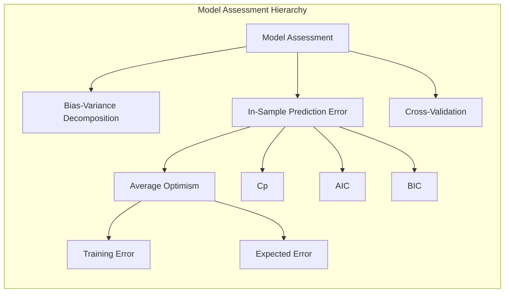
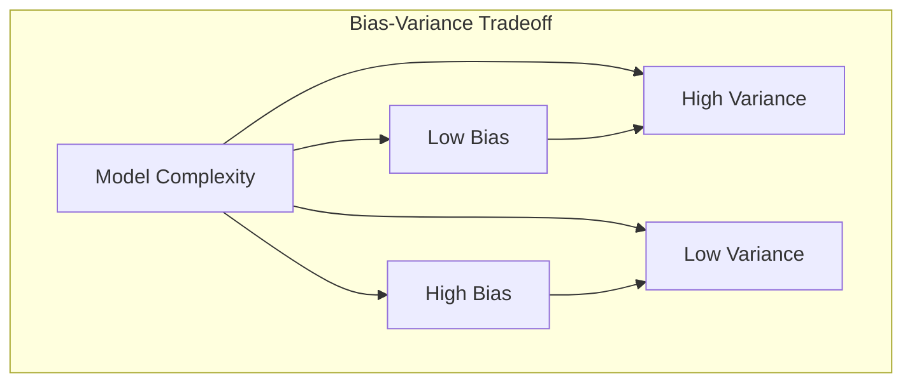
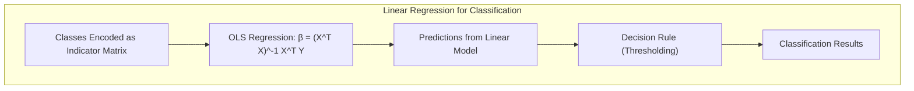
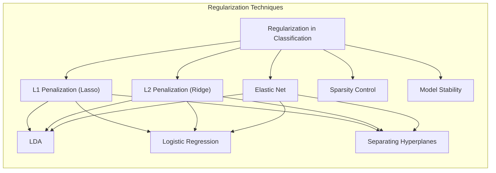
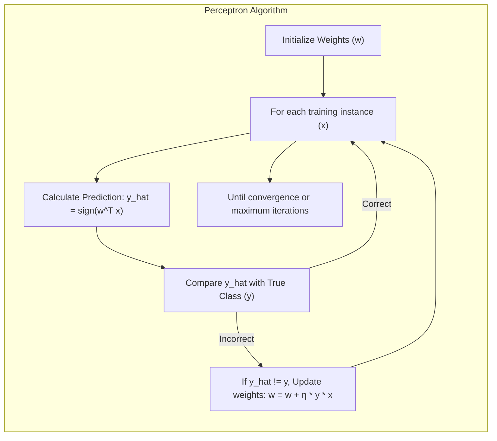
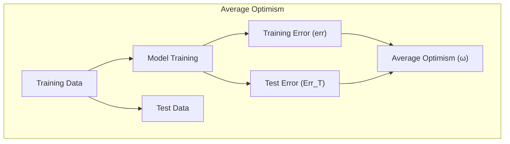
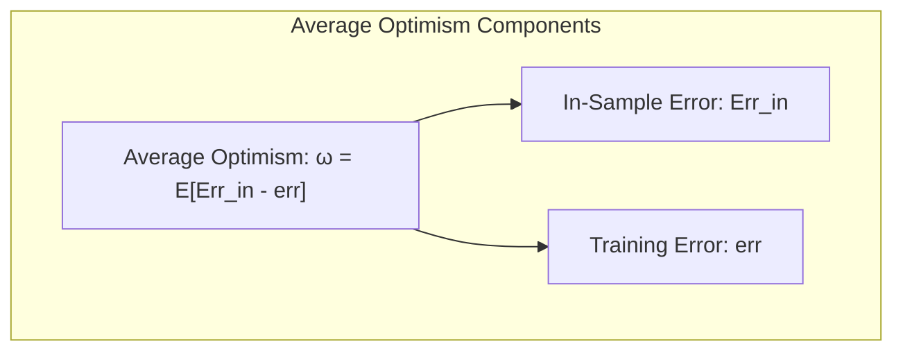
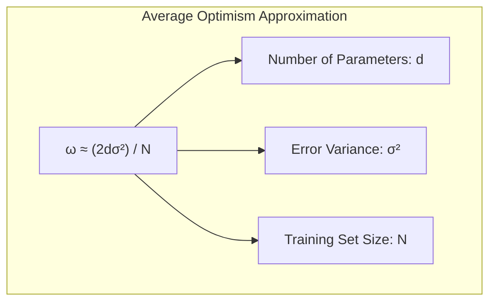

## Average Optimism in Model Assessment and Selection



### Introdução

A avaliação do desempenho de um modelo de aprendizado é crucial para garantir sua capacidade de generalização para dados não vistos. A escolha de um método de aprendizado ou modelo é guiada pela necessidade de uma avaliação precisa, e essa avaliação nos fornece uma medida da qualidade do modelo escolhido [^7.1]. Este capítulo se concentra nos métodos fundamentais para avaliação de desempenho e seleção de modelos, com uma ênfase particular na interação entre **bias, variance e complexidade do modelo**. O **average optimism**, um conceito central na estimação do erro de predição, será nosso ponto de foco principal. Entender esse conceito é fundamental para selecionar e avaliar modelos de forma eficaz.

### Conceitos Fundamentais

**Conceito 1: O Problema de Classificação e a Generalização**

O problema de classificação envolve atribuir uma instância de dados a uma entre um conjunto predefinido de classes. Para isso, modelos de aprendizado são treinados em um conjunto de dados e espera-se que generalizem bem para novos dados. A capacidade de generalização é medida pela performance do modelo em dados de teste independentes do conjunto de treinamento [^7.1]. Métodos lineares, como a **Linear Discriminant Analysis (LDA)** e a **Logistic Regression**, oferecem abordagens para esse problema [^4.3] e [^4.4]. No entanto, a escolha de um modelo com **complexidade adequada** é fundamental: modelos excessivamente complexos (com alta variância) tendem a se ajustar ao ruído nos dados de treinamento (overfitting), enquanto modelos simplistas (com alto viés) não capturam a estrutura subjacente dos dados (underfitting) [^7.2].



**Lemma 1:** *Relação entre a complexidade do modelo e o trade-off bias-variance.*
Um modelo com alta complexidade possui baixa bias, mas alta variance e vice-versa. Para modelos lineares, a complexidade é determinada pelo número de parâmetros, como na regressão linear [^7.2]. Formalmente, o erro de predição esperado, $Err(x_0)$, pode ser decomposto como:

$$Err(x_0) = \sigma^2 + Bias^2(f(x_0)) + Var(f(x_0))$$

onde $\sigma^2$ é a variância do ruído inerente aos dados, $Bias^2(f(x_0))$ é o quadrado do viés do modelo e $Var(f(x_0))$ é a variância da predição do modelo. Este lemma ilustra o trade-off entre bias e variance, demonstrando que o objetivo é encontrar um nível de complexidade que minimize o erro total [^7.3]. $\blacksquare$

> 💡 **Exemplo Numérico:**
> Considere um modelo de regressão linear simples com uma única variável preditora ($x$) e uma variável resposta ($y$).
> Suponha que a relação verdadeira seja $y = 2x + 3 + \epsilon$, onde $\epsilon \sim \mathcal{N}(0, 1)$ (ruído com média 0 e variância 1).
>
> **Modelo 1 (Subajuste - Alto Bias):** $\hat{y} = 4$ (uma constante). Este modelo não leva em conta a relação com $x$, tendo um viés alto.
>   -  Se $x=2$, o valor real de $y$ seria, em média, $2*2 + 3 = 7$, enquanto o modelo prediz $4$,  mostrando o viés.
>
> **Modelo 2 (Ajuste Adequado):** $\hat{y} = 2x + 3$. Este modelo captura a relação verdadeira, resultando em baixo viés e baixa variância.
>   - Se $x=2$,  o modelo prediz $2*2+3=7$, o valor médio esperado para essa instância, indicando baixo viés.
>
> **Modelo 3 (Sobreajuste - Alta Variância):** $\hat{y} = 1.5x^2 + 2.5x + 3.1$. Este modelo é mais complexo, e embora possa se ajustar bem aos dados de treinamento, é altamente sensível a ruídos e terá uma variância alta.
>   - Se um novo ponto $x=2.1$ for usado, o modelo poderia dar uma previsão muito diferente da real, mostrando a alta variância.
>
>  O modelo ideal seria o **Modelo 2** que minimiza o erro total.

**Conceito 2: Linear Discriminant Analysis (LDA)**

A Linear Discriminant Analysis (LDA) é um método de classificação que busca encontrar combinações lineares das variáveis preditoras para separar as classes. A LDA pressupõe que as classes possuem distribuições Gaussianas com a mesma matriz de covariância [^4.3]. A fronteira de decisão é linear, definida pela projeção dos dados em um subespaço que maximiza a separação entre as médias das classes e minimiza a variância dentro das classes [^4.3.1]. A análise discriminante regularizada (RDA) surge como uma extensão da LDA para melhorar a performance, especialmente em situações com muitas variáveis preditoras ou covariâncias diferentes entre as classes.


**Corolário 1:** *Conexão entre LDA e regressão de matrizes indicadoras*.
Em situações com duas classes, a LDA pode ser vista como uma projeção dos dados em um espaço unidimensional, onde o limiar de decisão é determinado pela média ponderada das classes. Analogamente, a regressão linear de uma matriz indicadora de classe em duas categorias, quando aplicada para predizer a classe, conduz a uma fronteira de decisão linear similar, demonstrando a relação entre as abordagens [^4.2], [^4.3]. No entanto, para múltiplas classes, a interpretação e aplicação da regressão de indicadoras podem se tornar mais complexas. $\blacksquare$

> 💡 **Exemplo Numérico:**
>
> Suponha duas classes, A e B, com as seguintes médias e covariâncias (simplificadas para 1 dimensão):
>
> - Classe A: $\mu_A = 2$, $\sigma^2_A = 1$
> - Classe B: $\mu_B = 5$, $\sigma^2_B = 1$
>
> A LDA procuraria o ponto no eixo $x$ onde as classes são melhor separadas. A fronteira de decisão seria aproximadamente na média entre as médias, ou seja, em $(2+5)/2 = 3.5$. Pontos menores que 3.5 seriam classificados como A, e maiores como B.
>
> Em termos de regressão de indicadores, poderíamos codificar a classe A como 0 e a classe B como 1 e executar a regressão linear. A regressão linear resultaria em um limiar semelhante para separar as classes. Embora a escala seja diferente (valores podem não estar entre 0 e 1), a fronteira de decisão seria similar à da LDA.
> ```python
> import numpy as np
> from sklearn.discriminant_analysis import LinearDiscriminantAnalysis
>
> # Dados de exemplo simplificados (1D)
> X = np.array([[1.2], [1.8], [2.5], [4.5], [5.1], [5.8]])
> y = np.array([0, 0, 0, 1, 1, 1]) # Classe A=0, Classe B=1
>
> # LDA
> lda = LinearDiscriminantAnalysis()
> lda.fit(X, y)
> print(f"LDA Threshold: {lda.means_.mean()}")
>
> # Regressão linear para classificação (simplificado)
> X_with_intercept = np.c_[np.ones(X.shape[0]), X]
> beta = np.linalg.inv(X_with_intercept.T @ X_with_intercept) @ X_with_intercept.T @ y
> threshold_reg = (0.5 - beta[0])/beta[1]
> print(f"Regression Threshold: {threshold_reg}")
> ```

**Conceito 3: Logistic Regression**

A Logistic Regression é outro método linear de classificação, que modela a probabilidade de uma instância pertencer a uma classe usando a função sigmoide (ou logit) [^4.4]. O modelo ajusta os coeficientes de forma a maximizar a verossimilhança dos dados observados [^4.4.1]. Ao contrário da LDA, que impõe uma distribuição gaussiana, a regressão logística usa a distribuição Bernoulli para a variável de resposta [^4.4.2]. A regressão logística é frequentemente usada por sua capacidade de fornecer probabilidades, além da simples classificação [^4.4.5]. Apesar de ambos gerarem fronteiras de decisão lineares, a escolha entre LDA e regressão logística depende das características dos dados e da natureza do problema [^4.4.4].


> ⚠️ **Nota Importante**: A escolha entre LDA e regressão logística depende das suposições sobre os dados e do objetivo. A LDA assume normalidade e covariância homogênea, enquanto a regressão logística é mais flexível [^4.4].

> ❗ **Ponto de Atenção**: Em situações com classes não balanceadas, tanto a LDA quanto a regressão logística podem apresentar desafios, e técnicas como reponderação das classes ou downsampling podem ser necessárias [^4.4.2].

> ✔️ **Destaque**: Os coeficientes estimados na LDA e na regressão logística estão correlacionados, especialmente em problemas com duas classes, embora as abordagens de otimização sejam diferentes [^4.5].

### Regressão Linear e Mínimos Quadrados para Classificação



A regressão linear pode ser aplicada para problemas de classificação por meio da regressão de uma matriz indicadora, onde cada coluna representa uma classe diferente [^4.2]. Cada observação é codificada com 1 na coluna correspondente à sua classe e 0 nas demais. Essa abordagem transforma o problema de classificação em um problema de regressão, onde os coeficientes da regressão linear determinam a fronteira de decisão. No entanto, a regressão linear diretamente na matriz indicadora apresenta algumas limitações, como a possibilidade de gerar predições fora do intervalo [0,1], dificultando a interpretação como probabilidades [^4.2].

A solução de mínimos quadrados é utilizada para estimar os coeficientes da regressão, minimizando a soma dos quadrados dos erros. Formalmente, dado um conjunto de dados $(X, Y)$, onde $Y$ é uma matriz indicadora e $X$ é a matriz de preditores, os coeficientes $\beta$ são estimados por:

$$\beta = (X^TX)^{-1}X^TY$$

A aplicação da regra de decisão é feita atribuindo cada observação à classe correspondente à coluna de $Y$ com o valor previsto mais alto [^4.2]. Apesar de sua simplicidade, a regressão de indicadores pode ser menos eficiente que outros métodos probabilísticos, como a regressão logística, em situações onde a probabilidade de pertinência à classe é necessária.

**Lemma 2:** *Condições de equivalência entre regressão linear e discriminantes lineares.*
Sob certas condições, as projeções em hiperplanos de decisão gerados por regressão linear e discriminantes lineares podem ser equivalentes. Especificamente, se as classes possuem distribuições Gaussianas com a mesma matriz de covariância e, o problema de regressão linear que busca minimizar o erro quadrático se aproxima da solução do problema de análise discriminante linear [^4.3]. Esta equivalência se manifesta especialmente em problemas com duas classes, onde a fronteira de decisão tem uma forma analítica semelhante. $\blacksquare$

**Corolário 2:** *A simplificação da análise em problemas de duas classes*.
Quando o objetivo principal é obter a fronteira de decisão, e não uma probabilidade de classe, a regressão de indicadores pode ser suficiente e até vantajosa em problemas de duas classes. Este corolário simplifica a análise ao mostrar que, em contextos específicos, a regressão de indicadores pode ser uma alternativa eficiente para a LDA. $\blacksquare$

> 💡 **Exemplo Numérico:**
>
> Considere um problema de classificação com duas classes (0 e 1) e uma única variável preditora ($x$). Temos os seguintes dados:
>
> | Instância | x   | Classe (y) |
> | :-------- | --- | :--------- |
> | 1         | 1   | 0          |
> | 2         | 2   | 0          |
> | 3         | 3   | 1          |
> | 4         | 4   | 1          |
>
> Podemos representar $y$ como um vetor: $Y = \begin{bmatrix} 0 \\ 0 \\ 1 \\ 1 \end{bmatrix}$. A matriz $X$ com um intercepto (coluna de 1s) ficaria:
>
> $X = \begin{bmatrix} 1 & 1 \\ 1 & 2 \\ 1 & 3 \\ 1 & 4 \end{bmatrix}$.
>
> Agora calculamos $\beta = (X^TX)^{-1}X^TY$:
>
> $\text{Step 1: } X^TX = \begin{bmatrix} 4 & 10 \\ 10 & 30 \end{bmatrix}$
>
> $\text{Step 2: } (X^TX)^{-1} = \begin{bmatrix} 1.5 & -0.5 \\ -0.5 & 0.2 \end{bmatrix}$
>
> $\text{Step 3: } X^TY = \begin{bmatrix} 2 \\ 7 \end{bmatrix}$
>
> $\text{Step 4: } \beta = \begin{bmatrix} 1.5 & -0.5 \\ -0.5 & 0.2 \end{bmatrix} \begin{bmatrix} 2 \\ 7 \end{bmatrix} = \begin{bmatrix} -0.5 \\ 0.4 \end{bmatrix}$
>
> Então o modelo de regressão linear seria $\hat{y} = -0.5 + 0.4x$. Para classificar, usamos um limiar (ex: 0.5): se $\hat{y} \geq 0.5$, classificar como 1, caso contrário, como 0.
>
>   - Para $x=1$, $\hat{y} = -0.1$, classificado como 0.
>   - Para $x=3$, $\hat{y} = 0.7$, classificado como 1.
>
>   ```python
>   import numpy as np
>
>   # Dados de exemplo
>   X = np.array([[1], [2], [3], [4]])
>   Y = np.array([0, 0, 1, 1])
>
>   # Adicionando intercepto
>   X = np.c_[np.ones(X.shape[0]), X]
>
>   # Calculando beta (usando numpy)
>   beta = np.linalg.inv(X.T @ X) @ X.T @ Y
>   print("Beta coefficients:", beta)
>
>   # Predição e classificação
>   def predict(x, beta):
>       y_hat = beta[0] + beta[1] * x
>       return 1 if y_hat >= 0.5 else 0
>
>   print("Prediction for x=1:", predict(1, beta))
>   print("Prediction for x=3:", predict(3, beta))
>   ```

Em alguns casos, a regressão logística pode ser mais adequada devido a sua capacidade de modelar probabilidades, evitando extrapolações fora do intervalo [0,1] [^4.4]. No entanto, quando o foco principal é a fronteira de decisão, a regressão de indicadores pode ser suficiente [^4.2].

### Métodos de Seleção de Variáveis e Regularização em Classificação



A seleção de variáveis e a regularização são técnicas cruciais para melhorar o desempenho e a interpretabilidade dos modelos de classificação, especialmente quando o número de preditores é elevado. Regularização, como a penalização L1 (Lasso) e L2 (Ridge), são usadas para controlar a complexidade do modelo, evitando o overfitting e aumentando a robustez [^4.4.4]. A penalização L1 induz a esparsidade nos coeficientes, levando a modelos mais simples e interpretáveis [^4.5]. Já a penalização L2 reduz a magnitude dos coeficientes, tornando-os menos sensíveis a outliers [^4.4.4].

Na regressão logística, a regularização pode ser aplicada através da modificação da função de custo, adicionando termos de penalização à função de verossimilhança. Por exemplo, a regressão logística com penalização L1 pode ser expressa como:

$$J(\beta) = - \sum_{i=1}^{N} [y_i \log(p_i) + (1-y_i)\log(1-p_i)] + \lambda \|\beta\|_1$$

onde $\lambda$ controla a intensidade da penalização L1, e $p_i$ é a probabilidade estimada da classe para a observação $i$ [^4.4.4].

**Lemma 3:** *A penalização L1 leva à esparsidade*.
Em modelos lineares, a penalização L1 tende a zerar alguns coeficientes, levando a um modelo esparso. Isto ocorre pois, em geral, o L1-norm, $\|\beta\|_1 = \sum_j |\beta_j|$, produz uma solução com mais zeros que o L2-norm (Ridge regression) [^4.4.4]. Este é um resultado fundamental em otimização convexa, que pode ser demonstrado por análises geométricas e de condições de otimalidade. $\blacksquare$

**Prova do Lemma 3:**
A prova do lemma 3 envolve a análise da função de custo com a penalidade L1. A penalidade L1, $\|\beta\|_1$, é não-diferenciável em $\beta=0$, o que leva a soluções esparsas. Quando há uma solução ótima com um coeficiente $\beta_j=0$, o gradiente da função de custo com relação a $\beta_j$, não necessariamente será zero; em vez disso, seu valor absoluto deve ser menor que a penalidade $\lambda$ [^4.4.3]. Esse comportamento promove a esparsidade. $\blacksquare$

> 💡 **Exemplo Numérico:**
>
> Considere um modelo de regressão logística com dois preditores, $x_1$ e $x_2$, e um termo de intercepto. A função de custo é:
>
> $J(\beta) = - \sum_{i=1}^{N} [y_i \log(p_i) + (1-y_i)\log(1-p_i)] + \lambda (|\beta_1| + |\beta_2|)$
>
> Suponha que, sem regularização ($\lambda = 0$), os coeficientes ótimos sejam $\beta_0 = 0.5$, $\beta_1 = 2$ e $\beta_2 = -1.5$.
>
> Agora, com a regularização L1 ($\lambda = 1.0$), o modelo irá tentar minimizar a função de custo, enquanto também penaliza os coeficientes altos. A solução resultante pode ser $\beta_0 = 0.6$, $\beta_1 = 1.2$ e $\beta_2 = 0$. O coeficiente $\beta_2$ foi zerado devido à penalização L1, resultando em um modelo mais esparso.
>
> ```python
> import numpy as np
> from sklearn.linear_model import LogisticRegression
> from sklearn.preprocessing import StandardScaler
>
> # Dados de exemplo
> X = np.array([[1, 2], [2, 1], [3, 3], [4, 2], [2, 3], [3, 1]])
> y = np.array([0, 0, 1, 1, 0, 1])
>
> # Normalizando os dados para melhor performance
> scaler = StandardScaler()
> X_scaled = scaler.fit_transform(X)
>
> # Regressão logística sem regularização
> logistic_no_reg = LogisticRegression(penalty=None)
> logistic_no_reg.fit(X_scaled, y)
> print(f"Logistic coefficients (no reg): {logistic_no_reg.coef_}")
>
> # Regressão logística com L1 (Lasso)
> logistic_l1 = LogisticRegression(penalty='l1', C=0.5, solver='liblinear')
> logistic_l1.fit(X_scaled, y)
> print(f"Logistic coefficients (L1): {logistic_l1.coef_}")
>
> # Regressão logística com L2 (Ridge)
> logistic_l2 = LogisticRegression(penalty='l2', C=0.5)
> logistic_l2.fit(X_scaled, y)
> print(f"Logistic coefficients (L2): {logistic_l2.coef_}")
> ```
>
>   -   Observe que o coeficiente correspondente a uma das variáveis (segunda variável no exemplo) é reduzido a zero no caso da regularização L1, mostrando esparsidade.

**Corolário 3:** *Interpretabilidade de modelos com penalização L1*.
A esparsidade induzida pela penalização L1 facilita a interpretação do modelo, pois apenas as variáveis preditoras com coeficientes não nulos são consideradas relevantes [^4.4.5]. Isso é crucial em situações com muitas variáveis, onde apenas um subconjunto delas é realmente relevante para a predição. $\blacksquare$

> ⚠️ **Ponto Crucial**: Métodos como Elastic Net combinam penalizações L1 e L2, permitindo aproveitar as vantagens de ambos os tipos de regularização, proporcionando um controle mais flexível da complexidade do modelo [^4.5].

### Separating Hyperplanes e Perceptrons

A ideia de maximizar a margem de separação entre as classes leva ao conceito de hiperplanos ótimos, que são obtidos através de métodos de otimização [^4.5.2]. Estes métodos procuram um hiperplano que maximize a distância entre o hiperplano e os pontos mais próximos de cada classe, conhecidos como vetores de suporte. A solução do problema de otimização pode ser obtida através da formulação dual de Wolfe, que envolve a combinação linear dos pontos de suporte.

O Perceptron de Rosenblatt é um algoritmo de classificação linear que ajusta os pesos de um hiperplano de decisão iterativamente [^4.5.1]. O algoritmo converge para uma solução, desde que os dados sejam linearmente separáveis. A taxa de convergência do Perceptron depende da margem de separação entre as classes: dados com maior margem de separação levam a uma convergência mais rápida.



### Pergunta Teórica Avançada: Quais as diferenças fundamentais entre a formulação de LDA e a Regra de Decisão Bayesiana considerando distribuições Gaussianas com covariâncias iguais?

**Resposta:**

A Análise Discriminante Linear (LDA) e a Regra de Decisão Bayesiana, quando aplicadas a distribuições Gaussianas com covariâncias iguais, compartilham uma formulação similar, mas suas motivações e abordagens são distintas. A LDA busca projetar os dados em um subespaço que maximize a separação entre as médias das classes e minimize a variância dentro das classes, enquanto a Regra de Decisão Bayesiana calcula as probabilidades a posteriori de cada classe e classifica a instância na classe com maior probabilidade.

Sob as suposições de normalidade e igualdade das matrizes de covariância, a LDA se torna equivalente à decisão Bayesiana [^4.3]. Isso ocorre porque, nessas condições, a fronteira de decisão bayesiana é linear e pode ser derivada da mesma forma que a fronteira de decisão da LDA. A LDA resulta em uma função discriminante linear, definida por

$$ \delta_k(x) = x^T\Sigma^{-1}\mu_k - \frac{1}{2}\mu_k^T\Sigma^{-1}\mu_k + log(\pi_k), $$

onde $\Sigma$ é a matriz de covariância comum, $\mu_k$ é o vetor de média da classe $k$, e $\pi_k$ é a probabilidade a priori da classe $k$. De forma semelhante, a regra bayesiana com as mesmas condições para a densidade condicional, também resulta na mesma fronteira de decisão linear. A escolha da média e covariância influencia diretamente a posição e orientação dessa fronteira.

**Lemma 4:** *Equivalência Formal entre LDA e Decisão Bayesiana*.
Sob a hipótese de distribuições Gaussianas com covariância igual, a fronteira de decisão da LDA coincide com a fronteira de decisão bayesiana. Formalmente, dados $K$ classes com distribuições Gaussianas $N(\mu_k, \Sigma)$, onde $\Sigma$ é a matriz de covariância compartilhada, as regras de decisão definidas pela LDA e a classificação bayesiana com densidades gaussianas são equivalentes. Essa equivalência deriva da estrutura linear da função discriminante na LDA e na Regra de Decisão Bayesiana sob essas condições [^4.3], [^4.3.3]. $\blacksquare$

**Corolário 4:** *Fronteiras Quadráticas com Covariâncias Desiguais*.
Ao relaxar a hipótese de covariâncias iguais, surgem as fronteiras quadráticas (QDA). A QDA considera uma matriz de covariância diferente para cada classe, resultando em fronteiras de decisão mais flexíveis, mas com maior número de parâmetros [^4.3]. A QDA é mais geral que a LDA, mas também é mais propensa a overfitting. $\blacksquare$

> ⚠️ **Ponto Crucial**: A escolha entre LDA e QDA depende da validade da hipótese de igualdade das covariâncias. Se essa hipótese não se sustenta, a QDA pode ser mais apropriada, porém com maior risco de overfitting [^4.3.1].

### Average Optimism

O conceito de **average optimism** (ou otimismo médio) surge ao comparar o desempenho de um modelo de aprendizado nos dados de treinamento e em novos dados de teste. O **training error** ($err$), que é a média dos erros sobre os dados de treinamento, tende a ser menor do que o **test error** ($Err_T$), que é o erro de predição sobre um conjunto de dados independentes. Essa diferença ocorre porque um modelo de aprendizado se ajusta (ou adapta) aos dados de treinamento, e o modelo pode não generalizar tão bem para novos dados não vistos.



Formalmente, o **average optimism** ($\omega$) é definido como a diferença esperada entre o **in-sample error** ($Err_{in}$) e o **training error** ($err$):

$$\omega = E_Y (Err_{in} - err)$$

O **in-sample error**, $Err_{in}$, é definido como:

$$ Err_{in} = \frac{1}{N} \sum_{i=1}^{N} E_{Y^0}[L(Y^0, \hat{f}(x_i)) | T]$$

onde $Y^0$ são as novas respostas no conjunto de dados de treinamento e o treinamento é sobre um conjunto $T$. O **training error** é:

$$err = \frac{1}{N} \sum_{i=1}^{N} L(Y_i, \hat{f}(x_i))$$

onde $Y_i$ são as respostas no conjunto de dados de treinamento, $L(Y, f(X))$ é a função de perda, e $\hat{f}(x_i)$ é a predição feita sobre o conjunto de treinamento. A expectativa ($E_Y$) é tomada sobre as respostas no conjunto de treinamento. Em geral o **training error** tende a subestimar o verdadeiro **test error**, e o **average optimism** quantifica essa subestimação [^7.4].



Para o caso do erro quadrático, o average optimism pode ser expresso como:

$$ \omega = \frac{2}{N}\sum_{i=1}^N Cov(Y_i, \hat{Y_i}) $$

onde $Cov(Y_i, \hat{Y_i})$ é a covariância entre as respostas observadas e as predições do modelo no conjunto de dados de treinamento. Uma relação importante que surge é que o **average optimism** depende de quão forte as predições são influenciadas pelos dados.

Para modelos lineares com $d$ parâmetros ajustados através de mínimos quadrados, o average optimism pode ser aproximado como:

$$ \omega \approx \frac{2d\sigma^2}{N} $$

onde $\sigma^2$ é uma estimativa da variância do ruído. Este resultado mostra que o **average optimism** aumenta com a complexidade do modelo e diminui com o tamanho do conjunto de treinamento [^7.4].



> 💡 **Exemplo Numérico:**
>
> Suponha um modelo de regressão linear com 2 preditores e um intercepto, logo $d=3$ parâmetros. Temos $N = 100$ pontos de treinamento e estimamos $\sigma^2 \approx 1.5$. O average optimism seria aproximadamente:
>
> $$\omega \approx \frac{2 \times 3 \times 1.5}{100} = 0.09$$
>
> Isso significa que, em média, o erro de treinamento do modelo é aproximadamente 0.09 menor que o erro em novos dados. Se o erro de treinamento foi de 0.20, esperaríamos um erro de teste próximo a 0.29.
>
> Se aumentarmos a complexidade do modelo para $d=5$, o average optimism aumentaria:
> $$\omega \approx \frac{2 \times 5 \times 1.5}{100} = 0.15$$
>
> Com mais parâmetros, a diferença entre o erro de treinamento e o de teste aumenta, o que indica mais overfitting.
>
> Se aumentarmos o número de pontos de treinamento para $N = 500$ com $d=3$:
>
> $$\omega \approx \frac{2 \times 3 \times 1.5}{500} = 0.018$$
>
> Aqui o average optimism é menor, o que sugere que o modelo generaliza melhor com mais dados de treinamento.
>
> ```python
> import numpy as np
>
> def calculate_optimism(d, N, sigma_squared):
>     return (2 * d * sigma_squared) / N
>
> # Exemplo 1
> d1, N1, sigma1 = 3, 100, 1.5
> optimism1 = calculate_optimism(d1, N1, sigma1)
> print(f"Optimism (d={d1}, N={N1}): {optimism1}")
>
> # Exemplo 2 (Maior complexidade)
> d2, N2, sigma2 = 5, 100, 1.5
> optimism2 = calculate_optimism(d2, N2, sigma2)
> print(f"Optimism (d={d2}, N={N2}): {optimism2}")
>
> # Exemplo 3 (Mais dados)
> d3, N3, sigma3 = 3, 500, 1.5
> optimism3 = calculate_optimism(d3, N3, sigma3