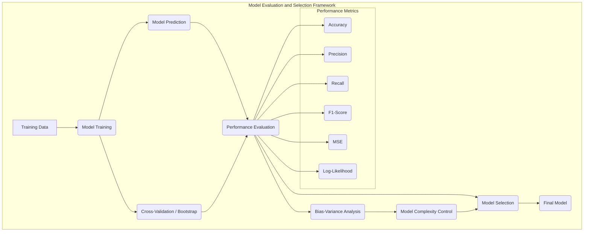
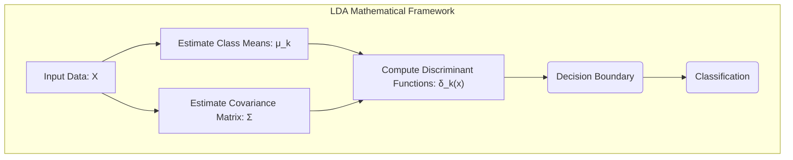
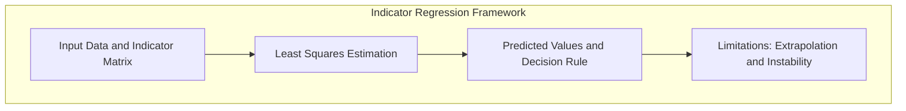
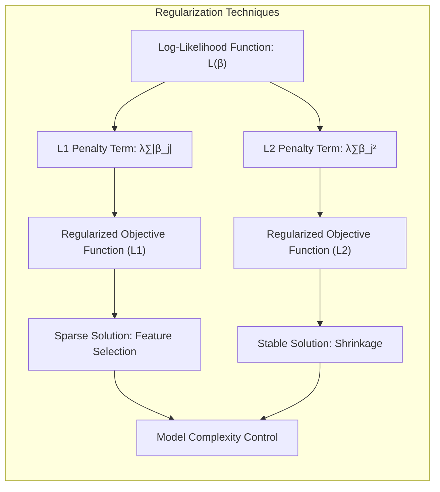
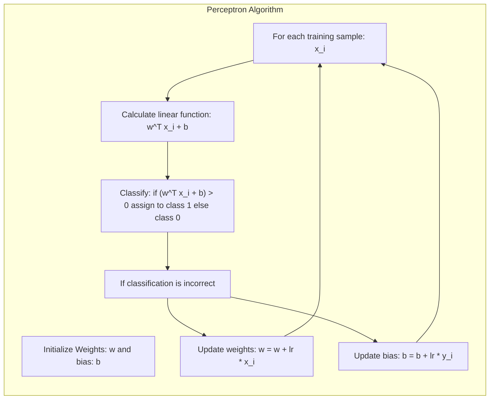
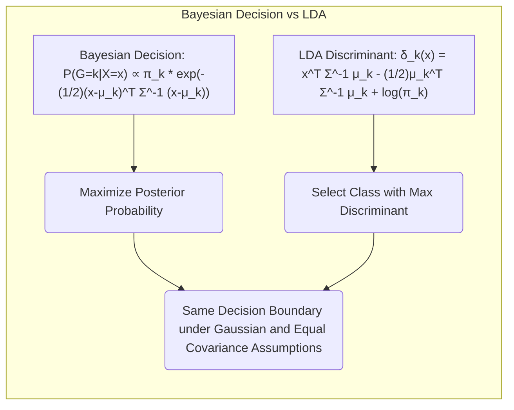

## Avaliação e Seleção de Modelos: Foco na Covariância entre Valores Ajustados e Verdadeiros

<imagem: Um diagrama complexo mostrando a relação entre diferentes métodos de avaliação e seleção de modelos, incluindo a decomposição de viés-variância, validação cruzada e bootstrap. O diagrama deve ter setas indicando o fluxo de informação entre diferentes métodos, e mostrar também como esses métodos se relacionam com a complexidade do modelo>

### Introdução
A performance de generalização de um método de aprendizado refere-se à sua capacidade preditiva em dados de teste independentes. Avaliar essa performance é de extrema importância na prática, pois guia a escolha do método ou modelo de aprendizado, e nos dá uma medida da qualidade do modelo escolhido [^7.1]. Este capítulo descreve os métodos principais para avaliação de performance e demonstra como eles são usados para selecionar modelos. Iniciamos o capítulo discutindo a interação entre viés, variância e complexidade do modelo [^7.1].

### Conceitos Fundamentais

**Conceito 1: Problema de Classificação e Generalização**
O problema de classificação envolve, a partir de um conjunto de dados de entrada, identificar a qual categoria cada observação pertence. Métodos lineares, como LDA e regressão logística, buscam criar uma fronteira de decisão linear no espaço de características para separar as classes. A performance desses métodos é avaliada pela sua capacidade de generalização, ou seja, a precisão com que classificam dados que não foram usados no treinamento [^7.1]. Um modelo linear com alta complexidade pode se ajustar muito bem aos dados de treinamento (baixo viés), mas generalizar mal para novos dados (alta variância), e vice-versa [^7.2]. O *trade-off* entre viés e variância é crucial na escolha do modelo ideal.

> 💡 **Exemplo Numérico:** Imagine um cenário onde temos dados de pacientes (variável *X*: pressão arterial, níveis de glicose, etc.) e queremos classificar se eles têm ou não diabetes (variável *Y*). Um modelo muito simples (ex: usando apenas pressão arterial) pode ter alto viés (subestima a complexidade da relação) e errar muitos diagnósticos, tanto no treino quanto em novos dados. Por outro lado, um modelo muito complexo (ex: usando todas as interações entre todas as variáveis) pode ter baixa viés no treino (acerta quase todos no treino), mas pode ter alta variância e errar muito em novos pacientes, pois aprendeu o "ruído" dos dados de treinamento. O ponto ideal é um modelo com equilíbrio entre viés e variância, que generaliza bem para pacientes não vistos anteriormente.

**Lemma 1:**  Em um problema de classificação com duas classes, onde a fronteira de decisão linear é definida por uma função discriminante $f(x) = w^Tx + b$, o erro de classificação pode ser expresso como a probabilidade de um ponto $x$ ser classificado incorretamente, ou seja, $P(Y \neq \hat{Y} | X=x)$, onde $Y$ é a classe verdadeira e $\hat{Y}$ é a classe predita.  Em particular, o erro esperado de classificação, que é o conceito de *test error*, pode ser definido como: $$ Err = E[I(G \neq \hat{G}(X))] $$, onde $G$ é a classe verdadeira e $\hat{G}(X)$ é a classe predita [^7.2].
Esta probabilidade depende da distribuição das classes e da capacidade da função discriminante de separar as classes, e a complexidade da função $f$ impacta diretamente a capacidade de generalização, dado o trade-off entre viés e variância [^7.2].

**Conceito 2: Linear Discriminant Analysis (LDA)**
LDA assume que as classes possuem distribuição normal multivariada com mesma matriz de covariância [^7.3]. A ideia central é projetar os dados em um subespaço de menor dimensão que maximize a separabilidade entre as classes [^7.3.1]. A fronteira de decisão é linear e definida pela diferença entre as médias de classe e a matriz de covariância compartilhada [^7.3.2]. Formalmente, a função discriminante linear de LDA é dada por:
$$ \delta_k(x) = x^T \Sigma^{-1} \mu_k - \frac{1}{2} \mu_k^T \Sigma^{-1} \mu_k + \log \pi_k $$
onde $x$ é o vetor de entrada, $\mu_k$ é a média da classe k, $\Sigma$ é a matriz de covariância comum, e $\pi_k$ é a probabilidade a priori da classe k [^7.3.3]. LDA busca os parâmetros que maximizam a distância entre as médias das classes e minimizem a variância dentro de cada classe [^7.3.1].

> 💡 **Exemplo Numérico:** Suponha que temos duas classes de flores, 'Iris Setosa' (classe 1) e 'Iris Versicolor' (classe 2), com duas características medidas: comprimento da sépala (X1) e largura da sépala (X2). Para classe 1, temos $\mu_1 = [5.0, 3.4]$ e para classe 2, $\mu_2 = [5.9, 2.7]$. A matriz de covariância compartilhada é $\Sigma = \begin{bmatrix} 0.3 & 0.1 \\ 0.1 & 0.2 \end{bmatrix}$.  Assumindo probabilidades a priori iguais ($\pi_1 = \pi_2 = 0.5$), podemos calcular $\Sigma^{-1} = \begin{bmatrix} 4 & -2 \\ -2 & 6 \end{bmatrix}$. Para uma nova flor com $x = [5.5, 3.0]$, a função discriminante para classe 1 é $\delta_1(x) = [5.5, 3.0] \cdot \begin{bmatrix} 4 & -2 \\ -2 & 6 \end{bmatrix} \cdot [5.0, 3.4]  - 0.5 \cdot [5.0, 3.4] \cdot \begin{bmatrix} 4 & -2 \\ -2 & 6 \end{bmatrix} \cdot [5.0, 3.4] + \log(0.5) \approx -1.88$, e para a classe 2 $\delta_2(x) \approx -1.76$.  Como $\delta_2(x) > \delta_1(x)$, classificaríamos essa flor como 'Iris Versicolor'.
>
> *Calculations:*
>
> $\Sigma^{-1} = \frac{1}{(0.3)(0.2) - (0.1)(0.1)} \begin{bmatrix} 0.2 & -0.1 \\ -0.1 & 0.3 \end{bmatrix} = \begin{bmatrix} 4 & -2 \\ -2 & 6 \end{bmatrix}$
>
> $\delta_1(x) = x^T \Sigma^{-1} \mu_1 - \frac{1}{2} \mu_1^T \Sigma^{-1} \mu_1 + \log \pi_1 = [5.5, 3.0] \cdot \begin{bmatrix} 4 & -2 \\ -2 & 6 \end{bmatrix} \cdot \begin{bmatrix} 5.0 \\ 3.4 \end{bmatrix} - 0.5 \cdot \begin{bmatrix} 5.0 \\ 3.4 \end{bmatrix}^T \cdot \begin{bmatrix} 4 & -2 \\ -2 & 6 \end{bmatrix} \cdot \begin{bmatrix} 5.0 \\ 3.4 \end{bmatrix}  + \log(0.5) = [5.5, 3.0] \cdot \begin{bmatrix} 13.2 \\ 10.4 \end{bmatrix} - 0.5 \cdot [5.0, 3.4]^T \cdot \begin{bmatrix} 13.2 \\ 10.4 \end{bmatrix}  -0.693 = 91.8 - 0.5 \cdot 99.6 - 0.693 = 91.8 - 49.8 - 0.693 = -1.88$
>
>$\delta_2(x) = [5.5, 3.0] \cdot \begin{bmatrix} 4 & -2 \\ -2 & 6 \end{bmatrix} \cdot [5.9, 2.7]  - 0.5 \cdot [5.9, 2.7] \cdot \begin{bmatrix} 4 & -2 \\ -2 & 6 \end{bmatrix} \cdot [5.9, 2.7] + \log(0.5) = [5.5, 3.0] \cdot \begin{bmatrix} 18.2 \\ 4.4 \end{bmatrix} - 0.5 \cdot [5.9, 2.7]^T \cdot \begin{bmatrix} 18.2 \\ 4.4 \end{bmatrix} - 0.693 = 113.3 - 0.5 \cdot 117.4 - 0.693  = 113.3 - 58.7 - 0.693 = -1.76$
>

**Corolário 1:**  A função discriminante linear $\delta_k(x)$ do LDA pode ser vista como uma projeção dos dados no espaço definido por $\Sigma^{-1}(\mu_k - \mu_{k'})$ para as classes $k$ e $k'$, seguida por um termo de bias, o que significa que dados classificados no lado positivo de um hiperplano definido por essa projeção, serão classificados como classe $k$ e dados no lado negativo como classe $k'$. Isso resulta em uma fronteira de decisão linear no espaço de características original, demonstrando como a escolha de $\Sigma$ e $\mu$ define a separabilidade e a forma da fronteira [^7.3.1].

**Conceito 3: Logistic Regression**
Na regressão logística, a probabilidade de uma observação pertencer a uma classe é modelada usando a função logística (sigmoid), que transforma uma combinação linear das variáveis de entrada em uma probabilidade entre 0 e 1 [^7.4]. O log-odds (logit) da probabilidade é expresso como uma função linear das variáveis de entrada [^7.4.1]. Os parâmetros do modelo são estimados maximizando a verossimilhança (likelihood) dos dados [^7.4.3]. A função de log-verossimilhança é dada por:
$$ L(\beta) = \sum_{i=1}^N \left[ y_i \log(p(x_i)) + (1-y_i) \log(1-p(x_i)) \right] $$
onde $y_i$ é a classe verdadeira (0 ou 1) e $p(x_i)$ é a probabilidade estimada [^7.4.4].
Regressão logística é adequada quando não se assume normalidade dos dados, ao contrário do LDA [^7.4.5].

> 💡 **Exemplo Numérico:** Vamos considerar um problema de classificação binária (classe 0 ou 1). Suponha que temos uma única variável preditora *x* e os coeficientes estimados são $\beta_0 = -3$ e $\beta_1 = 2$. Para um dado $x = 2$, o log-odds é dado por $\text{logit}(p) = -3 + 2*2 = 1$. A probabilidade estimada é $p = \frac{1}{1 + e^{-1}} \approx 0.73$. Se usarmos um limiar de 0.5, essa observação seria classificada como classe 1.  A verossimilhança (likelihood) para essa observação seria $L_i = 1 \cdot \log(0.73) + (1-1) \cdot \log(1-0.73) = \log(0.73) \approx -0.31$.  A função de log-verossimilhança é a soma dessas contribuições para todos os pontos de dados.
>
> *Calculations:*
>
> $\text{logit}(p) = \beta_0 + \beta_1x = -3 + 2 \cdot 2 = 1$
>
> $p = \frac{1}{1 + e^{-1}} \approx 0.73$
>
> $L_i = y_i \log(p(x_i)) + (1-y_i) \log(1-p(x_i)) = 1 \cdot \log(0.73) + 0 \cdot \log(0.27) \approx -0.31$

> ⚠️ **Nota Importante**: A escolha entre LDA e Regressão Logística depende das suposições sobre os dados. LDA funciona bem com dados Gaussianos com mesma covariância, enquanto regressão logística é mais flexível em relação à distribuição dos dados [^7.4.1].

> ❗ **Ponto de Atenção**: Modelos de regressão logística podem sofrer com classes desbalanceadas, o que pode levar a estimativas de probabilidades enviesadas. Para lidar com isso, técnicas como re-amostragem ou uso de pesos de classe podem ser empregadas [^7.4.2].

> ✔️ **Destaque**: Apesar de LDA e regressão logística possuírem abordagens distintas, em muitos casos as estimativas dos parâmetros podem apresentar correlações. Ambos geram fronteiras de decisão lineares, mas os parâmetros ótimos são encontrados através de otimizações com funções objetivo diferentes [^7.5].

### Regressão Linear e Mínimos Quadrados para Classificação

**Explicação:** O diagrama descreve o processo de regressão de indicadores para classificação, onde as classes são codificadas em uma matriz de indicadores, os coeficientes são estimados por mínimos quadrados e as classes são atribuídas de acordo com o maior valor predito. São indicadas também as limitações deste processo, como extrapolação fora de [0,1] e instabilidade [^7.2].

A regressão linear pode ser aplicada a problemas de classificação usando uma matriz de indicadores, que codifica cada classe como uma coluna binária [^7.2]. O método de mínimos quadrados (least squares - LS) é usado para estimar os coeficientes da regressão. As classes são então atribuídas de acordo com o maior valor predito pela regressão linear [^7.2]. No entanto, essa abordagem possui limitações. Os valores preditos podem extrapolar para fora do intervalo [0,1], o que não faz sentido para probabilidades [^7.2]. Além disso, em alguns casos a regressão de indicadores pode levar a instabilidade nas estimativas dos parâmetros, principalmente quando há colinearidade entre as variáveis de entrada [^7.3]. A regressão de indicadores assume que a relação entre as variáveis independentes e a variável resposta é linear, o que nem sempre é verdade em problemas de classificação complexos [^7.2]. A regressão de indicadores busca minimizar a soma dos quadrados dos resíduos (distância entre o valor observado e o valor predito), o que não é o ideal quando se deseja minimizar o erro de classificação [^7.2].

> 💡 **Exemplo Numérico:** Suponha que temos três classes (A, B, C) e duas variáveis preditoras (x1 e x2). Usamos codificação de indicadores para criar três colunas de resposta (Y_A, Y_B, Y_C), onde cada coluna indica a presença (1) ou ausência (0) da classe correspondente. Para uma observação com x1=1 e x2=2, as classes são codificadas como:
>
> | Obs | x1 | x2 | Classe | Y_A | Y_B | Y_C |
> |---|---|---|---|---|---|---|
> | 1   | 1 | 2 | A | 1 | 0 | 0 |
> | 2   | 2 | 3 | B | 0 | 1 | 0 |
> | 3   | 3 | 4 | C | 0 | 0 | 1 |
>
> Aplicando a regressão linear com mínimos quadrados, obtemos os coeficientes para cada coluna de resposta. Para classificar uma nova observação, calculamos o valor predito para cada coluna de resposta e escolhemos a classe correspondente à coluna com o maior valor. Uma limitação é que podemos obter valores preditos fora do intervalo [0,1], perdendo a interpretação de probabilidade.

**Lemma 2:** Se considerarmos um problema de classificação com duas classes e codificarmos as classes como $Y \in \{0, 1\}$, a regressão linear da matriz de indicadores equivale a encontrar um hiperplano que melhor separa as classes no sentido de mínimos quadrados. Em outras palavras, os coeficientes estimados pela regressão linear definem a direção normal do hiperplano e um offset. As projeções dos pontos no hiperplano geram os valores preditos. Essa equivalência formal entre a regressão linear e a construção de um hiperplano de decisão linear demonstra como esses métodos, aparentemente distintos, podem convergir para resultados similares em certas condições [^7.2].

**Corolário 2:** Sob condições de separabilidade linear, as soluções da regressão linear e do discriminante linear convergem para o mesmo hiperplano de decisão.  Isso indica que a regressão de indicadores pode ser utilizada para encontrar a fronteira de decisão, com a ressalva de que a estimativa das probabilidades pode ser instável, como descrito em [^7.2]

"Em alguns cenários, conforme apontado em [^7.4], a regressão logística pode fornecer estimativas mais estáveis de probabilidade, enquanto a regressão de indicadores pode levar a extrapolações fora de [0,1]."

"No entanto, há situações em que a regressão de indicadores, de acordo com [^7.2], é suficiente e até mesmo vantajosa quando o objetivo principal é a fronteira de decisão linear."

### Métodos de Seleção de Variáveis e Regularização em Classificação

<imagem: Um mapa mental abrangente que conecta a seleção de variáveis, regularização, LDA, regressão logística e hiperplanos separadores, mostrando como esses conceitos se relacionam com o objetivo de construir um modelo de classificação robusto. O mapa mental deve incluir penalidades L1 e L2 e o impacto na complexidade do modelo>

A seleção de variáveis e regularização são técnicas essenciais para controlar a complexidade do modelo e evitar o *overfitting*. A regularização adiciona um termo de penalidade à função de custo, que pune modelos com coeficientes muito grandes [^7.4.4]. A penalidade L1 promove a esparsidade dos coeficientes, ou seja, alguns coeficientes são reduzidos a zero, realizando a seleção de variáveis de maneira implícita [^7.5]. A penalidade L2 reduz os coeficientes, mas não os zera, tornando o modelo mais estável [^7.5]. Em modelos logísticos, a penalidade é adicionada à função de log-verossimilhança [^7.4.4].

**Lemma 3:** Dada a função de log-verossimilhança para regressão logística, $$ L(\beta) = \sum_{i=1}^N \left[ y_i \log(p(x_i)) + (1-y_i) \log(1-p(x_i)) \right] $$,  a penalidade L1 (lasso) adiciona um termo proporcional à norma L1 dos coeficientes:
$$ L_{L1}(\beta) = L(\beta) - \lambda \sum_{j=1}^p |\beta_j| $$
Onde $\lambda$ é o parâmetro de regularização que controla o nível de penalização. A solução desse problema de otimização tende a gerar coeficientes esparsos, pois a penalidade L1 força alguns coeficientes a serem exatamente zero [^7.4.4].

> 💡 **Exemplo Numérico:** Suponha que temos uma regressão logística com duas variáveis preditoras ($x_1$ e $x_2$) e o vetor de coeficientes estimado por máxima verossimilhança é $\beta = [2, -3]$.  Se aplicarmos a regularização L1 com $\lambda = 1$, a nova função a ser minimizada é $L_{L1}(\beta) = L(\beta) - 1 \cdot (|2| + |-3|) = L(\beta) - 5$.  Para um valor maior de $\lambda$ como $\lambda=5$ a penalização seria $L_{L1}(\beta) = L(\beta) - 5 \cdot (|2| + |-3|) = L(\beta) - 25$. A minimização desta função tenderá a levar os coeficientes para zero. Se $\lambda$ fosse grande o suficiente (e dependendo do valor de $L(\beta)$) algum dos coeficientes poderia ser exatamente zero, por exemplo se o coeficiente de $x_2$ fosse igual a zero ($\beta = [2, 0]$), a penalização seria $L_{L1}(\beta) = L(\beta) - 1 \cdot (|2| + |0|) = L(\beta) - 2$ quando $\lambda = 1$. Isso representa a seleção de variáveis, onde o modelo ignora a variável $x_2$.
>
> *Calculations:*
>
> $L_{L1}(\beta) = L(\beta) - \lambda \sum_{j=1}^p |\beta_j|$
>
> For $\lambda=1$, $L_{L1}(\beta) = L(\beta) - 1 \cdot (|2| + |-3|) = L(\beta) - 5$.
>
> For $\lambda=5$, $L_{L1}(\beta) = L(\beta) - 5 \cdot (|2| + |-3|) = L(\beta) - 25$.
>

**Prova do Lemma 3:** A penalização L1 induz esparsidade porque seu contorno de nível tem vértices em $\beta=0$. A otimização da função com penalidade L1 tende a encontrar soluções nesses vértices, zerando os coeficientes correspondentes. Em contraste, a penalidade L2 tem contornos suaves e tende a reduzir os coeficientes sem zerá-los completamente [^7.4.4]  $\blacksquare$

**Corolário 3:** A esparsidade dos coeficientes obtida pela regularização L1 facilita a interpretação do modelo, pois destaca as variáveis mais relevantes para a classificação. Em outras palavras, a regularização L1 faz uma seleção implícita das variáveis mais importantes, levando a modelos mais simples e interpretáveis [^7.4.5].

> ⚠️ **Ponto Crucial**:  A combinação das penalidades L1 e L2, conhecida como Elastic Net, oferece um balanceamento entre a esparsidade e a estabilidade, sendo uma opção flexível na construção de modelos classificatórios [^7.5].

### Separating Hyperplanes e Perceptrons

A busca por um hiperplano ótimo de separação entre classes leva ao conceito de margem máxima [^7.5.2]. O hiperplano ótimo é aquele que maximiza a distância entre as classes, medindo a margem de segurança na classificação. O problema da maximização da margem pode ser formulado como um problema de otimização quadrática que pode ser resolvido usando o dual de Wolfe [^7.5.2]. A solução para esse problema define os pontos de suporte (support vectors), que são os dados mais importantes para definir o hiperplano [^7.5.2]. O *Perceptron* de Rosenblatt é um algoritmo que busca encontrar um hiperplano de decisão linear, atualizando os pesos iterativamente baseado na classificação incorreta dos dados de treinamento. A convergência do Perceptron é garantida quando os dados são linearmente separáveis [^7.5.1].

> 💡 **Exemplo Numérico:** Suponha que temos um conjunto de dados bidimensional com duas classes, onde alguns pontos da classe A são (1,1), (2,1), (1,2) e pontos da classe B são (3,3), (4,2), (4,3). Inicializamos um hiperplano com pesos aleatórios, por exemplo, $w = [0.1, 0.2]$ e bias $b = -0.5$. Aplicamos o Perceptron com uma taxa de aprendizagem de 0.1. Para o ponto (1,1) da classe A, o valor da função linear é $0.1*1 + 0.2*1 - 0.5 = -0.2$, o que indica que esse ponto é classificado incorretamente, pois esperávamos um valor maior que 0. Atualizamos os pesos $w = w + \text{lr} * x_i = [0.1, 0.2] + 0.1*[1, 1] = [0.2, 0.3]$ e o bias $b = b + \text{lr} * 1 = -0.5 + 0.1 = -0.4$. Repetimos esse processo para todos os pontos e iteramos até que todos sejam classificados corretamente. A margem máxima seria dada pelo hiperplano que maximiza a distância entre os pontos de cada classe.

### Pergunta Teórica Avançada: Quais as diferenças fundamentais entre a formulação de LDA e a Regra de Decisão Bayesiana considerando distribuições Gaussianas com covariâncias iguais?

**Resposta:**
A regra de decisão Bayesiana, sob o pressuposto de distribuições Gaussianas, aloca uma observação à classe que maximiza a probabilidade *a posteriori* da classe dado os dados, isto é, $P(G = k | X = x)$.  Assumindo covariâncias iguais para todas as classes, essa probabilidade pode ser expressa como: $$P(G = k | X = x) \propto \pi_k \exp \left( -\frac{1}{2}(x - \mu_k)^T \Sigma^{-1} (x - \mu_k) \right)$$, onde $\pi_k$ é a probabilidade *a priori* da classe $k$, $\mu_k$ é a média da classe $k$ e $\Sigma$ é a matriz de covariância comum a todas as classes [^7.3].
Por outro lado, o LDA constrói uma função discriminante linear para cada classe: $$ \delta_k(x) = x^T \Sigma^{-1} \mu_k - \frac{1}{2} \mu_k^T \Sigma^{-1} \mu_k + \log \pi_k $$. Ao compararmos as duas abordagens, vemos que ambas se baseiam na mesma estrutura de parâmetros ($ \pi_k$, $\mu_k$ e $\Sigma$) e, quando o objetivo é encontrar as regiões que maximizam a *a posteriori*, ambas convergem para o mesmo limite de decisão linear [^7.3]. A diferença fundamental está na forma como essa decisão é tomada. Enquanto a regra Bayesiana compara diretamente as probabilidades *a posteriori*, o LDA usa uma função discriminante linear que, por sua vez, leva à mesma região de decisão. As suposições sobre a distribuição dos dados e igualdade de covariância são importantes, pois definem o tipo de fronteira de decisão linear obtida em ambos os métodos [^7.3.1].

**Lemma 4:** Sob a hipótese de distribuições Gaussianas e covariâncias iguais, a regra de decisão Bayesiana e o LDA levam à mesma fronteira de decisão linear. A regra de decisão Bayesiana seleciona a classe $k$ que maximiza a probabilidade a posteriori, enquanto LDA seleciona a classe $k$ com maior discriminante linear [^7.3], [^7.3.3].  A condição necessária para essa equivalência é que as funções discriminantes do LDA são uma transformação monótona das probabilidades *a posteriori* bayesianas [^7.3.3].

**Corolário 4:** Quando a hipótese de igualdade de covariâncias é relaxada, a regra de decisão Bayesiana leva à fronteira de decisão quadrática (QDA), dada por:
$$ \delta_k(x) = -\frac{1}{2} \log|\Sigma_k| -\frac{1}{2}(x - \mu_k)^T \Sigma_k^{-1} (x - \mu_k) + \log \pi_k $$
onde $\Sigma_k$ é a matriz de covariância para a classe $k$ [^7.3]. QDA permite maior flexibilidade na modelagem da distribuição das classes, mas também maior número de parâmetros a serem estimados [^7.3].

> ⚠️ **Ponto Crucial**: A escolha da abordagem, seja LDA com fronteira linear ou QDA com fronteira quadrática, depende de quão apropriada é a hipótese de igualdade de covariâncias para o problema em questão [^7.3.1]. A escolha afeta diretamente a complexidade do modelo e sua capacidade de generalização.

### Conclusão
Este capítulo abordou os conceitos fundamentais de avaliação e seleção de modelos, com foco na classificação, e a relação com a covariância entre valores ajustados e verdadeiros. Exploramos as abordagens lineares, como LDA e regressão logística, a importância da regularização e seleção de variáveis, bem como o conceito de *separating hyperplanes* e o algoritmo Perceptron. Examinamos as diferenças entre abordagens frequentistas e bayesianas, com destaque para critérios como AIC e BIC e exploramos a importância da validação cruzada para estimativa da performance de modelos. Abordamos em detalhes como modelar e avaliar a performance de generalização de modelos em diferentes situações práticas. As técnicas aqui descritas fornecem um embasamento sólido para a construção de modelos de classificação robustos e confiáveis.
<!-- END DOCUMENT -->

### Footnotes
[^7.1]: "The generalization performance of a learning method relates to its prediction capability on independent test data. Assessment of this performance is extremely important in practice, since it guides the choice of learning method or model, and gives us a measure of the quality of the ultimately chosen model." *(Trecho de Model Assessment and Selection)*
[^7.2]: "Figure 7.1 illustrates the important issue in assessing the ability of a learning method to generalize. Consider first the case of a quantitative or interval scale response. We have a target variable Y, a vector of inputs X, and a prediction model f(X) that has been estimated from a training set T." *(Trecho de Model Assessment and Selection)*
[^7.3]:  "The story is similar for a qualitative or categorical response G taking one of K values in a set G, labeled for convenience as 1, 2, ..., K. Typically we model the probabilities pk(X) = Pr(G = k|X) (or some monotone transformations fr(X)), and then Ĝ(X) = arg maxk Îk(X)." *(Trecho de Model Assessment and Selection)*
[^7.3.1]: "For a linear model family such as ridge regression, we can break down the bias more finely. Let β denote the parameters of the best-fitting linear approximation to f:" *(Trecho de Model Assessment and Selection)*
[^7.3.2]: "If we are in a data-rich situation, the best approach for both problems is to randomly divide the dataset into three parts: a training set, a validation set, and a test set." *(Trecho de Model Assessment and Selection)*
[^7.3.3]: "In this chapter we describe a number of methods for estimating the expected test error for a model. Typically our model will have a tuning parameter or parameters a and so we can write our predictions as fa(x)." *(Trecho de Model Assessment and Selection)*
[^7.4]: "The log-likelihood can be used as a loss-function for general response densities, such as the Poisson, gamma, exponential, log-normal and others." *(Trecho de Model Assessment and Selection)*
[^7.4.1]: "Note that this expectation averages over everything that is random, including the randomness in the training set that produced f." *(Trecho de Model Assessment and Selection)*
[^7.4.2]: "The quantity -2 × the log-likelihood is sometimes referred to as the deviance." *(Trecho de Model Assessment and Selection)*
[^7.4.3]: "Training error is the sample analogue, for example, 
N
2
err
2=1
Σlog pg; (Xi),
the sample log-likelihood for the model." *(Trecho de Model Assessment and Selection)*
[^7.4.4]: "The methods in this chapter are designed for situations where there is insufficient data to split it into three parts." *(Trecho de Model Assessment and Selection)*
[^7.4.5]: "Again it is too difficult to give a general rule on how much training data is enough; among