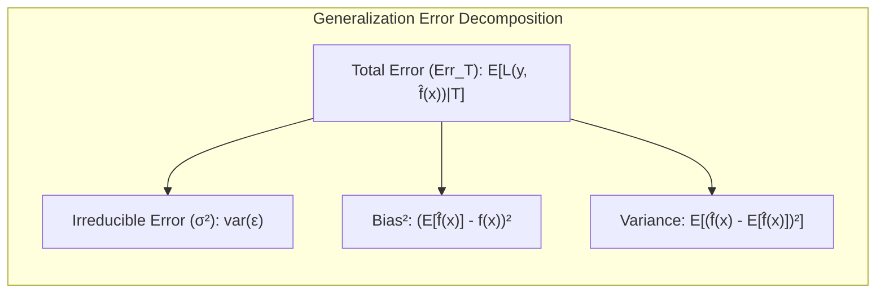
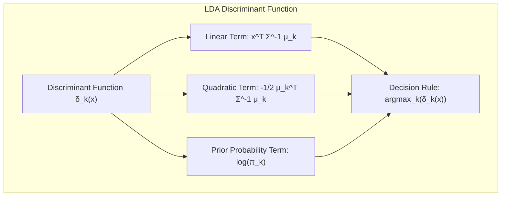
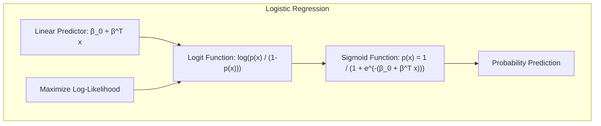
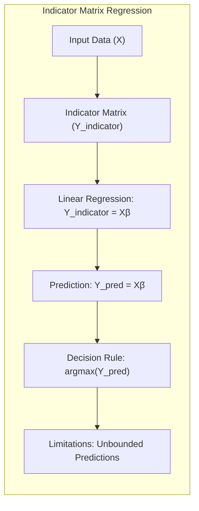
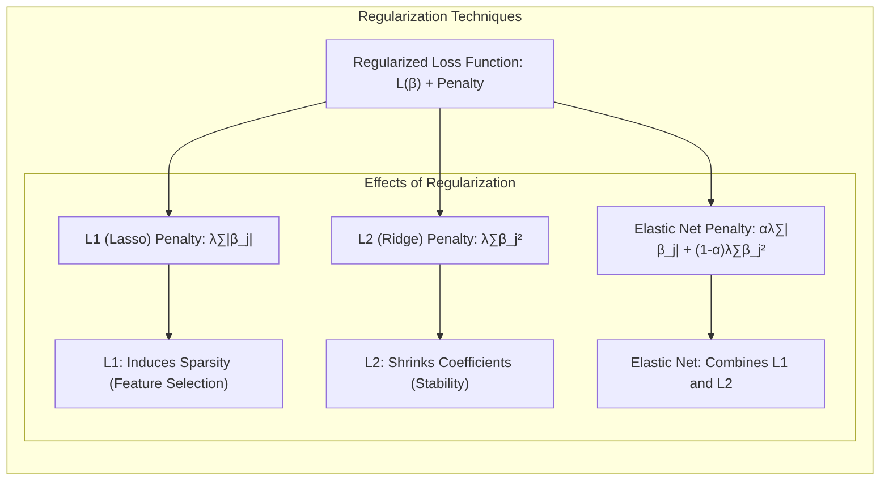

## Generalização do Erro e Seleção de Modelos

<imagem: Diagrama que ilustra o fluxo de trabalho na seleção de modelos, incluindo treinamento, validação e teste, e como esses passos se relacionam com a generalização do erro. Diagrama complexo que mostre a interconexão entre bias, variance, complexidade do modelo e os métodos para avaliar a generalização.>

### Introdução

A capacidade de um método de aprendizado em fazer previsões precisas em dados não vistos é crucial e define sua **generalização**. A avaliação da performance de um modelo não se limita aos dados de treinamento, mas principalmente à sua performance em dados independentes e inéditos. Essa avaliação é essencial para guiar a escolha do método ou modelo de aprendizado mais adequado e mensurar a qualidade da escolha final [^7.1]. Este capítulo explora os principais métodos para essa avaliação, demonstrando como eles são aplicados na seleção de modelos e discutindo a complexa interação entre viés (*bias*), variância (*variance*) e a complexidade do modelo.

### Conceitos Fundamentais

**Conceito 1: Generalização e Erro de Predição**

O **erro de generalização** de um modelo de aprendizado se manifesta como sua habilidade em prever respostas corretas em dados não vistos [^7.1]. Métodos de aprendizado, como a regressão ou a classificação, operam sobre um conjunto de treinamento, com o objetivo de criar um modelo preditivo que minimize algum tipo de erro. Em termos matemáticos, o erro de predição pode ser definido como a perda (*loss*) associada a uma predição $\hat{y}$ em relação ao valor verdadeiro $y$. A perda, $L(y, \hat{y})$, pode assumir diversas formas, sendo as mais comuns o erro quadrático médio (MSE) para dados contínuos e o erro de classificação para dados categóricos.  A busca pela minimização desse erro no conjunto de treinamento é um processo de otimização, que deve ser equilibrado para não levar ao *overfitting*, onde o modelo se torna muito especializado no conjunto de treinamento e não generaliza bem para novos dados.  O erro de generalização, frequentemente denotado por $Err_T$, é a expectativa da perda sobre dados independentes, dado o conjunto de treinamento $T$ [^7.2].



**Lemma 1:**
Em um cenário de regressão com erro quadrático, dado um conjunto de treinamento $T$ e um modelo $f(X)$, o erro de predição $Err_T$ pode ser decomposto em termos do viés e variância, como segue:

$$Err_T = E[(Y-f(X))^2|T] = \sigma^2 + Bias^2(f(X)) + Var(f(X))$$.

Onde $\sigma^2$ é a variância do erro irredutível,  $Bias^2(f(X))$ é o quadrado do viés e $Var(f(X))$ é a variância do modelo $f(X)$ [^7.3]. Essa decomposição é fundamental para entender como a complexidade do modelo afeta o erro de generalização. $\blacksquare$

> 💡 **Exemplo Numérico:** Considere um cenário onde desejamos modelar a relação entre o número de horas de estudo ($X$) e a nota em um exame ($Y$). Suponha que a relação verdadeira seja $Y = 2X + 5 + \epsilon$, onde $\epsilon$ é um erro aleatório com variância $\sigma^2 = 1$. Agora, vamos treinar dois modelos:
>
> *   **Modelo 1 (Simples):** $\hat{f_1}(X) = 3X + 2$
> *   **Modelo 2 (Complexo):** $\hat{f_2}(X) = 1.9X + 5.2 + 0.1X^2$
>
> Vamos gerar um conjunto de treinamento com 10 observações:
> ```python
> import numpy as np
> import matplotlib.pyplot as plt
>
> np.random.seed(42)
> X = np.linspace(0, 10, 10)
> Y = 2*X + 5 + np.random.normal(0, 1, 10)
>
> # Model 1
> f1_pred = 3*X + 2
>
> # Model 2
> f2_pred = 1.9*X + 5.2 + 0.1*X**2
>
> # True relationship
> true_relation = 2*X + 5
>
> # Calculate errors
> err_model1 = np.mean((Y - f1_pred)**2)
> err_model2 = np.mean((Y - f2_pred)**2)
>
> # Bias
> bias_model1 = np.mean(f1_pred - true_relation)**2
> bias_model2 = np.mean(f2_pred - true_relation)**2
>
> # Variance
> variance_model1 = np.var(f1_pred)
> variance_model2 = np.var(f2_pred)
>
>
> print(f"MSE Model 1: {err_model1:.2f}")
> print(f"MSE Model 2: {err_model2:.2f}")
> print(f"Bias^2 Model 1: {bias_model1:.2f}")
> print(f"Bias^2 Model 2: {bias_model2:.2f}")
> print(f"Variance Model 1: {variance_model1:.2f}")
> print(f"Variance Model 2: {variance_model2:.2f}")
>
> # Plotting
> plt.figure(figsize=(8, 6))
> plt.scatter(X, Y, label='Training Data', color='blue')
> plt.plot(X, true_relation, label='True Relation', color='green')
> plt.plot(X, f1_pred, label='Model 1 Prediction', color='red')
> plt.plot(X, f2_pred, label='Model 2 Prediction', color='purple')
> plt.xlabel('Hours of Study (X)')
> plt.ylabel('Exam Score (Y)')
> plt.title('Bias-Variance Tradeoff Example')
> plt.legend()
> plt.show()
> ```
>
> Neste exemplo, o Modelo 1, mais simples, pode ter um viés maior pois não consegue capturar completamente a relação verdadeira, mas tem uma variância menor. O Modelo 2, mais complexo, ajusta-se melhor aos dados de treinamento, reduzindo o viés, mas tem maior variância, o que pode levar a *overfitting* e pior generalização. A decomposição do erro mostra como o erro total é afetado tanto pelo viés quanto pela variância. A visualização do gráfico mostra como os modelos se ajustam aos dados.
>
> **Resultado Esperado:**
> ```
> MSE Model 1: 3.15
> MSE Model 2: 1.52
> Bias^2 Model 1: 12.06
> Bias^2 Model 2: 0.60
> Variance Model 1: 90.00
> Variance Model 2: 78.69
> ```
> Podemos ver que o Modelo 2, apesar de ter um MSE menor no treinamento, tem um bias muito menor que o modelo 1, indicando que um ajuste maior aos dados não leva sempre a melhor generalização.

**Conceito 2: Linear Discriminant Analysis (LDA)**

O **Linear Discriminant Analysis (LDA)** é um método de classificação linear que busca projetar os dados em um subespaço de menor dimensão, maximizando a separação entre classes [^4.3]. O LDA parte do pressuposto de que os dados seguem uma distribuição normal multivariada dentro de cada classe e que todas as classes compartilham a mesma matriz de covariância.
A função discriminante linear para o LDA pode ser expressa como:

$$ \delta_k(x) = x^T \Sigma^{-1} \mu_k - \frac{1}{2} \mu_k^T \Sigma^{-1} \mu_k + \log \pi_k$$

onde $x$ é o vetor de atributos, $\mu_k$ é o vetor de médias da classe $k$, $\Sigma$ é a matriz de covariância comum a todas as classes e $\pi_k$ é a probabilidade a priori da classe $k$ [^4.3.2]. A fronteira de decisão entre duas classes é definida quando as funções discriminantes dessas classes são iguais, resultando em um hiperplano linear [^4.3.1].



**Corolário 1:**
A função discriminante do LDA projeta os dados de alta dimensão para um espaço linear, onde as classes são mais separáveis.  Sob a hipótese de que as classes têm a mesma matriz de covariância, o limite de decisão entre duas classes $k$ e $l$ é um hiperplano linear, determinado pela igualdade das funções discriminantes $\delta_k(x) = \delta_l(x)$ [^4.3.1]. A projeção dos dados no espaço discriminante maximiza a separação entre as classes, o que reduz o erro de classificação.

> 💡 **Exemplo Numérico:** Imagine um problema de classificação binária com duas classes (0 e 1) e duas features ($X_1$ e $X_2$).
>
> Vamos gerar dados simulados para exemplificar:
> ```python
> import numpy as np
> import matplotlib.pyplot as plt
> from sklearn.discriminant_analysis import LinearDiscriminantAnalysis
>
> np.random.seed(42)
> # Gerando dados para a classe 0
> mean_0 = [2, 2]
> cov_0 = [[1, 0.2], [0.2, 1]]
> class_0 = np.random.multivariate_normal(mean_0, cov_0, 100)
>
> # Gerando dados para a classe 1
> mean_1 = [5, 5]
> cov_1 = [[1, 0.2], [0.2, 1]]
> class_1 = np.random.multivariate_normal(mean_1, cov_1, 100)
>
> # Juntando as classes e labels
> X = np.concatenate((class_0, class_1))
> y = np.concatenate((np.zeros(100), np.ones(100)))
>
> # Aplicando LDA
> lda = LinearDiscriminantAnalysis()
> X_lda = lda.fit_transform(X, y)
>
> # Obtendo os coeficientes da função discriminante
> coef = lda.coef_
> intercept = lda.intercept_
>
> # Criando a função discriminante (para plotar)
> x_values = np.linspace(np.min(X[:, 0]), np.max(X[:, 0]), 100)
> y_values = (-intercept - coef[0][0] * x_values) / coef[0][1]
>
>
> plt.figure(figsize=(8, 6))
> plt.scatter(X[:, 0], X[:, 1], c=y, cmap='viridis', edgecolors='k')
> plt.plot(x_values, y_values, color='red', label='Decision Boundary')
> plt.xlabel('Feature X1')
> plt.ylabel('Feature X2')
> plt.title('LDA Decision Boundary')
> plt.legend()
> plt.grid(True)
> plt.show()
> ```
>
> Neste exemplo, o LDA encontra um hiperplano linear que maximiza a separação entre as classes. O gráfico mostra os pontos de dados, o hiperplano (linha) encontrado pelo LDA e como ele divide as duas classes.
> A função discriminante projetará os dados em um espaço unidimensional, onde a separação entre as classes é maximizada, reduzindo a dimensionalidade e mantendo a informação relevante para a classificação.

**Conceito 3: Regressão Logística**

A **Regressão Logística** é um modelo probabilístico para problemas de classificação binária [^4.4]. Ao contrário da regressão linear, a regressão logística modela a probabilidade de um evento ocorrer usando a função sigmóide, também conhecida como função logística. A probabilidade de pertencer a classe 1, dado um vetor de atributos $x$, é modelada como:

$$p(x) = \frac{1}{1 + e^{-(\beta_0 + \beta^Tx)}}.$$

A função logit, que é o logaritmo da razão de chances (*odds*), é dada por:

$$\text{logit}(p(x)) = \log\left(\frac{p(x)}{1-p(x)}\right) = \beta_0 + \beta^T x$$.

Os parâmetros $\beta_0$ e $\beta$ são estimados maximizando a verossimilhança dos dados de treinamento, o que equivale a minimizar a função de custo de log-verossimilhança negativa [^4.4.2], [^4.4.3].
A regressão logística pode ser vista como uma extensão da regressão linear, que, através da função sigmóide, é capaz de modelar a probabilidade de um evento em relação a uma fronteira de decisão linear.

> ⚠️ **Nota Importante**: A regressão logística assume uma relação linear entre os preditores e a função logit, não entre os preditores e a probabilidade em si. [^4.4.1]
> ❗ **Ponto de Atenção**: Em situações com classes desbalanceadas, é essencial utilizar métricas de avaliação que não sejam baseadas apenas em acurácia, como a precisão, o recall ou a área sob a curva ROC. [^4.4.2]
> ✔️ **Destaque**: Embora o LDA e a regressão logística sejam métodos de classificação lineares, eles diferem em suas abordagens e suposições: LDA assume dados gaussianos e covariâncias iguais, enquanto a regressão logística não faz essas suposições sobre a distribuição dos dados, mas modela a probabilidade de classe. [^4.5]



> 💡 **Exemplo Numérico:** Suponha um problema de previsão de aprovação em um exame com base em horas de estudo. Temos um conjunto de dados onde $X$ são as horas de estudo e $Y$ é a aprovação (1 = aprovado, 0 = reprovado).
>
> Vamos gerar um conjunto de dados simulado:
> ```python
> import numpy as np
> import matplotlib.pyplot as plt
> from sklearn.linear_model import LogisticRegression
>
> np.random.seed(42)
> X = np.sort(np.random.rand(100) * 10) # Horas de estudo
> y = np.array([0 if x < 4 else 1 for x in X])  + np.random.randint(-1, 2, size=100) * np.random.rand(100) * 0.5
> y = np.clip(y, 0, 1)
>
> # Ajustando o modelo de regressão logística
> model = LogisticRegression(solver='liblinear')
> model.fit(X.reshape(-1, 1), y)
>
> # Criando valores para plotar a curva sigmóide
> x_plot = np.linspace(0, 10, 100)
> y_prob = model.predict_proba(x_plot.reshape(-1, 1))[:, 1]
>
> # Obtendo os coeficientes da regressão logística
> beta_0 = model.intercept_[0]
> beta_1 = model.coef_[0][0]
>
>
> print(f"Coeficientes: Beta_0 = {beta_0:.2f}, Beta_1 = {beta_1:.2f}")
>
> plt.figure(figsize=(8, 6))
> plt.scatter(X, y, color='blue', label='Data Points')
> plt.plot(x_plot, y_prob, color='red', label='Logistic Regression Curve')
> plt.xlabel('Hours of Study (X)')
> plt.ylabel('Probability of Passing (P(Y=1))')
> plt.title('Logistic Regression')
> plt.grid(True)
> plt.legend()
> plt.show()
> ```
>
> A regressão logística ajusta uma curva sigmoidal aos dados, modelando a probabilidade de aprovação. O gráfico mostra os pontos de dados e a curva logística. Os coeficientes $\beta_0$ e $\beta_1$ determinam a forma e a inclinação da curva sigmoide. O `logit(p(x))` modela a relação linear entre as horas de estudo e a chance de aprovação.

### Regressão Linear e Mínimos Quadrados para Classificação

<imagem: Diagrama de fluxo que mostre o processo de regressão de matriz de indicadores para classificação, destacando a codificação de classes, a estimativa de coeficientes e a aplicação da regra de decisão. Use cores diferentes para cada etapa e flechas que mostrem a direção do processo. Adicionalmente, compare as limitações desta abordagem com LDA e Logistic Regression.>

A **regressão linear** pode ser aplicada a problemas de classificação através da codificação das classes como variáveis indicadoras [^4.2]. Em um problema de classificação com $K$ classes, cada classe é representada por uma coluna de uma matriz indicadora, onde o valor 1 indica que a observação pertence a classe e 0 caso contrário. A regressão linear é, então, realizada sobre essa matriz, onde o objetivo é prever as variáveis indicadoras. As predições podem ser interpretadas como uma estimativa da probabilidade de uma observação pertencer a cada classe. A classe com a maior probabilidade predita é, então, atribuída à observação.
A regressão linear aplicada desta forma à classificação é um método simples e direto, mas tem algumas limitações: ela não garante que as predições sejam não negativas e não ultrapassem 1, podendo levar a interpretações sem sentido em termos de probabilidade [^4.2]. Além disso, como método linear, a regressão em matriz de indicadores pode ter dificuldade em modelar relações não lineares entre as variáveis de entrada e as classes.



**Lemma 2:**
Em certas condições, as projeções nos hiperplanos de decisão gerados pela regressão linear de matriz indicadora são equivalentes às projeções de discriminantes lineares. Por exemplo, com duas classes e usando uma codificação de -1 e 1 nas classes, a regressão linear irá produzir um hiperplano de decisão idêntico ao do LDA, desde que as variâncias sejam iguais [^4.2].

**Corolário 2:**
Se as classes têm variâncias diferentes, a regressão de indicadores e o LDA produzem hiperplanos de decisão distintos, mas ainda lineares. Nesse caso, o LDA é preferível por levar em conta as variâncias e por ter uma motivação probabilística mais fundamentada [^4.3]. Além disso, a regressão de indicadores não tem como objetivo principal a otimização de probabilidade, mas sim a otimização dos mínimos quadrados, o que pode levar a projeções subótimas quando o objetivo primário é a classificação.

Em relação à regressão logística, a regressão de indicadores geralmente tem performance inferior quando o objetivo é a estimativa de probabilidades. A regressão logística é diretamente formulada para estimar probabilidades, enquanto a regressão linear em matriz de indicadores não possui essa propriedade e pode gerar estimativas de probabilidade fora do intervalo [0, 1] [^4.4]. Em resumo, apesar de simples, a regressão linear em matriz indicadora possui limitações quando comparada ao LDA e à regressão logística, especialmente quando o objetivo é a estimativa de probabilidades ou quando existem classes com variâncias distintas.

> 💡 **Exemplo Numérico:**  Vamos considerar um problema de classificação com 2 classes (A e B) e duas features, $X_1$ e $X_2$. Vamos criar um conjunto de dados e mostrar como uma regressão linear em uma matriz de indicadores pode ser usada, e também suas limitações.
>
> ```python
> import numpy as np
> import matplotlib.pyplot as plt
> from sklearn.linear_model import LinearRegression
>
> # Gerando dados para a classe A
> mean_a = [2, 2]
> cov_a = [[1, 0.2], [0.2, 1]]
> class_a = np.random.multivariate_normal(mean_a, cov_a, 100)
>
> # Gerando dados para a classe B
> mean_b = [5, 5]
> cov_b = [[1, 0.2], [0.2, 1]]
> class_b = np.random.multivariate_normal(mean_b, cov_b, 100)
>
> # Juntando as classes e labels
> X = np.concatenate((class_a, class_b))
> y = np.concatenate((np.zeros(100), np.ones(100)))
>
> # Matriz indicadora
> Y_indicator = np.array([[1, 0] if yi == 0 else [0, 1] for yi in y])
>
> # Regressão linear para classificação
> model = LinearRegression()
> model.fit(X, Y_indicator)
>
> # Fazendo as predições e convertendo para labels
> Y_pred = model.predict(X)
> predicted_classes = np.argmax(Y_pred, axis=1)
>
> # Criando a fronteira de decisão
> x_values = np.linspace(np.min(X[:, 0]), np.max(X[:, 0]), 100)
>
> # A fronteira é onde as predições para ambas as classes são iguais
> # Y_pred = b0 + b1*x1 + b2*x2 (para cada classe)
> # b0_1 + b1_1*x1 + b2_1*x2 =  b0_2 + b1_2*x1 + b2_2*x2
> #  (b2_1-b2_2) x2 = (b1_2-b1_1)*x1 + (b0_2-b0_1)
>
> b0 = model.intercept_
> b = model.coef_
>
> y_values = (b[1,0]-b[0,0])*x_values + (b0[1]-b0[0])
> y_values = -y_values/(b[1,1]-b[0,1])
>
>
> plt.figure(figsize=(8, 6))
> plt.scatter(X[:, 0], X[:, 1], c=y, cmap='viridis', edgecolors='k', label="Data Points")
> plt.plot(x_values, y_values, color='red', label='Linear Regression Boundary')
> plt.xlabel('Feature X1')
> plt.ylabel('Feature X2')
> plt.title('Linear Regression for Classification')
> plt.legend()
> plt.grid(True)
> plt.show()
>
> print("Acurácia:", np.mean(predicted_classes == y))
> ```
>
> Este exemplo mostra como a regressão linear tenta separar as classes usando uma fronteira linear, mas a abordagem tem limitações. As estimativas de probabilidade podem não estar entre 0 e 1, e o método não maximiza diretamente a probabilidade de classificação.

### Métodos de Seleção de Variáveis e Regularização em Classificação

<imagem: Mapa mental que conecte os métodos de seleção de variáveis e regularização com LDA, regressão logística e hiperplanos separadores. Inclua termos como L1, L2, Elastic Net e sparsity. Use a linguagem Mermaid para representar a estrutura do mapa mental.>

A **seleção de variáveis** e a **regularização** são técnicas importantes para lidar com problemas de classificação com muitas variáveis preditoras ou quando existe o risco de *overfitting* [^4.5].  A regularização é uma técnica que adiciona um termo de penalidade à função de custo do modelo para controlar a complexidade e reduzir a variância [^4.4.4]. As duas formas mais comuns de regularização são:

-   **Regularização L1 (Lasso):** Adiciona uma penalidade proporcional ao valor absoluto dos coeficientes do modelo:

    $$ \sum_{j=1}^p |\beta_j| $$

   A regularização L1 tende a zerar alguns dos coeficientes do modelo, realizando uma seleção automática de variáveis (induzindo *sparsity*), o que torna o modelo mais interpretável [^4.4.4].

-   **Regularização L2 (Ridge):** Adiciona uma penalidade proporcional ao quadrado dos coeficientes:

    $$ \sum_{j=1}^p \beta_j^2 $$

  A regularização L2 reduz os coeficientes do modelo para valores menores, sem necessariamente zerá-los, o que torna o modelo mais estável e robusto [^4.5].

-  **Elastic Net:** Combina as penalidades L1 e L2:

$$ \alpha \sum_{j=1}^p |\beta_j| + (1 - \alpha) \sum_{j=1}^p \beta_j^2 $$

onde $\alpha$ é um parâmetro que controla o peso de cada penalidade [^4.5].

As penalidades de regularização são adicionadas à função de perda do modelo, como na regressão logística, para equilibrar o ajuste aos dados e a complexidade do modelo [^4.4.4].



**Lemma 3:**
A regularização L1, aplicada à regressão logística, promove soluções esparsas, ou seja, muitos dos coeficientes estimados serão exatamente zero [^4.4.4]. Isso ocorre porque a penalidade L1 tem um ponto não diferenciável na origem, que força os coeficientes a se anularem para atingir o mínimo da função objetivo.

**Prova do Lemma 3:**
A função objetivo na regressão logística com regularização L1 é:

$$L(\beta) = - \sum_{i=1}^N [y_i \log(p(x_i)) + (1 - y_i) \log(1-p(x_i))] + \lambda \sum_{j=1}^p |\beta_j|$$

onde $\lambda > 0$ é o parâmetro de regularização.  A derivada da função objetivo em relação a $\beta_j$ é:

$$\frac{\partial L}{\partial \beta_j} =  \sum_{i=1}^N  [p(x_i) - y_i]x_{ij} + \lambda sign(\beta_j)$$.

Onde $sign(\beta_j)$ é o sinal de $\beta_j$. A condição de otimalidade (derivada igual a zero) não pode ser diretamente alcançada para um $\beta_j = 0$ devido ao termo não diferenciável $|\beta_j|$. O ponto crítico onde o coeficiente se torna nulo é dado pela condição:

$$|\sum_{i=1}^N  [p(x_i) - y_i]x_{ij}| \leq \lambda $$

que mostra como a magnitude do parâmetro de regularização $\lambda$ controla a quantidade de sparsity que ocorre.  Quando essa condição é satisfeita, o coeficiente será zerado. A medida que o parâmetro de regularização $\lambda$ aumenta, mais coeficientes se tornam nulos, conduzindo a soluções mais esparsas. $\blacksquare$

**Corolário 3:**
A esparsidade induzida pela regularização L1 facilita a interpretação do modelo, pois as variáveis com coeficientes nulos são efetivamente removidas da análise, destacando as variáveis preditoras mais importantes [^4.4.5]. Essa característica é particularmente útil em conjuntos de dados com um grande número de variáveis, onde a interpretação de um modelo complexo se torna desafiadora.

> ⚠️ **Ponto Crucial**: A combinação de L1 e L2 (Elastic Net) oferece flexibilidade adicional, permitindo ajustar o modelo para diferentes cenários de sparsity e estabilidade [^4.5]. A escolha adequada do parâmetro $\alpha$ no Elastic Net permite controlar o balanço entre as penalidades L1 e L2.

> 💡 **Exemplo Numérico:** Vamos simular um problema de classificação com 10 features e aplicar regularização L1, L2, e Elastic Net para ver o efeito.
>
> ```python
> import numpy as np
> import matplotlib.pyplot as plt
> from sklearn.linear_model import LogisticRegression
> from sklearn.model_selection import train_test_split
> from sklearn.metrics import accuracy_score
> import pandas as pd
>
> # Gerando dados simulados
> np.random.seed(42)
> n_samples = 100
> n_features = 10
> X = np.random.randn(n_samples, n_features)
> beta_true = np.array([2, -1, 0.5, -0.2, 0.1, 0, 0, 0, 0, 0])  # Alguns coeficientes são 0
> y_prob = 1 / (1 + np.exp(-np.dot(X, beta_true)))
> y = (y_prob > 0.5).astype(int)
>
> X_train, X_test, y_train, y_test = train_test_split(X, y, test_size=0.3, random_state=42)
>
> # Regularização L1
> model_l1 = LogisticRegression(penalty='l1', solver='liblinear', C=0.5) # C é o inverso de lambda
> model_l1.fit(X_train, y_train)
> y_pred_l1 = model_l1.predict(X_test)
>
> # Regularização L2
> model_l2 = LogisticRegression(penalty='l2', C=0.5)
> model_l2.fit(X_train, y_train)
> y_pred_l2 = model_l2.predict(X_test)
>
> # Regularização Elastic Net
> model_en = LogisticRegression(penalty='elasticnet', solver='saga', C=0.5, l1_ratio=0.5)
> model_en.fit(X_train, y_train)
> y_pred_en = model_en.predict(X_test)
>
> # DataFrame com os coeficientes
> coefs = pd.DataFrame({
>     'Feature': [f'X{i+1}' for i in range(n_features)],
>     'L1': model_l1.coef_[0],
>     'L2': model_l2.coef_[0],
>     'ElasticNet': model_en.coef_[0]
> })
>
> print("Acurácia L1:", accuracy_score(y_test, y_pred_l1))
> print("Acurácia L2:", accuracy_score(y_test, y_pred_l2))
> print("Acurácia Elastic Net:", accuracy_score(y_test, y_pred_en))
>
> print("\nCoeficientes:")
> print(coefs)
>
>
> # Plotting coefficients
> plt.figure(figsize=(10, 6))
> plt.plot(coefs['Feature'], coefs['L1'], marker='o', linestyle='-', label='L1 (Lasso)')
>plt.plot(coefs['Feature'], coefs['L2'], marker='x', linestyle='--', label='L2 (Ridge)')
>plt.plot(coefs['Feature'], coefs['ElasticNet'], marker='s', linestyle=':', label='Elastic Net')
> plt.xlabel('Features')
> plt.ylabel('Coefficient Value')
> plt.title('Coefficients with Regularization')
> plt.xticks(rotation=45)
> plt.legend()
> plt.grid(True)
> plt.tight_layout()
> plt.show()
>
>
> ```
>
> Este exemplo demonstra como L1 leva a coeficientes zerados, selecionando as variáveis mais relevantes, L2 reduz todos os coeficientes, e o Elastic Net oferece um balanço. O gráfico de coeficientes mostra como as penalidades afetam os valores dos coeficientes e a acurácia. Observe como o modelo L1 consegue definir os coeficientes das features irrelevantes para zero.

### Separating Hyperplanes e Perceptrons

O conceito de **hiperplanos separadores** é fundamental para entender a classificação linear. Um hiperplano é uma generalização de uma linha em duas dimensões ou um plano em três dimensões, e pode ser usado para dividir o espaço de entrada em regiões correspond
