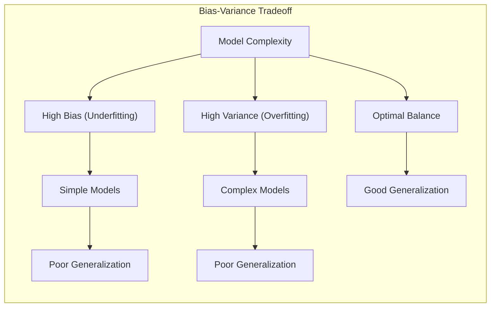
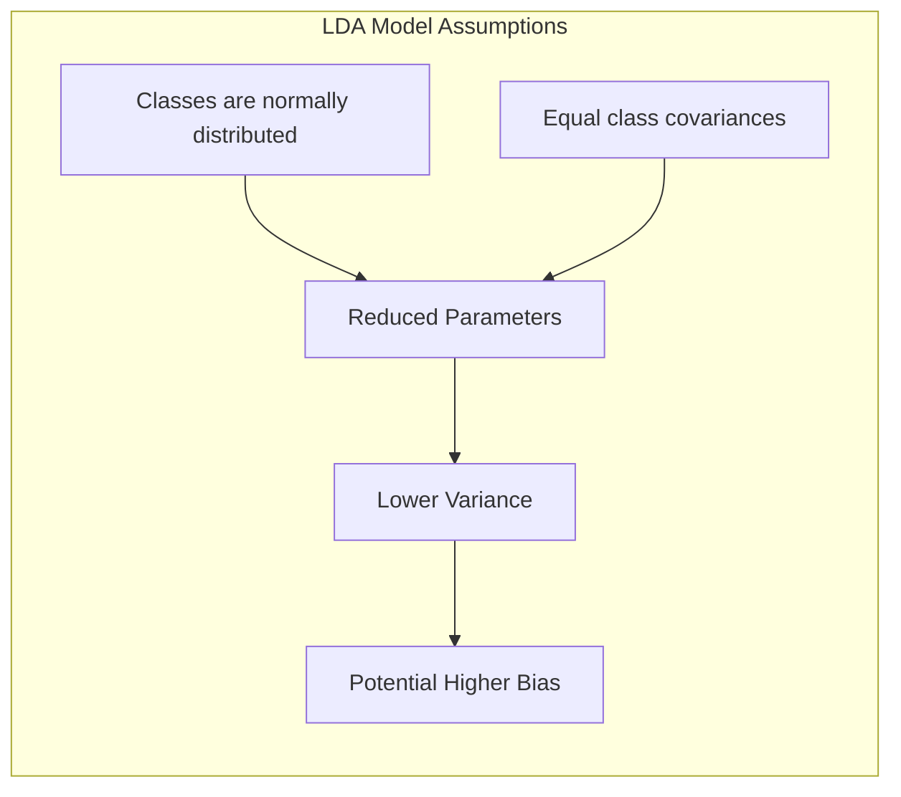
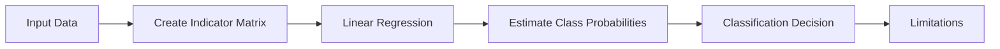
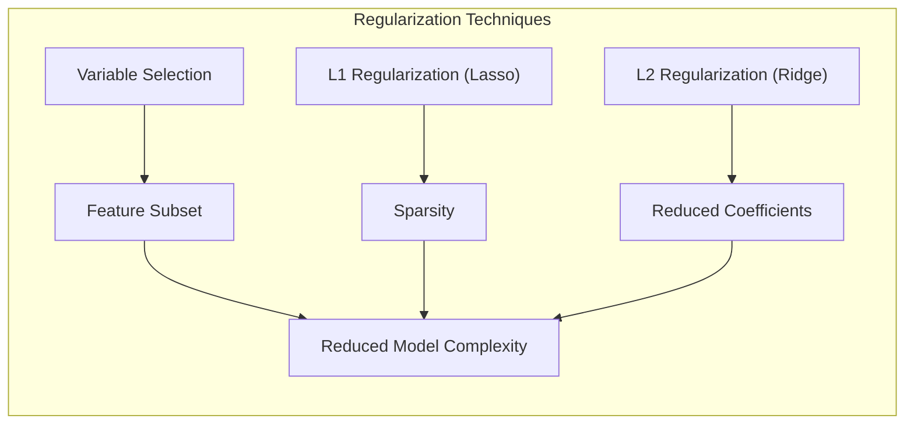
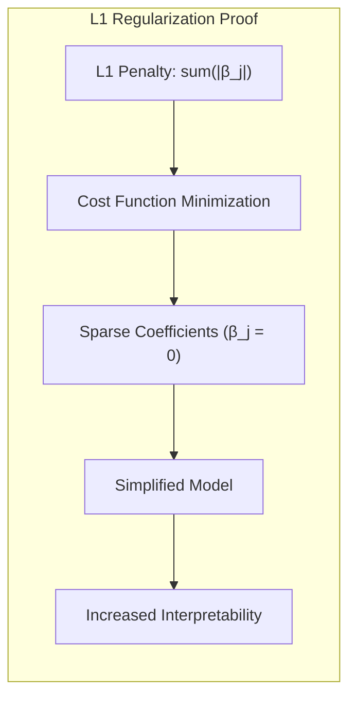
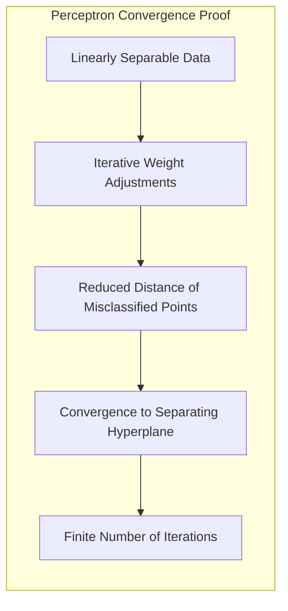
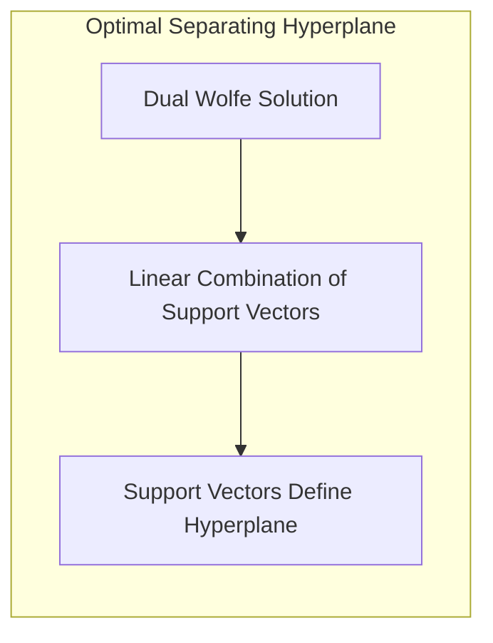

## Model Assessment and Selection: Focusing on the Effective Number of Parameters

<imagem: Mapa mental abrangente que conecta conceitos como bias-variance tradeoff, overfitting, model selection, AIC, BIC, MDL, cross-validation, bootstrap e o papel da complexidade do modelo, todos convergindo para o conceito central de "Effective Number of Parameters", incluindo também uma representação visual do tradeoff entre bias e variance com curvas de erro.>

### Introdução

A avaliação e seleção de modelos são etapas cruciais no aprendizado estatístico, pois determinam a capacidade de generalização de um modelo, ou seja, sua performance em dados não vistos [^7.1]. O objetivo principal é escolher o modelo que melhor se ajusta aos dados, evitando tanto o *underfitting* (quando o modelo é muito simples e não captura a complexidade dos dados) quanto o *overfitting* (quando o modelo é muito complexo e se ajusta ao ruído nos dados, em vez do padrão subjacente) [^7.2]. Este capítulo abordará a importância do conceito de **número efetivo de parâmetros** (*effective number of parameters*) para lidar com esse desafio, explorando técnicas estatísticas e de aprendizado de máquina que ajudam a balancear complexidade e performance.

### Conceitos Fundamentais

Para entender o papel do número efetivo de parâmetros, é fundamental compreender alguns conceitos básicos:

**Conceito 1: O Problema da Classificação e o Tradeoff Bias-Variance**
O problema de classificação consiste em atribuir uma classe a um dado de entrada, com base em um conjunto de dados de treinamento [^7.1]. Métodos lineares, embora simples, podem apresentar um bom desempenho em muitos casos, mas é crucial entender o tradeoff entre viés (*bias*) e variância (*variance*). Um modelo com alto viés (baixo número de parâmetros) simplifica demais a relação entre os dados de entrada e saída, levando ao *underfitting*, enquanto um modelo com alta variância (alto número de parâmetros) se ajusta demasiadamente aos dados de treinamento, causando *overfitting*. A complexidade do modelo, medida pelo número efetivo de parâmetros, desempenha um papel chave nesse tradeoff [^7.2].
**Lemma 1:** Em modelos lineares, a complexidade (número de parâmetros) está diretamente relacionada à capacidade do modelo de se ajustar aos dados. No entanto, essa capacidade aumenta a variância do modelo, o que pode levar a um desempenho inferior em dados não vistos.
$$ Complexidade \uparrow \implies Variância \uparrow$$
Um aumento na complexidade do modelo, ou seja, a adição de mais parâmetros ou features, pode fazer com que o modelo se ajuste perfeitamente aos dados de treinamento, levando a um erro de treinamento próximo de zero [^7.2]. No entanto, essa adaptação excessiva aos dados de treinamento pode resultar em um desempenho ruim em novos dados, o que é conhecido como *overfitting* [^7.2]. O *tradeoff* entre viés e variância é essencial para entender como a complexidade do modelo afeta sua capacidade de generalização [^7.2].

> 💡 **Exemplo Numérico:** Vamos considerar um cenário de classificação binária com uma variável preditora $X$ e uma variável de resposta $Y$ (0 ou 1).
>
> 1.  **Modelo Simples (Underfitting):**  Um modelo linear simples, $\hat{Y} = \beta_0 + \beta_1 X$, pode não ser capaz de capturar a relação real se os dados tiverem uma forma não linear. Suponha que os dados tenham uma relação quadrática. O modelo simples terá um alto viés e baixa variância.
>
>     ```python
>     import numpy as np
>     import matplotlib.pyplot as plt
>     from sklearn.linear_model import LogisticRegression
>     from sklearn.preprocessing import PolynomialFeatures
>
>     # Generate synthetic data with quadratic relationship
>     np.random.seed(0)
>     X = np.sort(5 * np.random.rand(80, 1), axis=0)
>     y = (X[:, 0]**2 + np.random.randn(80)*2 > 10).astype(int)
>
>     # Fit a simple logistic regression model
>     model_simple = LogisticRegression()
>     model_simple.fit(X, y)
>
>     # Predict on a grid for visualization
>     X_grid = np.linspace(0, 5, 100).reshape(-1, 1)
>     y_pred_simple = model_simple.predict_proba(X_grid)[:, 1]
>
>     # Plot
>     plt.figure(figsize=(8,6))
>     plt.scatter(X,y,label='Data',color='blue')
>     plt.plot(X_grid,y_pred_simple,label='Simple Model',color='red')
>     plt.xlabel('X')
>     plt.ylabel('Probability of Y=1')
>     plt.title('Underfitting - Simple Model')
>     plt.legend()
>     plt.show()
>     ```
>     Neste caso, a linha vermelha (modelo simples) não se ajusta bem aos dados. O erro de treinamento e de teste serão altos.
>
> 2. **Modelo Complexo (Overfitting):** Um modelo mais complexo, como um polinômio de grau 9, $\hat{Y} = \beta_0 + \beta_1 X + \beta_2 X^2 + \ldots + \beta_9 X^9$, pode ajustar-se perfeitamente aos dados de treinamento, mas apresentar um mau desempenho em novos dados. Ele terá baixo viés e alta variância.
>
>     ```python
>     # Fit a complex logistic regression model
>     poly = PolynomialFeatures(degree=9)
>     X_poly = poly.fit_transform(X)
>     model_complex = LogisticRegression()
>     model_complex.fit(X_poly, y)
>
>     X_grid_poly = poly.transform(X_grid)
>     y_pred_complex = model_complex.predict_proba(X_grid_poly)[:, 1]
>
>     #Plot
>     plt.figure(figsize=(8,6))
>     plt.scatter(X,y,label='Data',color='blue')
>     plt.plot(X_grid,y_pred_complex,label='Complex Model',color='green')
>     plt.xlabel('X')
>     plt.ylabel('Probability of Y=1')
>     plt.title('Overfitting - Complex Model')
>     plt.legend()
>     plt.show()
>     ```
>   Neste caso, a linha verde (modelo complexo) se ajusta bem aos dados de treinamento mas pode não generalizar bem.
>
> 3. **Modelo Adequado:** Um modelo com um nível de complexidade adequado (e.g. polinômio de grau 2), equilibraria o viés e a variância, oferecendo boa capacidade de generalização.
>  ```python
>     # Fit a balanced logistic regression model
>     poly = PolynomialFeatures(degree=2)
>     X_poly = poly.fit_transform(X)
>     model_balanced = LogisticRegression()
>     model_balanced.fit(X_poly, y)
>
>     X_grid_poly = poly.transform(X_grid)
>     y_pred_balanced = model_balanced.predict_proba(X_grid_poly)[:, 1]
>
>      #Plot
>     plt.figure(figsize=(8,6))
>     plt.scatter(X,y,label='Data',color='blue')
>     plt.plot(X_grid,y_pred_balanced,label='Balanced Model',color='purple')
>     plt.xlabel('X')
>     plt.ylabel('Probability of Y=1')
>     plt.title('Balanced Model')
>     plt.legend()
>     plt.show()
>  ```
>   Neste caso, a linha roxa (modelo balanceado) se ajusta bem aos dados e generaliza bem.



**Conceito 2: Linear Discriminant Analysis (LDA)**
A Análise Discriminante Linear (LDA) é uma técnica de classificação que assume que as classes são normalmente distribuídas com covariâncias iguais. O objetivo da LDA é encontrar uma combinação linear das variáveis de entrada que maximize a separação entre as classes [^7.3]. A fronteira de decisão gerada pela LDA é linear e a complexidade do modelo está relacionada ao número de variáveis de entrada, que podem ser controladas por meio de técnicas de seleção de variáveis e regularização. Um modelo LDA com um número excessivo de features pode levar a overfitting e ao aumento da variância da estimação [^7.3.1], [^7.3.2].
**Corolário 1:** A LDA, ao assumir que as classes são normalmente distribuídas com covariâncias iguais, reduz o número de parâmetros a serem estimados em comparação com um modelo mais geral que não impõe essas restrições. Essa restrição torna o LDA um método com menor variância, embora isso possa vir ao custo de um maior viés se a suposição de normalidade não for válida.

> ⚠️ **Nota Importante**: É crucial verificar as suposições da LDA, como normalidade e covariâncias iguais, para garantir que o método seja adequado para os dados em questão [^7.3.1], [^7.3.2].



> 💡 **Exemplo Numérico:**  Suponha que temos um conjunto de dados com duas classes e duas variáveis preditoras. Vamos usar um exemplo simples para ilustrar o LDA.
>
> ```python
> import numpy as np
> import matplotlib.pyplot as plt
> from sklearn.discriminant_analysis import LinearDiscriminantAnalysis
> from sklearn.model_selection import train_test_split
>
> # Generate synthetic data
> np.random.seed(0)
> mean1 = [1, 1]
> cov1 = [[1, 0.5], [0.5, 1]]
> data1 = np.random.multivariate_normal(mean1, cov1, 100)
>
> mean2 = [4, 4]
> cov2 = [[1, 0.2], [0.2, 1]]
> data2 = np.random.multivariate_normal(mean2, cov2, 100)
>
> X = np.concatenate((data1, data2))
> y = np.concatenate((np.zeros(100), np.ones(100)))
>
> # Split data into training and testing sets
> X_train, X_test, y_train, y_test = train_test_split(X, y, test_size=0.3, random_state=42)
>
> # Apply LDA
> lda = LinearDiscriminantAnalysis()
> lda.fit(X_train, y_train)
>
> # Predict on the test set
> y_pred = lda.predict(X_test)
>
> # Calculate the accuracy
> accuracy = np.mean(y_pred == y_test)
> print(f"Accuracy: {accuracy}")
>
> # Plot decision boundary
> x_min, x_max = X[:, 0].min() - 1, X[:, 0].max() + 1
> y_min, y_max = X[:, 1].min() - 1, X[:, 1].max() + 1
> xx, yy = np.meshgrid(np.arange(x_min, x_max, 0.02), np.arange(y_min, y_max, 0.02))
> Z = lda.predict(np.c_[xx.ravel(), yy.ravel()])
> Z = Z.reshape(xx.shape)
>
> plt.figure(figsize=(8, 6))
> plt.contourf(xx, yy, Z, alpha=0.3)
> plt.scatter(X[:, 0], X[:, 1], c=y, edgecolors='k')
> plt.title("LDA Decision Boundary")
> plt.xlabel("Feature 1")
> plt.ylabel("Feature 2")
> plt.show()
>
>
> ```
>  Este código gera dados sintéticos para duas classes e depois aplica o LDA. Podemos observar o comportamento linear da fronteira de decisão gerada pelo LDA, e como ele busca separar as duas classes usando combinações lineares das variáveis. O valor de acurácia mostra a performance do modelo. A complexidade é determinada pelo número de features (2 neste caso).

**Conceito 3: Regressão Logística**
A regressão logística é um método para modelar a probabilidade de uma variável categórica binária. Ao contrário da LDA, a regressão logística não impõe suposições sobre a distribuição das variáveis de entrada e modela diretamente a probabilidade de pertinência a uma classe, através de uma transformação *logit* [^7.4]. O modelo linear da regressão logística é também afetado pelo número de variáveis (parâmetros) utilizados, e técnicas de regularização, como penalização L1 e L2, podem ser utilizadas para controlar a complexidade do modelo e evitar o *overfitting* [^7.4.4]. A verossimilhança dos dados é maximizada para encontrar os melhores parâmetros que relacionam as variáveis de entrada com as classes de saída.

> ❗ **Ponto de Atenção**: A escolha entre LDA e regressão logística depende das características dos dados e das suposições que podemos fazer sobre eles [^7.4.5]. Em alguns casos, uma abordagem é mais apropriada do que a outra.

> 💡 **Exemplo Numérico:** Utilizando os mesmos dados gerados para o exemplo do LDA, vamos aplicar a regressão logística, e comparar os resultados.
>
>```python
> import numpy as np
> import matplotlib.pyplot as plt
> from sklearn.linear_model import LogisticRegression
> from sklearn.model_selection import train_test_split
>
> # Generate synthetic data (same as LDA example)
> np.random.seed(0)
> mean1 = [1, 1]
> cov1 = [[1, 0.5], [0.5, 1]]
> data1 = np.random.multivariate_normal(mean1, cov1, 100)
>
> mean2 = [4, 4]
> cov2 = [[1, 0.2], [0.2, 1]]
> data2 = np.random.multivariate_normal(mean2, cov2, 100)
>
> X = np.concatenate((data1, data2))
> y = np.concatenate((np.zeros(100), np.ones(100)))
>
> # Split data into training and testing sets
> X_train, X_test, y_train, y_test = train_test_split(X, y, test_size=0.3, random_state=42)
>
> # Apply logistic regression
> logistic_model = LogisticRegression()
> logistic_model.fit(X_train, y_train)
>
> # Predict on the test set
> y_pred = logistic_model.predict(X_test)
>
> # Calculate the accuracy
> accuracy = np.mean(y_pred == y_test)
> print(f"Accuracy: {accuracy}")
>
> # Plot decision boundary
> x_min, x_max = X[:, 0].min() - 1, X[:, 0].max() + 1
> y_min, y_max = X[:, 1].min() - 1, X[:, 1].max() + 1
> xx, yy = np.meshgrid(np.arange(x_min, x_max, 0.02), np.arange(y_min, y_max, 0.02))
> Z = logistic_model.predict(np.c_[xx.ravel(), yy.ravel()])
> Z = Z.reshape(xx.shape)
>
> plt.figure(figsize=(8, 6))
> plt.contourf(xx, yy, Z, alpha=0.3)
> plt.scatter(X[:, 0], X[:, 1], c=y, edgecolors='k')
> plt.title("Logistic Regression Decision Boundary")
> plt.xlabel("Feature 1")
> plt.ylabel("Feature 2")
> plt.show()
>```
>
> Podemos ver que a fronteira de decisão é também linear, como no LDA. A performance, medida pela acurácia, pode ser similar, mas com um ajuste diferente. A complexidade também é controlada pelo número de features.

### Regressão Linear e Mínimos Quadrados para Classificação

<imagem: Diagrama de fluxo que ilustra o processo de regressão de indicadores para classificação. O diagrama mostra a entrada de dados, a criação da matriz de indicadores, a aplicação da regressão linear, o cálculo das estimativas de classe e a tomada de decisão final com base em um limiar pré-definido. O diagrama também destaca as possíveis limitações do método em cenários de classes não balanceadas.>


**Explicação:** Este diagrama representa o fluxo do processo de regressão de indicadores e como ele se relaciona à classificação, conforme descrito nos tópicos [^7.2].

A regressão linear, quando aplicada a uma matriz de indicadores, pode ser usada para tarefas de classificação [^7.2]. Cada classe é representada por uma variável indicadora, que assume o valor 1 se a observação pertence à classe e 0 caso contrário. A regressão linear é usada para modelar cada variável indicadora como uma função linear das variáveis de entrada. As estimativas obtidas são então usadas para fazer uma previsão de classe [^7.2]. A complexidade desse modelo, assim como nos outros modelos lineares, é controlada pelo número de variáveis de entrada. Uma desvantagem é a possibilidade de gerar estimativas fora do intervalo [0, 1] [^7.4], o que dificulta a interpretação probabilística.
**Lemma 2:** A regressão linear aplicada a uma matriz de indicadores, apesar de ser um modelo de classificação, pode ter resultados similares à LDA sob algumas condições específicas, especialmente quando as classes são bem separadas. No entanto, a regressão linear não é otimizada diretamente para a classificação, ao contrário da LDA, que busca maximizar a separação das classes.

**Corolário 2:** A fronteira de decisão obtida pela regressão linear em matriz de indicadores pode ser linear, assim como na LDA, mas as estimativas de probabilidade podem ser menos precisas, especialmente quando as classes são desequilibradas ou não linearmente separáveis.

> ⚠️ **Ponto Crucial:** A regressão linear pode ser utilizada para classificação, porém, modelos mais apropriados como regressão logística e LDA devem ser considerados quando há suposições sobre a distribuição dos dados.

> 💡 **Exemplo Numérico:** Vamos gerar dados para um problema de classificação com 3 classes, usar a matriz indicadora e aplicar a regressão linear para classificação, mostrando a fronteira de decisão.
>
>```python
>import numpy as np
>import matplotlib.pyplot as plt
>from sklearn.linear_model import LinearRegression
>from sklearn.model_selection import train_test_split
>
> # Generate synthetic data with 3 classes
>np.random.seed(0)
>mean1 = [1, 1]
>cov1 = [[1, 0.3], [0.3, 1]]
>data1 = np.random.multivariate_normal(mean1, cov1, 50)
>
>mean2 = [5, 5]
>cov2 = [[1, 0.1], [0.1, 1]]
>data2 = np.random.multivariate_normal(mean2, cov2, 50)
>
>mean3 = [2, 6]
>cov3 = [[1, -0.2], [-0.2, 1]]
>data3 = np.random.multivariate_normal(mean3, cov3, 50)
>
>X = np.concatenate((data1, data2, data3))
>y = np.concatenate((np.zeros(50), np.ones(50), 2 * np.ones(50))).astype(int)
>
> # Create indicator matrix
>indicator_matrix = np.zeros((len(y), 3))
>for i, class_label in enumerate(y):
>    indicator_matrix[i, class_label] = 1
>
> # Split data into training and testing sets
>X_train, X_test, y_train, y_test = train_test_split(X, indicator_matrix, test_size=0.3, random_state=42)
>
> # Apply linear regression
>linear_model = LinearRegression()
>linear_model.fit(X_train, y_train)
>
> # Predict on test set
>y_pred_probs = linear_model.predict(X_test)
>y_pred = np.argmax(y_pred_probs, axis=1)
>y_test_classes = np.argmax(y_test,axis=1)
>
> # Calculate the accuracy
>accuracy = np.mean(y_pred == y_test_classes)
>print(f"Accuracy: {accuracy}")
>
> # Plot decision boundary
>x_min, x_max = X[:, 0].min() - 1, X[:, 0].max() + 1
>y_min, y_max = X[:, 1].min() - 1, X[:, 1].max() + 1
>xx, yy = np.meshgrid(np.arange(x_min, x_max, 0.02), np.arange(y_min, y_max, 0.02))
>Z_probs = linear_model.predict(np.c_[xx.ravel(), yy.ravel()])
>Z = np.argmax(Z_probs,axis=1)
>Z = Z.reshape(xx.shape)
>
>plt.figure(figsize=(8, 6))
>plt.contourf(xx, yy, Z, alpha=0.3,cmap=plt.cm.viridis)
>plt.scatter(X[:, 0], X[:, 1], c=y, edgecolors='k')
>plt.title("Linear Regression Decision Boundary")
>plt.xlabel("Feature 1")
>plt.ylabel("Feature 2")
>plt.show()
>```
>
> No código, geramos 3 classes de dados e a matriz indicadora, aplicamos regressão linear e plotamos a fronteira de decisão. Podemos observar as fronteiras lineares geradas. A acurácia mostra a performance. As estimativas da regressão linear podem ser maiores que 1 ou menores que 0, o que demonstra a limitação do método quando comparado com o LDA e regressão logística. A complexidade do modelo é também controlada pelo número de features.

### Métodos de Seleção de Variáveis e Regularização em Classificação

<imagem: Mapa mental que integra os conceitos de seleção de variáveis e regularização com os modelos de classificação discutidos, incluindo LDA, regressão logística e hiperplanos separadores. O mapa mental destaca o objetivo de controlar a complexidade do modelo e evitar o overfitting, através de técnicas como penalização L1 e L2, com setas que conectam cada técnica ao conceito de *effective number of parameters* (número efetivo de parâmetros).>



A seleção de variáveis e a regularização são técnicas cruciais para controlar a complexidade dos modelos de classificação [^7.4.4], [^7.5]. A seleção de variáveis envolve a escolha de um subconjunto relevante de variáveis de entrada para construir o modelo, reduzindo o risco de *overfitting* e melhorando a interpretabilidade [^7.5.1]. Já a regularização adiciona um termo de penalização à função de custo, forçando o modelo a usar coeficientes menores, o que resulta em modelos mais estáveis e menos propensos a *overfitting* [^7.4.4], [^7.5]. A regularização L1 (Lasso) promove a esparsidade, selecionando automaticamente um subconjunto de variáveis, enquanto a regularização L2 (Ridge) reduz os coeficientes em geral [^7.4.4].
**Lemma 3:** A penalização L1 em classificação logística leva a coeficientes esparsos, o que significa que muitas variáveis terão coeficientes iguais a zero, simplificando o modelo e facilitando sua interpretação [^7.4.4].

**Prova do Lemma 3:** A penalização L1 adiciona um termo à função de custo que é proporcional à soma dos valores absolutos dos coeficientes, $$ \sum_{j=1}^{p} |\beta_j| $$. Ao minimizar essa função, o modelo tende a atribuir coeficientes zero para algumas variáveis, resultando em um modelo mais esparso e interpretável [^7.4.4]. Este comportamento é uma característica das normas L1 em problemas de otimização. $\blacksquare$



**Corolário 3:** A esparsidade induzida pela penalização L1 não só melhora a interpretabilidade do modelo, mas também pode aumentar sua capacidade de generalização, ao reduzir a complexidade do modelo e o *overfitting* [^7.4.4], [^7.5].

> ⚠️ **Ponto Crucial**: A escolha da técnica de regularização (L1, L2, ou elastic net) depende do problema específico e dos objetivos de modelagem. O uso combinado de L1 e L2, por meio do Elastic Net, pode trazer benefícios em termos de esparsidade e redução da variância.

> 💡 **Exemplo Numérico:** Vamos demonstrar o efeito da regularização L1 (Lasso) em um modelo de regressão logística com um conjunto de dados simulados com muitas features.
>
>```python
> import numpy as np
> import matplotlib.pyplot as plt
> from sklearn.linear_model import LogisticRegression
> from sklearn.model_selection import train_test_split
> from sklearn.metrics import accuracy_score
>
> # Generate synthetic data with 20 features
> np.random.seed(0)
> n_samples = 150
> n_features = 20
>
> # Generate random feature data
>X = np.random.randn(n_samples, n_features)
>
> # Create a linear combination of features with some noise
>true_coef = np.random.randn(n_features)
>y_prob = 1 / (1 + np.exp(-np.dot(X, true_coef)))
>y = (y_prob > 0.5).astype(int)
>
> # Split data
>X_train, X_test, y_train, y_test = train_test_split(X, y, test_size=0.3, random_state=42)
>
> # Logistic Regression without regularization
>logistic_no_reg = LogisticRegression(penalty=None)
>logistic_no_reg.fit(X_train, y_train)
>y_pred_no_reg = logistic_no_reg.predict(X_test)
>accuracy_no_reg = accuracy_score(y_test, y_pred_no_reg)
>
> # Logistic Regression with L1 regularization (Lasso)
>logistic_l1 = LogisticRegression(penalty='l1', solver='liblinear', C=0.1)
>logistic_l1.fit(X_train, y_train)
>y_pred_l1 = logistic_l1.predict(X_test)
>accuracy_l1 = accuracy_score(y_test, y_pred_l1)
>
> # Print results
>print(f"Accuracy without regularization: {accuracy_no_reg}")
>print(f"Accuracy with L1 regularization: {accuracy_l1}")
>
> # Show coefficients
>print("\nCoefficients without regularization:")
>print(logistic_no_reg.coef_.flatten())
>print("\nCoefficients with L1 regularization:")
>print(logistic_l1.coef_.flatten())
>
># Plot coefficients
>plt.figure(figsize=(10,6))
>plt.stem(range(n_features), logistic_no_reg.coef_.flatten(),label='No Regularization',markerfmt='bo',use_line_collection=True)
>plt.stem(range(n_features), logistic_l1.coef_.flatten(),label='L1 Regularization',markerfmt='rx',use_line_collection=True)
>plt.xlabel('Feature Index')
>plt.ylabel('Coefficient Value')
>plt.title('Comparison of Coefficients with and without L1 Regularization')
>plt.legend()
>plt.show()
>```
>
> Podemos ver como a regularização L1 reduz alguns coeficientes a zero (esparsidade), simplificando o modelo. A acurácia pode ser similar ou melhor, indicando que a regularização é capaz de melhorar a capacidade de generalização. O gráfico compara os coeficientes, mostrando o efeito da esparsidade da regularização L1.

### Separating Hyperplanes e Perceptrons

A ideia de maximizar a margem de separação entre classes leva ao conceito de hiperplanos separadores ótimos [^7.5.2]. O objetivo é encontrar o hiperplano que melhor separa os dados de treinamento, maximizando a distância entre as classes, o que pode aumentar a capacidade de generalização do modelo. A formulação desse problema de otimização envolve o uso de multiplicadores de Lagrange e o dual de Wolfe, permitindo uma solução em função dos pontos de suporte. O Perceptron de Rosenblatt é um modelo clássico para aprendizado de hiperplanos separadores que ajusta iterativamente seus pesos até encontrar um hiperplano que separe as classes, desde que estas sejam linearmente separáveis [^7.5.1].
**Teorema 1:** Sob condições de linear separabilidade, o algoritmo do Perceptron converge para um hiperplano que separa as classes em um número finito de iterações [^7.5.1].

**Prova do Teorema 1:** A prova envolve mostrar que a cada iteração o algoritmo diminui a distância entre os pontos mal classificados e o hiperplano. A cada ajuste, a distância é reduzida, e dado que existe uma solução (hiperplano separador), o algoritmo converge para ela em um número finito de iterações [^7.5.1]. $\blacksquare$



**Lemma 4:** A solução do hiperplano separador ótimo, usando o dual de Wolfe, pode ser expressa como uma combinação linear dos pontos de suporte, ou seja, os pontos de treinamento mais próximos da fronteira de decisão [^7.5.2]. Esses pontos de suporte são cruciais para definir a localização do hiperplano.



> 💡 **Exemplo Numérico:** Vamos implementar o Perceptron de Rosenblatt com dados linearmente separáveis.
>
>```python
> import numpy as np
> import matplotlib.pyplot as plt
> from sklearn.model_selection import train_test_split
>
> # Generate linearly separable data
> np.random.seed(0)
> mean1 = [1, 1]
> cov1 = [[1, 0], [0, 1]]
> data1 = np.random.multivariate_normal(mean1, cov1, 50)
>
> mean2 = [4, 4]
> cov2 = [[1, 0], [0, 1]]
> data2 = np.random.multivariate_normal(mean2, cov2, 50)
>
> X = np.concatenate((data1, data2))
> y = np.concatenate((np.zeros(50), np.ones(50)))
>
> # Split the data
>X_train, X_test, y_train, y_test = train_test_split(X, y, test_size=0.3, random_state=42)
>
> # Perceptron implementation
>class Perceptron:
>   def __init__(self, learning_rate=0.1, n_iterations=100):
>       self.learning_rate = learning_rate
>       self.n_iterations = n_iterations
>       self.weights = None
>       self.bias = None
>
>   def fit(self, X, y):
>       n_samples, n_features = X.shape
>       self.weights = np.zeros(n_features)
>       self.bias = 0
>
>       for _ in range(self.n_iterations):
>           for i, x in enumerate(X):
>               linear_output = np.dot(x, self.weights) + self.bias
>               y_predicted = 1 if linear_output >= 0 else 0
>               update = self.learning_rate * (y[i] - y_predicted)
>
>               self.weights += update * x
>               self.bias += update
>
>
>   def predict(self, X):
>       linear_output = np.dot(X, self.weights) + self.bias
>       y_predicted = np.where(linear_output >= 0, 1, 0)
>       