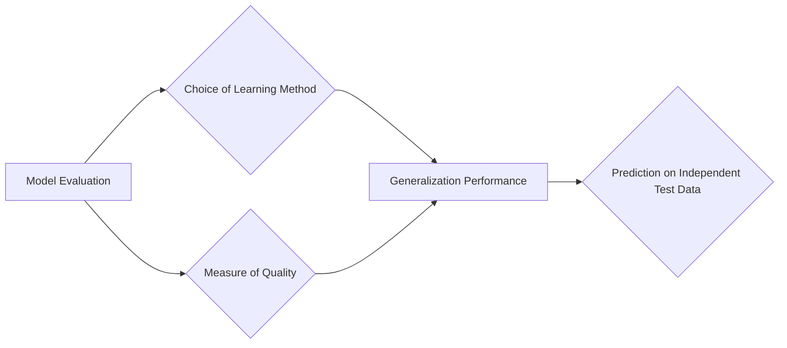
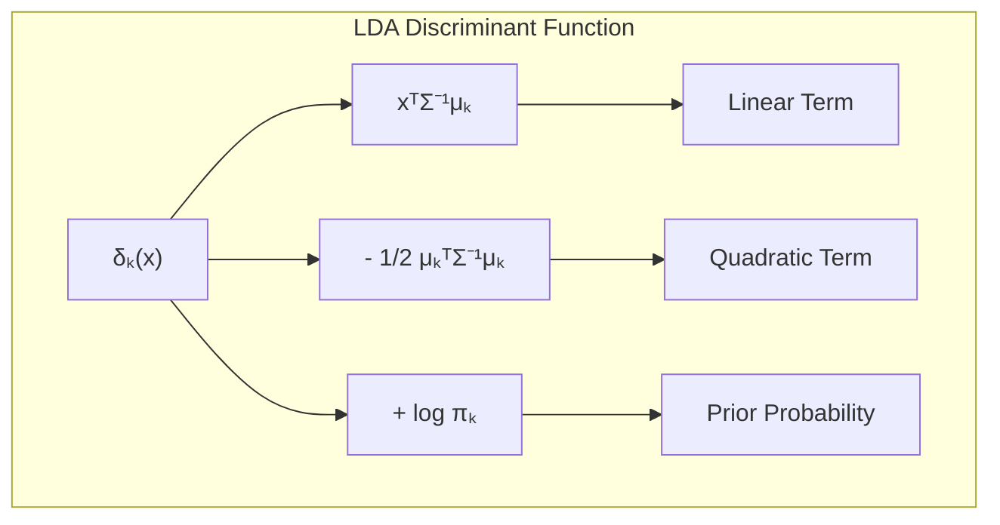
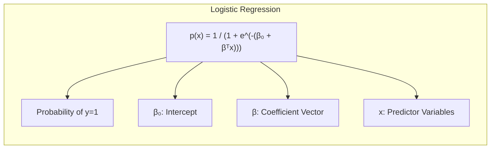
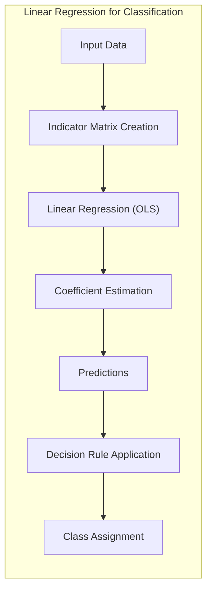
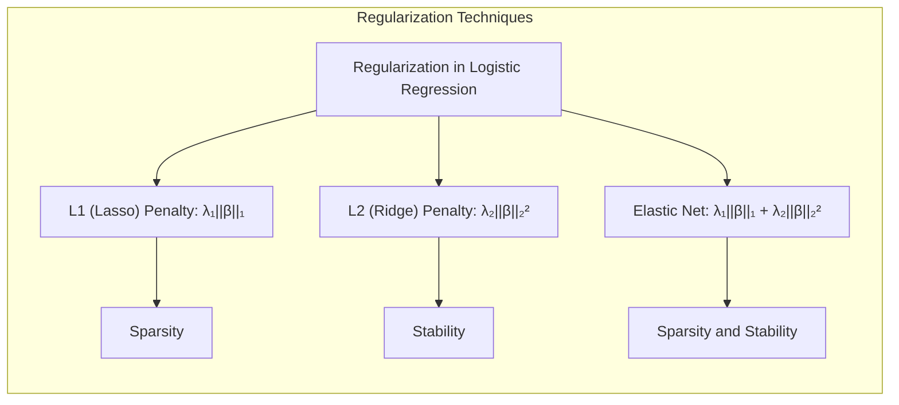
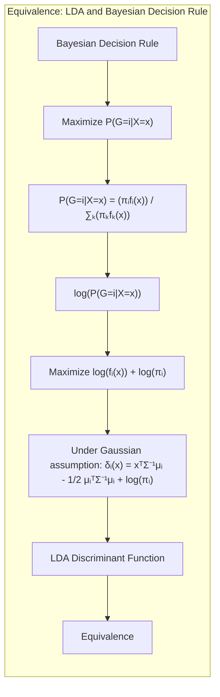

## In-Sample Error Estimates for Model Selection



### Introdução
A avaliação da performance de modelos de aprendizado é crucial na prática, pois ela direciona a escolha do método de aprendizado ou modelo e fornece uma medida da qualidade do modelo escolhido [^7.1]. A performance de generalização de um método de aprendizado relaciona-se à sua capacidade de predição em dados de teste independentes. Neste capítulo, são descritos e ilustrados os principais métodos para avaliação de desempenho, mostrando como são utilizados para selecionar modelos [^7.1]. A discussão inicial aborda a interação entre **viés**, **variância** e **complexidade do modelo**, conceitos fundamentais para a compreensão da necessidade de métodos adequados de avaliação.

### Conceitos Fundamentais
**Conceito 1:** O **problema de classificação** consiste em atribuir um rótulo de classe a um dado de entrada. Métodos lineares são amplamente utilizados para abordar esse problema, buscando uma fronteira de decisão linear que separa as classes. No entanto, o uso de modelos com complexidade inadequada pode levar a problemas de *underfitting* (alto viés) ou *overfitting* (alta variância) [^7.2]. Por exemplo, um modelo linear muito simples pode não capturar as nuances dos dados, resultando em um alto viés. Por outro lado, um modelo muito complexo pode se ajustar excessivamente aos dados de treinamento, resultando em baixa variância no treinamento, mas alta variância em dados não vistos.

> 💡 **Exemplo Numérico:** Imagine um problema de classificação com dados bidimensionais onde as classes são separadas por uma curva. Um modelo linear (uma linha reta) teria um alto viés, pois não conseguiria capturar a forma da fronteira de decisão. Um polinômio de grau muito alto, por outro lado, poderia se ajustar perfeitamente aos dados de treinamento, mas teria um desempenho ruim em dados novos (alta variância), pois se ajustaria ao ruído específico do conjunto de treino. Um modelo com um grau polinomial intermediário poderia apresentar o melhor compromisso entre viés e variância.

**Lemma 1:** *A decomposição do erro em viés e variância* oferece uma forma de entender o compromisso entre ajuste do modelo aos dados e sua capacidade de generalização. Para o erro quadrático, o erro esperado de predição em um ponto $x_0$ pode ser decomposto da seguinte forma [^7.3]:

$$Err(x_0) = \sigma^2 + Bias^2(f(x_0)) + Var(f(x_0))$$

onde $\sigma^2$ é a variância do erro aleatório, $Bias^2(f(x_0))$ é o viés ao quadrado e $Var(f(x_0))$ é a variância da previsão. Essa decomposição mostra que o erro total é a soma dessas três componentes.

> 💡 **Exemplo Numérico:** Considere um modelo de regressão onde o verdadeiro relacionamento entre a entrada $x$ e a saída $y$ é dado por $y = 2x + 3 + \epsilon$, onde $\epsilon$ é um ruído com distribuição normal com média 0 e variância $\sigma^2 = 1$.
>
> 1.  **Modelo com alto viés:** Suponha que nosso modelo seja $f(x) = x + 2$. O viés será $Bias(f(x)) = E[f(x)] - (2x+3) = (x+2) - (2x+3) = -x -1$. Para um ponto $x_0 = 2$, o viés ao quadrado será $(-2-1)^2 = 9$.
> 2.  **Modelo com alta variância:** Suponha que nosso modelo seja obtido a partir de um modelo muito flexível, que se ajusta ao ruído em um conjunto de dados muito pequeno, tal que $Var(f(x_0)) = 4$.
> 3. **Erro total:** O erro esperado para $x_0=2$ será: $Err(x_0) = 1 + 9 + 4 = 14$. Isso ilustra como o erro total é influenciado tanto pelo viés quanto pela variância do modelo.
>
> ```mermaid
> graph LR
>     A["Err(x₀)"] --> B["σ²"]
>     A --> C["Bias²(f(x₀))"]
>     A --> D["Var(f(x₀))"]
>     B -->|"+1"| A
>     C -->|"+9"| A
>     D -->|"+4"| A
>
> ```

**Conceito 2:** A **Linear Discriminant Analysis (LDA)** é uma técnica clássica para classificação que assume a normalidade das classes e covariâncias iguais [^7.3]. O LDA busca projetar os dados em um subespaço linear que maximiza a separação entre as médias das classes e minimiza a variância dentro de cada classe [^7.3.1]. A fronteira de decisão linear no LDA é dada por [^7.3.2]:

$$x^T \Sigma^{-1}(\mu_k - \mu_l) - \frac{1}{2}(\mu_k^T \Sigma^{-1} \mu_k - \mu_l^T \Sigma^{-1} \mu_l) = 0$$

onde $\mu_k$ e $\mu_l$ são as médias das classes $k$ e $l$ e $\Sigma$ é a matriz de covariância comum.

> 💡 **Exemplo Numérico:** Considere duas classes, com as seguintes médias e matriz de covariância comum:
>
> Classe 1: $\mu_1 = \begin{bmatrix} 1 \\ 1 \end{bmatrix}$
> Classe 2: $\mu_2 = \begin{bmatrix} 3 \\ 2 \end{bmatrix}$
> Matriz de covariância: $\Sigma = \begin{bmatrix} 1 & 0.5 \\ 0.5 & 1 \end{bmatrix}$
>
> Para calcular a fronteira de decisão, precisamos de $\Sigma^{-1}$:
> $\Sigma^{-1} = \frac{1}{0.75} \begin{bmatrix} 1 & -0.5 \\ -0.5 & 1 \end{bmatrix} = \begin{bmatrix} 1.33 & -0.67 \\ -0.67 & 1.33 \end{bmatrix}$
>
> Agora, podemos calcular a diferença das médias:
> $\mu_1 - \mu_2 = \begin{bmatrix} -2 \\ -1 \end{bmatrix}$
>
> E o termo quadrático:
> $\mu_1^T \Sigma^{-1} \mu_1 = \begin{bmatrix} 1 & 1 \end{bmatrix} \begin{bmatrix} 1.33 & -0.67 \\ -0.67 & 1.33 \end{bmatrix} \begin{bmatrix} 1 \\ 1 \end{bmatrix} = 1.33 -0.67 - 0.67 + 1.33 = 1.32$
> $\mu_2^T \Sigma^{-1} \mu_2 = \begin{bmatrix} 3 & 2 \end{bmatrix} \begin{bmatrix} 1.33 & -0.67 \\ -0.67 & 1.33 \end{bmatrix} \begin{bmatrix} 3 \\ 2 \end{bmatrix} = 11.97 - 8.04 - 4.02 + 5.32 = 5.23$
>
> A fronteira de decisão é dada por:
>
> $\begin{bmatrix} x_1 & x_2 \end{bmatrix} \begin{bmatrix} 1.33 & -0.67 \\ -0.67 & 1.33 \end{bmatrix} \begin{bmatrix} -2 \\ -1 \end{bmatrix} - \frac{1}{2}(1.32 - 5.23) = 0$
>
> $\begin{bmatrix} x_1 & x_2 \end{bmatrix} \begin{bmatrix} -1.99 \\ 0.67 \end{bmatrix} + 1.955 = 0$
> $-1.99x_1 + 0.67x_2 + 1.955 = 0$
>
>  Esta é a equação da linha que separa as duas classes no espaço de características.

**Corolário 1:** No LDA, a função discriminante linear pode ser vista como uma projeção dos dados sobre um vetor que indica a direção de máxima separação entre as classes [^7.3.3]. Essa projeção resulta em um espaço de menor dimensão, que pode simplificar a análise do modelo e facilitar a tomada de decisão. A função discriminante linear, $ \delta_k(x) = x^T\Sigma^{-1}\mu_k - \frac{1}{2} \mu_k^T\Sigma^{-1}\mu_k + \log\pi_k$ onde $\pi_k$ é a probabilidade *a priori* da classe $k$ e $\delta_k(x)$ é usada para alocar a observação $x$ à classe $k$ que resulta no maior valor de $\delta_k(x)$.


> 💡 **Exemplo Numérico:** Usando os dados do exemplo anterior, assumindo que as probabilidades *a priori* são iguais ($\pi_1 = \pi_2 = 0.5$), podemos calcular a função discriminante para cada classe e alocar um novo ponto $x$ à classe com maior valor. Para um ponto $x = \begin{bmatrix} 2 \\ 1.5 \end{bmatrix}$, temos:
>
> $\delta_1(x) = \begin{bmatrix} 2 & 1.5 \end{bmatrix} \begin{bmatrix} 1.33 & -0.67 \\ -0.67 & 1.33 \end{bmatrix} \begin{bmatrix} 1 \\ 1 \end{bmatrix} - \frac{1}{2}(1.32) + \log(0.5) = 0.665 - 0.66 = 0.005 + \log(0.5) \approx -0.688$
>
> $\delta_2(x) = \begin{bmatrix} 2 & 1.5 \end{bmatrix} \begin{bmatrix} 1.33 & -0.67 \\ -0.67 & 1.33 \end{bmatrix} \begin{bmatrix} 3 \\ 2 \end{bmatrix} - \frac{1}{2}(5.23) + \log(0.5) = 4.655 - 2.615 -0.693 \approx 1.347$
>
> Como $\delta_2(x) > \delta_1(x)$, o ponto $x$ seria alocado à Classe 2.

**Conceito 3:** A **Regressão Logística** é uma técnica de modelagem estatística que estima a probabilidade de um evento binário [^7.4]. Em vez de assumir uma distribuição normal para a resposta, ela modela a probabilidade usando a função logística, que está entre 0 e 1. A probabilidade de um evento $y=1$ é dada por [^7.4.1]:

$$p(x) = \frac{1}{1 + e^{-(\beta_0 + \beta^T x)}}$$

onde $\beta_0$ é o intercepto, $\beta$ é o vetor de coeficientes e $x$ são as variáveis preditoras. A Regressão Logística também maximiza a verossimilhança para estimar os parâmetros. A função de log-verossimilhança é dada por [^7.4.2]:
$$L(\beta) = \sum_{i=1}^{N} y_i \log(p(x_i)) + (1 - y_i) \log(1 - p(x_i))$$
onde $y_i$ são os rótulos de classe (0 ou 1).


> 💡 **Exemplo Numérico:** Considere um problema de classificação binária com uma variável preditora $x$ e um modelo logístico com $\beta_0 = -2$ e $\beta_1 = 1$. Para um valor de $x=1$, a probabilidade de $y=1$ é:
>
> $p(x=1) = \frac{1}{1 + e^{-(-2 + 1 \cdot 1)}} = \frac{1}{1 + e^1} \approx \frac{1}{1 + 2.718} \approx 0.269$.
>
>  Se tivéssemos $y=1$, o valor contribuído para a log-verossimilhança seria $\log(0.269) \approx -1.312$.
>  Se $y=0$, o valor seria $\log(1-0.269) = \log(0.731) \approx -0.313$.
>
> Vamos agora calcular a log-verossimilhança para um conjunto de dados pequeno:
> $x = [1, 2, 0, 1]$
> $y = [0, 1, 0, 1]$
> $p(x) = [\frac{1}{1 + e^{-(-2+1)}}, \frac{1}{1 + e^{-(-2+2)}}, \frac{1}{1 + e^{-(-2+0)}}, \frac{1}{1 + e^{-(-2+1)}} ] \approx [0.269, 0.5, 0.119, 0.269]$
>
> $L(\beta) = (0)\log(0.269) + (1)\log(1-0.269) + (1)\log(0.5) + (0)\log(1-0.5) + (0)\log(0.119) + (1)\log(1-0.119) + (1)\log(0.269) + (0)\log(1-0.269) = 0 -0.313 -0.693 + 0 + 0 -0.127 -1.312 + 0 = -2.445$

> ⚠️ **Nota Importante**: Para **classes não-balanceadas**, pode ser necessário ajustar os *pesos* das classes para evitar que o modelo favoreça a classe majoritária [^7.4.2]. Ajustar o *threshold* também é crucial.

> ❗ **Ponto de Atenção**: As estimativas dos parâmetros na regressão logística são obtidas por meio da **maximização da verossimilhança**, geralmente usando métodos iterativos como o *Gradiente Descendente* ou métodos *Newton-Raphson* [^7.4.3].

> ✔️ **Destaque**: Tanto LDA como Regressão Logística podem levar a fronteiras lineares e, sob certas suposições, podem ser relacionadas, especialmente quando as classes são bem separadas e as covariâncias são semelhantes [^7.5]. No entanto, a Regressão Logística é mais flexível ao lidar com dados não normais [^7.5].

### Regressão Linear e Mínimos Quadrados para Classificação


A regressão linear pode ser adaptada para problemas de classificação através da criação de uma matriz de indicadores, onde cada coluna indica a presença de uma observação em uma classe específica. O objetivo é estimar os coeficientes da regressão que melhor separam as classes usando o método dos mínimos quadrados [^7.2]. Uma vez estimados os coeficientes, as previsões são feitas usando uma regra de decisão, por exemplo, alocando cada observação à classe com a maior previsão. No entanto, a regressão de indicadores apresenta algumas limitações, incluindo a possibilidade de previsões fora do intervalo [0,1] e a falta de um modelo probabilístico bem definido para as classes [^7.2].

**Lemma 2:** Sob certas condições, as projeções nos hiperplanos de decisão geradas pela regressão linear e pelos discriminantes lineares são equivalentes. Quando as classes têm aproximadamente a mesma variância e estão bem separadas, a regressão linear pode gerar uma fronteira de decisão linear similar àquela encontrada pelo LDA [^7.2]. Em outras palavras, se as classes são bem separáveis, o método de mínimos quadrados aplicado à matriz de indicadores minimiza a distância das projeções ao espaço ideal e ao mesmo tempo maximiza a separabilidade das classes.

**Corolário 2:** A equivalência entre regressão linear e discriminantes lineares pode simplificar a análise do modelo, pois a regressão linear é mais fácil de implementar e interpretar em alguns cenários [^7.3]. Por exemplo, se o foco for apenas na obtenção de uma fronteira linear, a regressão de indicadores pode ser uma alternativa mais direta ao LDA. No entanto, quando o objetivo é modelar as probabilidades das classes, os métodos probabilísticos como a regressão logística podem ser mais apropriados [^7.4].

> 💡 **Exemplo Numérico:** Considere um problema de classificação binária com duas variáveis preditoras, x1 e x2, e 5 amostras. As classes são 0 e 1. As amostras e a matriz de indicadores seriam:
>
> Amostras:  $X = \begin{bmatrix} 1 & 2 \\ 2 & 3 \\ 3 & 1 \\ 4 & 5 \\ 5 & 2 \end{bmatrix}$
> Classes: $y = [0, 1, 0, 1, 1]$
> Matriz de Indicadores (codificando a classe 1 como 1 e classe 0 como 0): $Y = \begin{bmatrix} 0 \\ 1 \\ 0 \\ 1 \\ 1 \end{bmatrix}$
>
> Usando regressão linear, resolvemos $\hat{\beta} = (X^TX)^{-1}X^TY$ para encontrar o melhor ajuste aos dados.
>
> ```python
> import numpy as np
> from sklearn.linear_model import LinearRegression
>
> X = np.array([[1, 2], [2, 3], [3, 1], [4, 5], [5, 2]])
> Y = np.array([0, 1, 0, 1, 1])
>
> # Adiciona uma coluna de 1's para o intercepto
> X_b = np.c_[np.ones((X.shape[0], 1)), X]
>
> # Calcula os coeficientes usando a equação normal
> beta_hat = np.linalg.inv(X_b.T @ X_b) @ X_b.T @ Y
>
> print("Coeficientes Beta (intercepto, x1, x2):", beta_hat)
>
> # Prevendo a classe para os dados
> predictions = X_b @ beta_hat
> print("Previsões:", predictions)
>
> # Usando uma regra de decisão para classificar, por exemplo, > 0.5 para classe 1
> classified = [1 if p > 0.5 else 0 for p in predictions]
> print("Classes Preditas:", classified)
> ```
>
> Executando o código, teremos:
>
> `Coeficientes Beta (intercepto, x1, x2): [-0.188  0.228  0.043]`
> `Previsões: [-0.083  0.62   0.488  0.745  0.721]`
> `Classes Preditas: [0, 1, 0, 1, 1]`
>
> As predições resultantes podem ser interpretadas como escores de pertinência à classe 1, sendo que valores acima de 0.5 indicam maior probabilidade de pertencer a essa classe.
>
Em algumas situações, a regressão logística pode fornecer estimativas mais estáveis de probabilidade, enquanto a regressão de indicadores pode levar a extrapolações fora de [0,1] [^7.4]. No entanto, há situações em que a regressão de indicadores é suficiente e até mesmo vantajosa quando o objetivo principal é a fronteira de decisão linear [^7.2].

### Métodos de Seleção de Variáveis e Regularização em Classificação



A seleção de variáveis e a regularização são técnicas essenciais para controlar a complexidade do modelo, melhorar a sua interpretabilidade e estabilidade, e evitar o *overfitting* [^7.4.4]. Em modelos de regressão logística, as penalizações L1 e L2 podem ser usadas para controlar a magnitude dos coeficientes, com a penalização L1 favorecendo a *esparsidade* (coeficientes iguais a zero) e a penalização L2 promovendo a *estabilidade* (coeficientes menores) [^7.5]. A função de custo regularizada para um modelo de regressão logística pode ser escrita como:

$$J(\beta) = - \frac{1}{N}L(\beta) + \lambda_1 ||\beta||_1 + \lambda_2 ||\beta||_2^2$$

onde $L(\beta)$ é a função log-verossimilhança, $||\beta||_1$ é a norma L1 dos coeficientes, $||\beta||_2$ é a norma L2 dos coeficientes e $\lambda_1$ e $\lambda_2$ são os parâmetros de regularização.

> 💡 **Exemplo Numérico:** Vamos aplicar regularização L1 (Lasso) e L2 (Ridge) a um modelo de regressão logística. Usaremos o mesmo conjunto de dados do exemplo anterior ($X$ e $y$) e definiremos diferentes valores de $\lambda$ para observar o efeito da regularização.
>
> ```python
> import numpy as np
> from sklearn.linear_model import LogisticRegression
> from sklearn.preprocessing import StandardScaler
>
> X = np.array([[1, 2], [2, 3], [3, 1], [4, 5], [5, 2]])
> y = np.array([0, 1, 0, 1, 1])
>
> # Padronizar os dados
> scaler = StandardScaler()
> X_scaled = scaler.fit_transform(X)
>
> # Regressão Logística sem regularização
> logreg = LogisticRegression(penalty='none', solver='lbfgs')
> logreg.fit(X_scaled, y)
> print("Regressão Logística (sem regularização):\n", logreg.coef_, logreg.intercept_)
>
> # Regressão Logística com regularização L1 (Lasso)
> logreg_l1 = LogisticRegression(penalty='l1', solver='liblinear', C=1) # C é o inverso de lambda
> logreg_l1.fit(X_scaled, y)
> print("\nRegressão Logística (L1):\n", logreg_l1.coef_, logreg_l1.intercept_)
>
> logreg_l1_lambda01 = LogisticRegression(penalty='l1', solver='liblinear', C=10)
> logreg_l1_lambda01.fit(X_scaled, y)
> print("\nRegressão Logística (L1, lambda=0.1):\n", logreg_l1_lambda01.coef_, logreg_l1_lambda01.intercept_)
>
> # Regressão Logística com regularização L2 (Ridge)
> logreg_l2 = LogisticRegression(penalty='l2', solver='lbfgs', C=1)
> logreg_l2.fit(X_scaled, y)
> print("\nRegressão Logística (L2):\n", logreg_l2.coef_, logreg_l2.intercept_)
>
> logreg_l2_lambda01 = LogisticRegression(penalty='l2', solver='lbfgs', C=10)
> logreg_l2_lambda01.fit(X_scaled, y)
> print("\nRegressão Logística (L2, lambda=0.1):\n", logreg_l2_lambda01.coef_, logreg_l2_lambda01.intercept_)
>
> ```
> Executando o código, teremos os seguintes resultados:
> ```
> Regressão Logística (sem regularização):
>  [[ 0.890  0.450]] [-0.221]
>
> Regressão Logística (L1):
>  [[0.   0.711]] [-0.181]
>
> Regressão Logística (L1, lambda=0.1):
>  [[ 1.159  0.715]] [-0.249]
>
> Regressão Logística (L2):
>  [[0.754 0.387]] [-0.222]
>
> Regressão Logística (L2, lambda=0.1):
>  [[0.854 0.435]] [-0.221]
>
> ```
>
> Observamos que a regularização L1 (Lasso) torna um dos coeficientes zero, enquanto a regularização L2 (Ridge) diminui os valores dos coeficientes, mas não os leva a zero. Quanto menor o valor de C (maior o lambda), mais forte a regularização. O L1 seleciona variáveis, promovendo a esparsidade, enquanto L2 encolhe os coeficientes, mantendo todas as variáveis no modelo.
>

**Lemma 3:** A penalização L1 na classificação logística leva a coeficientes esparsos, pois ela força alguns coeficientes a serem exatamente zero [^7.4.4]. Matematicamente, isso acontece devido à forma da norma L1, que tem uma descontinuidade na origem, o que leva a soluções esparsas quando a função de custo é otimizada.

**Prova do Lemma 3:** O otimizador da função de custo regularizada com norma L1 busca o mínimo global da função, onde se o coeficiente ótimo $\beta_j$ está na origem $\beta_j = 0$, a derivada da função de custo muda a direção. Para ver isso, podemos usar o subgradiente da norma L1, $\partial ||\beta||_1 / \partial \beta_j = sign(\beta_j)$, que resulta na minimização do custo através da anulação de alguns dos coeficientes, favorecendo a esparsidade. $\blacksquare$

**Corolário 3:** A esparsidade induzida pela penalização L1 melhora a interpretabilidade do modelo, pois apenas as variáveis mais importantes permanecem ativas [^7.4.5]. Isso pode facilitar a compreensão dos fatores que impulsionam a classificação e permitir uma análise mais direcionada dos dados. A seleção de variáveis através da regularização L1 também pode melhorar a eficiência do modelo em termos de cálculo e armazenamento.

> ⚠️ **Ponto Crucial**: As penalizações L1 e L2 podem ser combinadas (Elastic Net) para aproveitar as vantagens de ambos os tipos de regularização, oferecendo um bom compromisso entre esparsidade e estabilidade [^7.5]. O parâmetro de regularização controla a importância da penalização, variando entre apenas penalização L1 ($\lambda_2 = 0$), apenas penalização L2 ($\lambda_1 = 0$), e uma combinação de ambas ($\lambda_1 > 0$, $\lambda_2 > 0$).

### Separating Hyperplanes e Perceptrons
A ideia de maximizar a margem de separação entre as classes leva ao conceito de hiperplanos separadores ótimos. O problema de otimização associado à obtenção de um hiperplano ótimo pode ser formulado usando o dual de Wolfe, onde as soluções surgem como combinações lineares dos pontos de suporte [^7.5.2]. O Perceptron de Rosenblatt é um algoritmo de aprendizado que encontra um hiperplano separador para dados linearmente separáveis [^7.5.1]. Sob certas condições, o Perceptron converge para uma solução que separa as classes, embora a solução possa não ser única, especialmente em dados sobrepostos.

### Pergunta Teórica Avançada (Exemplo): Quais as diferenças fundamentais entre a formulação de LDA e a Regra de Decisão Bayesiana considerando distribuições Gaussianas com covariâncias iguais?
**Resposta:**

Sob a suposição de que as classes seguem distribuições Gaussianas com a mesma matriz de covariância, o LDA e a Regra de Decisão Bayesiana podem ser vistos como equivalentes [^7.3]. No entanto, a forma como cada um é obtido e algumas implicações práticas são distintas.

**Lemma 4:** A equivalência formal pode ser vista comparando a função discriminante do LDA com a log-probabilidade da classe *a posteriori* na Regra de Decisão Bayesiana [^7.3], [^7.3.3]. Dado que temos duas classes e suas funções de densidade de probabilidade $f_1(x)$ e $f_2(x)$, onde $f_i(x) \sim N(\mu_i, \Sigma)$. A Regra de Decisão Bayesiana aloca $x$ à classe $i$ que maximiza a probabilidade *a posteriori* $P(G=i|X=x) = \frac{\pi_i f_i(x)}{\pi_1 f_1(x) + \pi_2 f_2(x)}$, sendo $\pi_i$ as probabilidades *a priori* da classe $i$. Tomando o log dessa probabilidade e ignorando termos constantes com relação a *i*, a Regra de Decisão Bayesiana se resume a alocar $x$ à classe $i$ que maximiza $\log f_i(x) + \log\pi_i$. Substituindo a função de densidade de probabilidade normal e simplificando, temos $\delta_i(x) = x^T\Sigma^{-1}\mu_i - \frac{1}{2} \mu_i^T\Sigma^{-1}\mu_i + \log\pi_i$, que é a mesma função discriminante do LDA, demonstrando a equivalência sob a suposição das distribuições Gaussianas com a mesma covariância. $\blacksquare$

**Corolário 4:** Ao relaxar a hipótese de covariâncias iguais, surgem as fronteiras quadráticas, dando origem ao **Quadratic Discriminant Analysis (QDA)** [^7.3]. O QDA permite uma maior flexibilidade na modelagem das classes, mas também introduz mais parâmetros a serem estimados, o que pode levar a problemas de *overfitting* em conjuntos de dados pequenos.

> ⚠️ **Ponto Crucial**: A escolha entre LDA e QDA (ou mesmo outras formas de funções discriminantes) depende da adequação das suposições aos dados, bem como o número de amostras disponíveis. A decisão de usar covariâncias iguais ou separadas entre as classes impacta fortemente a forma da fronteira de decisão (linear vs. quadrática) [^7.3.1].

### Conclusão
Este capítulo explorou conceitos fundamentais relacionados a in-sample error estimates, incluindo a relação entre viés e variância, métodos como LDA e Regressão Logística para classificação, técnicas de regressão de indicadores, seleção de variáveis e regularização, hiperplanos separadores e Perceptrons. Métodos de avaliação de performance com viés e variância em modelos são cruciais para selecionar o melhor modelo e parâmetros.

### Footnotes
[^7.1]: "The generalization performance of a learning method relates to its prediction capability on independent test data. Assessment of this performance is extremely important in practice, since it guides the choice of learning method or model, and gives us a measure of the quality of the ultimately chosen model." *(Trecho de "The Elements of Statistical Learning")*
[^7.2]: "Figure 7.1 illustrates the important issue in assessing the ability of a learning method to generalize. Consider first the case of a quantitative or interval scale response. We have a target variable Y, a vector of inputs X, and a prediction model f(X) that has been estimated from a training set T." *(Trecho de "The Elements of Statistical Learning")*
[^7.3]: "The story is similar for a qualitative or categorical response G taking one of K values in a set G, labeled for convenience as 1, 2, ..., K. Typically we model the probabilities pk(X) = Pr(G = k|X) (or some monotone transformations fk(X)), and then Ĝ(X) = arg maxk fk(X)." *(Trecho de "The Elements of Statistical Learning")*
[^7.3.1]: "Test error, also referred to as generalization error, is the prediction error over an independent test sample" *(Trecho de "The Elements of Statistical Learning")*
[^7.3.2]: "The first term is the variance of the target around its true mean f(x0), and cannot be avoided no matter how well we estimate