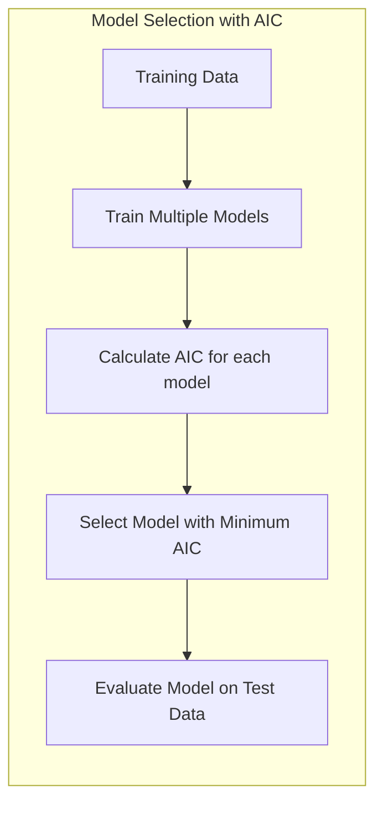
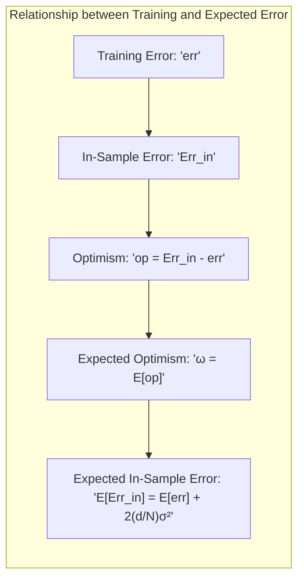
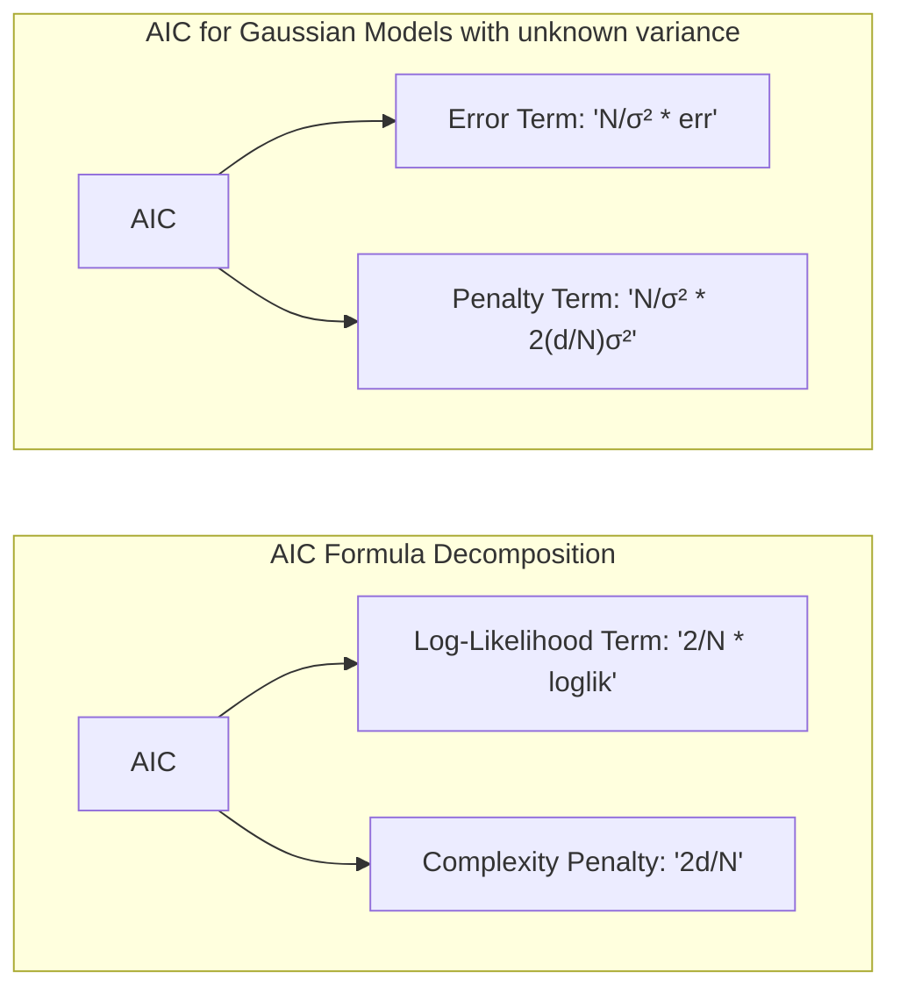
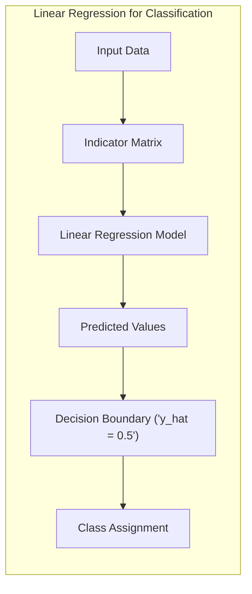
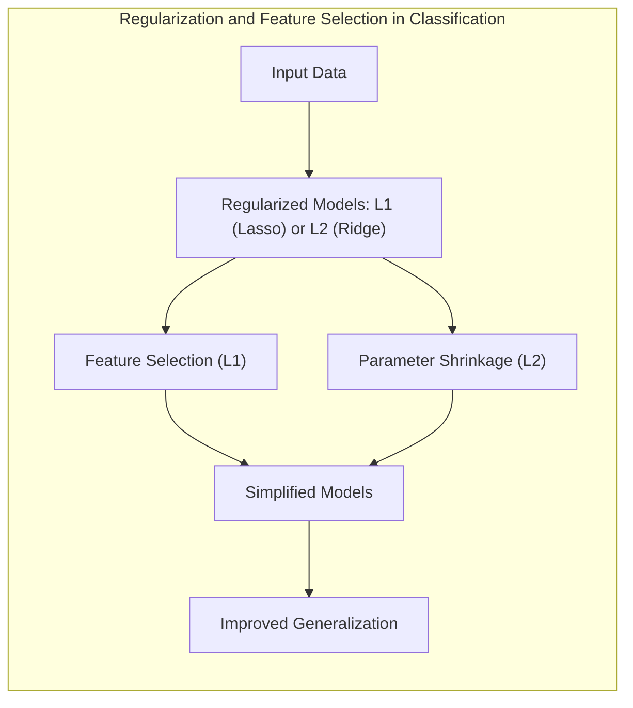
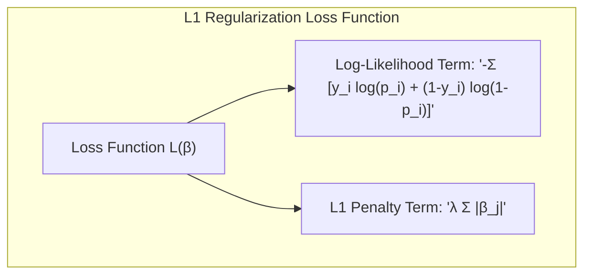
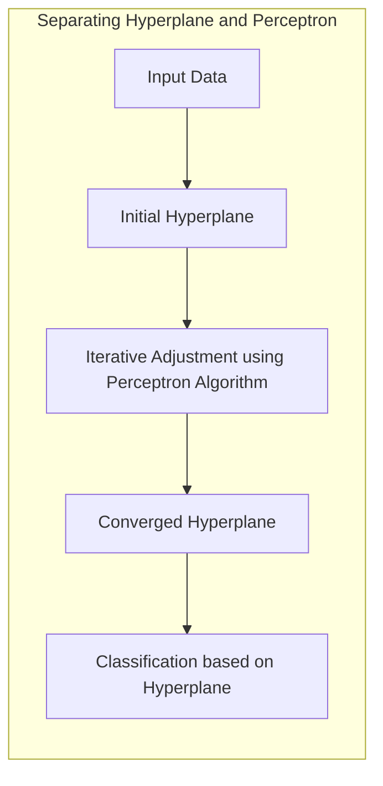
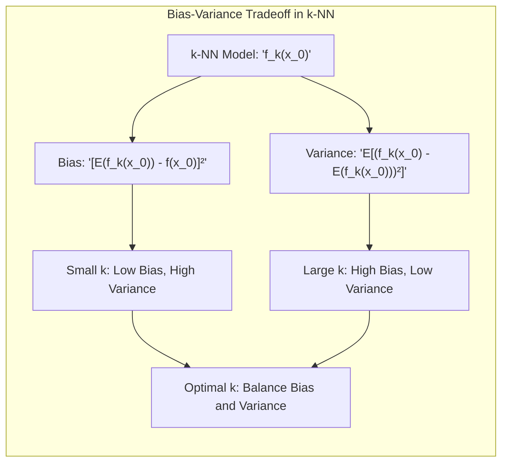

Okay, I will add practical numerical examples to the provided text, following all the guidelines you've set.

## Model Selection using AIC for Gaussian Models



### Introdução

A avaliação e seleção de modelos são etapas cruciais no processo de aprendizado estatístico [^7.1]. O desempenho de um modelo em dados de teste independentes é o que realmente importa, guiando a escolha do método de aprendizado e fornecendo uma medida da qualidade do modelo selecionado. Neste capítulo, exploramos métodos para estimar o erro de generalização e como esses métodos podem ser usados para selecionar modelos. Começaremos com a discussão do *trade-off* entre viés, variância e complexidade do modelo.

### Conceitos Fundamentais

**Conceito 1: Generalização e Erro de Predição**

O objetivo primário de um modelo de aprendizado estatístico é generalizar bem para dados não vistos. Isso significa que o modelo deve ser capaz de fazer previsões precisas em novas observações, e não apenas nos dados de treinamento. O erro de predição quantifica o quão bem o modelo realiza essa generalização. O erro de generalização ou erro de teste, $Err_T$, é definido como a expectativa da função de perda (loss function) aplicada aos dados de teste, condicional ao conjunto de treinamento $T$ [^7.2]:

$$Err_T = E[L(Y, f(X))|T]$$

Onde $L(Y, f(X))$ é a função de perda que quantifica a discrepância entre o valor observado $Y$ e a predição do modelo $f(X)$. A *expected prediction error* ou *expected test error* é definida como [^7.2]:

$$Err = E[L(Y, f(X))] = E[Err_T]$$

Esse erro considera a aleatoriedade tanto do conjunto de treinamento como dos dados de teste. No contexto de modelos lineares, o *trade-off* entre viés e variância torna-se um ponto crucial, pois modelos mais complexos podem reduzir o viés, mas aumentar a variância. O erro de treinamento, por outro lado, é definido como a média da função de perda sobre os dados de treinamento:

$$err = \frac{1}{N} \sum_{i=1}^N L(Y_i, f(x_i))$$ [^7.2]

> ⚠️ **Nota Importante**: O erro de treinamento não é uma boa estimativa do erro de teste, pois o modelo pode se ajustar excessivamente aos dados de treinamento (overfitting) e generalizar mal para novos dados. **Referência ao tópico [^7.2]**.

**Lemma 1:** Relação entre Erro de Treinamento e Erro Esperado
Para um modelo linear, sob condições específicas, o erro de treinamento pode ser relacionado ao erro esperado por meio de um termo de otimismo que depende da complexidade do modelo e do tamanho do conjunto de treinamento. Esse termo de otimismo quantifica a diferença entre o erro de treinamento e o erro esperado.

_Prova (Lemma 1):_

O erro de treinamento é dado por $err = \frac{1}{N} \sum_{i=1}^N L(Y_i, f(x_i))$. O *in-sample error* é definido como $Err_{in} = E_Y[L(Y, f(x_i))|T]$, onde $Y$ é um novo valor de resposta nos pontos de treinamento $x_i$. O otimismo é a diferença entre $Err_{in}$ e $err$, ou seja, $op = Err_{in} - err$. A expectativa desse otimismo, $\omega = E_Y[op]$, pode ser expressa como:
$$\omega = \frac{2}{N}\sum_{i=1}^N Cov(Y_i, \hat{Y_i}),$$ onde $\hat{Y_i}$ é a predição feita pelo modelo. Para um modelo linear com $d$ parâmetros e variância $\sigma^2$, o otimismo médio é dado por [^7.4]:
$$E_Y[Err_{in}] = E_Y[err] + 2\frac{d}{N}\sigma^2.$$ $\blacksquare$



> 💡 **Exemplo Numérico:**
>
> Suponha que temos um conjunto de dados com $N=100$ amostras, e estamos comparando dois modelos lineares. O Modelo 1 tem $d_1 = 3$ parâmetros, e seu erro de treinamento (MSE) é $err_1 = 0.5$. O Modelo 2 tem $d_2 = 10$ parâmetros e $err_2 = 0.3$.  Assumindo que a variância do erro é $\sigma^2 = 1$. Usando a fórmula do otimismo médio, podemos estimar o erro esperado para cada modelo.
>
> **Modelo 1:**
>
> $E_Y[Err_{in}] = 0.5 + 2 * \frac{3}{100} * 1 = 0.5 + 0.06 = 0.56$
>
> **Modelo 2:**
>
> $E_Y[Err_{in}] = 0.3 + 2 * \frac{10}{100} * 1 = 0.3 + 0.2 = 0.5$
>
> Apesar do erro de treinamento do Modelo 2 ser menor, o ajuste excessivo (devido ao maior número de parâmetros) penaliza a sua estimativa de erro esperado. Este exemplo ilustra como o termo de otimismo ajusta o erro de treinamento para estimar o erro esperado, penalizando modelos mais complexos.

**Conceito 2: O Critério de Informação de Akaike (AIC)**

O **Critério de Informação de Akaike (AIC)** é um método para estimar o erro de teste *in-sample* e é amplamente utilizado na seleção de modelos [^7.5]. Ele estima o erro esperado levando em conta a complexidade do modelo. Para modelos Gaussianos, onde a função de perda é o erro quadrático, o AIC tem uma forma específica:

$$AIC = \frac{2}{N}loglik + 2\frac{d}{N}$$ [^7.5]

Onde $loglik$ é o logaritmo da função de verossimilhança maximizada, $N$ é o tamanho da amostra e $d$ é o número de parâmetros do modelo. Em outras palavras, o AIC penaliza a complexidade do modelo, favorecendo modelos com bom ajuste e um número menor de parâmetros. Para modelos Gaussianos com variância desconhecida, o AIC pode ser expresso como:
$$AIC = \frac{N}{\sigma^2} [err + 2\frac{d}{N}\sigma^2]$$ [^7.5]
Essa formulação é equivalente à estatística $C_p$, onde $\sigma^2$ é a variância do ruído estimada e err é o erro de treinamento.



> 💡 **Exemplo Numérico:**
>
> Vamos usar o mesmo cenário do exemplo anterior com dois modelos lineares. Para o Modelo 1 temos $N = 100$, $d_1 = 3$, $err_1 = 0.5$ e $\sigma^2 = 1$. Para o Modelo 2 temos $N = 100$, $d_2 = 10$, $err_2 = 0.3$ e $\sigma^2 = 1$. Podemos calcular o AIC para ambos os modelos:
>
> **Modelo 1:**
>
> $AIC_1 = \frac{100}{1} * (0.5 + 2 * \frac{3}{100} * 1) = 100 * (0.5 + 0.06) = 56$
>
> **Modelo 2:**
>
> $AIC_2 = \frac{100}{1} * (0.3 + 2 * \frac{10}{100} * 1) = 100 * (0.3 + 0.2) = 50$
>
> Neste caso, embora o Modelo 2 tenha um erro de treinamento menor, o AIC penaliza o Modelo 2 devido ao maior número de parâmetros. O AIC estima o erro de generalização e selecionaria o modelo com menor valor, que nesse exemplo é o Modelo 2. Note que a penalização da complexidade ajuda a evitar o *overfitting*.
>
> Consideremos agora um cenário com uma variância diferente para melhor comparação. Vamos supor novamente os dois modelos lineares com as mesmas características acima: $N = 100$, $d_1 = 3$, $err_1 = 0.5$, $d_2 = 10$, $err_2 = 0.3$ mas agora com uma variância $\sigma^2 = 0.5$:
>
> **Modelo 1:**
>
> $AIC_1 = \frac{100}{0.5} * (0.5 + 2 * \frac{3}{100} * 0.5) = 200 * (0.5 + 0.03) = 106$
>
> **Modelo 2:**
>
> $AIC_2 = \frac{100}{0.5} * (0.3 + 2 * \frac{10}{100} * 0.5) = 200 * (0.3 + 0.1) = 80$
>
> Neste cenário, o Modelo 2 continua sendo preferível segundo o critério AIC. A variação na variância do ruído $\sigma^2$ afeta diretamente o valor do AIC, mas mantém a preferência relativa entre os modelos neste caso.

**Corolário 1:** Equivalência entre AIC e $C_p$ em Modelos Gaussianos
Para modelos Gaussianos com variância conhecida, o AIC é equivalente à estatística $C_p$, e ambos se tornam formas de avaliar a qualidade do ajuste penalizando modelos mais complexos.  Essa equivalência surge da relação direta entre o logaritmo da verossimilhança para um modelo Gaussiano e o erro quadrático médio. [^7.5]

**Conceito 3: Seleção de Modelo com AIC**

Na prática, selecionamos um conjunto de modelos potenciais e computamos o AIC para cada um. O modelo com o menor valor de AIC é então selecionado como o modelo ótimo [^7.5]. A intuição por trás disso é que o AIC tenta encontrar o modelo que melhor equilibra o ajuste aos dados e a simplicidade. Ele estima o erro de generalização esperado, e não o erro de treinamento, o que permite a seleção de um modelo que possa generalizar melhor para novos dados.

> ❗ **Ponto de Atenção**:  Ao usar AIC para selecionar modelos não-lineares ou complexos, o número de parâmetros $d$ precisa ser substituído por uma medida apropriada de complexidade do modelo. **Conforme indicado em [^7.5]**.

> ✔️ **Destaque**: Em cenários de modelagem linear, o AIC fornece uma forma conveniente de estimar o erro de teste levando em conta tanto o ajuste do modelo quanto sua complexidade. **Baseado no tópico [^7.5]**.

### Regressão Linear e Mínimos Quadrados para Classificação



A **regressão linear** pode ser adaptada para problemas de classificação usando a abordagem de **regressão de indicadores**. Nesta abordagem, cada classe é codificada como uma coluna em uma matriz de indicadores, e um modelo de regressão linear é ajustado para prever essas colunas simultaneamente [^7.2]. No entanto, essa abordagem pode ter algumas limitações quando aplicada diretamente para classificação. A regressão linear não impõe restrições aos valores previstos, podendo gerar predições fora do intervalo [0, 1], que são as probabilidades teóricas. Além disso, ela pode ser sensível a *outliers* e não é tão robusta quanto outros métodos de classificação como *Logistic Regression* [^7.4].

**Lemma 2:** Equivalência em Casos Específicos
Em cenários onde as classes são bem separadas e as relações são predominantemente lineares, as fronteiras de decisão obtidas por regressão de indicadores e outros métodos como LDA podem ser equivalentes.

_Prova (Lemma 2):_

Considere um problema de classificação binária com classes $C_1$ e $C_2$. Ao aplicar regressão linear na matriz de indicadores, criamos uma coluna $Y$ onde as amostras da classe $C_1$ são representadas como 1 e $C_2$ como 0. O modelo linear ajustado é da forma $\hat{Y} = X\beta$, onde $X$ é a matriz de atributos. A decisão de classe é dada por $\hat{y} > 0.5$ para a classe 1 e $\hat{y} \le 0.5$ para a classe 0. Se os atributos $X$ e a estrutura dos dados são tais que $\hat{Y}$ é bem discriminante e tem uma forma linear, então a fronteira de decisão $\hat{y} = 0.5$ será uma aproximação de uma fronteira linear obtida com LDA em condições análogas. $\blacksquare$

**Corolário 2:** Limitações da Regressão de Indicadores
Em cenários onde a separação das classes não é clara ou quando os dados são não-lineares, o desempenho da regressão de indicadores pode ser inferior a outros métodos de classificação mais apropriados. Além disso, as probabilidades podem ser estimadas de forma inadequada pela regressão de indicadores [^7.2].

> 💡 **Exemplo Numérico:**
>
> Considere um problema de classificação binária com duas classes (0 e 1) e duas variáveis preditoras $X_1$ e $X_2$. Vamos gerar um conjunto de dados simulado para exemplificar a regressão de indicadores:
>
> ```python
> import numpy as np
> import matplotlib.pyplot as plt
> from sklearn.linear_model import LinearRegression
>
> # Gerando dados simulados
> np.random.seed(42)
> X = np.random.rand(100, 2) * 10  # Duas variáveis preditoras
> y = (X[:, 0] + X[:, 1] > 10).astype(int) # Classe 1 se a soma for maior que 10, 0 caso contrário
>
> # Ajustando um modelo de regressão linear
> model = LinearRegression()
> model.fit(X, y)
>
> # Gerando predições
> y_pred = model.predict(X)
>
> # Visualizando os resultados
> plt.figure(figsize=(8, 6))
> plt.scatter(X[:, 0], X[:, 1], c=y, cmap='viridis', edgecolors='k', label='Dados reais')
>
> # Plotando a fronteira de decisão linear
> x1_min, x1_max = X[:, 0].min() - 1, X[:, 0].max() + 1
> x2_min, x2_max = X[:, 1].min() - 1, X[:, 1].max() + 1
> xx1, xx2 = np.meshgrid(np.linspace(x1_min, x1_max, 500),
>                      np.linspace(x2_min, x2_max, 500))
> grid_preds = model.predict(np.c_[xx1.ravel(), xx2.ravel()])
> grid_preds = grid_preds.reshape(xx1.shape)
> plt.contourf(xx1, xx2, grid_preds, levels=[0.5], colors=['red'], alpha=0.3, label="Fronteira de decisão")
>
> plt.xlabel('$X_1$')
> plt.ylabel('$X_2$')
> plt.title('Regressão Linear para Classificação')
> plt.legend()
> plt.show()
>
> print("Coeficientes:", model.coef_)
> print("Intercepto:", model.intercept_)
> ```
>
> Neste exemplo, a regressão linear tenta separar as duas classes usando um hiperplano. Os coeficientes indicam o peso de cada variável na decisão, e o intercepto desloca o hiperplano. A visualização mostra como a regressão de indicadores cria uma fronteira de decisão linear, embora os valores previstos não estejam estritamente entre 0 e 1. A linha de contorno em vermelho indica a região onde a predição é igual a 0.5, o limiar para a classificação.
>
> Um exemplo numérico da predição para uma amostra:
> Suponha uma amostra com $X_1=6$ e $X_2=5$. O modelo linear ajustado pode ter coeficientes $\beta_1 = 0.15$ e $\beta_2 = 0.12$ e intercepto $\beta_0 = -1.2$. Então a previsão será $\hat{y} = -1.2 + 0.15 * 6 + 0.12 * 5 = -0.1$. Portanto o modelo classificaria essa amostra na classe 0, pois a predição $\hat{y}$ é menor que 0.5.

Contudo, a **regressão de indicadores** tem sua importância em cenários onde a fronteira de decisão é fundamentalmente linear e a interpretação dos coeficientes é crucial. É uma abordagem simples e rápida que pode ser usada como um ponto de partida para problemas de classificação [^7.2].

### Métodos de Seleção de Variáveis e Regularização em Classificação



A **seleção de variáveis** e a **regularização** são técnicas importantes para lidar com a complexidade do modelo e evitar *overfitting*, especialmente em cenários de alta dimensionalidade. Em classificação, essas técnicas ajudam a escolher o subconjunto de variáveis mais relevante e a estabilizar as estimativas dos parâmetros, melhorando a generalização [^7.4]. A regularização, ao adicionar termos de penalização à função de perda, reduz a magnitude dos coeficientes do modelo e evita que eles se ajustem excessivamente aos dados de treinamento [^7.4].

Um tipo comum de regularização é a **penalização L1 (Lasso)**, que força alguns coeficientes a serem exatamente zero, realizando seleção de variáveis. A penalização L2 (Ridge) reduz a magnitude dos coeficientes sem torná-los exatamente zero [^7.4]. A escolha da técnica de regularização adequada e do parâmetro de ajuste (tuning parameter) depende do problema específico e pode ser feita via validação cruzada ou outros métodos de avaliação.

**Lemma 3:** Penalização L1 e Sparsity
A penalização L1 em classificação logística leva a estimativas de parâmetros esparsas, ou seja, muitos coeficientes serão exatamente zero.

_Prova (Lemma 3):_

A função de perda penalizada para a regressão logística com penalização L1 é dada por:

$$L(\beta) = - \sum_{i=1}^N [y_i log(p_i) + (1-y_i) log(1-p_i)] + \lambda \sum_{j=1}^p |\beta_j|$$

Onde $p_i$ é a probabilidade estimada para a amostra $i$ e $\lambda$ é o parâmetro de ajuste. A derivada da função de perda com relação a $\beta_j$ possui o termo $\lambda sign(\beta_j)$ devido à penalização L1. Para valores pequenos de $\lambda$, podemos obter uma solução para $\beta$ que minimize essa função, e a derivada com relação a $\beta_j$ será zero quando $|\beta_j| = 0$, conduzindo a *sparsity*. A penalização L1 força muitos coeficientes a serem exatamente zero. $\blacksquare$



> 💡 **Exemplo Numérico:**
>
> Para ilustrar a penalização L1, vamos utilizar um conjunto de dados de classificação com 5 variáveis preditoras. Vamos usar regressão logística com penalização L1 e observar como os coeficientes se comportam para diferentes valores de $\lambda$.
>
> ```python
> import numpy as np
> import matplotlib.pyplot as plt
> from sklearn.linear_model import LogisticRegression
> from sklearn.model_selection import train_test_split
> from sklearn.preprocessing import StandardScaler
>
> # Gerando dados simulados
> np.random.seed(42)
> X = np.random.randn(100, 5) # 5 variáveis preditoras
> y = (X[:, 0] + X[:, 1] - X[:, 2] > 0).astype(int) # Classe dependente das variáveis
>
> # Normalização
> scaler = StandardScaler()
> X = scaler.fit_transform(X)
>
> # Dividindo em treino e teste
> X_train, X_test, y_train, y_test = train_test_split(X, y, test_size=0.3, random_state=42)
>
> # Valores de lambda a serem testados
> lambdas = np.logspace(-4, 2, 20)
> coefs = []
>
> for lam in lambdas:
>    model = LogisticRegression(penalty='l1', solver='liblinear', C = 1/lam, random_state=42) # C = 1/lambda
>    model.fit(X_train, y_train)
>    coefs.append(model.coef_[0])
>
> coefs = np.array(coefs)
>
> # Visualizando os resultados
> plt.figure(figsize=(10, 6))
> for i in range(5):
>   plt.plot(lambdas, coefs[:, i], label=f'Coeficiente {i+1}')
>
> plt.xscale('log')
> plt.xlabel('Lambda (λ)')
> plt.ylabel('Valores dos coeficientes')
> plt.title('Regularização L1 (Lasso) em Regressão Logística')
> plt.axhline(0, color='black', linestyle='--', linewidth=0.5)
> plt.legend()
> plt.grid(True)
> plt.show()
> ```
>
> O gráfico mostra a evolução dos coeficientes com o aumento de $\lambda$. Para valores baixos de $\lambda$, os coeficientes são não-nulos, indicando que todas as variáveis são relevantes. Ao aumentar $\lambda$, a penalidade L1 força alguns coeficientes a serem exatamente zero, realizando seleção de variáveis. O gráfico destaca a *sparsity* promovida pela regularização L1 e como ela ajuda a simplificar o modelo.
>
> Para um valor específico de $\lambda$, como por exemplo $\lambda = 1$, podemos ver que alguns coeficientes se tornam zero. Assim, o modelo resultante seleciona um subconjunto das variáveis originais para a classificação.

**Corolário 3:** Impacto da Regularização na Interpretabilidade
A penalização L1 não apenas aumenta a estabilidade do modelo, mas também aumenta a interpretabilidade, pois a seleção de variáveis por meio da penalização L1 pode revelar quais *features* são mais importantes na discriminação entre as classes. [^7.4]

> ⚠️ **Ponto Crucial**: A combinação das penalizações L1 e L2, conhecida como Elastic Net, permite aproveitar as vantagens de ambas, proporcionando *sparsity* e estabilidade. **Conforme discutido em [^7.5]**.

### Separating Hyperplanes e Perceptrons



O conceito de **hiperplanos separadores** é fundamental em classificação linear. A ideia é encontrar um hiperplano que maximize a margem de separação entre as classes, ou seja, a distância mínima entre o hiperplano e os pontos de cada classe [^7.5.2]. Em alguns casos, as classes podem não ser linearmente separáveis, e nesses casos é necessário procurar soluções aproximadas ou utilizar *kernels* para mapear os dados em espaços de maior dimensão.

O algoritmo **Perceptron** é um método iterativo que tenta encontrar um hiperplano separador [^7.5.1]. Ele começa com um hiperplano aleatório e atualiza seus parâmetros iterativamente até convergir para uma solução. O Perceptron tem garantias de convergência para dados linearmente separáveis, sob certas condições.

### Pergunta Teórica Avançada: Qual a relação entre o Bias-Variance Tradeoff e a escolha do parâmetro k no k-NN?

**Resposta:**

No contexto do algoritmo k-Nearest Neighbors (k-NN), o parâmetro k controla a complexidade do modelo. Um pequeno valor de k implica que o modelo se ajusta muito aos dados de treinamento e pode sofrer de alta variância, e um grande valor de k pode levar a um modelo com baixo *bias*, mas alta variância.

**Lemma 4:** Bias e Variância no k-NN
O bias e a variância no k-NN são inversamente relacionados e controlados pelo parâmetro k, que determina o número de vizinhos a serem considerados para a classificação.

_Prova (Lemma 4):_

Considere um ponto $x_0$ a ser classificado. A predição do modelo k-NN é dada por $f_k(x_0)$, que é a média dos valores das $k$ amostras mais próximas. O *bias* é dado por $[Ef_k(x_0) - f(x_0)]^2$, e a variância por $E[(f_k(x_0) - Ef_k(x_0))^2]$. Quando $k$ é pequeno, o modelo se ajusta aos dados de treinamento (alta variação), e se desvia menos do valor verdadeiro (baixo *bias*). O contrário acontece para valores maiores de $k$.

Para um modelo k-NN genérico, o erro de predição $Err(x_0)$ pode ser expresso em termos do viés e da variância. Para simplicidade, assuma que os inputs são fixos, e a aleatoriedade vem dos $y_i$.

$$Err(x_0) = \sigma^2 + [f(x_0) - E(f_k(x_0)]^2 + E[(f_k(x_0) - Ef_k(x_0)]^2$$

Onde o primeiro termo representa o erro irredutível.

Para um k-NN de regressão temos que o erro é dado por:

$$Err(x_0) = \sigma^2 + [f(x_0) - \frac{1}{k}\sum_{l=1}^k f(x_l)]^2 + \frac{1}{k} \sigma^2$$

Onde $x_l$ são os k vizinhos de $x_0$.
Como podemos ver, valores pequenos de $k$ tendem a ter um baixo viés, mas alta variância, e vice-versa. $\blacksquare$



> 💡 **Exemplo Numérico:**
>
> Considere um conjunto de dados simulado onde queremos prever um valor de resposta `y` usando o k-NN. O dataset possui uma relação não linear entre a variável preditora `x` e a variável de resposta `y`. Vamos analisar como o parâmetro `k` afeta o *bias* e a variância.
>
> ```python
> import numpy as np
> import matplotlib.pyplot as plt
> from sklearn.neighbors import KNeighborsRegressor
>
> # Gerando dados simulados
> np.random.seed(42)
> x = np.linspace(0, 10, 100)
> y = np.sin(x) + np.random.normal(0, 0.2, 100)
> x = x.reshape(-1, 1) # Reshape para o sklearn
>
> # Valores de k a serem testados
> k_values = [1, 5, 20, 50]
>
> # Visualizando os resultados
> plt.figure(figsize=(10, 6))
> plt.scatter(x, y, color='black', label='Dados Reais')
>
> for k in k_values:
>    knn = KNeighborsRegressor(n_neighbors=k)
>    knn.fit(x, y)
>    y_pred = knn.predict(x)
>    plt.plot(x, y_pred, label=f'k={k}')
>
> plt.xlabel('x')
> plt.ylabel('y')
> plt.title('Impacto do Parâmetro k no k-NN')
> plt.legend()
> plt.grid(True)
> plt.show()
> ```
>
> No exemplo acima, o modelo com k=1 segue os dados de treinamento de perto, o que indica baixa *bias*, mas também alta variância (overfitting). O modelo com k=50 tem um comportamento mais suave, mostrando baixa variância, mas alta *bias*. Ou seja, o modelo está subajustando os dados, pois não consegue capturar a não-linearidade. O ideal é escolher um valor intermediário, como k=5 ou k=20, para encontrar um balanço adequado entre viés e variância.
>
> Podemos notar que a escolha de k tem um impacto direto no ajuste do modelo. Valores menores levam a ajustes mais detalhados, enquanto valores maiores suavizam o modelo e reduzem a variabilidade. A melhor escolha de k depende do problema específico e pode ser feita usando técnicas como validação cruzada.

**Corolário 4:** Trade-off no k-NN
A escolha do valor ótimo de k é fundamental e depende da estrutura do conjunto de dados. Técnicas como validação cruzada são usadas para determinar um valor ótimo que minimize o erro de generalização.

> ⚠️ **Ponto Crucial**: O *trade-off* entre viés e variância é um compromisso na escolha do parâmetro k em k-NN e ilustra como a complexidade do modelo influencia a capacidade de generalização.

### Conclusão

Este capítulo abordou os conceitos essenciais para avaliação e seleção de modelos, com foco no uso do AIC para modelos Gaussianos. Exploramos a relação entre viés, variância e complexidade do modelo, além de abordagens práticas para seleção de modelos, como regularização, *separating hyperplanes* e *perceptrons*. O *trade-off* viés-variância é fundamental para a escolha do melhor modelo e a importância de usar um conjunto de testes separado do treinamento para avaliar o desempenho do modelo. Também abordamos em profundidade conceitos de classificação e técnicas de regularização. As ferramentas de avaliação e seleção discutidas, AIC, validação cruzada e *bootstrap*, entre outros, formam a base para a construção de modelos de aprendizado estatístico robustos.

### Footnotes

[^7.1]: "The generalization performance of a learning method relates to its prediction capability on independent test data. Assessment of this performance is extremely important in practice, since it guides the choice of learning method or model, and gives us a measure of the quality of the ultimately chosen model."
[^7.2]: "Consider first the case of a quantitative or interval scale response. We have a target variable Y, a vector of inputs X, and a prediction model f(X) that has been estimated from a training set T. The loss function for measuring errors between Y and f(X) is denoted by L(Y, f(X)). Typical choices are"
[^7.4]: "Typically we model the probabilities pk(X) = Pr(G = k|X) (or some monotone transformations fk(X)), and then G(X) = arg maxk fk(X). In some cases, such as 1-nearest neighbor classification (Chapters 2 and 13) we produce G(X) directly. Typical loss functions are"
[^7.5]: "In this chapter we describe a number of methods for estimating the expected test error for a model. Typically our model will have a tuning parameter or parameters a and so we can write our predictions as fa(x). The tuning parameter varies the complexity of our model, and we wish to find the value of a that minimizes error, that is, produces the minimum of the average test error curve in Figure 7.1. Having said this, for brevity we will often suppress the dependence of f(x) on a."
