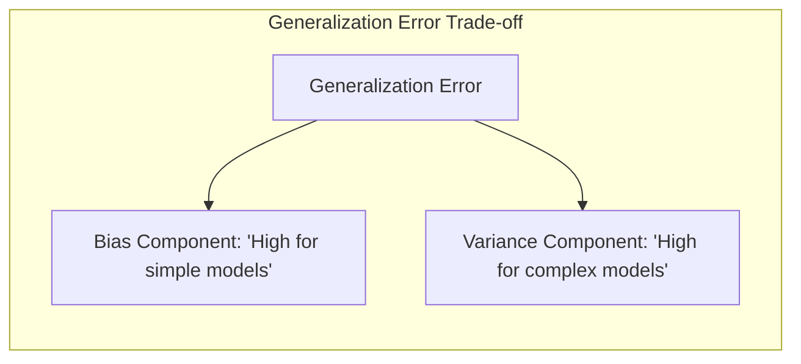
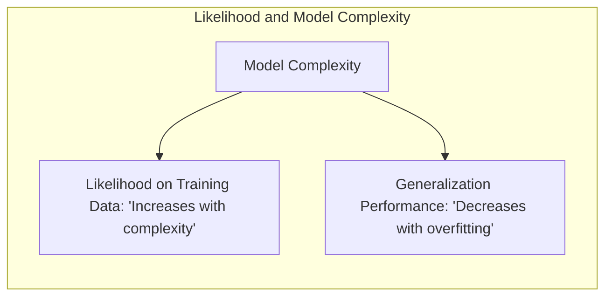
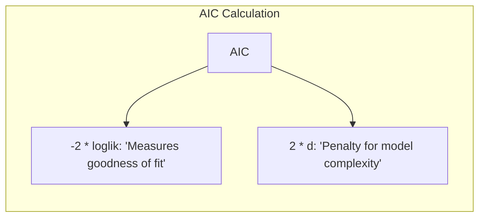
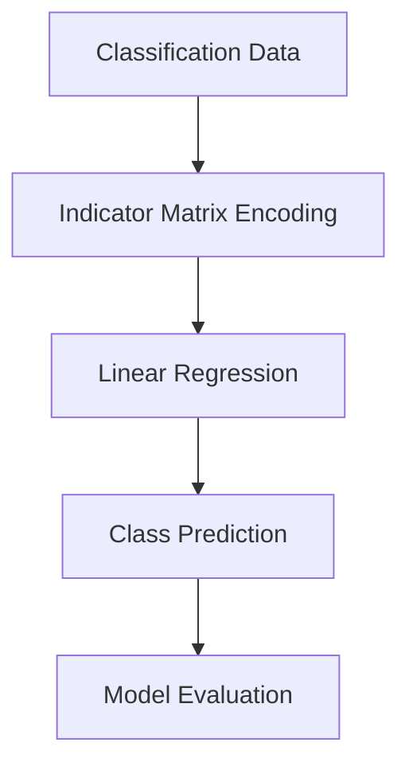
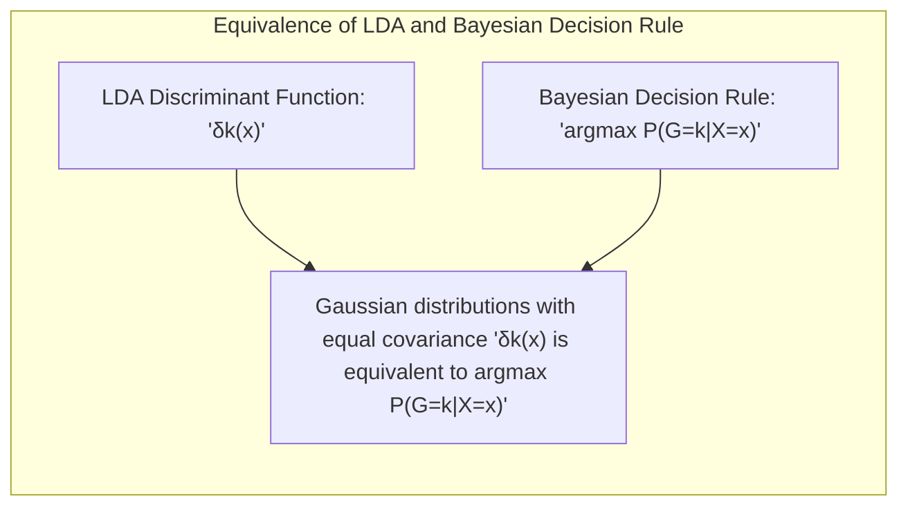

## Model Selection Using the Akaike Information Criterion (AIC)
<imagem: Mapa mental mostrando a estrutura do AIC, desde a definição do conceito de informação até a sua aplicação na seleção de modelos estatísticos e de Machine Learning, conectando-o com o tradeoff bias-variância e outros critérios de seleção, como o BIC.>

### Introdução
A seleção de modelos estatísticos e de machine learning é um passo crucial na análise de dados e na construção de modelos preditivos precisos. O objetivo é escolher o modelo que melhor se ajusta aos dados, evitando o overfitting (quando o modelo se ajusta demais aos dados de treinamento e tem um desempenho ruim em dados não vistos) e o underfitting (quando o modelo é muito simplista e não captura padrões importantes nos dados). O **Akaike Information Criterion (AIC)** [^7.1] é uma ferramenta estatística amplamente utilizada para abordar esse problema, oferecendo uma medida de qualidade do modelo que leva em consideração tanto o ajuste aos dados quanto a complexidade do modelo. Este capítulo explorará o AIC em profundidade, examinando suas bases teóricas, aplicações práticas e limitações.

### Conceitos Fundamentais
Antes de nos aprofundarmos no AIC, é essencial revisarmos alguns conceitos fundamentais [^7.2]:

**Conceito 1:** O **problema de seleção de modelos** surge da necessidade de escolher o modelo que melhor equilibra o ajuste aos dados e a sua complexidade. Um modelo muito simples pode não capturar os padrões nos dados (underfitting), enquanto um modelo muito complexo pode se ajustar excessivamente aos dados de treinamento e apresentar um desempenho ruim em novos dados (overfitting). A complexidade do modelo é frequentemente expressa em termos do número de parâmetros ajustáveis no modelo. O objetivo é encontrar um modelo com um nível de complexidade ótimo que minimize o erro de generalização.

**Lemma 1:** *O erro de generalização de um modelo, ou seja, sua capacidade de fazer previsões precisas em novos dados, é influenciado pelo trade-off entre viés e variância*. [^7.2] Um modelo complexo tende a ter baixo viés (ou seja, é capaz de se ajustar bem aos dados de treinamento) e alta variância (ou seja, suas previsões podem variar muito dependendo dos dados de treinamento), enquanto um modelo simples tende a ter alto viés e baixa variância. O objetivo da seleção de modelos é encontrar um ponto de equilíbrio que minimize o erro total de generalização.



> 💡 **Exemplo Numérico:** Considere um dataset simulado com uma relação quadrática entre a variável independente $x$ e a variável dependente $y$. Vamos ajustar três modelos: um modelo linear (simples), um modelo quadrático (adequado) e um modelo polinomial de grau 5 (complexo).
> ```python
> import numpy as np
> import matplotlib.pyplot as plt
> from sklearn.linear_model import LinearRegression
> from sklearn.preprocessing import PolynomialFeatures
> from sklearn.metrics import mean_squared_error
>
> # Dados simulados
> np.random.seed(42)
> X = np.sort(np.random.rand(50) * 10)
> y = 2 * X**2 + 3 * X + 5 + np.random.randn(50) * 10
>
> # Modelos
> X = X.reshape(-1, 1) # Transforma X em uma matriz de coluna
>
> # 1. Modelo Linear
> model_linear = LinearRegression()
> model_linear.fit(X, y)
> y_pred_linear = model_linear.predict(X)
> mse_linear = mean_squared_error(y, y_pred_linear)
>
> # 2. Modelo Quadrático
> poly_features = PolynomialFeatures(degree=2)
> X_poly = poly_features.fit_transform(X)
> model_quadratic = LinearRegression()
> model_quadratic.fit(X_poly, y)
> y_pred_quadratic = model_quadratic.predict(X_poly)
> mse_quadratic = mean_squared_error(y, y_pred_quadratic)
>
> # 3. Modelo Polinomial Grau 5
> poly_features_5 = PolynomialFeatures(degree=5)
> X_poly_5 = poly_features_5.fit_transform(X)
> model_poly5 = LinearRegression()
> model_poly5.fit(X_poly_5, y)
> y_pred_poly5 = model_poly5.predict(X_poly_5)
> mse_poly5 = mean_squared_error(y, y_pred_poly5)
>
> # Gráfico
> plt.figure(figsize=(10, 6))
> plt.scatter(X, y, label='Dados Originais')
> plt.plot(X, y_pred_linear, color='red', label=f'Linear (MSE={mse_linear:.2f})')
> plt.plot(X, y_pred_quadratic, color='green', label=f'Quadrático (MSE={mse_quadratic:.2f})')
> plt.plot(X, y_pred_poly5, color='blue', label=f'Polinomial 5 (MSE={mse_poly5:.2f})')
> plt.xlabel('X')
> plt.ylabel('y')
> plt.title('Comparação de Modelos')
> plt.legend()
> plt.show()
>
> print(f"MSE Linear: {mse_linear:.2f}")
> print(f"MSE Quadrático: {mse_quadratic:.2f}")
> print(f"MSE Polinomial (Grau 5): {mse_poly5:.2f}")
> ```
> Este exemplo demonstra que o modelo quadrático se ajusta melhor aos dados, com o menor erro quadrático médio (MSE). O modelo linear sofre de underfitting (alto viés), enquanto o modelo de grau 5 sofre de overfitting (alta variância).

**Conceito 2:** A **verossimilhança (likelihood)** de um modelo é a probabilidade dos dados observados dados os parâmetros do modelo. A ideia é maximizar essa probabilidade encontrando os parâmetros que melhor explicam os dados. Modelos mais complexos podem gerar verossimilhanças maiores, mas também podem sofrer de overfitting. A verossimilhança penalizada, como a utilizada no AIC, busca um balanço entre a qualidade do ajuste do modelo aos dados (medida pela verossimilhança) e a complexidade do modelo.

**Corolário 1:** *Modelos com maior número de parâmetros geralmente levam a verossimilhanças mais altas nos dados de treinamento*, mas podem não ser os mais adequados em dados não vistos, demonstrando a importância de penalizar a complexidade em critérios como o AIC. [^7.1, ^7.2]



**Conceito 3:** O **AIC** é uma medida da qualidade relativa de um modelo estatístico para um dado conjunto de dados. Ele se baseia na teoria da informação e quantifica a perda de informação quando um determinado modelo é usado para aproximar o processo que gerou os dados. *O AIC é definido como: $$AIC = -2 \cdot loglik + 2d$$, onde $loglik$ é o logaritmo da verossimilhança maximizada do modelo e $d$ é o número de parâmetros no modelo* [^7.5]. O primeiro termo mede o ajuste do modelo aos dados (quanto maior a verossimilhança, menor o termo), e o segundo termo penaliza a complexidade do modelo (quanto mais parâmetros, maior o termo).



> 💡 **Exemplo Numérico:** Considere dois modelos para ajustar um conjunto de dados:
>
> *   **Modelo 1:** Regressão linear simples com 2 parâmetros (inclinação e intercepto). Log-verossimilhança maximizada: -150.
> *   **Modelo 2:** Regressão polinomial de grau 3 com 4 parâmetros. Log-verossimilhança maximizada: -130.
>
> Cálculo do AIC para cada modelo:
>
> *   Modelo 1: $AIC_1 = -2 \cdot (-150) + 2 \cdot 2 = 300 + 4 = 304$
> *   Modelo 2: $AIC_2 = -2 \cdot (-130) + 2 \cdot 4 = 260 + 8 = 268$
>
> Apesar do modelo 2 ter um melhor ajuste aos dados (maior log-verossimilhança), o AIC penaliza o modelo 2 pela sua complexidade. Nesse caso, o AIC indica que o modelo 2 tem melhor qualidade relativa porque possui um menor valor de AIC.
>
> ```python
> import numpy as np
>
> # Dados de exemplo
> loglik_model1 = -150
> params_model1 = 2
> loglik_model2 = -130
> params_model2 = 4
>
> # Calcula o AIC para cada modelo
> aic_model1 = -2 * loglik_model1 + 2 * params_model1
> aic_model2 = -2 * loglik_model2 + 2 * params_model2
>
> print(f"AIC do Modelo 1: {aic_model1}")
> print(f"AIC do Modelo 2: {aic_model2}")
>
> # Tabela comparando os modelos
> print("\nComparação dos Modelos:")
> print("| Modelo | Log-Verossimilhança | Parâmetros | AIC |")
> print("|--------|--------------------|------------|-----|")
> print(f"| Modelo 1 | {loglik_model1} | {params_model1} | {aic_model1} |")
> print(f"| Modelo 2 | {loglik_model2} | {params_model2} | {aic_model2} |")
>
> # Verifica qual modelo tem o menor AIC
> if aic_model1 < aic_model2:
>    print("\nModelo 1 tem menor AIC e melhor qualidade relativa.")
> else:
>    print("\nModelo 2 tem menor AIC e melhor qualidade relativa.")
> ```

> ⚠️ **Nota Importante**: É crucial lembrar que o AIC *não é uma medida da qualidade absoluta de um modelo*, mas sim uma medida da qualidade relativa comparada com outros modelos. Um valor baixo de AIC indica um bom modelo em relação a outros que estão sendo considerados, mas não significa que esse modelo seja perfeito.

> ❗ **Ponto de Atenção**: O AIC assume que os modelos considerados estão próximos do modelo verdadeiro, e sua aplicação pode ser problemática quando essa premissa não é válida. Em particular, o AIC tende a selecionar modelos mais complexos quando o tamanho da amostra é grande.

> ✔️ **Destaque**: Uma das vantagens do AIC é sua aplicabilidade a uma ampla gama de modelos, incluindo modelos lineares, não lineares, de regressão e de classificação, conforme será demonstrado adiante.

### Regressão Linear e Mínimos Quadrados para Classificação
A aplicação da regressão linear em matriz de indicadores para classificação é um exemplo interessante de como um modelo de regressão pode ser usado para problemas de classificação [^4.2]. O processo consiste em codificar as classes usando uma matriz indicadora e então aplicar a regressão linear para estimar os coeficientes. Um mapa mental (Mermaid) pode ilustrar essa ideia:


**Explicação:** Este diagrama representa o fluxo do processo de regressão de indicadores para classificação.

Nesse contexto, embora a regressão linear não seja diretamente projetada para classificação, ela pode ser usada como uma aproximação para obtenção de fronteiras de decisão lineares. No entanto, a regressão linear em matriz de indicadores apresenta algumas limitações, como a possível extrapolação de valores fora do intervalo [0,1], que podem ser interpretados como probabilidades.

**Lemma 2:** A regressão de indicadores, sob certas condições, pode produzir um hiperplano de decisão equivalente àquele obtido pela análise discriminante linear (LDA), quando as classes têm covariâncias iguais [^4.3].

**Prova do Lemma 2:**
Vamos considerar o caso de duas classes. Seja $X$ a matriz de dados e $Y$ a matriz indicadora correspondente às classes. No contexto da regressão, os coeficientes $\beta$ são estimados por:

$$ \beta = (X^T X)^{-1} X^T Y $$
A projeção de uma nova amostra $x_0$ para predição é:

$$ \hat{y}_0 = x_0^T \beta $$

A regra de decisão na regressão de indicadores envolve comparar o valor predito com um threshold (0.5 no caso de 2 classes) e classificar a amostra de acordo.

Na LDA, as funções discriminantes são da forma:
$$ \delta_k(x) = x^T \Sigma^{-1} \mu_k - \frac{1}{2}\mu_k^T \Sigma^{-1}\mu_k + \log(\pi_k) $$
onde $\Sigma$ é a matriz de covariância comum (assumida igual), $\mu_k$ são as médias das classes e $\pi_k$ são as probabilidades a priori. A decisão é dada pela classe $k$ que maximiza $\delta_k(x)$.

Quando as classes têm covariâncias iguais e as probabilidades a priori são iguais, os hiperplanos de decisão na LDA são lineares. Podemos mostrar que, sob essas condições, os hiperplanos de decisão gerados pela regressão linear e pela LDA são equivalentes.

O hiperplano de decisão da regressão de indicadores é definido por
$$ x_0^T \beta = 0.5 $$
e o hiperplano da LDA (para duas classes) é dado por
$$ x_0^T \Sigma^{-1} (\mu_2 - \mu_1) = constant $$

Se as covariâncias das classes são iguais, a regressão de indicadores aproxima-se do LDA, resultando em hiperplanos semelhantes. Portanto, as projeções nos hiperplanos de decisão em ambos os métodos, sob estas condições, são equivalentes. $\blacksquare$

**Corolário 2:** A limitação da regressão linear na classificação reside na sua inadequação para estimar probabilidades diretamente e na sua sensibilidade a outliers, sendo mais apropriada para cenários em que a decisão binária é suficiente e a separação linear é uma boa aproximação [^4.4].

> 💡 **Exemplo Numérico:**
> Vamos considerar um exemplo simples de classificação com duas classes e duas variáveis preditoras.
> ```python
> import numpy as np
> import matplotlib.pyplot as plt
> from sklearn.linear_model import LinearRegression
>
> # Dados de exemplo
> X = np.array([[1, 2], [1.5, 1.8], [5, 8], [8, 8], [1, 0.6], [9, 11]])
> y = np.array([0, 0, 1, 1, 0, 1]) # classes 0 e 1
>
> # 1. Codificação da Matriz Indicadora
> # Neste caso, já temos y com 0 e 1, não precisa de matriz indicadora
>
> # 2. Regressão Linear
> model = LinearRegression()
> model.fit(X, y)
>
> # 3. Predição para Visualização
> x_min, x_max = X[:, 0].min() - 1, X[:, 0].max() + 1
> y_min, y_max = X[:, 1].min() - 1, X[:, 1].max() + 1
> xx, yy = np.meshgrid(np.arange(x_min, x_max, 0.02),
>                     np.arange(y_min, y_max, 0.02))
> Z = model.predict(np.c_[xx.ravel(), yy.ravel()])
> Z = Z.reshape(xx.shape)
>
> # 4. Visualização
> plt.figure(figsize=(8, 6))
> plt.contourf(xx, yy, Z, cmap=plt.cm.RdBu, alpha=0.5)
> plt.scatter(X[:, 0], X[:, 1], c=y, cmap=plt.cm.RdBu, edgecolors='k')
> plt.xlabel('X1')
> plt.ylabel('X2')
> plt.title('Regressão Linear para Classificação')
> plt.colorbar()
> plt.show()
>
> # Exemplo de predição
> new_sample = np.array([[4, 5]])
> prediction = model.predict(new_sample)
> print(f"Predição para [4, 5]: {prediction[0]:.2f}")
>
> # Classificação
> threshold = 0.5
> class_prediction = 1 if prediction[0] >= threshold else 0
> print(f"Classe Predita para [4, 5]: {class_prediction}")
> ```
> Neste exemplo, a regressão linear cria uma fronteira linear entre as classes, e podemos ver como pontos próximos da classe 0 obtêm valores de predição menores que 0.5, e pontos da classe 1 obtêm valores maiores que 0.5. Para classificar, podemos usar o limiar de 0.5.

### Métodos de Seleção de Variáveis e Regularização em Classificação
A seleção de variáveis e a regularização são técnicas fundamentais para controlar a complexidade de modelos, evitar overfitting e melhorar o desempenho de modelos de classificação [^7.2, ^7.5]. Em particular, a regularização adiciona termos de penalidade à função de custo que é otimizada durante o treinamento, incentivando modelos mais simples.

Uma aplicação comum da regularização é em modelos de regressão logística, onde termos de penalidade L1 (Lasso) e L2 (Ridge) são adicionados à função de log-verossimilhança.

A regularização L1 tende a tornar os coeficientes do modelo esparsos, ou seja, alguns coeficientes são reduzidos a zero, efetivamente selecionando as variáveis mais relevantes [^7.5].

**Lemma 3:** *A penalização L1 na regressão logística resulta em coeficientes esparsos, uma vez que a penalidade L1 (ou seja, a soma dos valores absolutos dos coeficientes) incentiva coeficientes a se tornarem exatamente zero*. [^4.4.4]

**Prova do Lemma 3:**
A função de custo para regressão logística com regularização L1 é dada por:

$$ J(\beta) = -\frac{1}{N} \sum_{i=1}^{N} [y_i \log(\sigma(\beta^T x_i)) + (1-y_i)\log(1-\sigma(\beta^T x_i))] + \lambda \sum_{j=1}^{p} |\beta_j| $$
onde $\sigma$ é a função logística, $\beta$ são os coeficientes, $x_i$ são os dados de entrada, $y_i$ são os rótulos e $\lambda$ é o parâmetro de regularização.

The L1 penalty adds a penalty directly proportional to the sum of the absolute values of the coefficients. When we optimize this cost function, the L1 penalty causes some coefficients to become exactly zero, resulting in a sparse model, i.e., using a subset of the original variables. Geometrically, the contour of the objective function, together with the penalty, tends to "touch" the axes, leading to zero coefficients. $\blacksquare$


**Corolário 3:** A esparsidade promovida pela regularização L1 facilita a interpretação do modelo, uma vez que apenas as variáveis mais relevantes são mantidas.

> ⚠️ **Ponto Crucial**: A regularização L2, por sua vez, reduz a magnitude dos coeficientes sem necessariamente torná-los zero, levando a um modelo mais estável e menos sensível a pequenas mudanças nos dados. A escolha entre L1 e L2 (ou uma combinação delas, como a Elastic Net) depende do contexto e dos objetivos do problema. [^7.5]

> 💡 **Exemplo Numérico:** Vamos comparar a regularização L1 (Lasso) e L2 (Ridge) em um problema de classificação binária usando regressão logística.
> ```python
> import numpy as np
> import matplotlib.pyplot as plt
> from sklearn.linear_model import LogisticRegression
> from sklearn.model_selection import train_test_split
> from sklearn.preprocessing import StandardScaler
> from sklearn.metrics import accuracy_score
>
> # Gerando dados de exemplo
> np.random.seed(42)
> X = np.random.rand(100, 10) # 10 features, algumas irrelevantes
> y = np.random.randint(0, 2, 100)
>
> # Separando dados de treino e teste
> X_train, X_test, y_train, y_test = train_test_split(X, y, test_size=0.3, random_state=42)
>
> # Normalizando os dados
> scaler = StandardScaler()
> X_train = scaler.fit_transform(X_train)
> X_test = scaler.transform(X_test)
>
> # Modelos
> # 1. Regressão Logística sem Regularização
> model_no_reg = LogisticRegression(penalty=None, solver='lbfgs', random_state=42)
> model_no_reg.fit(X_train, y_train)
> y_pred_no_reg = model_no_reg.predict(X_test)
>
> # 2. Regressão Logística com Regularização L1 (Lasso)
> model_l1 = LogisticRegression(penalty='l1', solver='liblinear', C=0.1, random_state=42)
> model_l1.fit(X_train, y_train)
> y_pred_l1 = model_l1.predict(X_test)
>
> # 3. Regressão Logística com Regularização L2 (Ridge)
> model_l2 = LogisticRegression(penalty='l2', solver='lbfgs', C=0.1, random_state=42)
> model_l2.fit(X_train, y_train)
> y_pred_l2 = model_l2.predict(X_test)
>
> # Avaliação
> acc_no_reg = accuracy_score(y_test, y_pred_no_reg)
> acc_l1 = accuracy_score(y_test, y_pred_l1)
> acc_l2 = accuracy_score(y_test, y_pred_l2)
>
> # Coeficientes
> coef_no_reg = model_no_reg.coef_[0]
> coef_l1 = model_l1.coef_[0]
> coef_l2 = model_l2.coef_[0]
>
> print(f"Acurácia sem regularização: {acc_no_reg:.2f}")
> print(f"Acurácia com regularização L1: {acc_l1:.2f}")
> print(f"Acurácia com regularização L2: {acc_l2:.2f}")
>
> # Mostra coeficientes
> print("\nCoeficientes:")
> print(f"Sem Regularização: {coef_no_reg}")
> print(f"Com L1: {coef_l1}")
> print(f"Com L2: {coef_l2}")
>
> # Tabela comparando os modelos
> print("\nComparação dos Modelos:")
> print("| Modelo | Acurácia | Coeficientes (L1 são esparsos) |")
> print("|--------|----------|-------------------------------|")
> print(f"| Sem Reg | {acc_no_reg:.2f} | {coef_no_reg}  |")
> print(f"| L1      | {acc_l1:.2f} | {coef_l1}  |")
> print(f"| L2      | {acc_l2:.2f} | {coef_l2}  |")
>
> # Visualização dos coeficientes
> plt.figure(figsize=(10, 6))
> plt.bar(range(len(coef_no_reg)), coef_no_reg, color='blue', label='Sem Regularização', alpha=0.7)
> plt.bar(range(len(coef_l1)), coef_l1, color='red', label='L1 (Lasso)', alpha=0.7)
> plt.bar(range(len(coef_l2)), coef_l2, color='green', label='L2 (Ridge)', alpha=0.7)
> plt.xlabel('Feature')
> plt.ylabel('Coeficiente')
> plt.title('Comparação dos Coeficientes por Regularização')
> plt.legend()
> plt.show()
> ```
> Observa-se que os coeficientes com regularização L1 são mais esparsos, com vários coeficientes iguais a zero, indicando a seleção de variáveis. A regularização L2 reduz a magnitude dos coeficientes sem zerá-los. Este exemplo ilustra como diferentes tipos de regularização afetam os coeficientes e a esparsidade do modelo.

### Separating Hyperplanes e Perceptrons
A ideia de encontrar um **hiperplano** que separa os dados em classes distintas é central em muitos métodos de classificação linear, incluindo máquinas de vetores de suporte (SVMs) e o Perceptron [^4.5.2].

The objective is to find a hyperplane that maximizes the margin between the classes, that is, the distance between the hyperplane and the closest samples of each class, also known as support vectors. This hyperplane can be expressed as a linear combination of the support points.

O Perceptron de Rosenblatt é um algoritmo clássico de aprendizado de máquinas que busca encontrar um hiperplano que separa linearmente as classes. O algoritmo ajusta iterativamente os pesos do hiperplano, até que os dados sejam separados corretamente. O algoritmo Perceptron converge para um hiperplano separador em um número finito de passos se os dados forem linearmente separáveis [^4.5.1].

### Pergunta Teórica Avançada
**Pergunta:** *Quais as diferenças fundamentais entre a formulação de LDA e a Regra de Decisão Bayesiana, considerando distribuições Gaussianas com covariâncias iguais?*

**Resposta:**
A **Linear Discriminant Analysis (LDA)** e a **Regra de Decisão Bayesiana** são ambas técnicas de classificação que podem ser utilizadas quando as classes têm distribuições Gaussianas [^4.3]. No entanto, existem diferenças fundamentais em suas abordagens e resultados.

A LDA assume que as classes seguem distribuições Gaussianas com médias diferentes e a mesma matriz de covariância. Sob esta hipótese, a fronteira de decisão entre duas classes será um hiperplano. A LDA encontra esse hiperplano projetando os dados em um subespaço de menor dimensão, onde a separação entre as classes é maximizada.

A Regra de Decisão Bayesiana, por sua vez, é um método mais geral que busca classificar as amostras na classe com a maior probabilidade a posteriori, usando o Teorema de Bayes:
$$ P(G = k|X = x) = \frac{P(X = x|G = k)P(G=k)}{P(X=x)} $$
onde $G$ é a variável de classe, $X$ são os dados de entrada, $P(G=k)$ é a probabilidade a priori da classe k, $P(X=x|G=k)$ é a verossimilhança dos dados na classe k e $P(G=k|X=x)$ é a probabilidade a posteriori da classe $k$ dado $x$.

Sob a hipótese de que as classes seguem distribuições Gaussianas com a mesma matriz de covariância, a Regra de Decisão Bayesiana leva a uma fronteira de decisão linear, assim como na LDA. De fato, a LDA pode ser vista como um caso especial da Regra de Decisão Bayesiana sob essa hipótese.

**Lemma 4:** *Quando as classes seguem distribuições Gaussianas com a mesma matriz de covariância, o limite de decisão derivado da Regra de Decisão Bayesiana é equivalente ao limite de decisão encontrado pela LDA*. [^4.3, ^4.3.3]

**Prova do Lemma 4:**
Vamos considerar o caso de duas classes, $G=1$ e $G=2$.
Na LDA, a função discriminante é da forma:
$$ \delta_k(x) = x^T \Sigma^{-1} \mu_k - \frac{1}{2}\mu_k^T \Sigma^{-1}\mu_k + \log(\pi_k) $$
e a decisão é dada por $k = argmax_k \delta_k(x)$. A fronteira de decisão (quando $\delta_1(x) = \delta_2(x)$) será um hiperplano.

Na Regra de Decisão Bayesiana, a decisão é dada pela classe que maximiza a probabilidade a posteriori, ou seja:
$$ argmax_k P(G = k|X = x) = argmax_k \frac{P(X = x|G = k)P(G=k)}{P(X=x)} $$
Como $P(X=x)$ é comum a todas as classes, isso se torna:
$$ argmax_k P(X = x|G = k)P(G=k) $$

Se $P(X = x|G = k)$ é uma gaussiana com média $\mu_k$ e covariância $\Sigma$, então:
$$ P(X = x|G = k) = (2\pi)^{-\frac{p}{2}}|\Sigma|^{-\frac{1}{2}}exp(-\frac{1}{2}(x-\mu_k)^T \Sigma^{-1}(x-\mu_k)) $$

A decisão é dada pela classe que maximiza o log da probabilidade a posteriori (que é equivalente à maximizar a probabilidade a posteriori):
$$ argmax_k \log P(X = x|G = k) + log P(G=k) $$

Substituindo a Gaussiana, e simplificando, resulta na decisão dada por:
$$ argmax_k  x^T \Sigma^{-1} \mu_k - \frac{1}{2}\mu_k^T \Sigma^{-1}\mu_k + log(\pi_k) $$

Que é exatamente a forma da LDA. Portanto, a regra de decisão Bayesiana, sob a hipótese de Gaussianas com covariância igual, resulta na mesma regra de decisão da LDA. $\blacksquare$


**Corolário 4:** Se a hipótese de covariâncias iguais não é satisfeita, a Regra de Decisão Bayesiana leva a fronteiras de decisão quadráticas, e podemos obter o método QDA (Quadratic Discriminant Analysis). [^4.3]

> ⚠️ **Ponto Crucial**: A diferença fundamental reside nas premissas e na abordagem. A LDA é um método discriminativo que encontra um hiperplano ótimo para separar as classes, enquanto a Regra de Decisão Bayesiana é um método gerador que estima as probabilidades a posteriori e classifica as amostras com base nessas probabilidades. Sob a hipótese de distribuições Gaussianas com covariâncias iguais, os resultados são equivalentes.

### Conclusão
Neste capítulo, exploramos o Akaike Information Criterion (AIC) como uma ferramenta fundamental para a seleção de modelos estatísticos e de machine learning, examinando suas bases teóricas, aplicações e limitações. O AIC permite encontrar um equilíbrio adequado entre o ajuste aos dados e a complexidade do modelo, evitando tanto o underfitting quanto o overfitting. Ao longo deste capítulo, também abordamos conceitos relacionados à classificação, como a regressão linear de matrizes indicadoras, métodos de regularização, hiperplanos separadores e, finalmente, exploramos as diferenças entre a LDA e a Regra de Decisão Bayesiana. Esses conhecimentos são essenciais para uma compreensão profunda da teoria e prática da modelagem estatística e da ciência de dados.

<!-- END DOCUMENT -->
### Footnotes
[^7.1]: "The generalization performance of a learning method relates to its prediction capability on independent test data. Assessment of this performance is extremely important in practice, since it guides the choice of learning method or model, and gives us a measure of the quality of the ultimately chosen model."
[^7.2]: "Figure 7.1 illustrates the important issue in assessing the ability of a learning method to generalize. Consider first the case of a quantitative or interval scale response. We have a target variable Y, a vector of inputs X, and a prediction model f(X) that has been estimated from a training set T."
[^7.3]: "Test error, also referred to as generalization error, is the prediction error over an independent test sample  ErrT = E[L(Y, f(X))|T]"
[^7.4]: "Unfortunately training error is not a good estimate of the test error, as seen in Figure 7.1. Training error consistently decreases with model complexity, typically dropping to zero if we increase the model complexity enough."
[^7.5]: "In this chapter we describe a number of methods for estimating the expected test error for a model. Typically our model will have a tuning parameter or parameters a and so we can write our predictions as fa(x). The tuning parameter varies the complexity of our model, and we wish to find the value of a that minimizes error, that is, produces the minimum of the average test error curve in Figure 7.1"
[^4.1]: "The generalization performance of a learning method relates to its prediction capability on independent test data."
[^4.2]: "Consider first the case of a quantitative or interval scale response. We have a target variable Y, a vector of inputs X, and a prediction model f(X) that has been estimated from a training set T."
[^4.3]: "The story is similar for a qualitative or categorical response G taking one of K values in a set G, labeled for convenience as 1, 2, ..., K."
[^4.4]: "We would like to know the expected test error of our estimated model f.