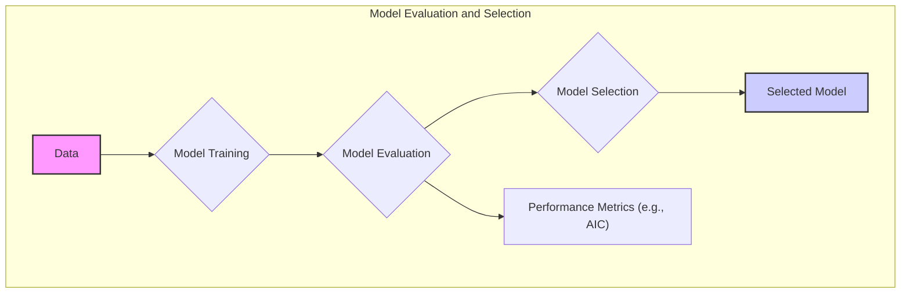
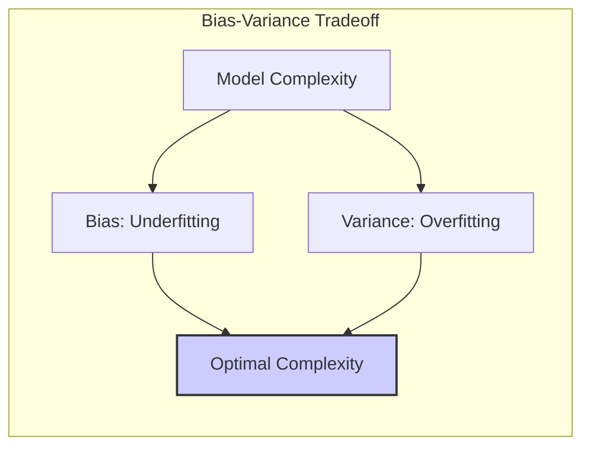
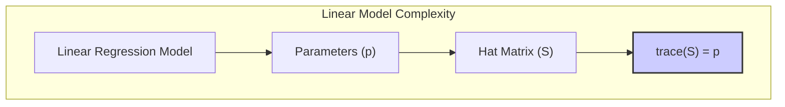
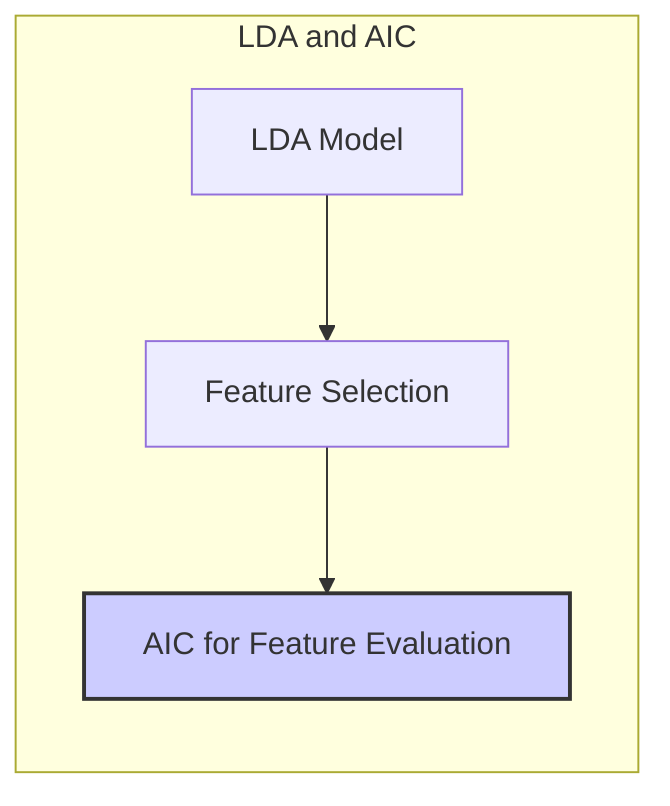
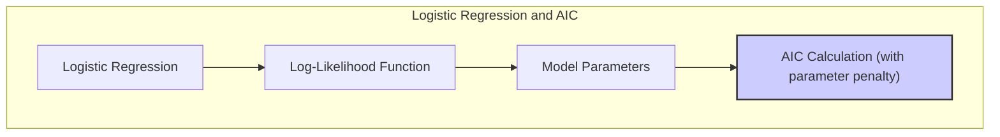
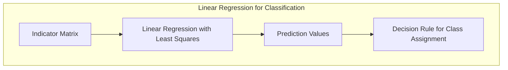
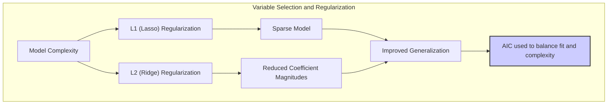
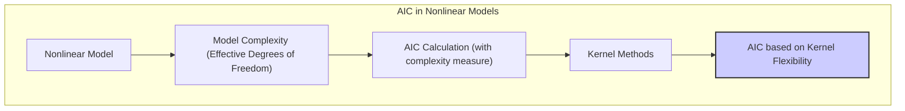

## Avaliação e Seleção de Modelos: Foco no AIC para Modelos Não Lineares



### Introdução
A capacidade de um método de aprendizado generalizar, ou seja, realizar previsões precisas em dados de teste independentes, é fundamental na prática [^7.1]. A avaliação dessa capacidade guia a escolha do método ou modelo, servindo como métrica da qualidade do modelo selecionado [^7.1]. Este capítulo explora os principais métodos de avaliação de desempenho e seleção de modelos, com ênfase no **Akaike Information Criterion (AIC)** para modelos não lineares, considerando a relação entre viés, variância e complexidade do modelo.

### Conceitos Fundamentais

**Conceito 1: Generalização, Viés, Variância e Complexidade do Modelo**
O desempenho de generalização mede a capacidade de um modelo de prever resultados em dados não vistos. Um modelo complexo, com muitos parâmetros, pode se ajustar aos dados de treinamento, reduzindo o **viés**, mas aumentando a **variância**, tornando-se menos capaz de generalizar [^7.2]. Um modelo simples, por outro lado, pode ter alto viés, perdendo detalhes importantes nos dados. O desafio reside em encontrar uma complexidade de modelo que equilibre esses dois fatores, minimizando o erro de teste esperado [^7.2]. O erro de teste é a média do erro de previsão em um conjunto de teste independente e é uma métrica fundamental para medir o quão bem um modelo generaliza para novos dados [^7.2]. A relação entre viés, variância e complexidade do modelo é crucial para entender como um modelo se comporta [^7.2].



> 💡 **Exemplo Numérico:**
>
> Imagine que temos um conjunto de dados simulados com a seguinte relação: $y = 2x + \epsilon$, onde $\epsilon$ é um ruído Gaussiano com média 0 e desvio padrão 1. Vamos usar um modelo linear (grau 1) e um modelo polinomial de grau 5 para ajustar esses dados.
>
> ```python
> import numpy as np
> import matplotlib.pyplot as plt
> from sklearn.linear_model import LinearRegression
> from sklearn.preprocessing import PolynomialFeatures
> from sklearn.metrics import mean_squared_error
>
> # Gerar dados simulados
> np.random.seed(42)
> X = np.sort(np.random.rand(50) * 5)
> y = 2 * X + np.random.randn(50)
> X = X.reshape(-1, 1)
>
> # Dividir dados em treino e teste
> X_train = X[:40]
> X_test = X[40:]
> y_train = y[:40]
> y_test = y[40:]
>
> # Modelo Linear
> model_linear = LinearRegression()
> model_linear.fit(X_train, y_train)
> y_pred_linear = model_linear.predict(X_test)
> mse_linear = mean_squared_error(y_test, y_pred_linear)
>
> # Modelo Polinomial (Grau 5)
> poly = PolynomialFeatures(degree=5)
> X_train_poly = poly.fit_transform(X_train)
> X_test_poly = poly.transform(X_test)
> model_poly = LinearRegression()
> model_poly.fit(X_train_poly, y_train)
> y_pred_poly = model_poly.predict(X_test_poly)
> mse_poly = mean_squared_error(y_test, y_pred_poly)
>
> # Visualização
> plt.figure(figsize=(10, 6))
> plt.scatter(X, y, color='blue', label='Dados reais')
> plt.plot(X_test, y_pred_linear, color='red', label='Regressão Linear')
> plt.plot(X_test, y_pred_poly, color='green', label='Regressão Polinomial (Grau 5)')
> plt.xlabel('X')
> plt.ylabel('y')
> plt.title('Comparação entre Modelos Linear e Polinomial')
> plt.legend()
> plt.show()
>
> print(f'MSE Linear: {mse_linear:.2f}')
> print(f'MSE Polinomial (Grau 5): {mse_poly:.2f}')
> ```
>
> Neste exemplo, o modelo linear (grau 1) tem um viés maior, não capturando completamente a relação dos dados quando há alguma não linearidade (neste caso não há, mas a forma do modelo faz com que isso ocorra). O modelo polinomial (grau 5) pode ajustar os dados de treinamento mais precisamente, mas provavelmente terá uma variância maior e generalizará pior para novos dados. O *mean squared error (MSE)* nos dados de teste mostrará isso (o modelo polinomial terá MSE muito maior em comparação ao modelo linear).

**Lemma 1:** Em modelos lineares, como a regressão linear, a complexidade do modelo está diretamente relacionada ao número de parâmetros (p). Quando modelos são linearmente ajustados por mínimos quadrados, o número de parâmetros pode ser traduzido no traço da matriz *hat* (**S**), onde ŷ = **S**y. Ou seja, a complexidade está relacionada a *trace(S)* [^7.6].



> 💡 **Exemplo Numérico:**
>
> Considere um modelo de regressão linear com 3 preditores e um termo de intercepto.
>
>   $$
>   \mathbf{y} = X\mathbf{\beta} + \mathbf{\epsilon}
>   $$
>
>   Onde $X$ é a matriz de dados com $n$ amostras e 4 colunas (incluindo a coluna de 1s para o intercepto), $\mathbf{\beta}$ são os coeficientes e $\mathbf{y}$ são os valores alvo. A matriz *hat* $\mathbf{S}$ é dada por:
>
>   $$
>   \mathbf{S} = X(X^TX)^{-1}X^T
>   $$
>
>   A complexidade do modelo é medida pelo traço da matriz $\mathbf{S}$, ou seja, $\text{trace}(\mathbf{S})$. Em um modelo de regressão linear padrão com p parâmetros (incluindo o intercepto), $\text{trace}(\mathbf{S}) = p$.
>
>  Se tivermos, por exemplo,  $X$ como:
>
> ```python
> import numpy as np
>
> X = np.array([[1, 2, 3, 4],
>              [1, 3, 4, 5],
>              [1, 4, 5, 6],
>              [1, 5, 6, 7],
>              [1, 6, 7, 8]])
>
> Xt = X.T
> # Cálculo de (X^T * X)
> XtX = Xt @ X
> # Cálculo da inversa de (X^T * X)
> inv_XtX = np.linalg.inv(XtX)
> # Cálculo da matriz Hat S
> S = X @ inv_XtX @ Xt
>
> trace_S = np.trace(S)
>
> print(f"Matriz S:\n{S}")
> print(f"Trace(S): {trace_S:.2f}")
> ```
>
> O traço da matriz $\mathbf{S}$ é igual ao número de parâmetros do modelo (4), demonstrando o Lemma 1. Em geral, para regressão linear, esse valor é exatamente o número de parâmetros, e pode ser entendido como o número de *graus de liberdade* do modelo. Em modelos não lineares, essa relação não é tão direta.

**Conceito 2: Linear Discriminant Analysis (LDA) e sua Relação com o AIC**
Embora o LDA seja um classificador linear, a necessidade de selecionar o número adequado de variáveis preditoras ou componentes em uma transformação pode se beneficiar de critérios de seleção de modelos como o AIC. Em geral, o AIC não é utilizado diretamente no contexto do LDA para otimizar o processo de classificação, pois o LDA é fundamentalmente um método discriminante linear com pressupostos específicos sobre a distribuição dos dados. No entanto, se o objetivo for selecionar features para o LDA ou selecionar um subconjunto de dados transformados para aumentar o desempenho do LDA, o AIC pode ser útil para determinar se a inclusão de mais variáveis ou componentes melhora o modelo ou resulta em *overfitting* [^7.3, 7.3.1, 7.3.2, 7.3.3]. A decisão sobre quais features incluir no modelo LDA pode ser vista como uma escolha da complexidade do modelo. Para modelos Gaussianos, o AIC é equivalente ao Cp [^7.5].



**Corolário 1:**  Sob a suposição de que os dados seguem uma distribuição Gaussiana, a função discriminante linear do LDA pode ser vista como um caso especial de um modelo linear generalizado, no qual a complexidade do modelo pode ser avaliada utilizando o AIC ou estatísticas análogas [^7.5].

**Conceito 3: Regressão Logística e a Função Log-Verossimilhança**
Na regressão logística, que é uma abordagem probabilística para classificação, o modelo estima a probabilidade de uma classe com base em um conjunto de preditores. O processo envolve maximizar a função log-verossimilhança, que quantifica o quão bem o modelo se ajusta aos dados [^7.4, 7.4.1, 7.4.2, 7.4.3, 7.4.4, 7.4.5]. A função log-verossimilhança serve como uma medida de ajuste, e o AIC incorpora uma penalidade para modelos com mais parâmetros. Isso evita o overfitting, que pode ocorrer quando modelos mais complexos são ajustados a um conjunto de treinamento específico, mas não generalizam bem para dados novos [^7.4]. A complexidade do modelo de regressão logística pode ser controlada pelo número de preditores ou pelo uso de termos de interação ou transformação [^7.4.4].



> 💡 **Exemplo Numérico:**
>
> Vamos considerar um problema de classificação binária com 2 preditores, em que a variável resposta é 0 ou 1, e usar a regressão logística. A função de log-verossimilhança para a regressão logística é dada por:
>
>  $$
>   \ell(\beta) = \sum_{i=1}^n [y_i \log(\sigma(x_i^T\beta)) + (1-y_i) \log(1-\sigma(x_i^T\beta))]
>  $$
>
> Onde $\sigma(z) = \frac{1}{1 + e^{-z}}$ é a função sigmoide. O AIC é definido como:
>
>  $$
>  AIC = -2\ell(\hat\beta) + 2k
>  $$
>
>  Onde $\hat\beta$ são os parâmetros estimados e $k$ é o número de parâmetros no modelo.
>
> Suponha que temos dois modelos de regressão logística, um com apenas os dois preditores principais e outro com um termo de interação entre eles. Vamos ajustar ambos os modelos e comparar seus valores de AIC.
>
> ```python
> import numpy as np
> import pandas as pd
> import statsmodels.api as sm
> from sklearn.model_selection import train_test_split
>
> # Gerar dados simulados
> np.random.seed(42)
> n_samples = 100
> X1 = np.random.randn(n_samples)
> X2 = np.random.randn(n_samples)
> y = 1/(1 + np.exp(-(1 + 2*X1 - 3*X2 + 1*X1*X2) + np.random.randn(n_samples))) > 0.5
> y = y.astype(int)
>
> # Criar DataFrame
> data = pd.DataFrame({'X1': X1, 'X2': X2, 'y': y})
>
> # Adicionar intercepto
> data['intercept'] = 1
>
> # Modelo 1: sem interação
> X1 = data[['intercept', 'X1', 'X2']]
> model1 = sm.Logit(data['y'], X1)
> results1 = model1.fit(disp=0) # Não mostrar a iteração de fitting
> log_likelihood1 = results1.llf
> k1 = len(results1.params) # Número de parâmetros
> aic1 = -2 * log_likelihood1 + 2 * k1
>
> # Modelo 2: com interação
> data['X1X2'] = data['X1'] * data['X2']
> X2 = data[['intercept', 'X1', 'X2', 'X1X2']]
> model2 = sm.Logit(data['y'], X2)
> results2 = model2.fit(disp=0)
> log_likelihood2 = results2.llf
> k2 = len(results2.params)
> aic2 = -2 * log_likelihood2 + 2 * k2
>
> print("Modelo 1 (sem interação):")
> print(f"Log-verossimilhança: {log_likelihood1:.2f}")
> print(f"AIC: {aic1:.2f}")
>
> print("\nModelo 2 (com interação):")
> print(f"Log-verossimilhança: {log_likelihood2:.2f}")
> print(f"AIC: {aic2:.2f}")
>
> if aic1 < aic2:
>     print("\nModelo 1 (sem interação) é preferível com base no AIC.")
> else:
>    print("\nModelo 2 (com interação) é preferível com base no AIC.")
>
> ```
>
> Neste exemplo, o modelo com interação tem uma maior log-verossimilhança (ajuste aos dados), mas também tem um maior número de parâmetros. O AIC penaliza o modelo mais complexo, e o modelo com menor AIC seria o preferível.
>

> ⚠️ **Nota Importante:** A regressão logística, embora trate de um problema de classificação, utiliza a função log-verossimilhança que pode ser usada para definir o desvio do modelo, o que é um termo frequentemente utilizado na estatística [^7.4.3].

> ❗ **Ponto de Atenção:** A escolha da função log-verossimilhança apropriada (por exemplo, binomial para regressão logística) é crucial para avaliar o ajuste do modelo corretamente, e essa escolha deve ser guiada pelas características dos dados e da pergunta de pesquisa [^7.4].

> ✔️ **Destaque:** Em modelos logísticos, a regularização (como L1 ou L2) é usada para reduzir a complexidade do modelo, o que pode melhorar o desempenho da generalização, especialmente quando há um número grande de parâmetros [^7.4.4].

### Regressão Linear e Mínimos Quadrados para Classificação


**Explicação:** Este diagrama mostra como a regressão linear é aplicada na classificação utilizando a matriz indicadora de classes.

O uso da regressão linear em uma matriz de indicadores é uma forma de aplicar regressão em problemas de classificação. As classes são codificadas usando uma matriz de indicadores, e a regressão linear é aplicada para prever a classe de cada amostra. As limitações da regressão linear incluem a dificuldade de interpretar os resultados como probabilidades e problemas de extrapolação fora do intervalo [0,1] [^7.1, 7.2]. A relação entre viés e variância surge quando modelos mais complexos (com mais parâmetros) são aplicados a dados que não exigem essa complexidade, e o uso do AIC auxilia no equilíbrio entre ajuste do modelo e generalização [^7.2].

**Lemma 2:**  Em problemas de classificação, a projeção das amostras no espaço de decisão gerado por uma regressão linear das matrizes indicadoras de classe é equivalente a encontrar as funções discriminantes lineares que definem a fronteira de decisão entre as classes. Essa equivalência é demonstrada matematicamente pelas relações entre os coeficientes estimados na regressão e os parâmetros das funções discriminantes. [^7.3].

**Corolário 2:**  A regressão linear aplicada a matrizes indicadoras oferece uma maneira de obter fronteiras de decisão lineares para classificação que são equivalentes a métodos de análise discriminante linear quando os parâmetros são ajustados por mínimos quadrados, e o número de parâmetros pode ser usado como métrica de complexidade no AIC [^7.3].

“A regressão logística, conforme mencionado em [^7.4], tende a fornecer probabilidades mais confiáveis do que a regressão de indicadores, que frequentemente leva a extrapolações inválidas (fora do intervalo \[0,1]). Em algumas situações, a regressão de indicadores, como mostrado em [^7.2], pode ser apropriada quando o objetivo principal é determinar as fronteiras de decisão linear.”

### Métodos de Seleção de Variáveis e Regularização em Classificação



O AIC é fundamental na seleção de variáveis e regularização de modelos de classificação. A complexidade do modelo, controlada pela quantidade de variáveis ou a intensidade da regularização, afeta a capacidade do modelo de generalizar [^7.5]. Penalidades como L1 (Lasso) e L2 (Ridge), aplicadas à regressão logística, afetam o número de variáveis incluídas e a magnitude dos coeficientes, levando a modelos mais interpretáveis e evitando o *overfitting* [^7.4.4]. A função log-verossimilhança, combinada com os termos de penalidade, formam a função de custo que é otimizada durante o ajuste do modelo [^7.4.4].

> 💡 **Exemplo Numérico:**
>
> Suponha que estamos usando regressão logística com 10 preditores e queremos comparar o desempenho de três modelos: um sem regularização, um com regularização L1 (Lasso) e outro com regularização L2 (Ridge). Usaremos o AIC para comparar os modelos.
>
> ```python
> import numpy as np
> import pandas as pd
> import statsmodels.api as sm
> from sklearn.model_selection import train_test_split
> from sklearn.linear_model import LogisticRegression
>
> # Gerar dados simulados
> np.random.seed(42)
> n_samples = 100
> n_features = 10
> X = np.random.randn(n_samples, n_features)
> true_coef = np.array([2, -1, 1.5, 0, 0, 0, 0, -0.5, 0.7, 0.2]) # Alguns coeficientes são zero
> logits = X @ true_coef + np.random.randn(n_samples)
> y = 1/(1 + np.exp(-logits)) > 0.5
> y = y.astype(int)
>
> # Adicionar intercepto
> X = sm.add_constant(X)
>
> # Converter para DataFrame para facilitar
> data = pd.DataFrame(np.hstack((y.reshape(-1, 1), X)))
> data.columns = ['y'] + ['X'+str(i) for i in range(11)]
>
>
> # Modelo 1: Sem regularização
> model_no_reg = sm.Logit(data['y'], data.iloc[:, 1:])
> results_no_reg = model_no_reg.fit(disp=0)
> log_likelihood_no_reg = results_no_reg.llf
> k_no_reg = len(results_no_reg.params)
> aic_no_reg = -2 * log_likelihood_no_reg + 2 * k_no_reg
>
> # Modelo 2: Regularização L1 (Lasso)
> model_l1 = LogisticRegression(penalty='l1', solver='liblinear', C=0.5, random_state=42) #C controla a força da regularização
> model_l1.fit(data.iloc[:, 1:], data['y'])
> log_likelihood_l1 = -model_l1.score(data.iloc[:, 1:], data['y'])*n_samples
> k_l1 = np.sum(model_l1.coef_ != 0) + 1
> aic_l1 = -2 * log_likelihood_l1 + 2 * k_l1
>
> # Modelo 3: Regularização L2 (Ridge)
> model_l2 = LogisticRegression(penalty='l2', C=0.5, random_state=42)
> model_l2.fit(data.iloc[:, 1:], data['y'])
> log_likelihood_l2 = -model_l2.score(data.iloc[:, 1:], data['y'])*n_samples
> k_l2 = np.sum(model_l2.coef_ != 0) + 1
> aic_l2 = -2 * log_likelihood_l2 + 2 * k_l2
>
> # Comparação dos resultados
> print("Modelo sem regularização:")
> print(f"Log-verossimilhança: {log_likelihood_no_reg:.2f}")
> print(f"AIC: {aic_no_reg:.2f}")
> print(f"Número de parâmetros: {k_no_reg}")
>
> print("\nModelo com regularização L1 (Lasso):")
> print(f"Log-verossimilhança: {log_likelihood_l1:.2f}")
> print(f"AIC: {aic_l1:.2f}")
> print(f"Número de parâmetros: {k_l1}")
>
> print("\nModelo com regularização L2 (Ridge):")
> print(f"Log-verossimilhança: {log_likelihood_l2:.2f}")
> print(f"AIC: {aic_l2:.2f}")
> print(f"Número de parâmetros: {k_l2}")
>
> # Encontrar o melhor modelo com base no AIC
> aic_values = [aic_no_reg, aic_l1, aic_l2]
> best_model_index = np.argmin(aic_values)
>
> if best_model_index == 0:
>     print("\nO melhor modelo é o modelo sem regularização.")
> elif best_model_index == 1:
>     print("\nO melhor modelo é o modelo com regularização L1.")
> else:
>      print("\nO melhor modelo é o modelo com regularização L2.")
>
>
> ```
>
> Neste exemplo, o modelo com regularização L1 (Lasso) tende a ter menos parâmetros (devido à esparsidade) e pode apresentar um melhor AIC do que os outros modelos. É importante notar que a escolha do valor de C (inverso da força da regularização) pode afetar esses resultados, e o uso da validação cruzada pode ser crucial para determinar esse parâmetro.

**Lemma 3:** A aplicação da penalidade L1 na regressão logística leva a coeficientes esparsos, ou seja, alguns coeficientes são reduzidos a zero, resultando em um modelo mais simples e com seleção de variáveis intrínseca. Essa esparsidade é resultante do fato de que o L1 tem como solução uma projeção sobre o conjunto dos pesos onde alguns coeficientes são zero [^7.4.4].
**Prova do Lemma 3:** A penalidade L1 adiciona um termo de penalidade que é a soma do valor absoluto dos coeficientes. O efeito é forçar alguns dos coeficientes a serem zero, pois a função não é diferenciável e promove o viés em direção a zero. Isso é formalizado matematicamente pela resolução da otimização, com o multiplicador de Lagrange e as condições KKT [^7.4.3]. $\blacksquare$

**Corolário 3:**  A esparsidade induzida pela penalidade L1 melhora a interpretabilidade dos modelos classificatórios, pois apenas as variáveis mais relevantes são mantidas no modelo final [^7.4.5].

> ⚠️ **Ponto Crucial:**  A combinação das penalidades L1 e L2 (Elastic Net) permite aproveitar as vantagens de ambos os tipos de regularização, combinando a seleção de variáveis da L1 com a estabilidade da L2 [^7.5].

### Separating Hyperplanes e Perceptrons

A ideia de maximizar a margem de separação leva ao conceito de hiperplanos ótimos em algoritmos como o Support Vector Machine (SVM) [^7.5.2]. O AIC não é diretamente utilizado nesse contexto porque o SVM maximiza a margem de separação, mas a complexidade do modelo é definida pela função kernel que pode ser escolhida por validação cruzada. No contexto de Perceptrons, que é um algoritmo mais simples para encontrar hiperplanos separadores, a complexidade é dada pelo número de épocas de treinamento e parâmetros ajustados e o AIC pode ser usado para avaliar o overfitting [^7.5.1].

### Pergunta Teórica Avançada: Como o AIC Se Encaixa em Modelos Não Lineares e em Métodos de Kernel?
**Resposta:**
Em modelos não lineares, a complexidade não é tão simples quanto o número de parâmetros em um modelo linear. Em vez disso, a complexidade está relacionada à forma da função não linear e aos parâmetros que a governam. O AIC, nesses casos, usa uma medida da complexidade que corresponde aos *effective degrees of freedom*, que reflete quão flexível o modelo é para se ajustar aos dados. Quando se utiliza *kernels* (como em SVMs), a complexidade é definida por quão flexível é o kernel e também pode ser avaliada com o AIC se o modelo tiver uma função de verossimilhança. O AIC penaliza modelos mais complexos para evitar o *overfitting*, conforme [^7.5].



> 💡 **Exemplo Numérico:**
>
> Em um modelo de regressão com um kernel gaussiano, a complexidade é afetada pela largura do kernel (o parâmetro σ) e também pelo parâmetro de regularização (C). O AIC pode ser usado para avaliar o efeito desses parâmetros, embora a contagem direta de parâmetros não seja trivial nesse caso.
>
> ```python
> import numpy as np
> from sklearn.svm import SVR
> from sklearn.metrics import mean_squared_error
> from sklearn.model_selection import train_test_split
> from scipy.optimize import minimize
>
> # Gerar dados simulados
> np.random.seed(42)
> X = np.sort(np.random.rand(50) * 10)
> y = np.sin(X) + np.random.randn(50) * 0.1
> X = X.reshape(-1, 1)
>
> # Dividir dados em treino e teste
> X_train = X[:40]
> X_test = X[40:]
> y_train = y[:40]
> y_test = y[40:]
>
> # Definir o modelo SVR com Kernel Gaussiano
> def fit_svr(X_train, y_train, C, gamma):
>    svr = SVR(kernel='rbf', C=C, gamma=gamma)
>    svr.fit(X_train, y_train)
>    return svr
>
> def calculate_aic(svr, X, y):
>    y_pred = svr.predict(X)
>    mse = mean_squared_error(y, y_pred)
>    n = len(y)
>    # Approximation for effective degrees of freedom (trace of hat matrix for SVR can be complex to compute)
>    k = len(svr.support_) # Use number of support vectors as proxy
>    aic = n * np.log(mse) + 2 * k
>    return aic
>
> # Comparar modelos com diferentes valores de C e gamma
> C_values = [0.1, 1, 10]
> gamma_values = [0.1, 1, 10]
>
> results = []
>
> for C in C_values:
>    for gamma in gamma_values:
>       svr = fit_svr(X_train, y_train, C, gamma)
>       aic = calculate_aic(svr, X_train, y_train)
>       y_pred_test = svr.predict(X_test)
>       mse_test = mean_squared_error(y_test, y_pred_test)
>       results.append({'C': C, 'gamma': gamma, 'AIC': aic, 'MSE Test': mse_test})
>
> results_df = pd.DataFrame(results)
> print(results_df)
>
> best_model = results_df.loc[results_df['AIC'].idxmin()]
> print(f"\nBest model based on AIC: {best_model}")
> ```
>
>  O código acima testa vários valores para os hiperparâmetros `C` e `gamma` de uma Support Vector Machine para regressão (SVR), e usa o AIC para escolher o melhor modelo. É importante notar que o cálculo do número de parâmetros para métodos de kernel não é trivial, e aqui usamos o número de *vetores de suporte* como uma aproximação da complexidade do modelo.

**Lemma 4:** O AIC para modelos lineares com ruído Gaussiano é equivalente à estatística Cp. A prova é feita a partir da derivação das equações do AIC para modelos lineares generalizados [^7.5].
**Corolário 4:** Para modelos não lineares, a estimativa do *effective number of parameters* é um desafio, e diferentes aproximações podem ser utilizadas, como o *trace* da matriz *hat* para alguns casos lineares, e um parâmetro empírico como o *shrinkage parameter*. Os métodos de regularização, como o uso de *kernels* com penalidades, também são utilizados [^7.6].

> ⚠️ **Ponto Crucial:** O uso do AIC em modelos não lineares requer atenção para a definição de complexidade, que pode variar dependendo da classe de modelos e o AIC pode ser usado para avaliar o efeito dessa complexidade [^7.5].

### Conclusão
A avaliação e seleção de modelos são etapas cruciais em qualquer análise de dados. Métodos como o AIC fornecem ferramentas para medir a complexidade e otimizar modelos com o objetivo de alcançar generalizações sólidas. No contexto de modelos não lineares, a aplicação do AIC exige uma compreensão clara de como a complexidade do modelo é definida e como os diferentes métodos de regularização podem ser incorporados no processo de escolha do modelo.

### Footnotes
[^7.1]: "The generalization performance of a learning method relates to its prediction capability on independent test data. Assessment of this performance is extremely important in practice, since it guides the choice of learning method or model, and gives us a measure of the quality of the ultimately chosen model." *(Trecho de *The Elements of Statistical Learning*)*
[^7.2]: "Figure 7.1 illustrates the important issue in assessing the ability of a learning method to generalize. Consider first the case of a quantitative or interval scale response. We have a target variable Y, a vector of inputs X, and a prediction model f(X) that has been estimated from a training set T." *(Trecho de *The Elements of Statistical Learning*)*
[^7.3]: "The story is similar for a qualitative or categorical response G taking one of K values in a set G, labeled for convenience as 1, 2, ..., K. Typically we model the probabilities pk(X) = Pr(G = k|X) (or some monotone transformations fk(X)), and then Ĝ(X) = arg maxk Îk(X)." *(Trecho de *The Elements of Statistical Learning*)*
[^7.3.1]: "Test error, also referred to as generalization error, is the prediction error over an independent test sample" *(Trecho de *The Elements of Statistical Learning*)*
[^7.3.2]: "where both X and Y are drawn randomly from their joint distribution (population). Here the training set T is fixed, and test error refers to the error for this specific training set." *(Trecho de *The Elements of Statistical Learning*)*
[^7.3.3]: "A related quantity is the expected prediction error (or expected test error) Err = E[L(Y, f(