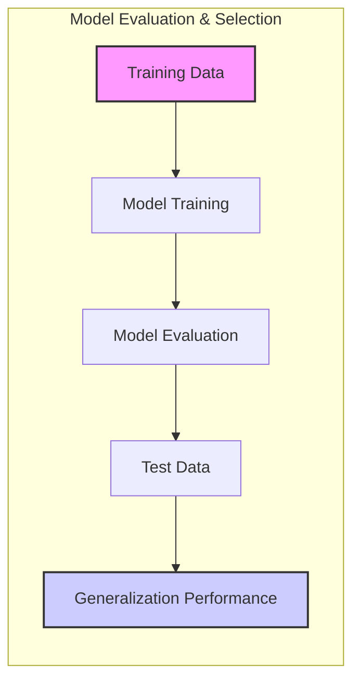
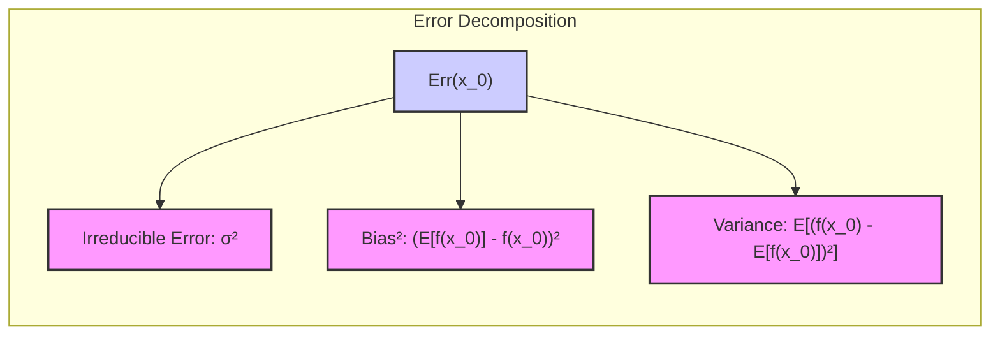
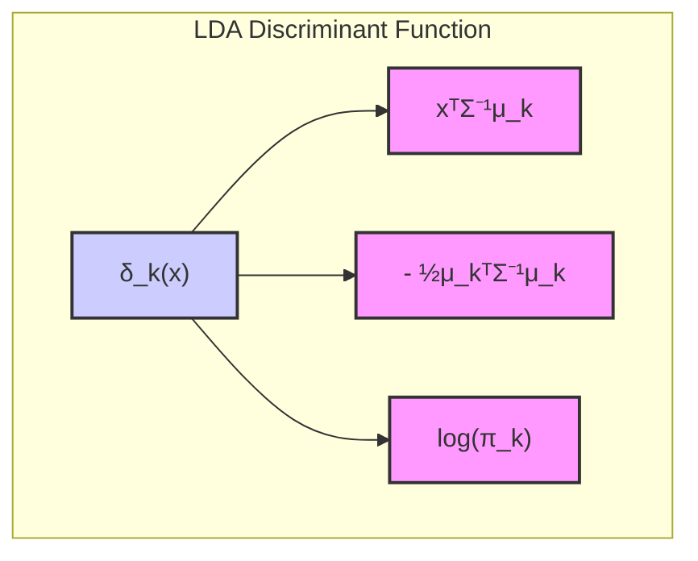
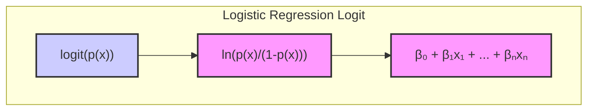
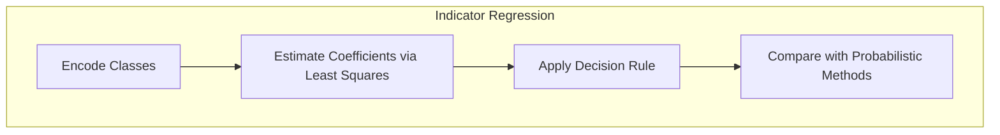
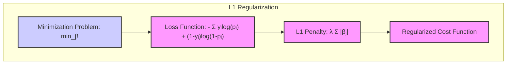
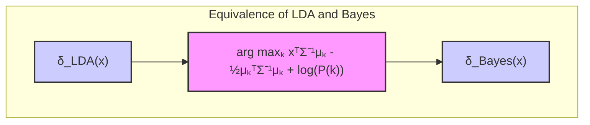

## Avaliação e Seleção de Modelos: Uma Análise Detalhada da Estatística $C_p$

### Introdução

A capacidade de um método de aprendizado de generalizar para dados não vistos é crucial. Esta capacidade, conhecida como **generalização**, é avaliada através da performance do modelo em *dados de teste independentes*, que não foram usados no treinamento. Avaliar esta performance é fundamental para a escolha do modelo ou método de aprendizado mais adequado e para quantificar a qualidade do modelo final [^7.1]. Este capítulo explora métodos para avaliação de performance, com foco na estatística $C_p$, e sua aplicação na seleção de modelos, começando com uma análise da interação entre viés, variância e complexidade do modelo.

### Conceitos Fundamentais

**Conceito 1: Problema de Classificação e Generalização**

O objetivo central do problema de classificação é construir um modelo capaz de atribuir corretamente rótulos de classe a novas instâncias de dados. O modelo é treinado em um conjunto de dados e avaliado com outro conjunto independente [^7.1]. A capacidade do modelo de *generalizar*, ou seja, de ter bom desempenho em dados não vistos, é um indicador da sua utilidade real. Métodos lineares podem ser eficientes em certas situações, mas o viés e a variância são fatores críticos que devem ser considerados. Um modelo simples (com poucos parâmetros) pode sofrer de **alto viés**, errando de forma consistente ao tentar representar um padrão complexo, enquanto um modelo complexo (com muitos parâmetros) pode ter **alta variância**, sendo excessivamente sensível a variações nos dados de treinamento, o que leva a um ajuste ruim para novos dados. A figura 7.1 ilustra esse tradeoff [^7.2].

> 💡 **Exemplo Numérico:** Imagine um cenário onde queremos classificar e-mails como "spam" ou "não spam" com base no número de palavras e na presença de certos caracteres especiais. Um modelo muito simples, como um classificador baseado apenas no número de palavras, pode ter alto viés (sempre classifica erroneamente e-mails com certas palavras-chave, por exemplo). Por outro lado, um modelo muito complexo, como uma rede neural com muitas camadas, pode se ajustar perfeitamente aos dados de treinamento (classificando todos os e-mails corretamente no conjunto de treino), mas ter alta variância e falhar ao classificar novos e-mails, pois memorizou os ruídos específicos do conjunto de treinamento.

**Lemma 1:** *Decomposição do Erro de Predição*

Para entender o tradeoff viés-variância, podemos decompor o erro de predição esperado de um modelo $f(x)$ em um ponto $x_0$ [^7.3]:

$$
Err(x_0) = E[(Y - f(x_0))^2 | X = x_0] = \sigma^2 + [Ef(x_0) - f(x_0)]^2 + E[f(x_0) - Ef(x_0)]^2
$$

Onde:
- $\sigma^2$ é a variância do erro aleatório, inerradicável.
- $[Ef(x_0) - f(x_0)]^2$ é o viés ao quadrado, que mede o quão distante a média da predição está do valor real.
- $E[f(x_0) - Ef(x_0)]^2$ é a variância, que indica a variabilidade das predições do modelo.
Em particular, o erro de predição é a soma do erro irredutível, o quadrado do viés e a variância.

$\blacksquare$

> 💡 **Exemplo Numérico:** Suponha que o valor real de uma variável dependente $Y$ para uma dada entrada $x_0$ seja $y_0 = 5$. Temos um modelo que, ao ser treinado várias vezes com conjuntos de dados diferentes (mas seguindo a mesma distribuição), produz as seguintes predições para $x_0$: 4, 6, 5, 7, 3.
>
> *   **Erro Irredutível ($\sigma^2$):** Suponha que a variância do ruído aleatório seja $\sigma^2 = 0.5$. Este é o erro que não podemos evitar.
> *   **Viés:** A média das predições é $E[f(x_0)] = (4+6+5+7+3)/5 = 5$. O viés é $[E[f(x_0)] - y_0]^2 = (5-5)^2 = 0$. Neste caso, o modelo é não viesado. Se a média fosse 6, o viés seria $(6-5)^2 = 1$.
> *   **Variância:** A variância das predições é  $E[f(x_0) - Ef(x_0)]^2 = [(4-5)^2+(6-5)^2+(5-5)^2+(7-5)^2+(3-5)^2]/5 = (1+1+0+4+4)/5 = 2$.
> *   **Erro Total:** O erro de predição esperado seria $Err(x_0) = 0.5 + 0 + 2 = 2.5$.
>
> Isso demonstra como o erro total pode ser decomposto nessas três parcelas. O objetivo é escolher um modelo que minimize esse erro, e isso geralmente envolve um equilíbrio entre viés e variância.

**Conceito 2: Linear Discriminant Analysis (LDA)**

LDA é um método clássico de classificação que assume que as classes possuem **distribuições gaussianas** com a mesma matriz de covariância [^7.3]. A ideia central da LDA é encontrar a projeção linear dos dados que maximiza a separação entre as classes, enquanto minimiza a variância dentro de cada classe. LDA deriva uma fronteira de decisão linear através da estimativa das médias de cada classe e da matriz de covariância combinada, assumindo uma covariância comum para todas as classes [^7.3.1, 7.3.2, 7.3.3]. A fronteira de decisão é determinada através da maximização da distância entre as médias projetadas, enquanto se minimiza a dispersão dos pontos dentro de cada classe.

**Corolário 1:** *Relação entre a Função Discriminante Linear e a Projeção*

A função discriminante linear em LDA, dada por:

$$
\delta_k(x) = x^T \Sigma^{-1} \mu_k - \frac{1}{2} \mu_k^T \Sigma^{-1} \mu_k + log(\pi_k)
$$

onde $\mu_k$ é a média da classe $k$, $\Sigma$ é a matriz de covariância conjunta e $\pi_k$ é a probabilidade a priori da classe $k$, é equivalente à projeção dos dados em um subespaço que maximiza a razão entre a variância entre classes e a variância intra-classe [^7.3.1].

$\blacksquare$

> 💡 **Exemplo Numérico:** Suponha que temos duas classes de dados, cada uma seguindo uma distribuição gaussiana, com as seguintes médias e matriz de covariância conjunta:
>
> *   Classe 1: $\mu_1 = \begin{bmatrix} 1 \\ 2 \end{bmatrix}$
> *   Classe 2: $\mu_2 = \begin{bmatrix} 3 \\ 4 \end{bmatrix}$
> *   Matriz de covariância conjunta: $\Sigma = \begin{bmatrix} 1 & 0.5 \\ 0.5 & 1 \end{bmatrix}$
>
> A probabilidade a priori é $\pi_1 = \pi_2 = 0.5$. Para classificar um novo ponto $x = \begin{bmatrix} 2 \\ 3 \end{bmatrix}$, primeiro calculamos $\Sigma^{-1}$:
>
> $\Sigma^{-1} = \frac{1}{1 - 0.5^2} \begin{bmatrix} 1 & -0.5 \\ -0.5 & 1 \end{bmatrix} =  \begin{bmatrix} 1.33 & -0.66 \\ -0.66 & 1.33 \end{bmatrix}$
>
>  Agora, calculamos as funções discriminantes para cada classe:
>
> $\delta_1(x) =  \begin{bmatrix} 2 & 3 \end{bmatrix} \begin{bmatrix} 1.33 & -0.66 \\ -0.66 & 1.33 \end{bmatrix} \begin{bmatrix} 1 \\ 2 \end{bmatrix} - \frac{1}{2} \begin{bmatrix} 1 & 2 \end{bmatrix} \begin{bmatrix} 1.33 & -0.66 \\ -0.66 & 1.33 \end{bmatrix} \begin{bmatrix} 1 \\ 2 \end{bmatrix} + \log(0.5)$
>
> $\delta_1(x) = 2.66 - 1.98 - 0.66 + 3.99  - \frac{1}{2}(1.33 - 2.66 - 1.33 + 5.32) + \log(0.5) \approx 3.32 - 1.33 -0.69 = 1.30$
>
> $\delta_2(x) =  \begin{bmatrix} 2 & 3 \end{bmatrix} \begin{bmatrix} 1.33 & -0.66 \\ -0.66 & 1.33 \end{bmatrix} \begin{bmatrix} 3 \\ 4 \end{bmatrix} - \frac{1}{2} \begin{bmatrix} 3 & 4 \end{bmatrix} \begin{bmatrix} 1.33 & -0.66 \\ -0.66 & 1.33 \end{bmatrix} \begin{bmatrix} 3 \\ 4 \end{bmatrix} + \log(0.5)$
>
> $\delta_2(x) = 3.99 - 1.98 - 1.98 + 5.32  - \frac{1}{2}(11.97-7.92-7.92 + 21.28) + \log(0.5) \approx 4.83 - 11.20 - 0.69 = -7.06$
>
> Como $\delta_1(x) > \delta_2(x)$, classificamos o ponto $x$ como pertencente à Classe 1.

**Conceito 3: Regressão Logística**

A regressão logística modela a probabilidade de uma variável binária através de uma função logística aplicada a uma combinação linear das variáveis preditoras [^7.4]. A regressão logística usa a transformação *logit* na probabilidade de uma classe:

$$
logit(p(x)) = \ln\left(\frac{p(x)}{1-p(x)}\right) = \beta_0 + \beta_1 x_1 + \ldots + \beta_n x_n
$$

onde $p(x)$ é a probabilidade de uma instância pertencer a uma das classes. Os parâmetros são estimados por **máxima verossimilhança**, otimizando a função log-verossimilhança dos dados de treinamento [^7.4.2, 7.4.3, 7.4.4, 7.4.5].
Enquanto LDA é mais eficiente com dados que seguem distribuições gaussianas, regressão logística é mais flexível e pode ser usada quando essa suposição não é válida. Regressão logística também não assume uma matriz de covariância comum e lida bem com classes não-balanceadas. A escolha entre LDA e regressão logística depende da distribuição dos dados e dos objetivos do modelo [^7.4].

> ⚠️ **Nota Importante**: A regressão logística oferece uma abordagem probabilística, enquanto a LDA é mais focada em encontrar a melhor separação linear das classes. [^7.4.1]
> ❗ **Ponto de Atenção**: Em situações onde as classes são altamente desbalanceadas, a regressão logística pode requerer técnicas de balanceamento para garantir estimativas mais confiáveis. [^7.4.2]
> ✔️ **Destaque**: Os coeficientes obtidos por LDA e regressão logística podem apresentar correlações, especialmente quando os dados satisfazem as suposições de LDA. [^7.5]

> 💡 **Exemplo Numérico:** Suponha que queremos modelar a probabilidade de um cliente comprar um produto (1 = compra, 0 = não compra) com base em sua idade ($x_1$) e renda ($x_2$). Após ajustar um modelo de regressão logística, obtivemos os seguintes coeficientes: $\beta_0 = -5$, $\beta_1 = 0.1$, e $\beta_2 = 0.002$. Então, para um cliente com 30 anos e renda de 5000, o logit é:
>
> $logit(p(x)) = -5 + 0.1 \cdot 30 + 0.002 \cdot 5000 = -5 + 3 + 10 = 8$.
>
>  A probabilidade de compra é:
>
> $p(x) = \frac{e^{logit(p(x))}}{1 + e^{logit(p(x))}} = \frac{e^8}{1 + e^8} \approx 0.9997$.
>
> Isso significa que este cliente tem uma probabilidade muito alta de comprar o produto, de acordo com o modelo.

### Regressão Linear e Mínimos Quadrados para Classificação

A regressão linear, ajustada usando o método de mínimos quadrados, pode ser aplicada para problemas de classificação através da codificação das classes com variáveis indicadoras [^7.2]. Em um problema de classificação com $K$ classes, cada classe é representada por um vetor binário de tamanho $K$, onde a posição correspondente à classe é 1 e as outras são 0. Em seguida, um modelo de regressão linear é ajustado para cada classe. A predição é feita atribuindo a nova observação à classe cujo modelo de regressão tiver a maior saída. Apesar de simples, a regressão de indicadores pode sofrer com suas limitações, como a extrapolação para fora do intervalo \[0, 1]. Ela pode não ser adequada para classes não-balanceadas ou quando a relação entre os preditores e as classes não é linear [^7.1, 7.2].

> 💡 **Exemplo Numérico:** Em um problema de classificação com três classes (A, B e C), usamos a codificação de variáveis indicadoras. Assim, as classes são representadas por vetores:
>
> *   Classe A: [1, 0, 0]
> *   Classe B: [0, 1, 0]
> *   Classe C: [0, 0, 1]
>
>  Suponha que temos duas variáveis preditoras ($x_1$ e $x_2$), e após ajustar três modelos de regressão linear (um para cada classe), temos os seguintes coeficientes:
>
> *   Classe A: $f_A(x) = 0.5 + 0.2x_1 - 0.1x_2$
> *   Classe B: $f_B(x) = -0.1 + 0.1x_1 + 0.3x_2$
> *   Classe C: $f_C(x) = -0.2 - 0.2x_1 + 0.1x_2$
>
> Para um novo ponto $x = \begin{bmatrix} 2 \\ 1 \end{bmatrix}$, calculamos a saída para cada modelo:
>
> *   $f_A(x) = 0.5 + 0.2(2) - 0.1(1) = 0.8$
> *   $f_B(x) = -0.1 + 0.1(2) + 0.3(1) = 0.4$
> *   $f_C(x) = -0.2 - 0.2(2) + 0.1(1) = -0.5$
>
> Classificamos o ponto $x$ como pertencente à Classe A, pois $f_A(x)$ tem a maior saída. No entanto, note que as saídas dos modelos podem ser valores fora do intervalo [0,1], como previsto na teoria.

**Lemma 2:** *Projeções Lineares e Discriminantes*

Em certas condições, as projeções nos hiperplanos de decisão gerados pela regressão linear de indicadores podem ser equivalentes às projeções obtidas através da análise discriminante linear (LDA). Esta equivalência ocorre quando as classes são bem separadas e as covariâncias entre as classes são semelhantes.

$\blacksquare$

**Corolário 2:** *Simplificação da Análise do Modelo*

Esta equivalência pode simplificar a análise do modelo em alguns casos, permitindo utilizar as ferramentas teóricas e matemáticas de LDA para entender o comportamento da regressão de indicadores. Contudo, a regressão de indicadores pode apresentar problemas como o "*masking problem*", que ocorre quando a estrutura linear subjacente dos dados não é bem capturada pelas classes, o que afeta a performance da regressão de indicadores [^7.3].

"Em alguns cenários, conforme apontado em [^7.4], a regressão logística pode fornecer estimativas mais estáveis de probabilidade, enquanto a regressão de indicadores pode levar a extrapolações fora de [0,1]."

"No entanto, há situações em que a regressão de indicadores, de acordo com [^7.2], é suficiente e até mesmo vantajosa quando o objetivo principal é a fronteira de decisão linear."

### Métodos de Seleção de Variáveis e Regularização em Classificação

A seleção de variáveis e a regularização são métodos para lidar com problemas onde um modelo com muitos parâmetros pode levar ao *overfitting* [^7.5]. A regularização adiciona um termo de penalidade à função de custo, controlando a complexidade do modelo. A penalização $L_1$ (Lasso) promove a esparsidade de parâmetros, zerando os coeficientes de variáveis menos relevantes [^7.4.4]. A penalização $L_2$ (Ridge) reduz a magnitude dos parâmetros, melhorando a estabilidade e a generalização do modelo. Elas são aplicadas em regressão logística como termos de penalidade, alterando a função de otimização e consequentemente, as estimativas dos parâmetros.  A penalização $L_1$ em modelos logísticos leva a coeficientes esparsos, que facilitam a interpretação do modelo ao selecionar as variáveis mais relevantes para o problema.

> 💡 **Exemplo Numérico:** Suponha que temos um modelo de regressão logística com 5 variáveis preditoras: $x_1, x_2, x_3, x_4, x_5$. O modelo original (sem regularização) tem os coeficientes: $\beta = [2, -1.5, 0.8, 0.2, -0.1]$.
>
> *   **Regressão Logística com penalização L1 (Lasso):** Ao aplicar a regularização L1 com $\lambda = 1$, os coeficientes estimados podem ser $\beta_{L1} = [1.2, -0.5, 0, 0, 0]$. Observe que os coeficientes de $x_3, x_4$ e $x_5$ foram zerados, indicando que essas variáveis são consideradas menos importantes pelo modelo.
> *   **Regressão Logística com penalização L2 (Ridge):** Ao aplicar a regularização L2 com $\lambda = 1$, os coeficientes estimados podem ser $\beta_{L2} = [1.8, -1.3, 0.6, 0.1, -0.05]$. Os coeficientes foram reduzidos em magnitude, mas nenhum foi exatamente zerado.
>
> A regularização L1 promove a seleção de variáveis, enquanto a regularização L2 reduz a influência de todas as variáveis, tornando o modelo mais estável.

**Lemma 3:** *Esparsidade com Penalização $L_1$*

A penalização $L_1$ (Lasso) na regressão logística leva a coeficientes esparsos, pois a natureza da penalidade induz alguns coeficientes a serem exatamente zero. Matematicamente, o problema de otimização com penalização $L_1$ na regressão logística é:

$$
\min_{\beta} \left[ -\sum_{i=1}^N y_i \log(p_i) + (1-y_i)\log(1-p_i)  + \lambda \sum_{j=1}^p |\beta_j| \right]
$$
onde $\lambda$ controla a força da penalização e, para valores suficientemente altos, zera alguns $\beta_j$, promovendo a esparsidade.

$\blacksquare$

**Prova do Lemma 3:** A penalização $L_1$, que é a soma dos valores absolutos dos coeficientes, força os coeficientes de variáveis menos relevantes a serem exatamente zero. Este comportamento é resultado da forma do contorno da penalidade $L_1$ na função de otimização. A penalização $L_2$, por outro lado, reduz a magnitude dos parâmetros, mas geralmente não os leva a zero, permitindo que todos os preditores influenciem o modelo, ainda que com magnitudes diferentes. A escolha entre $L_1$ e $L_2$ depende das características específicas do problema e do objetivo da modelagem [^7.4.3, 7.4.4].

$\blacksquare$

**Corolário 3:** *Interpretabilidade e Penalização $L_1$*

Modelos com penalização $L_1$ são mais interpretáveis devido à esparsidade dos coeficientes. A seleção de variáveis é feita automaticamente durante o ajuste do modelo, selecionando apenas um subconjunto de preditores mais importantes [^7.4.5].

> ⚠️ **Ponto Crucial**:  A combinação das penalizações L1 e L2, conhecida como Elastic Net, pode ser utilizada para obter modelos mais esparsos (L1) e estáveis (L2), aproveitando as vantagens de ambos os tipos de regularização. [^7.5]

### Separating Hyperplanes e Perceptrons

A ideia de maximizar a margem de separação entre classes leva ao conceito de **hiperplanos ótimos**. Esses hiperplanos são soluções de problemas de otimização que visam encontrar uma fronteira de decisão que maximize a distância entre as classes. A formulação deste problema leva ao conceito de dualidade de Wolfe, que transforma o problema original em um problema mais simples de resolver [^7.5.2]. As soluções são combinações lineares dos pontos de suporte, que são as amostras mais próximas da fronteira de decisão.

O Perceptron de Rosenblatt é um algoritmo simples que tenta encontrar um hiperplano que separa as classes, aprendendo os pesos dos preditores através de um algoritmo iterativo. O Perceptron converge para uma solução se os dados forem linearmente separáveis, e sua simplicidade o torna um algoritmo fundamental na história do aprendizado de máquina [^7.5.1].

> 💡 **Exemplo Numérico:** Imagine que temos duas classes, representadas por círculos azuis e vermelhos, em um espaço bidimensional. As coordenadas de alguns pontos são:
>
> *   Azul: (1, 1), (2, 2), (1, 2)
> *   Vermelho: (3, 1), (3, 2), (2, 3)
>
> O Perceptron tenta encontrar uma linha (hiperplano em 2D) que separa esses pontos. Inicialmente, os pesos do Perceptron são inicializados aleatoriamente (por exemplo, $w = [0.1, -0.2]$, $b = 0$).
>
> O Perceptron itera sobre os dados de treinamento:
>
> 1.  Para o ponto (1,1): $w \cdot x + b = 0.1 \cdot 1 + -0.2 \cdot 1 + 0 = -0.1$. Como o resultado é negativo e o ponto é azul (classe 1), a predição está correta e os pesos não são atualizados.
> 2.  Para o ponto (3,1): $w \cdot x + b = 0.1 \cdot 3 + -0.2 \cdot 1 + 0 = 0.1$. Como o resultado é positivo e o ponto é vermelho (classe -1), a predição está correta e os pesos não são atualizados.
> 3.  Para o ponto (2, 2): $w \cdot x + b = 0.1 \cdot 2 + -0.2 \cdot 2 + 0 = -0.2$. Como o resultado é negativo e o ponto é azul (classe 1), a predição está correta e os pesos não são atualizados.
> 4.  Para o ponto (3,2): $w \cdot x + b = 0.1 \cdot 3 + -0.2 \cdot 2 + 0 = -0.1$. Como o resultado é negativo e o ponto é vermelho (classe -1), a predição está incorreta.
>     *   Atualizamos os pesos: $w_{novo} = w_{antigo} + \eta \cdot x \cdot y = [0.1, -0.2] + 0.1 \cdot [3, 2] \cdot (-1) = [-0.2, -0.4]$. $b = 0 + \eta \cdot y = 0 -0.1=-0.1$
>
> O Perceptron continua atualizando os pesos e o bias, iterando sobre os pontos, até convergir para um hiperplano que separa as classes. A taxa de aprendizagem ($\eta$) controla o quão rápido os pesos são atualizados.

### Pergunta Teórica Avançada: Quais as diferenças fundamentais entre a formulação de LDA e a Regra de Decisão Bayesiana considerando distribuições Gaussianas com covariâncias iguais?

**Resposta:**

A Análise Discriminante Linear (LDA) e a Regra de Decisão Bayesiana, sob a hipótese de distribuições gaussianas com covariâncias iguais, compartilham uma formulação semelhante, mas com abordagens e objetivos diferentes. A LDA é um método redutor de dimensionalidade e classificação, que procura projetar os dados em um subespaço onde as classes sejam mais separadas, enquanto a Regra de Decisão Bayesiana é uma regra de classificação que minimiza a probabilidade de erro, assumindo conhecimento sobre a distribuição das classes.

Sob a hipótese de classes gaussianas com covariâncias iguais ($\Sigma_k = \Sigma, \forall k$), a regra de decisão bayesiana é:
$$
\hat{y} = \arg \max_{k} p(x|k)p(k) =  \arg \max_{k} -\frac{1}{2}(x - \mu_k)^T \Sigma^{-1}(x - \mu_k) + \log(P(k))
$$

O termo quadrático na regra Bayesiana pode ser simplificado, após expansão, resultando em:
$$
\hat{y} =  \arg \max_{k} x^T\Sigma^{-1}\mu_k - \frac{1}{2}\mu_k^T\Sigma^{-1}\mu_k + \log(P(k))
$$

Essa última expressão é a função discriminante linear utilizada no LDA, onde o hiperplano separador é definido por:
$$
x^T\Sigma^{-1}(\mu_1 - \mu_2) - \frac{1}{2}(\mu_1^T\Sigma^{-1}\mu_1 - \mu_2^T\Sigma^{-1}\mu_2) = 0
$$

Esta igualdade indica que, sob a restrição de covariâncias iguais, LDA e o classificador Bayesiano compartilham a mesma função discriminante linear, sendo suas decisões equivalentes [^7.3]. A escolha de $\mu$ (médias de classe) e $\Sigma$ (matriz de covariância comum) são cruciais, uma vez que a projeção e separação das classes dependem desses parâmetros [^7.3].

**Lemma 4:** *Equivalência Formal*

Sob a suposição de distribuições gaussianas com covariância iguais, os limites de decisão calculados pelo LDA e a Regra de Decisão Bayesiana são equivalentes.

$$
\delta_{LDA}(x) =  \arg \max_{k} x^T\Sigma^{-1}\mu_k - \frac{1}{2}\mu_k^T\Sigma^{-1}\mu_k + \log(P(k)) = \delta_{Bayes}(x)
$$

$\blacksquare$

**Corolário 4:** *Fronteiras Quadráticas e QDA*

Ao relaxar a hipótese de covariâncias iguais, ou seja $\Sigma_k \neq \Sigma_j$, as fronteiras de decisão resultantes são quadráticas. Isto leva à Análise Discriminante Quadrática (QDA), que utiliza funções discriminantes quadráticas e pode modelar relações mais complexas [^7.3].

> ⚠️ **Ponto Crucial**: A hipótese de covariâncias iguais leva a fronteiras lineares de decisão em LDA, enquanto a hipótese de covariâncias diferentes leva a fronteiras quadráticas. [^7.3.1]

### Conclusão

A avaliação e seleção de modelos são etapas cruciais no processo de aprendizado de máquina. Este capítulo explorou os conceitos fundamentais da avaliação da performance de modelos, incluindo a estatística $C_p$, e a importância do tradeoff viés-variância. Foram apresentados e analisados métodos como LDA e Regressão Logística. A escolha do modelo ideal é um processo que depende das características específicas do problema, da distribuição dos dados e da complexidade do modelo desejado. A utilização correta de técnicas de regularização e validação cruzada pode auxiliar na construção de modelos que generalizam bem para dados não vistos e, portanto, que serão mais eficientes em aplicações do mundo real.
<!-- END DOCUMENT -->
### Footnotes
[^7.1]: "The generalization performance of a learning method relates to its prediction capability on independent test data. Assessment of this performance is extremely important in practice, since it guides the choice of learning method or model, and gives us a measure of the quality of the ultimately chosen model." *(Trecho de "Model Assessment and Selection")*
[^7.2]: "Figure 7.1 illustrates the important issue in assessing the ability of a learning method to generalize. Consider first the case of a quantitative or interval scale response. We have a target variable Y, a vector of inputs X, and a prediction model f(X) that has been estimated from a training set T." *(Trecho de "Model Assessment and Selection")*
[^7.3]:  "As in Chapter 2, if we assume that Y = f(X) + ε where E(ε) = 0 and Var(ε) = σε, we can derive an expression for the expected prediction error of a regression fit f(X) at an input point X = x0, using squared-error loss:" *(Trecho de "Model Assessment and Selection")*
[^7.3.1]: "The first term is the variance of the target around its true mean f(x0), and cannot be avoided no matter how well we estimate f(x0), unless σε = 0." *(Trecho de "Model Assessment and Selection")*
[^7.3.2]: "The second term is the squared bias, the amount by which the average of our estimate differs from the true mean; the last term is the variance